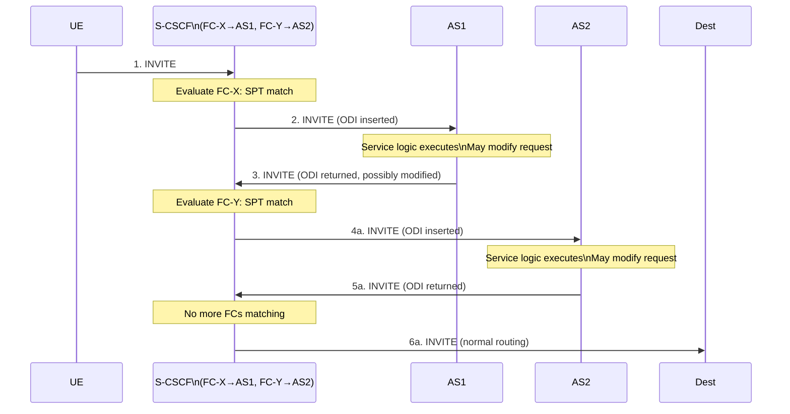
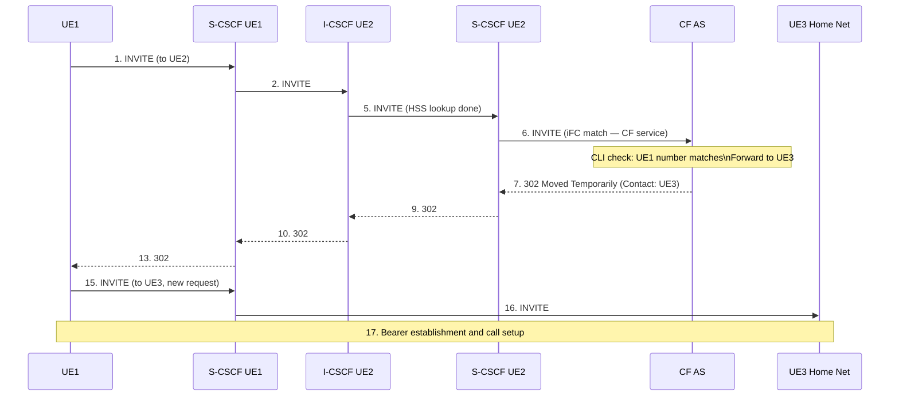
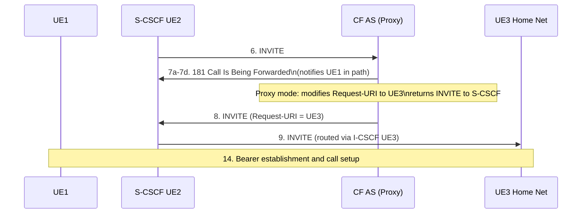
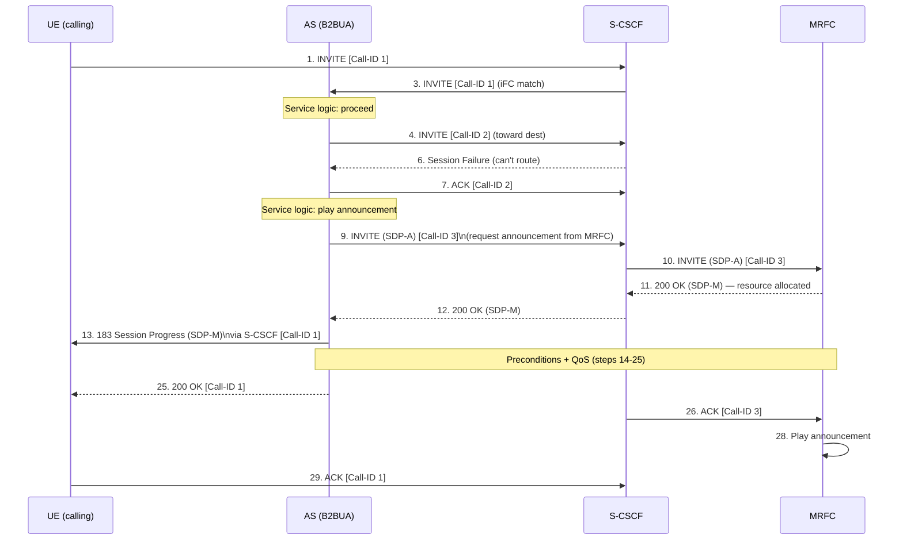
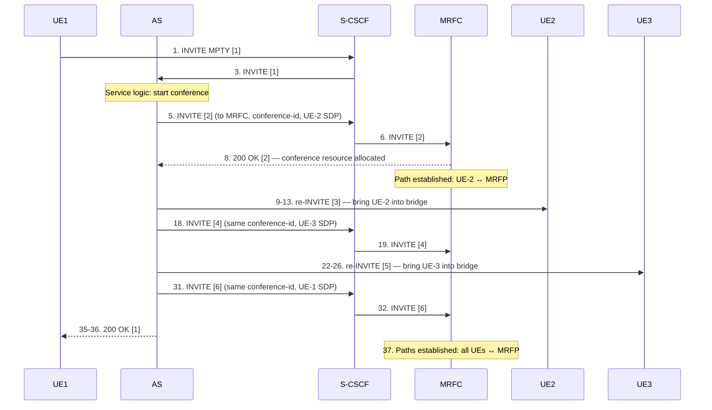
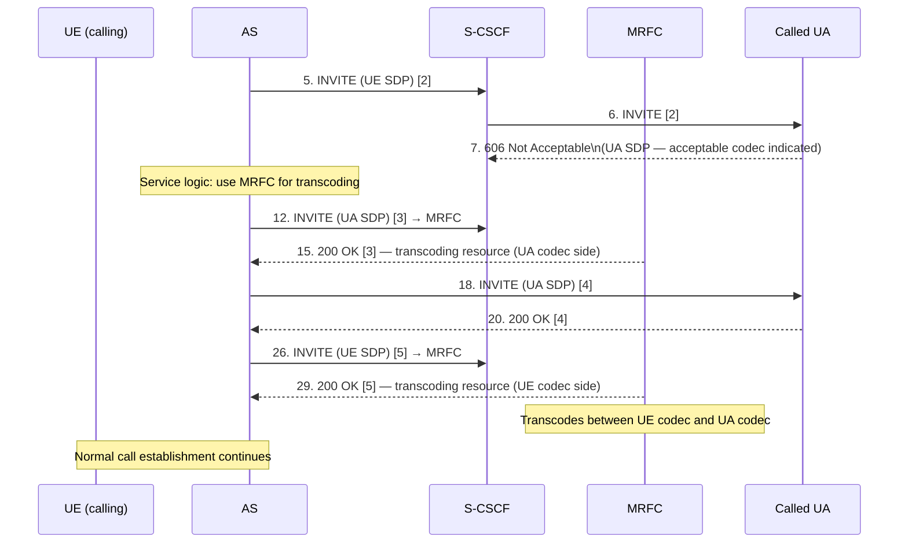
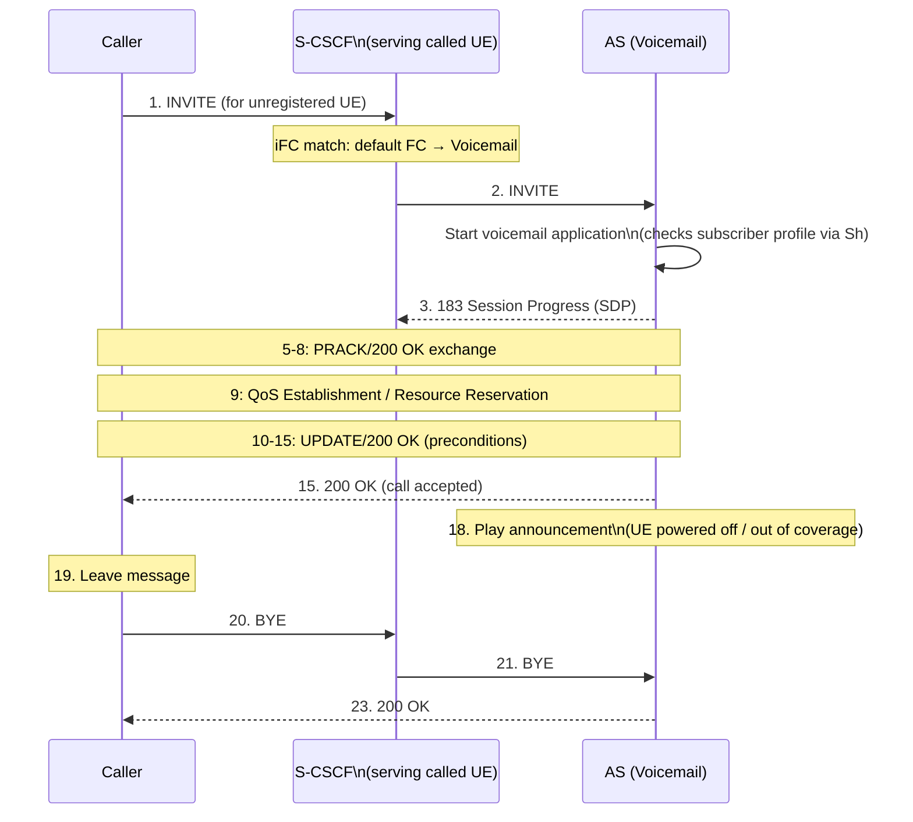
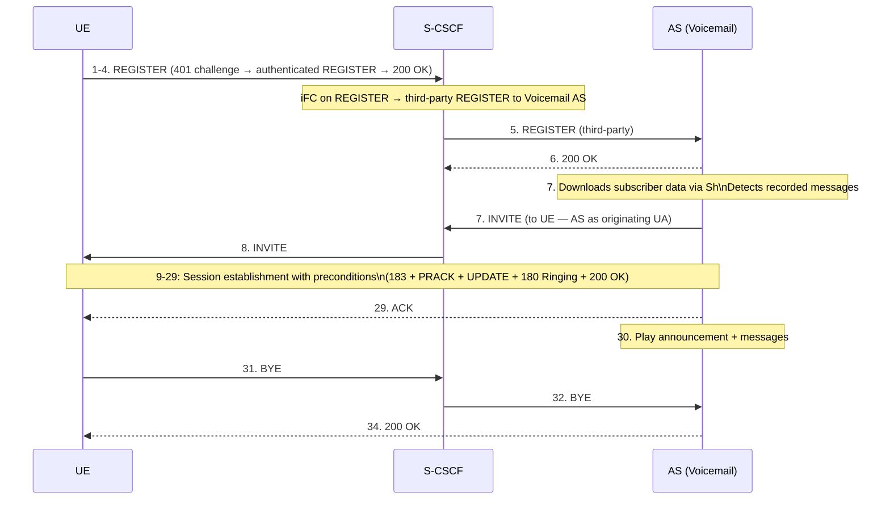

# iFC Worked Examples: Call Forwarding, MRFC Services, Voicemail

From TS 23.218 Annexes B and C (informative). These examples illustrate the normative
procedures from §6 and §9 in concrete service scenarios.

Related pages: [IM Call Model](../concepts/IM-call-model.md) ·
[AS Interaction Modes](../concepts/AS-interaction-modes.md) ·
[MRF](../entities/MRF.md) · [MRB](../entities/MRB.md) ·
[S-CSCF](../entities/S-CSCF.md)

---

## Example 1: iFC Chain Triggering (Annex C)

**Scenario**: User has two FCs — FC-X triggers AS1, FC-Y triggers AS2.

**Key insight**: S-CSCF re-evaluates remaining FCs every time the request returns from
an AS. FC-Y fires only after AS1 has returned the request — AS1 cannot suppress FC-Y
evaluation (only Record-Route denial can do that).

If no further FCs match at step 4b, S-CSCF routes directly to destination (step 4b/6a).

---

## Example 2: Call Forwarding (CFonCLI) — Annex B.1

**Service**: UE2 has Call Forwarding on CLI (forward calls from UE1's number to UE3).
**AS mode**: Redirect Server (Mode 1) or Proxy (Mode 3) depending on variant.

### Variant A: UE-Redirect (B.1.3)

AS acts as **Redirect Server** (Mode 1). AS sends 302 Moved Temporarily. UE1 itself
re-issues INVITE to UE3.

AS is no longer in path after the 302 — clean handoff.

### Variant B: S-CSCF Redirect (B.1.4)

AS acts as **SIP Proxy** (Mode 3). AS notifies all parties call is being forwarded via
181, then modifies Request-URI and returns INVITE to S-CSCF.

**Difference from Variant A**: 181 rings back through the entire path to UE1 (steps
7a–7d), so UE1 sees the "forwarding" notification. UE1 does NOT need to re-issue INVITE.

---

## Example 3: Announcement on UE-Originating Session (Annex B.2.1)

**Service**: UE originates call; destination unreachable; AS plays announcement.
**AS mode**: B2BUA (Mode 4, Routing B2BUA).

**Key pattern**: AS uses two Call-IDs. Call-ID 2 is the attempted outgoing call (fails).
Call-ID 3 is the MRFC announcement leg. B2BUA correlates both with Call-ID 1 (the
original UE-AS dialog). ACK on Call-ID 3 (step 26) triggers MRFC to start playing.

---

## Example 4: Ad-Hoc Conference (Annex B.2.2)

**Service**: UE-1 requests to bring UE-2 and UE-3 into conference.
**AS mode**: B2BUA (Mode 4). MRFC provides conference bridge.

Call-ID assignment:
- Call-ID 1: UE-1 → AS (original request: INVITE MPTY)
- Call-ID 2: AS → MRFC (conference identifier assigned for UE-2 party)
- Call-ID 3: AS → UE-2 (re-INVITE to bring UE-2 into conference bridge)
- Call-ID 4: AS → MRFC (same conference identifier for UE-3 party)
- Call-ID 5: AS → UE-3 (re-INVITE for UE-3)
- Call-ID 6: AS → MRFC (same conference identifier for UE-1 party)

**Key insight**: same **conference identifier** is reused in all MRFC INVITEs (Call-IDs
2, 4, 6). MRFC uses this identifier to add each party to the same conference bridge.
First INVITE creates the conference; subsequent INVITEs add participants.

---

## Example 5: Transcoding (Annex B.2.3)

**Service**: Called UA returns 606 Not Acceptable (codec mismatch); AS invokes MRFC
for transcoding.
**AS mode**: B2BUA (Mode 4).

Two variants depending on whether called UA provides codec info in 606:

### Variant A: Called UA Indicates Codec (B.2.3.1)

Three dialogs to MRFC: [3] for called UA codec side, [5] for calling UE codec side.
MRFP interconnects both transcoding legs.

### Variant B: Called UA Provides No SDP (B.2.3.2)

If 606 contains no SDP, AS must query MRFC for supported codecs first:
1. AS sends INVITE (no SDP) to MRFC [3] → MRFC responds with 183 (MRF SDP — codec list)
2. AS sends that codec list in INVITE to called UA [4]
3. Called UA accepts specific codec → PRACK negotiation
4. AS establishes transcoding (rest same as Variant A)

---

## Example 6: Voicemail — Out-of-Coverage Message Recording (Annex B.3.1)

**Service**: UE is unregistered; incoming call forwarded to voicemail AS.
**AS mode**: Terminating UA (Mode 1). Triggered via unregistered terminating iFC.
**iFC trigger**: Default Filter Criteria for unregistered user → Voicemail AS.

**Terminating UA pattern**: AS responds with 183 (preconditions), accepts call with
200 OK, then controls media session. Caller's BYE goes through S-CSCF to AS.

---

## Example 7: Voicemail — On-Registration Message Notification (Annex B.3.2)

**Service**: UE registers; voicemail AS detects stored messages; AS calls UE back.
**AS mode**: Originating UA (Mode 2). Triggered by third-party REGISTER.

**Originating UA pattern**: AS generates INVITE without being triggered by an incoming
SIP request. The trigger is the third-party REGISTER event. AS downloads subscriber
profile via Sh to determine that messages are waiting.

---

## Pattern Summary

| Example | AS Mode | Dialogs | MRFC? | iFC Trigger |
|---|---|---|---|---|
| iFC chain | Proxy (Mode 3) | 1 | No | Multiple FCs in sequence |
| CFonCLI (redirect) | Redirect Server | 1 | No | Terminating, registered |
| CFonCLI (proxy) | SIP Proxy | 1 | No | Terminating, registered |
| Announcement | Routing B2BUA | 3 | Yes (announcement) | Originating |
| Ad-hoc conference | Routing B2BUA | 6 | Yes (conference) | Originating |
| Transcoding | Routing B2BUA | 4–5 | Yes (transcoding) | Originating |
| Voicemail deposit | Terminating UA | 1 | No | Unregistered terminating |
| Voicemail playback | Originating UA | 1 | No | REGISTER trigger |
