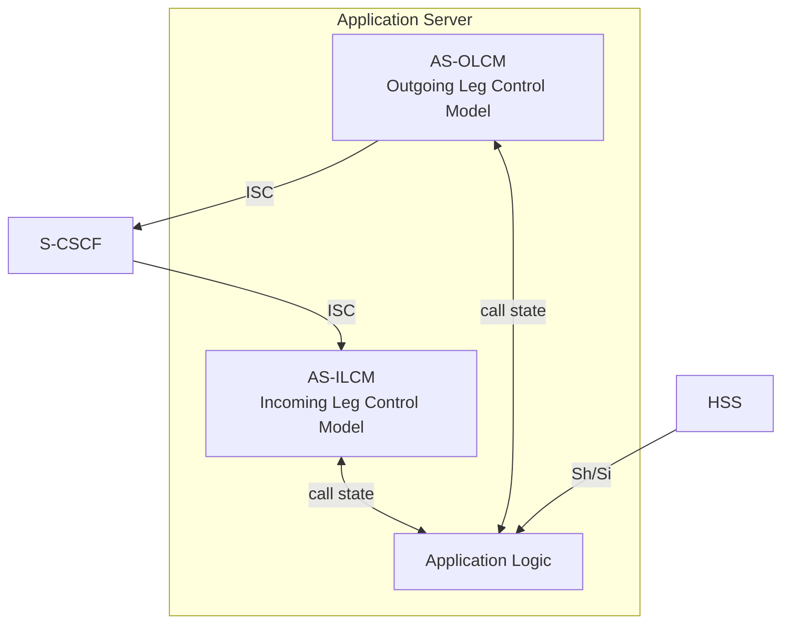
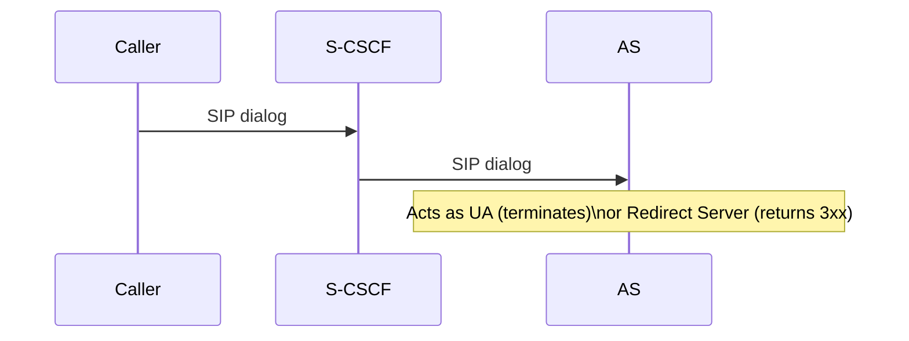
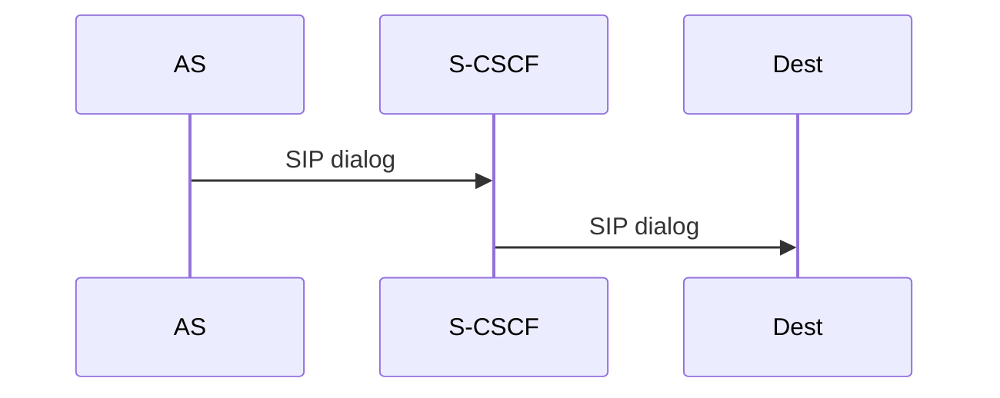
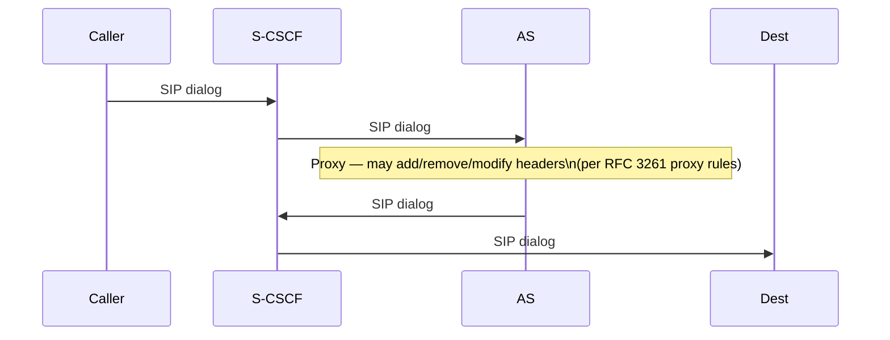
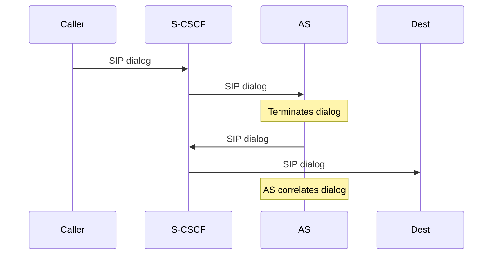
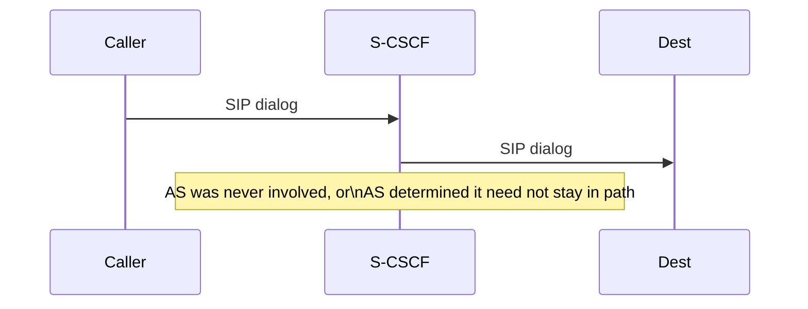
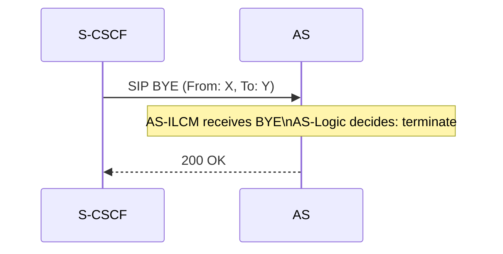
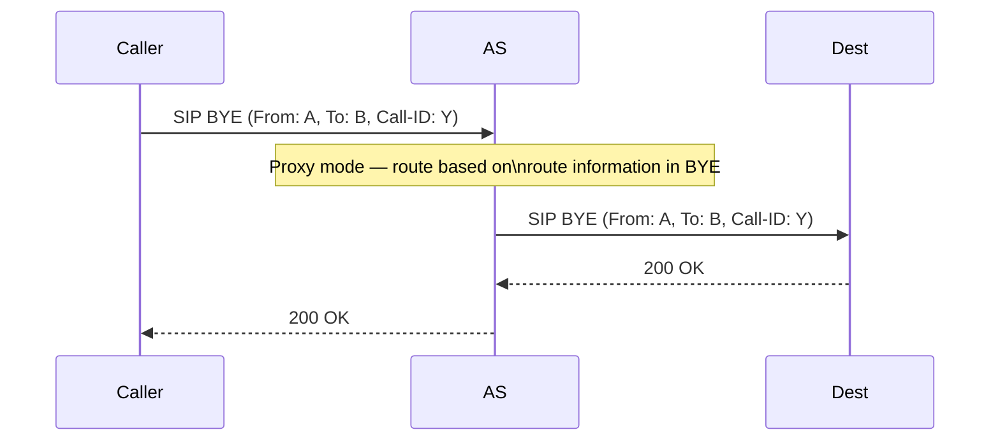
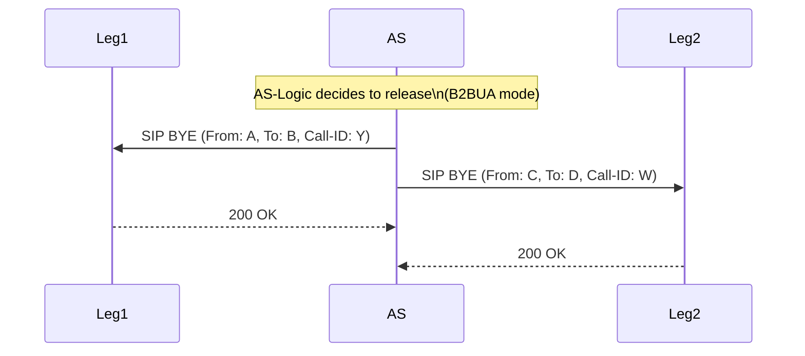

# Application Server Interaction Modes

Covers TS 23.218 §9: the five modes of operation that a SIP Application Server can use
on the ISC interface with the S-CSCF, the AS functional model, interfaces, subscriber
data, and session handling procedures.

Related pages: [S-CSCF](../entities/S-CSCF.md) · [TAS](../entities/TAS.md) ·
[HSS](../entities/HSS.md) · [MRF](../entities/MRF.md) ·
[IM Call Model](IM-call-model.md) ·
[IMS Reference Points](../interfaces/IMS-reference-points.md)

---

## 1. Application Server Functional Model (§9.1.0)

| Component | Role |
|---|---|
| **AS-ILCM** | Stores transaction state for the incoming leg; may store session state. Interfaces S-CSCF ILCM on the incoming leg. |
| **AS-OLCM** | Stores transaction state for the outgoing leg; may store session state. Interfaces S-CSCF OLCM on the outgoing leg. |
| **Application Logic** | Provides services; co-ordinates ILCM and OLCM; can access HSS via Sh/Si. |

These components are a functional model of expected ISC behaviour — they do not constrain
implementation. An AS can transition from one mode of operation to another during the
lifetime of a session it is managing.

---

## 2. Five Modes of Operation (§9.1.1)

### Mode 1: AS as Terminating UA or Redirect Server (§9.1.1.1)

S-CSCF proxies the request to the AS. AS either:
- **Terminates**: acts as UAS (sends 200 OK, manages dialog)
- **Redirects**: sends 3xx Contact to a new destination; S-CSCF follows the redirect

AS does **not** return the request to S-CSCF. Single SIP dialog.

**Use cases**: voicemail deposit, announcement service, call barring (reject),
call forwarding (3xx redirect).

---

### Mode 2: AS as Originating UA (§9.1.1.2)

AS generates a new SIP request and sends it to S-CSCF. S-CSCF proxies it toward the
destination. AS acts as the originating UA. S-CSCF applies originating iFC for the user.

**Use cases**: AS-initiated calls (voicemail retrieval notification, click-to-dial,
network-initiated call), PSI-originated sessions.

---

### Mode 3: AS as SIP Proxy (§9.1.1.3)

AS receives the request, optionally modifies headers, and returns it to S-CSCF with the
ODI intact. S-CSCF then continues iFC evaluation and routes toward destination.

AS inserts itself into Record-Route so it remains in path for subsequent in-dialog
requests (re-INVITEs, BYE).

**Use cases**: lawful interception hooks, call detail enrichment, service-aware routing.

---

### Mode 4: AS as Third-Party Call Control / B2BUA (§9.1.1.4)

Two sub-variants:

#### Routing B2BUA

AS terminates the incoming dialog and generates a new outgoing dialog toward destination.
Two independent SIP dialogs; AS is responsible for correlation.

#### Initiating B2BUA

AS generates two independent requests (dialog #1 and dialog #2) and sends both to
S-CSCF. S-CSCF proxies each toward its destination. AS correlates the two dialogs.

**Use cases**: call transfer, call join, third-party call control (3PCC), conference
focus AS.

---

### Mode 5: AS Not Involved or No Longer Involved (§9.1.1.5)

S-CSCF proxies directly without AS involvement. An AS that was initially involved but
determined it no longer needs to be can remove itself from Record-Route, after which
subsequent in-dialog requests bypass it.

If the AS does **not** insert itself in Record-Route, this mode applies for all
subsequent requests in the dialog.

---

### Mode Comparison

| Mode | Dialogs | AS Role | Returns to S-CSCF? | In Record-Route? |
|---|---|---|---|---|
| Terminating UA / Redirect | 1 | UAS or 3xx | No | No |
| Originating UA | 1 | UAC | Initiates new | Yes (if needed) |
| SIP Proxy | 1 | Proxy | Yes (with ODI) | Yes |
| Routing B2BUA | 2 | B2BUA | No / new dialog | Yes |
| Initiating B2BUA | 2 | B2BUA | Initiates both | Yes |
| Not involved | 1 | — | Never involved | No |

The same modes apply when AS interacts with the **Transit Function** (§9.1.2).

---

## 3. Application Server Interfaces (§9.2)

| Interface | Peer | Purpose |
|---|---|---|
| **ISC** | S-CSCF | Control IMS sessions; S-CSCF proxies requests to AS; AS originates via ISC. Specified in 3GPP TS 24.229. |
| **Sh** | HSS | Transfer user profile data (service-related info, user location, charging addresses). Allows AS to activate/deactivate per-subscriber iFC stored in HSS. |
| **Dh** | SLF | Retrieve the HSS address holding a given user's profile (multi-HSS deployments). |
| **Cr** | MRFC | Media control and resource exchange between AS and MRFC. |
| **Rc** | MRB | AS requests media resources in MRB Query mode; MRB selects MRFC. |
| **ISC (via Transit)** | Transit Function | Same as ISC with S-CSCF; implements Mf reference point (TS 23.228). |

**Sh interface special capability**: AS can **activate or deactivate its own iFC entries**
stored in HSS on a per-subscriber basis. This allows dynamic service logic enable/disable
without re-provisioning the entire subscriber profile.

---

## 4. Application Server Subscriber Data (§9.3)

The AS subscription information is obtained from HSS via Sh (or Si) or by operator
provisioning. It may be retrieved at registration or at any time.

| Data Field | Description |
|---|---|
| **Service Key** | Identifies which service logic applies at the AS for this subscriber |
| **Service Platform Trigger Points (STP)** | Points in SIP signalling where the AS applies service logic |
| **Service Scripts** | CGI, CPL, Java Servlets, or other processing logic; obtained from HSS or provisioned |

---

## 5. AS Session Handling Procedures (§9.4)

### UE-Originating Requests (§9.4.1)

- AS-ILCM receives request → reports call state to Application Logic
- Application Logic may instruct AS-OLCM to modify the request (e.g. insert Record-Route)
- AS-OLCM sends the (modified) request back to S-CSCF
- If acting as **B2BUA**: AS correlates dialog identifiers; decides when to translate
  messages between dialogs; handles bridging logic per Application Logic instructions
- **ICSI insertion by AS**:
  - B2BUA acting as originating UA: may insert ICSI on outgoing legs; ICSI on different
    legs may differ (different services on each leg)
  - Originating UA mode: may insert ICSI in request and response
  - SIP proxy or routing B2BUA: may include ICSI and capability indication in Record-Route

### UE-Terminating Requests (§9.4.2)

Same as UE-originating (§9.4.1) — AS-ILCM/OLCM/Logic operate identically.

### SIP Registration Handling (§9.4.3)

When S-CSCF sends a **third-party REGISTER** to AS:

| Information | Carried In |
|---|---|
| Public user identity (IMPU) | SIP From/To headers |
| S-CSCF address | Route header |
| Registration expiry | Expires header |
| Original REGISTER body (if FC flag set) | SIP body |
| IMSI (for CAMEL AS) | P-Access-Network-Info header or body |

**AS response behavior:**
- Supports third-party REGISTER: processes as network notification of user registration;
  may trigger service logic; returns 200 OK
- Does not support: returns error; S-CSCF applies FC Default Handling

**Registration state tracking options for AS:**
1. **Third-party REGISTER**: receive REGISTER / re-REGISTER / de-REGISTER events directly
2. **Reg event package** (RFC 3680): AS subscribes to S-CSCF notification; receives
   NOTIFY with implicit registration set, GRUUs, ICSIs, IARIs per contact
3. **Sh interface**: AS queries HSS directly for user subscription information

For re-registration and de-registration: AS receives corresponding third-party REGISTER
(with shorter or zero expiry) to track the complete registration lifecycle.

### Session Release Handling (§9.4.4)

Three sub-modes, mirroring S-CSCF release modes:

#### Sub-mode A: Release Request Terminated at AS (§9.4.4.1)

AS acts as UA/B2BUA: receives BYE, sends 200 OK. Session terminated at AS.

#### Sub-mode B: Release Request Proxied by AS (§9.4.4.2)

AS is in proxy mode: receives BYE, proxies it downstream per route information. Passes
200 OK back upstream.

#### Sub-mode C: Release Request Initiated by AS (§9.4.4.3)

AS initiates BYE on all dialogs it manages simultaneously (B2BUA). AS may initiate in
either UA or B2BUA mode. Both legs sent BYE concurrently.

### IP Multimedia Charging (§9.4.5)

**Parameters AS must propagate:**

| Parameter | Description | Direction |
|---|---|---|
| **ICID** (IMS Charging ID) | Globally unique session charging identifier; generated by P-CSCF at session start | Pass through — do not modify |
| **IOI** (Inter-Operator Identifier) | Identifies the home or visited network | Replace with own IOI when sending to AS; retain original when forwarding downstream |
| **Charging function addresses** | On-line (ECF) and off-line (CCF) charging entity addresses | Pass through from S-CSCF |

**Originating AS rule**: if acting as originating UA (§9.1.1.2) and no ICID received,
AS generates its own ICID. Charging function addresses may be retrieved via Sh if not
received via ISC.

**Precedence rule**: if charging function addresses received via ISC conflict with those
from Sh, **ISC takes precedence**. (Sh is a fallback for when no third-party REGISTER
was received.)

**CDR**: AS does not generate CDRs directly — charging is handled via the charging
function addresses propagated through the signalling chain.

---

## 6. IM-SSF, OSA-SCS, and Charging Server (§10–12)

| AS Type | Spec | Role |
|---|---|---|
| **IM-SSF** | TS 23.278 | Maps SIP on ISC to CAMEL/CAP; bridges IMS and CAMEL service environment |
| **OSA-SCS** | TR 29.998 | Maps SIP on ISC to OSA API framework |
| **Charging Server (ECF/SCF)** | TS 32.240, TS 32.260 | Online and offline charging; Event Charging Function + Session Charging Function |

All three implement the generic SIP AS behaviour of §9 on the ISC interface. Detailed
procedures for each are in their respective specifications.
