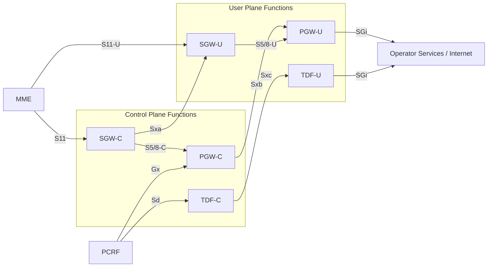

# CUPS Architecture — Control and User Plane Separation of EPC Nodes

**Source:** 3GPP TS 23.214 v16.1.0 — Release 16

CUPS (Control and User Plane Separation) is a 3GPP Release 14+ architectural enhancement that splits the [SGW](../entities/SGW.md), [PGW](../entities/PGW.md), and TDF each into a **Control Plane (CP) function** and a **User Plane (UP) function**, connected by a new Sx reference point family. The split is transparent to the UE and RAN.

---

## 1. Design Principles (§4.1)

- **Backward interworking:** a split node can interwork with non-split peer nodes (critical for roaming scenarios where the visited network may not support CUPS).
- **RAN/UE transparency:** the split is invisible to the eNodeB and UE; existing S1-U, S4-U, S12, S11 interfaces are unchanged from the RAN/MME perspective.
- **CP selects UP:** the CP function of each node is responsible for selecting and controlling its corresponding UP function (§4.3.3).
- **1:N CP-to-UP:** a single CP function can control multiple UP functions, enabling independent horizontal scaling of user-plane capacity.
- **TDF CP selection:** selected by configuration in the PGW or PCRF (not by MME/ePDG).
- **S2a/S2b/S5/S8 restriction:** CUPS is only supported with GTP-based S2a, S2b, S5, and S8. PMIP-based interfaces and S2c are **not** supported.

---

## 2. Architecture Reference Model (§4.2)

### 2.1 Non-roaming and Roaming

- Existing reference points get a **-C** suffix (control plane component) and **-U** suffix (user plane component). For example S5 becomes S5-C (SGW-C ↔ PGW-C) and S5-U (SGW-U ↔ PGW-U).
- **S11-U:** new interface between MME and SGW-U, used specifically for CP CIoT EPS Optimisation (per TS 23.401).
- **S12** (RNC ↔ SGW-U) is not split; it remains as-is.
- NOTE 6: For local breakout roaming, Gx is between PGW-C and the **visited network** PCRF.

### 2.2 Combined SGW/PGW

The combined SGW/PGW deployment (documented in TS 23.401) is fully compatible with CUPS. A combined SGW/PGW-C controls a combined SGW/PGW-U via a combined **Sxa/Sxb** interface (same parameter structure as standalone Sxa and Sxb).

### 2.3 Reference Points Added by CUPS (§4.2.3)

| Interface | Between | Purpose |
|---|---|---|
| **Sxa** | SGW-C ↔ SGW-U | Session and bearer management for SGW split |
| **Sxb** | PGW-C ↔ PGW-U | Session, bearer, PCC enforcement for PGW split |
| **Sxc** | TDF-C ↔ TDF-U | TDF session management and traffic detection control |

Wire protocol for Sx is defined in 3GPP TS 29.244 (PFCP — Packet Forwarding Control Protocol).

---

## 3. Functional Split Tables (§4.3)

### 3.1 SGW Functional Split (Table 4.3.2-1)

| Category | Sub-function | SGW-C | SGW-U |
|---|---|---|---|
| A. Session management | Resource management | ✓ | ✓ |
| | IP address and TEID assignment for GTP-U | ✓ | ✓ |
| | Packet forwarding | | ✓ |
| | Transport level packet marking | | ✓ |
| C. UE Mobility | Forwarding of end marker (source eNB exists) | ✓ | |
| | Sending of end marker (after path switch) | ✓ | ✓ |
| | Forwarding of buffered packets | ✓ | ✓ |
| | Change target GTP-U endpoint (3GPP) | ✓ | |
| D. S1-Release / Buffering | ECM-IDLE DL packet buffering + DDN triggering | ✓ | ✓ |
| | Delay DDN Request | ✓ | |
| | Extended buffering (power-saving UE) | ✓ | ✓ |
| G. NBIFOM | Non-PCC aspects of NBIFOM | ✓ | |
| H. Accounting | Accounting per UE and bearer | | ✓ |
| | OFCS interfacing (TS 32.240) | ✓ | |
| I. Load/overload | Load/overload control | ✓ | ✓ |
| J. LI | Lawful interception | ✓ | ✓ |
| L. Restoration | Restoration and recovery | ✓ | ✓ |
| N. OAM | OAM interfaces | ✓ | ✓ |
| O. GTP | Echo, path management | ✓ | ✓ |

**Key SGW split insight:** The SGW-U holds _no_ PCC-related state. All PCC/charging logic (F category) sits in PGW-C/PGW-U. The SGW-U is a pure forwarding engine with DDN triggering and buffering capability.

### 3.2 PGW Functional Split (Table 4.3.2-2)

| Category | Sub-function | PGW-C | PGW-U |
|---|---|---|---|
| A. Session management | Resource management | ✓ | ✓ |
| | IP/TEID assignment for GTP-U | ✓ | ✓ |
| | Packet forwarding | | ✓ |
| | Transport level packet marking | | ✓ |
| B. UE IP address | IP address allocation from local pool | ✓ | |
| | DHCPv4/v6 client | ✓ | |
| | DHCPv4/v6 server | ✓ | |
| | Router advertisement (RFC 4861) | ✓ | |
| C. UE Mobility | Sending of end marker | ✓ | ✓ |
| | Change target GTP-U (3GPP) | ✓ | |
| | Change target GTP-U (3GPP ↔ non-3GPP) | ✓ | |
| D. Charging pause | PGW pause of charging | ✓ | |
| E. Bearer/APN policing | APN-AMBR enforcement | | ✓ |
| | UL/DL bearer MBR (GBR) | | ✓ |
| | UL/DL bearer MBR (non-GBR on Gn/Gp) | | ✓ |
| F. PCC | Service detection (DPI, IP-5-tuple) | | ✓ |
| | Bearer binding (QoS & TFT) | ✓ | |
| | Bearer binding verification + DL mapping | | ✓ |
| | UL/DL service level gating | | ✓ |
| | UL/DL service level MBR enforcement | | ✓ |
| | UL/DL service level charging (online & offline) | ✓ | ✓ |
| | Usage monitoring | ✓ | ✓ |
| | Event reporting (incl. app detection) | ✓ | ✓ |
| | Redirection | ✓ | ✓ |
| | FMSS handling | | ✓ |
| | NBIFOM (PCC support) | ✓ | |
| | Predefined PCC/ADC activation/deactivation | ✓ | ✓ |
| | PCC support for SDCI | ✓ | ✓ |
| H. Accounting | Accounting per UE/bearer | | ✓ |
| | OFCS interfacing | ✓ | |
| J. LI | Lawful interception | ✓ | ✓ |
| K. Packet screening | Packet screening | | ✓ |
| M. RADIUS/Diameter | RADIUS/Diameter on SGi | ✓ | ✓ |
| L. Restoration | Restoration and recovery | ✓ | ✓ |
| N. OAM | OAM interfaces | ✓ | ✓ |
| O. GTP | Echo, path management | ✓ | ✓ |

**Key PGW split insight:** Bearer _binding decision_ stays in PGW-C (it knows QoS & TFT policy), but bearer _binding verification_ and DL traffic _mapping to bearers_ moves to PGW-U (which does actual packet inspection). Service detection (DPI) is PGW-U only — the CP never processes user data.

**NOTE on event reporting:** User-plane related events (e.g. application detection) are reported by PGW-U; control-plane related events (e.g. RAT change) are reported by PGW-C only.

### 3.3 TDF Functional Split (Table 4.3.2-3)

| Category | Sub-function | TDF-C | TDF-U |
|---|---|---|---|
| E. Bearer/APN policing | APN-AMBR enforcement (TDF session scope) | | ✓ |
| F. PCC | Service detection (DPI) | | ✓ |
| | UL/DL service level gating | | ✓ |
| | Service level MBR enforcement | | ✓ |
| | Service level charging (online & offline) | ✓ | ✓ |
| | Usage monitoring | ✓ | ✓ |
| | Event reporting (incl. app detection) | ✓ | ✓ |
| | Request for forwarding of event reporting | ✓ | |
| | Redirection | ✓ | ✓ |
| | FMSS handling | | ✓ |
| | DL DSCP marking for application indication | | ✓ |
| | Predefined PCC/ADC activation/deactivation | ✓ | ✓ |
| | PCC support for SDCI | ✓ | ✓ |
| H. Accounting | OFCS interfacing | ✓ | |
| I. Load/overload | Load/overload control | ✓ | ✓ |
| L. Restoration | Restoration and recovery | ✓ | ✓ |

**TDF APN-AMBR note:** TDF-U APN-AMBR enforcement covers every flow in the TDF session but does _not_ cover other TDF sessions of the same UE to the same APN — scope is narrower than the PGW APN-AMBR.

---

## 4. Network Element Definitions (§4.4)

| Entity | Equivalent to (pre-CUPS) | Defined in |
|---|---|---|
| SGW-C + SGW-U | SGW | TS 23.401 |
| PGW-C + PGW-U | PGW + PCEF | TS 23.401, TS 23.402, TS 23.203 |
| TDF-C + TDF-U | TDF | TS 23.203 |

### SGW-C
Provides all SGW functionality from TS 23.401 **except** those performed by SGW-U. Additionally:
- Selects the SGW-U (per §4.3.3 and §5.12)
- Controls SGW-U via the Sxa interface

### SGW-U
Provides: packet forwarding, GTP-U tunnel termination, transport packet marking, DL packet buffering (ECM-IDLE), end marker generation, per-UE/bearer accounting (packet counts).

### PGW-C
Provides all PGW/PCEF functionality **except** those performed by PGW-U. Additionally:
- Selects PGW-U (per §4.3.3 and §5.12)
- Controls PGW-U via the Sxb interface
- Owns all PCC policy decisions (bearer binding, QoS enforcement rules)

### PGW-U
Provides: packet forwarding, DPI (service detection), bearer binding verification, DL traffic mapping, gating enforcement, APN-AMBR and bearer MBR policing, usage reporting, event reporting.

### TDF-C
Controls TDF-U via Sxc. Handles PCC control-plane events, charging/accounting interfacing, event forwarding requests.

### TDF-U
Handles: service detection (DPI), gating, MBR enforcement, per-flow DL DSCP marking, APN-AMBR (TDF session scope), FMSS.

---

## 5. SGW-C Partitioning (§4.3.4)

When the SGW-U service area is smaller than the SGW-C service area, the SGW-C can be **partitioned** into multiple SGW-C partitions. Each partition is aligned to one SGW-U service area.

- The MME treats each SGW-C partition as a **legacy SGW** (no MME changes required).
- There is exactly **one Sxa** reference point between one SGW-C and one SGW-U.
- The MME's TAI List must be scoped so that all TAs in the list have connectivity to the specific SGW-U function serving the UE.
- If multiple SGW-Us serve a UE, they must collectively cover at least the SGW-C service area.

---

## 6. UP Function Selection (§4.3.3)

The CP function selects its UP function considering:
- UE's location information
- UP function capabilities and supported optional features
- UP function deployment mode: **centrally located** (hub) vs. **distributed** (close to RAN site)
- Allows UP functions with different capability subsets (e.g., a UP that supports no optional functionalities)

Selection details are specified in §5.12 (covered in chunk ts23214-2).

---

---

## 7. Traffic Detection — Packet Detection Rules (§5.2)

The CP instructs each UP function how to detect traffic via **Packet Detection Rules (PDRs)**. Each PDR contains detection information and references to FAR(s)/URR(s) that describe what to do with matching packets.

**Detection information components:**
- UE IP address
- F-TEIDu (local GTP-U tunnel endpoint)
- SDF filters (Service Data Flow filters, per TS 23.203)
- Application ID (referring to an application detection filter, per TS 23.203)

**Table 5.2.2-1 — PDR scenarios by UP function:**

| # | UP function | UL detection | DL detection | Purpose |
|---|---|---|---|---|
| 1 | SGW-U | Local F-TEIDu (access side) | Local F-TEIDu (core side) | Bearer traffic detection |
| 2 | PGW-U | Local F-TEIDu (access) + UE IP as dest + DL SDF/App ID | UE IP as dest + DL SDF/App ID | Service data flow + UL bearer binding verification |
| 3 | PGW-U | Local F-TEID + UE IP as source + UL SDF/App ID | UE IP + DL SDF/App ID | Scenario 2 + packet screening |
| 4 | PGW-U | Local F-TEID (access side) | — | Remaining traffic (wrong UE IP or wrong bearer); measurement/discard |
| 5 | PGW-U | — | UE IP as destination | Remaining traffic for discarding |
| 6 | PGW-U | — | DL SDF/App ID | RADIUS, Diameter and DHCP signalling on SGi |
| 7 | TDF-U | UE IP + UL SDF/App ID | UE IP + DL SDF/App ID | Service data flow detection |
| 8 | TDF-U | UE IP as source | UE IP as destination | Remaining traffic in TDF session |

NOTE: Scenarios 4, 5, 8 — PDRs with only a single detection field shall have **lowest precedence** among all PDRs in the Sx session. RADIUS/Diameter/DHCP on SGi (scenario 6) can use SDF filter(s) or Application ID referring to a detection filter.

---

## 8. Charging and Usage Monitoring (§5.3)

### 8.1 Architecture principle

All charging-interface termination points (Gx, Sd, Gy, Gyn, Gz, Gzn, and OFCS) remain at the **CP function** (PGW-C / TDF-C / SGW-C). There is **no change** to the PCRF, OCS, or OFCS interface compared to the non-split architecture.

Key rules:
- All bearer, traffic flow, session, and subscriber state remains at CP function
- The UP function only contributes **usage information** (counts of bytes/packets)
- The CP function combines usage reports from the UP with subscriber/session context before reporting upstream

### 8.2 Usage Reporting Rules (URRs)

The CP function generates **Usage Reporting Rules** and sends them to the UP via Sx. A URR is keyed to either a Monitoring Key (for usage monitoring, per TS 23.203/29.212) or a Charging Key/Sponsor Identity (for offline/online charging, per TS 32.251).

URR reporting triggers supported by UP function:
- Periodic reporting (period set by CP)
- Usage threshold crossing (set by CP from PCRF allowance or OCS quota)
- On-demand report request from CP

Reporting granularity levels:
- **Session level** (IP-CAN/TDF session)
- **Bearer / traffic flow level** (for per-charging-key or per-monitoring-key reporting)

The same URR can be shared across multiple PDRs (same measurement applies to multiple detection rules).

### 8.3 PGW Pause of Charging (§5.3.4)

When UE enters ECM-IDLE and SGW-C activates DL buffering in SGW-U:
1. SGW-C also instructs SGW-U to **measure buffered/discarded packets** (via URR criteria in the Sx session)
2. On threshold trigger: SGW-U reports usage → SGW-C → informs PGW-C (per TS 23.401)
3. PGW-C sends **Sx Session Modification** to PGW-U: stops all URRs in the PDN connection
4. On resume: PGW-C sends Sx Session Modification to PGW-U to resume all URRs

> Support for PGW Pause of Charging is optional; requires both SGW-C and PGW-C to support the feature.

---

## 9. GTP-U TEID Allocation (§5.4)

In CUPS, **F-TEIDu allocation is performed by the UP function** (mandatory). The UP function manages its own F-TEIDu space:

**SGW-U:** manages SGW F-TEIDu space (uniqueness per TS 29.060).
- Bearer activation: SGW-C → SGW-U (via Sx): request to allocate F-TEIDu(s) for applicable SGW-U reference points
- SGW-C provides the allocated F-TEIDu(s) to peer nodes (MME, eNB, PGW-C etc.) per TS 23.401
- Bearer deactivation: SGW-C requests SGW-U to release the F-TEIDu(s)

**PGW-U:** manages PGW F-TEIDu space (uniqueness per TS 29.060).
- Bearer activation: PGW-C → PGW-U (via Sx): request to allocate F-TEIDu(s) for applicable PGW-U reference points
- PGW-C provides allocated F-TEIDu(s) to peer nodes per TS 23.401/23.402
- Bearer deactivation: PGW-C requests PGW-U to release

---

## 10. UE IP Address Management (§5.5)

All UE IP address management is performed by **PGW-C**. The PGW-U acts as a forwarding relay for IP address management messages when needed.

| Mechanism | PGW-C role | PGW-U role |
|---|---|---|
| IPv4 bearer activation/release | Direct (no PGW-U involvement) | None |
| IPv6 stateless autoconfiguration (RS/RA) | Processes RS; sends RA to PGW-U for relay | Forwards RS from UE to PGW-C; relays RA/NA to UE |
| DHCPv6 stateless (RFC 3315) | Processes DHCP | Forwards DHCP messages between UE and PGW-C |
| DHCPv4 | Processes DHCP | Forwards DHCP messages between UE and PGW-C |
| IPv6 prefix delegation | Processes DHCP | Forwards DHCP messages |
| External PDN AAA/DHCP (via PGW-U path only) | Instructs PGW-U to forward Diameter/RADIUS/DHCP | Relays to/from AAA/DHCP server in external PDN |

If the external AAA or DHCPv4/v6 server is reachable directly from PGW-C, PGW-C communicates directly (no PGW-U involvement).

---

## 11. Control of User Plane Forwarding — FAR (§5.6)

The CP instructs UP packet forwarding via **Forwarding Action Rules (FARs)**. Each FAR contains:
- **Forwarding operation information** (what to do)
- **Forwarding target information** (where to send)

**Table 5.6.2-1 — Forwarding scenarios:**

| # | Scenario | Forwarding target | Applies to |
|---|---|---|---|
| 1 | Normal UE↔PDN forwarding via GTP-U tunnels (encapsulation/de-encapsulation, tunnel mapping) | GTP-U encapsulation info (F-TEID) | SGW, PGW |
| 2 | UE/PDN → CP function (HTTP redirect, traffic subject to redirect etc.) | CP function IP address | PGW |
| 3 | External PDN/SGi → CP function (RADIUS, DHCP, Diameter signalling) | CP function as source/target | PGW |
| 4 | Buffered packets → CP function (SGW buffering in SGW-C) | CP function IP address | SGW |
| 5 | Traffic steering to SGi-LAN for FMSS/Service Chaining | Predefined traffic steering policy identifier | PGW, TDF |

**Sx-u tunnel (§5.6.3):** When forwarding from UP→CP (scenarios 2–4), user-plane packets are encapsulated in a GTP-U **Sx-u tunnel**, allowing the CP to identify the PDN connection and bearer. The tunnel can be established per bearer, per PDN, or per UP function. Tunnel details in TS 29.244.

The CP can request the UP to perform **multiple sequential forwarding actions** on the same traffic (e.g. forward to DL side AND forward a copy to CP function for duplication).

---

## 12. UE Permanent Identifier at UP Function (§5.7)

For scenarios where the UP function needs the UE's permanent identity (e.g. HTTP header enrichment in a trusted deployment environment):
- PGW-C/TDF-C may provide IMSI/IMEI to the UP function **in a container** (not as a standard Sx parameter)

In untrusted environments (where privacy requirements prevent sharing permanent identity):
- A **session identifier** is used between CP and UP for correlating session-related events (permanent identity not shared with UP)

---

## 13. End Marker Functionality (§5.8)

End markers signal to the source eNB/SGW that path switching is complete (no more packets will arrive on the old path). In CUPS, end markers can be constructed by either the CP or the UP function — determined by network configuration.

### 13.1 UP function constructs end marker (§5.8.1)

| Scenario | CP action via Sx | UP action |
|---|---|---|
| eNB relocation, no SGW change | SGW-C → SGW-U: new F-TEID of eNB + indication to send end markers on old path | SGW-U sends end markers on each S1 GTP-U tunnel to source eNB after last PDU |
| SGW-U relocation (handover) | PGW-C → PGW-U: bearer ID + new F-TEID of SGW-U + send-end-marker indication | PGW-U sends end markers on each S5/S8 tunnel to old SGW-U; old SGW-U forwards to source eNB |

### 13.2 CP function constructs end marker (§5.8.2)

| Scenario | Flow |
|---|---|
| eNB relocation, no SGW change | SGW-C → SGW-U: new F-TEID. After last PDU, SGW-U replaces F-TEID, responds via Sx. SGW-C constructs end markers → SGW-U → source eNB |
| SGW-U relocation (handover) | PGW-C → PGW-U: new F-TEID of SGW-U. After last PDU on old S5/S8, PGW-U replaces F-TEID, responds. PGW-C constructs end markers → PGW-U → old SGW-U |

---

## 14. Idle-State Packet Buffering (§5.9)

Buffering of DL packets for ECM-IDLE UEs can occur in SGW-U or SGW-C.

| Property | Value |
|---|---|
| SGW-U buffering | **Mandatory** |
| SGW-C buffering | Optional (except for NB-IoT/eDRX UEs: SGW-C **must** support buffering) |
| Decision authority | SGW-C decides per-UE-session (based on local config + UE capability) |

### 14.1 Buffering in SGW-C (§5.9.2)

SGW-C instructs SGW-U to stop sending data to eNB. SGW-U forwards DL packets to SGW-C via Sx-u tunnel (§5.6.3 format). On ECM-CONNECTED restore: SGW-C updates SGW-U with new eNB F-TEIDu and forwards buffered packets back to SGW-U for delivery.

### 14.2 Buffering in SGW-U (§5.9.3)

SGW-C activates buffering via Sx Session Modification. SGW-U behaviors:
- **Basic:** buffer without reporting first DL packet arrival
- **With reporting:** buffer and report arrival of first DL packet (SGW-C decides whether to send DDN to MME)
- **Drop:** drop all DL packets

On first DL packet arrival: SGW-U sends Sx reporting message to SGW-C (identifies the S5/S8 bearer). SGW-C decides whether to send DDN to MME (per TS 23.401).

On ECM-CONNECTED: SGW-C updates SGW-U via Sx with new eNB/RNC F-TEIDu. SGW-U forwards buffered packets.
On SGW-U relocation: buffered packets transferred from old SGW-U to new SGW-U.

**Delay DDN (§5.9.3.2):** MME/SGSN may request delay D on DDN.
- If handled by **SGW-U**: SGW-C includes parameter D in Sx session for non-buffering sessions; SGW-U delays subsequent Sx reporting until next DL arrival.
- If handled by **SGW-C**: normal Sx flow; SGW-C delays forwarding DDN to MME by D.

**Extended buffering (§5.9.3.3):** MME provides DL Buffering Duration time (+ optional DL Suggested Packet Count).
- If **SGW-U handles expiry**: SGW-C includes duration in Sx Reporting Ack; SGW-U buffers until timer expires then discards and restarts (with arrival-reporting mode).
- If **SGW-C handles expiry**: SGW-C requests SGW-U to drop packets and restart buffering-with-reporting.
- DL Suggested Packet Count: SGW-U buffers up to that packet count only.

**Throttling (§5.9.3.4):** SGW-C determines throttling per bearer (based on ARP + operator policy) on DDN Ack from MME/SGSN. SGW-C indicates in Sx Report Ack whether SGW-U should discard the buffered packet and/or notify on additional DL packets. Throttling timer and factor: always handled by SGW-C, not provided to SGW-U.

---

## 15. Bearer and APN Policing (§5.10)

- **ARP** is used for admission control only; ARP is **not** provided to the UP function.
- **QCI** (+ optionally ARP priority level) is used by SGW-C/PGW-C to determine transport-level packet marking → provided to SGW-U/PGW-U.
- **APN-AMBR:** PGW-C provides APN-AMBR value + QoS Enforcement Rule correlation ID (§7.6) to PGW-U so PGW-U can enforce APN-AMBR across all IP-CAN sessions of the UE to the same APN.
- **GBR bearers:** SGW-C/PGW-C provide GBR and MBR for each GBR bearer of the PDN connection to SGW-U/PGW-U.
- **Non-GBR on Gn/Gp:** PGW-C also provides MBR for non-GBR bearers on Gn/Gp interface (legacy GPRS enforcement).
- **TDF session MBR:** TDF-C provides session MBR to TDF-U.

---

## 16. PCC/ADC Related Functions (§5.11)

### 16.1 Predefined PCC/ADC Rules (§5.11.1)

Predefined PCC/ADC rules are configured in the **CP function**. Traffic detection filters can be located in:
- CP function (as SDF filters) → provided to UP as service data flow filters
- UP function (as application detection filters) → CP holds application identifier; UP holds the actual detection filter

Traffic steering policies and QoS/FAR/URR policies for UP traffic handling are configured in the UP function as predefined rules and referenced by identifier. When PCRF activates a predefined rule, PGW-C/TDF-C translates into the appropriate identifiers/filters/policies and sends to PGW-U/TDF-U.

CP function maintains the mapping between Gx/Sd PCC/ADC rule ↔ flow-level PDR(s) on Sx.

### 16.2 Dynamic PCC/ADC Rules (§5.11.2)

Same split as predefined rules. When PCRF sends a dynamic rule with application identifier:
- If filter is in CP (PGW-C/TDF-C): CP sends service data flow filter to UP, plus UP traffic handling parameters
- If filter is in UP: CP sends App ID + traffic handling parameters to PGW-U/TDF-U

### 16.3 Redirection (§5.11.3)

Redirect enforcement can be in CP or UP. Redirect destination can be preconfigured or in dynamic rule, in CP or UP.
- When enforced in **UP function**: UP performs redirection directly.
- When enforced in **CP function**: CP instructs UP to forward applicable traffic to CP function (CP handles redirect response).

### 16.4 PFD Management / SDCI (§5.11.4)

PFDs (Packet Flow Descriptions) are provided to PGW-C/TDF-C by PFDF (pull mode) or SCEF (push mode). PGW-C/TDF-C:
- Caches PFDs with a caching timer
- Provides PFD set to PGW-U/TDF-U when a PDR references an Application ID
- When caching timer expires: informs PGW-U/TDF-U to remove PFD(s) via **PFD management message on Sx**
- When PFD is removed while active PDRs reference it: PGW-U/TDF-U reports application stop to PGW-C/TDF-C

**Conflict rule:** if a single UP function is controlled by multiple CP functions and they provide different PFDs for the same Application ID, the latest PFD received by the UP overrides. Operator must avoid this by a well-planned PFDF and CP/UP function deployment.

PFDs from local O&M override PFDF retrieval. PGW-C/TDF-C provides either PFDF-retrieved or pre-configured PFDs to UP.

---

## 17. UP Function Selection (§5.12)

### 17.1 Selection principles

- Selection is performed by the **CP function** of each node.
- UP capabilities are signalled during **initial Sx connection establishment** between CP and UP.
- CP is dynamically aware of UP **load** and **relative static capacity** via the Sx Load Control feature.
- The exact set of selection parameters is deployment-specific and operator-configured.

### 17.2 PGW-U Selection (§5.12.2)

PGW-C considers:

| Criterion | Notes |
|---|---|
| Dynamic load | Node-level; PGW-C may derive APN-level load |
| Relative static capacity | Among PGW-Us supporting same APN |
| UE location | For SIPTO above RAN service |
| UP capability match | Must match UE features (NR dual connectivity), required features (DPI if PCRF requests) |
| Existing PDN connection | APN-AMBR enforcement requires same PGW-U for same UE+APN |

SGW-C may provide mapped UE Usage Type over S5 interface. PGW-C may share UE capabilities to peer SGW-C via S5/S8.

### 17.3 SGW-U Selection (§5.12.3)

SGW-C considers:

| Criterion | Notes |
|---|---|
| SGW-U location vs UE location | Select UP close to UE's point of attachment |
| Dynamic load | |
| Relative static capacity | |
| UP capability match | CIoT features, NR dual connectivity, Usage Type, APN |

MME/SGSN provides selection inputs in Create Session Request over S11/S4:
- UE location: ECGI, eNB, TAI (E-UTRAN) or RAI/RNC-ID (UTRAN)
- APN (for combined SGW/PGW selection)
- Relevant UE capabilities (e.g. NR dual connectivity support indicator)
- Mapped UE Usage Type (if available)

### 17.4 Combined SGW/PGW-U Selection (§5.12.4)

Combined SGW/PGW-C selects the **best co-located (SGW-U, PGW-U) pair** for the requested APN, rather than selecting SGW-U and PGW-U independently (which could result in non-co-located UP functions with unnecessary S5/S8 hop).

### 17.5 TDF-U Selection (§5.12.5)

Two modes:
- **Solicited application reporting:** TDF-C selects TDF-U at **PDN connection establishment** (TDF session establishment). Criteria: dynamic load, static capacity, capability match from PCRF.
- **Unsolicited application reporting:** TDF-C selects TDF-U during the Sx management procedure (TDF-C provides app detection/reporting instructions during Sx session management; TDF-U uses the same Sx session for reporting).

---

## Cross-References

- [SGW entity page](../entities/SGW.md) — pre-CUPS SGW definition
- [PGW entity page](../entities/PGW.md) — pre-CUPS PGW definition
- [PCEF entity page](../entities/PCEF.md) — PCC enforcement (mapped to PGW-U in CUPS)
- [PCRF entity page](../entities/PCRF.md) — policy control (interfaces with PGW-C in CUPS)
- [PCC Architecture concept](PCC-architecture.md) — Gx/Sd/Sxb interaction model
- [Sx session management procedures](../procedures/Sx-session-management.md) — Sx session establishment/modification/termination (chunk ts23214-3)
