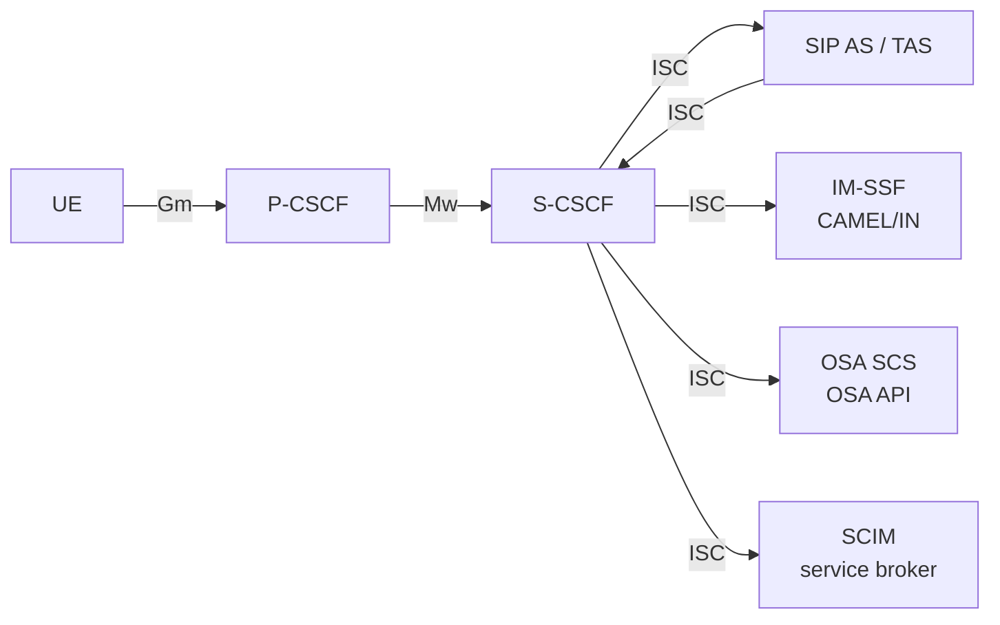
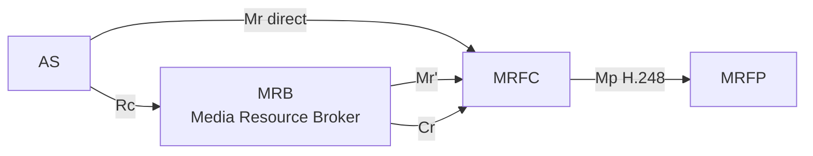
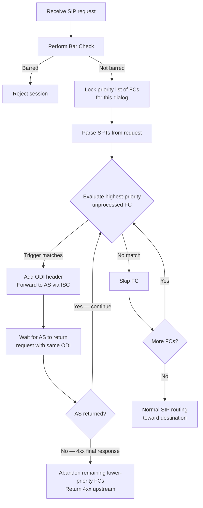
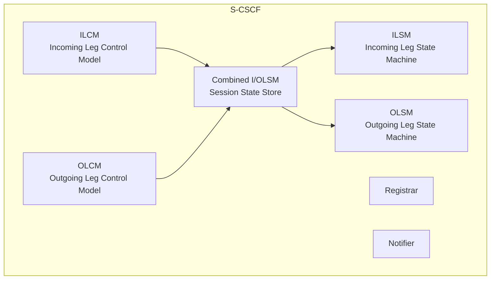
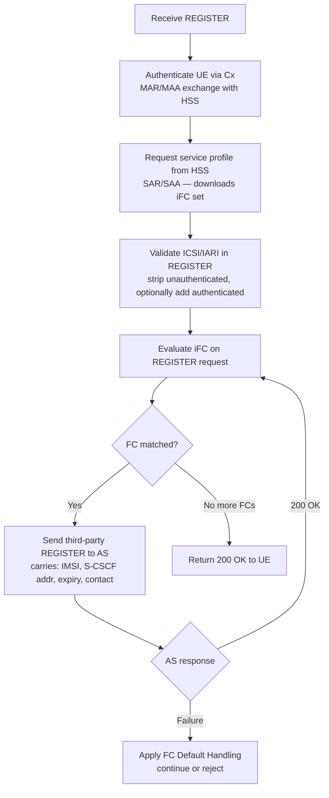
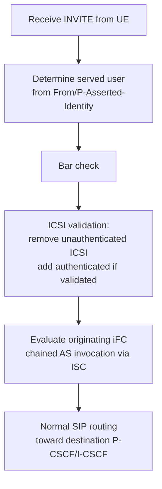
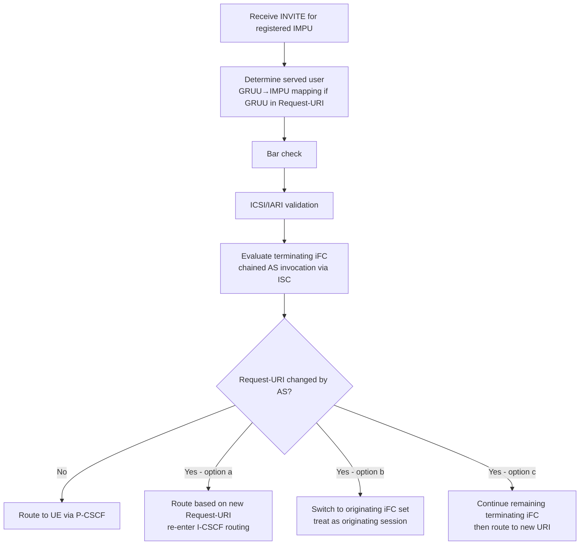
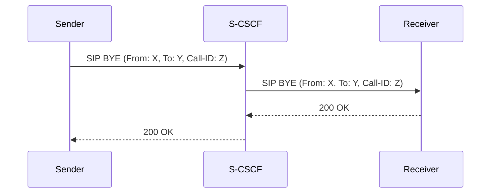
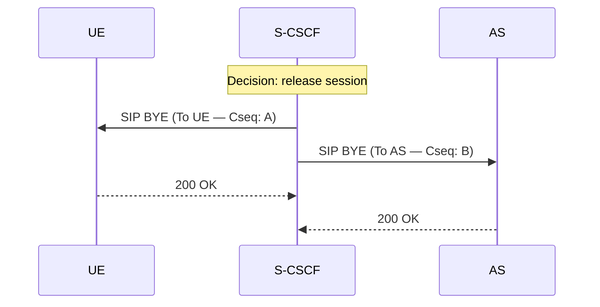
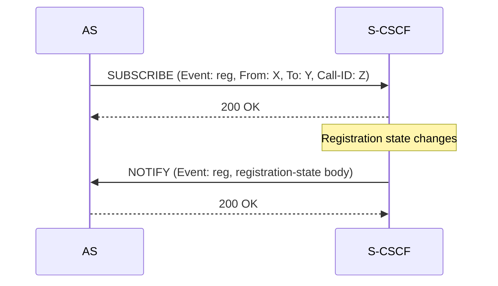

# IM Call Model: S-CSCF Service Architecture, iFC, and SPTs

Covers TS 23.218 §4–§6.5A: the IP Multimedia (IM) call model defining how S-CSCF
evaluates initial Filter Criteria (iFC) to invoke Application Servers via the ISC
interface, plus the Transit Function variant, ICSI/IARI identifiers, and per-direction
registration/session handling procedures.

Related pages: [S-CSCF](../entities/S-CSCF.md) · [TAS](../entities/TAS.md) ·
[HSS](../entities/HSS.md) · [MRF](../entities/MRF.md) ·
[IMS Identity Model](IMS-identity-model.md) ·
[IMS Registration](../procedures/IMS-registration.md) ·
[IMS Reference Points](../interfaces/IMS-reference-points.md)

---

## 1. Service Provision Architecture (§5.1.1)



The **ISC interface** (SIP-based) connects S-CSCF to all Application Server types:
- **SIP AS / TAS**: pure SIP application server (MMTEL telephony features)
- **IM-SSF**: CAMEL service support function (maps SIP to CAMEL/IN)
- **OSA SCS**: Open Service Access service capability server
- **SCIM**: service capability interaction manager (AS broker/aggregator)

Key rule: S-CSCF invokes each AS **in priority order** via the iFC chain. Each AS
either forwards the request back to S-CSCF (via Record-Route + ISC) or acts as UAS.

### Media Resources (§5.1.2)



AS can reach MRFC either:
- **Direct** (Mr): AS → MRFC directly with SIP
- **Via MRB** (In-Line mode): AS → MRB → MRFC (MRB selects appropriate MRFP)

### ISC Gateway Function (§5.1.2A)

For third-party AS outside the home network or requiring network config hiding:

| Function | Description |
|---|---|
| **THIG** | Topology Hiding Inter-network Gateway — hides internal S-CSCF identity from AS |
| **Screening** | Blocks or modifies SIP messages on ISC per policy |
| **IMS-ALG** | Application Layer Gateway — NAT/codec translation at ISC boundary |
| **TrGw** | Transition Gateway — IPv4↔IPv6 translation; connected via Ix to IMS-ALG |

### Border Control for Other Interfaces (§5.1.3)

**IBCF** (Interconnection Border Control Function) sits on:
- Mr / Mr' / Cr (S-CSCF↔MRFC when media crosses network)
- Mm (IMS↔external SIP networks)
- Ici (IBCF↔IBCF inter-operator)

---

## 2. IMS Communication Service Identifier (ICSI) (§5.1A)

ICSI identifies **which IMS communication service** a session belongs to
(e.g. MMTel voice, MMTel video, IMS messaging). It is carried as a SIP feature tag.

| State | Source | Trust |
|---|---|---|
| **Unauthenticated ICSI** | UE-provided in INVITE | Not trusted; S-CSCF strips it |
| **Authenticated ICSI** | S-CSCF adds after iFC validation | Trusted by all downstream nodes |

**S-CSCF ICSI handling:**
1. On INVITE arrival: remove any unauthenticated ICSI inserted by UE
2. Evaluate iFC — if a matched AS confirms the service → S-CSCF inserts authenticated ICSI
3. Authenticated ICSI propagates to terminating S-CSCF and P-CSCF
4. ICSI may be used as **SPT** in iFC to trigger specific ASes only for that service

---

## 3. IMS Application Reference Identifier (IARI) (§5.1B)

IARI identifies **which application** should handle termination at the UE side.
Carried in SIP Contact/Feature tags.

- If IARI is absent from a request: default application assumed at terminating UE
- S-CSCF uses IARI as an SPT criterion (terminating iFC) to route to the correct TAS
- TAS reads IARI to select the right application handler

---

## 4. Service Point Triggers (SPTs) (§5.2.1)

SPTs define the conditions under which a Filter Criterion fires. Six types:

| Type | Match Field | Example |
|---|---|---|
| **SIP Method** | SIP request method | `INVITE`, `REGISTER`, `MESSAGE` |
| **Registration Type** | Registration sub-type | Initial / Re-registration / De-registration |
| **Header Presence** | Presence/absence of a named SIP header | `P-Asserted-Identity` present |
| **Header Content** | Value of a named SIP header or Request-URI | `To: +601x...` matches regex |
| **Direction** | Originating vs terminating; registered vs unregistered user | UE-originating for registered |
| **Session Description** | SDP body content (media type, codec, direction) | `audio` with `sendrecv` |

**Bar check**: before any SPT matching, S-CSCF performs the Operator Determined Barring
check. If barring applies, SPT matching is skipped and the session is rejected.

**REGISTER handling**: a REGISTER request is always treated as UE-originating for SPT
direction matching purposes, even though it is not a session setup.

---

## 5. Filter Criteria (iFC) (§5.2.2)

Each Filter Criterion (FC) is a subscriber-specific rule downloaded from HSS at registration.

| Field | Description |
|---|---|
| **Priority** | Integer; unique per user; lower = higher priority; evaluated in ascending order |
| **Trigger Point** | Boolean expression of 1–n SPTs using AND / OR / NOT operators |
| **AS Address** | SIP URI of the Application Server to invoke if trigger fires |
| **Default Handling** | What to do if AS fails: `SESSION_CONTINUED` or `SESSION_TERMINATED` |
| **Service Information** | Optional opaque data passed to AS in ISC INVITE body |
| **Include REGISTER** | Flag: include REGISTER request or response (or both) in AS notification |

**Trigger Point semantics:**

```
TriggerPoint = SPT1 AND (SPT2 OR NOT SPT3)
```

If no trigger point defined: FC always matches (fires on every request).

---

## 6. S-CSCF iFC Processing Algorithm (§5.2.3)



**ODI (Original Dialog Identifier)**: token inserted by S-CSCF into SIP request before
forwarding to AS via ISC. The AS **must** return this ODI unchanged, allowing S-CSCF to
correlate the returned request to the right dialog and advance to the next FC.

**AS denial mechanism**: an AS that wants to deny lower-priority FCs uses Record-Route
**not** to return the request to S-CSCF. This is done via the first SIP transaction;
it is not expressed via the iFC itself.

**AS final response (4xx)**: if AS returns a 4xx (failure) response, S-CSCF abandons
all remaining lower-priority FCs and propagates the 4xx upstream. No further AS invocation.

**Priority list locking**: once S-CSCF has begun iFC evaluation for a dialog leg,
the priority list is locked. It is only unlocked when the request leaves S-CSCF via Mw
(i.e. forwarded to P-CSCF or toward destination).

---

## 7. Transit Invocation Criteria (TIC) and Transit Function (§5.2.4–5.2.5)

The **Transit Function** is an S-CSCF variant used for routing transit traffic (not
registered user sessions). Key differences:

| | S-CSCF | Transit Function |
|---|---|---|
| Subscriber context | User-specific iFC from HSS | No subscriber context |
| Trigger criteria | iFC (per user, per IMPU) | TIC (network-configured, global) |
| Registrar | Yes (Cx, user registration) | No |
| iFC evaluation algorithm | §5.2.3 | Identical algorithm, applied to TIC |

TIC is provisioned locally in the Transit Function — not downloaded from HSS.
The SPT types, AND/OR/NOT logic, priority ordering, and ODI mechanism are identical.

---

## 8. S-CSCF Functional Model (§6.1.1)



| Component | Role |
|---|---|
| **ILCM** | Controls incoming SIP dialog leg; can act as proxy, redirect server, or UA |
| **OLCM** | Controls outgoing SIP dialog leg; same modes |
| **Combined I/OLSM** | Stores session state for both legs; single instance per dialog |
| **ILSM** | State machine for incoming leg (SIP dialog states) |
| **OLSM** | State machine for outgoing leg |
| **Registrar** | Handles REGISTER requests; stores bindings; interfaces Cx |
| **Notifier** | Manages event package subscriptions (reg, presence, etc.) |

Each leg is independent — a leg may be a SIP proxy on one side and a B2BUA on another.

### Transit Function Functional Model (§6.1.2)

Same as S-CSCF minus the Registrar component. No ILCM/Registrar binding.

---

## 9. S-CSCF Interfaces (§6.2)

| Interface | Protocol | Peer | Purpose |
|---|---|---|---|
| **Mw** | SIP | P-CSCF, I-CSCF, other S-CSCFs | UE session signalling (via CSCFs) |
| **ISC** | SIP | SIP AS, TAS, IM-SSF, OSA SCS, SCIM | AS invocation chain per iFC |
| **Cx** | Diameter | HSS | Authentication; download subscriber profile + iFC; update registration state |
| **MRB** | ISC-like | MRB (In-Line mode) | AS media resource brokering |
| **Mr** | SIP | MRFC | Direct media resource control |

---

## 10. Registration Handling (§6.3)

When UE sends REGISTER, S-CSCF:



**Third-party REGISTER**: S-CSCF sends a fresh REGISTER to each AS whose iFC matched
the REGISTER trigger. The body carries the original REGISTER contact, expiry, and
subscriber identifiers so the AS can update its own binding.

**Alternative**: AS may subscribe to the **reg event package** (RFC 3680) on S-CSCF
instead of receiving third-party REGISTERs. Either mechanism keeps AS aware of
registration state.

**Failure handling**: if an AS returns an error during third-party REGISTER, S-CSCF
applies the FC's `Default Handling` field:
- `SESSION_CONTINUED`: continue to next FC, skip failed AS
- `SESSION_TERMINATED`: reject the REGISTER (UE registration fails)

---

## 11. UE-Originating Session Handling (§6.4)

### Registered User (§6.4.1)



iFC set used: **originating** (direction SPT = UE-originating/registered).

### Unregistered User (§6.4.2)

Same as §6.4.1 except S-CSCF must first **download subscriber profile from HSS** (via
SAR/SAA, `UNREGISTERED_USER` reason) if not already cached. The iFC subset for
unregistered-state originating traffic is applied. After all FCs processed: normal routing.

---

## 12. UE-Terminating Session Handling (§6.5)

### Registered User (§6.5.1)



**Request-URI change at AS**: when a terminating AS changes the Request-URI:
- **Option (a)**: S-CSCF routes based on the new URI — may result in re-routing through I-CSCF
- **Option (b)**: S-CSCF switches to originating iFC and treats session as originating
- **Option (c)**: S-CSCF continues evaluating remaining terminating iFC, then routes to new URI

Which option is used is determined by the FC content / AS agreement.

### Unregistered User (§6.5.2)

Same procedure as §6.5.1 except:
- S-CSCF fetches subscriber profile from HSS (SAR, `UNREGISTERED_USER`)
- If **no terminating iFC** matches → S-CSCF **rejects** the session (not forwarded to UE)
  - Contrast: originating unregistered → continues to normal routing after last FC
  - Terminating unregistered with no matching iFC → session terminated

---

## 13. Transit Function Request Handling (§6.5A.1)

Transit Function evaluates Transit Invocation Criteria (TIC) on initial/standalone
SIP requests passing through it. The algorithm is **identical** to §5.2.3 (iFC evaluation)
but:
- TIC is locally configured (not from HSS/subscriber profile)
- No registered user context — applies to any transit request
- ODI mechanism and priority ordering: same as S-CSCF

---

## 14. S-CSCF Session Release Handling (§6.6)

In handling session release, S-CSCF (and Transit Function) operate in one of two modes:

### Proxying Release Request (§6.6.1)

When S-CSCF receives a BYE from any entity (AS, UE via P-CSCF, etc.), it proxies the
BYE to the destination according to the route information in the BYE. The From/To/Call-ID
are preserved unchanged.



### Initiating Release Request (§6.6.2)

When S-CSCF decides to terminate a session (administrative / service expiry / prepaid),
it generates BYE requests toward **all entities** involved in the dialog:



Both BYEs are sent simultaneously with independent CSeq numbers. The AS receives a
separate BYE addressed to it. This is the S-CSCF-initiated variant of session release
(see [Session Release §5.10.3.2](../procedures/session-release.md)).

---

## 15. S-CSCF Subscription and Notification (§6.7)

S-CSCF supports the **reg event package** (RFC 3680), allowing subscribing entities
(UEs, P-CSCFs, Application Servers) to learn about registration state changes.



NOTIFY content includes:
- All implicitly registered public user identities associated with the registered IMPU
- GRUUs, ICSIs, IARIs per registered contact
- Associated parameters of every contact of each registered public user identity

This is the alternative to third-party REGISTER for AS tracking of registration state.

---

## 16. S-CSCF IMS Charging (§6.8)

### Charging Parameters

| Parameter | Description |
|---|---|
| **ICID** (IMS Charging ID) | Globally unique session identifier generated by P-CSCF; S-CSCF stores and propagates it |
| **IOI** (Inter-Operator Identifier) | Identifies the home network serving the user (or visited network); globally unique |
| **Charging function addresses** | Addresses of on-line (CCF) and off-line (AAA) charging entities from HSS |

### Originating Case

1. Incoming request carries ICID from upstream P-CSCF (which generated it)
2. S-CSCF stores ICID and processes via iFC
3. Outgoing message to AS/next hop: S-CSCF includes ICID + charging function addresses
   (received from HSS) + its own IOI
4. If message sent **outside home network**: S-CSCF removes access network (IP-CAN)
   charging information
5. IOI response: peer may return a separate IOI identifying their network; S-CSCF retains
   this IOI when contacting ASes but removes it before forwarding further in the network

### Terminating Case

1. Incoming INVITE carries ICID generated by originating P-CSCF
2. S-CSCF stores ICID + processes via iFC
3. Outgoing message: includes ICID + charging function addresses from HSS + IOI
4. If IOI received from MGCF (PSTN-originated): identifies originating PSTN/PLMN
5. S-CSCF removes access network (IP-CAN) charging information when sending to
   terminating UE's visited network or originating UE's home network

**CDR generation**: S-CSCF generates a CDR for charging purposes on each session.

**Charging function address conflict**: charging addresses received via ISC from AS
take precedence over those from Sh (Sh is fallback only).

### Transit Function Charging (§6.8A)

Transit Function generates CDRs. Charging function addresses are locally configured.

| Scenario | IOI handling |
|---|---|
| Sending request to AS | Remove received IOI; insert own IOI; keep ICID |
| Forwarding to downstream (non-AS) entity | Keep received ICID and IOI |
| Sending response to AS | Remove received IOI; insert own IOI; keep ICID |

---

## 17. S-CSCF Subscriber Data Description (§6.9)

### Application Server Subscription Information (§6.9.1)

**Application Server Subscription Information** = the complete set of iFC stored in
HSS for a user's service profile. Sent by HSS to S-CSCF via Cx at registration.

- Multiple FCs may be sent if implicitly registered public user identities belong to
  different service profiles
- FCs may also be sent post-registration via Cx when requested (e.g. profile update)
- Filtering applies to **initial SIP requests only** — not mid-dialog requests

### Filter Criteria Components (§6.9.2)

| Component | §6.9.2.x | Description |
|---|---|---|
| AS address | 6.9.2.1 | SIP URI of the AS to invoke when FC triggers |
| Default handling | 6.9.2.2 | `SESSION_CONTINUED` (skip) or `SESSION_TERMINATED` (reject) on AS failure |
| Trigger point | 6.9.2.3 | Set of SPTs with AND/OR/NOT logic; S-CSCF evaluates and proxies if match |
| iFC Priority | 6.9.2.4 | Order of evaluation; S-CSCF starts with highest priority; contacts AS of first match |
| Service Information | 6.9.2.5 | Opaque data; not processed by HSS or S-CSCF; included in body of ISC request to AS |
| Include Register Request | 6.9.2.6 | Flag: include original REGISTER request body in third-party REGISTER body |
| Include Register Response | 6.9.2.7 | Flag: include final response to REGISTER in third-party REGISTER body |

**Include Register flags security note**: if AS is outside the trust domain for any
SIP header field in the REGISTER request/response, these flags should NOT be set in the
FC for that AS — this would expose subscriber data the AS is not trusted to receive.

**Subsequent Filter Criteria (sFC)**: defined in spec but **not used** in this version
of TS 23.218 (Release 17). Only initial filter criteria (iFC) are operative.

### Authentication Data (§6.9.3)

Authentication data is sent by HSS to S-CSCF via Cx during registration. Definition
in TS 23.008; handling in TS 33.203.

---

## 18. TriggerPoint CNF/DNF Logic (TS 29.228 Annex C)

The `TriggerPoint` element contains 1..n `ServicePointTrigger` (SPT) elements. The `ConditionTypeCNF` boolean controls how the `Group` attribute on each SPT forms the boolean expression.

### CNF — Conjunctive Normal Form (`ConditionTypeCNF = TRUE`)

The overall condition is an **AND of OR-clauses**. Each unique `Group` integer identifies one OR-clause. SPTs sharing the same Group value are **OR'd**; the result clauses are **AND'd** together.

```
Result = (Group-1 SPTs ORed) AND (Group-2 SPTs ORed) AND ... AND (Group-N SPTs ORed)
```

**XML example** — trigger = "(RequestURI matches sip:service) AND (Method=INVITE OR SDP has audio)":

```xml
<TriggerPoint>
  <ConditionTypeCNF>1</ConditionTypeCNF>
  <!-- Group 1: single SPT → evaluates to (RequestURI = sip:service) -->
  <SPT>
    <ConditionNegated>0</ConditionNegated>
    <Group>1</Group>
    <RequestURI>sip:service@example.com</RequestURI>
  </SPT>
  <!-- Group 2: two SPTs OR'd → (Method=INVITE) OR (SDP audio present) -->
  <SPT>
    <ConditionNegated>0</ConditionNegated>
    <Group>2</Group>
    <SIPHeader>
      <Header>CSeq</Header>
      <Content>.*INVITE</Content>
    </SIPHeader>
  </SPT>
  <SPT>
    <ConditionNegated>0</ConditionNegated>
    <Group>2</Group>
    <SessionDescription>
      <Line>m</Line>
      <Content>audio .*</Content>
    </SessionDescription>
  </SPT>
</TriggerPoint>
```

### DNF — Disjunctive Normal Form (`ConditionTypeCNF = FALSE`)

The overall condition is an **OR of AND-clauses**. Each unique `Group` integer identifies one AND-clause. SPTs sharing the same Group value are **AND'd**; the result clauses are **OR'd** together.

```
Result = (Group-1 SPTs ANDed) OR (Group-2 SPTs ANDed) OR ... OR (Group-N SPTs ANDed)
```

**XML example** — trigger = "(RequestURI=sip:service AND Method=INVITE) OR (RequestURI=sip:service AND SDP=audio)":

```xml
<TriggerPoint>
  <ConditionTypeCNF>0</ConditionTypeCNF>
  <!-- Group 1: two SPTs AND'd → (URI = service) AND (Method=INVITE) -->
  <SPT>
    <ConditionNegated>0</ConditionNegated>
    <Group>1</Group>
    <RequestURI>sip:service@example.com</RequestURI>
  </SPT>
  <SPT>
    <ConditionNegated>0</ConditionNegated>
    <Group>1</Group>
    <SIPHeader>
      <Header>CSeq</Header>
      <Content>.*INVITE</Content>
    </SIPHeader>
  </SPT>
  <!-- Group 2: two SPTs AND'd → (URI = service) AND (SDP audio) -->
  <SPT>
    <ConditionNegated>0</ConditionNegated>
    <Group>2</Group>
    <RequestURI>sip:service@example.com</RequestURI>
  </SPT>
  <SPT>
    <ConditionNegated>0</ConditionNegated>
    <Group>2</Group>
    <SessionDescription>
      <Line>m</Line>
      <Content>audio .*</Content>
    </SessionDescription>
  </SPT>
</TriggerPoint>
```

### Summary Table

| `ConditionTypeCNF` | Form | Group semantics | Clause combination |
|---|---|---|---|
| `TRUE` (1) | CNF | Same Group → OR'd together | Groups AND'd |
| `FALSE` (0) | DNF | Same Group → AND'd together | Groups OR'd |

The two examples above express the same logical trigger ("URI matches AND (INVITE OR audio)") in equivalent CNF and DNF forms.

---

## 19. SPT Matching Rules (TS 29.228 Annex F, normative)

These rules define exactly how S-CSCF evaluates each SPT subtype against the incoming SIP message.

### General Pre-processing

Before any SPT matching:
1. Remove **SWS** (Slash White Space) and fold **LWS** (Linear White Space) to a single SP character (per SIP grammar, RFC 3261)
2. Canonicalize `tel:` URI parameters before comparison

### Request-URI SPT

- Match field: the full **Request-URI** string of the SIP request
- Algorithm: **ERE** (Extended Regular Expression) match of the `RequestURI` value against the normalised Request-URI
- ERE semantics per POSIX IEEE 1003.1-2008

### SIP-Header SPT

The `SIP-Header` SPT has two sub-fields:
- `Header`: the header field name to inspect
- `Content`: the ERE pattern to match against the header value

Matching rules:
- The SPT evaluates the header against **each header instance** individually. If the request contains multiple instances of the same header (e.g., multiple `Route:` headers), the SPT fires if **any one** matches.
- If `Content` is absent: SPT matches if the named header is **present** in the message (presence check only).
- ERE is applied to the normalised (SWS/LWS-folded) header value.

### Session-Description SPT

- `Line`: the SDP line type character (e.g. `m`, `a`, `c`)
- `Content`: ERE pattern to match against the value of that SDP line
- Matches if **any** SDP line of the specified type matches the ERE.

### SIP-Method SPT

- Exact string match against the SIP method name (e.g., `INVITE`, `REGISTER`, `MESSAGE`)
- Case-sensitive

### RegistrationType SPT (within SIP-Method=REGISTER only)

| Value | Name | Description |
|---|---|---|
| 0 | INITIAL | Initial registration (no existing binding for the IMPU) |
| 1 | RE-REGISTRATION | Re-registration (extends or modifies an existing binding) |
| 2 | DE-REGISTRATION | De-registration (Contact: \*; Expires: 0) |

- Multiple `RegistrationType` values in one SPT = **OR** semantics (fires if any one matches)
- Only meaningful when the containing FC already matches `SIP-Method = REGISTER`
- If S-CSCF does not support RegistrationType: SPT matches **all** REGISTER messages regardless of type

### Session-Case (DirectionOfRequest) SPT

| Value | Name |
|---|---|
| 0 | ORIGINATING_REGISTERED |
| 1 | TERMINATING_REGISTERED |
| 2 | TERMINATING_UNREGISTERED |
| 3 | ORIGINATING_UNREGISTERED |
| 4 | ORIGINATING_CDIV (Call Diversion) |

---

## 20. Cx User-Data XML Schema — Enumerated Types (TS 29.228 Annex E, normative)

The normative XML schema (`IMS-subscription` root element) defines the following key simple types:

### Table E.1 — Simple Type Enumerations

| Type Name | Values | Description |
|---|---|---|
| `tIdentityType` | 0=DISTINCT_PUBLIC_USER_IDENTITY, 1=DISTINCT_PSI, 2=WILDCARDED_PSI, 3=NON_DISTINCT_IMPU, 4=WILDCARDED_IMPU | Type of a `PublicIdentity` entry |
| `tDirectionOfRequest` | 0=ORIGINATING_REGISTERED, 1=TERMINATING_REGISTERED, 2=TERMINATING_UNREGISTERED, 3=ORIGINATING_UNREGISTERED, 4=ORIGINATING_CDIV | SessionCase enum for Session-Case SPT |
| `tDefaultHandling` | 0=SESSION_CONTINUED, 1=SESSION_TERMINATED | Action if AS fails |
| `tRegistrationType` | 0=INITIAL_REGISTRATION, 1=RE_REGISTRATION, 2=DE_REGISTRATION | REGISTER sub-type |
| `tServicePriorityLevel` | 0=highest priority, 4=lowest priority | Priority Service level (integers 0–4) |
| `tProfilePartIndicator` | 0=REGISTERED, 1=UNREGISTERED | Which registration state the iFC applies to (absent = Common Part) |

### Extension Chain (PublicIdentity backward compatibility)

The XML schema uses an extension chain to add fields without breaking older S-CSCFs that parse up to Extension N-1:

```
tPublicIdentityExtension      → IdentityType, WildcardedPSI
  └─ Extension2               → DisplayName, AliasIdentityGroupId
       └─ Extension3          → WildcardedIMPU, ServiceLevelTraceInfo, ServicePriorityLevel
            └─ Extension4     → ExtendedPriority (0..n): PriorityNamespace + PriorityLevel
                 └─ Extension5 → MaxNumOfAllowedSimultRegistrations
```

Each Extension inherits the parent and adds new optional elements. Older nodes that cannot parse Extension N+1 simply ignore the unknown child elements — the base element is always valid.

---

## Summary: iFC Evaluation Decision Matrix

| Scenario | iFC Source | FC direction | No match → | URI change at AS |
|---|---|---|---|---|
| Originating, registered | HSS (already cached) | Originating | Normal routing | N/A |
| Originating, unregistered | HSS fetch (UNREGISTERED) | Originating (unregistered subset) | Normal routing | N/A |
| Terminating, registered | HSS (already cached) | Terminating | Route to UE | Options a/b/c |
| Terminating, unregistered | HSS fetch (UNREGISTERED) | Terminating | **Reject** | Options a/b/c |
| Transit | Local TIC config | N/A | Normal routing | N/A |
| REGISTER | HSS (on registration) | REGISTER trigger | No third-party REGISTER | N/A |
