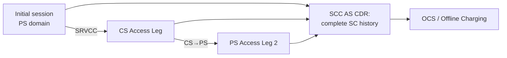
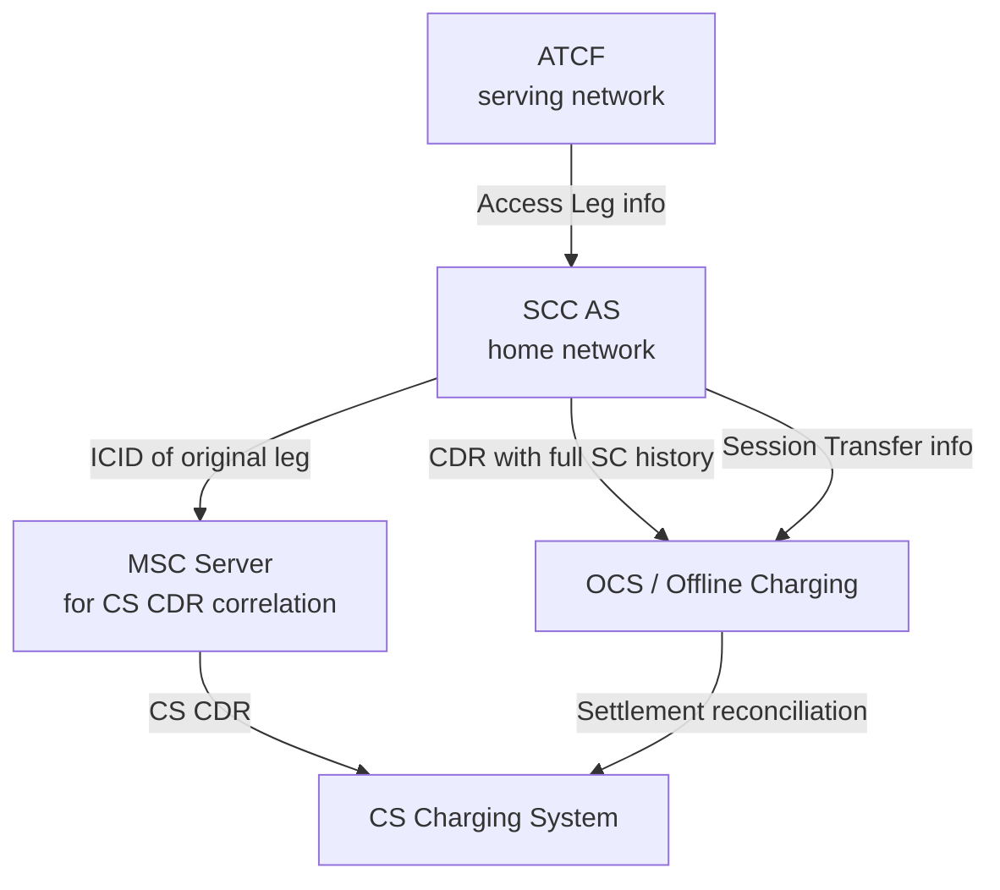

# IMS Service Continuity — Security and Charging

This page covers the security and charging framework for IMS Service Continuity (SC) and Inter-UE Transfer (IUT).

Reference: **3GPP TS 23.237 §7–§8**

---

## §7 Security

### General (§7.1)

> There are no impacts on existing security mechanisms for the CS Domain or for IMS as a result of Session Transfers.

IMS SC introduces no new security vulnerabilities or requirements beyond those of the underlying domains:

| Domain | Security Spec | SC Impact |
|---|---|---|
| CS Domain | TS 33.102 (GSM/UMTS Security Architecture) | No additional requirements |
| IMS | TS 33.203 (IMS Access Security) | No additional requirements |

The existing IMS AKA and CS authentication mechanisms are sufficient to protect SC procedures. The SCC AS, ATCF, and EATF operate within the security perimeter of the IMS they inhabit (serving network for ATCF/EATF; home network for SCC AS).

---

## §8 Charging

SC introduces specific charging challenges because a single subscriber multimedia session may span multiple access legs in different domains (IMS and CS) over its lifetime. The SCC AS is the charging anchor for the session.

### §8.1 Charging Strategy

The following strategy applies to ensure completeness, correctness, and avoidance of double billing:

#### Cohesive Session-Level Records

The **SCC AS provides a cohesive charging record** (CDR) that captures the complete Service Continuity history for the entire duration of a subscriber multimedia session — spanning all Access Legs, all domain transitions, and all session modifications.

#### CS + IMS Charging Correlation

For sessions that involve both CS origination/termination and IMS charging:
- CS charging records and IMS charging records MUST be correlated for the same subscriber multimedia session
- This prevents double billing when an SRVCC call generates both a CS CDR (from MSC) and an IMS CDR (from SCC AS)
- In roaming scenarios: **SCC AS returns the ICID (IMS Charging ID) of the original access leg to the MSC Server**, so the MSC can include it in CS charging records for reconciliation

#### Subsequent Access Leg Treatment

| Charging Rule | Rationale |
|---|---|
| Transferring-in access leg charges = "subsequent Access Leg" | Prevents re-counting the same call as a new origination |
| These records do NOT impact the direction of the initial call | Transfer is a continuity mechanism, not a new call |
| Start of charging in transferring-in network aligned with stop of charging in transferring-out network | Prevents overlap billing during the handover window |

#### Online Charging (OCS) — SC Specific Rules

To avoid online charging correlation problems across IMS and CS domains:

- **SC online charging is performed only in IMS** — the SCC AS is the sole OCS reporting point
- CS prepaid logic (CS domain CAMEL/IN) **MUST NOT** be invoked for:
  - Anchored CS origination calls (calls established via SRVCC on the CS leg)
  - Anchored CS termination calls
  - Subsequent CS origination calls established during Session Transfer
- SCC AS reports to OCS:
  1. Information related to **initial multimedia session establishment** (origination charging)
  2. Information related to the **Session Transfer procedure** (to enable correct credit control)

### §8.2 Accounting Strategy

For inter-operator settlement:

| Accounting Rule | Purpose |
|---|---|
| SCC AS provides cohesive SC history across all access legs | Single reference for settlement disputes |
| CS/IMS charging records for subsequent Access Legs + MGCF CS-IMS interworking records | Used as reference for settlement between CS domain and IMS providers |
| Access network info in IMS charging records | Used for settlement between IP-CAN provider and IMS Core operator |
| I1 flow reconciliation possible | I1 flows are uniquely identifiable from other flows on the same bearer (see TS 23.292 §5.4.1) — allows additional settlement reconciliation |

---

## Charging Architecture Summary

**Key responsibility assignments:**

| Node | Charging Responsibility |
|---|---|
| SCC AS | Cohesive CDR covering complete SC session; sole OCS reporting point; ICID correlation |
| ATCF/EATF | Reports access leg changes to SCC AS |
| MSC Server | Generates CS domain CDR; references ICID provided by SCC AS |
| MGCF | CS-IMS interworking charging records for I1 flows |

---

## Cross-references

- [entities/SCC-AS.md](../entities/SCC-AS.md) — SCC AS: charging anchor, OCS reporting
- [entities/ATCF.md](../entities/ATCF.md) — ATCF: Access Transfer Control Function; access leg info
- [procedures/PS-CS-access-transfer.md](PS-CS-access-transfer.md) — AT procedures generating charging events
- [concepts/IMS-service-continuity.md](../concepts/IMS-service-continuity.md) — full SC concept
