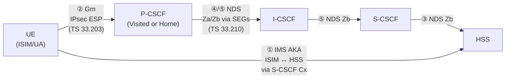

# IMS Access Security

Security framework for the IMS Gm reference point (UE ↔ P-CSCF). Defined in 3GPP TS 33.203. Covers subscriber authentication, SIP signalling confidentiality/integrity, and network topology hiding. Operates independently of PS-domain (EPS/UMTS) access security.

---

## Security Architecture Overview

The IMS requires its own security association separate from the PS-domain association. Figure 1 (TS 33.203) identifies **five security associations**:

| SA | Parties | Spec | Mechanism |
|---|---|---|---|
| ① | ISIM ↔ HSS (via S-CSCF Cx) | TS 33.203 §6.1 | IMS AKA — HSS delegates challenge to S-CSCF |
| ② | UE ↔ P-CSCF (Gm) | **TS 33.203** (this spec) | IPsec ESP; keys from IMS AKA |
| ③ | CSCFs ↔ HSS (Cx) | TS 33.210 | NDS/IP (Zb interface) |
| ④ | P-CSCF (VN) ↔ CSCFs (HN) | TS 33.210 | NDS/IP inter-domain via SEGs (Za interface) |
| ⑤ | Within HN between SIP nodes | TS 33.210 | NDS/IP intra-domain (Zb interface) |

> SA ② is the primary focus of TS 33.203. SAs ③–⑤ are specified in TS 33.210.

SIP confidentiality/integrity is hop-by-hop: UE→P-CSCF is protected by IPsec (this spec); subsequent hops use NDS.

**P-CSCF placement:** May reside in the Visited Network or Home Network. When in VN, inter-domain NDS (Za, SA ④) applies between P-CSCF and HN CSCFs. When in HN, only intra-domain NDS (Zb, SA ⑤) applies. Co-location with GGSN/PGW is permitted per APN selection criteria (TS 23.060 / TS 23.401).

---

## Security Features (§5)

### Authentication (§5.1.1)

- Mutual authentication between UE/ISIM and the Home Network (HSS)
- AKA protocol: challenge-response; UMTS/EPS AKA concept reused as **IMS AKA**
  - AV quintet: RAND, XRES, CK, IK, AUTN
  - Generated by HSS (AuC); delegated to S-CSCF via Cx
  - RAND/AUTN transported via SIP (RFC 3310); RES returned in Authorization header
  - Key difference from UMTS: RES not sent in clear — embedded in Authentication response header per RFC 3310
- Every initial registration **shall** be authenticated
- Re-registration: operator policy decides whether to authenticate (S-CSCF may require it at any time)
- A REGISTER without integrity protection is treated as an initial registration (§5.1.2)
- Security after breach: IMS security remains active even if PS-domain is compromised (independent SA)

### Confidentiality (§5.1.3)

- Optional — P-CSCF local policy decides
- Mechanism: IPsec ESP (RFC 4303) in transport mode between UE and P-CSCF
- Algorithm: negotiated during security mode setup (§7)
- Key CK_ESP derived from AKA cipher key CK via key expansion (Annex I)
- NULL cipher algorithm permitted; operators may disable encryption if trusting access network
- Confidentiality between CSCFs / CSCF↔HSS: NDS (TS 33.210)

### Integrity (§5.1.4)

- **Mandatory** between UE and P-CSCF
- Mechanism: IPsec ESP (RFC 4303); transport mode normally; UDP encapsulated tunnel mode if NAT traversal required
- Algorithm: negotiated during security mode setup; anti-replay enabled on all SAs
- Key IK_ESP derived from AKA integrity key IK via key expansion (Annex I)
- Both parties verify data origin: guards against tampering and replay/reflection attacks
- Integrity between CSCFs: NDS (TS 33.210); TLS optional on top

### Network Topology Hiding (§5.2)

- Operator network internals (number/addresses of S-CSCFs, capabilities) are sensitive business data
- **I-CSCF/IBCF** encrypts SIP header fields containing internal node addresses: Via, Record-Route, Route, Path
- Encryption algorithm: AES in CBC mode (128-bit block, 128-bit key); **random IV per encryption** (same plaintext → different ciphertext)
- Shared encryption/decryption key Kv held by all I-CSCFs/IBCFs in the Home Network
- P-CSCF may receive encrypted routing info but cannot decrypt (does not hold Kv)
- Implementation is optional; not all deployments require it

### SIP Privacy in IMS Networks (§5.3)

- SIP Privacy Extensions per IETF RFC 3323 [29] and RFC 3325 [30]
- Allows IMS subscriber to withhold certain identity information from other parties
- Does not create additional CSCF state beyond normal SIP state
- P-Asserted-Identity / P-Preferred-Identity headers used within the IMS trust domain

### SIP Privacy with Non-IMS Networks (§5.4)

- CSCF interworking with non-IMS network: CSCF decides trust relationship
- If non-IMS peer is **trusted**: privacy information may be shared
- If non-IMS peer is **untrusted**: all privacy headers stripped from traffic to that network; retained for IMS-to-IMS
- Implicit trust: CSCFs behind SEGs that use NDS are implicitly trusted (Rel-5 CSCF); Rel-5+ may configure this as a policy option

---

## Security Mechanisms (§6)

### IMS AKA — Authentication and Key Agreement (§6.1)

**Key concepts:**
- Identity used for authentication: IMPI (NAI format, e.g. `user@home.net`), shared with HSS
- AV includes RAND, XRES, CK, IK, AUTN — same computation as TS 33.102
- SQN counters tracked by both ISIM and HSS (SQN_ISIM, SQN_HSS)
- Two pairs of SAs established per registered contact (per IMPU set sharing one IMPI)
- Emergency registration creates separate SA pair from normal registration

**Authentication flow (§6.1.1) — see [IMS-AKA-registration.md](../procedures/IMS-AKA-registration.md) for full step-by-step.**

**Authentication failures (§6.1.2):**

| Failure | Trigger | Handling |
|---|---|---|
| User auth failure (§6.1.2.1) | Wrong RES in SM7 | IK_IM usually also wrong → SM7 fails IPsec integrity at P-CSCF; discarded. If IK_IM correct but RES wrong: S-CSCF sends 4xx Auth_Failure |
| Network auth failure (§6.1.2.2) | MAC check fails in UE (wrong AUTN) | UE sends REGISTER(Failure=AuthenticationFailure); S-CSCF clears S-CSCF name in HSS if IMPU not registered |
| Sync failure (§6.1.3) | SQN out of range in UE | UE sends REGISTER(Failure=SyncFailure, AUTS); S-CSCF sends Cx-AV-Req(IMPI, RAND, AUTS) to HSS for re-sync; HSS updates SQN and sends fresh AVs |
| Incomplete auth (§6.1.2.3) | New REGISTER arrived before previous challenge answered | S-CSCF discards previous auth state; challenges new REGISTER |
| Network-initiated re-auth (§6.1.4) | S-CSCF triggers re-registration | S-CSCF sends "Authentication Required" indication → UE initiates re-registration |

**Integrity protection indicator (§6.1.5):** P-CSCF attaches indicator to forwarded REGISTER telling S-CSCF whether the message was integrity-protected by an active IPsec SA. Two cases trigger "integrity protected":
1. REGISTER with authentication response, protected with SA from this authentication procedure
2. REGISTER without authentication response, protected with SA from a previous successful authentication

**Security after registered-not-authenticated:** A registered user shall not be de-registered if it fails authentication (DoS prevention — attacker could otherwise de-register users by sending wrong RES).

### Confidentiality Mechanism — IPsec ESP (§6.2)

- ESP in transport mode (RFC 4303)
- CK_ESP = key_expansion(CK_IM, algorithm) — per Annex I
- Same CK_ESP for both simultaneously-established SA pairs (SA pair 1 and SA pair 2)
- Expansion done independently at UE and P-CSCF
- Dummy packets (Next Header = 59) not permitted (since Rel-11)

### Integrity Mechanism — IPsec ESP (§6.3)

- Same SA structure as confidentiality; integrity algorithm negotiated separately
- IK_ESP = key_expansion(IK_IM, algorithm) — per Annex I
- Transport mode if no NAT; UDP encapsulated tunnel mode if NAT traversal needed (RFC 3948)
- Anti-replay service shall be enabled on all SAs
- Same IK_ESP for both SA pairs in a direction

### Hiding Mechanism (§6.4)

- Optional; all I-CSCFs/IBCFs in HN share encryption key Kv
- AES-CBC 128-bit block + 128-bit key; random IV included in same SIP header as encrypted data
- Protects: Via, Record-Route, Route, Path header contents when forwarding to external domains

### CSCF Interworking with Non-IMS Proxy (§6.5)

- TLS (RFC 3261) may protect SIP interoperation with proxies in foreign networks
- CSCF initiates TLS connection; NAPTR/SRV DNS to locate proxy (RFC 3263)
- Certificate verification against list of trusted interworking partners
- Single TLS connection can carry multiple SIP dialogs
- Does not preclude additional NDS mechanisms (TS 33.210 Annex A)

---

## Security Association Parameters (§7.1)

Negotiated between UE and P-CSCF during security mode setup:

| Parameter | Negotiated? | Details |
|---|---|---|
| Encryption algorithm | Yes | UE offers list ordered by priority; P-CSCF selects from intersection; NULL algorithm allowed |
| Integrity algorithm | Yes | Same selection process; must match TS 33.210 §5.3.4 profiling + Annex H signalling |
| SPI (Security Parameter Index) | Yes | UE selects 2 unique SPIs (spi_uc, spi_us); P-CSCF selects 2 different unique SPIs (spi_pc, spi_ps) |
| SA duration | No | Fixed at 2³²-1 seconds; actual SA lifetime controlled by SIP registration timer |
| Mode | No | Transport mode (default); UDP encapsulated tunnel if NAT present |
| Key length | No | Determined by chosen algorithm (Annex I) |

**Selectors (SA binding):**
- IP addresses: bound to addresses in initial REGISTER packet headers (inbound SA at P-CSCF = same src/dst IP as initial REGISTER)
- Transport protocol: both UDP and TCP
- Ports: 4 protected ports defined (2 at UE, 2 at P-CSCF); non-standard ports distinct from SIP default 5060/5061

| Port | Owner | Role |
|---|---|---|
| port_us | UE | UE protected server port — receives ESP traffic from P-CSCF client |
| port_uc | UE | UE protected client port — sends ESP traffic to P-CSCF server |
| port_ps | P-CSCF | P-CSCF protected server port — receives ESP traffic from UE client |
| port_pc | P-CSCF | P-CSCF protected client port — sends ESP traffic to UE server |

The four SAs:
- SA pair 1: UE (port_uc) → P-CSCF (port_ps) — uplink unidirectional
- SA pair 2: P-CSCF (port_pc) → UE (port_us) — downlink unidirectional
- (Each pair covers both UDP and TCP transport)

P-CSCF rule: REGISTER messages, emergency messages, and error messages for unprotected messages may arrive on unprotected ports. All other messages on non-protected ports are discarded/rejected.

**SA table at P-CSCF:** (UE_IP, UE_protected_port, P-CSCF_protected_port, SPI, IMPI, IMPU₁..IMPUₙ, lifetime)  
**SA table at UE:** (UE_protected_port, P-CSCF_protected_port, SPI, lifetime)  
Max 6 SAs per direction per IMPI at any time (accommodates pending + active registrations).

---

## ISIM — IMS Subscriber Identity Module (§8)

The ISIM is the collection of IMS security data and functions on a UICC. Three implementation options:

| Option | Description |
|---|---|
| Distinct ISIM application, no USIM sharing | Fully separate; own keys, algorithms, sequence counters |
| Distinct ISIM application, sharing USIM functions | Shared sequence counter or algorithm, but separate auth keys |
| USIM application used for IMS | Auth key, functions, and sequence counter all shared |

**ISIM priority:** If both ISIM and USIM present on UICC, ISIM shall always be used for IMS authentication.

**ISIM contents (§8.1):**
- IMPI (one per ISIM; subscriber cannot modify)
- ≥1 IMPU
- Home Network Domain Name (subscriber cannot modify)
- Sequence number checking (SQN) for IMS domain
- Authentication key (K) and algorithm framework (same as USIM)
- ISIM delivers CK to UE even if confidentiality is not required

**Session key handling:** All SAs and session keys (IK, CK and derived IK_ESP, CK_ESP) deleted at UE power-off. Keys never stored persistently on ISIM.

**ISIM/USIM key sharing rules (§8.2):**
When keys are shared, CS/PS and IMS authentication runs independently — different cipher/integrity key sets result, so compromise of one domain's keys does not expose the other.

---

## IMC — IMS Credentials (§9)

Software-based credential for non-3GPP-only terminals (terminals without 3GPP radio access support). Replaces ISIM/USIM when neither is present.

**IMC contents:** IMPI, ≥1 IMPU, Home Domain Name, SQN checking, algorithm framework (TS 33.102), authentication key.

The IMC is never used if an ISIM or USIM is present on the device.

---

## Key Findings and Architectural Notes

1. **Independent domain security:** IMS AKA runs independently of EPS AKA. Same UICC may hold both USIM and ISIM; even if shared, separate auth runs produce different session key sets. PS-domain compromise does not expose IMS session keys.

2. **P-CSCF as IPsec anchor:** P-CSCF intercepts CK/IK from the 4xx Auth_Challenge (SM4→SM5) and strips them before forwarding SM6 to UE. P-CSCF is the only network node that holds IMS session keys for the Gm hop. It is also the only IMS node that communicates with PCRF (Rx) for bearer authorization — security and policy anchor in one node.

3. **Hop-by-hop security:** Confidentiality/integrity is not end-to-end (UE to S-CSCF); it is hop-by-hop. UE↔P-CSCF is IPsec (this spec). P-CSCF and all subsequent IMS nodes communicate in clear within NDS-protected IP links (TS 33.210).

4. **Integrity mandatory, confidentiality optional:** Operators may omit ESP encryption (NULL cipher) e.g. when trusting the access network. Integrity protection is always required after successful registration.

5. **4-port model prevents reflection attacks:** Separate client/server ports for UE and P-CSCF ensure uplink messages differ from downlink messages at the SPI level, thwarting reflection attacks. Random SPI selection from large number space also guards against DoS.

6. **Re-registration SA transition:** Old SAs are not immediately deleted on re-authentication — they may protect in-flight SIP transactions. New SAs are used for outbound traffic; old SAs accepted for a grace period until all pending transactions complete or time out.

7. **Topology hiding uses random IV:** Same internal address encrypted with Kv always produces different ciphertext because AES-CBC uses random IV per encryption. The IV is included in the same SIP header field.

---

## Cross-References

- [IMS-AKA-registration.md](../procedures/IMS-AKA-registration.md) — full step-by-step SA setup procedure
- [entities/P-CSCF.md](../entities/P-CSCF.md) — P-CSCF as security anchor
- [entities/P-CSCF-deepdive.md](../entities/P-CSCF-deepdive.md) — IPsec SA management at P-CSCF
- [entities/HSS.md](../entities/HSS.md) — AV generation, Cx-AV-Req
- [entities/S-CSCF.md](../entities/S-CSCF.md) — AV storage, challenge issuance
- [concepts/IMS-identity-model.md](../concepts/IMS-identity-model.md) — IMPI, IMPU, GRUU
- [procedures/IMS-registration.md](../procedures/IMS-registration.md) — IMS registration flow (TS 23.228 view)
