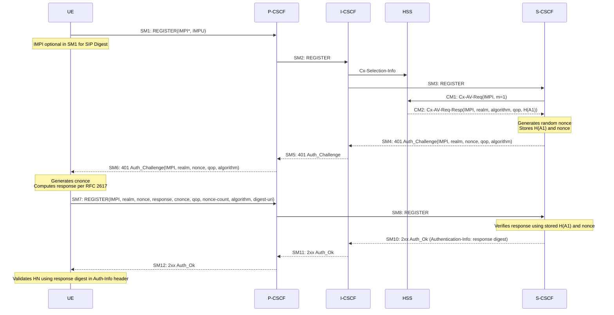

# IMS Authentication Alternatives and Security Protocol Details

Reference page covering the normative annexes of 3GPP TS 33.203: SIP Security Mechanism Agreement syntax (Annex H), IPsec key expansion functions (Annex I), NAT traversal (Annex M), SIP Digest authentication (Annex N), TLS-based access security (Annex O), and authentication scheme coexistence (Annex P).

For the main IMS access security architecture and IMS AKA see [IMS-access-security.md](IMS-access-security.md).  
For the IMS AKA SA setup procedure see [IMS-AKA-registration.md](../procedures/IMS-AKA-registration.md).

---

## Annex H — SIP Security Mechanism Agreement Syntax (RFC 3329 Profile)

The SA negotiation in TS 33.203 §7.2 uses RFC 3329 "Security Mechanism Agreement for SIP Sessions" with 3GPP-specific extensions. The `Security-Client`, `Security-Server`, and `Security-Verify` SIP headers are used.

### BNF Grammar (3GPP profile of RFC 3329)

```
security-client  = "Security-Client" HCOLON sec-mechanism *(COMMA sec-mechanism)
security-server  = "Security-Server" HCOLON sec-mechanism *(COMMA sec-mechanism)
security-verify  = "Security-Verify" HCOLON sec-mechanism *(COMMA sec-mechanism)

sec-mechanism    = mechanism-name *(SEMI mech-parameters)
mechanism-name   = "ipsec-3gpp" / "tls"

mech-parameters  = preference / algorithm / protocol / mode / encrypt-algorithm
                   / spi-c / spi-s / port-c / port-s

preference       = "q" EQUAL qvalue
algorithm        = "alg" EQUAL ("hmac-sha-1-96" / "aes-gmac" / "null")
protocol         = "prot" EQUAL ("ah" / "esp")         ; only "esp" allowed in IMS
mode             = "mod" EQUAL ("trans" / "tun" / "UDP-enc-tun")
encrypt-algorithm = "ealg" EQUAL ("aes-cbc" / "aes-gcm" / "null")
spi-c            = "spi-c" EQUAL spivalue              ; 0 to 4294967295
spi-s            = "spi-s" EQUAL spivalue
port-c           = "port-c" EQUAL port
port-s           = "port-s" EQUAL port
```

**3GPP changes from RFC 3329:**

| Parameter | RFC 3329 original | 3GPP change |
|---|---|---|
| alg | hmac-md5-96, hmac-sha-1-96 | Added: aes-gmac, null; Removed: hmac-md5-96 |
| ealg | des-ede3-cbc, aes-cbc | Added: aes-gcm; Removed: des-ede3-cbc |
| mod | trans, tun | Added: UDP-enc-tun (for NAT traversal) |

**Parameter semantics:**
- `alg` — integrity algorithm. "aes-gmac" = ENCR_NULL_AUTH_AES_GMAC (RFC 4543). "null" only with "aes-gcm" encryption
- `ealg` — encryption algorithm. "aes-gcm" (RFC 4106) only with `alg=null`. If absent, defaults to null (no encryption)
- `mod` — IPsec mode. Defaults to "trans" if absent. "UDP-enc-tun" = UDP encapsulated tunnel mode for NAT traversal
- `prot` — only "esp" is allowed in IMS (§6 requires ESP)
- `spi-c` — SPI for the **inbound SA at the protected client port** (receiving party's client port)
- `spi-s` — SPI for the **inbound SA at the protected server port**
- `port-c` — protected client port number
- `port-s` — protected server port number

### "ipsec-3gpp" Extension Semantics

Three rules extend the base RFC 3329 procedure:

1. **Server stores client header:** P-CSCF stores the `Security-Client` header from SM1 before sending the `Security-Server` header in SM6 (401 Auth_Challenge)
2. **First protected request echoes client header:** SM7 (first protected REGISTER) must include both `Security-Verify` (echoing what the client sent in SM1) and `Security-Client` header fields
3. **Server verifies consistency:** P-CSCF checks that the `Security-Client` content in SM7 matches the content stored from SM1 — this detects bidding-down attacks on algorithm negotiation

The single SA selector covers all SIP transport protocols (UDP and TCP) — a single SA pair handles both.

---

## Annex I — Key Expansion Functions for IPsec ESP

The AKA procedure produces IK_IM (integrity key) and CK_IM (cipher key). These cannot be used directly as IPsec ESP keys for all algorithm combinations — a key expansion step is required.

### Integrity Keys

| Algorithm | IK_ESP derivation |
|---|---|
| **HMAC-SHA-1-96** | `IK_ESP = IK_IM ‖ 00000000` (append 32 zero bits → 160-bit key) |
| **AES-GMAC** (RFC 4543, 128-bit) | `IK_ESP = IK_IM` (direct use, 128 bits) + salt |

For AES-GMAC, a 32-bit salt is required by RFC 4543 §3.2. The salt is derived using the KDF from TS 33.220 Annex B:
- Input key: `CK_IM ‖ IK_IM` (concatenation)
- FC = 0x58
- P0 = "AES_GMAC_SALT" (string)
- L0 = 0x000D (length of P0)
- Salt = 32 least-significant bits of the 256-bit KDF output

### Encryption Keys

| Algorithm | CK_ESP derivation |
|---|---|
| **AES-CBC** (RFC 3602, 128-bit) | `CK_ESP = CK_IM` (direct use, 128 bits) |
| **AES-GCM** (RFC 4106, 128-bit) | `CK_ESP = CK_IM` (direct use, 128 bits) + salt |

For AES-GCM, a 32-bit salt is required by RFC 4106 §4. The salt is derived using the KDF:
- Input key: `CK_IM ‖ IK_IM`
- FC = 0x59
- P0 = "AES_GCM_SALT"
- L0 = 0x000C
- Salt = 32 least-significant bits of the 256-bit KDF output

> Key expansion is performed independently at the UE and at the P-CSCF from the same IK_IM/CK_IM.

---

## Annex M — NAT Traversal

### Scope

Addresses NAT devices located between UE and P-CSCF (at subscriber's residential gateway or in the access network). Only signalling-plane NAT traversal is covered — media plane (RTP) NAT traversal is handled in TS 23.228 / TS 24.229.

### Key Difference from Main Body

When a NAT is detected, **UDP encapsulated tunnel mode** (RFC 3948) is used instead of transport mode. The `mod=UDP-enc-tun` parameter in the Security-Client/Server headers signals this.

**NAT detection:** P-CSCF detects NAT during SA setup (Annex M.7.2) by comparing source IP address in packet headers with IP address in SIP Via header.

### Selector Differences with NAT

With NAT:
- **Outer IP header** used for SA selectors (not inner IP header)
- P-CSCF outbound SA: source = P-CSCF IP; destination = public IP of UE (learned from Via header in 401 response)
- UE outbound SA: source = local (private) IP of UE; destination = P-CSCF IP
- **UDP encapsulation port:** port 4500 used in encapsulating UDP header (standard NAT-traversal port, RFC 3948)
- P-CSCF stores `port_Uenc` (NAT-assigned client port) from first protected and UDP-encapsulated packet from UE

### Restrictions

- 3GPP IMS does not use IKE for key management → only partially RFC 3947 compliant
- Multiple UEs behind the same NAT share a public IP address — P-CSCF disambiguates using protected server port; cannot use same (address, protected server port) pair for different UEs
- General handling (§§4, 5, 6, 7, 8 of main body) unchanged for NAT case except where Annex M specifies modifications

---

## Annex N — SIP Digest Authentication

### Overview

SIP Digest is an **alternative** to IMS AKA for non-3GPP access networks (e.g., fixed broadband, WLAN). It is based on HTTP Digest (RFC 2617). Key properties:

- **Cannot be combined with IPsec** — SIP Digest does not generate session keys; IPsec requires CK/IK
- Mandated to be one of the authentication mechanisms implemented in IMS
- For 3GPP access: UE shall not select SIP Digest; IMS AKA is mandatory for 3GPP radio access
- For non-3GPP access without IMS AKA support: SIP Digest is the default
- When both UE and network support IMS AKA (detected via RFC 3329 sip-sec-agree), IMS AKA takes precedence
- P-CSCF enforces auth scheme selection per Annex P.3

### Authentication Data

**SD-AV (SIP Digest Authentication Vector):** Temporary vector sent from HSS to S-CSCF via Cx:
- `realm` — HSS-assigned realm (operator domain)
- `algorithm` — hash algorithm
- `qop = "auth"` — quality of protection; always "auth" (SIP Digest cannot provide message integrity like IPsec)
- `H(A1)` — hash of IMPI:realm:password (pre-computed by HSS)

HSS and S-CSCF share H(A1). The password is stored in the HSS.

### Registration Flow (SIP Digest)



Key differences from IMS AKA flow:
- SM1: IMPI optional (can derive from IMPU if IMPU not shared across UEs)
- No Security-setup lines (no IPsec SA negotiation)
- SD-AV contains H(A1) instead of RAND/AUTN/XRES/CK/IK
- P-CSCF does not strip any keys (no key material in challenge)
- SM12 contains `Authentication-Info` header with a response digest for mutual auth (UE authenticates HN)

### Non-Registration Message Authentication

After successful registration, P-CSCF maintains an **IP address check table**: maps `(UE IP address, port)` → `(IMPI, IMPUs)`. Subsequent requests (INVITE, etc.) authenticated by:
1. P-CSCF looks up IMPU from IP address → asserts identity to S-CSCF
2. Optionally: S-CSCF challenges with `Proxy-Authenticate: 407` if no Proxy-Authorization present; UE responds with Proxy-Authorization containing cached digest credentials

IP-address-based assertion only reliable when source IP spoofing and reassignment risks are low. For higher security: combine SIP Digest with TLS (Annex O) or use SIP Digest proxy auth.

### Authentication Failures

| Failure | Trigger | Outcome |
|---|---|---|
| User auth failure | Response in SM9 wrong | S-CSCF sends 4xx Auth_Failure; updates registration flag in HSS if IMPU unregistered |
| Network auth failure | Response digest in SM12 fails at UE | UE aborts communication |
| Sync (nonce stale) | Nonce-count mismatch or nonce already used | S-CSCF reissues challenge with `stale=TRUE` → UE retries from SM7 |
| Incomplete auth | New REGISTER before challenge answered | S-CSCF discards previous state; new challenge sent |

### Dynamic Password Change (N.2.5)

HSS can push a new H(A1) to S-CSCF via Cx at any time:
- S-CSCF may hold up to 2 H(A1) values simultaneously during transition
- S-CSCF tries newest H(A1) first; falls back to old on failure; deletes old after new succeeds
- HSS recommends sending push message immediately after user confirms new password
- Security note: if password compromised, administrative de-registration before password change prevents old credentials being accepted

---

## Annex O — TLS-Based Access Security

### Scope and Relationship

TLS (Transport Layer Security) is an alternative to IPsec for protecting the Gm interface (UE ↔ P-CSCF). Applies **only to non-3GPP access** networks — not for 3GPP radio access.

**Binding rule:** SIP Digest (Annex N) must be used with TLS (Annex O). TLS provides confidentiality and integrity protection; SIP Digest provides subscriber authentication. Together they replicate what IMS AKA + IPsec provides in 3GPP access.

### Security Properties

| Property | TLS mechanism |
|---|---|
| Confidentiality | TLS CipherSuites (NULL encryption allowed; UE must offer at least one non-NULL) |
| Integrity | TLS record layer MAC; anti-replay via sequence numbers |
| P-CSCF authentication | X.509 server certificate presented during TLS handshake |
| UE authentication | SIP Digest (Annex N) — not TLS client certificates |

### TLS Profile (O.2.1)

Based on TS 33.310 Annex E TLS profile. Key requirements:
- P-CSCF accepts connections on standard TLS port 5061 or operator-configured port
- Session ID lifetime: local policy; recommended ≥ re-REGISTRATION timeout (~1 hour)
- Forward request procedures per RFC 5626 apply for managing TLS connections
- P-CSCF server certificate: CN = FQDN of P-CSCF; subjectAltName = FQDN; profiled per TS 33.310

### TLS Session Setup (Two Variants)

**Variant 1 — During registration (O.2.2):**
1. SM1–SM6: identical to non-TLS SIP Digest flow, except SM1 includes `Security-Client` with `tls` mechanism; SM6 includes `Security-Server` with `tls`
2. After SM6: UE performs TLS handshake with P-CSCF
3. SM7: sent over new TLS connection (SIP Digest response; Security-Verify header)
4. P-CSCF → SM8 with TLS integrity indicator = "authentication pending"
5. S-CSCF associates registration with state "tls-protected"
6. After SM11: P-CSCF rejects all SIP outside TLS (except emergency and error messages)
7. After SM12: UE rejects all SIP outside TLS (except emergency and error messages)

**Variant 2 — Prior to initial registration (O.2.3):**
1. UE establishes TLS connection **before** sending SM1
2. SM1 sent over TLS (no sip-sec-agree needed — TLS pre-selected)
3. SM7 and all subsequent messages over existing TLS connection
4. P-CSCF marks SM8 with TLS integrity indicator = "authentication pending"
5. Post-SM12: same enforcement as Variant 1

### TLS Session Management (O.4)

- **At UE:** One registration procedure at a time; previous TLS connections deleted on new registration start. P-CSCF HELLO triggers renegotiation — UE sends all renegotiation messages inside existing TLS connection
- **At P-CSCF:** May trigger renegotiation anytime via HELLO. Replaces old Session ID with new after successful renegotiation. Maintains association: TLS Session ID → UE IP:port, IMPI, IMPUs
- **Re-registration:** If UE has existing TLS session, uses it to protect REGISTER

### TLS Certificate Validation

- **UE validates P-CSCF certificate:** Chain to trusted root; exact DER-encoded issuer field matching required
- **CRL:** Optional; profiled per TS 33.310 §6 if used
- First certificate in chain usually not included (UE knows it in advance)

---

## Annex P — Authentication Scheme Coexistence

The same IMS core (same S-CSCF) must support multiple authentication schemes simultaneously. Six schemes defined:

| Scheme | Where specified |
|---|---|
| IMS AKA (no NAT) | TS 33.203 main body |
| IMS AKA with NAT traversal | Annex M |
| IMS AKA over TLS | Annex X |
| GPRS-IMS-Bundled Auth (GIBA) | Annex T |
| NASS-IMS-bundled auth (NBA) | Annex R |
| SIP Digest (with or without TLS) | Annexes N + O |
| Trusted Node Authentication (TNA) | Annex U |

**Requirements:** A single IMS deployment must serve both fixed and mobile subscribers at the same S-CSCF without scheme incompatibilities.

**P-CSCF procedure selection (P.3):** When P-CSCF receives a REGISTER, it determines which authentication scheme to apply. The selection depends on:
- Presence/absence of `Authorization` header in REGISTER
- Presence/absence of `Security-Client` header (indicates UE supports sip-sec-agree / IMS AKA)
- Access network type (3GPP vs non-3GPP)
- P-CSCF local policy

**S-CSCF determination (P.4):** S-CSCF uses multi-step analysis to determine which scheme the UE is using, based on message structure and P-CSCF-forwarded indicators.

---

## Summary: Authentication Scheme Comparison

| Property | IMS AKA + IPsec | SIP Digest + TLS | SIP Digest (no TLS) |
|---|---|---|---|
| Access type | 3GPP (mandatory) | Non-3GPP | Non-3GPP (low-security) |
| Auth mechanism | Challenge-response (RAND/AUTN/RES) | HTTP Digest (nonce/response) | HTTP Digest |
| Transport security | IPsec ESP (mandatory integrity) | TLS | None (IP address check only) |
| Mutual auth | Yes (AUTN verifies network) | Yes (Auth-Info in 200 OK) | One-way (UE only) |
| Message integrity | IPsec ESP (per-packet) | TLS record layer | None |
| Confidentiality | IPsec ESP (optional) | TLS (optional NULL) | None |
| Shared secret type | Long-term key K on ISIM/USIM | Password hash H(A1) | Password hash H(A1) |
| Session keys | CK/IK → CK_ESP/IK_ESP | TLS session keys | None |
| Key storage at S-CSCF | XRES (one per AV, FIFO) | H(A1) + nonce | H(A1) + nonce |
| P-CSCF role | IPsec SA endpoint; strips CK/IK | TLS endpoint | IP address tracking |

---

## Cross-References

- [concepts/IMS-access-security.md](IMS-access-security.md) — Main security architecture and IMS AKA mechanisms
- [procedures/IMS-AKA-registration.md](../procedures/IMS-AKA-registration.md) — IMS AKA + IPsec SA setup step-by-step
- [entities/P-CSCF.md](../entities/P-CSCF.md) — P-CSCF as security anchor
- [entities/P-CSCF-deepdive.md](../entities/P-CSCF-deepdive.md) — P-CSCF IPsec SA management detail
- [entities/S-CSCF.md](../entities/S-CSCF.md) — S-CSCF AV consumption, challenge issuance, H(A1) storage
- [entities/HSS.md](../entities/HSS.md) — AV generation (Cx-AV-Req/Resp), SD-AV for SIP Digest
- [concepts/IMS-identity-model.md](IMS-identity-model.md) — IMPI, IMPU identities used in authentication
