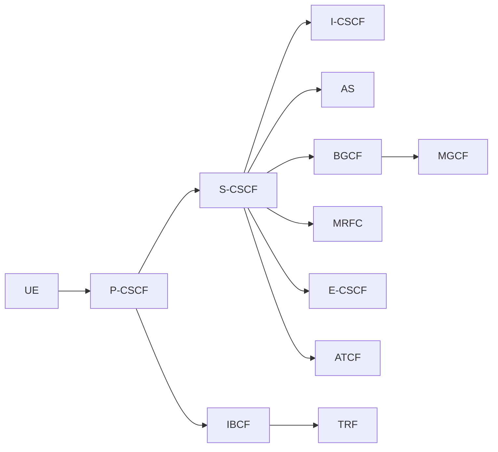
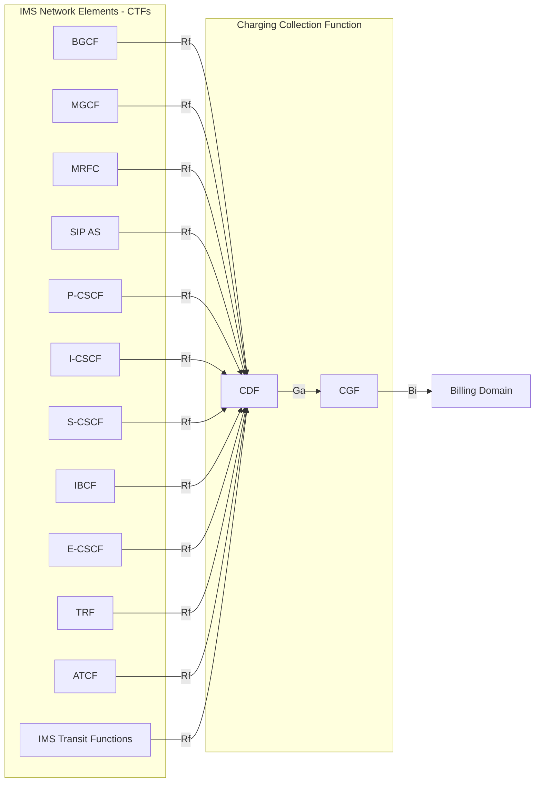
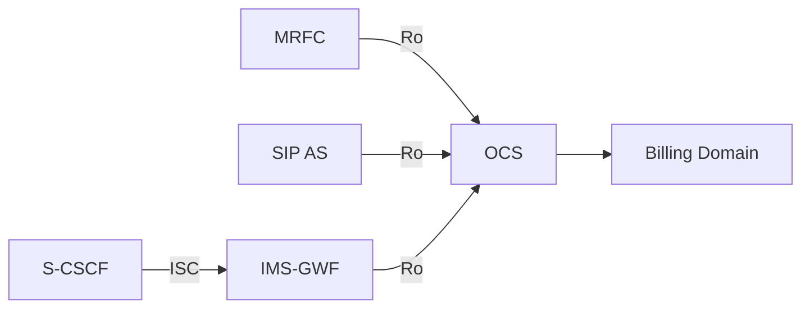
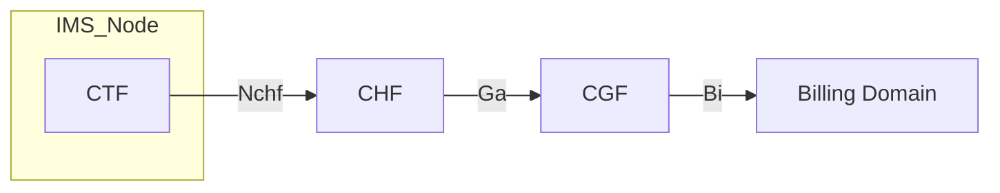

# IMS Charging Architecture and Principles

IMS charging is the application of 3GPP charging mechanisms (offline/online/converged) specifically to the IP Multimedia Subsystem. The general 3GPP charging framework is defined in TS 32.240; the Diameter protocol applications are in [TS 32.299](../protocols/Rf-offline-charging.md). TS 32.260 specifies IMS-specific charging scenarios, CDR content, and the mapping onto those protocols.

---

## Charging Paradigms

Three paradigms coexist; an IMS node may participate in any combination simultaneously:

| Paradigm | Protocol | Server | Reference point |
|---|---|---|---|
| Offline (post-pay CDR collection) | Diameter Rf | CDF (Charging Data Function) | Rf |
| Online (real-time credit control) | Diameter Ro | OCS (Online Charging System) | Ro |
| Converged (5G-era unified) | HTTP Nchf (SBI) | CHF (Charging Function) | Nchf / N45 |

---

## §4.1 High-Level IMS Architecture (Charging Context)

All standard [IMS](../entities/S-CSCF.md) nodes act as **Charging Trigger Functions (CTFs)**. They detect chargeable events (SIP session establishment, mid-session procedures, registration events) and forward charging data to the appropriate server.

---

## §4.2 IMS Offline Charging Architecture

Every IMS network element (NE) that acts as a CTF sends **ACR (Accounting-Request)** messages over **Rf** to the **CDF**. The CDF aggregates records into CDRs and forwards them via **Ga** to the **CGF (Charging Gateway Function)**. The CGF delivers CDR files to the **Billing Domain (BD)** via **Bi**.

**Nodes that generate offline CDRs:** S-CSCF, P-CSCF, I-CSCF, MRFC, MGCF, BGCF, SIP AS, IBCF, E-CSCF, TRF, ATCF, IMS Transit Functions (TF).

---

## §4.3 IMS Online Charging Architecture

For online charging, the **MRFC** and **SIP AS** send **CCR (Credit-Control-Request)** messages directly over **Ro** to the **OCS**. The [S-CSCF](../entities/S-CSCF.md) routes online charging via the ISC interface to the **IMS-GWF (IMS Gateway Function)**, which acts as a relay to the OCS.

**Key distinction from PS domain:** In EPC/PS charging, the PGW is the primary CTF. In IMS online charging, each relevant IMS node (MRFC, SIP AS) contacts the OCS directly over Ro, while S-CSCF uses the IMS-GWF intermediary.

---

## §4.4 IMS Converged Charging Architecture

Converged charging uses the **CHF (Charging Function)** as a unified server, accessed via the **Nchf** service-based interface. This is the 5G-era approach, applicable to MRFC and IMS-GWF (connected to S-CSCF via ISC), as well as SIP AS. The MMTel AS architecture (TS 32.275) also uses Nchf.

Three architectural options (§4.4):
1. IMS Node → CHF (with embedded CGF) → Bi → Billing Domain
2. IMS Node → CHF → Ga → CGF → Bi → Billing Domain
3. IMS Node → CHF → Ga → CGF (CGF acts as Billing Domain directly)

**Roaming (IMS-level interfaces, P-CSCF in VPLMN):** P-CSCF in visited network; IMS nodes in HPLMN connect to **H-CHF** via Nchf. Reference point N45 connects IMS node to CHF. NRF provides discovery.

**Reference point N45:** Between IMS node and CHF in converged charging.

---

## §5.1 IMS Charging Principles

### §5.1.1 Charging Method Selection

An IMS node selects charging method (offline/online/converged) based on:
- **Local configuration**, and/or
- **OCS/CDF addresses received in SIP signalling** via the `P-Charging-Function-Addresses` header (TS 24.229):
  - `CCF` parameter = CDF address (offline)
  - `ECF` parameter = OCS address (online)

| Addresses received | Method |
|---|---|
| OCS only | Online (Ro) or converged (Nchf) |
| CDF only | Offline (Rf), converged (Nchf), or offline-only |
| Both OCS and CDF | Online + offline (Ro+Rf) or converged (Nchf) |
| Neither | Local configuration determines |

### §5.1.2 IMS Charging Correlation

All IMS charging correlation is carried in the **`P-Charging-Vector`** SIP header (TS 24.229 / RFC 7315). The header contains:

| Parameter | Purpose |
|---|---|
| `icid-value` | IMS Charging Identifier — session-level correlation |
| `access-network-charging-info` | Access network correlation (bearer level) |
| `orig-ioi` / `term-ioi` | Inter-Operator Identifiers |
| `transit-ioi` (list) | Transit operator identifiers |
| `loopback-indication` | TRF loopback flag |

#### §5.1.2.2 IMS Charging Identifier (ICID)

The **ICID** is the linchpin of IMS charging correlation. It is:
- **Globally unique** across all 3GPP IMS networks for a minimum of **1 month**
- Generated by the **first IMS NE** that processes a session or session-unrelated method
- Typically generated by the **P-CSCF** for session-initiating INVITE
- Included in **all SIP methods** (INVITE, RE-INVITE, BYE, NOTIFY, REGISTER, etc.) once established
- Passed through all subsequent IMS nodes so each node's CDR/charging-event carries the same ICID

**Session-unrelated methods** (REGISTER, NOTIFY, MESSAGE not part of a session) each get their own new ICID at the first IMS NE that processes them.

For **SIP session establishment**: a new session-specific ICID is generated at the first IMS NE processing the session-initiating SIP INVITE; used in all subsequent SIP messages (200 OK, RE-INVITE, BYE) until session termination.

#### §5.1.2.2A Related ICID (SRVCC)

During **SRVCC access transfer**, the Enhanced MSC server or P-CSCF generates a new ICID for the **target access leg**. The source access leg's ICID is preserved as the **Related ICID** parameter in the P-Charging-Vector. The AS/ATCF CDR carries both ICIDs for the entire session duration (OneChargingSession mode). Sent in 1xx/2xx responses to the initial SIP INVITE of the target leg (TS 24.237).

#### §5.1.2.3 Access Network Charging Identifier

Media-flow level data correlating IMS charging with access bearer charging:
- **PS/4G:** PGW address + Charging Id per bearer
- **5GS:** SMF address + PDU session Charging Id
- **Fixed/WLAN:** Multimedia Charging Identifier (MMCI)

#### §5.1.2.4 Inter Operator Identifier (IOI)

The IOI identifies originating, terminating, and transit networks:
- **Orig-IOI:** Home network of the originating party
- **Term-IOI:** Home network of the terminating party
- **Transit-IOI list:** Intermediate transit operators (operator-configurable; may be voided for privacy)
- NOTE: No transit networks are expected between S-CSCF and a 3rd-party AS triggered by iFC

#### §5.1.2.6 IMS Visited Network Identifier

Identifies the visited network involved in a session; populated from the SIP `P-Visited-Network-ID` header (TS 24.229):
- **LBO roaming:** Pre-provisioned string identifying the P-CSCF home network
- **Home-routed traffic:** String identifying visited network of UE (P-CSCF in home network)

#### §5.1.2.7 Loopback-Indication

The [TRF](../concepts/charging-architecture.md) sets this parameter in P-Charging-Vector when loopback applies. The TRF inserts `loopback-indication` into outgoing responses to the terminating side.

#### §5.1.2.8 Functional Entity (FE) Identifier List

Contains IM CN subsystem functional entity addresses and/or AS addresses with application identifiers. Allows billing domain to reconstruct which IMS nodes handled a session.

---

### §5.1.3 SDP Handling

SDP information appears in charging records with a `SDP-type` parameter indicating whether it is an **SDP offer** or **SDP answer**:
- First SDP negotiation → SDP answer defines media used → recorded in CDR
- On unsuccessful setup → SDP offer may also be recorded
- Re-negotiations → multiple occurrences of List of SDP Media Components in CDR (one per negotiation round)

---

### §5.1.4 Trigger Conditions

Key CDR trigger rules per node type:

| Node | Session charging | Event charging |
|---|---|---|
| S-CSCF, P-CSCF, MRFC, AS | Session-based (Start/Interim/Stop) | Session-unrelated methods |
| I-CSCF, BGCF | **Event-based only** (not session-based) | Registration events |
| All | ACR[Event] / CCR[Event] for registration events | SIP NOTIFY with subscription to reg-events |

**Session trigger timing:**
- At SIP 200 OK with SDP offer present → CTF **may** trigger ACR[Start]/CCR[Start]
- Subsequent SIP ACK with SDP answer → triggers ACR[Interim]
- If no SDP in 200 OK → wait for SIP ACK before triggering ACR[Start]

**Location capture at BYE:** If UE location/TimeZone is required but not yet available at BYE reception, CTF delays ACR[Stop] until receipt of SIP 200 OK acknowledging BYE. Granted quota is not consumed after BYE reception.

---

### §5.1.5 Real-Time Tariff Transfer (RTTI)

TS 29.658 defines Real-time Transfer of Tariff Information (RTTI) via SIP. Tariff information may be included in 1xx provisional responses or SIP 200 OK at session setup, mid-dialog, or responses. Nodes that may pass tariff info in CDRs: IBCF, MGCF, S-CSCF, AS.

Security constraints:
- IBCF: accepts RTTI only from **trusted IMS networks**; filters out RTTI from untrusted sources
- S-CSCF: must follow TS 33.203 to protect against malicious UE bypassing P-CSCF

---

### §5.1.6 Served User Identification

The **Subscription-Id** in CDRs identifies the served user:
- Source: `P-Header-Served-User` (available in P-CSCF, S-CSCF, AS)
- Content: list of **Public User IDs** (IMPU) for the served user
- Device identity: **Subscriber Equipment Number** (IMEI) from device

---

### §5.1.7 Single Charging Session from AS/ATCF acting as B2BUA

When an AS/ATCF acting as a B2BUA preserves the same ICID for both incoming and outgoing dialogs, a **single charging session** (OneChargingSession) can be created for both dialogs. This is operator-configurable.

---

### §5.1.8 / §5.1.8A Roaming Charging Support

| Roaming mode | P-CSCF location | Charging entity |
|---|---|---|
| Local Breakout (LBO) | VPLMN | TRF in visited network (provides additional routing); IMS nodes charge via Rf in VPLMN |
| Home-routed | HPLMN | P-CSCF retrieves served PLMN ID from PCRF/PCF; included in SIP REGISTER |

---

### §5.1.9 Network-Provided Location Information

Location retrieval chain: P-CSCF → PCRF/PCF (TS 23.203, TS 23.503), or AS via HSS (TS 23.167).

**Content of access network info per SIP P-Access-Network-Info header:**
- 3GPP access: SAI, TAI, RAI, CGI, ECGI, NCGI (when NCGI available; note: NR Dual Connectivity via option 3a/x retrieves NCGI from EPC)
- Trusted WLAN: BSSID + Geographical Identifier
- Untrusted WLAN/ePDG: BSSID + UE local IP + ePDG IP + TCP/UDP port

**In CDRs:**
- 3GPP accesses: User Location Info field + Access Network Information field (network-provided)
- Non-3GPP: Access Network Information or Additional Access Network Information fields
- Rel-11+: Dual P-Access-Network-Info headers → operator determines which is "network-provided"

---

### §5.1.9A IMS Transit Scenarios

The IMS Transit Function (TF), when resident in a standalone entity, may apply offline charging. Applicable CDR fields: table 6.3.2.1 of TS 32.260.

---

### §5.1.10 TRF Charging Support

The Transit and Roaming Function (TRF) supports charging for LBO roaming:
- **Standalone:** TRF applies offline charging independently
- **Collocated with IMS NE:** charging information combined with that NE's charging records

---

### §5.1.11 IMS Service Continuity (ATCF Charging)

IMS service continuity uses AS and ATCF (TS 23.237). For the ATCF:
- **Access Transfer Type** parameter identifies the transfer direction: PS→CS, CS→PS, PS→PS, CS→CS
- **Session Transfer Number for SRVCC (STN-SR)** and **Session Transfer Identifier for CS→PS (STI-SR)** carried in Requested Party Address
- UE identification: Subscriber Equipment Number + Instance Id
- SCC AS uses OneChargingSession to maintain charging continuity across transfer

---

### §5.1.12 IMS Announcements

The CHF/OCS may request the IMS-GWF or AS (via Ro) to render announcements (audio/video) to a subscriber. Defined in TS 32.281.

---

### §5.1.13 UE Location(s) and TimeZones

UE location and TimeZone are transported in `P-Access-Network-Info` SIP header (TS 24.229 §7.2A.4.3). IMS nodes receive this header in every SIP request and response. Available from:
- UE-provided P-Access-Network-Info
- Network-Provided P-Access-Network-Info

In **Rel-12+**: recommended practice is to put network-provided value in Access Network Information field and UE-provided value in Additional Access Network Information field.

---

## Chunk Plan for TS 32.260

| Chunk ID | Sections | Topic | Status |
|---|---|---|---|
| ts32260-1 | §4 + §5.1 | Architecture + IMS charging principles | ✓ Done |
| ts32260-2 | §5.2.1.1–§5.2.1.12 | Offline charging: MO/MT session flows, mid-session, release, PSTN/IMS-initiated, multi-party | Pending |
| ts32260-3 | §5.2.1.13–§5.2.2 + §5.3 | AS-related offline flows (B2BUA, SRVCC, OMR) + online IMS charging scenarios | Pending |
| ts32260-4 | §5.4 + §6.1.1–§6.1.2 | Converged charging scenarios + Rf/Bi message contents | Pending |
| ts32260-5 | §6.1.3 | Per-node CDR content (S-CSCF, P-CSCF, I-CSCF, MRFC, MGCF, BGCF, SIP AS, IBCF, E-CSCF, TRF, ATCF, TF) | Pending |
| ts32260-6 | §6.2–§6.4 + Annex B | Ro message contents, IMS charging parameters, converged data, OCS termination scenarios | Pending |
