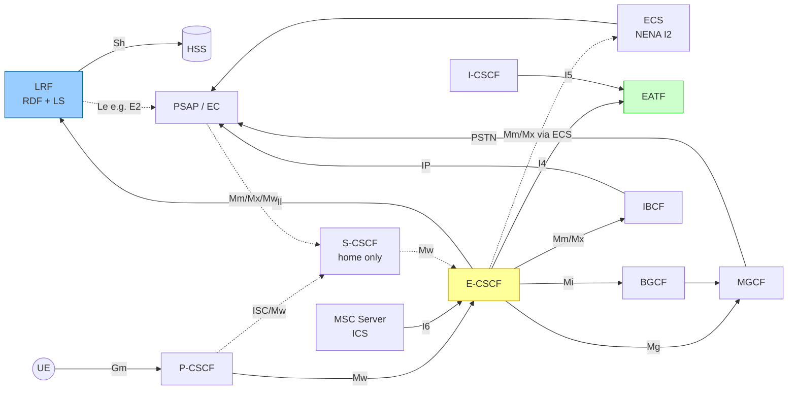
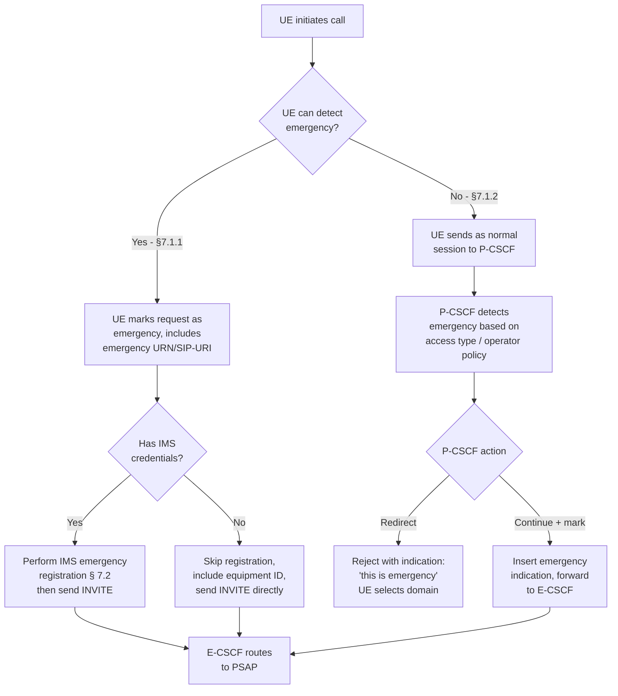

# IMS Emergency Architecture

IMS emergency sessions extend the baseline IMS architecture ([TS 23.228](../entities/S-CSCF.md)) with additional network elements, reference points, and modified procedures to enable emergency calls (voice, video, text) including **NG-eCall** (vehicle-initiated emergency) over any IP-CAN. Defined in **3GPP TS 23.167**.

---

## Motivation and Scope

Emergency services have unique constraints not present in normal IMS calls:

| Constraint | Implication |
|---|---|
| Must work without full IMS credentials | Anonymous session path required |
| Must work without prior IMS registration | Emergency registration or credential-less session |
| PSAP routing is location-based, not identity-based | LRF resolves UE location → PSAP address |
| Roaming UE uses visited-country PSAP, not home | E-CSCF is always in the **serving network** |
| Emergency sessions must be prioritised | PCC must treat emergency bearer with highest QoS |
| PSAP must be able to call back the UE | Callback number derived or TEL-URI associated |
| Location must be provided to PSAP | Network retrieves and forwards location to PSAP |

---

## New Entities Introduced

| Entity | Role |
|---|---|
| [E-CSCF](../entities/E-CSCF.md) | Emergency-CSCF: routes emergency sessions to PSAP; queries LRF |
| [LRF](../entities/LRF.md) | Location Retrieval Function: resolves UE location → PSAP routing information |
| EATF | Emergency Access Transfer Function: session continuity for SRVCC/DRVCC (TS 23.237) |
| PSAP | Public Safety Answering Point: physical emergency centre receiving calls |
| ECS | Emergency Call Server: optional VoIP routing proxy toward PSAP (NENA I2) |

---

## Reference Architecture

> **NOTE:** Dashed lines = optional interfaces. E-CSCF, P-CSCF, EATF, and MSC Server ICS are **always in the serving network**. S-CSCF is only applicable for **non-roaming** cases (home network).

---

## New Reference Points (§5.2)

| Point | Between | Purpose |
|---|---|---|
| **Ml** | E-CSCF ↔ LRF | Location retrieval, PSAP routing information (ESQK, ESRN, SIP-URI) |
| **I4** | E-CSCF ↔ EATF | Emergency session continuity for SRVCC/DRVCC (TS 23.237) |
| **I5** | I-CSCF ↔ EATF | Emergency session continuity (TS 23.237) |
| **I6** | MSC Server ICS ↔ E-CSCF | CS-media / IMS-signalling interworking for ICS emergency calls (TS 23.292) |
| **Le** | LRF ↔ PSAP | Location delivery to PSAP (e.g., E2 in NENA I2) — outside 3GPP scope |
| **Sh** | LRF ↔ HSS | NPLI query for non-roaming WLAN UEs |

---

## Architectural Principles (§4.1 — selected)

1. Emergency services are **IP-CAN independent** — must work over EPS (E-UTRAN), GPRS, WLAN-to-EPC, fixed broadband, non-3GPP-to-5GC.
2. Emergency numbers and URN types are **locally regulated** — the serving network validates which numbers/URNs trigger emergency treatment.
3. Emergency sessions shall be **prioritised** over normal sessions; PCC assigns appropriate QoS.
4. Emergency sessions shall work for **barred public user identities** — barring is bypassed for emergency registration.
5. The UE should be able to detect the emergency session; if it cannot (§7.1.2), the **P-CSCF detects** and redirects.
6. If the UE has **sufficient credentials**, it performs IMS emergency registration then initiates the session. If it **lacks credentials**, it skips registration and goes directly to session establishment toward P-CSCF (anonymous path).
7. When roaming outside the home network, **emergency services are provided by the visited network** — the home network is not involved.
8. The network may reject anonymous emergency service requests if sufficient-credential users are required by local regulation.
9. Emergency service is **not a subscription service** — no subscription check is required.
10. The **E-CSCF shall protect user privacy** — it shall prevent sending user identifiers to PSAP unless explicitly requested by the user, subject to local regulation.
11. **NG-eCall** (vehicle-initiated emergency) follows the same architecture and procedures as other IMS emergency services, with MSD transfer added.
12. An originating network processing an emergency session shall, if configured, invoke an AS for **attestation and Resource-Priority signing** (STIR/SHAKEN context).

---

## Emergency Detection: UE-Detectable vs Non-Detectable (§7.1.1–7.1.2)

---

## Location Information for Emergency Sessions (§4.3)

Location serves two purposes in IMS emergency:

1. **Routing**: IMS uses location to determine which PSAP serves the UE's area → E-CSCF queries LRF
2. **PSAP query**: PSAP retrieves location during/after the call for dispatch → via Le reference point

### Location sources (priority order)

| Source | Type | Notes |
|---|---|---|
| UE-provided (in INVITE) | Geographical or network | E-CSCF should validate via LRF if required |
| P-CSCF queries IP-CAN | Location Identifier (cell-id, line-id) | Cellular or fixed broadband |
| E-CSCF queries LRF | Network-based location | LRF may query Location Server |
| Trusted AS | May provide location identifier | Non-roaming case |

> The E-CSCF routes to the PSAP corresponding to the **type of emergency service**, the **type of service requested**, and **current location** of the UE. If the correct PSAP cannot be determined, routing goes to a **default PSAP** or **Last Routing Option (LRO)**.

---

## IP-CAN Expectations for Emergency (§4.4)

- Emergency bearer resources shall be established **even without security credentials** (except WLAN-to-EPC and non-3GPP-to-5GC).
- IP-CAN may reject emergency bearer requests from credentialless UEs (local regulation).
- PCC controls QoS and data flow filters for emergency traffic (TS 23.203).
- IP-CAN may provide **additional identifiers** (e.g., cell-level subscriber ID) to IMS for emergency use.
- Emergency services may be provided **free of charge** (PCC rules apply).
- IP-CAN may provide **local emergency numbers** to the UE.

---

## Media (§4.5)

- When PSAP supports **voice only**: voice + GTT (Globally-accessible Text Telephony) allowed.
- When PSAP supports **voice + other media**: video, session-mode text allowed (subject to local regulation and UE/network support).
- Media may be **added, modified, or removed** during session (e.g., adding video mid-call) via SDP re-negotiation per TS 23.228.

---

## NG-eCall

NG-eCall (eCall Over IMS) is a **manually or automatically initiated IMS emergency call from a vehicle**, supplemented with a **Minimum Set of Data (MSD)** containing vehicle identification, crash location, passenger count, etc. It follows all IMS emergency principles with additional MSD transfer procedures (§7.7 and TS 26.267). See also [eCall](eCall.md) _(page to be created in chunk 5a-3)_.

---

## Cross-references

- [E-CSCF](../entities/E-CSCF.md) — entity page with all interfaces and procedure participation
- [LRF](../entities/LRF.md) — entity page with location retrieval detail
- [IMS Registration](../procedures/IMS-registration.md) — baseline registration (emergency registration is a modification)
- [VoLTE MO Call](../procedures/VoLTE-MO-call.md) — baseline call procedures (emergency call is a specialised variant)
- [P-CSCF deep-dive](../entities/P-CSCF-deepdive.md) — P-CSCF emergency detection role
- [S-CSCF deep-dive](../entities/S-CSCF-deepdive.md) — S-CSCF emergency registration handling
