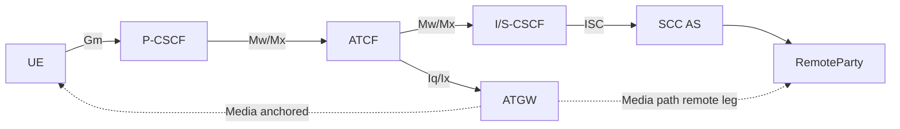
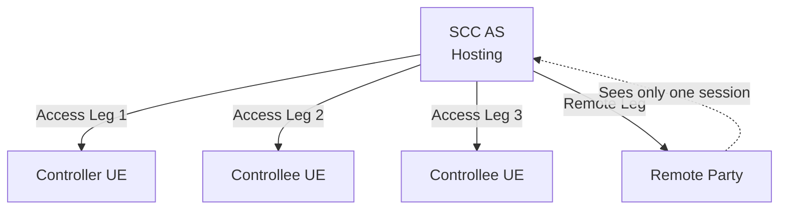

# IMS Service Continuity

IMS Service Continuity (SC) maintains ongoing IMS multimedia sessions when terminal mobility or user preference causes a change of access network or a transfer of media to another UE. It operates purely at the IMS SIP layer — mobility at the IP-CAN level is out of scope.

The primary reference is **3GPP TS 23.237 v18.0.0**.

---

## Two Transfer Domains

### 1. Access Transfer (intra-UE)

Transfer of one or more media paths of an ongoing IMS session **on one UE** between different access networks.

| Sub-type | Description |
|---|---|
| **PS → CS** | Voice/video from PS (IP-CAN) to CS domain (SRVCC/DRVCC) |
| **PS → PS** | From one IP-CAN to another (e.g. LTE → WLAN); if IMS contact/P-CSCF unchanged, normal EPS mobility suffices |
| **CS → PS** | Reverse SRVCC; requires STI-rSR provided by ATCF |

The SCC AS and ATCF (when deployed) are the control-plane anchors. The UE initiates Access Transfer based on operator policy, user preferences, and Local Operating Environment Information.

### 2. Inter-UE Transfer (IUT)

Transfer at the IMS layer of some or all media flows **across multiple UEs** sharing IMS subscriptions under the same operator.

IUT may:
- Establish a **Collaborative Session** (one Controller UE + one or more Controllee UEs)
- Transfer only media flows without a Collaborative Session (whole session moves)
- Replicate media flows to additional UEs

---

## Key Concepts and Identifiers

| Term | Definition |
|---|---|
| **Access Leg** | SIP control leg between UE and SCC AS |
| **Remote Leg** | SIP control leg between SCC AS and remote party |
| **Collaborative Session** | ≥2 Access Legs + media on ≥2 UEs presented as one Remote Leg by SCC AS |
| **Controller UE** | UE that controls the Collaborative Session; service profile determines remote-leg services |
| **Controllee UE** | Subordinate UE in Collaborative Session; unaware of its role and of the Controller UE |
| **STN** | Session Transfer Number — UE uses to request PS→CS transfer (routable to SCC AS or ATCF) |
| **STN-SR** | STN for SRVCC — subscription info in HSS; addresses ATCF (if deployed) else SCC AS |
| **STI** | Session Transfer Identifier — dynamic, assigned by UE or SCC AS; requests specific session transfer |
| **STI-rSR** | Dynamic STI for CS→PS SRVCC; provided by ATCF to UE |
| **ATU-STI** | Access Transfer Update STI — ATCF uses to notify SCC AS that AT occurred |
| **C-MSISDN** | Correlation MSISDN — MSISDN bound to IMS Private User Identity; used to correlate Access Legs |
| **IMRN** | IP Multimedia Routing Number — routable number pointing to SCC AS in IM CN |
| **E-STN-SR** | Emergency STN for SRVCC — addressing EATF |
| **E-STN-DR** | Emergency STN for DRVCC — dynamically assigned by EATF; stored by UE |
| **Session State Information** | IMS session state sent by SCC AS to MSC Server for PS-CS/CS-PS continuity without ICS UE capability |
| **Pre-alerting state** | State where UE can receive early media (before ringing) |
| **Dual Radio** | UE can TX/RX on two RATs simultaneously |
| **Single Radio** | UE can TX/RX on only one RAT at a time |

---

## 3pcc Control Mechanism

The SCC AS uses **3rd-party call control (3pcc)** to interpose itself between the UE's Access Leg and the Remote Leg:

The SCC AS anchors both legs, enabling it to redirect media paths without involving the remote party when Access Transfer occurs.

When ATCF is deployed, the ATCF inserts itself as a SIP intermediary in the serving (visited) network:

The ATCF anchors media at the ATGW in the serving network, so Access Transfer can be executed locally without a round-trip to the home SCC AS for media re-anchoring.

---

## Collaborative Session Model

- Only **one Controller UE** per Collaborative Session
- Collaborative Session is **transparent** to the remote end — appears as a single session with the Controller UE
- Any IMS UE can be a Controllee UE (even without IUT capability)
- Collaborative Session Control (CSC) can be **transferred** to another Controller-capable UE sharing the same service profile
- UEs in a Collaborative Session may belong to **different IMS subscriptions** under the same operator (cross-subscription IUT requires additional authorization)

---

## Architectural Requirements (§4.2)

- Session transfer possible regardless of whether network-layer mobility is deployed
- No impact on radio or transport layers or PS core network
- UE shall be IMS registered before invoking any Session Transfer
- SCC AS shall insert 3rd-party registration filter for ISC
- Charging correlation across access networks shall be supported
- Multiple simultaneous registrations of a Public User Identity allowed (home operator policy)

### PS-CS Access Transfer assumptions (§4.1.1)
- SCC AS collocates ICS + SC functions
- When (v)SRVCC/5G-SRVCC with ATCF: ATCF/ATGW in serving network
- ICS UE capabilities (TS 23.292) used when UE and network both support them
- MSC Server may support mid-call feature (for inactive sessions and conference continuity)
- SCC AS maintains Session State Information for all active and inactive sessions

### IUT assumptions (§4.1.3)
- UEs in IUT Media Control procedures can belong to different subscriptions under same operator
- One Controller UE per Collaborative Session
- Controllee UE is unaware of its role and of the Controller UE
- Collaborative Session transparent to remote end
- Any IUT-capable UE can request IUT Media Control; authorization by SCC AS and/or Controller UE

---

## Signalling and Bearer Paths (§5.4)

| Session type | Signalling anchor | Media anchor |
|---|---|---|
| PS media, no ATCF | SCC AS (home) | Direct IP-CAN path |
| PS media, with ATCF | ATCF (serving) + SCC AS (home) | ATGW (serving) |
| CS media, no ATCF | SCC AS (home) via TS 23.292 | CS bearer |
| CS media, with ATCF | ATCF (serving) + SCC AS (home) | ATGW + MSC Server |

---

## Relation to SRVCC (TS 23.216)

SRVCC (TS 23.216) defines **access-layer** handover triggers and radio procedures. IMS Service Continuity (TS 23.237) defines the **IMS-layer** session transfer that follows. The ATCF/ATGW entities are introduced in TS 23.237 to enable low-latency SRVCC without home-network round trips.

---

## Cross-references

- [entities/SCC-AS.md](../entities/SCC-AS.md) — SCC AS entity
- [entities/ATCF.md](../entities/ATCF.md) — Access Transfer Control Function
- [entities/ATGW.md](../entities/ATGW.md) — Access Transfer Gateway
- [concepts/SRVCC.md](SRVCC.md) — SRVCC concept (TS 23.216)
- [procedures/SRVCC-from-E-UTRAN.md](../procedures/SRVCC-from-E-UTRAN.md) — SRVCC call flows
- [interfaces/IMS-reference-points.md](../interfaces/IMS-reference-points.md) — includes Iq/Ix/I2 reference points
