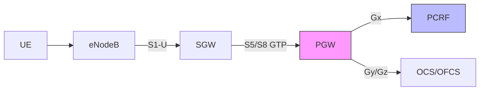
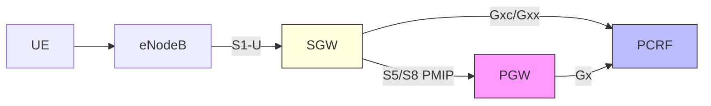
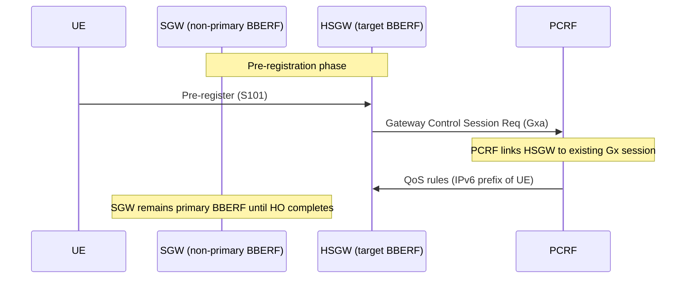

# PCC — EPC Access-Specific Behavior

**Spec reference:** 3GPP TS 23.203 Annex A.4, A.5, Annex H

This page covers how the generic PCC framework specializes for each EPC access type: 3GPP GTP-based EPS, 3GPP PMIP-based EPS, and EPC-based non-3GPP accesses (HRPD, trusted WLAN, untrusted non-3GPP).

For the generic architecture see [PCC architecture](PCC-architecture.md). For IP-CAN session procedures see [PCC session procedures](../procedures/PCC-session-procedures.md).

---

## 1. 3GPP GTP-based EPC (Annex A.4)

### Architecture

- **PCEF at PDN-GW only** — no BBERF in GTP mode
- **Case 1** (no Gateway Control Session): SGW acts as pure GTP transport; no Gxx
- **PCEF performs bearer binding** — binds PCC rules to EPS bearers based on SDF filter + QoS match
- **Bind to Default Bearer attribute** supported: operator can force specific PCC rules onto the default bearer

### EPS-Specific PCRF Input

| Source | EPS-specific fields |
|---|---|
| **PCEF** (Gx) | IP-CAN type = `3GPP-EPS`, RAT type, ULI (CGI/SAI/RAI/TAI/ECGI), Serving Network (MCC/MNC), Serving-GW identity, Subscribed APN-AMBR, Default EPS Bearer QoS |
| **SPR** (Sp) | Authorized APN-AMBR, Authorized Default EPS Bearer QoS |

### Default EPS Bearer QoS Authorization

The PCRF may authorize or modify the Default EPS Bearer QoS. This controls the QoS class and priority of the default bearer and all PCC rules that share the same QoS as the default bearer.

**Table A.4.3.4-1 — Default EPS Bearer QoS policy information:**

| Parameter | Description |
|---|---|
| Authorized Default EPS Bearer QoS | QCI + ARP for the default bearer, from PCRF |
| Subsequent Default EPS Bearer QoS | Up to 4 future values for scheduled QoS changes |
| Default EPS Bearer QoS Change Time | Time at which the subsequent QoS takes effect |

> When the PCRF modifies the Authorized Default EPS Bearer QoS, it simultaneously modifies the QCI and ARP of all PCC rules that have the same QoS as the default bearer (Annex A.4.4.4.2).

### EPS Credit Re-Authorization Triggers (Table A.4.3-1)

These events cause the PCEF to send a credit re-authorization request to OCS (Gy):

| Trigger | Notes |
|---|---|
| SGSN change | UMTS/GPRS access |
| Serving GW change | Mobility event |
| RAT type change | E.g. E-UTRAN ↔ GERAN |
| Location change: Routing Area | GERAN/UTRAN only |
| Location change: Tracking Area | E-UTRAN only |
| Location change: ECGI | E-UTRAN only |
| Location change: CGI/SAI | GERAN/UTRAN only |
| Location change: eNodeB ID | E-UTRAN only |
| UE presence in Presence Reporting Area | — |
| User CSG Information change | CSG cell entry/exit |

### EPS Event Triggers (Table A.4.3-2)

In addition to credit re-auth triggers, these events cause the PCEF to report to the PCRF (Gx):

| Trigger | Notes |
|---|---|
| _(all credit re-auth triggers above)_ | — |
| Subscribed APN-AMBR change | E-UTRAN only _(Note 1)_ |
| EPS Subscribed QoS change | E-UTRAN only _(Note 1)_ |
| 3GPP PS Data Off status change | — |

### IP-CAN Session Establishment (EPS specifics)

At session establishment (step 3 of §7.2.1), the PCEF additionally provides:
- User Location Information (ULI: TAI, ECGI, etc.)
- Serving Network (MCC+MNC)
- Serving-GW identity
- RAT type (e.g. `EUTRAN`)

The PCRF response additionally provides:
- Authorized Default EPS Bearer QoS
- Authorized APN-AMBR
- PCC rules whose QoS parameters match the default bearer QoS

---

## 2. 3GPP PMIP-based EPC (Annex A.5)

### Architecture

- **PCEF at PDN-GW**, **BBERF at SGW** — Gxx reference point = **Gxc** (Case 2b)
- **BBERF performs bearer binding** — not the PCEF
- **BBERF enforces Authorized Default EPS Bearer QoS** — not the PCEF
- Event triggers (Table A.4.3-2) apply at the BBERF (SGW reports to PCRF via Gxc)

### RAT Type Change in PMIP Mode

1. RAT type change detected
2. BBERF sends event report to PCRF (Gxc) with new RAT type
3. PCRF sends event report to PCEF (Gx), indicating the RAT type change

### Gateway Control Session (PMIP specifics)

At Gateway Control Session establishment, the BBERF provides:
- User Location Information
- User CSG Information
- Serving-GW identity
- RAT type
- Default EPS Bearer QoS (from the UE's EPS bearer context)
- APN-AMBR

PCRF acknowledgement provides:
- QoS rules that match the Default EPS Bearer QoS
- Authorized APN-AMBR

### Secondary PDP Context Activation

When a Secondary PDP Context Activation occurs (SGSN-based access):
1. S4 SGSN performs Request Bearer Resource Allocation with SGW
2. SGW (BBERF) supplies the parameters for PCEF to properly handle resource allocation
3. These parameters are sent from BBERF (SGW) to PCRF
4. PCRF provides response with Authorized APN-AMBR + Authorized Default EPS Bearer QoS

### QoS Rule Modification

> When PCRF modifies the Authorized Default EPS Bearer QoS, it simultaneously modifies the QCI and ARP of **all QoS Rules** that have the same QoS as the default bearer (Annex A.5.4.4).

---

## 3. EPC-based Non-3GPP Access (Annex H)

### H.1 General Principle

An EPC-based non-3GPP IP-CAN (per TS 23.402) that requires **Gxa** for dynamic QoS control shall include a BBERF. Where the BBERF is located within the non-3GPP IP-CAN is access-specific (out of 3GPP scope unless specified in Annex H).

---

### H.2 cdma2000 HRPD Access

**Architecture:**
- BBERF located in the **HRPD Serving Gateway (HSGW)** (3GPP2 X.S0057)
- Reference point: **Gxa** (= Gxx for HRPD)
- HSGW with Gxa support must implement all Gxa procedures

**Gateway Control Session suppression:**
- Operator may configure an indicator in HSS (carried in Charging Characteristics)
- HSGW BBERF reads this indicator and does NOT establish a Gateway Control Session
- Applies for the lifetime of the IP-CAN session
- Only applicable in non-roaming cases (operator-specific indicator)

**EUTRAN-to-HRPD pre-registration:**

- During pre-registration: SGW and HSGW both associated with UE IP-CAN session(s) in PCRF
- SGW = non-primary BBERF; HSGW = primary BBERF
- PCRF provides the UE's IPv6 prefix to HSGW during Gateway Control Session establishment (needed to link new GCS to existing Gx session)

**Bearer Establishment Mode (BCM):**
- All simultaneous IP-CAN sessions between UE and a given PDN must have the same BCM value
- UE is supposed to assign the same BCM value; PCRF keeps the value assigned by the UE

---

### H.3 EPC-based Trusted WLAN Access (S2a)

**Architecture:**
- PCEF at PDN-GW — **BBERF does NOT apply**
- Gxa not used for S2a-PMIP in this Release
- **Case 1** (no Gateway Control Session)

**Table H.3 — TWAN event/credit re-auth triggers:**

| Trigger | Reported from | Condition |
|---|---|---|
| RAT type change | PCEF | PCRF/OCS |

**At IP-CAN Session Establishment, PCEF provides (over Gx):**
- TWAN location info: TWAN ID and/or UE Time Zone (per TS 23.402 §16)
- IP-CAN type (= Trusted WLAN)
- RAT type
- PLMN identifier
- Indication that access is trusted

**User location reporting:**
- Access Network Information Report event trigger applies
- Location info updated when bearer over Trusted WLAN is activated, modified, or deactivated
- When IP-CAN session terminated: TWAN Release Cause (if available) provided to PCRF
- PLMN change and RAT type event triggers apply; PCEF reports IP-CAN type change to PCRF when Create Session Request received indicating UE moved to trusted WLAN

**Default EPS Bearer QoS:**
- PCRF may authorize QCI and ARP for the default EPS bearer immediately or at a future time (per Annex A.4.3.4 mechanism)

---

### H.4 EPC-based Untrusted non-3GPP Access (ePDG / S2b)

**Architecture:**
- PCEF at PDN-GW — **BBERF does NOT apply**
- UE → ePDG (IKEv2/IPsec) → S2b → PDN-GW
- **Case 1** (no Gateway Control Session)

**Table H.4 — Untrusted non-3GPP event/credit re-auth triggers:**

| Trigger | Reported from | Condition |
|---|---|---|
| RAT type change | PCEF | PCRF/OCS |

**At IP-CAN Session Establishment, PCEF provides (over Gx):**
- IP-CAN type (= Untrusted non-3GPP)
- Indication that access is untrusted RAT type
- ePDG IP address
- Serving Network Identifier (MCC+MNC of ePDG)

**User location information (from ePDG):**
- ePDG IP address used in IKEv2 tunnel procedures
- Local IP address + UDP/TCP port number (if NAT detected by ePDG as source of UE traffic over Swu)
- WLAN Location Information and WLAN Location Information Age (includes TWAN ID as defined in TS 23.402 §16)

> **NOTE:** When the PCRF reports ePDG IP address to the AF (P-CSCF), this local IP address cannot be considered as reliable — the UE can spoof its IP address.

**IP-CAN type change and AF notification:**
- PCRF reports ePDG IP address to AF (P-CSCF) at time AF instructions are received
- Also reported when IP-CAN type changes, if AF subscribed to it
- AF instruction to report IP-CAN type changes includes an indication that the access type is untrusted

**At IP-CAN Session Termination:**
- UWAN Release Cause (if available) provided to PCRF
- User location info includes: ePDG local IP address + UDP/TCP port (if NAT), WLAN Location Information Age (per TS 23.402 §18)

**Fallback when no location info received from ePDG:**
- PCEF provides Serving Network of ePDG as minimum location information

**Default EPS Bearer QoS:**
- PCRF may authorize QCI and ARP for the default EPS bearer immediately or at a future time (per Annex A.4.3.4 mechanism)

---

## 4. Access Type Comparison

| Access | BBERF? | Case | BBF Location | Default EPS Bearer QoS enforced by | Key reference point |
|---|---|---|---|---|---|
| 3GPP GTP S5/S8 | No | Case 1 | PCEF (PGW) | PCEF | Gx |
| 3GPP PMIP S5/S8 | Yes (SGW) | Case 2b | BBERF (SGW) | BBERF | Gx + Gxc |
| cdma2000 HRPD | Yes (HSGW) | Case 2a/2b | BBERF (HSGW) | BBERF | Gx + Gxa |
| Trusted WLAN S2a | No | Case 1 | PCEF (PGW) | PCEF | Gx |
| Untrusted non-3GPP S2b (ePDG) | No | Case 1 | PCEF (PGW) | PCEF | Gx |

---

## 5. PCC Rule Precedence (Annex G)

When multiple PCC rules have overlapping SDF filter templates, the PCEF evaluates them in decreasing precedence order. Operators should structure rule precedence value ranges to avoid unintended overlaps:

| Precedence range (decreasing) | Rule type |
|---|---|
| Highest | Dynamic PCC rules |
| High | Predefined PCC rules known to PCRF |
| Medium | Predefined PCC rules not known to PCRF |
| Lowest | Dynamic PCC rules for non-operator-controlled services (UE-provided traffic mapping) |

> This ensures that application detection filter-based PCC rules are not inadvertently overridden by predefined rules with higher precedence that have overlapping SDF filters (e.g. for sponsored data connectivity).

---

## Related Pages

- [PCC Architecture](PCC-architecture.md) — full entity/reference-point model
- [PCC Rules Reference](PCC-rules-reference.md) — PCC/QoS/ADC rule schemas
- [PCC Session Procedures](../procedures/PCC-session-procedures.md) — IP-CAN session lifecycle
- [PCEF](../entities/PCEF.md) — enforcement function; event trigger handling
- [PCRF](../entities/PCRF.md) — policy decisions including Default EPS Bearer QoS
- [SGW](../entities/SGW.md) — acts as BBERF in PMIP mode (Gxc)
- [ePDG](../entities/ePDG.md) — untrusted non-3GPP gateway; IKEv2/IPsec
- [Non-3GPP access architecture](non-3GPP-access-architecture.md) — TWAN, ePDG, HRPD access modes
