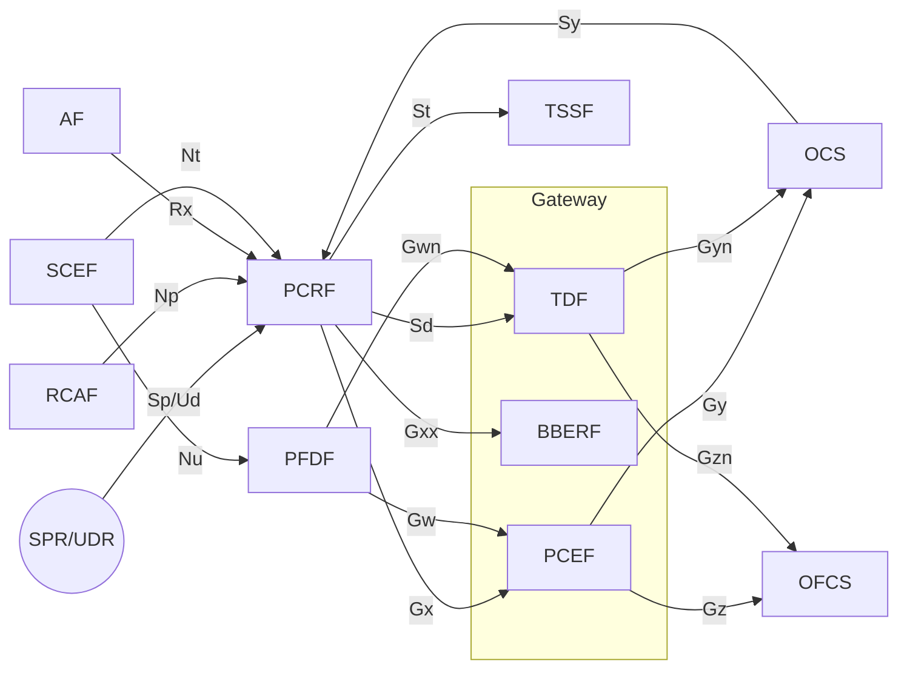
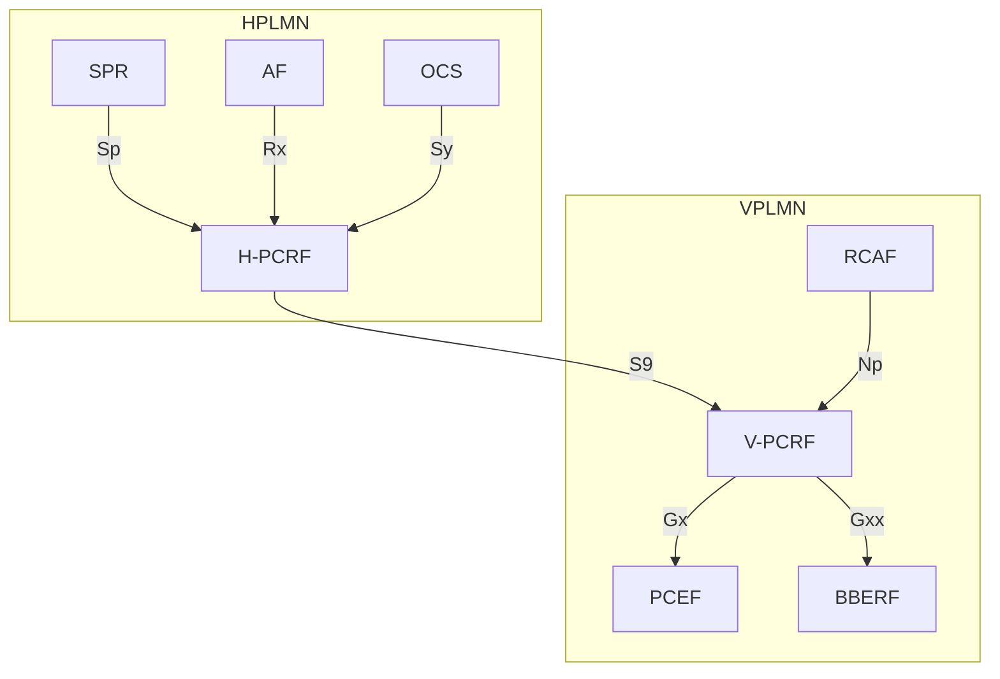

# Policy and Charging Control (PCC) Architecture

PCC encompasses two main functions over IP-CAN (IP Connectivity Access Network) sessions:

1. **Flow Based Charging** — charging control and online credit control for service data flows (SDFs) and detected application traffic
2. **Policy Control** — gating control, QoS control, QoS signalling, redirection

TS 23.203 specifies generic PCC aspects in its main body; IP-CAN-specific details are in normative Annexes (GPRS, 3GPP GTP-EPC, PMIP-EPC, non-3GPP).

---

## Functional Entities

| Entity | Full name | Role |
|---|---|---|
| **PCRF** | Policy and Charging Rules Function | Central brain: generates PCC decisions (PCC rules + IP-CAN bearer attributes); binds AF sessions to IP-CAN sessions; enforces QoS and gating via PCEF/BBERF |
| **PCEF** | Policy and Charging Enforcement Function | In Gateway (PGW for EPC); enforces PCC rules: SDF detection, gating, QoS, charging reporting (Gz/Gy); hosts Bearer Binding Function (BBF) when GTP is used |
| **BBERF** | Bearer Binding and Event Reporting Function | In Gateway when mobility uses PMIP (SGW acts as BBERF for S5/S8 PMIP); binds QoS rules to IP-CAN bearers; hosts BBF in PMIP mode |
| **AF** | Application Function | 3rd party or operator application (e.g. P-CSCF for IMS) that provides session-level service info to PCRF via Rx |
| **SPR** | Subscription Profile Repository | Holds per-subscriber PCC subscription data; PCRF queries via Sp |
| **UDR** | User Data Repository | Replaces SPR in UDC architecture (TS 23.335); PCRF accesses via Ud |
| **OCS** | Online Charging System | Online credit control for PCEF (Gy) and TDF (Gyn); tracks policy counters (spending limits via Sy) |
| **OFCS** | Offline Charging System | Receives offline charging data from PCEF (Gz) and TDF (Gzn) |
| **TDF** | Traffic Detection Function | Application detection and control node; receives ADC rules from PCRF (Sd); performs solicited or unsolicited application reporting; charges via Gyn/Gzn |
| **RCAF** | RAN Congestion Awareness Function | Detects and reports RAN user plane congestion to PCRF via Np |
| **TSSF** | Traffic Steering Support Function | Executes traffic steering control instructions from PCRF via St |
| **SCEF** | Service Capability Exposure Function | Acts as AF via Rx; negotiates future background data transfer (Nt); manages PFDs in PFDF via Nu |
| **PFDF** | Packet Flow Description Function | Stores 3rd-party Packet Flow Descriptions; pushes PFDs to PCEF (Gw) and TDF (Gwn) |

The BBF (Bearer Binding Function) resides in PCEF (GTP mode) or BBERF (PMIP mode). In some GPRS deployments the BBF is in the PCRF itself.

---

## Architecture — Non-Roaming

- In GTP-based EPC (LTE normal): PCEF = PGW; no BBERF present
- In PMIP-based EPC: PCEF = PGW; BBERF = SGW; Gxx = Gxc interface
- BBERF and PCEF may both be present for the same IP-CAN session during handover

---

## Architecture — Roaming

### Home Routed Access

H-PCRF in HPLMN holds policy authority. V-PCRF in VPLMN relays via S9.

### Local Breakout (Visited Access)

PCEF in VPLMN; AF and V-PCRF interact locally; S9 links V-PCRF to H-PCRF for subscription policies.

---

## Reference Points (17 total)

| Reference Point | Between | Purpose |
|---|---|---|
| **Rx** | AF ↔ PCRF | Session info: IP filters, QoS bandwidth, sponsored-data, RAN congestion retry; AF subscribes to IP-CAN bearer events |
| **Gx** | PCEF ↔ PCRF | PCC decisions: establish/terminate IP-CAN session, request/provision PCC rules, event trigger reporting, IP flow mobility routing |
| **Sp** | SPR ↔ PCRF | Subscription info request; SPR notifies PCRF of subscription changes |
| **Ud** | UDR ↔ PCRF | PCC subscription data access in UDC architecture (TS 23.335) |
| **Gy** | OCS ↔ PCEF | Online credit control for SDF-based charging (Diameter CCA/CCR; TS 32.251/RFC 4006) |
| **Gz** | PCEF ↔ OFCS | Offline charging data transport for SDFs (TS 32.240) |
| **S9** | H-PCRF ↔ V-PCRF | Roaming: H-PCRF dynamic control over VPLMN PCEF/BBERF/TDF; home-routed and local-breakout variants |
| **Gxx** | PCRF ↔ BBERF | QoS rules + Gateway Control Sessions; corresponds to Gxa (non-3GPP) or Gxc (PMIP S5/S8); bearer establishment mode negotiation |
| **Sd** | PCRF ↔ TDF | ADC decisions: solicited (PCRF-controlled) and unsolicited (TDF pre-configured) application reporting; ADC rule provision |
| **Sy** | PCRF ↔ OCS | Subscriber spending limits: PCRF subscribes to policy counter status from OCS; OCS notifies on threshold crossing |
| **Gyn** | OCS ↔ TDF | Online credit control for ADC rule-based charging in TDF |
| **Gzn** | TDF ↔ OFCS | Offline charging data from TDF (ADC rules) |
| **Np** | RCAF ↔ PCRF | RAN User Plane Congestion Information (RUCI) transport; PCRF configures reporting restrictions |
| **Nt** | SCEF ↔ PCRF | Future background data transfer window negotiation (not IP-CAN session bound) |
| **St** | TSSF ↔ PCRF | Traffic steering control information: provision/modify/remove steering policies |
| **Nu** | SCEF ↔ PFDF | 3rd-party ASP management of Packet Flow Descriptions in PFDF |
| **Gw** | PFDF ↔ PCEF | PFD push/pull for application detection filter updates at PCEF |
| **Gwn** | PFDF ↔ TDF | PFD push/pull for application detection filter updates at TDF |

> Note: Gy and Gyn do not apply simultaneously to the same IP-CAN session; similarly Gz and Gzn.

---

## High-Level Requirements (§4)

### Charging Requirements (§4.2)

- **Charging models**: volume, time, volume+time, event, no charging
- Different rates for: roaming/home, CSG/hybrid cells, time-of-day, QoS, access type
- Per-service usage limits (prepaid and postpaid)
- Online charging: OCS sets volume/time thresholds; PCEF/TDF re-authorizes when credit nears zero
- **Rate selection inputs**: home/visited IP-CAN, user CSG info, bearer QoS, service QoS, time of day, IP-CAN-specific parameters
- Charging correlation between SDF level (PCC) and application level (IMS/ICID) via PCC architecture passing charging identifiers

### Policy Control Requirements (§4.3)

- **Gating control**: per-SDF block/allow via PCEF; AF reports session events to trigger gate changes
- **QoS control at SDF level**: PCRF authorizes max QoS per SDF; subscription + service-based + predefined policies
- **QoS control at bearer level**: UE-initiated or network-initiated IP-CAN bearer modification; supports downgrade/upgrade
- **QoS control at APN level**: PCRF authorizes APN-AMBR (uplink + downlink) enforced at PCEF; conditional (per IP-CAN/RAT type)
- **QoS Conflict Handling**: pre-emption priority resolves conflicts when cumulative QoS exceeds subscribed guaranteed bandwidth
- **Subscriber Spending Limits** (§4.3.4): PCRF queries OCS policy counters via Sy; drives dynamic policy decisions
- **Usage Monitoring Control** (§4.4): per-SDF or per-IP-CAN-session, per-TDF-session; volume or time thresholds; both PCEF and TDF
- **Application Detection and Control** (§4.5): solicited (PCRF-instructed) + unsolicited (pre-configured TDF); start/stop reporting; enforcement at PCEF or TDF
- **RAN Congestion** (§4.6): RCAF reports RUCI; PCRF applies mitigation via PCEF/TDF/AF
- **Traffic Steering** (§4.8): PCRF activates (S)Gi-LAN steering policies at PCEF/TDF/TSSF (non-roaming and home-routed only)
- **PFDF Management** (§4.9): SCEF/ASP manages PFDs via Nu; PCRF/TDF pull or PFDF pushes via Gw/Gwn

---

## Binding Mechanism (§6.1.1)

The binding mechanism associates SDFs to IP-CAN bearers in three steps:

### Step 1: Session Binding (PCRF)
Associates the AF session with one IP-CAN session using:
- UE IPv4 address and/or IPv6 network prefix
- UE identity (if present)
- PDN (APN) information

### Step 2: PCC Rule Authorization and QoS Rule Generation (PCRF)
- PCRF selects QoS parameters (QCI, ARP, GBR, MBR) for each PCC rule
- Depends on IP-CAN bearer establishment mode:
  - **UE/NW mode**: PCRF authorizes all rules
  - **UE-only mode**: PCRF first checks if rule corresponds to a UE resource request
- Service data flow filter matching evaluated in precedence order
- For incomplete service info (e.g. IMS preconditions), PCRF may authorize based on incomplete SDP and update later
- PS to CS session continuity indicator set on PCC rules that are vSRVCC candidates (TS 23.216)

### Step 3: Bearer Binding (BBF at PCEF or BBERF)
- Associates PCC/QoS rule with a specific IP-CAN bearer within the IP-CAN session
- BBF evaluates existing bearers; initiates new bearer establishment if needed
- Bearer selection based on: QCI, ARP (same class = same bearer)
- BBF in PCEF (GTP mode) or in BBERF (PMIP mode)

---

## Key Concepts

### IP-CAN Session
The association between a UE and an IP network, identified by one IPv4 address and/or IPv6 prefix, with a UE identity and PDN ID (APN). An IP-CAN session incorporates one or more IP-CAN bearers. It exists as long as UE IP addresses/prefixes are established.

### PCC Rule
A set of information enabling the detection of a service data flow and providing parameters for policy control and/or charging control. Contains:
- Service data flow filter (SDF template)
- QoS information (QCI, ARP, GBR, MBR, etc.)
- Charging key, charging model
- Gating status (open/closed)
- Dynamic vs predefined

### QoS Rule (§6.5)
Enables detection of a SDF and defines its QoS parameters. Generated by PCRF from PCC rules and sent to BBERF (via Gxx). A QoS rule corresponds to one or more PCC rules.

### ADC Rule (§6.8)
Enables detection of application traffic at TDF and defines enforcement actions (gating, charging, redirection, bandwidth limitation). Provisioned via Sd reference point.

### Event Reporting Function (ERF)
Resides at PCEF, BBERF, or TDF. Detects event triggers and reports to PCRF. Key triggers include:

| Trigger | Reported from | Subscription needed? |
|---|---|---|
| PLMN change | PCEF, TDF | PCRF |
| QoS change | PCEF, BBERF | PCRF |
| QoS change exceeding authorization | PCEF | PCRF |
| Traffic mapping info change | PCEF | Always |
| Location change (cell/area/CN) | PCEF, BBERF | PCRF |
| Change of UE presence in PRA | PCEF, BBERF | PCRF |
| Out of credit | PCEF, TDF | PCRF |
| UE IP address change | PCEF | Always |
| Usage report | PCEF, TDF | PCRF |
| Start/Stop of application traffic detection | PCEF, TDF | PCRF |
| SRVCC CS to PS handover | PCEF | PCRF |
| Credit management session failure | PCEF, TDF | PCRF for PCEF |
| Addition/removal of access to IP-CAN session | PCEF | Always |

### Credit Re-Authorization Triggers (Table 6.1)
OCS may instruct PCEF/TDF to re-authorize on: credit lifetime expiry, idle timeout, PLMN change, QoS change, change in IP-CAN type, location change, OCS-configured events.

---

## Roaming Architecture

| Scenario | PCRF role | S9 use |
|---|---|---|
| Non-roaming | Single PCRF | Not used |
| Home routed | H-PCRF has authority; V-PCRF proxies | V-PCRF ↔ H-PCRF |
| Local breakout | V-PCRF has local control; H-PCRF provides subscription-based policies | V-PCRF ↔ H-PCRF |

Sy reference point is always between PCRF and OCS in the **HPLMN** — applies the same to roaming scenarios.

---

## Relations to Existing Wiki Pages

- PCRF entity: [entities/PCRF.md](../entities/PCRF.md) and [entities/PCRF-deepdive.md](../entities/PCRF-deepdive.md)
- PGW (hosts PCEF for EPC): [entities/PGW.md](../entities/PGW.md) and [entities/PGW-deepdive.md](../entities/PGW-deepdive.md)
- SGW (hosts BBERF in PMIP): [entities/SGW.md](../entities/SGW.md)
- P-CSCF (acts as AF on Rx for IMS): [entities/P-CSCF.md](../entities/P-CSCF.md)
- Gx/Rx reference points: [interfaces/IMS-reference-points.md](../interfaces/IMS-reference-points.md)
- PMIP S5/S8 (BBERF context): [procedures/PMIP-S5S8-procedures.md](../procedures/PMIP-S5S8-procedures.md)
