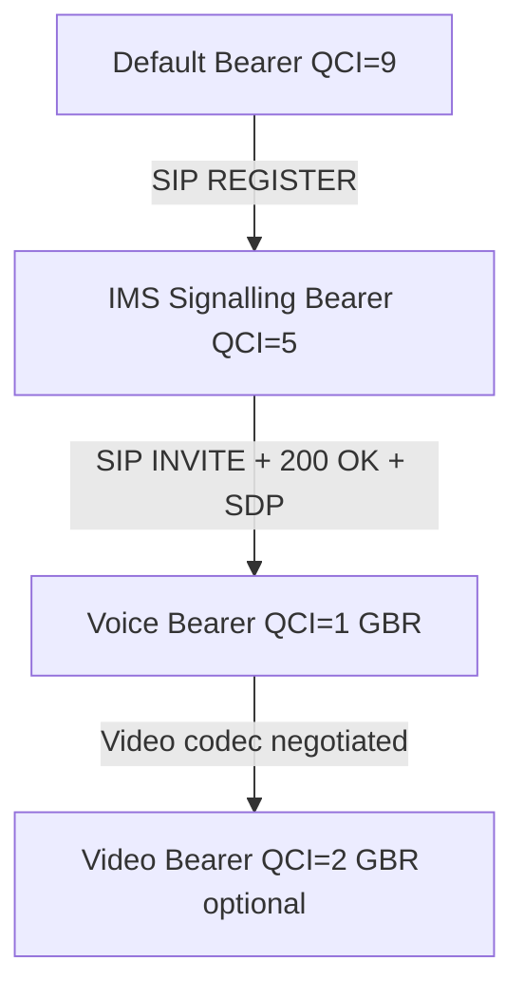

# QCI Characteristics and ARP

Defined in 3GPP TS 23.203 §6.1.7. QCI (QoS Class Identifier) is a scalar that references a standardized set of packet forwarding treatment characteristics in EPS bearers. ARP (Allocation and Retention Priority) is the admission and pre-emption control parameter.

---

## QCI Overview

A QCI is a number that maps to a specific combination of:
- **Resource type**: GBR (Guaranteed Bit Rate) or Non-GBR
- **Priority**: scheduler priority within the access node (eNodeB/gNB); lower value = higher priority
- **Packet Delay Budget (PDB)**: maximum one-way delay the radio network should guarantee (ms); end-to-end delay budget = PDB + core network delay
- **Packet Error Loss Rate (PELR)**: maximum fraction of SDU (packet) loss at the radio interface
- **Default Maximum Data Burst Volume (MDBV)**: for delay-critical GBR QCIs (QCI 82–85); marks the burst volume to be served within the PDB

### Resource Types

| Type | Description |
|---|---|
| GBR | A dedicated network resource (minimum bit rate) is reserved for the bearer; release requires explicit action |
| Non-GBR | No dedicated resource guaranteed; shares capacity with other non-GBR bearers; subject to congestion |
| Delay-critical GBR | GBR sub-type for V2X/mission-critical; characterized by MDBV in addition to GBR/MBR (QCIs 82–85) |

---

## Table 6.1.7-A — Standardized QCI Values (Core Table)

| QCI | Resource Type | Default Priority | Default PDB (ms) | Default PELR | Example Services |
|---|---|---|---|---|---|
| 1 | GBR | 2 | 100 | 10⁻² | Conversational Voice (VoLTE) |
| 2 | GBR | 4 | 150 | 10⁻³ | Conversational Video (live streaming) |
| 3 | GBR | 3 | 50 | 10⁻³ | Real-time gaming, V2X messages |
| 4 | GBR | 5 | 300 | 10⁻⁶ | Non-conversational video (buffered streaming) |
| 65 | GBR | 0.7 | 75 | 10⁻² | Mission Critical PTT (push-to-talk) voice |
| 66 | GBR | 2 | 100 | 10⁻² | Non-mission-critical PTT voice |
| 67 | GBR | 1.5 | 100 | 10⁻³ | Mission Critical Video user plane |
| 71 | GBR | 0.5 | 10 | 10⁻⁵ | V2X messages (LTE-V2X PC5 Mode 3/4) |
| 72 | GBR | 0.5 | 10 | 10⁻⁵ | V2X messages |
| 73 | GBR | 0.5 | 10 | 10⁻⁵ | V2X messages |
| 74 | GBR | 0.5 | 10 | 10⁻⁵ | V2X messages |
| 75 | GBR | 0.5 | 10 | 10⁻⁵ | V2X messages |
| 5 | Non-GBR | 1 | 100 | 10⁻⁶ | **IMS Signalling** (highest priority non-GBR) |
| 6 | Non-GBR | 6 | 300 | 10⁻⁶ | Video (buffered streaming), TCP-based (e.g. MMS) |
| 7 | Non-GBR | 7 | 100 | 10⁻³ | Voice, Video (live streaming), Interactive gaming |
| 8 | Non-GBR | 8 | 300 | 10⁻⁶ | Video (buffered streaming), TCP-based |
| 9 | Non-GBR | 9 | 300 | 10⁻⁶ | **Default bearer** (general internet, email, TCP) |
| 69 | Non-GBR | 0.5 | 60 | 10⁻⁶ | Mission Critical Delay Sensitive Signalling (e.g. MC-PTT signalling) |
| 70 | Non-GBR | 5.5 | 200 | 10⁻⁶ | Mission Critical Data |
| 79 | Non-GBR | 65 | 10 | 10⁻² | V2X messages |
| 80 | Non-GBR | 68 | 10 | 10⁻² | Low latency eMBB apps (AR/VR) |

> Notes:
> - Priority values below 1 (e.g. 0.5, 0.7, 1.5) denote **higher** priority than priority=1 — these are mission-critical QCIs introduced in later releases.
> - QCI 5 is the highest-priority non-GBR QCI — used for [IMS](../entities/S-CSCF.md) signalling (SIP) on the dedicated IMS signalling bearer. See [IMS registration procedure](../procedures/IMS-registration.md).
> - QCI 1 is used for VoLTE voice media (GBR, 100ms PDB). See [VoLTE MO call](../procedures/VoLTE-MO-call.md).
> - QCI 9 is the default for the **default EPS bearer** established at [EPS Attach](../procedures/EPS-attach.md).

---

## Table 6.1.7-B — Delay-Critical GBR QCIs (V2X / Industrial)

| QCI | Resource Type | Default Priority | Default PDB (ms) | Default PELR | Default MDBV (bytes) | Example Services |
|---|---|---|---|---|---|---|
| 82 | Delay-critical GBR | 19 | 10 | 10⁻⁴ | 255 | Discrete Automation (small packets, e.g. factory robot control) |
| 83 | Delay-critical GBR | 22 | 10 | 10⁻⁴ | 1358 | Discrete Automation (large packets) |
| 84 | Delay-critical GBR | 24 | 30 | 10⁻⁵ | 1354 | Intelligent Transport: infrastructure sensors |
| 85 | Delay-critical GBR | 21 | 5 | 10⁻⁵ | 255 | Electricity Distribution (High Voltage) |

> These QCIs carry a **Maximum Data Burst Volume (MDBV)** — the amount of data the radio network shall serve within the PDB. This enables precise scheduling for industrial automation use cases. They are provisioned by the PCRF via Gx.

---

## ARP — Allocation and Retention Priority

ARP controls how the network handles resource contention during bearer establishment and bearer pre-emption.

### ARP Fields

| Field | Values | Description |
|---|---|---|
| **Priority Level** | 1–15 | Admission priority; **1 = highest priority**, 15 = lowest |
| **Pre-emption Capability** | Yes / No | Whether this bearer may pre-empt resources held by a lower-priority bearer |
| **Pre-emption Vulnerability** | Yes / No | Whether this bearer may lose its resources if a higher-priority bearer with pre-emption capability requires them |

### Priority Level Ranges

| Range | Authorized by |
|---|---|
| 1–8 | Serving network operator (VPLMN or HPLMN as serving operator) |
| 9–15 | Home network operator (HPLMN) only |

> The serving network (VPLMN during roaming) may grant priority levels 1–8. Levels 9–15 are reserved for home-operator-controlled services (e.g. IMS emergency, MPS — see below).

### Special ARP Uses

| Use case | ARP behavior |
|---|---|
| **IMS Emergency** | PCRF assigns ARP priority = 1 (or as per local operator policy), pre-emption capability = Yes; emergency bearer can pre-empt all lower-priority bearers |
| **MPS (Multimedia Priority Service)** | PCRF sets elevated ARP (priority 1–8) for default bearer and IMS CN signalling bearer when MPS Priority EPS Bearer Service is active |
| **Default bearer** | Typically ARP priority 9, pre-emption capability = No, vulnerability = Yes |

---

## Key QCI/ARP Principles for PCC

1. **Bearer selection**: The [BBF](../entities/PCEF.md) (in PCEF for GTP, in BBERF for PMIP) binds PCC rules with identical QCI and ARP to the same IP-CAN bearer.
2. **GBR bearer sum**: The GBR of a GBR EPS bearer = sum of GBR values of all active GBR PCC rules bound to it.
3. **Non-GBR default bearer (QCI 9)**: Used for general internet traffic, IMS P-CSCF discovery (initial SIP REGISTER), best-effort flows.
4. **IMS signalling bearer (QCI 5)**: Dedicated bearer for SIP signalling. Established immediately after [IMS registration](../procedures/IMS-registration.md); carried on Non-GBR because SIP is bursty but delay-sensitive, not bandwidth-guaranteed.
5. **Voice bearer (QCI 1)**: Established on INVITE/200OK for VoLTE voice. GBR required because codec has fixed bit rate; PDB = 100ms matches voice quality requirements.

---

## QCI in VoLTE Call Flow

See [VoLTE MO Call](../procedures/VoLTE-MO-call.md) for full procedure.

---

## Related Pages

- [EPS Bearer concept](EPS-bearer.md) — bearer types, dedicated vs default
- [PCC Architecture](PCC-architecture.md) — PCC entities and Gx/Rx reference points
- [PCRF](../entities/PCRF.md) — QCI/ARP decisions made here
- [PCEF](../entities/PCEF.md) — QCI/ARP enforced here
- [VoLTE MO Call](../procedures/VoLTE-MO-call.md) — QCI 1/5 in practice
- [EPS Attach](../procedures/EPS-attach.md) — QCI 9 default bearer
