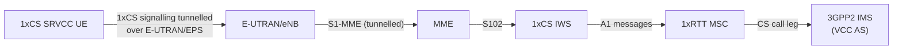
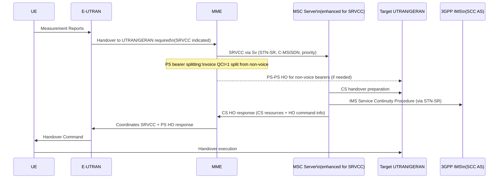
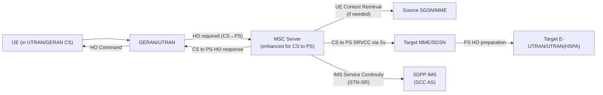
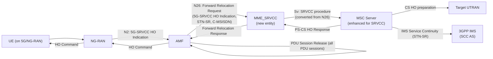
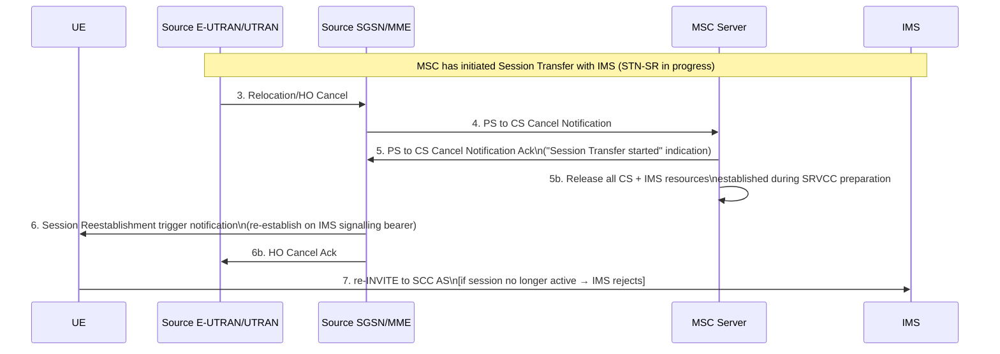

# Single Radio Voice Call Continuity (SRVCC)

**SRVCC** is the architectural mechanism that preserves an IMS-anchored voice call when a UE moves from a PS (packet-switched) access network to a CS (circuit-switched) access network — i.e., when radio conditions force the UE off LTE/5G/HSPA onto GERAN/UTRAN CS. The counterpart **CS to PS SRVCC** handles the reverse direction.

The core constraint the name reflects: the UE has a **single radio** and cannot simultaneously signal on both the source and target RAT. The handover must therefore be network-directed and fast enough that the voice gap is imperceptible.

> **IMS anchor prerequisite**: All sessions subject to SRVCC must be anchored at the **SCC AS** (Service Centralisation and Continuity Application Server) in the IMS, as specified in TS 23.237. The SCC AS performs the IMS domain transfer procedure (using the STN-SR address) that moves the session from the PS leg to the new CS leg. SRVCC is purely a radio/access handover mechanism — the IMS session transfer logic lives in the SCC AS.

---

## SRVCC Variants (6 active in Release 16)

| Variant | Source access | Target access | PS-side node | New reference point |
|---|---|---|---|---|
| E-UTRAN → 3GPP2 1xCS | LTE | CDMA2000 1xRTT CS | MME | S102 (MME–1xCS IWS) |
| E-UTRAN → UTRAN/GERAN | LTE | 3GPP CS | MME | Sv (MME–MSC Server) |
| E-UTRAN → UTRAN vSRVCC | LTE | 3GPP UTRAN CS (video+voice) | MME | Sv (MME–MSC Server) |
| UTRAN(HSPA) → UTRAN/GERAN | HSPA | 3GPP CS | SGSN | Sv (SGSN–MSC Server) |
| UTRAN/GERAN CS → E-UTRAN/UTRAN(HSPA) | 3GPP CS | LTE or HSPA PS | MSC Server | Sv (MSC–MME/SGSN) |
| NG-RAN → 3GPP UTRAN (5G-SRVCC) | 5G NR | 3GPP UTRAN CS | AMF + MME_SRVCC | N26 (AMF–MME_SRVCC) + Sv |

---

## Key Definitions

| Term | Meaning |
|---|---|
| **STN-SR** | Session Transfer Number for SRVCC — the address the MSC Server calls in IMS to invoke the session transfer procedure (per TS 23.237) |
| **E-STN-SR** | Emergency variant of STN-SR; locally configured in MSC Server; used when no HPLMN subscription data available (e.g., emergency session in limited service mode) |
| **C-MSISDN** | Correlation MSISDN — used to correlate IMS sessions with the CS subscriber identity during session transfer |
| **1xCS IWS** | 3GPP2 1xCS SRVCC Interworking Solution Function — tunnels 3GPP2 1xCS signalling between MME (via S102) and 1xRTT MSC |
| **SCC AS** | Service Centralisation and Continuity AS — the IMS anchor point that executes the domain transfer. Called via STN-SR. Defined in TS 23.237 |
| **vSRVCC** | Single Radio Video Call Continuity — extends SRVCC to transfer both voice and video from E-UTRAN to UTRAN CS (BS30 bearer) |
| **5G-SRVCC** | SRVCC from NG-RAN to 3GPP UTRAN, introduced in Release 16; uses AMF + MME_SRVCC as an intermediate bridge node |
| **MME_SRVCC** | A new functional entity for 5G-SRVCC: acts as a protocol bridge between AMF (N26 interface) and MSC Server (Sv interface); not a full MME |
| **PS bearer splitting** | MME/SGSN function that identifies the QCI=1 voice PS bearer and handles it differently (SRVCC path) vs non-voice PS bearers (normal inter-RAT HO path) |

---

## Architectural Principles

### Universal constraints (all SRVCC variants)

1. **IMS anchor mandatory**: All sessions subject to SRVCC must be anchored at the SCC AS. A session not anchored in IMS cannot be transferred via SRVCC.
2. **Single radio**: The solution shall not require the UE to simultaneously signal on two different RATs.
3. **Network controls**: RAT change and domain selection are under network control (not UE-initiated).
4. **QCI=1 restriction**: When SRVCC is deployed, QCI=1 bearers shall **only** be used for the IMS voice bearer (not for non-IMS data). This is the mechanism that lets the MME/SGSN unambiguously identify which PS bearer is the voice bearer to split and hand over via SRVCC.
5. **Roaming**: The VPLMN (visited network) controls RAT/domain selection change, taking into account HPLMN policies.

### vSRVCC additional constraints
- The UE uses **one QCI=1 bearer** (voice) and **one vSRVCC-marked PS bearer** (video).
- The MSC Server requests BS30 bearer resources at the target UTRAN for multimedia.
- If BS30 reservation fails, vSRVCC is abandoned (SRVCC is not attempted either in that failure path).

### CS to PS SRVCC prerequisites
- UE must be registered in IMS **and** have at least one PS bearer usable for SIP signalling.
- Emergency sessions are **not** subject to CS to PS SRVCC.
- After CS→PS transfer, the network can support moving the session back to CS domain.

### 5G-SRVCC
- All IMS sessions subject to 5G-SRVCC must be anchored at the SCC AS.
- After handover is complete, the AMF releases **all PDU sessions** (UE is now on 3G CS).
- The MME_SRVCC bridges N26 (5GC) and Sv (3G CS) protocol worlds.

---

## Per-Variant Concepts

### E-UTRAN to 3GPP2 1xCS SRVCC



- The 1xCS IWS acts as a **signalling tunnel relay** — it receives 3GPP2 1xCS messages from the MME (via S102) and emulates a 1xRTT Base Station System toward the 1xRTT MSC.
- The 3GPP2 1xCS signalling flows **end-to-end between UE and 1xCS IWS**, with the E-UTRAN/EPS and S102 as the transparent transport.
- Once the CS leg is established, the 1xRTT MSC notifies the VCC AS in IMS to perform domain transfer. The UE then executes the handover.

### E-UTRAN to UTRAN/GERAN SRVCC

High-level flow:



Key mechanics:
- **PS bearer splitting**: The MME separates the voice PS bearer (QCI=1) from non-voice PS bearers. The voice bearer goes via SRVCC; non-voice bearers follow a standard inter-RAT PS-PS handover.
- **Priority**: If SRVCC with priority (MPS) is supported, MME sets priority indication in the Sv message. MSC Server applies priority to both CS HO and IMS session transfer.
- **Emergency SRVCC**: MME uses **E-STN-SR** (locally configured in MSC Server, no HPLMN subscription needed). After emergency session release, MME restores the SRVCC indication to its pre-emergency state.

### E-UTRAN to UTRAN vSRVCC

Extension of E-UTRAN→UTRAN/GERAN SRVCC that also transfers the **video component** to CS:
- UE has QCI=1 (voice) and a vSRVCC-marked PS bearer (video).
- MME splits all three: voice (QCI=1) via SRVCC, video (vSRVCC-marked) via vSRVCC, non-voice/non-video via PS-PS HO.
- MSC Server requests BS30 bearer at target UTRAN for video. If BS30 fails, vSRVCC is abandoned.
- SCC AS determines which media streams to include in the vSRVCC transfer.
- After HO, UE initiates 3G-324M multimedia codec negotiation for the CS video leg.

### UTRAN(HSPA) to UTRAN/GERAN SRVCC

Identical concept to E-UTRAN→UTRAN/GERAN, but the PS-side node is the **SGSN** (not the MME):
- SGSN receives HO request from UTRAN(HSPA) with SRVCC indication.
- SGSN triggers SRVCC procedure to MSC Server via Sv.
- Voice detection: `traffic class = Conversational` AND `Source Statistics Descriptor = 'speech'` (not QCI, since HSPA uses UMTS traffic classes).
- Two SGSN variants: **Gn-based SGSN** (connects to GGSN) and **S4-based SGSN** (connects to SGW/PGW via S4/S12).

### CS to PS SRVCC (Reverse Direction)



- UE informs MSC Server about its serving MME/SGSN using `P-TMSI+RAI+P-TMSI signature` or `GUTI` in NAS signalling (when requested by MSC Server).
- MSC Server checks CS to PS SRVCC possibility against three conditions: (1) UE capability (from IMS via TS 23.237), (2) "CS to PS SRVCC allowed" in subscription data (from HSS via MAP D), (3) UE's IMS registration status.
- MSC Server informs RAN about CS to PS SRVCC support via "CS to PS SRVCC operation possible" indicator sent to RNC/BSC.

### NG-RAN to 3GPP UTRAN 5G-SRVCC



The **MME_SRVCC** acts as a protocol translation node:
- Converts between the 5GC **N26 interface** (AMF-side) and the 3G **Sv interface** (MSC Server-side).
- Stores the N26/Sv association per UE during the handover.
- Selects the MSC Server based on Target ID received from AMF.
- Releases the N26/Sv association after receiving PS to CS Complete ACK.
- Does **not** act as a full MME — it is a targeted bridge function.

---

## SRVCC for IMS Emergency Sessions

SRVCC emergency sessions follow the same procedures as regular SRVCC with these differences:

| Aspect | Normal SRVCC | Emergency SRVCC |
|---|---|---|
| STN-SR source | From HSS subscription, downloaded to MME via S6a | Locally configured E-STN-SR in MSC Server |
| Subscription check | Required (HSS-provisioned STN-SR) | Bypassed (E-STN-SR used regardless of subscription) |
| Post-HO location | Standard | MSC Server/SGSN may initiate location continuity (GMLC Subscriber Location Report) |
| Post-session cleanup | Normal | MME **restores** SRVCC operation possible indication to pre-emergency state after emergency session releases |

**Limited Service Mode (UICC-less UE)**:
- MME/SGSN includes the **equipment identifier** (IMEI) in the Sv message to MSC Server.
- MSC Server sets up the call leg to the EATF (Emergency Access Transfer Function, per TS 23.237) using the equipment identifier.

**eCall over IMS SRVCC**:
- SRVCC proceeds exactly as regular emergency SRVCC.
- After CS HO completes, the SRVCC UE supports **in-band MSD transfer** over the voice channel (per TS 26.267) to the emergency centre/PSAP.

---

## New Functional Entities Introduced

### 1xCS IWS (3GPP2 1xCS SRVCC Interworking Solution Function)

| Property | Value |
|---|---|
| Purpose | Signalling tunnel relay for 3GPP2 1xCS SRVCC |
| Interfaces | S102 to MME; A1 to 1xRTT MSC |
| Function | Receives encapsulated 3GPP2 1xCS signalling from MME; emulates 1xRTT BSS toward 1xRTT MSC |
| Architecture | Added to the E-UTRAN architecture (TS 23.402) |

### MSC Server enhanced for SRVCC

Standard MSC Server (TS 23.002) with the following additions:

| Addition | Purpose |
|---|---|
| Sv interface (MME/SGSN → MSC Server) | Receives SRVCC Relocation Preparation requests; carries STN-SR, C-MSISDN, priority, emergency indication |
| IMS service continuity invocation | Calls SCC AS via STN-SR to transfer IMS session to CS domain (TS 23.237) |
| CS HO coordination | Coordinates CS handover at target UTRAN/GERAN and IMS session transfer simultaneously |
| MAP_Update_Location | For non-emergency sessions: handles location update without UE triggering it |
| E-STN-SR usage | For emergency sessions: uses locally configured E-STN-SR, bypassing HSS subscription lookup |
| Priority handling | Sets priority indication if MPS (IMS-based priority service) is indicated via Sv |

**vSRVCC extension**: Additionally initiates handover toward UTRAN for BS30 bearer reservation; negotiates with SCC AS to identify which media streams transfer.

**CS to PS extension**: Informs RAN about CS to PS SRVCC capability; determines CS to PS eligibility from UE capability + subscription (HSS MAP D) + IMS registration; selects target MME/SGSN via Target ID.

### MME_SRVCC (5G-SRVCC only)

| Property | Value |
|---|---|
| Purpose | Protocol bridge between 5GC AMF (N26) and 3G MSC Server (Sv) for 5G-SRVCC |
| N26 side | Receives Forward Relocation Request from AMF; sends Forward Relocation Response to AMF |
| Sv side | Triggers SRVCC procedure to MSC Server; receives CS HO response |
| MSC selection | Based on Target ID received from AMF |
| UE state | Stores N26/Sv binding per UE; releases after PS to CS Complete ACK |
| Baseline capability | Must support inter-RAT HO from NG-RAN to E-UTRAN (TS 23.502) + SRVCC from E-UTRAN to UTRAN without PS HO procedure (§6.2.2.1A) |

---

## Reference Points Summary

| Reference Point | Nodes | Purpose |
|---|---|---|
| **S102** | MME ↔ 3GPP2 1xCS IWS | Tunnel for 3GPP2 1xCS signalling |
| **Sv** | MME/SGSN ↔ MSC Server | (v)SRVCC handover; also CS to PS SRVCC |
| **Sv** (5G) | MME_SRVCC ↔ MSC Server | 5G-SRVCC handover |
| **N26** | AMF ↔ MME_SRVCC | 5G-SRVCC HO Indication + STN-SR/C-MSISDN forwarding |
| **S6a** | HSS → MME | Downloads STN-SR, C-MSISDN, vSRVCC flag during EPS attach |
| **Gr / S6d** | HSS → SGSN | Downloads STN-SR, C-MSISDN for UTRAN(HSPA) |
| **MAP D** | HSS → MSC Server | "CS to PS SRVCC allowed" indication per subscriber per VPLMN |
| **N2** | NG-RAN ↔ AMF | 5G-SRVCC HO Indication; 5G-SRVCC possible indication |
| **S1-MME** | E-UTRAN ↔ MME | "SRVCC operation possible" indication; S1 Information Transfer (for 1xCS tunnelling) |

---

## HSS Subscription Data for SRVCC

The HSS provisions SRVCC-related data to the PS control plane during attach:

| Data element | Downloaded to | Purpose |
|---|---|---|
| STN-SR | MME (S6a), SGSN (Gr/S6d) | Address of SCC AS; used by MSC Server to invoke IMS session transfer |
| C-MSISDN | MME, SGSN | Correlation identifier linking IMS session to CS subscriber identity |
| vSRVCC flag | MME (S6a) | Indicates UE is authorised for vSRVCC |
| ICS flag | MME, SGSN (optional) | Indicates MSC Server may also act as ICS-capable |
| CS to PS SRVCC allowed | MSC Server (MAP D) | Per-VPLMN permission for CS to PS SRVCC |

The UDM (5GC equivalent of HSS) provides STN-SR and C-MSISDN to AMF. AMF includes these in the N26 Forward Relocation Request for 5G-SRVCC.

---

## PCC Role in SRVCC

The **PCRF** (policy function) has two SRVCC-specific responsibilities:

1. **QCI=1 enforcement**: Enforces that only voice bearers for IMS sessions anchored at the SCC AS use QCI=1 (and traffic-class Conversational + SSD='speech'). This is what makes the PS bearer splitting function reliable.
2. **vSRVCC video bearer marking**: For vSRVCC, marks the video PS bearer of SCC AS-anchored sessions with the "PS to CS session continuity indicator" (per TS 23.203), making it identifiable as the vSRVCC-marked bearer.

If PCC is **not** deployed, the PDN GW cannot enforce QCI=1, and the architecture principle (point 1) cannot be guaranteed.

---

---

## CS-to-PS SRVCC Call Flows (§6.4)

### Attach enabling procedures

- **GPRS Attach (§6.4.1)**: HSS includes "CS to PS SRVCC allowed" in Insert Subscriber Data to MSC Server. This indication may be VPLMN-specific.
- **E-UTRAN Attach (§6.4.2)**: Performed per TS 23.401.

### §6.4.3.1 — From GERAN to E-UTRAN/UTRAN(HSPA) without DTM/PS HO (16 steps)

```mermaid
sequenceDiagram
    participant UE
    participant RAN as Source BSC/RNC
    participant MSC as MSC Server
    participant OSGSN as Old MME/SGSN
    participant TSGSN as Target MME/SGSN
    participant EUTRAN as Target eNB/NodeB
    participant SGW as SGW/PGW
    participant IMS

    RAN ->> MSC: 1. HO Required (CS to PS SRVCC indication)
    MSC ->> UE: 1a. Retrieve P-TMSI+RAI+P-TMSI signature or GUTI
    MSC ->> IMS: 2. Session Transfer Notification\n(IMS allocates media ports + codecs for PS path)
    MSC ->> TSGSN: 3. SRVCC CS to PS HO Request\n(IMSI, Target ID, GUTI or P-TMSI+RAI,\nSupported Codecs, MS ClassMark 2)
    Note over MSC,TSGSN: Steps 2 and 3 may be performed independently
    TSGSN ->> OSGSN: 4. Context Request (GUTI or P-TMSI, RAI)
    OSGSN ->> TSGSN: 5. Context Response (all UE bearer contexts)
    TSGSN ->> TSGSN: 6. Allocate PS bearer resources\n(E-UTRAN or UTRAN(HSPA);\ndetermine SGW relocation if needed)
    TSGSN ->> MSC: 7. SRVCC CS to PS HO Response\n(Target→Source Transparent Container)
    MSC ->> RAN: 8. HO Command\n(IP address+port of UE on target PS access)
    MSC ->> IMS: 9. Session Transfer Preparation Request\n(IMS switches media path to PS)
    UE ->> EUTRAN: 10. HO confirmation to eNB/NodeB
    EUTRAN ->> TSGSN: 11. Handover Notify
    TSGSN ->> MSC: 11a. SRVCC CS to PS Complete Notification\n(CS to PS indicator)\n[MSC → SRVCC CS to PS Complete Ack]
    TSGSN ->> SGW: 12. Modify Bearer Request\n(forwarded to PGW for IRAT HO;\nPS bearer path established for all bearers;\ntemporary default-bearer filters allow IMS voice)
    TSGSN ->> OSGSN: 13. Context Acknowledge
    OSGSN ->> RAN: 14. Release resources
    UE ->> IMS: 15. UE initiates Session Transfer per TS 23.237
    TSGSN ->> TSGSN: 16. Setup dedicated bearer/PDP Context for voice\n(per TS 23.401 or TS 23.060;\nfilters reverted from default to configured ATGWs)
```

**Key annotations:**
- **Step 6**: Target MME/SGSN includes the CS to PS SRVCC indication in the Context Acknowledge (step 13). With dynamic PCC, PCRF makes policy decisions to allow IMS voice via ATGW on the default bearer until the dedicated bearer (step 16) is set up. Without PCC, PGW installs temporary filters locally.
- **Step 11a**: The "Complete Notification" triggers source SGSN to delete the voice bearer toward GGSN/SGW/PGW (PS-to-CS HO indicator). If PCC is deployed, PGW interacts with PCRF.
- **Non-emergency TMSI**: MSC Server may perform TMSI reallocation and MAP Update Location to HSS/HLR after completion.

### §6.4.3.2 and §6.4.3.3 — Variants

| Variant | Difference from §6.4.3.1 |
|---|---|
| §6.4.3.2 (GERAN+DTM no HO / UTRAN no PS HO) | Old PS node is an SGSN in the same routing area as BSC/RNC. Target MME/SGSN sends Context Request directly using P-TMSI+RAI to find that SGSN. |
| §6.4.3.3 (GERAN/UTRAN with DTM/PS HO support) | BSC/RNC only sends CS to PS HO Required when CS to PS SRVCC is actually triggered. No target MME PS HO signalling is initiated. Same context lookup via P-TMSI+RAI. |

---

## Handover Failure (§8)

### §8.1 — Failure in PS-to-CS SRVCC

#### Before MSC Server initiates Session Transfer (§8.1.1)

Standard handover failure procedures per TS 23.401 apply. No SRVCC-specific action required.

#### After Session Transfer initiated — before PS to CS Response (§8.1.1a.1)

```mermaid
sequenceDiagram
    participant MME as MME/SGSN
    participant MSC as MSC Server
    participant IMS

    Note over MME,MSC: SRVCC procedure started; MSC requesting CS resources
    MSC ->> IMS: Session Transfer INVITE (STN-SR)
    IMS ->> MSC: Failure (Session Transfer leg establishment error)
    MSC ->> MME: PS to CS Response\n(Reject cause = "Session Transfer leg establishment error")
    MSC ->> MSC: Clear target CS RAT resources
    MME ->> MME: Handover Preparation Failure\n→ may blacklist further SRVCC if cause is permanent
```

- **Permanent cause** (e.g., invalid STN-SR → IMS "404 User Unknown"): MME/SGSN may suppress further SRVCC attempts for this UE.
- **Temporary cause**: MME/SGSN may retry SRVCC.

#### After Session Transfer initiated — after PS to CS Response (§8.1.1a.2)

- MSC Server already sent positive PS to CS Response (CS resources reserved; HO Command issued).
- IMS session transfer then fails.
- MSC Server sends **PS to CS Complete Notification with error cause** (permanent or temporary).
- MME/SGSN performs bearer release per §6.2 or §6.3 — call is released.

#### UE radio failure after HO command (§8.1.2)

- UE fails at radio level; cannot reach UTRAN/GERAN.
- UE sends **re-INVITE to SCC AS** to maintain session on current PS access.
- Core network (MME, MSC Server) takes no SRVCC-specific action on absence of Handover Complete.

#### Handover Cancellation (§8.1.3)



- All original E-UTRAN bearers remain intact throughout; assumed re-usable after cancellation.
- Source E-UTRAN/UTRAN must not attempt new SRVCC until previous cancellation is fully acknowledged.

#### Alerting/pre-alerting state failure (§8.1.4)

- If UE, MSC Server, or IMS (e.g., SCC AS, EATF, ATCF) does not support alerting SRVCC capabilities, IMS returns a **temporary failure**.
- MSC Server should delay sending PS-CS Response until IMS response is received (or timeout) — avoids wasting CS radio resources.
- Source E-UTRAN/UTRAN may retry SRVCC or use another HO mechanism on receiving handover preparation failure.

### §8.2 — Failure in CS-to-PS SRVCC

| Failure point | Detected by | Action |
|---|---|---|
| §8.2.1: Before UE Session Transfer | MSC Server | MSC cancels HO with permanent-cause; sends Session Transfer Notification cancellation to IMS |
| §8.2.2: Before UE Session Transfer | MME (no UE context) | MME sends SRVCC CS to PS Response with failure; MSC cancels with permanent-cause |
| §8.2.3: CS to PS HO Cancellation | Source RAN | MSC → CS to PS Cancel Notification → MME acks → MSC acks RAN; MSC sends cancellation to IMS if Session Transfer Notification already sent |

---

## Security (§9)

| Interface | Nodes | Protocol | Standard |
|---|---|---|---|
| **S102** | MME ↔ 3GPP2 1xCS IWS | NDS/IP (integrity + confidentiality) | TS 33.210 |
| **Sv** | MME/SGSN ↔ MSC Server | NDS/IP (integrity + confidentiality) | TS 33.210 |

NDS/IP applies whenever signalling messages containing security context (keys, security parameters) are transferred. If control plane interfaces are trusted (physically protected), protection is not required.

---

## Neighbour Cell List Determination (Annex A — informative)

The inclusion of non-native cells in the Neighbour Cell List (NCL) depends on SRVCC capability:

| Direction | Condition | NCL behaviour |
|---|---|---|
| E-UTRAN → 3GPP2 1xCS | "SRVCC operation possible" = true AND QCI=1 bearer exists | 1x cells **may** be in NCL; SRVCC indication included in HO Required |
| E-UTRAN → 3GPP2 1xCS | Above condition not met | 1x cells **not** in NCL |
| E-UTRAN → GERAN/UTRAN | "SRVCC operation possible" = true AND UE has SRVCC RAC for target | VoIP-incapable cells may be in NCL; QCI=1 bearer existence determines whether SRVCC indication in HO Required |
| E-UTRAN → GERAN/UTRAN | "SRVCC operation possible" not set OR UE lacks RAC | VoIP-incapable cells: excluded from NCL if QCI=1 bearer exists; may be included if no QCI=1 bearer |
| UTRAN(HSPA) → GERAN/UTRAN | Same as E-UTRAN row, replacing E-UTRAN with UTRAN | — |
| GERAN/UTRAN → E-UTRAN/UTRAN(HSPA) | "CS to PS SRVCC operation possible" = true AND TS 11 bearer (CS speech) exists AND UE has CS to PS RAC | VoIP-capable cells may be in NCL; HO Required indicates CS to PS |
| GERAN/UTRAN → E-UTRAN/UTRAN(HSPA) | "CS to PS SRVCC operation possible" not set OR no TS 11 bearer | VoIP-capable cells excluded from NCL if TS 11 bearer exists; may be included otherwise |

The **TS 11 bearer** (in GERAN/UTRAN) is the CS speech bearer — the CS-domain equivalent of QCI=1 for the reverse direction.

---

## Cross-references

- [IMS Service Continuity / SCC AS](../entities/TAS-deepdive.md) — the IMS anchor; receives STN-SR calls from MSC Server
- [SRVCC procedures from E-UTRAN + 5G-SRVCC](../procedures/SRVCC-from-E-UTRAN.md) — §6.1/§6.2/§6.5 call flows
- [SRVCC procedures from UTRAN(HSPA)](../procedures/SRVCC-from-UTRAN-HSPA.md) — §6.3 call flows
- [MME deep-dive](../entities/MME-deepdive.md) — PS bearer splitting function, Sv interface, SRVCC operation possible indication
- [HSS deep-dive](../entities/HSS-deepdive.md) — STN-SR, C-MSISDN provisioning via S6a
- [PCRF deep-dive](../entities/PCRF-deepdive.md) — QCI=1 enforcement, vSRVCC bearer marking
- [Non-3GPP access architecture](non-3GPP-access-architecture.md) — for ePDG/WLAN context
- [IMS emergency architecture](IMS-emergency-architecture.md) — E-STN-SR usage, limited service mode
- Source: [TS 23.216](../sources/ts23216.md)
