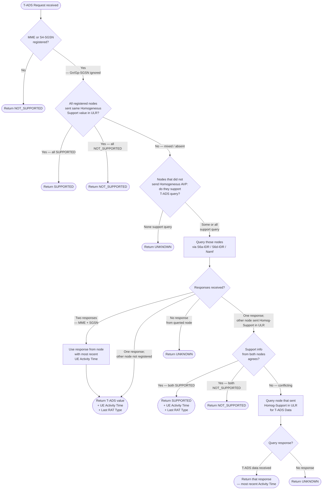

# Sh Interface — User Profile Data Model and Information Elements

Defines the content and semantics of every Information Element (IE) exchanged over the Sh interface, including the master Data-Reference table (Table 7.6.1) governing which data is accessible with which access keys and which operations. Source: 3GPP TS 29.328 §7 and Annex A.

For procedure flows (how these IEs are used in Sh-Pull/Update/Subs-Notif/Notif), see [procedures/Sh-signalling-flows.md](../procedures/Sh-signalling-flows.md).
For the Diameter wire encoding of these IEs, see [protocols/Sh-Diameter.md](../protocols/Sh-Diameter.md).

---

## §7.1 User Identity

Identifies the subscriber. The User-Identity Diameter AVP (grouped, code 700) carries exactly one of:

| Sub-IE | Diameter AVP | Cat. | Content |
|---|---|---|---|
| IMS Public User Identity / PSI (§7.1.1) | Public-Identity | C | SIP URI or tel URI per TS 23.003; canonical form per RFC 3261 §10.3 or E.164 without visual separators |
| MSISDN (§7.1.2) | MSISDN | C | MSISDN or Basic MSISDN if multinumbering; per TS 23.012 |
| External Identifier (§7.1.3) | External-Identifier | C | External Identifier per TS 23.003 |

Each sub-IE is conditional — presence depends on which Data-Reference is requested and what identifier type is being used (see Table 7.6.1).

### §7.1A Wildcarded PSI
A Wildcarded PSI hosted by an AS. For definition see TS 23.003. When an AS request refers to a Wildcarded PSI, the corresponding Wildcarded-Public-Identity AVP (code 634, optional) is included as supplementary identification.

### §7.1B Wildcarded Public User Identity
A Wildcarded IMPU stored in the HSS. Per TS 23.003. Carried in Wildcarded-IMPU AVP (code 636).

---

## §7.2–§7.2B Access Key IEs

| IE | Purpose |
|---|---|
| **§7.2 Requested Domain** | Specifies access domain for data dependent on domain (CS / PS); values per TS 29.329 |
| **§7.2A Requested Nodes** | Specifies access node types (MME / SGSN / 3GPP-AAA-Server-TWAN / AMF bitmask); for user state and location |
| **§7.2B Serving Node Indication** | Signals that only the serving node address/identity is required (e.g. MME FQDN, SGSN number, VLR number); other location details (Cell Global ID, TAI) may be absent; **only applicable to LocationInformation** |

---

## §7.6 — Table 7.6.1: Data Accessible via Sh Interface (Complete)

The authoritative per-Data-Reference table defining: XML tag, access key components, and allowed operations. An access key in square brackets `[ ]` is optional; two items separated by `OR` mean exactly one of the two must be present.

| Data Ref. | XML Tag | Access Key (mandatory unless bracketed) | Operations |
|---|---|---|---|
| **0** | RepositoryData | Data-Reference + (IMPU OR PSI) + Service-Indication | Sh-Pull, Sh-Update, Sh-Subs-Notif _(Note 1, 3)_ |
| **10** | IMSPublicIdentity | Data-Reference + (IMPU OR PSI OR External-Identifier) + [Requested-Identity-Set] | Sh-Pull, Sh-Subs-Notif |
| **11** | IMSUserState | Data-Reference + IMS Public User Identity | Sh-Pull, Sh-Subs-Notif |
| **12** | S-CSCFName | Data-Reference + (IMPU OR PSI) | Sh-Pull, Sh-Subs-Notif _(Note 1)_ |
| **13** | InitialFilterCriteria | Data-Reference + (IMPU OR PSI) + Application-Server-Name | Sh-Pull, Sh-Subs-Notif _(Note 1)_ |
| **14** | LocationInformation | Data-Reference + (IMPU OR MSISDN OR External-Identifier) + [Private-Identity] + [Requested-Domain] + [Current-Location] + [Serving-Node-Indication] + [Requested-Nodes] + [Local-Time-Zone-Indication] + [RAT-Type-Requested] | Sh-Pull _(Notes 5, 6, 7)_ |
| **15** | UserState | Data-Reference + (IMPU OR MSISDN OR External-Identifier) + [Private-Identity] + Requested-Domain + [Requested-Nodes] | Sh-Pull _(Notes 5, 7)_ |
| **16** | ChargingInformation | Data-Reference + (IMPU OR PSI OR MSISDN OR External-Identifier) | Sh-Pull, Sh-Subs-Notif |
| **17** | MSISDN / MSISDNorExtendedMSISDN | Data-Reference + (IMPU OR MSISDN OR External-Identifier) + [Private-Identity] | Sh-Pull _(Note 4)_ |
| **18** | PSIActivation | Data-Reference + IMS Public Service Identity | Sh-Pull, Sh-Update, Sh-Subs-Notif _(Note 1)_ |
| **19** | DSAI | Data-Reference + (IMPU OR PSI) + DSAI-Tag + Application-Server-Name | Sh-Pull, Sh-Update, Sh-Subs-Notif _(Note 1)_ |
| **20** | _(Reserved)_ | — | — |
| **21** | ServiceLevelTraceInfo | Data-Reference + (IMPU OR MSISDN OR External-Identifier) | Sh-Pull, Sh-Subs-Notif |
| **22** | IPAddressSecureBindingInformation | Data-Reference + IMS Public User Identity | Sh-Pull, Sh-Subs-Notif |
| **23** | ServicePriorityLevel | Data-Reference + IMS Public User Identity | Sh-Pull, Sh-Subs-Notif |
| **24** | SMSRegistrationInfo | Data-Reference + (IMPU OR MSISDN OR External-Identifier) + [Private-Identity] | Sh-Pull, Sh-Update _(Note 5)_ |
| **25** | UEreachabilityForIP | Data-Reference + (IMPU OR MSISDN OR External-Identifier) + [Private-Identity] | Sh-Subs-Notif _(Note 5)_ |
| **26** | T-ADSInformation | Data-Reference + (IMPU OR MSISDN) + [Private-Identity] | Sh-Pull _(Note 5)_ |
| **27** | STN-SR | Data-Reference + (IMPU OR MSISDN) + Private-Identity | Sh-Pull, Sh-Update _(Note 5)_ |
| **28** | UE-SRVCC-Capability | Data-Reference + (IMPU OR MSISDN) + Private-Identity | Sh-Pull, Sh-Subs-Notif _(Note 5)_ |
| **29** | ExtendedPriority | Data-Reference + IMS Public User Identity | Sh-Pull, Sh-Subs-Notif |
| **30** | CSRN | Data-Reference + (IMPU OR MSISDN) + [Private-Identity] | Sh-Pull _(Note 5)_ |
| **31** | ReferenceLocationInformation | Data-Reference + IMS Public User Identity + [Private-Identity] | Sh-Pull _(Note 5)_ |
| **32** | IMSI | Data-Reference + (IMPU OR MSISDN OR External-Identifier) + [Private-Identity] | Sh-Pull _(Note 8)_ |
| **33** | IMSPrivateUserIdentity | Data-Reference + IMS Public User Identity | Sh-Pull, Sh-Subs-Notif _(Note 8)_ |
| **34** | IMEISV | Data-Reference + (IMPU OR MSISDN OR External-Identifier) + [Private-Identity] | Sh-Pull _(Note 5)_ |
| **35** | UE-5G-SRVCC-Capability | Data-Reference + (IMPU OR MSISDN) + [Private-Identity] | Sh-Pull, Sh-Subs-Notif _(Note 5)_ |

**Table 7.6.1 Notes:**

| Note | Rule |
|---|---|
| 1 | If AS subscribes to a Wildcarded PSI, notifications sent as if subscription was to the corresponding Wildcarded PSI. Reading a specific PSI matching a Wildcarded PSI → response as if request was to the Wildcarded PSI. |
| 3 | Any IMPU in an Alias Public User Identity Set may be used as repository data key; all IMPUs in the same alias set share the same transparent data. |
| 4 | If several MSISDNs are associated with the Public Identity, AS must include the Private User Identity to fetch a specific MSISDN. Extended-MSISDN is returned in addition to MSISDN when the Additional-MSISDN feature is enabled. |
| 5 | If Sh procedure refers to a specific Private Identity within a set of multiple Private Identities associated to an IMPU or MSISDN, the corresponding Sh request shall include that Private Identity as part of the access key. |
| 6 | Serving Node Indication is only included when Current-Location = DoNotNeedInitiateActiveLocationRetrieval. |
| 7 | Requested-Nodes is only applicable when Requested-Domain = PS. |
| 8 | IMSI (32) and IMSPrivateUserIdentity (33) may be considered sensitive — not all ASes may be permitted to retrieve them. See §6.2 (AS Permissions List). |
| 9 | If Data-Reference and External-Identifier are both used as access key, Private-Identity is not applicable as an additional access key. |

---

## §7.6 IE Content Definitions

### §7.6.1 Repository Data (Data-Ref = 0)
Transparent data blob. A data repository (identified by Service-Indication) may be shared by more than one AS implementing the same service. All IMPUs in the same Alias Public User Identity Set share the same repository data (Note 3 above). For PSIs matching a Wildcarded PSI, repository data is stored **per Wildcarded PSI**, not per individual PSI.

### §7.6.2 IMSPublicIdentity (Data-Ref = 10)
Content depends on the Requested-Identity-Set value:

| Requested-Identity-Set | HSS returns |
|---|---|
| IMPLICIT_IDENTITIES | All non-barred IMPUs in the same implicit registration set as the IMPU in User-Identity AVP; MSISDN and External-Identifier not applicable; if User-Identity is a PSI → return only that PSI |
| ALIAS_IDENTITIES | All non-barred IMPUs in the same Alias Public User Identity Set; MSISDN, PSI, External-Identifier not applicable |
| REGISTERED_IDENTITIES | All non-barred IMPUs whose state is registered, belonging to all Private Identities associated with the User-Identity; if User-Identity is PSI → no identities returned |
| ALL_IDENTITIES | All non-barred IMPUs belonging to all Private Identities associated with User-Identity |
| (not included) | Same as ALL_IDENTITIES |

An IMS Public Identity qualifies if it is associated with the same Private User Identity / PSI, MSISDN, or External Identifier as in the request. Multiple instances of this IE may be included in the message.

### §7.6.3 IMS User State (Data-Ref = 11)
IMS registration state of the referenced public identifier.

| Value | Meaning |
|---|---|
| REGISTERED | IMPU is currently registered with at least one Private User Identity |
| NOT_REGISTERED | IMPU is not registered with any Private User Identity |
| AUTHENTICATION_PENDING | IMPU is not registered but is in process of being authenticated |
| REGISTERED_UNREG_SERVICES | IMPU is not registered but has unregistered-services state (allows terminating unregistered services) |

**Shared-IMPU precedence rule:** If IMPU is shared between multiple Private User Identities, the HSS reports the **most registered state** using the priority: REGISTERED > REGISTERED_UNREG_SERVICES > AUTHENTICATION_PENDING > NOT_REGISTERED.

### §7.6.4 S-CSCF Name (Data-Ref = 12)
Name (Diameter Identity / SIP URI) of the S-CSCF currently assigned to the IMS subscription.

### §7.6.5 Initial Filter Criteria (Data-Ref = 13)
The iFC triggering information for a service — specifically, the iFCs relevant to the requesting AS identified by the Application-Server-Name access key. Per TS 23.218 and TS 29.228 (XML format shared with Cx). Read-only for AS via Sh.

### §7.6.6 Location Information (Data-Ref = 14)
UE location retrieved from serving nodes. HSS uses:
- CS domain: MAP-PROVIDE-SUBSCRIBER-INFO → MSC/VLR
- PS domain (SGSN): MAP-PROVIDE-SUBSCRIBER-INFO or S6d-IDR → SGSN
- PS domain (MME): S6a-IDR → MME
- PS domain (3GPP AAA Server / TWAN): SWx-PPR
- 5GS (AMF): Namf service operation

**Fallback (serving node unreachable):** HSS provides locally stored location (serving node name, Visited PLMN ID from last Update Location message, or last known location from Purge message).

**Serving Node Indication:** If present in Sh-Pull request, response contains only serving node address(es) stored in HSS; detailed location info (Cell Global ID, TAI) may be absent — suppresses unnecessary signalling to serving nodes.

#### §7.6.6.1 CS Location Information sub-elements
Location number (Q.763), Service area ID, Cell Global ID, Location area ID, Geographical Information (TS 23.032), Geodetic Information (Q.763), VLR Number, MSC Number, Age of location, Current-Location-Retrieved flag, User CSG information, E-UTRAN Cell Global ID _(when MSC uses SGs, replaces Location number/SAI/CGI/LAI)_, Tracking Area ID _(same SGs condition)_, Local Time Zone (TS 29.272 with DST).

#### §7.6.6.2 GPRS (PS) Location Information sub-elements
Service area ID, Cell Global ID, Location area ID, Geographical/Geodetic Information, SGSN Number, Routing Area ID, Current-Location-Retrieved, Age of location, User CSG info, Visited PLMN ID, Local Time Zone, RAT type (TS 29.212 §5.3.31).

#### §7.6.6.3 EPS Location Information sub-elements
E-UTRAN Cell Global ID, Geographical/Geodetic Information, MME Name (Diameter Identity from S6a ULR Origin-Host), Tracking Area ID, Current-Location-Retrieved, Age of location, Visited PLMN ID, User CSG info, Local Time Zone, RAT type.

#### §7.6.6.4 TWAN Location Information sub-elements
TWAN SSID, TWAN BSSID (per TS 29.273), TWAN PLMN ID, Civic Address (RFC 4776 excluding first 3 octets), TWAN Operator Name, Local Time Zone, Logical Access ID (ETSI ES 283 034).
> NOTE: EPS location info (§7.6.6.3) is NOT relevant to TWAN location information.

#### §7.6.6.5 5GS Location Information sub-elements
NR Cell Global ID, E-UTRAN Cell Global ID, Geographical Information, AMF Address (serving AMF, 3GPP access), SMSF Address (serving SMSF, 3GPP access), Tracking Area ID, Current-Location-Retrieved, Age of location, Visited PLMN ID, Local Time Zone, RAT type.

### §7.6.7 User State (Data-Ref = 15)
Reachability state of the User Identity in the domain/node indicated by Requested-Domain and Requested-Node. HSS retrieves from serving nodes (same signalling as Location Information). UDM+HSS reports "NotProvidedFromSGSN or MME or AMF" in EPSUserState/PSUserState/5GUserState if that serving node does not support state retrieval. Values per TS 23.078 (CS/PS Subscriber State), TS 29.272 (EPS User State), TS 29.518 (5GS User State).

### §7.6.8 Charging Information (Data-Ref = 16)
Addresses of charging functions associated with the subscriber:
- **PrimaryEventChargingFunctionName** (Primary Online Charging Function)
- **SecondaryEventChargingFunctionName** (Secondary Online Charging Function)
- **PrimaryChargingCollectionFunctionName** (Primary Charging Data Function)
- **SecondaryChargingCollectionFunctionName** (Secondary Charging Data Function)

Clash resolution: if charging function addresses received over ISC differ from those received over Sh → **ISC addresses take precedence**.

> **NOTE:** Sh charging info retrieval is a special case (e.g. AS needs charging addresses before a user REGISTER arrives); it is not a general-purpose alternative to receiving these addresses from the S-CSCF via the ISC interface.

AS extracts the FQDN from the DiameterURI and uses it as Destination-Host in Diameter accounting requests. Parent domain of FQDN = Destination-Realm (configuration option).

### §7.6.9 MSISDN (Data-Ref = 17)
MSISDN or Basic MSISDN (multinumbering, TS 23.012). Multiple instances allowed only if IMPU is shared and no Private Identity was included in the request; otherwise one instance only.

### §7.6.9A Extended MSISDN
Additional-MSISDN (A-MSISDN) returned in addition to MSISDN when the Additional-MSISDN feature is supported by both HSS and AS and A-MSISDN is provisioned. All valid instances shall be included.

### §7.6.10 PSIActivation (Data-Ref = 18)
Activation state of the Public Service Identity in the request.

| Value | Meaning |
|---|---|
| ACTIVE | PSI is active and reachable via IMS routing |
| INACTIVE | PSI is inactive; AS-initiated deregistration triggered on write to INACTIVE |

### §7.6.11 DSAI — Dynamic Service Activation Information (Data-Ref = 19)
Mechanism for an AS to signal the HSS that it should be masked from a set of iFCs for a specific IMPU or PSI. Prevents unnecessary AS involvement in sessions where the service is not active.

**Key semantics:**
- Each DSAI is implicitly bound to at least one iFC; binding is non-exclusive (one iFC may be bound to zero or more DSAIs); all iFCs bound to a given DSAI should trigger the same AS (share ServerName)
- An iFC is included in the Cx Service-Profile sent to S-CSCF **only if**: (a) no DSAI is bound to it, OR (b) at least one bound DSAI has state ACTIVE
- **Wildcarded PSI association:** DSAI associated with a Wildcarded PSI applies to ALL identities in the wildcarded set; masking from one identity in the set masks all identities
- From the AS's perspective, DSAI is just an indication — the AS must remain prepared to be invoked even if a trigger was masked (masking is advisory from a functional perspective)

| DSAI Value | Meaning |
|---|---|
| ACTIVE | Associated iFCs are unmasked; AS will be triggered when filter criteria match |
| INACTIVE | Associated iFCs are masked; AS excluded from session processing |

> **DSAI write cascade:** An Sh-Update setting Data-Reference=19 triggers iFC mask/unmask procedures in HSS, which may cause the HSS to send Sh-Notif or Cx-Update_Subscr_Data to the S-CSCF, as if filter criteria were administratively changed.

### §7.6.13 Service Level Trace Information (Data-Ref = 21)
Service Level Tracing Information per TS 24.323. If present in Sh-Pull/Notif response → enable service level tracing in AS for that Public Identifier. If absent → disable tracing.

### §7.6.14 IP Address Secure Binding Information (Data-Ref = 22)
IP address (or IPv6 prefix for stateless autoconfiguration) of the UE at any given time. Per TS 33.203 Annex T. Enables AS to verify UE's IP binding in the context of IMS access security.

### §7.6.15 Service Priority Level (Data-Ref = 23)
Priority Level allowed for the Public Identity for Priority Service (MLPP/MPS). Per RFC 4412 (Resource-Priority Header).

### §7.6.15A Extended Priority (Data-Ref = 29)
Extends Service Priority Level with namespace:
- **PriorityNamespace**: namespace per RFC 4412
- **PriorityLevel**: Priority Level for the Public User Identity within that namespace

### §7.6.16 SMSRegistrationInfo (Data-Ref = 24)
Contains:
- IP-SM-GW number (per TS 23.008)
- Short Message Service Centre address

Writeable via Sh-Update to register/de-register IP-SM-GW. See [procedures/Sh-signalling-flows.md §6.1.2.1](../procedures/Sh-signalling-flows.md) for write behaviour (preconfigured numbers not overwritten; Service Centre Address is read-only via Sh).

### §7.6.17 UE Reachability for IP (Data-Ref = 25)
Reflects change in URRP-MME and/or URRP-SGSN parameters — indicates UE has become reachable after URRP was set and cleared due to UE activity notification from MME/SGSN (TS 29.272). Also covers AMF 3GPP and non-3GPP access reachability.

| Sub-element | Value | Meaning |
|---|---|---|
| UE-IP-REACHABILITY-MME | REACHABLE (0) | UE became reachable at MME |
| UE-IP-REACHABILITY-SGSN | REACHABLE (0) | UE became reachable at SGSN |
| UE-IP-REACHABILITY-AMF-3GPP | REACHABLE (0) | UE became reachable at AMF (3GPP access) |
| UE-IP-REACHABILITY-AMF-NON-3GPP | REACHABLE (0) | UE became reachable at AMF (non-3GPP access) |

Used with One-Time-Notification: AS subscribes via Sh-Subs-Notif with One-Time-Notification; HSS notifies once when UE becomes reachable then removes subscription.

### §7.6.18 T-ADS Information (Data-Ref = 26)
Indicates RAT type serving the UE and whether IMS Voice over PS Session is supported at the current Routing Area / Tracking Area. HSS retrieves via S6a (MME), S6d/MAP (SGSN), or Namf (AMF).

| IMS Voice over PS Session Support | Value |
|---|---|
| IMS-VOICE-OVER-PS-NOT-SUPPORTED | 0 |
| IMS-VOICE-OVER-PS-SUPPORTED | 1 |
| IMS-VOICE-OVER-PS-SUPPORT-UNKNOWN | 2 |

RAT type values per TS 29.212 §5.3.31. See also §6.1.1.1 for T-ADS retrieval logic (Gn/Gp-SGSN exception).

### §7.6.19 Private Identity (Data-Ref access key)
IMS Private User Identity or IMSI. Per TS 23.003. Used as access key for Data-References where data is Private-Identity-specific (Notes 5, 7 in Table 7.6.1).

### §7.6.20 STN-SR (Data-Ref = 27)
Session Transfer Number for SRVCC or 5G-SRVCC (TS 23.003). When updated via Sh-Update: HSS uses S6a/S6d-IDR to update STN-SR in MME/SGSN; if UDM interworking (TS 23.632) → UDM uses Nudm_MT_Update operation to update STN-SR in AMF.

### §7.6.21 UE SRVCC Capability (Data-Ref = 28)

| Value | Meaning |
|---|---|
| UE-SRVCC-CAPABILITY-NOT-SUPPORTED (0) | UE does not support SRVCC |
| UE-SRVCC-CAPABILITY-SUPPORTED (1) | UE supports SRVCC |

### §7.6.21A UE 5G SRVCC Capability (Data-Ref = 35)

| Value | Meaning |
|---|---|
| UE-5G-SRVCC-CAPABILITY-NOT-SUPPORTED (0) | UE does not support 5G-SRVCC |
| UE-5G-SRVCC-CAPABILITY-SUPPORTED (1) | UE supports 5G-SRVCC |

### §7.6.22 CSRN (Data-Ref = 30)
CS Domain Routing Number (TS 23.003). HSS obtains via MAP-PROVIDE-ROAMING-NUMBER towards MSC/VLR with Suppression of Announcement. Requested by AS when all terminating services have been executed and only the CSRN from MSC/VLR is needed.

### §7.6.23 Reference Location Information (Data-Ref = 31)
Reference location of the user — e.g. physical location of a fixed line in a fixed-line access scenario. Associated with the User Identity and Private Identity (if present) in the request. Per TS 23.008.

### §7.6.24 IMSI (Data-Ref = 32)
IMSI associated with the IMS Public User Identity in the request. Per TS 23.003. Sensitive data — restricted by AS Permissions List (Note 8).

### §7.6.25 IMSPrivateUserIdentity (Data-Ref = 33)
All IMS Private User Identities associated with the IMS Public User Identity in the request. Per TS 23.003. Sensitive data — restricted by AS Permissions List (Note 8).

### §7.6.26 IMEISV (Data-Ref = 34)
IMEI or IMEISV (TS 23.003) of the UE employed by the user identity, recorded during network attach.

---

## §7.7–§7.23 Supporting IEs

| IE | §7.x | Content / Values |
|---|---|---|
| Subscription request type | 7.7 | Subscribe(0) / Unsubscribe(1); values per TS 29.329 |
| Current Location | 7.8 | Whether active location retrieval initiated: DoNotNeedInitiateActive(0) / InitiateActive(1); per TS 29.329 |
| Application Server Identity | 7.9 | Origin-Host AVP value; used for AS permissions check (§6.2) |
| Application Server Name | 7.10 | AS SIP URI (Server-Name AVP, code 602); per TS 29.229 |
| Requested Identity Set | 7.11 | IMPLICIT/ALIAS/REGISTERED/ALL_IDENTITIES enumeration; per TS 29.329 |
| Expiry Time | 7.12 | Absolute time (Diameter Time type) at which subscription expires; per TS 29.329 |
| Send Data Indication | 7.13 | NOT_REQUESTED(0) / USER_DATA_REQUESTED(1); per TS 29.329 |
| DSAI Tag | 7.14 | Identifies DSAI instance: Public User/Service Identity + DSAI tag; same tag may apply across user profiles for same info type; used in AS to signal disinterest in new sessions |
| Session-Priority | 7.15 | Session priority level; per TS 29.229 |
| One Time Notification | 7.16 | ONE_TIME_NOTIFICATION_REQUESTED(0); after notification HSS removes subscription; per TS 29.329 |
| Repository Data ID | 7.17 | Service-Indication + Sequence-Number (grouped, code 715); per TS 29.329 |
| Pre-paging Supported | 7.18 | PREPAGING_NOT_SUPPORTED(0, default) / PREPAGING_SUPPORTED(1); per TS 29.329 |
| Local Time Zone Indication | 7.19 | ONLY_LOCAL_TIME_ZONE_REQUESTED(0) / LOCAL_TIME_ZONE_WITH_LOCATION_INFO_REQUESTED(1); only applicable to LocationInformation; if (0) other location fields (Cell Global ID, TAI) may be absent |
| UDR Flags | 7.20 | Bitmask (Table 7.20/1 — see below) |
| Call Reference Info | 7.21 | Call-Reference-Number + AS-Number (grouped, code 720); used for MTRR; HSS populates callReferenceNumber + gmsc-Address in MAP-Provide-Roaming-Number |
| Call Reference Number | 7.22 | Temporary reference number identifying call in progress (TS 23.018) |
| AS-Number | 7.23 | AS's E.164 number |

### §7.20 UDR Flags (Table 7.20/1)

| Flag | Applicable when | Meaning |
|---|---|---|
| Location-Information-EPS-Supported | CS Location Information is requested | EPS Location Information may also be sent to AS when CS Location Information is requested; when set, HSS indicates to MSC/VLR that EPS Location Information is supported |
| RAT-Type-Requested | PS or EPS Location Information is requested | RAT Type is requested as part of PS or EPS Location Information |

---

## Annex A — Sh to Diameter Command Mapping

**Table A.2.1: Sh message to Diameter command**

| Sh Message | Source | Destination | Diameter Command | Abbrev. |
|---|---|---|---|---|
| Sh-Pull | AS | HSS | User-Data-Request | UDR |
| Sh-Pull Resp | HSS | AS | User-Data-Answer | UDA |
| Sh-Update | AS | HSS | Profile-Update-Request | PUR |
| Sh-Update Resp | HSS | AS | Profile-Update-Answer | PUA |
| Sh-Subs-Notif | AS | HSS | Subscribe-Notifications-Request | SNR |
| Sh-Subs-Notif Resp | HSS | AS | Subscribe-Notifications-Answer | SNA |
| Sh-Notif | HSS | AS | Push-Notification-Request | PNR |
| Sh-Notif Resp | AS | HSS | Push-Notification-Answer | PNA |

**§8 Protocol version identification** and **§9 Operational Aspects** both defer to TS 29.329 (see [protocols/Sh-Diameter.md §7](../protocols/Sh-Diameter.md)).

---

## Cross-References

- [procedures/Sh-signalling-flows.md](../procedures/Sh-signalling-flows.md) — How these IEs are used in Sh-Pull/Update/Subs-Notif/Notif procedures
- [protocols/Sh-Diameter.md](../protocols/Sh-Diameter.md) — Diameter AVP codes, ABNF formats, result codes, overload/priority/load mechanisms
- [entities/HSS.md](../entities/HSS.md) — HSS as keeper of all these data elements
- [entities/TAS.md](../entities/TAS.md) — Primary consumer: reads iFC (13), DSAI (19), MSISDN (17); stores Repository Data (0)
- [concepts/IMS-identity-model.md](../concepts/IMS-identity-model.md) — IMPU, IMPI, PSI, Wildcarded PSI, implicit registration sets
- [concepts/SRVCC.md](../concepts/SRVCC.md) — STN-SR (27), UE-SRVCC-Capability (28), UE-5G-SRVCC-Capability (35)
- [concepts/IMS-access-security.md](../concepts/IMS-access-security.md) — IP Address Secure Binding Information (22) — per TS 33.203 Annex T

---

## Annex C — UML Class Model of Sh-Data

_(informative)_ The Sh-Data root element encodes the full payload exchanged between HSS and AS in UDA/PNR responses. Its class hierarchy is:

```mermaid
graph TD
    ShData["Sh-Data\n(root element)\n---\nCSUserState 0..1\nPSUserState 0..1\nEPSUserState 0..1\nSh-5GSUserState 0..1\nIMSI 0..1\nIMSPrivateUserIdentity 0..n\nIMEISV 0..1"]

    ShData --> PublicIdentifiers["PublicIdentifiers\n(0..1)\n---\nIMSPublicIdentity 0..n\nIdentityType 0..1\nWildcardedPSI 0..1\nWildcardedIMPU 0..1\nMSISDN 0..n"]
    ShData --> RepData["RepositoryData\n(0..n)\n---\nServiceIndication\nSequenceNumber\nServiceData 0..1"]
    ShData --> ShIMSData["Sh-IMS-Data\n(0..1)"]
    ShData --> CSLoc["CSLocationInformation 0..1"]
    ShData --> PSLoc["PSLocationInformation 0..1"]
    ShData --> EPSLoc["EPSLocationInformation 0..1"]
    ShData --> TWANLoc["TWANLocationInformation 0..1"]
    ShData --> SHGSLoc["Sh-5GSLocationInformation 0..1"]
    ShData --> RegIds["RegisteredIdentities 0..1"]
    ShData --> ImplIds["ImplicitIdentities 0..1"]
    ShData --> AllIds["AllIdentities 0..1"]
    ShData --> AliasIds["AliasIdentities 0..1"]
    ShData --> DelIds["DeletedIdentities 0..1"]
    ShData --> UEReach["UE Reachability 0..1\n(URRP-MME, URRP-SGSN)"]
    ShData --> TADS["TADSinformation 0..1\n(IMS VoPS support, RAT type)"]

    PublicIdentifiers --> EnhIMSPUI["EnhancedIMSPublicIdentifiers 0..n\n(used when multiple identities\nof different types returned)"]
    PublicIdentifiers --> ExtMSISDN["ExtendedMSISDN 0..n\n(when Additional-MSISDN enabled)"]

    ShIMSData --> SCFName["S-CSCFName 0..1\n(SIP URL)"]
    ShIMSData --> IFCs["IFCs 0..1\n(0..n InitialFilterCriteria)"]
    ShIMSData --> IMSUserState["IMSUserState 0..1"]
    ShIMSData --> ChgInfo["ChargingInformation 0..1"]
    ShIMSData --> PSIAct["PSIActivation 0..1"]
    ShIMSData --> DSAI2["DSAI 0..n\n(DSAI-Tag, DSAI-Value)"]
    ShIMSData --> SvcLvlTrace["ServiceLevelTraceInfo 0..1"]
    ShIMSData --> IPBind["IPAddressSecureBindingInfo 0..1\n(IPv4 or IPv6 prefix)"]
    ShIMSData --> SvcPrio["ServicePriorityLevel 0..1"]
    ShIMSData --> SMSReg["SMSRegistrationInfo 0..1\n(IP-SM-GW-Number, SCAddress)"]
    ShIMSData --> EnhSRVCC["EnhancedSRVCC 0..1\n(STN-SR, UE-SRVCC-Capability)"]
    ShIMSData --> RefLoc["ReferenceLocationInfo 0..n\n(AccessType, AccessInfo, AccessValue)"]
    ShIMSData --> SG5RVCC["5GSRVCC 0..1\n(UE-5G-SRVCC-Capability)"]
    ShIMSData --> ExtPrio["ExtendedPriority 0..n\n(PriorityNamespace, PriorityLevel)"]
    ShIMSData --> MTRRInd["MTRRIndication 0..1\n(boolean)"]
```

**Key identity rules (Annex C §C.1):**
- When the AS has subscribed to Notif-Eff or to more than one Identity Set, the HSS shall **not** use `PublicIdentifiers` to convey IMS Public Identities. Instead, the appropriate class (RegisteredIdentities, ImplicitIdentities, AllIdentities, AliasIdentities) is used, and `PublicIdentifiers` carries only MSISDNs.
- When a public identity is deleted from the HSS, the HSS notifies the AS via `DeletedIdentities`.
- `EnhancedIMSPublicIdentifiers` is required when multiple IMPUs of **different types** (e.g., distinct PUI and Wildcarded PUI) must be returned together, as `IdentityType` can otherwise disambiguate only within a homogeneous set.

---

## Annex D — XML Schema Type Reference

_(normative)_ The file `ShDataType_Rel15.xsd` (attached to the spec) defines the full XML schema. Tables D.1 and D.2 define the simple and complex data types respectively. Key enumerated types that implementations must match exactly:

### Table D.1 — Selected Simple Types

| XML Type | XML Tag | Values |
|---|---|---|
| tProfilePartIndicator | ProfilePartIndicator | 0=REGISTERED, 1=UNREGISTERED |
| tRegistrationType | RegistrationType | 0=INITIAL\_REGISTRATION, 1=RE-REGISTRATION, 2=DE-REGISTRATION |
| tDefaultHandling | DefaultHandling | 0=SESSION\_CONTINUED, 1=SESSION\_TERMINATED |
| tDirectionOfRequest | SessionCase | 0=ORIGINATING\_SESSION, 1=TERMINATING\_SESSION, 2=TERMINATING\_UNREGISTERED, 3=ORIGINATING\_UNREGISTERED, 4=ORIGINATING\_CDIV |
| tIMSUserState | IMSUserState | 0=NOT\_REGISTERED, 1=REGISTERED, 2=REGISTERED\_UNREG\_SERVICES, 3=AUTHENTICATION\_PENDING |
| tCSUserState | CSUserState | 0=CAMELBusy, 1=NetworkDeterminedNotReachable, 2=AssumedIdle, 3=NotProvidedFromVLR |
| tPSUserState | PSUserState | 0=Detached, 1=AttachedNotReachableForPaging, 2=AttachedReachableForPaging, 3=ConnectedNotReachableForPaging, 4=ConnectedReachableForPaging, 5=NotProvidedFromSGSN\_or\_MME\_or\_AMF, 6=NetworkDeterminedNotReachable |
| tPSIActivation | PSIActivation | 0=INACTIVE, 1=ACTIVE |
| tDSAI-Value | DSAI-Value | 0=ACTIVE, 1=INACTIVE |
| tServicePriorityLevel | ServicePriorityLevel | 0=Highest priority, 1, 2, 3, 4=Lowest priority |
| tIMSVoiceOverPSSessionSupport | IMSVoiceOverPSSessionSupport | 0=IMS-VOICE-OVER-PS-NOT-SUPPORTED, 1=IMS-VOICE-OVER-PS-SUPPORTED, 2=IMS-VOICE-OVER-PS-SUPPORT-UNKNOWN |
| tIdentityType | IdentityType | 0=PUBLIC\_USER\_IDENTITY, 1=DISTINCT\_PSI, 2=WILDCARDED\_PSI, 3=WILDCARDED\_IMPU |
| tAccessType | AccessType | 0=3GPP-ACCESS, 1=NON-3GPP-ACCESS |
| tUE-SRVCC-Capability | UE-SRVCC-Capability | 0=UE-SRVCC-CAPABILITY-NOT-SUPPORTED, 1=UE-SRVCC-CAPABILITY-SUPPORTED |
| tUE-5G-SRVCC-Capability | UE-5G-SRVCC-Capability | 0=UE-5G-SRVCC-CAPABILITY-NOT-SUPPORTED, 1=UE-5G-SRVCC-CAPABILITY-SUPPORTED |
| tMSISDNType | MSISDNType | 0=BASIC, 1=ADDITIONAL |

**Encoding notes:**
- Binary location fields (tCellGlobalId, tServiceAreaId, tLocationAreaId, tRoutingAreaId, tTrackingAreaId) are Base64-encoded per IETF RFC 2045; lengths are fixed (see TS 29.002 for byte sizes).
- `tNRCellGlobalId` = concatenation of MCC + MNC + NrCellId; length 14 or 15 digits.
- `tSIP_URL` / `tTEL_URL` per RFC 3261 / RFC 3966; Wildcarded IMPU and Wildcarded PSI syntax per TS 23.003.
- `tIMSPublicIdentity` is a union of `tSIP_URL` and `tTEL_URL`.
- `tSequenceNumber`: integer 0–65535.
- `tPriorityNamespace`: IANA Resource-Priority namespace per RFC 4412; `tPriorityLevel` is namespace-specific string.

### Table D.2 — Sh-Data Extension Chain

The `tSh-Data` root carries its content partly via a forward-extensibility `Extension` chain (tSh-Data-Extension1 through tSh-Data-Extension7). Each extension layer was added in a later release to avoid breaking earlier XML parsers:

| Extension | Adds |
|---|---|
| tSh-Data-Extension | RegisteredIdentities, ImplicitIdentities, AllIdentities, AliasIdentities |
| tSh-Data-Extension2 | DeletedIdentities |
| tSh-Data-Extension3 | TADSinformation |
| tSh-Data-Extension4 | EPSUserState, EPSLocationInformation |
| tSh-Data-Extension5 | IMSI, TWANLocationInformation, IMSPrivateUserIdentity (0..n) |
| tSh-Data-Extension6 | IMEISV |
| tSh-Data-Extension7 | Sh-5GSLocationInformation, Sh-5GSUserState |

`tShIMSData` similarly uses an extension chain (tShIMSDataExtension1–7) to carry newer fields: DSAI (ext2), ServiceLevelTraceInfo / IPv4/v6 / ServicePriorityLevel / UEReachabilityForIP / SMSRegistrationInfo (ext3), STN-SR / UE-SRVCC-Capability / ExtendedPriority / CSRN (ext4), ReferenceLocationInformation (ext5), MTRRIndication (ext6), UE-5G-SRVCC-Capability (ext7).

> **Implementation note:** An XML parser that does not understand a later extension level will simply ignore the `Extension` element, preserving backward compatibility. Implementations shall not rely on extension ordering across different versions of the schema.

---

## Annex E — T-ADS Decision Algorithm in the HSS

_(informative)_ When an AS performs Sh-Pull for `T-ADSInformation` (Data-Reference=26), the HSS executes the following decision algorithm to determine IMS voice over PS session support. This is the most complex state-dependent algorithm in the Sh data model.

**Definitions:**
- _Registered_ = serving node address is stored in HSS and not marked as purged; GPRS/EPS services are subscribed
- _Gn/Gp-SGSN_ = SGSN that uses the Gn/Gp (legacy) interface rather than S4; identified by SGSN-type indicator in previous ULR
- _Homogeneous-Support-IMS-VoPS_ = the `Homogeneous-Support-of-IMS-Voice-Over-PS-Sessions` AVP received from a serving node in a previous ULR/ULR-ID

**Key rules:**
1. **Gn/Gp-SGSN exception:** If a Gn/Gp-SGSN is registered, the HSS does NOT contact the MME additionally — the SGSN's homogeneous indication takes precedence. This prevents conflicting IMS VoPS reports.
2. **Combined MME/SGSN node:** If both MME and SGSN addresses point to the same combined node, the HSS queries it once and uses the result.
3. **T-ADS query support:** A serving node signals support for active T-ADS retrieval via an indicator in the previous ULR. If the node did not indicate support, the HSS cannot query it and must use whatever homogeneous indication it previously received or return UNKNOWN.
4. **UE Activity Time:** Reported alongside T-ADS value; reflects when the UE was last active at that serving node. Used to select the most authoritative (most recent) response when both MME and SGSN respond.
5. **Last RAT Type:** Reported alongside T-ADS value; reflects the RAT the UE was using at the reporting serving node.

---

## Annex H — Repository Data Sharing Across Multiple Subscribers

_(informative)_ Repository Data (Data-Reference=0) is **per subscriber per Service-Indication**. The Sh-Update procedure always targets one specific subscriber (User-Identity). This means:

- If the same logical service data needs to be applied to N subscribers, N separate Sh-Update operations are required (one per subscriber)
- If an AS has subscribed to change notifications (Sh-Subs-Notif) for that data on M subscribers, N successful Sh-Updates will trigger up to M×N notification deliveries

For high-scale deployments (e.g., operator-wide configuration data in Repository Data serving millions of subscribers), this can create a massive update and notification storm. **3GPP TS 29.364** defines a solution for shared data management that avoids per-subscriber updates. Implementations that need to share Repository Data across large subscriber populations should consult TS 29.364 rather than repeating Sh-Update calls per subscriber.
