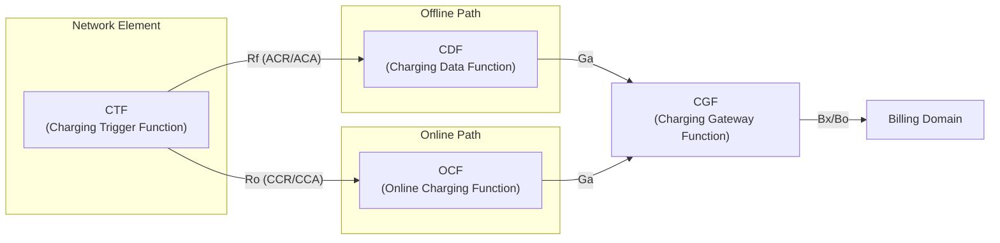
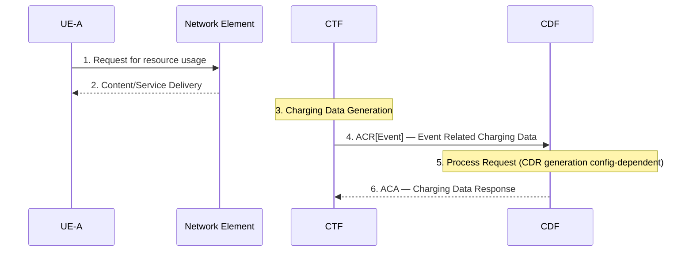
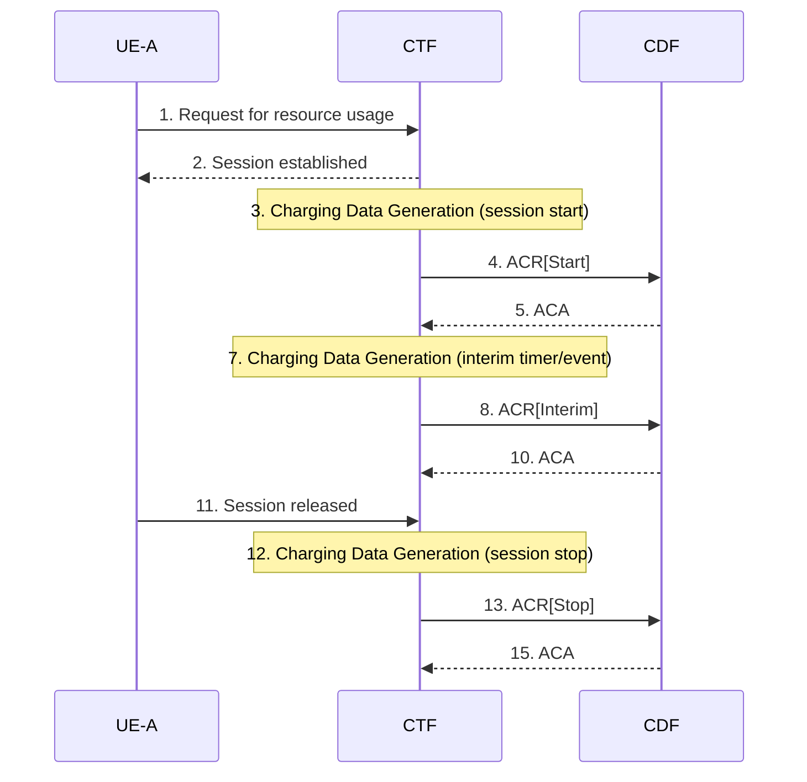
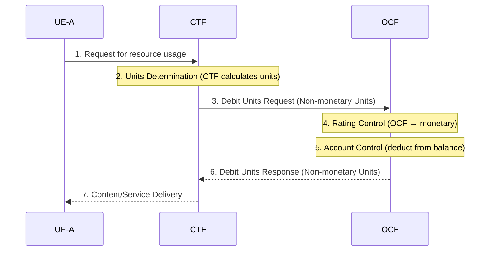
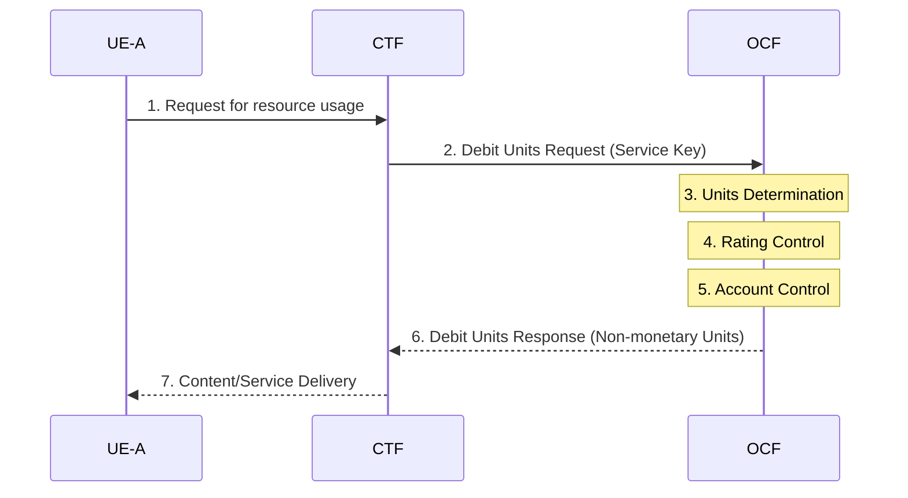
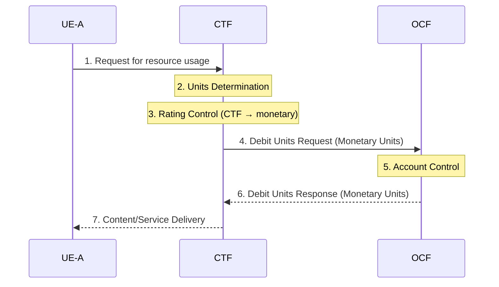
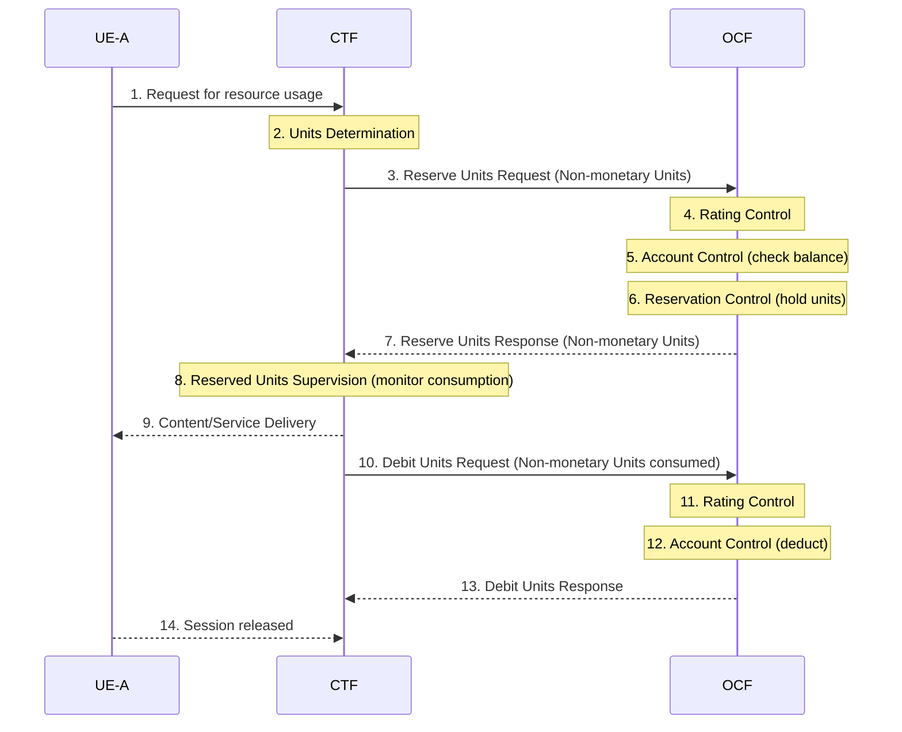
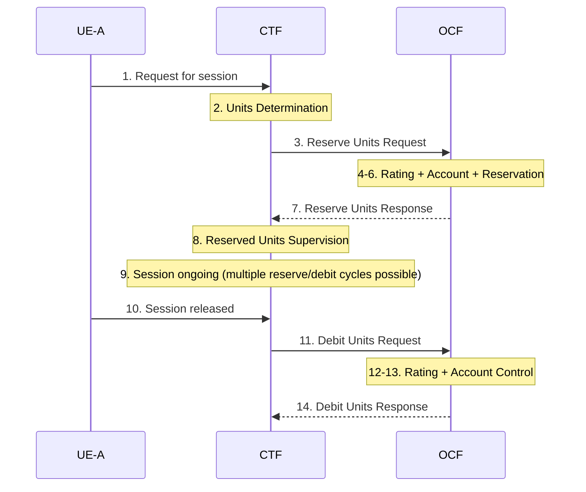

# 3GPP Charging Architecture — Offline and Online

Source: 3GPP TS 32.299 v16.2.0 (Release 16), §4–§5

---

## 1. Architecture Overview

3GPP charging has two orthogonal paths: **offline** (post-payment, record-keeping) and **online** (real-time credit control). Both paths originate at the same logical function in each network element.

### Logical Functions

| Function | Abbreviation | Role |
|---|---|---|
| Charging Trigger Function | CTF | Resides in each NE; detects chargeable events; sends charging data |
| Charging Data Function | CDF | Collects offline charging data from CTFs; constructs CDRs |
| Online Charging Function | OCF | Real-time credit/unit management for online charging |
| Charging Gateway Function | CGF | Aggregates CDRs from CDF/OCF; passes to Billing Domain |
| Billing Domain | BD | Post-processing, billing mediation |

### Reference Points

| Point | From → To | Purpose |
|---|---|---|
| **Rf** | CTF → CDF | Offline charging (Diameter Accounting) |
| **Ro** | CTF → OCF | Online charging (Diameter Credit-Control) |
| **Gy** | PCEF → OCS | Online charging for PS domain (Ro-based, roaming context) |
| **Gyn** | TDF → OCS | Online charging for TDF (Ro-based) |
| **Ga** | CDF/OCF → CGF | CDR transfer |
| **Bx** / **Bo** | CGF → Billing Domain | CDR delivery to billing system |

### Key Architectural Principles (§4.1.1)

- Each CTF has a **priority-ordered CDF/OCF address list**; if the primary charging function is unavailable, the CTF falls over to the secondary, etc.
- Within a Release, each NE sends charging information only to charging entities in the **same PLMN** — cross-PLMN charging is not done directly.
- **Single IMSI architecture** (EU roaming unbundling Regulation III): a specific Service-NE (Proxy Function) uses Ro to forward charging to an OCF in another network; details in TS 32.240 Annex B.
- For PS domain online charging in roaming: PCEF in VPLMN uses **Gy**, TDF uses **Gyn** (both Ro-based), sending to an OCS in the HPLMN (TS 32.251).
- Each CDF knows other CDFs' network addresses (configurable list) for Redirect-Request redundancy.

---

## 2. Offline Charging (§5.1)

### Scenarios

Two basic scenarios:

| Type | Trigger | ACR types used |
|---|---|---|
| **Event-based** | Single discrete event (e.g. SMS, MMS delivery) | ACR[Event] only |
| **Session-based** | Ongoing session (e.g. data bearer, IMS call) | ACR[Start] + ACR[Interim]* + ACR[Stop] |

*Interim triggered by timer expiry or significant session changes.

### Event-Based Charging Flow

### Session-Based Charging Flow

### Charging Data Request / Response (Logical Fields)

**Charging Data Request** (CTF → CDF):

| Field | Category | Description |
|---|---|---|
| Session Identifier | M | Identifies the operation session |
| Originator Host | M | Source NE identity and realm |
| Originator Domain | M | Realm of operation originator |
| Destination Domain | M | Realm of operation destination |
| Operation Type | M | Event / Start / Interim / Stop |
| Operation Number | M | Sequence number |
| Operation Identifier | Om | Unique operation ID |
| User Name | Oc | Service user identity |
| Service information | Om | Service-specific parameters (per middle-tier TS) |

**Charging Data Response** (CDF → CTF):

| Field | Category | Description |
|---|---|---|
| Session Identifier | M | Identifies the operation session |
| Operation Result | M | Result of the operation |
| Operation Type | M | Echoes the transfer type |
| Operation Number | M | Sequence number |
| Error Reporting Host | Oc | Identity of proxy that sent non-2001 result |

---

## 3. Online Charging (§5.2)

### Core Concepts

Online charging operates via the **Ro** reference point between CTF and OCF. Two sub-functions:

| Sub-function | Description | Where performed |
|---|---|---|
| **Unit Determination** | Calculates non-monetary units (time, volume, events) needed | CTF (decentralized) or OCF (centralized) |
| **Rating** | Converts non-monetary units to monetary cost | CTF (decentralized) or OCF (centralized) |

> **Note:** Centralized Unit Determination + Decentralized Rating is **not possible** (the combination is undefined).

### Three Online Charging Cases

| Case | Abbreviation | Reservation? | Debit timing | RFC 4006 mechanism |
|---|---|---|---|---|
| Immediate Event Charging | **IEC** | No | Immediate (before/during/after service) | Direct Debit One-Time Event (§6.3.3) |
| Event Charging with Unit Reservation | **ECUR** | Yes | After service delivery | Reserve + Debit Units |
| Session Charging with Unit Reservation | **SCUR** | Yes | After session (ongoing reservation) | Session-Based Credit-Control (§6.3.5) |

SCUR and ECUR use both **Debit Units** and **Reserve Units** operations; when both are needed in SCUR they are **combined in one message** (CCR with both used-unit and requested-unit containers).

For SCUR/ECUR: reserved units ≠ consumed units — CTF can modify the reservation during the session, including returning unused reserved units.

### IEC — Immediate Event Charging

Three variants depending on where rating/unit-determination resides:

#### IEC-a: Decentralized UD + Centralized Rating

#### IEC-b: Centralized UD + Centralized Rating

#### IEC-c: Decentralized UD + Decentralized Rating

### ECUR — Event Charging with Unit Reservation

Reserve before service; debit after. Shown for Decentralized UD + Centralized Rating:

### SCUR — Session Charging with Unit Reservation

Like ECUR but operates over a **session** with reservation maintained during session; multiple debit+reserve cycles possible while session is ongoing.

### Debit / Reserve Units Message Content (§5.2.3)

**Debit/Reserve Units Request** (CTF → OCF):

| Field | Category | Description |
|---|---|---|
| Session Identifier | M | Operation session ID |
| Originator Host/Domain | M | Source NE identity |
| Destination Domain | M | OCF realm |
| Operation Identifier | M | Unique operation ID |
| Operation Token | M | Service identifier |
| Operation Type | M | Event / Start / Interim / Stop |
| Operation Number | M | Sequence number |
| Subscriber Identifier | Om | MSISDN or fixed device identity |
| Multiple Unit Operation | Oc | Quota management parameters |
| Service Information | Om | Per-service parameters (middle-tier TS) |

**Debit/Reserve Units Response** (OCF → CTF):

| Field | Category | Description |
|---|---|---|
| Session Identifier | M | Operation session ID |
| Operation Result | M | Success / error code |
| Operation Type | M | Echoes request type |
| Multiple Unit Operation | Oc | Granted quota and quota management parameters |
| Low Balance Indication | Oc | Account balance fell below threshold |
| Remaining Balance | Oc | Current subscriber account balance |
| Operation Failure Action | Oc | What CTF should do if CCR sending is prevented (SCUR) |
| Operation Event Failure Action | Oc | What CTF should do if CCR sending is prevented (IEC) |

---

## 4. Other Online Charging Requirements (§5.3)

| Requirement | Description |
|---|---|
| **Re-authorization** | OCF sets idle timeout with quota; expiry or mid-session events trigger re-auth; CTF reports quota usage with reason code |
| **Threshold-based re-auth** | OCF can include remaining-quota threshold at which CTF shall trigger re-auth |
| **Termination action** | OCF specifies CTF behavior when last granted units are consumed (e.g. terminate, redirect) |
| **Account expiration** | OCF can provide account expiration date/time to CTF |

---

## 5. Offline vs. Online Comparison

| Dimension | Offline | Online |
|---|---|---|
| Interface | Rf (Diameter Accounting) | Ro (Diameter Credit-Control) |
| Protocol base | RFC 6733 Accounting | RFC 4006 Credit-Control |
| Timing | Post-event/post-session | Real-time (before/during service) |
| Server-side function | CDF | OCF |
| Messages | ACR/ACA | CCR/CCA |
| Service allowed? | Yes, unconditionally | Conditional on credit availability |
| Credit reservation | No | Yes (ECUR/SCUR) |
| Use case | Data bearer volume, IMS CDRs | Prepaid, real-time credit depletion |

---

## Related Pages

- [interfaces/reference-points.md](../interfaces/reference-points.md) — Rf, Ro reference point details
- [entities/PGW.md](../entities/PGW.md) — PCEF/CTF in PGW; Gy interface
- [entities/PCRF.md](../entities/PCRF.md) — Gx/Rx policy (interacts with charging on Gy)
- [entities/P-CSCF.md](../entities/P-CSCF.md) — IMS CTF; generates Rf charging records for IMS sessions
- [entities/S-CSCF.md](../entities/S-CSCF.md) — IMS CTF; charging at S-CSCF
