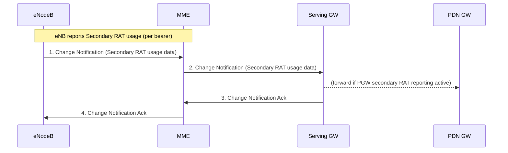
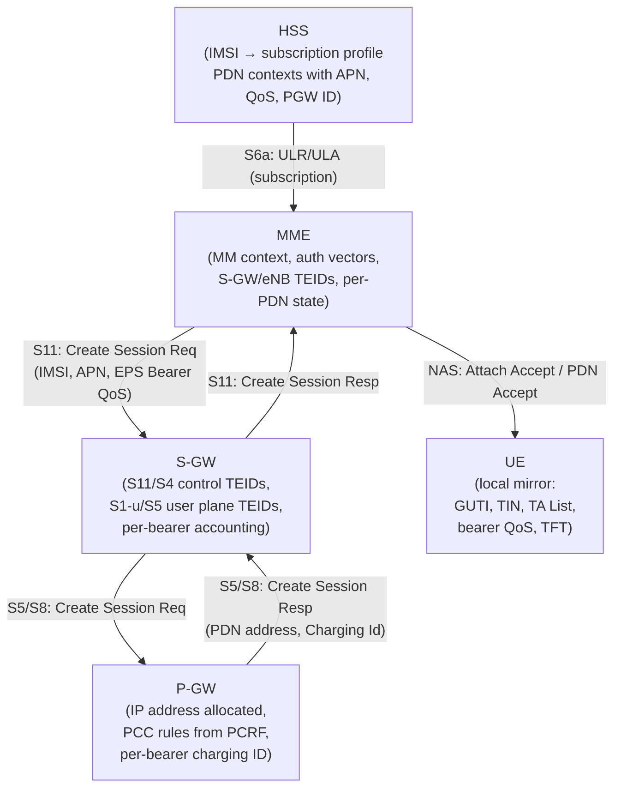

# EPC Information Storage — Per-Node Context Data Models

Normative source: 3GPP TS 23.401 §5.7 (Release 15).

Each EPC node maintains a well-defined set of context fields, structured in three tiers:
**UE-level** → **PDN connection-level** → **EPS bearer-level**. The tables below list the key
fields per node. Understanding what each node stores tells you which node can answer a given
signalling question and which fields flow in which GTP-C or S6a message.

---

## 5.7.1 HSS Data Model

IMSI is the primary key. Table below covers E-UTRAN stand-alone operation.

### UE-level subscription fields

| Field | Description |
|---|---|
| IMSI | Primary reference key |
| MSISDN | Basic MSISDN (optional presence) |
| IMEI / IMEISV | Stored when Automatic Device Detection is supported (TS 23.060) |
| External Identifier List | Identifiers used in external networks to reference this subscription (see TS 23.682) |
| MME Identity | Identity of the MME currently serving this UE |
| MME Capabilities | Capabilities of the serving MME w.r.t. core functionality / regional access restrictions |
| MS PS Purged from EPS | Indicates EMM and ESM contexts have been deleted from the MME |
| ODB parameters | Operator Determined Barring status |
| Access Restriction | Access technology restrictions; separate values for WB-E-UTRAN, NB-IoT, NR as secondary RAT, LAA, LWA/LWIP |
| EPS Subscribed Charging Characteristics | Charging type: normal, prepaid, flat-rate, hot billing |
| Subscribed-UE-AMBR | Max aggregated uplink/downlink MBRs across all Non-GBR bearers |
| APN-OI Replacement | Domain name replacing the APN OI when constructing PGW FQDN for DNS |
| RFSP Index | Index to RRM configuration in E-UTRAN |
| URRP-MME | UE Reachability Request Parameter — HSS has requested UE activity notification from MME |
| CSG Subscription Data | List of CSG IDs per PLMN with optional expiry dates; CSG ID for LIPA includes associated APNs |
| VPLMN LIPA Allowed | Per-PLMN LIPA permission |
| EPLMN list | Equivalent PLMN list for the UE's registered PLMN |
| Subscribed Periodic RAU/TAU Timer | Subscribed T3412 value |
| Extended idle mode DRX cycle length | eDRX subscription parameter |
| MPS CS priority | Priority service subscription (eMLPP / 1x RTT) |
| UE-SRVCC-Capability | Whether UE is UTRAN/GERAN SRVCC capable |
| MPS EPS priority | Mission-Critical PS subscription |
| UE Usage Type | Usage characteristics for Dedicated Core Networks (see §4.3.25) |
| Group ID-list | Subscribed group(s) the UE belongs to |
| Communication Patterns | Per-UE communication patterns and validity (TS 23.682); not provided to SGSN |
| Monitoring Event Information Data | Monitoring event configuration (TS 23.682) |
| PDN Connection Restriction | Whether PDN connection establishment is restricted |
| Enhanced Coverage Restricted | PLMN(s) with Enhanced Coverage restrictions |
| Acknowledgements of DL NAS data PDUs | Whether DL NAS data PDU ACK for CP CIoT is disabled (enabled by default) |
| Service Gap Time | Controls Service Gap timer (§4.3.17.9) |

### Per-PDN subscription context

One or more PDN subscription contexts per UE:

| Field | Description |
|---|---|
| Context Identifier | Index of PDN subscription context |
| PDN Address | Subscribed IP address(es) |
| PDN Type | IPv4, IPv6, IPv4v6, or Non-IP |
| APN-OI Replacement (per-APN) | Higher-priority than UE-level APN-OI Replacement; optional |
| Access Point Name (APN) | APN-NI label (Note: may be wildcard, see §5.7.6) |
| Invoke SCEF Selection | Whether this APN is used for PDN connection to SCEF |
| SCEF ID | FQDN or IP address of the SCEF for this APN |
| SIPTO permissions | Traffic offload permission: prohibited / allowed excluding local / allowed including local / local only |
| LIPA permissions | Local IP Access permission: LIPA-prohibited / LIPA-only / LIPA-conditional |
| WLAN offloadability | Whether traffic may be offloaded to WLAN per RAT (E-UTRA and UTRA separate) |
| EPS subscribed QoS profile | Bearer-level QoS (QCI + ARP) for the APN's default bearer (§4.7.3) |
| Subscribed-APN-AMBR | Max aggregated UL/DL MBRs across Non-GBR bearers on this APN |
| EPS PDN Subscribed Charging Characteristics | Charging type for this PDN context |
| VPLMN Address Allowed | Whether UE may use PGW in HPLMN only or also VPLMN domain |
| PDN GW identity | FQDN or IP address of the PGW for this APN |
| PDN GW Allocation Type | Static (not changed during selection) or Dynamic |
| PDN continuity at inter RAT mobility | Behaviour when UE moves broadband↔narrowband: maintain / reactivate / disconnect / VPLMN policy |
| PLMN of PDN GW | PLMN where the dynamically selected PGW is located |
| Homogenous Support of IMS Voice over PS Sessions for MME | Per UE/MME indication for IMS Voice over PS support |
| APN-P-GW relation (wildcard) | APN↔PGW identity for PDN subscriptions with wildcard APN |

### Wild Card APN rules (§5.7.6)

- Only **one** wildcard APN context per subscription (TS 23.003 §9).
- The PDN subscription context marked as default **shall not** contain a wildcard APN.
- A wildcard APN subscription context **shall not** contain a statically allocated PGW.
- When a PGW ID is registered for a non-subscribed APN, HSS/MME/S4-SGSN store the PDN GW ID – APN relation. When deregistered, the relation is deleted.
- LIPA-only or LIPA-conditional permission is inconsistent with SIPTO-allowed; these flags must be set consistently.

---

## 5.7.2 MME Context Data Model

The MME maintains MM context and EPS bearer context for UEs in ECM-IDLE, ECM-CONNECTED, and EMM-DEREGISTERED.

### UE/MM-level fields

| Field | Description |
|---|---|
| IMSI | Subscriber permanent identity |
| IMSI-unauthenticated-indicator | Set if IMSI is unauthenticated |
| MSISDN | From HSS storage |
| MM State | ECM-IDLE / ECM-CONNECTED / EMM-DEREGISTERED |
| GUTI | Globally Unique Temporary Identity |
| ME Identity | IMEI/IMEISV |
| Tracking Area List | Current TA list assigned to UE |
| TAI of last TAU | TAI where last TAU was initiated |
| E-UTRAN Cell Global Identity | Last known ECGI |
| E-UTRAN Cell Identity Age | Elapsed time since last ECGI was acquired |
| CSG ID / CSG membership / Access mode | Last known CSG state |
| Authentication Vector | EPS AV: {RAND, XRES, K_ASME, AUTN} |
| UE Radio Access Capability | WB-E-UTRAN capabilities (not NB-IoT) |
| LTE-M Indication | UE is LTE Cat-M1 or Cat-M2 |
| NB-IoT specific UE Radio Access Capability | NB-IoT radio access capabilities |
| MS Classmark 2 / 3 | GERAN/UTRAN classmark (for SRVCC) |
| Supported Codecs | CS domain codecs (for SRVCC to GERAN/UTRAN) |
| UE Network Capability | Security algorithms and key derivation functions |
| MS Network Capability | For GERAN/UTRAN capable UEs |
| UE Specific DRX Parameters | A/Gb, Iu, S1-mode DRX parameters |
| Active Time value for PSM | UE Active Time for power saving mode |
| Extended idle mode DRX parameters | Negotiated eDRX parameters for S1-mode |
| Selected NAS Algorithm | Active NAS security algorithm |
| eKSI | Key Set Identifier for K_ASME; indicates UTRAN or E-UTRAN security association |
| K_ASME | Main key for E-UTRAN key hierarchy |
| NAS Keys and COUNT | K_NASint, K_NASenc, NAS COUNT |
| Selected CN operator id | Core network operator identity (network sharing, TS 23.251) |
| Recovery | Indicates HSS is performing database recovery |
| Access Restriction | WB-E-UTRAN and NB-IoT are separate RATs; NR secondary RAT, LAA, LWA/LWIP restrictions |
| ODB for PS parameters | Operator Determined Barring for PS services |
| APN-OI Replacement | DNS construction domain replacement for all APNs |
| MME IP address / TEID for S11 | MME endpoint for S11 interface |
| S-GW IP address / TEID for S11/S4 | S-GW control plane endpoint |
| SGSN IP address / TEID for S3 | SGSN endpoint (ISR activated) |
| eNodeB Address for S1-MME | Serving eNB IP address |
| eNB UE S1AP ID / MME UE S1AP ID | UE identifiers within eNB and MME |
| Subscribed UE-AMBR | From HSS subscription |
| UE-AMBR | Currently enforced value |
| Subscribed RFSP Index | From HSS |
| RFSP Index in Use | Currently active RRM index |
| URRP-MME | HSS has requested UE reachability notification |
| DL Data Buffer Expiration Time | When SGW buffering will expire (PSM/eDRX UEs) |
| Suggested number of buffered DL packets | Optional hint for extended buffering |
| Voice Support Match Indicator | UE radio capability compatible with network voice configuration |
| Homogenous Support of IMS Voice over PS Sessions | Per-UE IMS Voice support indicator (all TAs) |
| UE Radio Capability for Paging Information | Used to enhance paging toward UE (§5.11.4) |
| Information on Recommended Cells and ENBs for Paging | From eNB; helps optimise paging cells |
| Paging Attempt Count | Optimises signalling load for paging |
| Information for Enhanced Coverage | EC level and cell ID from last eNB |
| CE mode B Support Indicator | Received from eNB |
| MPS CS/EPS priority | Priority service subscriptions |
| CSG Subscription Data | CSG IDs for visiting PLMN and equivalent PLMNs |
| LIPA Allowed | UE LIPA permission in this PLMN |
| UE Usage Type | Dedicated Core Network usage |
| Delay Tolerant Connection | PGW supports holding procedure for PSM UEs |
| Service Gap Time | Service Gap timer value |
| List of APN Rate Control Statuses | Per-APN rate control status |

### Per-active-PDN-connection fields (MME)

| Field | Description |
|---|---|
| APN in Use | APN-NI + default APN Operator Identifier (TS 23.003 §9.1.2) |
| APN Restriction | Restriction on combination of APN types for this bearer context |
| PDN Type | IPv4, IPv6, IPv4v6, or Non-IP |
| IP Address(es) | IPv4 address and/or IPv6 prefix |
| PDN GW Address in Use (control plane) | IP address of PGW for control plane signalling |
| PDN GW TEID for S5/S8 (control plane) | GTP-based S5/S8 only |
| MS Info Change Reporting Action | Whether to report ECGI/eNB/TAI changes to PGW |
| CSG Information Reporting Action | Whether to report User CSG Information changes |
| Presence Reporting Area Action | PRA identifiers and element lists |
| EPS subscribed QoS profile | Default bearer QCI + ARP |
| Subscribed APN-AMBR | From subscription |
| APN-AMBR | Currently enforced by PGW |
| Default bearer | EPS Bearer Id of the default bearer |
| PDN continuity at inter RAT mobility | Broadband↔narrowband PDN handling policy |
| SIPTO permissions, LIPA permissions, WLAN offloadability | Per-PDN access/offload flags |

### Per-bearer fields (MME)

| Field | Description |
|---|---|
| EPS Bearer ID | EPS bearer identity (uniquely identifies bearer for UE) |
| TI | Transaction Identifier |
| S-GW IP/TEID for S1-u / S11-u | S-GW user plane / CP CIoT endpoint |
| PDN GW TEID/IP for S5/S8 (user plane) | Needed for S-GW relocation during TAU without interacting with source S-GW |
| EPS Bearer QoS | QCI + ARP; optionally GBR + MBR for GBR bearers |
| TFT | Traffic Flow Template (PMIP-based S5/S8 only) |
| Serving PLMN-Rate-Control | Max NAS Data PDUs per deci-hour for CP CIoT |

### MME Emergency Configuration Data (Table 5.7.2-2)

Used instead of HSS subscription data for emergency bearer services:

| Field | Description |
|---|---|
| Emergency Access Point Name | em-APN; wildcard not allowed |
| Emergency QoS profile | QCI + emergency-reserved ARP |
| Emergency APN-AMBR | From PGW |
| Emergency PDN GW identity | Statically configured; FQDN or IP |
| Non-3GPP HO Emergency PDN GW identity | For PLMN supporting non-3GPP handover |

---

## 5.7.3 Serving GW Context Data Model

### UE-level fields (S-GW)

| Field | Description |
|---|---|
| IMSI / IMSI-unauthenticated-indicator | Subscriber identity |
| ME Identity, MSISDN | From MME/S4 |
| Selected CN operator id | Network sharing support |
| LTE-M Indication | Differentiates LTE-M traffic for charging |
| MME TEID/IP for S11 | MME control plane endpoint |
| S-GW TEID/IP for S11/S4 (control plane) | S-GW control plane TEID |
| SGSN IP/TEID for S4 (control plane) | ISR support |
| Last known Cell Id / age | UE's last known location |
| DL Data Buffer Expiration Time | When MME requested extended DL buffering expires (PSM) |
| Serving PLMN-Rate-Control | For CDR processing (abusive UE detection) |

### Per-PDN connection (S-GW)

| Field | Description |
|---|---|
| APN in Use | From MME or S4-SGSN |
| PDN Type | IPv4, IPv6, IPv4v6, Non-IP — needed for Paging Policy Differentiation |
| EPS PDN Charging Characteristics | Normal, prepaid, flat-rate, hot |
| P-GW Address in Use (control/user plane) | PGW endpoints |
| P-GW TEID for S5/S8 (control plane) | GTP-based only |
| S-GW IP/TEID for S5/S8 (control/user plane) | S-GW's own S5/S8 endpoints |
| Default Bearer | EPS Bearer Id of default bearer |
| Serving PLMN-Rate-Control | Per PDN connection rate control |
| 3GPP PS Data Off Status | Current PS Data Off status |

### Per-bearer (S-GW)

| Field | Description |
|---|---|
| EPS Bearer Id / TFT | Bearer identity and traffic classification |
| P-GW and S-GW addresses/TEIDs for S5/S8 | Full GTP-U tunnel context |
| S-GW IP address for S1-u/S12/S4/S11-u | Per-RAT user plane address |
| S-GW TEID for S1-u/S12/S4/S11-u | Per-RAT TEIDs |
| eNodeB IP/TEID for S1-u | Downlink path to serving eNB |
| RNC IP/TEID for S12 | UTRAN user plane (ISR) |
| SGSN IP/TEID for S4 user plane | GERAN/UTRAN support |
| EPS Bearer QoS | ARP, GBR, MBR, QCI |
| Charging Id | Identifies charging records; correlates S-GW and PGW CDRs |

---

## 5.7.4 PDN GW Context Data Model

### UE-level fields (P-GW)

| Field | Description |
|---|---|
| IMSI, IMSI-unauthenticated-indicator | Subscriber identity (IMEI for unauthenticated emergency UE) |
| ME Identity, MSISDN | From S-GW |
| Selected CN operator id | Network sharing |
| RAT type | Current RAT — enables NB-IoT/LTE-M/WB-E-UTRAN differentiation for PCC |
| LTE-M Indication | Category M UE differentiation |

### Per-APN in use (P-GW)

| Field | Description |
|---|---|
| APN in Use | From S-GW |
| APN AMBR | Max aggregated UL/DL MBRs for Non-GBR bearers for this APN |
| APN Rate Control | Max uplink/downlink packets + exception report packets per time unit; whether Exception Reports may still be sent at limit |

### Per-PDN connection within APN (P-GW)

| Field | Description |
|---|---|
| IP Address(es) | IPv4 address and/or IPv6 prefix |
| PDN Type | IPv4, IPv6, IPv4v6, Non-IP |
| S-GW Address in Use (control/user plane) | S-GW endpoints |
| S-GW TEID for S5/S8 (control plane) | GTP-based only |
| P-GW IP/TEID for S5/S8 (control plane) | P-GW's own control plane endpoint |
| S-GW GRE Key for downlink (PMIP) | PMIP-based S5/S8 user plane |
| MS Info Change Reporting support indication | MME/SGSN supports location reporting |
| MS Info Change Reporting Action | Active reporting instruction |
| CSG Information Reporting Action | Active CSG reporting instruction |
| Presence Reporting Area Action | Active PRA reporting with element lists |
| BCM | Bearer Control Mode — GERAN/UTRAN only |
| Default Bearer | EPS Bearer Id of default bearer |
| EPS PDN Charging Characteristics | Charging type for this PDN connection |
| Serving PLMN-Rate-Control | Max UL/DL messages per time unit per PDN connection |
| 3GPP PS Data Off Status | Active PS Data Off status |

### Per-EPS bearer (P-GW)

| Field | Description |
|---|---|
| EPS Bearer Id / TFT | Bearer identity and classification |
| S-GW and P-GW addresses/TEIDs for S5/S8 | Full GTP-U tunnel endpoints |
| EPS Bearer QoS | ARP, GBR, MBR, QCI |
| Charging Id | Correlates with S-GW and PGW CDRs |

---

## 5.7.5 UE Context Data Model

The UE maintains a local context mirror. GERAN/UTRAN capable UEs additionally maintain context as described in TS 23.060.

### UE-level fields

| Field | Description |
|---|---|
| IMSI | Subscriber permanent identity |
| EMM State | EMM-REGISTERED / EMM-DEREGISTERED |
| GUTI | Temporary identity |
| ME Identity | IMEI/IMEISV |
| Tracking Area List | Current TA list |
| last visited TAI | TAI identifying last visited TA |
| Selected NAS/AS Algorithm | Active security algorithms |
| eKSI / K_ASME / NAS Keys and COUNT | Security material |
| TIN | Temporary Identity used in Next update (controls GUTI vs P-TMSI at next TAU/RAU) |
| UE Specific DRX Parameters | Preferred E-UTRAN DRX cycle |
| Active Time value for PSM | From MME |
| Extended idle mode DRX parameters | From MME |
| Allowed CSG list | User + operator controlled CSG ID list |
| Operator CSG list | Exclusively operator controlled |
| Service Gap Time | Service Gap timer |

### Per-active-PDN-connection (UE)

| Field | Description |
|---|---|
| APN in Use | APN-NI + default APN Operator Identifier |
| APN AMBR | Max aggregated UL/DL MBRs for Non-GBR bearers |
| Assigned PDN Type | Network-assigned (IPv4, IPv6, IPv4v6, Non-IP) |
| IP Address(es) | IPv4 and/or IPv6 prefix |
| Header Compression Configuration | ROHC configuration for CP CIoT |
| Default Bearer | EPS Bearer Id of default bearer |
| WLAN offloadability | Per-RAT offload indication |
| APN Rate Control | Max uplink packets + exception report packets per time unit |
| Serving PLMN-Rate-Control | Max NAS Data PDUs per deci-hour (CP CIoT uplink) |

### Per-EPS bearer (UE)

| Field | Description |
|---|---|
| EPS Bearer ID / TI | Bearer identity and transaction identifier |
| EPS Bearer QoS | GBR and MBR for GBR bearer |
| TFT | Traffic Flow Template |

---

## 5.7A Charging

### General principles (§5.7A.1)

- [SGW](../entities/SGW.md) collects per-UE accounting: UL and DL data volumes categorised by **QCI and ARP** pair, per PDN connection.
  For GTP-based S5/S8: accounting is **per bearer**.
  For PMIP-based S5/S8: accounting is **per PDN connection**.
- SGW does **not** count packets being processed solely for indirect forwarding.
- [PGW](../entities/PGW.md) collects per-UE accounting per PDN connection; can be temporarily paused (§5.3.6A).
- **Charging Id** generated by PGW per bearer (GTP) or per PDN connection (PMIP); uniquely assigned within PGW.
- Charging Characteristics flow from SGW to PGW via GTP-S5/S8 or PMIP; handling defined in TS 32.251.
- CSG charging: User CSG Information (CSG ID, access mode, CSG membership) transferred to PGW; PGW sets CSG Information Reporting Action accordingly.
- To enable NB-IoT / LTE-M differentiation: eNB informs MME of RAT Type and TAC in S1 SETUP REQUEST and ENB CONFIGURATION UPDATE.

### Secondary RAT Usage Data Reporting (§5.7A.2–5.7A.4)

Secondary RAT = NR (5G NR radio aggregated with LTE) or Unlicensed Spectrum (LAA/LWA/LWIP).

Reporting principles:
- Activated per PLMN via E-UTRAN O&M; separate activation for NR and Unlicensed Spectrum.
- Reported on a **per EPS bearer basis** and per time interval.
- Triggered at: X2 handover, S1 handover, S1 Release, Connection Suspend, EPS Bearer Deactivation.
- Partial CDR support: eNB may report periodically (minimum time interval configured).

Two flows:
- **Fig 5.7A.3-1**: eNB → MME only (RAN Usage Data Report message) — used when PGW secondary RAT usage reporting is not active, or as handover flag carrier.
- **Fig 5.7A.3-2**: eNB → MME → SGW → PGW (Change Notification chain) — when PGW secondary RAT reporting is active.

---

## Key Cross-Node Relationships

The MME is the central orchestrator: it drives the Create Session Request chain at attach and PDN connectivity, stores the full bearer context (TEIDs at all three legs: S11, S1-u, and S5/S8 user plane), and enforces Maximum APN Restriction across all active PDN connections.
