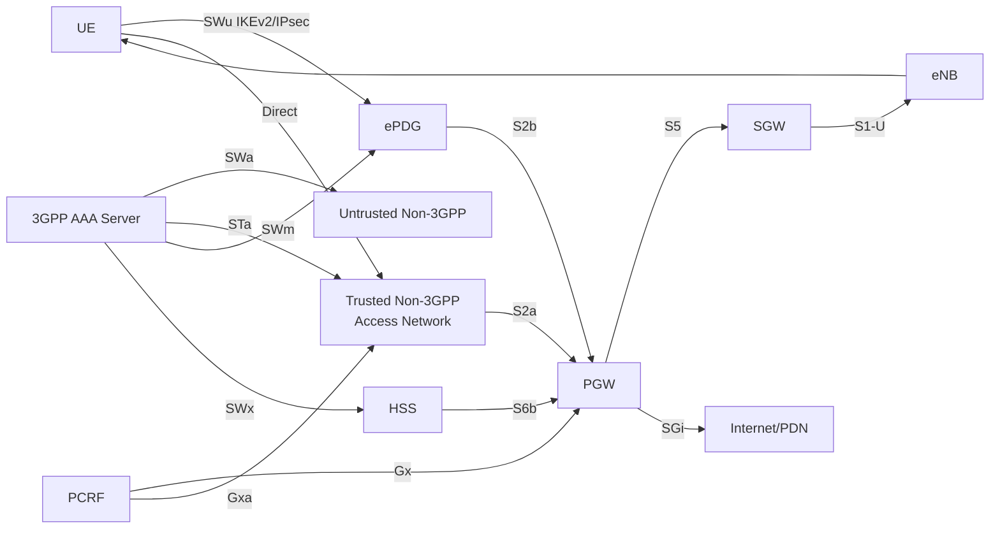
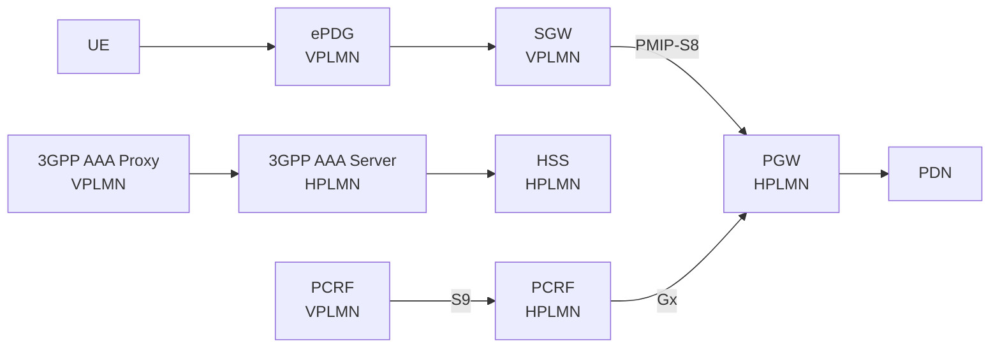
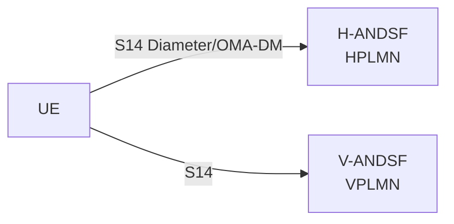
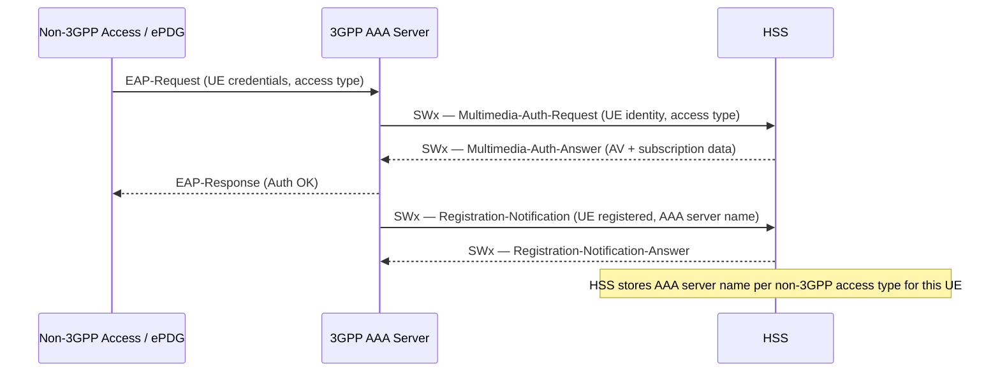

# Non-3GPP Access Architecture

**Spec reference:** 3GPP TS 23.402 §4 (v15.3.0)

Related pages: [ePDG](../entities/ePDG.md) · [PGW](../entities/PGW.md) · [SGW](../entities/SGW.md) ·
[PCRF](../entities/PCRF.md) · [HSS](../entities/HSS.md) ·
[IMS Reference Points](../interfaces/IMS-reference-points.md) ·
[EPC Reference Points](../interfaces/reference-points.md)

---

## Overview (§4.1.1)

TS 23.402 defines how UEs attach to the EPC via **non-3GPP accesses** — primarily
WLAN/WiFi, but also WiMAX and other IP-based radio access technologies. Two key
architectural modes exist:

- **Trusted Non-3GPP Access**: access network is deemed trustworthy; UE connects via
  [S2a](../interfaces/reference-points.md) directly to PGW (no ePDG)
- **Untrusted Non-3GPP Access**: access network is not trusted; UE must tunnel through
  [ePDG](../entities/ePDG.md) via [S2b](../interfaces/reference-points.md) to PGW

Trust is **not a property of the access technology** — it is a policy decision by the
HPLMN operator (non-roaming) or the HSS/AAA server (roaming). The same physical WLAN
network could be trusted for one operator and untrusted for another.

> **Key constraint (§4.3.1.2):** All PDN connections made via a single access share the
> same trust classification — you cannot have some PDNs trusted and others untrusted
> through the same access simultaneously.

---

## Trusted vs Untrusted Detection (§4.1.4)

Two mechanisms for determining access trust classification:

1. **EAP-based access authentication (3GPP-based credentials)**: authentication result
   conveys the trust relationship to the UE implicitly
2. **Pre-configured policy in UE**: UE has local configuration identifying specific
   access networks as trusted or untrusted (e.g., via ANDSF or USIM)

---

## IP Mobility Management Selection (IPMS) (§4.1.3)

IPMS determines which IP mobility protocol to use for a given PDN connection. It is
performed at **initial attach** to a non-3GPP access or ePDG and is **separate** from
the PMIP vs GTP selection used on S5/S8.

### Mobility Models

| Model | Protocol | Who manages binding | Interface |
|---|---|---|---|
| **Network-Based Mobility (NBM)** | PMIPv6 | Network (TWAN/ePDG acts as MAG, PGW as LMA) | S2a, S2b |
| **Host-Based Mobility (HBM)** | DSMIPv6 | UE (UE is MN, PGW is HA) | S2c |
| **Host-Based Mobility (HBM)** | MIPv4 FACoA | UE | S2a (trusted only) |

The final IPMS decision is made by the **HSS/AAA server**. The UE indicates its
capabilities; the network overrides if needed.

### IPMS at Initial Attach (§4.1.3.2.1)

| Scenario | UE indicates | IPMS result |
|---|---|---|
| DSMIPv6-only UE | DSMIPv6 capability | HBM via DSMIPv6 (S2c) |
| MIPv4-only UE | MIPv4 FACoA capability | HBM via MIPv4 (S2a trusted) |
| Neither DSMIPv6 nor MIPv4 indicated | — | NBM assumed |
| No mobility capability indicated | — | Assume no HBM; use NBM (S2a/S2b) |

### IPMS on Handover Between Accesses (§4.1.3.2.3)

Six handover cases (a–f) defined for transitions between:
- Non-3GPP ↔ 3GPP
- Trusted ↔ Untrusted non-3GPP
- Same or different PLMN

In each case: IPMS ensures continuity of IP address assignment and PDN connection
by reusing the same PGW (for NBM, the PGW acts as anchor; for HBM, the HA at PGW
maintains binding).

---

## Non-Seamless WLAN Offload (§4.1.5)

A distinct mode where the UE routes IP flows via WLAN **without EPC involvement**:

- UE uses a **local IP address** assigned by the WLAN network (not PGW)
- No IP address preservation — session continuity not maintained on mobility
- **ePDG is not required** — traffic goes directly to internet from WLAN
- Governed by ANDSF traffic steering policies or UE local policy
- Used for non-voice data offload to reduce EPC load

> Non-seamless offload is independent of the S2a/S2b/S2c mobility model — it bypasses
> the EPC entirely.

---

## Architecture Reference Models (§4.2)

### Non-Roaming — S5 + S2a/S2b (§4.2.1)



### Non-Roaming — S2c / DSMIPv6 (§4.2.1)

UE runs DSMIPv6 directly to PGW (acting as HA). No ePDG in path. UE manages its own
Home Address binding via IKEv2 + DSMIPv6 on SWu, then directly on S2c.

### Roaming — Home-Routed (§4.2.2)



The SGW in VPLMN acts as a **local non-3GPP anchor** — it terminates S2a/S2b from
ePDG/TWAN and connects to HPLMN PGW via PMIP-S8.

### Roaming — Local Breakout (§4.2.3)

PGW is in VPLMN. Gx goes to vPCRF; vPCRF uses S9 to hPCRF. PGW SGi traffic exits
locally in visited network.

---

## Reference Points Summary (§4.4.1)

| Interface | Between | Protocol | Purpose |
|---|---|---|---|
| **S2a** | Trusted Non-3GPP ↔ PGW | PMIPv6, GTP, MIPv4 FACoA | Mobility and user plane |
| **S2b** | ePDG ↔ PGW | PMIPv6, GTP | Mobility and user plane (untrusted) |
| **S2c** | UE ↔ PGW | DSMIPv6 | Host-based mobility (UE-managed) |
| **SWu** | UE ↔ ePDG | IKEv2 / IPsec | Tunnel establishment, EAP auth |
| **SWa** | Untrusted Non-3GPP ↔ AAA | Diameter (EAP) | Access authentication/authorization |
| **STa** | Trusted Non-3GPP ↔ AAA | Diameter (EAP) | Access authentication/authorization |
| **SWm** | ePDG ↔ AAA | Diameter | ePDG authorization, PDN GW selection |
| **SWx** | AAA ↔ HSS | Diameter | Subscription data retrieval |
| **SWd** | AAA Proxy (VPLMN) ↔ AAA Server (HPLMN) | Diameter | Roaming AAA relay |
| **SWn** | Untrusted Non-3GPP ↔ ePDG | IP | Transport for UE-ePDG IKEv2 |
| **S6b** | PGW ↔ AAA | Diameter | PDN GW authorization, mobility signaling |
| **Gxa** | Trusted Non-3GPP ↔ PCRF | Diameter | Policy for trusted non-3GPP bearer |
| **Gxb** | ePDG ↔ PCRF | Diameter | Policy for untrusted non-3GPP _(not specified this Release)_ |
| **Gxc** | SGW ↔ PCRF | Diameter | Policy for SGW as local non-3GPP anchor |
| **S9** | vPCRF ↔ hPCRF | Diameter | Home/visited PCRF policy coordination |
| **PMIP-S8** | SGW (VPLMN) ↔ PGW (HPLMN) | PMIPv6 | Roaming S8 with PMIPv6 |
| **SGi** | PGW ↔ Internet/PDN | IP | External PDN interface |

---

## PDN GW Selection for Non-3GPP (§4.5)

### S2a / S2b Selection (§4.5.1)

1. **Initial attach**: ePDG/TWAN queries 3GPP AAA Server (or Proxy in roaming); AAA
   returns PGW identity (FQDN or IP address) + APN + visited PLMN indication
2. **Mobility / handover**: HSS provides already-assigned PGW address to ePDG/TWAN,
   ensuring same PGW is reused for IP address continuity
3. **Protocol type**: DNS NAPTR records may differentiate PMIP vs GTP capable PGWs

ePDG/TWAN may be pre-configured with S2b/S2a protocol variants, or retrieve via DNS.

### S2c Selection (§4.5.2)

UE discovers the HA address (= PGW in DSMIPv6 mode) via:
- PCO (from DHCP/IP config)
- IKEv2 Configuration Payload
- DHCP
- DNS

### ePDG Selection (§4.5.4)

1. **UE constructs FQDN** using one of:
   - **Operator Identifier FQDN**: `epdg.epc.mnc<MNC>.mcc<MCC>.pub.3gppnetwork.org`
   - **Tracking/Location Area Identity FQDN**: encodes TAI/LAI for location-based selection
2. **DNS resolution** returns ePDG address(es)
3. Configurable via **H-ANDSF** (Home-ANDSF policy server) or **USIM**
4. **Single ePDG per UE** — all PDN connections from a UE use the same ePDG instance

### S-GW Selection for Non-3GPP (§4.5.3)

Only applicable for **S8-S2a/b chaining** (roaming, SGW in VPLMN as local anchor).
Selection performed by **3GPP AAA Proxy** (not by MME as in 3GPP access).

---

## Node Roles in Non-3GPP Architecture

| Node | Role in Non-3GPP Context |
|---|---|
| [ePDG](../entities/ePDG.md) | Untrusted access gateway; IKEv2/IPsec termination; MAG for S2b PMIPv6 |
| [PGW](../entities/PGW.md) | LMA for S2a/S2b PMIPv6; DSMIPv6 HA for S2c; MIPv4 HA for S2a |
| [SGW](../entities/SGW.md) | Local non-3GPP anchor in VPLMN for roaming; MAG for PMIP-S8 chaining |
| [HSS](../entities/HSS.md) | Subscription + IPMS policy; provides PGW identity on handover |
| 3GPP AAA Server | Access authentication (SWa/STa/SWm); PDN GW selection; IPMS decision |
| 3GPP AAA Proxy | VPLMN relay to HPLMN AAA (SWd); S-GW selection for S8-S2a/b |
| [PCRF](../entities/PCRF.md) | hPCRF: Gx+Gxa+Gxc; vPCRF: Gxa+Gxb+Gxc+S9 |

---

## Identities for Non-3GPP Access (§4.6)

### User Identification — NAI (§4.6.1)

Non-3GPP access uses **NAI (Network Access Identifier, RFC 4282)** for identification:

- Username part of NAI is based on **IMSI** (from USIM)
- For emergency attach where IMSI is unavailable: **IMEI** used as username
- NAI used on S2b GTP interface to identify the UE at PGW
- Roaming scenarios use decorated NAI to route to home network

### EPS Bearer ID on GTP S2b/S2a (§4.6.2)

On GTP-based S2b/S2a, **EPS Bearer IDs** are allocated independently from S5/S8:

- S2b bearer ID: allocated by ePDG (not visible to UE)
- S2a bearer ID: allocated by TWAN (not visible to UE)
- Bearer IDs on S2a/S2b may **overlap in value** with S5/S8 bearer IDs — they are independent namespaces
- In MAPCON (simultaneous 3GPP + non-3GPP PDN connections), overlapping bearer IDs designate distinct traffic flow aggregates

---

## IP Address Allocation (§4.7)

### Untrusted Non-3GPP Access via S2b (§4.7.3)

Two distinct IP addresses are allocated when using untrusted access:

| Address | Source | Purpose |
|---|---|---|
| **UE local IP** (outer) | Untrusted non-3GPP access network | Source address of IPsec tunnel to ePDG (SWu outer header) |
| **PDN IP(s)** (inner) | PGW | UE's actual EPC address; delivered by ePDG via IKEv2 Config Payload |

The ePDG is responsible for delivering PDN IP address(es) to the UE. The ePDG may also receive a static IP address from HSS/AAA during authentication to pass to PGW.

### S2c / DSMIPv6 Address Allocation (§4.7.4)

- **Care-of Address (CoA)**: allocated by ePDG or from access network; used as outer address
- **Home Network Prefix + Home Address (HoA)**: negotiated during IKEv2/DSMIPv6 setup; HNP from PGW; UE constructs HoA from HNP via autoconfiguration
- **IPv4 HoA**: UE may request IPv4 HoA via DSMIPv6 signaling (RFC 5555)

### IPv6 Prefix Delegation (§4.7.5–4.7.6)

- **S2c**: UE as Mobile Router may request delegated prefixes via DHCPv6 PD (RFC 6276) — used for tethering
- **PMIP S5/S8**: Serving GW as DHCPv6 relay; PGW as DHCPv6 server; prefixes carried in PBU/PBA (DMNP option per RFC 7148)

---

## ANDSF — Access Network Discovery and Selection Function (§4.8)

ANDSF provides operator-controlled policies that direct UE selection and routing between
3GPP and non-3GPP (WLAN) accesses.

### Architecture



- **H-ANDSF**: Home ANDSF; provides ISMP/ISRP/IARP/WLANSP rules; takes precedence over V-ANDSF
- **V-ANDSF**: Visited ANDSF; provides rules valid only in VPLMN; cannot provide IARP
- ANDSF is **optional** — UE may not interact with ANDSF at all
- Push (ANDSF-initiated) and Pull (UE-initiated) modes; S14 secured per TS 33.402

### Policy Types

| Policy | Abbreviation | Applies When | Function |
|---|---|---|---|
| **Inter-System Mobility Policy** | ISMP | Single-radio UE (cannot simultaneously use WLAN + LTE) | Selects which access to use for EPC; prioritized access list |
| **Inter-System Routing Policy** | ISRP | Multi-radio UE (IFOM/MAPCON capable) | Routes IP flows across multiple active accesses |
| **Inter-APN Routing Policy** | IARP | Multi-radio UE | Controls per-APN and non-seamless WLAN offload routing |
| **WLAN Selection Policy** | WLANSP | Any UE with WLAN | Selects which WLAN access network to connect to |

### WLANSP Selection Criteria (§4.8.2.1.6)

Each WLANSP rule contains prioritized groups of WLAN attributes:
- HS2.0 Rel-2 attributes: `PreferredRoamingPartnerList`, `MinimumBackhaulThreshold`, `MaximumBSSLoad`
- Additional: `PreferredSSIDList`, `HomeNetwork` flag (filters to networks interworking with HPLMN)

### WLAN Selection Procedure (§4.8.2b)

Three-step procedure:
1. UE constructs prioritized list of available WLANs matching WLANSP criteria
2. UE selects from list considering S2a connectivity preference and Home Network Preferences
3. UE constructs NAI for 3GPP-based authentication over selected WLAN

### Co-existence with RAN Rules (§4.8.6–4.8.8)

- RAN may provide ANDSF-like thresholds: 3GPP/WLAN signal levels, OPI (Offload Preference Indicator) bitmap
- ANDSF rules take precedence when UE has valid ISRP from HPLMN
- **LWA** (LTE-WLAN Aggregation) and **LWIP** (WLAN via IPsec) defined in TS 36.300 also interact with ANDSF; co-existence rules in §4.8.7

---

## Authentication and Security (§4.9)

### Access Authentication (§4.9.1)

- Executed over SWa (untrusted) or STa (trusted) reference points
- Based on **EAP (Extensible Authentication Protocol)** per RFC 3748
- Authentication signaling is transport-independent (not tied to access technology)
- Detailed procedure in TS 33.402

### Tunnel Authentication (§4.9.2)

- Applies only to **untrusted non-3GPP access** (ePDG path)
- Mutual authentication between UE and ePDG during IKEv2/IPsec setup on SWu
- Provides UE authentication to the ePDG separate from access authentication

### EAP Re-Authentication (§4.9.3)

- WLAN access networks may support **EAP re-authentication** (RFC 6696) to reduce link-setup delay (especially important for VoLTE where fast handoff matters)
- Reduces delay when UE moves between WLAN APs or reconnects
- EAP re-authentication server may be co-located with 3GPP AAA server or in access network

---

## QoS Concepts for Non-3GPP Access (§4.10)

### General QoS Model (§4.10.1)

- QoS is based on **packet filters + QCI/ARP/MBR/GBR** parameters (same as 3GPP access)
- PCRF signals QoS over Gxa/Gxb/Gxc at same granularity as Gx
- For non-3GPP access without Gxa/b: **static QoS** provided via AAA (from subscription) or pre-configured at ePDG/TWAN

### PDN Connectivity with GTP S2b (§4.10.5)

Two IPsec SA granularity modes for untrusted access (see [S2b attach procedures](../procedures/S2b-attach.md)):

| Mode | IPsec SA per | Routing mechanism | QoS |
|---|---|---|---|
| **Single SA per PDN** (§4.10.5.1) | PDN connection | ePDG uses TFTs from PGW to route uplink per bearer | DSCP marking aggregated per PDN |
| **Single SA per bearer** (§4.10.5.2) | S2b bearer | IPsec SA → S2b bearer 1:1; QCI/GBR/MBR in IKEv2 | Per-bearer DSCP; IKEv2 TSi/TSr NOT used for routing |

**Key rule:** In per-bearer mode, QoS characteristics (QCI, GBR, MBR) are conveyed from ePDG to UE in IKEv2 signaling associated with each Child SA.

### PCRF Policy Application (§4.10.4)

- **Dynamic PCC deployed**: PCRF provisions rules over Gx (PGW), Gxa (TWAN), Gxc (SGW-as-anchor)
- **Dynamic PCC not deployed**: PGW uses access type from PMIPv6/GTP signaling + static policy
- For non-3GPP without Gxb (ePDG↔PCRF not specified in Rel-15): ePDG uses static QoS profile from 3GPP AAA Server

---

## Charging (§4.11)

- Accounting collected per UE in non-3GPP access: uplink/downlink volume per QCI
- Intended for inter-operator settlements (visited/home network)
- Specification of collection mechanisms is outside TS 23.402 scope; references TS 32.240/32.260

---

## Multiple PDN Support (§4.12)

- Simultaneous PDN connections over multiple accesses supported (MAPCON / IFOM)
- All PDN connections to same APN must use same PGW (IP address continuity)
- If additional PDN connection to same APN: same PGW selected
- Multiple APNs may use different access networks simultaneously
- **Access constraint**: UE may be simultaneously connected to at most **one 3GPP access** and **one non-3GPP access**

---

## Detach Principles for Multi-Access (§4.13)

When UE is attached to EPC via multiple access systems simultaneously:

| Scenario | Procedure |
|---|---|
| UE detach (power off) | UE must perform detach on **each access system** independently |
| UE detaching from one access while preserving PDN connections | UE initiates PDN disconnection for each PDN not preserved, then handover procedure for PDNs to preserve |
| HSS-initiated detach | HSS/AAA initiates detach procedure toward **all nodes for all access systems** the UE is registered to |

> Preserving PDN connections requires handover to another access before the detach
> completes on the detaching access. The sequence: PDN disconnect (non-preserved) →
> handover (preserved PDNs) → detach.

---

## HSS / 3GPP AAA Server Interactions for Non-3GPP (§12)

Section 12 defines the Diameter-based interactions between the **3GPP AAA Server** and
the **HSS** (over SWx) and between the **AAA Server** and network nodes (over S6b, SWm,
STa) for non-3GPP subscriber management.

### UE Registration Notification (§12.1)

When a UE successfully authenticates to a non-3GPP access, the 3GPP AAA Server
notifies the HSS of the access registration. This allows the HSS to track which
non-3GPP access types the UE is currently using.



### De-registration (§12.2–§12.3)

Two de-registration variants:

| Type | Initiator | Trigger | Effect |
|---|---|---|---|
| **AAA-initiated** (§12.2) | 3GPP AAA Server | UE disconnects from non-3GPP access; PDN disconnection | AAA sends Registration-Notification (Deregistration) to HSS; HSS clears AAA server record |
| **HSS-initiated** (§12.3) | HSS | Operator action, subscription change, MME request | HSS sends Push-Notification-Request to AAA; AAA triggers detach toward ePDG/TWAN; AAA confirms with Push-Notification-Answer |

### PDN GW Identity Notification (§12.4–§12.5)

The PGW identity (address + APN) must be stored in the HSS/AAA so that future handovers
can retrieve the same PGW and preserve UE IP address continuity.

**§12.4 — AAA Server → HSS notification:**

After PGW selection (initial non-3GPP attach), the AAA Server sends the PGW identity
and APN to the HSS via SWx. HSS stores `{APN → PGW address}` per UE.

**§12.5 — MME/SGSN cascade notification:**

When an MME or SGSN assigns a PGW for the first time (3GPP attach), it notifies the
3GPP AAA Server (S6b) which cascades to:
- HSS (to update centralized PGW record)
- ePDG/TWAN (if UE is simultaneously connected via non-3GPP): MAG must use same PGW

```mermaid
sequenceDiagram
    participant MME_SGSN as MME / SGSN
    participant SGW as S-GW
    participant PGW as P-GW
    participant AAA as 3GPP AAA Server
    participant HSS
    participant ePDG_TWAN as ePDG / TWAN

    Note over MME_SGSN,PGW: UE attaches via 3GPP access; PGW selected
    PGW->>AAA: S6b — PDN GW Identity Notification (IMSI, APN, PGW FQDN/IP)
    AAA->>HSS: SWx — Registration-Notification (PGW identity update)
    HSS-->>AAA: SWx — Ack
    alt UE is simultaneously connected via non-3GPP
        AAA->>ePDG_TWAN: SWm/STa — PDN GW Notification (new PGW identity)
        Note over ePDG_TWAN: MAG must redirect S2b/S2a PMIPv6 binding to new PGW
    end
    AAA-->>PGW: S6b — Ack
```

### User Profile Update (§12.6)

When the HSS subscription profile changes (e.g., QoS tier upgrade, ODB change),
the HSS pushes the update to the 3GPP AAA Server (SWx Push-Profile-Request). The
AAA may then re-provision the ePDG or TWAN with new policy (e.g., via SWm/STa
Re-Auth-Request).

### Provide User Profile (§12.7)

The 3GPP AAA Server may request the full subscriber profile from the HSS at any time
(e.g., after restart) using SWx Multimedia-Auth-Request. HSS returns the subscription
data including non-3GPP-specific QoS profiles, access restrictions, and ODB flags.

### Authentication Reference (§12.8)

Detailed authentication procedures (EAP-AKA, EAP-AKA', EAP-SIM vectors, SWx Multimedia-Auth)
are specified in **TS 33.402**.

---

## Non-3GPP Information Storage (§13)

Section 13 defines per-node data that must be retained to support non-3GPP access,
HRPD pre-registration, and handover continuity.

### HSS — Non-3GPP Subscription Data

Additional fields stored at HSS for non-3GPP UEs:

| Field | Purpose |
|---|---|
| **3GPP AAA Server name (FQDN)** | Identifies which AAA server currently manages the UE's non-3GPP registration; enables HSS-initiated deregistration and profile push |
| **QoS Profile per access type** | Per-APN QoS parameters (QCI, ARP, MBR, GBR) for trusted/untrusted non-3GPP; may differ from 3GPP QoS subscription |
| **Operator Determined Barring (ODB) for non-3GPP** | Service restrictions applicable specifically to non-3GPP PDN connections |
| **Access Restriction (non-3GPP)** | Indicates whether non-3GPP access is allowed; may restrict to specific access technology types |

### MME — HRPD-Related Context Fields

When a UE has performed HRPD pre-registration ([see procedure](../procedures/HRPD-optimized-handover.md)),
the MME stores additional per-UE fields:

| Field | Purpose |
|---|---|
| **S101 Source IP Address** | HRPD AN's IP address for the UE's S101 tunnel; used to route S101 signalling back to the correct AN |
| **S103 Forwarding Address** | HS-GW address for each PDN; used to set up S103 GRE forwarding tunnels during active HO |
| **S103 GRE Keys** (per PDN) | GRE key(s) negotiated with HS-GW for each PDN connection; identifies which PDN data belongs to on the S103 tunnel |

These fields are transferred to the new MME during TAU (via S10 Context Transfer) to enable
**S101 Tunnel Redirection** ([§9.7](../procedures/HRPD-optimized-handover.md)).

### S-GW — HRPD-Related Context Fields

| Field | Purpose |
|---|---|
| **S103 Forwarding Address** | HS-GW address for each PDN; S-GW uses this to duplicate DL packets during active HRPD HO |
| **S103 GRE Keys** (per PDN) | GRE key used on each S103 forwarding tunnel; must match keys stored at MME and HS-GW |

> **Lifetime of S103 fields:** These fields are only populated during an active HRPD handover
> preparation phase. They are cleared when the MME sends "stop forwarding" after HO Complete
> (step 19 of the active HO procedure).

### Wild Card APN (§13.x)

A **Wild Card APN** stored at the HSS/AAA allows a UE to connect to **any APN** through
a non-3GPP access, using the PDN GW selected by the network. Used when the UE does not
specify an APN in its attach request or when the network wants to override the requested APN.

- Stored as a special subscription record in HSS
- AAA Server returns a resolved APN to ePDG/TWAN (not the wildcard string itself)
- Ensures that even if UE requests an APN not in subscription, a suitable PDN can be established
