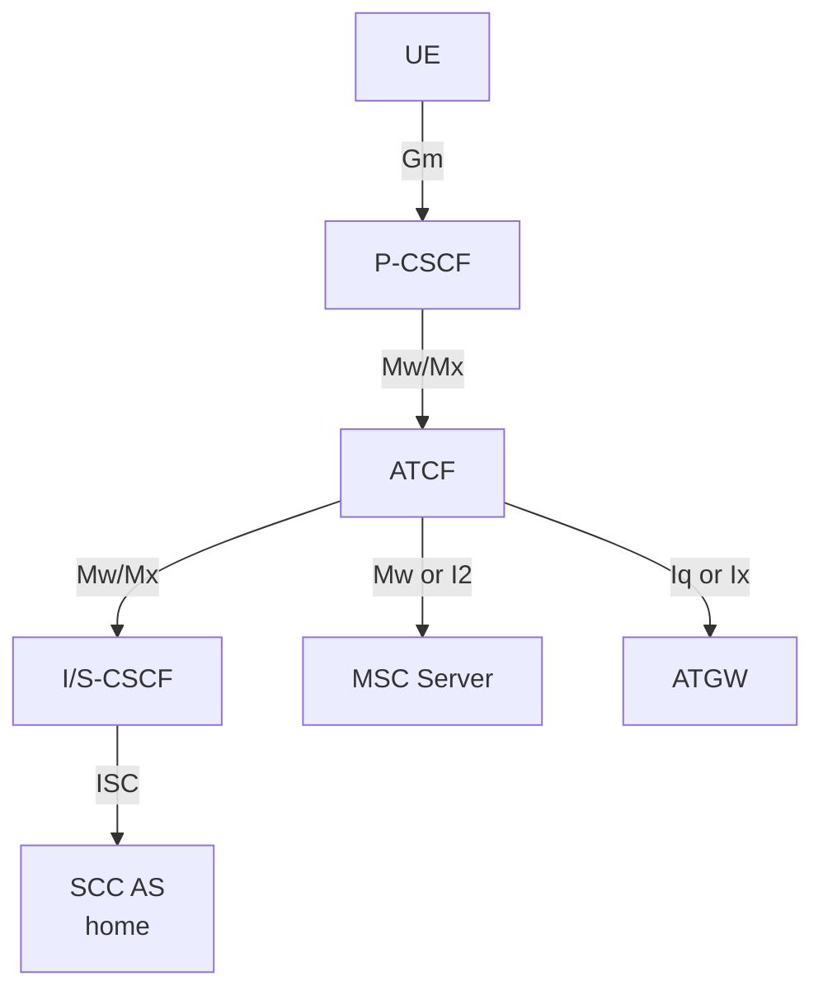
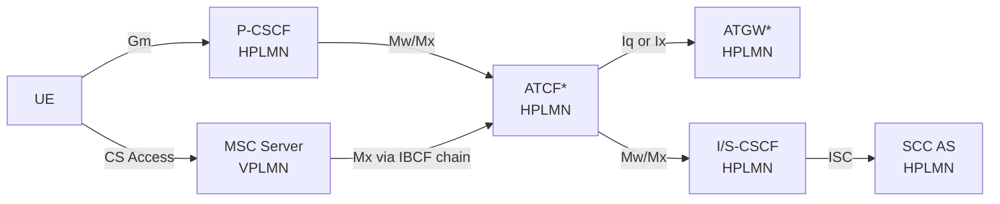

# ATCF — Access Transfer Control Function

The **Access Transfer Control Function (ATCF)** is a SIP-layer function located in the **serving (visited if roaming) network**. It is included in the session control plane for (v)SRVCC-enhanced and 5G-SRVCC scenarios, remaining in the signalling path for the duration of the call — before and after Access Transfer.

Reference: **3GPP TS 23.237 §5.3.4**.

---

## Architectural Position

The ATCF may be **co-located** with:
- **P-CSCF** → interface to ATGW is **Iq** (per TS 23.334)
- **IBCF** → interface to ATGW is **Ix** (per TS 29.162)

The interface to MSC Server:
- Non-ICS MSC Server → **Mw**
- ICS-enhanced MSC Server → **I2**
- CS to PS SRVCC → **I2**

---

## Functions

### Session Anchoring

| Function | Detail |
|---|---|
| **STN-SR allocation** | Based on operator policy, decides to allocate STN-SR pointing to itself (or not); STN-SR included in Registration so SCC AS can update HSS |
| **SIP path inclusion** | Inserts itself into SIP signalling path during registration (ATCF inclusion decision based on roaming, local config, UE capabilities, access type) |
| **ATGW media anchoring** | Instructs ATGW to anchor media path for originating and terminating sessions; ATGW remains in media path before and after Access Transfer |
| **Session state tracking** | Tracks sessions in pre-alerting, alerting, active, or held states |

### Access Transfer Execution

| Function | Detail |
|---|---|
| **PS→CS Transfer** | Performs Access Transfer; updates ATGW with new media path for CS access leg, without requiring remote leg update |
| **ATU notification** | After AT, updates SCC AS with Access Transfer Update (ATU-STI + C-MSISDN) to ensure T-ADS has current access info |
| **Failure handling** | Handles failure cases during Access Transfer (e.g. CS access unavailable) |
| **STN-SR not modified** | ATCF shall not modify the dynamic STI exchanged between UE and SCC AS |

### CS to PS SRVCC Support

| Function | Detail |
|---|---|
| **STI-rSR** | Provides STI-rSR (unique to each ATCF instance within an ATCF) to UE for use in CS-to-PS reverse SRVCC request |
| **I2 notifications** | Handles CS-to-PS Access Transfer notification and preparation requests from MSC Server |

### Post-Transfer Media Optimization

After access transfer and based on local policy, the ATCF may remove the ATGW from the media path. This step requires updating the remote end.

---

## ATCF Inclusion Decision (§5.3.4.2)

The ATCF decides at registration time whether to insert itself into the SIP path. Criteria:

**For inclusion in SIP signalling:**
- UE is roaming and roaming agreement supports (5G-)SRVCC enhanced with ATCF
- Local operator always deploys IBCF/MGCF with media anchor for inter-operator calls
- Registered communication service and media capabilities of UE
- Access type over which registration is sent

> NOTE: If ATCF decides not to include itself during registration, ATCF enhancements cannot be used for the entire registration period.

**For ATGW media anchoring (per session):**
- Whether UE is roaming
- Local configuration (e.g. IBCF/MGCF always present)
- Communication service and media capabilities used for the session
- Which network the remote party is in
- Access type of request/response
- SRVCC capability of UE

---

## Interfaces Summary

| Interface | Peer | Notes |
|---|---|---|
| Mw/Mx | P-CSCF | UE-facing signalling path |
| Mw/Mx | I/S-CSCF | Home-facing signalling path |
| Mw | MSC Server (non-ICS) | CS access leg control |
| I2 | MSC Server (ICS-enhanced) | ICS CS access leg control |
| Iq | ATGW (when co-located with P-CSCF) | Media path control |
| Ix | ATGW (when co-located with IBCF) | Media path control |

---

## Key Identifiers

| Identifier | Role |
|---|---|
| **STN-SR** | Allocated by ATCF; in STN-SR set by SCC AS into HSS; routes SRVCC request to ATCF |
| **ATU-STI** | Received from SCC AS at registration; used in Access Transfer Update notification back to SCC AS |
| **C-MSISDN** | Received from SCC AS; used to correlate Access Legs |
| **STI-rSR** | Generated by ATCF (unique per ATCF instance); provided to UE for CS→PS SRVCC |

---

## Annex C: ATCF in Architectures without IMS-level Roaming Interfaces

When a UE is roaming in a VPLMN that has **no IMS-level roaming agreement** with the HPLMN, the P-CSCF and ATCF are located in the **HPLMN** (not the VPLMN). This is the alternative to having ATCF in the serving network.

> Support for architectures without IMS-level roaming interfaces is **optional**.

### Architecture (Annex C.2)

`*` Location depends on deployment and collocation scenario.

- ATCF co-located with P-CSCF → ATGW interface is **Iq** (TS 23.334)
- ATCF co-located with IBCF → ATGW interface is **Ix** (TS 29.162)
- CS→PS SRVCC: MSC Server (VPLMN) ↔ ATCF (HPLMN) via **Mx** through IBCF chain

### PS→CS AT Flow without Media Anchored in ATGW (Annex C.3)

When no media is anchored in the ATGW (Mx-roaming variant):

1. UE, RAN, MME/SGSN, MSC Server interact per TS 23.216
2. MSC Server sends INVITE(STN-SR, C-MSISDN) → IBCF (VPLMN) → IBCF (HPLMN) → ATCF
3. ATCF correlates the transferred session using C-MSISDN; since no media is in ATGW, ATCF forwards the Access Transfer message to SCC AS along with ATU-STI; also indicates mid-call feature support if MSC Server indicated it
4. SCC AS correlates and performs Remote Leg Update (§6.3.1.5)
5. SCC AS sends SSI + response to ATCF → ATCF forwards via IBCF chain → MSC Server
6. If MSC Server receives SSI with multiple active/held sessions: initiates additional Access Transfer toward SCC AS per §6.3.2.1.4a
7. Source Access Leg Release per §6.3.2.1.4 steps 4a/4b

> NOTE: Mid-call feature success depends on proper SIP signalling transport from VPLMN MSC Server through the IBCF chain to the ATCF in HPLMN. The Mx interface does not require IMS roaming level agreements, but SIP header transport fidelity is required for mid-call features.

---

## Cross-references

- [entities/ATGW.md](ATGW.md) — media-plane peer controlled by ATCF
- [entities/SCC-AS.md](SCC-AS.md) — home network counterpart; provides C-MSISDN/ATU-STI to ATCF
- [concepts/IMS-service-continuity.md](../concepts/IMS-service-continuity.md) — full SC concept
- [concepts/SRVCC.md](../concepts/SRVCC.md) — SRVCC concept and flows
- [procedures/PS-CS-access-transfer.md](../procedures/PS-CS-access-transfer.md) — SRVCC AT procedures
- [procedures/SRVCC-enhancements.md](../procedures/SRVCC-enhancements.md) — codec inquiry and re-negotiation
