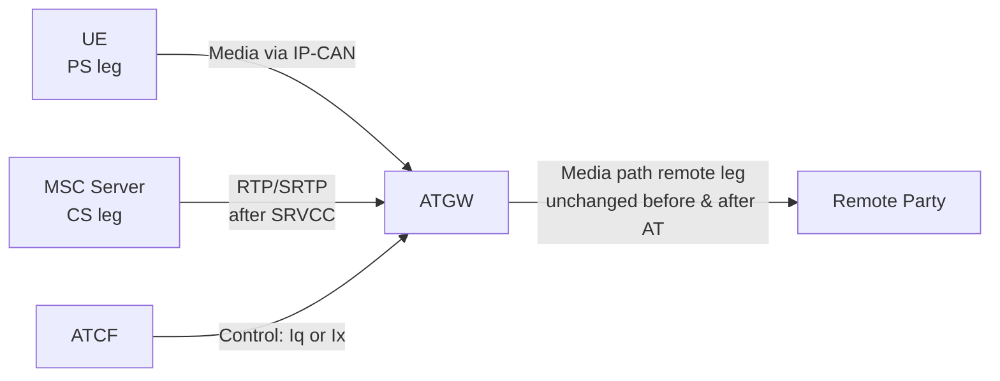

# ATGW — Access Transfer Gateway

The **Access Transfer Gateway (ATGW)** is a media-plane function in the **serving (visited if roaming) network**, controlled by the [ATCF](ATCF.md). It anchors the media path for the duration of a call when (v)SRVCC enhanced with ATCF or 5G-SRVCC is used.

Reference: **3GPP TS 23.237 §5.3.5**.

---

## Role and Function

The ATGW's purpose is to remain in the media path **both before and after Access Transfer**, so that when Access Transfer occurs (e.g., PS→CS SRVCC), only the serving-network media leg needs to be updated — the remote leg media path does not change.

Before Access Transfer: UE sends media via IP-CAN to ATGW → ATGW forwards to remote party.  
After Access Transfer: MSC Server becomes the CS access leg; ATGW continues forwarding to remote party without updating the remote end.

---

## Key Properties

| Property | Detail |
|---|---|
| **Controlled by** | ATCF (via Iq or Ix reference point) |
| **Media anchoring** | Stays in media path for entire call duration, per serving network local policy |
| **Transcoding** | Supports transcoding after SRVCC if pre-SRVCC codec not supported by MSC Server |
| **Physical node** | Depending on ATCF co-location: may be **IMS-AGW** (if ATCF co-located with P-CSCF) or **TrGW** (if ATCF co-located with IBCF) |
| **Post-transfer removal** | ATCF may remove ATGW from media path after AT based on local policy, but this requires updating the remote end |

---

## Interface

| Interface | Peer | Notes |
|---|---|---|
| Iq | ATCF (co-located with P-CSCF) | Per TS 23.334 |
| Ix | ATCF (co-located with IBCF) | Per TS 29.162 |

The ATGW has no direct SIP signalling interface to the UE or core network — it is purely a media relay controlled by the ATCF.

---

## Cross-references

- [entities/ATCF.md](ATCF.md) — controlling function
- [entities/TrGW.md](TrGW.md) — TrGW may serve as ATGW when ATCF co-located with IBCF
- [entities/IBCF.md](IBCF.md) — IBCF co-location scenario
- [concepts/IMS-service-continuity.md](../concepts/IMS-service-continuity.md) — full SC concept
