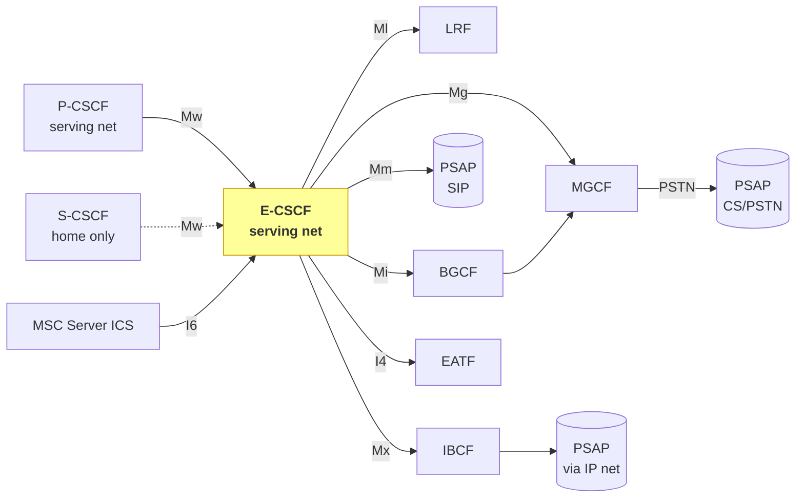
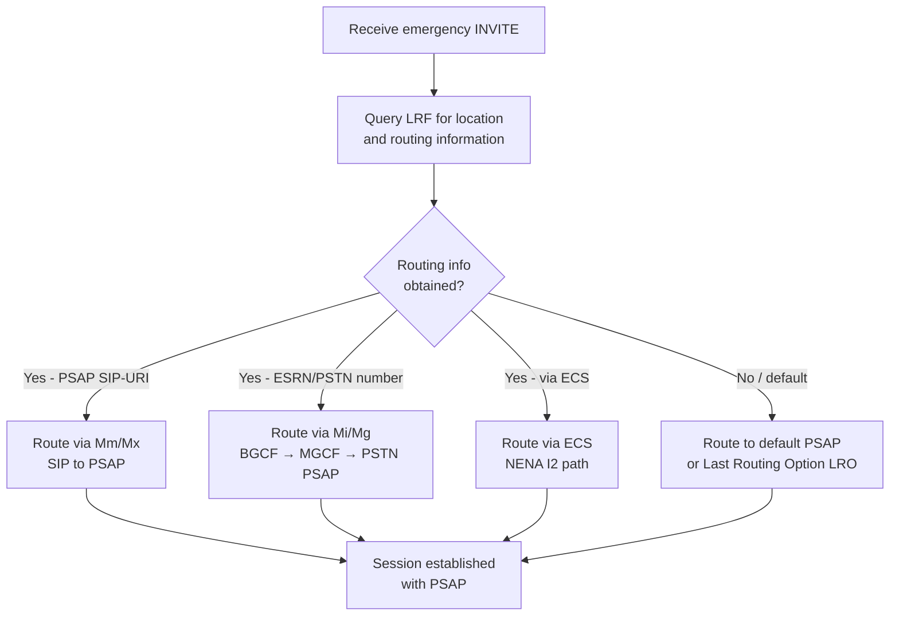

# Emergency-CSCF (E-CSCF)

The **Emergency-CSCF (E-CSCF)** is an additional CSCF role introduced by 3GPP TS 23.167 (not present in baseline TS 23.002 or TS 23.228). It is the IMS entity responsible for **routing IMS emergency sessions to the correct PSAP or emergency centre**, and for coordinating location retrieval via the [LRF](LRF.md).

---

## Architectural Position

> **Critical placement rule:** The E-CSCF is **always in the serving network** (visited PLMN when roaming). It is never in the home network for a roaming subscriber. This ensures emergency routing is subject to the **serving country's regulations and PSAP infrastructure**.

---

## Functions (§6.2.2)

### Core routing
- Receive emergency session establishment request from [P-CSCF](P-CSCF.md) or [S-CSCF](S-CSCF.md)
- Route emergency session to appropriate PSAP/emergency centre, including for **anonymous sessions**
- Route via PSTN path (BGCF → MGCF), SIP-to-PSAP (Mm), or inter-network (IBCF/Mx)
- Optionally route via ECS (Emergency Call Server) for NENA I2 deployments (Annex D)

### Location and routing information
- If location info is not included in emergency request, or additional location is required → query [LRF](LRF.md) via Ml to retrieve location (§7.6)
- Request LRF to **validate** UE-provided location if required
- Query LRF for **PSAP routing information** (ESQK, ESRN, LRO, PSAP SIP-URI/TEL-URI)

### Identity handling
- Derive a **non-dialable callback number** for UEs without credentials, where required by local regulation (e.g. Annex C of ANSI/J-STD-036 B)
- Subject to local regulation → may send P-Asserted-ID or UE identification to LRF
- Shall **prevent** sending user identifiers / location to PSAP unless explicitly requested by user (privacy requirement, §4.1 principle 21)
- For UEs without credentials: forward equipment identifier received from P-CSCF

### Special session types
- For **SRVCC/DRVCC**: forward emergency session to [EATF](../concepts/IMS-emergency-architecture.md) via I4 for anchoring and continuity (TS 23.237)
- For **ICS (MSC Server enhanced with ICS)**: handle via I6, treat the same as a P-CSCF request (TS 23.292)
- For **NG-eCall**: use LRF/RDF indication to determine manual vs automatic eCall; route MGCF for PSTN PSAP, SIP for NG-eCall capable PSAP; does not forward initial MSD directly
- For **AS-initiated emergency** (on behalf of non-roaming user): process as normal emergency establishment

### Charging
- Generate CDRs for emergency sessions

---

## Interfaces

| Interface | Peer | Protocol | Purpose |
|---|---|---|---|
| **Mw** | [P-CSCF](P-CSCF.md), [S-CSCF](S-CSCF.md) | SIP | Receive emergency session INVITE; SIP responses |
| **Ml** | [LRF](LRF.md) | — (not standardised in 23.167) | Location retrieval; PSAP routing info request |
| **Mi** | BGCF | SIP | Route toward PSTN-connected PSAP |
| **Mg** | MGCF | SIP | Route toward CS gateway (PSTN/CS domain PSAP) |
| **Mm** | External IP network / PSAP | SIP | SIP-based PSAP directly or via IP multimedia network |
| **Mx** | IBCF | SIP | Inter-network routing toward PSAP in another network |
| **I4** | EATF | SIP | Emergency session continuity (SRVCC/DRVCC) |
| **I6** | MSC Server ICS | SIP | CS media + IMS signalling interworking for ICS emergencies |

---

## PSAP Routing Decision

---

## Interaction with P-CSCF for Emergency Detection

The P-CSCF is the **first IMS hop** that may detect an emergency session. Once detected, P-CSCF selects an E-CSCF in the same (serving) network. Key P-CSCF → E-CSCF handoff behaviours:

- P-CSCF forwards the equipment identifier for **credentialless UEs**
- P-CSCF may query IP-CAN for location identifier before forwarding
- P-CSCF may optionally forward to **S-CSCF** first (non-roaming, operator policy), which then forwards to E-CSCF
- P-CSCF informs [PCRF](PCRF.md) to identify emergency service data flow

---

## S-CSCF Role in Emergency Registration (§6.2.4)

For emergency registrations the [S-CSCF](S-CSCF.md) applies modified HSS interaction:

| Condition | S-CSCF action |
|---|---|
| Emergency registration, no existing normal reg | Download user profile from HSS; HSS sets status = UNREGISTERED |
| Emergency registration, normal reg exists | Do not change HSS registration status |
| Last normal session deregisters, emergency reg still active | Ensure HSS keeps S-CSCF name; status = UNREGISTERED |
| Emergency registration expires, normal reg exists | Do not change HSS status |
| Emergency registration expires, no normal reg | May de-register in HSS or leave status unchanged |

For emergency session from P-CSCF, S-CSCF:
1. Performs caller authentication (as for normal session)
2. Applies filter criteria (may route to AS)
3. Forwards to E-CSCF

---

## Key Architectural Properties

- **Serving-network anchor**: E-CSCF always resides in the visited PLMN; home network is uninvolved in emergency routing
- **Location-driven routing**: unlike normal IMS (identity → HSS → S-CSCF), emergency routing is **location → LRF → PSAP address**
- **Anonymous capable**: handles sessions with no IMPU, using equipment identifier as fallback
- **Privacy enforcement**: E-CSCF acts as a gateway between the UE (whose privacy must be protected) and the PSAP (which requires location); privacy is managed by local regulation
- **SRVCC bridge**: emergency sessions must survive handover; EATF anchors continuity via I4

---

## Cross-references

- [LRF](LRF.md) — location and routing function queried by E-CSCF
- [IMS Emergency Architecture](../concepts/IMS-emergency-architecture.md) — overall framework
- [P-CSCF deep-dive](P-CSCF-deepdive.md) — P-CSCF emergency detection and selection of E-CSCF
- [S-CSCF deep-dive](S-CSCF-deepdive.md) — S-CSCF emergency registration modifications
- [IMS Emergency Session](../procedures/IMS-emergency-session.md) _(procedure page — chunk 5a-2)_
- [IMS Emergency Location](../procedures/IMS-emergency-location.md) _(procedure page — chunk 5a-3)_
