# HSS Deep-Dive — Home Subscriber Server

**Base entity page:** [HSS.md](HSS.md)
**Spec references:** TS 23.401 §4.2/§5; TS 23.228 §4–§5; TS 23.402 §4; TS 29.272 (S6a); TS 29.228/29.229 (Cx/Sh)

---

## Architectural Position

The HSS is the **master subscriber database** for the entire EPC and IMS domain. It is a pure control-plane node — it never touches user-plane traffic. Every authentication, registration, and location event flows through it. It is the only node with complete visibility of both the EPC subscription state (which MME serves the UE, what APNs are allowed, QoS profile) and the IMS registration state (which S-CSCF serves each IMPU, what iFC list applies).

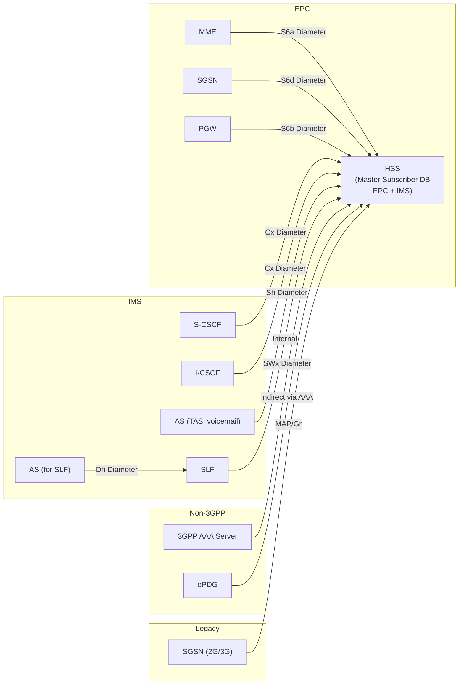

---

## Complete Interface Table

| Interface | Peer | Protocol | Direction | Purpose |
|---|---|---|---|---|
| **S6a** | MME | Diameter (S6a app) | Bidirectional | EPC: authentication vectors, subscription download, location management, UE purge |
| **S6d** | SGSN | Diameter (S6d app) | Bidirectional | Same as S6a toward SGSN (2G/3G access) |
| **S6b** | 3GPP AAA Server (indirect) | Diameter | HSS → AAA → PGW | Non-3GPP: AAA queries HSS for subscription; HSS pushes profile updates |
| **Cx** | S-CSCF, I-CSCF | Diameter (Cx app) | Bidirectional | IMS registration: auth vectors, service profile delivery, S-CSCF assignment |
| **Sh** | Application Servers | Diameter (Sh app) | Bidirectional | AS read/write/subscribe to subscriber service data (iFC-related data, call preferences) |
| **Dh** | SLF (Subscription Locator Function) | Diameter (Dh app) | AS → SLF → HSS | Multi-HSS: SLF routes AS Sh queries to the correct HSS instance |
| **SWx** | 3GPP AAA Server | Diameter (SWx app) | Bidirectional | Non-3GPP access: HSS pushes subscriber profile to AAA; AAA fetches auth vectors |
| **MAP/Gr** | Legacy SGSN | SS7/MAP | Bidirectional | Legacy 2G/3G support (pre-Diameter GSM/UMTS) |
| **Sp** | SPR (Policy Repository) | Internal/vendor | HSS ↔ SPR | When HSS and SPR are separate nodes — PCRF queries SPR for policy data |

---

## Diameter Messages — S6a Interface

### Authentication

| Message | Direction | Purpose |
|---|---|---|
| Authentication Information Request (AIR) | MME → HSS | Fetch EPS Authentication Vectors for AKA; specifies count requested, PLMN ID |
| Authentication Information Answer (AIA) | HSS → MME | Returns EPS-AVs: {RAND, XRES, AUTN, KASME}×N; HSS generates from Ki + SQN |

### Location Management

| Message | Direction | Purpose |
|---|---|---|
| Update Location Request (ULR) | MME → HSS | Register MME as serving node; request subscription data; sent on Attach and inter-MME TAU |
| Update Location Answer (ULA) | HSS → MME | Returns full subscription profile (see data model below); updates stored MME identity |
| Cancel Location Request (CLR) | HSS → old MME | Sent when new MME registers — instructs old MME to detach UE and delete UE context |
| Cancel Location Answer (CLA) | old MME → HSS | Acknowledges context deletion |
| Insert Subscriber Data Request (IDR) | HSS → MME | Push subscription profile update mid-session (e.g. operator changes APN config) |
| Insert Subscriber Data Answer (IDA) | MME → HSS | Acknowledges profile update; MME applies new subscription parameters |

### Purge and Notify

| Message | Direction | Purpose |
|---|---|---|
| Purge UE Request (PUR) | MME → HSS | UE implicitly detached (Mobile Reachability Timer expired); HSS clears MME registration |
| Purge UE Answer (PUA) | HSS → MME | Acknowledges purge |
| Notify Request (NOR) | MME → HSS | Report UE capability: IMS Voice over PS support, RAT type, EPS bearer context status |
| Notify Answer (NOA) | HSS → MME | Acknowledges notification |

### Subscription Data Download (in ULA)

The ULA payload carries the full EPC subscription profile. Key AVPs:

| AVP Group | Contents |
|---|---|
| Subscription-Data | MSISDN, STN-SR (Session Transfer Number for SR-VCC), ICS-Indicator |
| APN-Configuration-Profile | Default APN, PDN-Type, Service-Selection (APN name), Max-Requested-Bandwidth-UL/DL, Default-EPS-Bearer-QoS (QCI + ARP), APN-OI-Replacement |
| AMBR | UE-AMBR-UL, UE-AMBR-DL (aggregate across all Non-GBR bearers) |
| PDN-GW-Allocation-Type | Static or dynamic PGW assignment |
| PDN-GW-Identity | Stored PGW FQDN/IP (for non-3GPP handover PGW reuse) |
| RFSP-Index | RAT/Frequency Selection Priority passed to eNB |
| Roaming-Restricted-Due-To-Unsupported-Feature | Barring flags |
| Access-Restriction-Data | Barred access types (UTRAN, GERAN, WLAN, etc.) |
| IMS-Voice-Over-PS-Sessions-Supported | UE registered for IMS voice; used by MME for T-ADS |
| Homogeneous-Support-of-IMS-Voice-Over-PS-Sessions | All cells in TA support IMS voice |

---

## Diameter Messages — Cx Interface

### Registration Flows

| Message | Direction | Trigger |
|---|---|---|
| User Authorization Request (UAR) | I-CSCF → HSS | REGISTER arrives at I-CSCF; HSS checks if visited NW authorized + returns S-CSCF info |
| User Authorization Answer (UAA) | HSS → I-CSCF | Returns: existing S-CSCF name (if registered) OR required capability set for new S-CSCF selection |
| Multimedia Auth Request (MAR) | S-CSCF → HSS | IMS AKA: fetch auth vectors; specifies auth scheme (IMS_AKA, SIP_DIGEST, etc.) |
| Multimedia Auth Answer (MAA) | HSS → S-CSCF | Returns IMS auth vectors: {RAND, AUTN, XRES, CK, IK} |
| Server Assignment Request (SAR) | S-CSCF → HSS | Register S-CSCF as serving node; request service profile; assignment type governs behavior |
| Server Assignment Answer (SAA) | HSS → S-CSCF | Returns full service profile (all IMPUs + iFCs for implicit registration set); stores S-CSCF name |

### SAR Assignment Types

| Assignment Type | Trigger | HSS Action |
|---|---|---|
| REGISTRATION | Initial IMS registration | Store S-CSCF name; return service profile |
| RE_REGISTRATION | Re-REGISTER (periodic or param change) | Update S-CSCF name; return updated service profile |
| UNREGISTERED_USER | Terminating session for unregistered IMPU | Return service profile for unregistered handling (iFC for voicemail etc.) |
| TIMEOUT_DEREGISTRATION | S-CSCF registration timer expired | Clear S-CSCF name |
| USER_DEREGISTRATION | UE-initiated de-REGISTER | Clear S-CSCF name |
| DEREGISTRATION_TOO_MUCH_DATA | Service profile too large | Clear S-CSCF name; flag error |
| ADMINISTRATIVE_DEREGISTRATION | Network-initiated (RTR-triggered) | Clear S-CSCF name |
| AUTHENTICATION_FAILURE | AKA/digest failure | Do not store S-CSCF; optional auth vector deletion |

### Termination Flows

| Message | Direction | Trigger |
|---|---|---|
| Location Info Request (LIR) | I-CSCF → HSS | Terminating INVITE: fetch S-CSCF serving the callee IMPU |
| Location Info Answer (LIA) | HSS → I-CSCF | Returns S-CSCF name (if registered) or "not registered" |
| Registration Termination Request (RTR) | HSS → S-CSCF | HSS-initiated de-registration: subscription change, roaming bar, admin |
| Registration Termination Answer (RTA) | S-CSCF → HSS | S-CSCF acknowledges; sends de-REGISTER to UE |
| Push Profile Request (PPR) | HSS → S-CSCF | Push updated service profile (iFC change by operator) without re-registration |
| Push Profile Answer (PPA) | S-CSCF → HSS | Acknowledges profile update; S-CSCF installs new iFCs |

---

## Diameter Messages — Sh Interface

The Sh interface allows ASes to read and write subscriber **service data** (not auth data or core subscription). The AS must be authorized by the HSS.

| Message | Direction | Purpose |
|---|---|---|
| User Data Request (UDR) | AS → HSS | Read subscriber service data (call forwarding target, barring flags, MSISDN, IMPU list) |
| User Data Answer (UDA) | HSS → AS | Returns requested data |
| Profile Update Request (PUR) | AS → HSS | Write subscriber service data (AS updates call forwarding target, etc.) |
| Profile Update Answer (PUA) | HSS → AS | Acknowledges update |
| Subscribe Notifications Request (SNR) | AS → HSS | Subscribe to change notifications for specific data elements |
| Subscribe Notifications Answer (SNA) | HSS → AS | Confirms subscription |
| Push Notifications Request (PNR) | HSS → AS | Notify subscribed AS of data change (XCAP-driven update, operator change) |
| Push Notifications Answer (PNA) | AS → HSS | Acknowledges notification |

**Primary Sh use cases:**
- **Voicemail AS (B.3.2):** Download subscriber profile at registration to check for waiting messages → originate call to UE
- **TAS:** Read call forwarding rules, barring status; write forwarding targets
- **XCAP server:** UE modifies service settings via Ut/XCAP → updates HSS via Sh PUR

---

## Diameter Messages — SWx Interface

The SWx interface connects the HSS to the **3GPP AAA Server** for non-3GPP access authentication and authorization.

| Message | Direction | Purpose |
|---|---|---|
| Multimedia Auth Request (MAR) | 3GPP AAA → HSS | Fetch auth vectors for non-3GPP EAP-AKA authentication |
| Multimedia Auth Answer (MAA) | HSS → 3GPP AAA | Returns EAP-AKA auth vectors |
| Server Assignment Request (SAR) | 3GPP AAA → HSS | Register AAA as serving node for non-3GPP session; request subscription data |
| Server Assignment Answer (SAA) | HSS → 3GPP AAA | Returns non-3GPP subscription data (allowed APNs, QoS, PGW identity) |
| Registration Termination Request (RTR) | HSS → 3GPP AAA | HSS-initiated disconnect for non-3GPP session |
| Registration Termination Answer (RTA) | 3GPP AAA → HSS | Acknowledges; AAA initiates session termination toward ePDG/TWAN |
| Push Profile Request (PPR) | HSS → 3GPP AAA | Push updated subscription profile to AAA (HSS-initiated QoS modification, §7.11.2) |
| Push Profile Answer (PPA) | 3GPP AAA → HSS | AAA relays update to ePDG/TWAN → PGW path |

**PPR on SWx is the trigger for HSS-initiated QoS modification on S2b:** HSS PPR → AAA → ePDG Notify → PGW PCEF IP-CAN Modification → PGW Update Bearer Request.

---

## EPC Subscriber Data Model

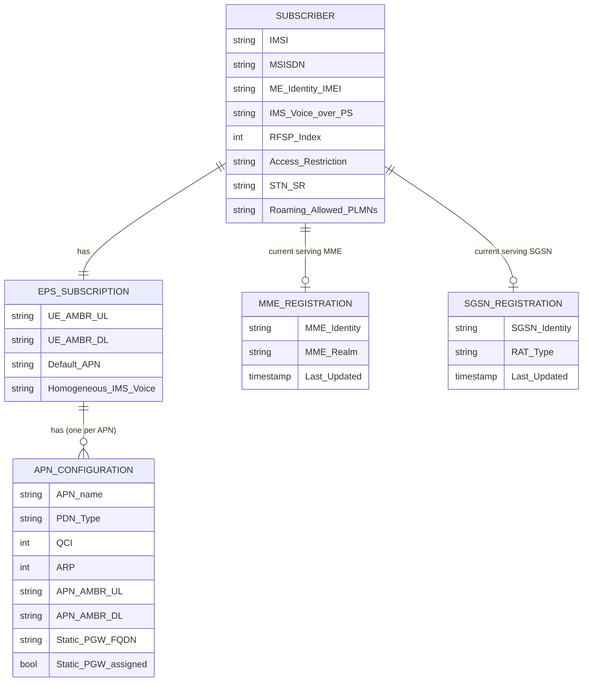

**PGW identity storage:** For each APN, HSS may store the identity of the currently serving PGW (written by PGW via S6b/AAA on non-3GPP attach, or by MME on 3GPP attach). This stored PGW identity is returned during non-3GPP → 3GPP handover to enable PGW reuse and IP address continuity (TS 23.402 §8.2.1 step 4).

---

## IMS Subscriber Data Model

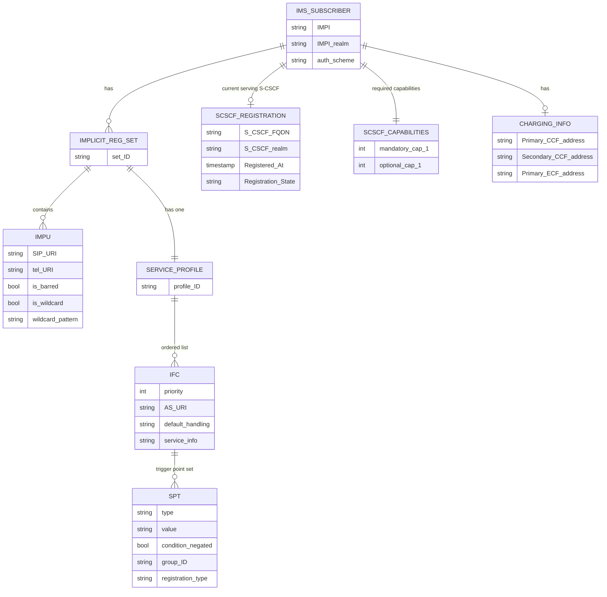

---

## Registration State Machine (IMS)

The HSS tracks the IMS registration state per IMPU:

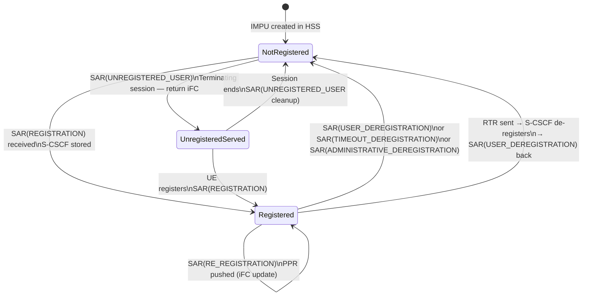

**Three states per IMPU:**
- **NotRegistered**: No S-CSCF assigned; terminating calls forwarded per unregistered iFC (if any)
- **Registered**: S-CSCF name stored; terminating calls routed to that S-CSCF
- **UnregisteredServed**: S-CSCF temporarily serving for an unregistered terminating session; reverts to NotRegistered when session ends

---

## Location Management State Machine (EPC)

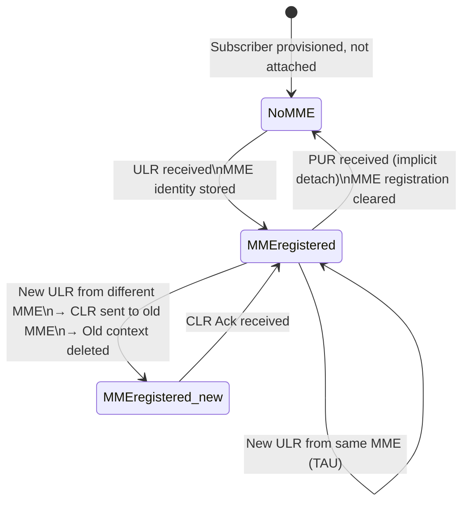

---

## HSS Role in Key Procedures

### EPS Initial Attach

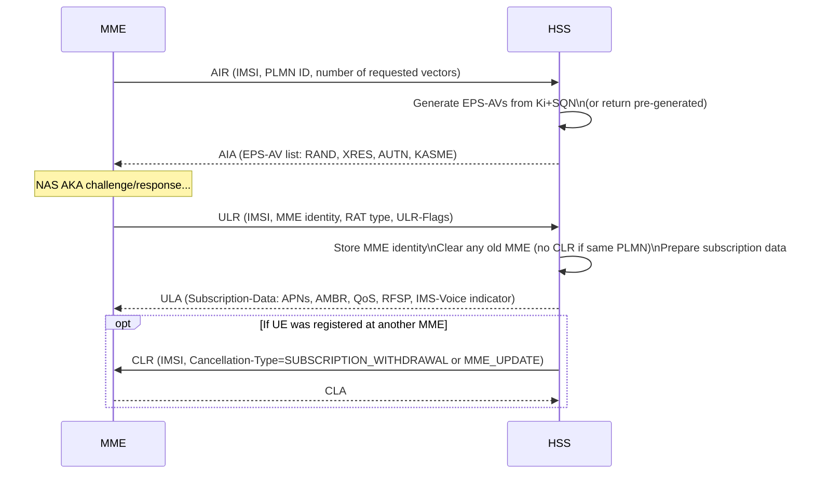

### IMS Registration

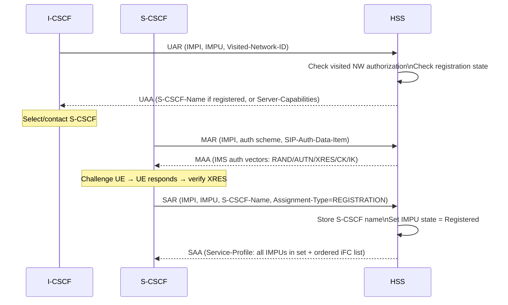

### Non-3GPP Handover — PGW Identity Reuse (TS 23.402 §8.2.1)

During non-3GPP → E-UTRAN handover, the MME queries HSS for the existing PGW identity:

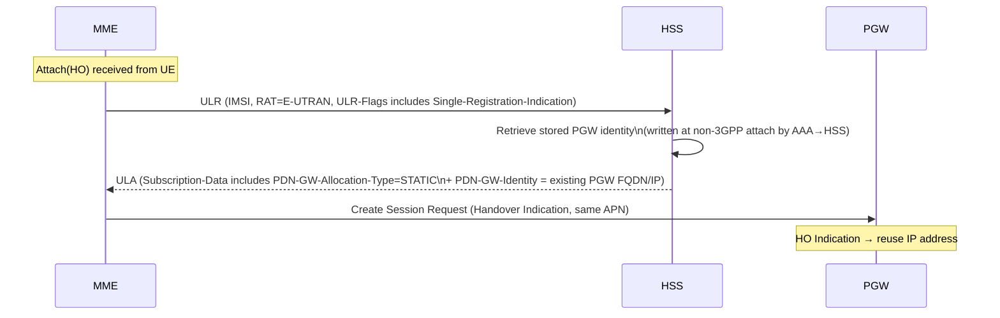

**Critical:** The HSS is the only node that stores the cross-access PGW identity. If HSS did not retain this, the MME would select a new PGW and the UE would receive a new IP address, breaking all active sessions.

### HSS-Initiated Subscriber Data Push (IDR / PPR)

When an operator modifies a subscriber's profile in the HSS provisioning system:

**EPC (IDR):**
- HSS → MME: IDR (updated APN config, new AMBR, modified QoS)
- MME applies new parameters to active bearers (may trigger Update Bearer toward SGW/PGW)

**IMS (PPR):**
- HSS → S-CSCF: PPR (updated service profile — new/modified iFCs)
- S-CSCF installs new iFCs; active sessions are unaffected but new sessions use new iFCs

---

## Multi-HSS Deployments and SLF

Large operators deploy multiple HSS instances. Routing is handled by the **SLF (Subscription Locator Function)**:

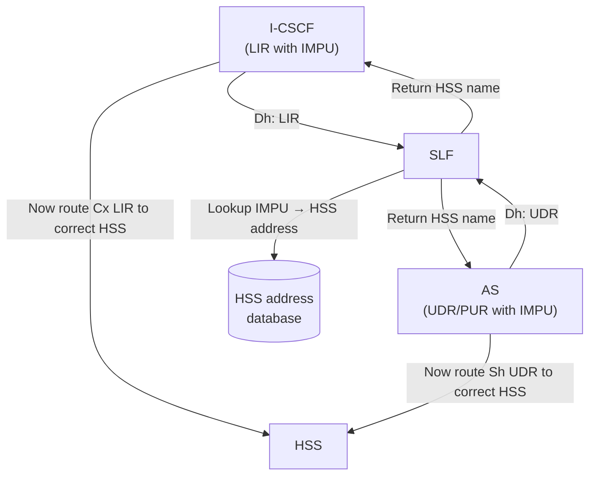

- I-CSCF queries SLF before sending LIR (if SLF is deployed)
- AS queries SLF (Dh interface) before sending Sh UDR/PUR
- MME uses DNS/realm routing on S6a — does not use SLF
- SLF is optional in single-HSS deployments

---

## Authentication Vector Generation

The HSS generates **EPS Authentication Vectors** for EPS AKA:

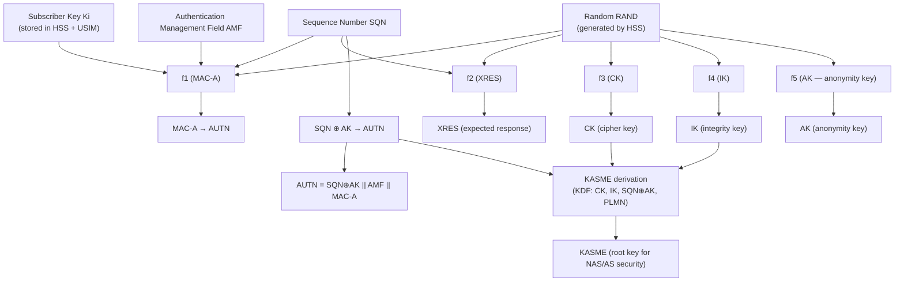

**EPS-AV = {RAND, XRES, AUTN, KASME}**

- RAND: fresh random challenge
- XRES: expected UE response (HSS verifies UE's RES matches XRES)
- AUTN: network authentication token (UE verifies network is legitimate)
- KASME: root key from which NAS-enc, NAS-int, AS-enc, AS-int keys are derived

---

## Failure and Overload Behavior

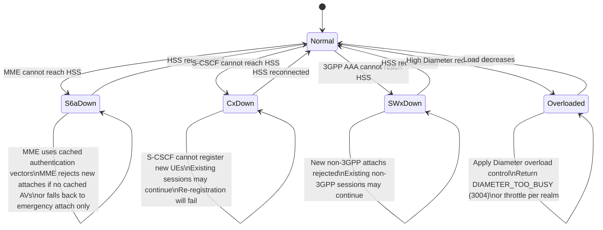

**Cached authentication vectors:** MME may pre-fetch multiple EPS-AVs in a single AIR. If HSS becomes unreachable, MME can authenticate UEs using cached vectors until they are exhausted. This provides resilience for short HSS outages.

---

## Key Architectural Properties

| Property | Details |
|---|---|
| **HPLMN-only** | HSS is always in the Home PLMN. Roaming MMEs in the VPLMN query it over S6a/S6d across inter-PLMN Diameter routing |
| **No user-plane involvement** | HSS never touches packets; purely control-plane Diameter |
| **Shared EPC + IMS** | Single HSS node stores both EPS subscription and IMS service profiles; no boundary between the two |
| **Cross-access state** | HSS stores PGW identity per APN — the only mechanism for IP continuity across 3GPP ↔ non-3GPP handover |
| **Push capability** | HSS can proactively push: CLR (cancel old MME), IDR (update subscription), RTR (IMS de-registration), PPR (IMS profile update), PPR-SWx (non-3GPP profile update) |
| **Auth vector cache** | HSS generates AVs in batches; MME caches them. This decouples authentication frequency from HSS availability |
| **Multi-HSS via SLF** | Large deployments shard subscriber data across HSS pools; SLF provides transparent routing for Cx/Sh queries |

---

## Configuration Parameters

| Parameter | Description |
|---|---|
| IMSI range | IMSI prefix(es) served by this HSS instance |
| Ki provisioning | Subscriber authentication keys (provisioned via BSS/OSS) |
| APN pool configuration | Allowed APN list, default APN, QoS per APN per IMSI range |
| UE-AMBR defaults | Default aggregate rate limits |
| IMS voice indicator | Per-subscriber flag: IMS Voice over PS supported |
| S-CSCF capability sets | Mandatory/optional capabilities used in UAA for S-CSCF selection |
| Number of AVs per AIR | How many EPS-AVs to generate and return per AIR |
| SQN window | Sequence number synchronization window (prevents replay attacks) |
| S6a realm | Diameter realm for MME routing |
| Cx realm | Diameter realm for I-CSCF/S-CSCF routing |
| SLF address | SLF hostname (multi-HSS only) |
| Overload threshold | Diameter request rate triggering overload response |
| IDR trigger policy | Which subscription changes trigger IDR to MME vs. apply at next attach |

---

## Cross-References

| Topic | Page |
|---|---|
| HSS base entity | [entities/HSS.md](HSS.md) |
| MME (S6a consumer) | [entities/MME.md](MME.md) |
| MME deep-dive | [entities/MME-deepdive.md](MME-deepdive.md) |
| PGW (S6b via AAA) | [entities/PGW.md](PGW.md) |
| S-CSCF (Cx consumer) | [entities/S-CSCF.md](S-CSCF.md) |
| I-CSCF (Cx + Dh) | [entities/I-CSCF.md](I-CSCF.md) |
| TAS (Sh consumer) | [entities/TAS.md](TAS.md) |
| ePDG (non-3GPP, via AAA/SWx) | [entities/ePDG.md](ePDG.md) |
| IMS identity model (IMPI/IMPU/iFC) | [concepts/IMS-identity-model.md](../concepts/IMS-identity-model.md) |
| IM Call Model (iFC evaluation) | [concepts/IM-call-model.md](../concepts/IM-call-model.md) |
| Information storage | [concepts/information-storage.md](../concepts/information-storage.md) |
| EPS Initial Attach | [procedures/EPS-attach.md](../procedures/EPS-attach.md) |
| IMS Registration | [procedures/IMS-registration.md](../procedures/IMS-registration.md) |
| Non-3GPP handover | [procedures/non3GPP-handover.md](../procedures/non3GPP-handover.md) |
| S2b attach | [procedures/S2b-attach.md](../procedures/S2b-attach.md) |
| Non-3GPP architecture | [concepts/non-3GPP-access-architecture.md](../concepts/non-3GPP-access-architecture.md) |
| EPC reference points | [interfaces/reference-points.md](../interfaces/reference-points.md) |
| IMS reference points | [interfaces/IMS-reference-points.md](../interfaces/IMS-reference-points.md) |
