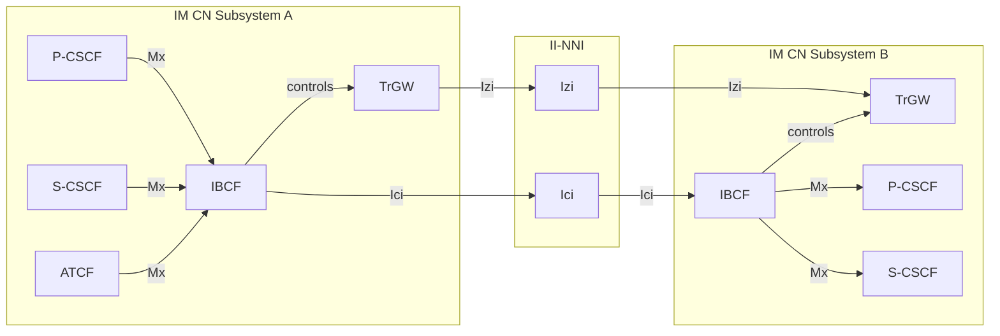
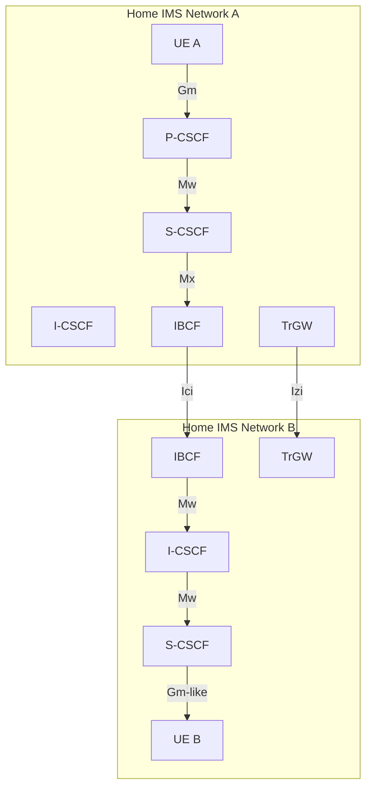

# IBCF — Interconnection Border Control Function

**Spec reference:** 3GPP TS 29.165 §5.2.1; 3GPP TS 23.228 §4.2 (referenced)

## Role

The IBCF sits at the border of an IMS network and provides all SIP/SDP-layer functions needed to interconnect two IM CN subsystems over the [II-NNI](../interfaces/II-NNI.md). It acts simultaneously as the network entry point and exit point for SIP signalling traversing the Ici reference point.

## Interfaces

| Interface | Peer | Protocol | Direction | Purpose |
|---|---|---|---|---|
| **Ici** | IBCF (peer network) | SIP | Bidirectional | Cross-network SIP signalling — the II-NNI control plane |
| **Mx** | P-CSCF, S-CSCF, BGCF, ATCF, MSC Server enhanced for ICS/SRVCC/dual radio | SIP | Bidirectional | Within-network signalling toward/from IBCF |
| _(controls)_ | [TrGW](TrGW.md) | Proprietary / TS 24.229 §I.2 | Control | IBCF drives TrGW for media path setup (NAT-PT, codec negotiation) |

## Functions

Per TS 29.165 §5.2.1, the IBCF performs:

| Function | Description |
|---|---|
| **Network topology hiding** | Strips or rewrites internal network topology information (Record-Route, Via, Contact) before forwarding SIP messages across Ici |
| **IMS-ALG / Application Level Gateway** | Enables communication between IPv6 and IPv4 SIP applications, or between private and public IP address spaces; acts as B2BUA when ALG is active |
| **Controlling transport plane** | Instructs TrGW to open/close media paths, select codecs, perform NA(P)T-PT for media streams |
| **Controlling media plane adaptations** | Codec negotiation/transcoding requests via TrGW/MRFP; modifies SDP to offer additional codecs or remove incompatible ones |
| **Screening SIP signalling information** | Inspects and filters SIP header fields; applies per-header trust/no-trust rules (Table 6.2 of TS 29.165) |
| **Selecting appropriate signalling interconnect** | Routes to the correct peer IBCF based on destination network and operator agreements |
| **Generating CDRs** | Generates charging data records for inter-operator accounting |
| **Privacy protection** | Implements Privacy header processing; removes asserted identity headers when trust relationship is absent |
| **Additional routing functionality** | Transit routing per TS 24.229 §I.2 |
| **Transit IOI insertion** | Inserts transit Inter-Operator Identifier in P-Charging-Vector on requests when acting as entry point; removes/adds IOI on responses when acting as exit point |

## B2BUA Mode (IMS-ALG)

When the IBCF performs IMS-ALG functionality (e.g. IPv4/IPv6 interworking or address-space bridging) it operates as a **Back-to-Back User Agent (B2BUA)**:
- Terminates the incoming SIP dialogue on one leg
- Originates a new SIP dialogue on the other leg with translated addresses
- This allows full SDP rewriting for media path setup through TrGW

In non-ALG mode, the IBCF behaves as a SIP proxy.

## Trust Relationship Model

The IBCF distinguishes between two modes of operation at Ici:

| Mode | Behaviour |
|---|---|
| **With trust relationship** | Applies procedures in TS 24.229 §5.10.3 (entry-point) and §5.10.2 (exit-point); retains P-Asserted-Identity and other sensitive headers |
| **Without trust relationship** | Additionally applies TS 24.229 §4.4 privacy procedures before forwarding; strips or rewrites sensitive P-headers |

Trust relationships and trust domains may be defined by inter-operator agreements for individual services and/or individual SIP header fields.

## II-NNI Traversal Scenario Identification

The IBCF uses the `iotl` SIP URI parameter (IETF RFC 7549) to identify which traversal scenario applies:

| Traversal scenario | `iotl` value |
|---|---|
| Non-roaming II-NNI (default when absent) | `homeA-homeB` or `visitedA-homeB` |
| Loopback (LBO) | `homeA-visitedA` |
| Roaming II-NNI (generic) | `visitedA-homeA` or `homeB-visitedB` |
| Home-to-visited (roaming) | `homeB-visitedB` |
| Visited-to-home (roaming) | `visitedA-homeA` |

## Position in IMS Architecture

## Related Pages

- [TrGW](TrGW.md) — media-plane partner, controlled by IBCF
- [II-NNI Interface](../interfaces/II-NNI.md) — full Ici/Izi specification
- [IMS Reference Points](../interfaces/IMS-reference-points.md)
- [BGCF](BGCF.md) — internal routing before IBCF
- [P-CSCF](P-CSCF.md) — connects via Mx in visited/home network
- [S-CSCF](S-CSCF.md) — connects via Mx
