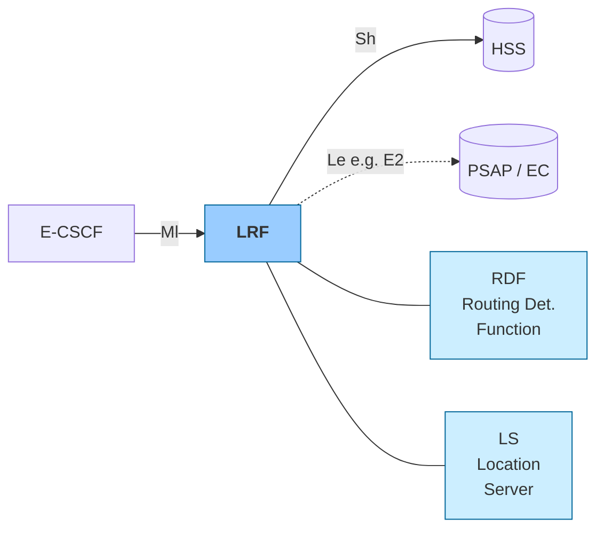
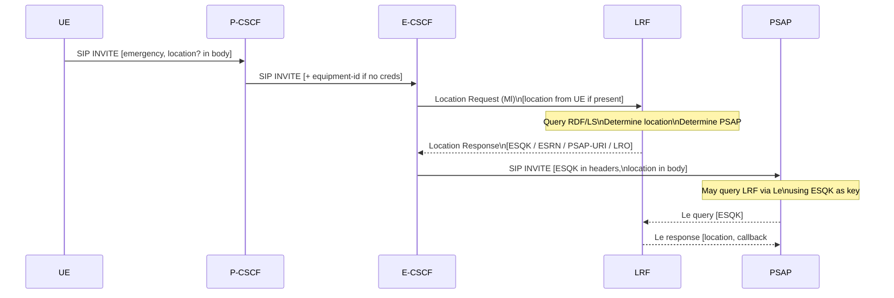

# Location Retrieval Function (LRF)

The **Location Retrieval Function (LRF)** is the IMS emergency-domain entity responsible for **retrieving and managing the UE's location** during an emergency session, and for providing the [E-CSCF](E-CSCF.md) with the **routing information** needed to reach the correct PSAP. Defined in 3GPP TS 23.167.

---

## Architectural Position

---

## Internal Structure

The LRF may be implemented as a single node or decomposed into:

| Sub-component | Function |
|---|---|
| **RDF** (Routing Determination Function) | Determines PSAP destination from location; manages ESQK allocation; interacts with PSAP location info systems |
| **LS** (Location Server) | Provides UE location estimates (cell-level, GPS, etc.); e.g., GMLC (TS 23.271), MPC (3GPP2), SLP (OMA SUPL) |

> The interface between the LS and RDF is **out of scope** of TS 23.167. Their internal split is an implementation choice.

---

## Functions (§6.2.3)

### Location retrieval
- Retrieve UE location including, where required:
  - **Interim location** (quick initial estimate for routing)
  - **Initial location** (to pass to PSAP)
  - **Updated location** (if PSAP requests later)
- For **WLAN access**, non-roaming UEs: may interact with HSS via Sh to obtain NPLI (Network Provided Location Information)
- In **North America**: if BSSID of serving WLAN AP is available, may query national database (ATIS-0700028) for dispatchable location — this database interaction is outside 3GPP scope

### Routing determination
- Utilise the RDF to provide PSAP routing information to the E-CSCF:
  - **ESQK** (Emergency Service Query Key): 10-digit NANP number used as lookup key by PSAP to retrieve location / callback from LRF
  - **ESRN** (Emergency Service Routing Number): NANP number for routing to CS-based PSAP gateway
  - **LRO** (Last Routing Option): fallback number/address when PSAP cannot be determined
  - **PSAP SIP-URI / TEL-URI**: for SIP-reachable PSAPs
  - **Location number** (EU): numeric location reference for PSTN routing in European deployments
- Manage ESQK **allocation and release**: ESQK is assigned per emergency session; released when E-CSCF signals session termination

### Emergency session record
- In regions where the PSAP may query for location (e.g., North America):
  - Store a **session record** containing all information provided by E-CSCF
  - Retain the record until E-CSCF signals the session is terminated
  - Include **ESQK** as a correlation key so PSAP can query back via Le
  - The ESQK (or other correlation info) is carried in the SIP INVITE to the PSAP (or via SS7 ISUP signalling from MGCF)

### Location validation
- Upon E-CSCF request: validate UE-provided geographical location information

---

## Interfaces

| Interface | Peer | Purpose |
|---|---|---|
| **Ml** | [E-CSCF](E-CSCF.md) | Location retrieval requests; routing information response (ESQK, ESRN, PSAP URI, LRO) |
| **Sh** | [HSS](HSS.md) | NPLI query for non-roaming WLAN UEs (TS 29.328) |
| **Le** (e.g., E2) | PSAP / Emergency Centre | Location delivery; PSAP callback (outside 3GPP scope; e.g., NENA I2 E2 interface) |

---

## Key Concepts

### ESQK — Emergency Service Query Key
A **10-digit NANP number** assigned by the LRF per emergency session. Used in North American deployments:
- The PSAP uses the ESQK to query the LRF (via Le/E2) for:
  - Location information for the UE
  - Callback number for the UE
- The ESQK travels from LRF → E-CSCF → PSAP (in SIP INVITE or ISUP signalling)
- The LRF releases the ESQK when informed by E-CSCF that the session ended

### ESRN — Emergency Service Routing Number
A NANP number used for **routing an emergency call** to the appropriate gateway for eventual delivery toward a CS-based PSAP. Used when PSAP is PSTN-connected.

### LRO — Last Routing Option
A fallback address/number used when the specific local PSAP **cannot be determined** from location. Prevents call loss when location resolution fails.

### ECS — Emergency Call Server
An optional VoIP proxy/redirect server (e.g., in NENA I2 architecture) that contains a VPC (VoIP Positioning Centre) and RDF. The E-CSCF may route via ECS instead of querying LRF directly. The ECS routes the emergency call toward the PSAP and provides routing/location services.

---

## Location Information Flow

---

## Key Architectural Properties

- **Location authority**: LRF is the authoritative source for routing-quality location during emergency sessions; it may override or supplement UE-provided location
- **Privacy boundary**: LRF holds both location and ESQK — it mediates what the PSAP knows about the user
- **Session-bound state**: LRF session records are tied to individual emergency sessions, not to subscription; records expire when E-CSCF signals termination
- **No 3GPP standardisation of Le**: the interface between LRF and PSAP (Le) is defined by regional bodies (NENA, ATIS) not 3GPP — operators must integrate per regional requirements
- **WLAN special case**: for non-roaming UEs on WLAN, LRF may use HSS (Sh) to obtain NPLI before querying regional database — combining 3GPP identity resolution with non-3GPP location

---

## Cross-references

- [E-CSCF](E-CSCF.md) — primary consumer of LRF services
- [IMS Emergency Architecture](../concepts/IMS-emergency-architecture.md) — overall framework
- [HSS deep-dive](HSS-deepdive.md) — HSS Sh interface (also used by LRF for WLAN NPLI)
- [IMS Emergency Location](../procedures/IMS-emergency-location.md) _(procedure page — chunk 5a-3)_
