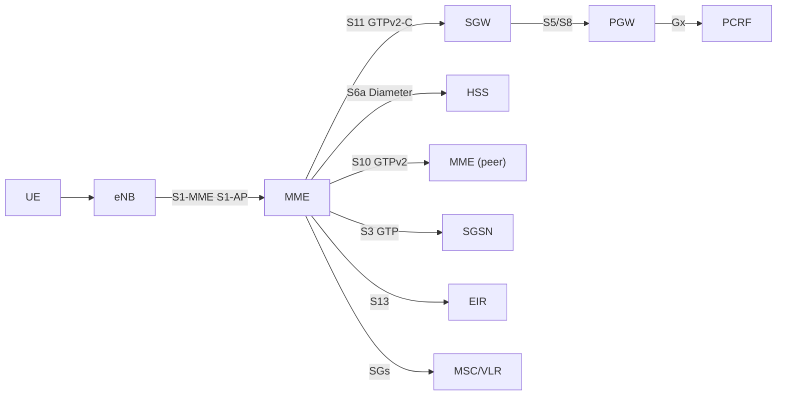
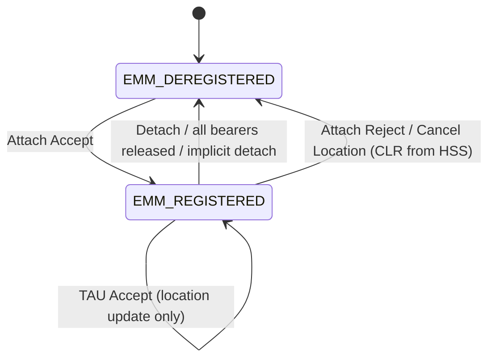
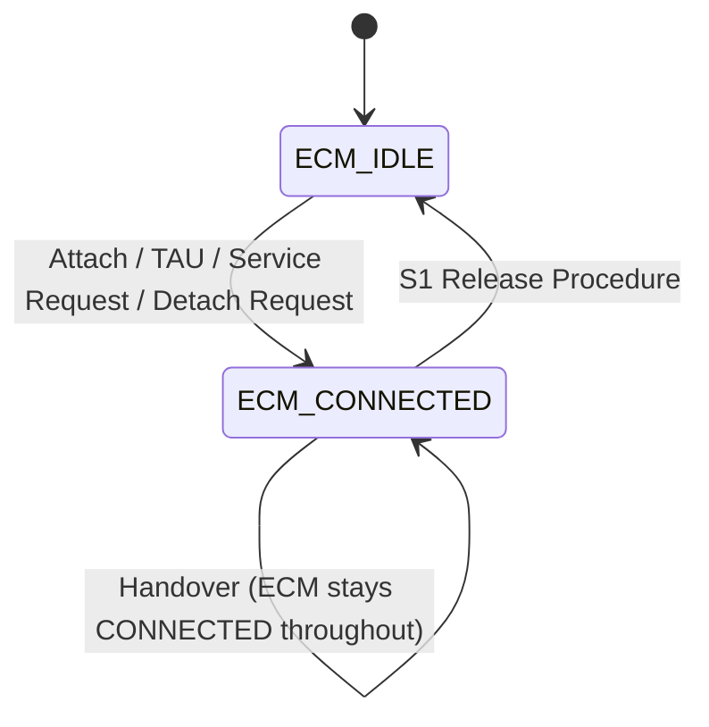
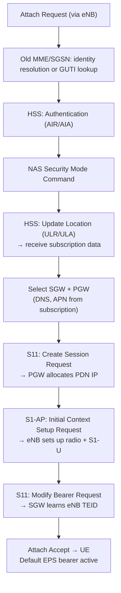
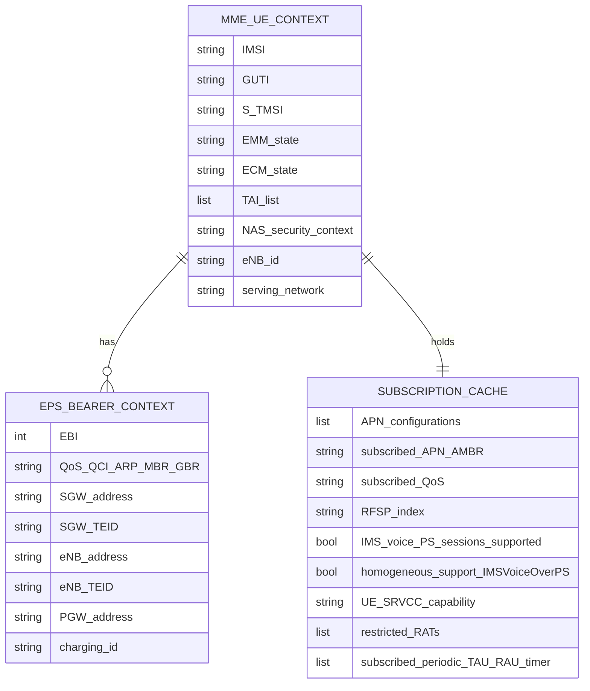
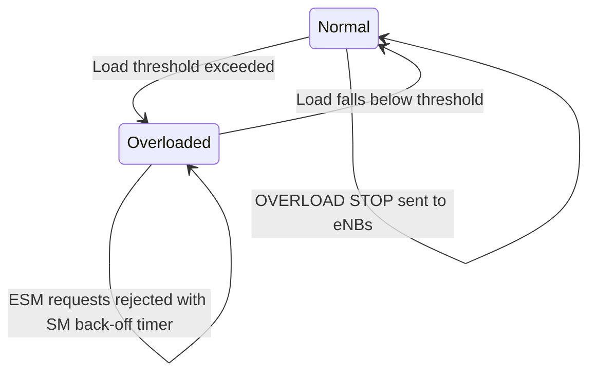

# MME Deep-Dive — Mobility Management Entity

**Base page:** [MME](MME.md)
**Spec reference:** 3GPP TS 23.401 §4.3.5, §4.4.2, §4.3.7, §5.3–§5.5, §5.9–§5.10

---

## Architectural Position



The MME sits at the **NAS termination point** of the LTE control plane. It has no user plane role — all data flows through SGW/PGW. It is the orchestrator for all EPC procedures: it coordinates eNodeB (via S1-AP), HSS (via S6a), and SGW (via S11) to complete any UE state transition.

---

## All Interfaces

| Interface | Peer | Protocol | Direction | Primary Purpose |
|---|---|---|---|---|
| **S1-MME** | eNodeB | S1-AP / SCTP | Bidirectional | NAS relay, E-RAB management, paging, handover control |
| **S6a** | HSS | Diameter / SCTP | Bidirectional | UE authentication, location update, subscription data, subscriber notifications |
| **S11** | SGW | GTPv2-C / UDP | Bidirectional | Session creation/deletion/modification, bearer lifecycle, idle-mode buffer management |
| **S10** | MME (peer) | GTPv2 / UDP | Bidirectional | UE context transfer during inter-MME handover or TAU with MME change |
| **S3** | SGSN | GTP | Bidirectional | Inter-RAT context transfer (2G/3G ↔ LTE) |
| **S13** | EIR | — (Diameter) | MME → EIR | IMEI verification (ME identity check) |
| **S7a** | CSS | — | MME → CSS | CSG subscription data for roaming UEs |
| **SGs** | MSC/VLR | SGs-AP | Bidirectional | CS Fallback, combined EPS/IMSI attach, SMS-over-SGs (TS 23.272) |
| **Nq** | RCAF | — | RCAF → MME | RAN congestion information for load control |

---

## Messages Sent and Received

### S6a (Diameter to HSS)

| Message | MME Role | Trigger |
|---|---|---|
| Authentication-Information-Request (AIR) | Initiator | UE requests authentication vectors |
| Authentication-Information-Answer (AIA) | Receiver | HSS returns RAND, AUTN, XRES, KASME |
| Update-Location-Request (ULR) | Initiator | After authentication; notify HSS of serving MME |
| Update-Location-Answer (ULA) | Receiver | HSS returns full subscription data |
| Cancel-Location-Request (CLR) | Receiver | HSS forces MME to release UE context (roaming, subscription change) |
| Cancel-Location-Answer (CLA) | Initiator | Acknowledge CLR |
| Insert-Subscriber-Data-Request (IDR) | Receiver | HSS pushes subscription update (dynamic provisioning) |
| Insert-Subscriber-Data-Answer (IDA) | Initiator | Acknowledge IDR |
| Delete-Subscriber-Data-Request (DSR) | Receiver | HSS removes specific subscription data |
| Delete-Subscriber-Data-Answer (DSA) | Initiator | Acknowledge DSR |
| Notify-Request (NOR) | Initiator | Report UE reachability (paging failure, UE available after DDN) |
| Notify-Answer (NOA) | Receiver | Acknowledge NOR |
| Purge-UE-Request (PUR) | Initiator | Implicit detach — remove UE from HSS records after implicit detach timer |
| Purge-UE-Answer (PUA) | Receiver | Acknowledge PUR |
| Reset-Request (RSR) | Receiver | HSS signals MME pool reset |
| Reset-Answer (RSA) | Initiator | Acknowledge RSR |

### S11 (GTPv2-C to SGW)

| Message | MME Role | Trigger |
|---|---|---|
| Create Session Request | Initiator | Attach, PDN connectivity, inter-SGW handover |
| Create Session Response | Receiver | SGW/PGW return session context |
| Modify Bearer Request | Initiator | E-RAB setup complete, handover complete, TAU with bearer update |
| Modify Bearer Response | Receiver | SGW acknowledges path update |
| Delete Session Request | Initiator | Detach, PDN disconnection |
| Delete Session Response | Receiver | SGW confirms session tear-down |
| Create Bearer Request | Receiver | PGW-initiated dedicated bearer creation (via SGW) |
| Create Bearer Response | Initiator | Return EBI and eNB TEID after UE/eNB setup |
| Update Bearer Request | Receiver | PGW-initiated bearer modification |
| Update Bearer Response | Initiator | Acknowledge bearer modification |
| Delete Bearer Request | Receiver | PGW-initiated bearer deactivation |
| Delete Bearer Response | Initiator | Acknowledge bearer deletion |
| Release Access Bearers Request | Initiator | S1 Release — move UE to ECM-IDLE, suspend S1-U |
| Release Access Bearers Response | Receiver | SGW confirms S1-U bearers suspended |
| Downlink Data Notification (DDN) | Receiver | SGW signals buffered DL data → MME pages UE |
| Downlink Data Notification Ack | Initiator | Acknowledge DDN, provide paging parameters |
| Modify Bearer Command | Initiator | MME-initiated bearer QoS modification (HSS-triggered subscribed QoS) |
| Modify Bearer Failure Indication | Receiver | SGW/PGW cannot apply QoS modification |
| Delete Bearer Command | Initiator | MME-initiated bearer deactivation (e.g. MME-initiated dedicated bearer deactivation) |
| Delete Bearer Failure Indication | Receiver | SGW/PGW cannot delete bearer |
| Bearer Resource Command | Initiator | UE-requested bearer resource modification forwarded |
| Bearer Resource Failure Indication | Receiver | PGW rejects UE-requested bearer resource |
| Create Forwarding Tunnel Request | Initiator | Indirect forwarding during S1 handover |
| Create Forwarding Tunnel Response | Receiver | Indirect forwarding TEID returned |
| Stop Paging Indication | Initiator | UE responded to page; cancel paging at SGW buffering |
| Change Notification Request | Initiator | User location change / RAT change report for PGW/PCRF |
| Change Notification Response | Receiver | Acknowledge Change Notification |

### S10 (GTPv2 to peer MME)

| Message | MME Role | Trigger |
|---|---|---|
| Forward Relocation Request | Sender (source) or Receiver (target) | S1 inter-MME handover, inter-MME TAU |
| Forward Relocation Response | Sender (target) or Receiver (source) | Acknowledge relocation; return target-side TEIDs |
| Forward Relocation Complete Notification | Sender (target) | UE connected to target, handover complete |
| Forward Relocation Complete Ack | Sender (source) | Acknowledge completion |
| Context Request | Receiver (new) | New MME requests UE context during inter-MME TAU |
| Context Response | Sender (old) | Old MME delivers UE context |
| Context Acknowledge | Sender (new) | New MME confirms context received |
| Identification Request / Response | Between MMEs | Resolve IMSI from GUTI when old MME unknown |
| Relocation Cancel Request / Response | Handover cancel | Abort handover before completion |

### S1-AP (to eNodeB)

| Message | MME Role | Trigger |
|---|---|---|
| Initial Context Setup Request | Sender | Attach complete, Service Request — setup S1-U bearers at eNB |
| Initial Context Setup Response | Receiver | eNB returns eNB TEID(s) |
| UE Context Modification Request | Sender | Change bearers, security context, AMBR update |
| UE Context Release Command | Sender | S1 release (detach, handover completion, radio failure) |
| UE Context Release Request | Receiver | eNB requests release (inactivity, HO, etc.) |
| UE Context Release Complete | Receiver | eNB confirms release |
| E-RAB Setup Request | Sender | Dedicated bearer activation |
| E-RAB Setup Response | Receiver | eNB returns E-RAB TEID |
| E-RAB Modify Request | Sender | Bearer QoS modification |
| E-RAB Modify Response | Receiver | eNB confirms modification |
| E-RAB Release Command | Sender | Bearer deactivation |
| E-RAB Release Response | Receiver | eNB confirms release |
| Paging | Sender | DDN received from SGW, or network-initiated page |
| Handover Required | Receiver | eNB initiates S1 handover |
| Handover Command | Sender | MME sends HO command to source eNB after target resources allocated |
| Handover Notify | Receiver | Target eNB signals UE connected |
| Handover Cancel | Receiver | Source eNB cancels in-progress HO |
| Path Switch Request | Receiver | X2 HO — target eNB reports path switched |
| Path Switch Request Ack | Sender | MME acknowledges path switch, provides new SGW TEIDs if SGW changed |
| Write-Replace Warning Request | Sender | Broadcast PWS/ETWS/CMAS warnings |

---

## State Machines Owned

### EMM State Machine



### ECM State Machine



### Timers

| Timer | Start Condition | Expiry Action |
|---|---|---|
| Mobile Reachability Timer | UE enters ECM-IDLE | Mark UE as potentially unreachable; start Implicit Detach Timer |
| Implicit Detach Timer | Mobile Reachability Timer expires | Implicit detach: release bearers, notify HSS (PUR), clear UE context |
| Active Timer (PSM) | MME allocated Active Time to UE | PSM window ends; UE may return to deep sleep |
| Extended Periodic TAU Timer | UE supports extended idle mode | Longer TAU interval for IoT devices |
| S1 Release Timer | S1 Release initiated | Timeout if eNB does not release |

---

## Procedures — MME Role

### Initial Attach (TS 23.401 §5.3.2.1)

MME is the **orchestrator**: it receives the Attach Request from eNB (as NAS relay), drives
authentication (S6a AIR/AIA), runs security mode command (NAS SMC), sends Update Location
(S6a ULR/ULA), selects SGW and PGW, sends Create Session Request (S11), drives E-RAB setup
(S1-AP Initial Context Setup), and sends Attach Accept.



### TAU (TS 23.401 §5.3.3)

**Intra-MME TAU (no SGW change):**
- MME verifies GUTI, updates TAI list, sends TAU Accept; no S11 signaling needed
- If bearer contexts changed: Modify Bearer Request to SGW

**Inter-MME TAU with SGW change:**
- New MME requests context from old MME (S10 Context Request/Response)
- New MME sends Create Session Request to new SGW
- HSS Update Location (old MME loses context)
- Old MME receives Cancel Location from HSS; releases bearers

**ISR (Idle-mode Signaling Reduction):**
- MME registers UE at both MME and SGSN simultaneously
- UE can move between LTE and 2G/3G without signaling until Active Timer expires

### Service Request (TS 23.401 §5.3.4)

**UE-triggered:**
1. Receive Service Request NAS from UE
2. Validate Security (NAS integrity)
3. S11: Release Access Bearers → S11: receive DDN (if pending DL data) → page
4. S1-AP: Initial Context Setup Request (re-establishes S1-U)
5. S11: Modify Bearer Request (update SGW with eNB TEIDs)

**Network-triggered (DDN from SGW):**
1. MME receives Downlink Data Notification from SGW
2. MME sends Paging via S1-AP to all eNBs in UE's TAI list
3. UE responds → Service Request flow continues from step 4 above

### Detach (TS 23.401 §5.3.8)

| Initiator | MME Action |
|---|---|
| UE-initiated | Receive Detach Request; Delete Session (S11); UE Context Release (S1-AP); Update Location / Purge UE (S6a) |
| MME-initiated | Send Detach Request (NAS); Delete Session (S11); S1 Release; Purge UE (S6a) |
| HSS-initiated | Receive CLR from HSS; generate Detach Request to UE; Delete Session (S11); S1 Release |
| Switch-off | Receive Detach Request(switch-off); Delete Session immediately; no TAU/page timer needed |

### Dedicated Bearer Activation (TS 23.401 §5.4.1)

MME **relays** the dedicated bearer lifecycle between SGW (PGW-initiated) and eNB/UE:
1. Receive Create Bearer Request from SGW (PGW-triggered via PCC)
2. Map TFT from PGW to NAS Activate Dedicated EPS Bearer Context Request
3. Send E-RAB Setup Request to eNB + NAS to UE
4. Receive E-RAB Setup Response + UE Activate Accept
5. Send Create Bearer Response to SGW with eNB TEID + EBI

### X2 Handover (TS 23.401 §5.5.1.1)

MME's role is **minimal** in X2-HO (most coordination is eNB-to-eNB):
1. Receive Path Switch Request from target eNB (UE already moved)
2. Send Modify Bearer Request to SGW (new eNB address/TEID)
3. If SGW changes: Create Session to new SGW + delete old SGW session
4. Send Path Switch Request Ack to target eNB

### S1 Handover (TS 23.401 §5.5.1.2)

MME is the **central coordinator**:
1. Receive Handover Required from source eNB
2. If inter-MME: Forward Relocation Request to target MME (S10)
3. Send Handover Request to target eNB (S1-AP)
4. Receive Handover Request Ack from target eNB
5. Send Handover Command to source eNB
6. Receive Handover Notify from target eNB (UE arrived)
7. Send Modify Bearer Request to SGW (switch path to target eNB)
8. Send UE Context Release Command to source eNB

### PDN Connectivity (TS 23.401 §5.10)

For UE-requested additional PDN:
1. Receive PDN Connectivity Request (NAS ESM)
2. Select PGW (DNS + subscription check)
3. Create Session Request to SGW → new PDN IP allocated
4. Activate Default EPS Bearer Context NAS + E-RAB Setup to eNB
5. Modify Bearer Request with eNB TEID for new bearer

### Non-3GPP → E-UTRAN Handover (TS 23.402 §8.2.1.1)

MME's **critical function** is reusing the existing PGW:
1. Receive Attach(Handover) from UE
2. Send ULR to HSS — receive **PGW identity** (from HSS, registered at non-3GPP attach)
3. Send Create Session Request with Handover Indication to that specific PGW
4. PGW creates new S5 GTP session **without** allocating new IP (HO Indication)
5. MME sends Initial Context Setup after bearer setup
6. Send Modify Bearer Request — SGW tells PGW to switch tunnel from ePDG to SGW

---

## Subscriber Data Stored per UE Context



**Data obtained from HSS via S6a ULA:**
- Subscription profile per APN (QoS, APN-AMBR, PDN type, static IP)
- RFSP Index (for eNB radio scheduling)
- IMS Voice over PS Sessions supported flag
- SRVCC capability indicator
- Barring lists / restricted RAT list
- Operator-specific access restrictions

**Data generated locally by MME:**
- GUTI (allocated at attach or TAU)
- TAI list (assigned to UE)
- NAS security context (K_ASME, NAS integrity/ciphering keys + algorithms)
- EBI assignments (per PDN, per bearer)

---

## Failure and Overload Behavior

### Overload (§4.3.7.4)



**Actions when overloaded:**
- Send `OVERLOAD START` to all connected eNBs (S1-AP) with load reduction percentage
- eNBs reject RRC connection requests for non-emergency, non-MPS traffic
- MME rejects new NAS Attach/TAU requests with `MM Back-off timer`
- MME rejects new ESM PDN Connectivity requests with `SM Back-off timer`
- Emergency sessions, CSFB, MPS traffic are exempt from rejection

### SGW Failure

If MME detects SGW unresponsive:
- MME initiates re-selection of new SGW
- MME sends Create Session Request to new SGW (acts as if new attach for session recovery)
- UEs with silent failure may be implicitly detached after Mobile Reachability Timer expiry

### HSS Failure / S6a Unavailability

- MME may use cached subscription data for existing UEs (operator policy)
- New attaches fail if HSS unreachable and no cached IMSI data
- Some operators configure MME to allow service with degraded subscription (emergency-only)

---

## Load Balancing (§4.3.7.2)

```mermaid
graph TD
    eNB --> |S1-AP SETUP: MME pool info| Pool["MME Pool"]
    Pool --> |Weight Factor broadcast| MME1["MME-1 (weight 10)"]
    Pool --> |Weight Factor broadcast| MME2["MME-2 (weight 5)"]
    Pool --> |Weight Factor broadcast| MME3["MME-3 (weight 5)"]
    eNB --> |Initial UE Message (no GUTI)| SelectMME["eNB selects MME\nproportional to weight"]
```

**Re-balancing:** When an overloaded MME wants to shed load, it initiates S1 Release toward
UEs with release cause = "load balancing TAU required". UEs perform TAU and may be directed
to a different MME in the pool.

---

## Key Configuration Parameters

| Parameter | Purpose |
|---|---|
| PLMN ID / TAI list served | Defines the MME's service area |
| MME Group ID (MMEGI) | Part of GUTI; identifies MME pool |
| MME Code (MMEC) | Part of GUTI; identifies specific MME in pool |
| Weight Factor | Load balancing weight advertised to eNodeBs |
| Relative Capacity | Load indicator exchanged between MMEs |
| NAS security algorithms | Priority list for NAS integrity (EIA) + ciphering (EEA) |
| Default APN | Used when UE does not specify APN |
| Implicit Detach Timer | Time after reachability timer before implicit detach |
| Mobile Reachability Timer | Duration of ECM-IDLE before marking UE unreachable |
| Paging DRX cycle | Default paging cycle if UE does not indicate preference |

---

## Cross-References

| Topic | Page |
|---|---|
| EMM/ECM state machine details | [EMM-ECM-states](../concepts/EMM-ECM-states.md) |
| EPS bearer model | [EPS-bearer](../concepts/EPS-bearer.md) |
| Initial Attach procedure | [EPS-attach](../procedures/EPS-attach.md) |
| Tracking Area Update | [TAU](../procedures/TAU.md) |
| Service Request + S1 Release | [service-request](../procedures/service-request.md) |
| Detach variants | [detach](../procedures/detach.md) |
| Dedicated bearer lifecycle | [dedicated-bearer](../procedures/dedicated-bearer.md) |
| X2-based handover | [X2-handover](../procedures/X2-handover.md) |
| S1-based handover | [S1-handover](../procedures/S1-handover.md) |
| PDN connectivity | [PDN-connectivity](../procedures/PDN-connectivity.md) |
| Non-3GPP → E-UTRAN handover | [non3GPP-handover](../procedures/non3GPP-handover.md) |
| PMIP S5/S8 (MME unchanged) | [PMIP-S5S8-procedures](../procedures/PMIP-S5S8-procedures.md) |
| HSS subscription/auth data | [HSS](HSS.md) |
| SGW user plane anchor | [SGW](SGW.md) |
| Reference points | [reference-points](../interfaces/reference-points.md) |
