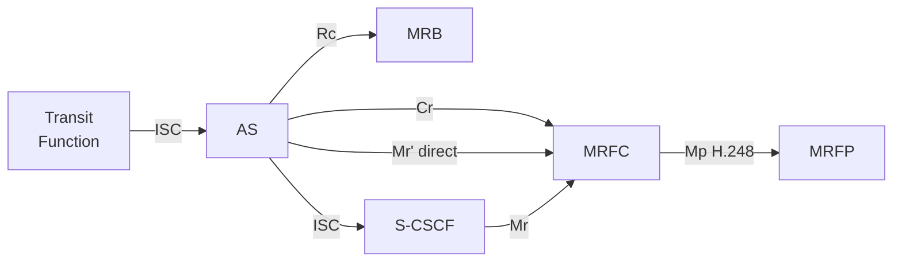
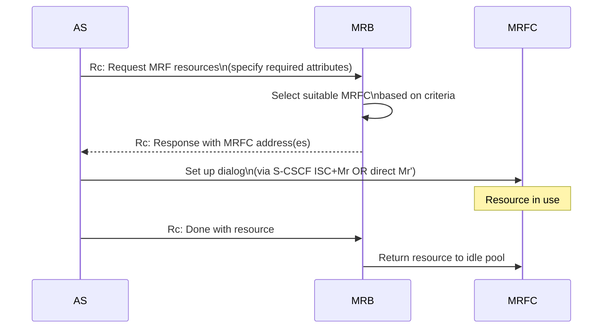
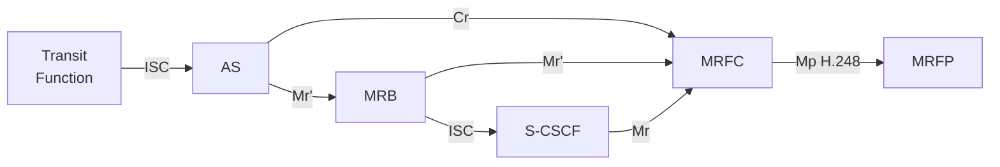
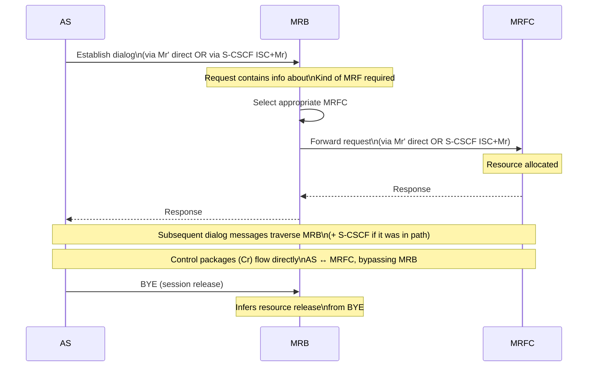

# MRB — Media Resource Broker

**Spec reference:** 3GPP TS 23.218 §13

Related pages: [MRF](MRF.md) · [TAS](TAS.md) ·
[AS Interaction Modes](../concepts/AS-interaction-modes.md) ·
[IMS Reference Points](../interfaces/IMS-reference-points.md)

---

## Role (§13.0)

The MRB is a functional entity responsible for:
1. **Collection**: gathering published information about available MRF (MRFC/MRFP) resources
2. **Supply**: providing appropriate MRF information to consuming entities (primarily Application Servers)
3. **Selection**: assigning specific MRFC resources to calls on behalf of applications

MRB enables a **pool of heterogeneous MRF resources** to be shared across multiple
heterogeneous applications. It abstracts the MRFC selection from the AS, allowing
the AS to request "conference resource for 10 participants" without needing to know
which specific MRFC to contact.

**Selection criteria** MRB considers:
- Specific characteristics of media resources required (codec, mixing capacity, etc.)
- Identity of the requesting application
- Fair-share allocation rules across different applications
- Per-application or per-subscriber SLA / QoS criteria
- Capacity models of particular MRF resources
- Whether a visited network MRB can be used

An MRB instance may operate in **both Query and In-Line modes simultaneously**. An AS
may also use Query mode for some calls and In-Line mode for others.

---

## Mode 1: Query Mode (§13.1)

**Flow:**

**Key properties:**
- AS controls when resource is released (notifies MRB explicitly)
- AS can request resources for multiple calls in advance (single Rc request/response)
- AS can incrementally request more or release resources it no longer needs
- Control packages (media commands) supported over Cr between AS and MRFC

---

## Mode 2: In-Line Mode (§13.2)

**Flow:**

**Key properties:**
- MRB is **in the SIP signaling path** between AS and MRFC
- AS cannot distinguish which MRFC was selected (MRB abstracts it)
- All in-dialog SIP messages traverse MRB (and S-CSCF if applicable)
- Control packages (Cr) bypass MRB — go directly AS↔MRFC
- MRB infers release from BYE — no explicit release notification needed (unlike Query mode)

---

## Mode Comparison

| Aspect | Query Mode | In-Line Mode |
|---|---|---|
| AS role | AS selects, controls resource lifecycle | AS unaware of which MRFC selected |
| MRB in signaling path | No — only Rc request/response | Yes — all SIP messages traverse MRB |
| Resource release trigger | Explicit AS notification to MRB via Rc | Implicit — MRB sees BYE in path |
| Multi-call advance reservation | Yes — single Rc request for multiple calls | No |
| Control packages (Cr) | AS ↔ MRFC directly | AS ↔ MRFC directly (bypasses MRB) |
| AS→MRFC path after selection | Via S-CSCF (Mr) or direct (Mr') | Via MRB (which uses Mr' or S-CSCF Mr) |

---

## MRB Knowledge of MRF Resources (§13.3)

Information MRB must maintain:

| Information | Description |
|---|---|
| Available resources and attributes | Current and future; includes planned/unplanned downtime, scheduled add/remove |
| Fair-share rules | Allocation policies across competing applications |
| Capacity models | Per-MRFC capacity characteristics |
| Future reservations | Pre-booked resources (e.g. for conferencing or anticipated traffic spikes) |

MRB acquires this information via:
- **Operations interfaces** (O&M systems, provisioning)
- **Direct MRB–MRFC interface** (MRFC publishes resource info to MRB via Cr)

---

## Interfaces

| Interface | Peer | Purpose |
|---|---|---|
| **Rc** | AS | Query mode: AS requests MRF resources; MRB responds with MRFC addresses |
| **Mr'** | AS or MRFC | In-Line mode: AS→MRB session setup; MRB→MRFC forwarding (SIP-based) |
| **Cr** | MRFC | MRFC publishes resource information to MRB; media control |
| **Mr** | S-CSCF | Alternative path (via S-CSCF ISC + Mr) when not using direct Mr' |

---

## Inter-MRB

An MRB may use the services of another (visited network) MRB, using Mr, Mr', and Rc
interfaces as appropriate. This supports visited-network MRF resource selection for
roaming scenarios.
