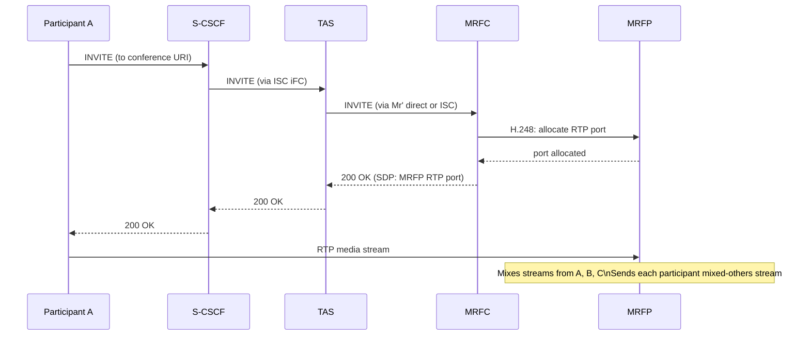

# MRF — Multimedia Resource Function (MRFC + MRFP)

**Spec reference:** 3GPP TS 23.228 §4.12

## Role

The MRF provides **in-network media processing** for IMS sessions. It is split into two components following the ITU-T BICC/H.248 decomposition model:

| Component | Role |
|---|---|
| **MRFC** | Controller: SIP signaling + H.248 control of MRFP |
| **MRFP** | Processor: actual RTP mixing, tone injection, transcoding, recording |

---

## MRFC Functions

| Function | Description |
|---|---|
| **SIP endpoint** | Appears as a SIP UAS/UAC; receives Mr from S-CSCF or TAS |
| **Conference controller** | Creates/manages conference resources on MRFP |
| **Announcement controller** | Triggers MRFP to play tones or announcements |
| **Transcoding control** | Instructs MRFP to transcode between codecs |
| **H.248 master** | Sends H.248 commands to MRFP to allocate ports, mix streams, inject tones |

## MRFP Functions

| Function | Description |
|---|---|
| **RTP mixer** | Mixes multiple RTP streams for conference; sends each participant a mix of others |
| **Tone generator** | Generates DTMF, ringback, busy tones, custom announcements |
| **Transcoder** | Converts between codecs (e.g. AMR-WB ↔ G.711) |
| **Media recorder** | Can record RTP streams (e.g. for voicemail) |
| **Bearer termination** | Terminates RTP/RTCP; connects to user media bearers |

---

## Interfaces

| Interface | Peer | Protocol | Purpose |
|---|---|---|---|
| **Mr** | S-CSCF or TAS/AS (direct) | SIP | Request media resources via S-CSCF; also direct AS→MRFC path. Used to establish media control channel. |
| **Mr'** | AS or MRB (direct) | SIP | Direct AS↔MRFC session control without passing through S-CSCF. Also used by MRB↔MRFC in In-Line mode. |
| **Cr** | AS or MRB | SIP + media control | AS↔MRFC media control: fetch/cache resources from AS (e.g. announcement files), send media control commands/notifications. |
| **Mp** | MRFP | H.248 (MEGACO) | MRFC controls MRFP: allocate ports, mix streams, inject tones, transcode. |

**Mr vs Mr'**: Mr goes through S-CSCF (uses ISC/Mr reference point); Mr' is a direct
AS-to-MRFC bypass that does not involve S-CSCF. Both use SIP.

**Cr interface detail**: establishment and management of the media control protocol is
done via SIP messages (sent direct via Mr' or via S-CSCF via ISC), then media control
commands flow over Cr. MRFC fetches announcement files/resources from AS over Cr.

---

## MRFC Capabilities (§8.1, TS 23.218)

### Tones and Announcements (§8.1.2)

- AS controls tone/announcement selection and is aware of MRFC capabilities
- MRFC accepts INVITE requests from AS (via Mr' direct or via S-CSCF using ISC)
- INVITE must contain either: (a) sufficient info to play the tone/announcement directly,
  or (b) info to link the request to a media control command via Cr
- Additional resources (e.g. announcement audio files) fetched from AS via Cr
- MRFC supports both offer/answer (RFC 3264) and offer/answer with preconditions
- **Termination**: BYE ends tone/announcement; alternatively AS may specify expiry time
  in INVITE SDP or media control command, after which MRFC auto-terminates and sends BYE

### Ad-Hoc Conferences / Multiparty Calls (§8.1.3)

- AS (conference focus) controls the conference; aware of MRFC capabilities
- MRFC accepts INVITE from AS (via Mr' or ISC) for conference management
- INVITE contains info to initiate, add, or remove parties
- re-INVITE used for floor control and party join/leave
- Media control commands (conference gain, mixing parameters) via Cr
- MRFC supports offer/answer with preconditions for SDP negotiation with AS

### Transcoding (§8.1.4)

- AS controls transcoding session
- MRFC accepts INVITE from AS (via Mr' or ISC) for transcoding
- Two SDP negotiation modes with AS:
  - **Offer/answer (RFC 3264)**: MRFC responds to INVITE with 200 OK indicating selected
    media; reserves local resources and returns resource identifiers in 200 OK
  - **Offer/answer with preconditions**: MRFC responds with 183 Session Progress
    indicating codec list; reserves resources when PRACK received; returns identifiers
    in 200 OK

---

## Conference Call Flow (simplified)

---

## Related Pages
- [S-CSCF](S-CSCF.md) — sends Mr requests to MRFC
- [TAS](TAS.md) — conference focus; controls MRFC via Mr/Mr'
- [AS Interaction Modes](../concepts/AS-interaction-modes.md) — AS access to MRFC via Cr/Mr'
- [IMS Reference Points](../interfaces/IMS-reference-points.md)
