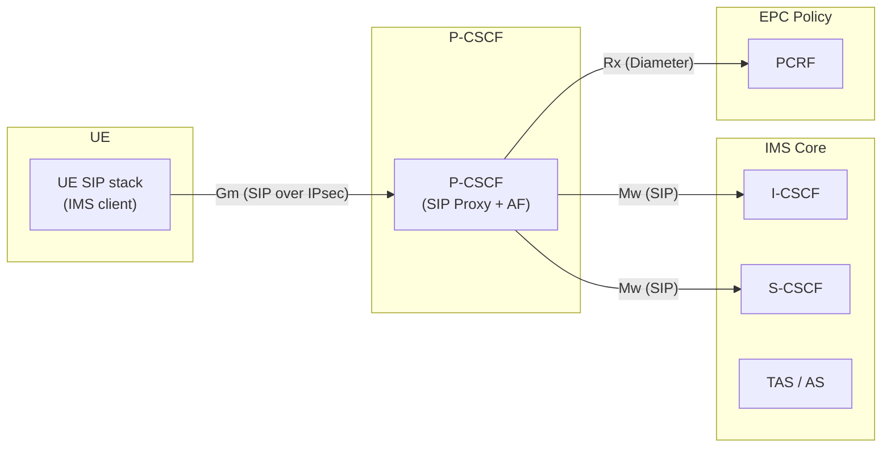
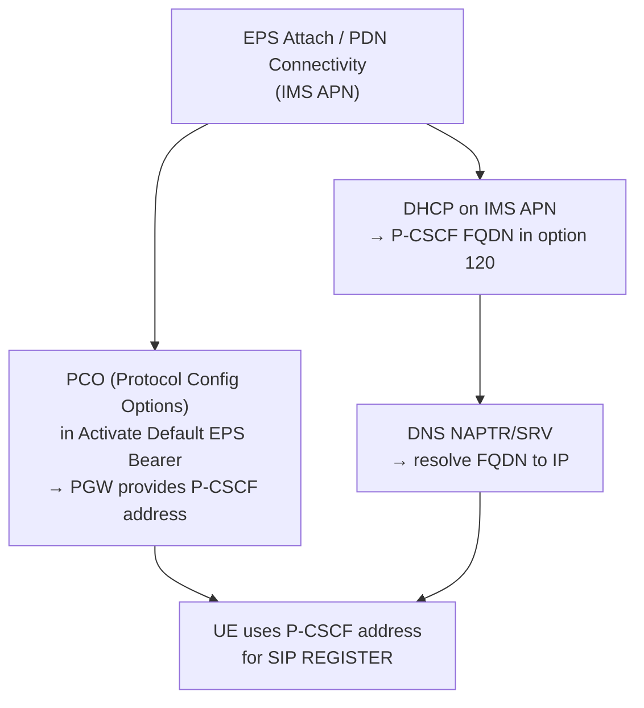
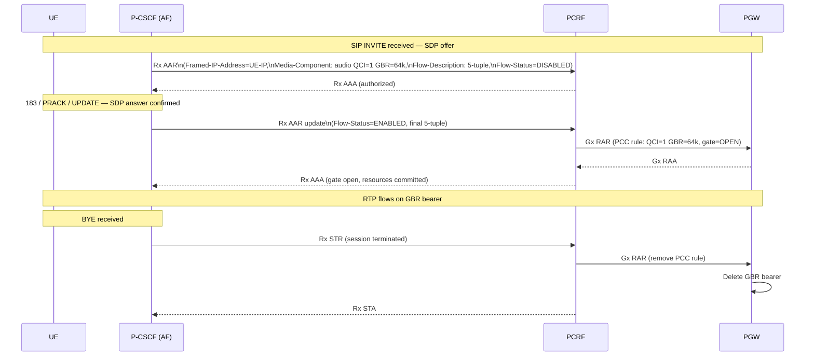
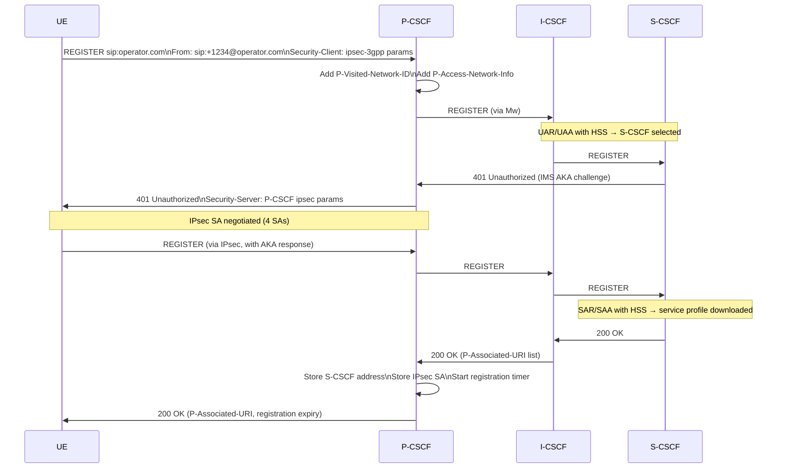
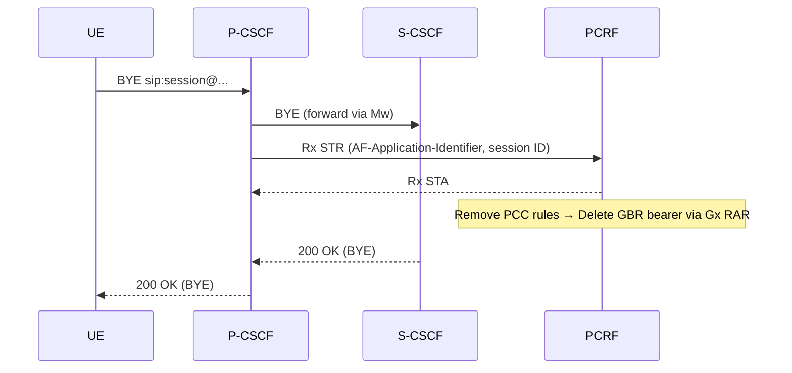
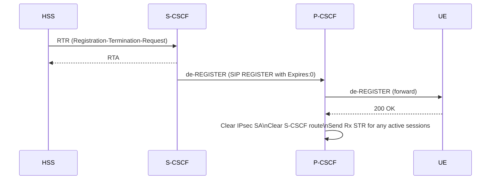
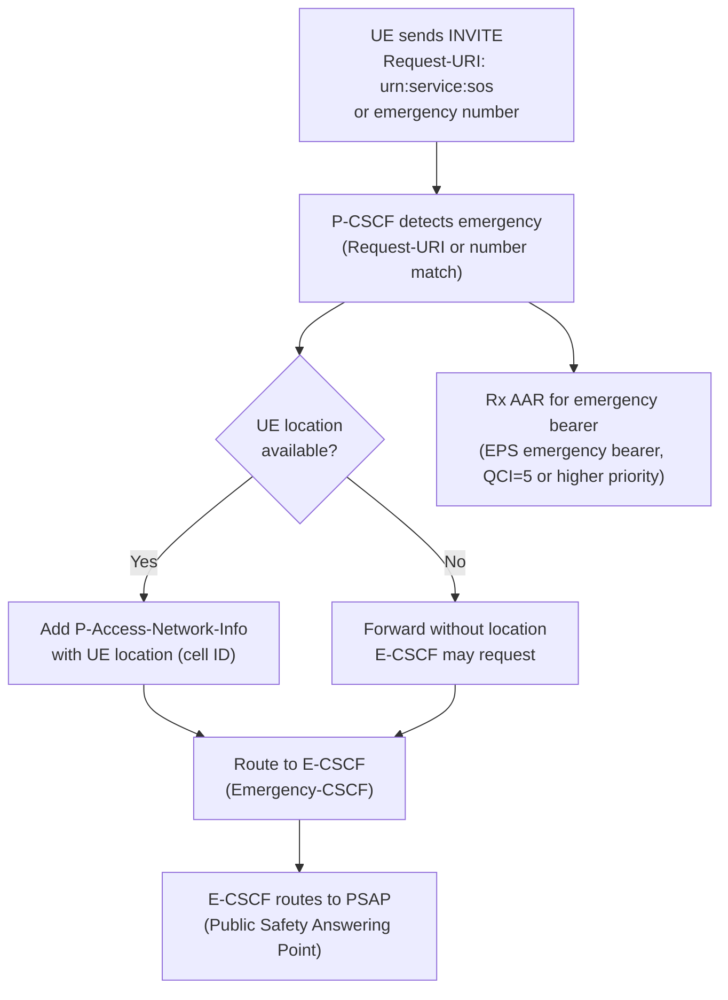
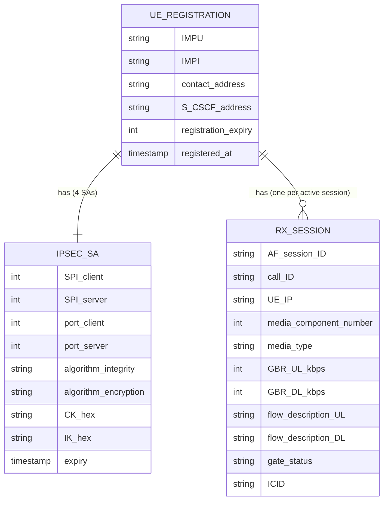
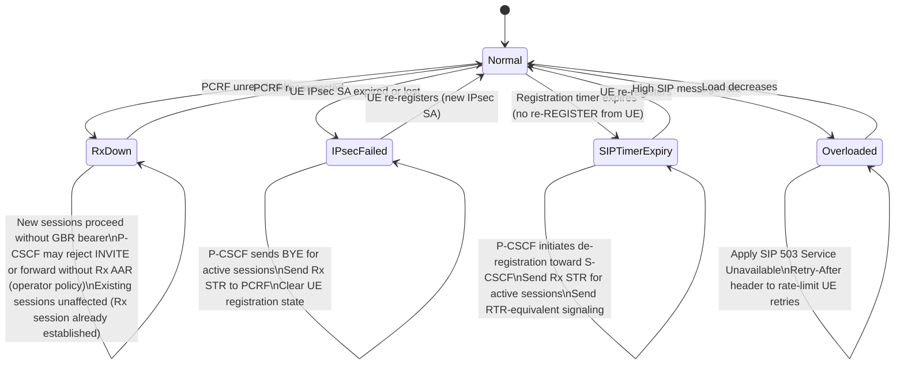

# P-CSCF Deep-Dive — Proxy Call Session Control Function

**Base entity page:** [P-CSCF.md](P-CSCF.md)
**Spec references:** TS 23.228 §4.6, §5.1–§5.4, §5.10–§5.11

---

## Architectural Position

The P-CSCF is the **UE's sole entry point into IMS** and the **IMS's sole entry point toward EPC bearer policy**. It sits between two worlds: the SIP/IMS domain (where it is a proxy) and the EPC policy domain (where it is an Application Function). Every IMS signaling message to and from the UE passes through it; every QoS request toward the EPC passes through its Rx interface.



**P-CSCF location:** Always in the **visited PLMN** (VPLMN) — even for home-routed roaming. The UE's SIP traffic always exits locally to the VPLMN P-CSCF; only the IMS core (I/S-CSCF) may be in the HPLMN.

---

## Complete Interface Table

| Interface | Peer | Protocol | Direction | Purpose |
|---|---|---|---|---|
| **Gm** | UE | SIP (UDP/TCP) + IPsec ESP | Bidirectional | UE ↔ IMS: all SIP registration and session messages; protected by IPsec SA |
| **Mw** | I-CSCF, S-CSCF | SIP (TCP/TLS) | Bidirectional | Forward SIP within IMS core; route REGISTER to I-CSCF, sessions to S-CSCF |
| **Rx** | PCRF | Diameter (Rx app) | Bidirectional | AF session: deliver media descriptions; authorize/gate QoS bearers; receive bearer event notifications |

---

## P-CSCF Discovery

The UE must discover its P-CSCF address before IMS registration. Three mechanisms:



PCO is the most common in LTE deployments — the PGW returns P-CSCF address(es) directly in the bearer setup response. DHCP/DNS provides a fallback and is used in more complex WLAN/IMS deployments.

---

## SIP Messages Handled

### Registration

| SIP Message | Direction | P-CSCF Action |
|---|---|---|
| REGISTER | UE → P-CSCF → I-CSCF | Add `P-Visited-Network-ID`, `P-Access-Network-Info`; forward to I-CSCF via Mw |
| 401 Unauthorized | I-CSCF → P-CSCF → UE | Forward IMS AKA challenge; save auth params for IPsec SA negotiation |
| REGISTER (with auth) | UE → P-CSCF → S-CSCF | Forward authenticated REGISTER; IPsec SA established at this point |
| 200 OK (REGISTER) | S-CSCF → P-CSCF → UE | Forward; extract `P-Associated-URI` list; store S-CSCF address for routing |
| de-REGISTER | UE → P-CSCF → S-CSCF | Forward de-registration; clear IPsec SA; clear Rx session if active |

**P-CSCF stores after successful registration:**
- UE's IPsec SA parameters (SPI, keys, ports)
- S-CSCF address (for routing subsequent session requests)
- Registered IMPU(s) for this UE
- Registration expiry timer

### Session (INVITE / BYE / UPDATE / PRACK)

| SIP Message | Direction | P-CSCF Action |
|---|---|---|
| INVITE | UE → P-CSCF → S-CSCF | Parse SDP offer; send Rx AAR (gate=DISABLED); forward INVITE |
| 183 Session Progress | S-CSCF → P-CSCF → UE | Parse SDP answer; update Rx AAR with final 5-tuple; open gate if preconditions met |
| PRACK | UE → P-CSCF → S-CSCF | Forward; part of reliable provisional response (100rel) |
| UPDATE | UE → P-CSCF → S-CSCF | SDP renegotiation; may trigger Rx AAR update |
| 200 OK (INVITE) | S-CSCF → P-CSCF → UE | Forward; send Rx AAR update (gate=ENABLED) if preconditions complete |
| ACK | UE → P-CSCF → S-CSCF | Forward; session established |
| BYE | UE/network → P-CSCF | Forward; send Rx STR → PCRF removes PCC rules → PGW deletes GBR bearer |
| CANCEL | UE → P-CSCF → S-CSCF | Forward; send Rx STR (abort pending authorization) |
| re-INVITE | Either → P-CSCF | Forward; update Rx session with new SDP if media changes |

---

## IPsec Security Architecture

The P-CSCF is the IMS security gateway. During IMS registration it negotiates IPsec SAs with the UE to protect all subsequent SIP signaling.

```mermaid
sequenceDiagram
    participant UE
    participant PCSCF as P-CSCF

    Note over UE,PCSCF: Step 1 — REGISTER with Security-Client header
    UE->>PCSCF: REGISTER\nSecurity-Client: ipsec-3gpp;\n  alg=hmac-sha-1-96; ealg=aes-cbc;\n  spi-c=12345; spi-s=67890;\n  port-c=5100; port-s=5101

    Note over UE,PCSCF: Step 2 — Forward challenge (IMS AKA via S-CSCF/HSS)
    PCSCF->>UE: 401 Unauthorized\nSecurity-Server: ipsec-3gpp;\n  alg=hmac-sha-1-96; ealg=aes-cbc;\n  spi-c=11111; spi-s=22222;\n  port-c=4500; port-s=4501;\nWWW-Authenticate: IMS AKA challenge

    Note over UE,PCSCF: Both sides derive keys from IMS AKA (CK+IK)\nFour SAs established: UE→PCSCF (protect+unprotect), PCSCF→UE (protect+unprotect)
    Note over UE,PCSCF: Step 3 — Protected REGISTER
    UE->>PCSCF: REGISTER (via IPsec ESP)\nAuthorization: IMS AKA response
    PCSCF->>UE: 200 OK (via IPsec ESP)

    Note over UE,PCSCF: All subsequent SIP on this port pair is ESP-protected
```

**Four IPsec SAs per UE-P-CSCF pair:**
- UE client port → P-CSCF server port: UE-originated messages (protected)
- P-CSCF client port → UE server port: P-CSCF-originated messages (protected)
- Plus two unprotected SAs used only for the initial un-authenticated REGISTER

**Key derivation:** Keys are derived from CK + IK received from S-CSCF (which got them from HSS via MAA). The UE independently derives the same keys from its USIM. Neither UE nor P-CSCF needs to exchange keys explicitly.

---

## AF Role — Rx Interface Behavior

The P-CSCF is the primary **Application Function (AF)** in IMS. Its Rx interactions are tightly coupled to SIP message processing:

### Rx Session Lifecycle



### Rx AAR Content (Derived from SDP)

| SDP Field | Rx AVP | Meaning |
|---|---|---|
| `m=audio 49152 RTP/AVP 98` | Media-Type=AUDIO | Voice stream |
| `b=AS:64` | Max-Requested-Bandwidth-UL/DL=64kbps | GBR value |
| `c=IN IP4 192.0.2.1` + port | Flow-Description (5-tuple) | SDF filter for TFT |
| RTCP port (RTP port + 1) | Media-Sub-Component (RTCP flow) | Separate sub-TFT entry |
| Codec (AMR-WB, G.711) | Used for QCI selection logic | → QCI=1 for voice |

**RTCP flows:** P-CSCF always adds a sub-component for the RTCP port (RTP port + 1, bidirectional) in addition to the RTP component. This ensures RTCP control traffic gets the same QCI treatment.

### P-CSCF Response to PCRF Notifications

The PCRF may send Rx RAR to the P-CSCF to notify of bearer events:

| PCRF → P-CSCF Notification | P-CSCF Action |
|---|---|
| Bearer lost (RAT change, congestion) | Trigger SIP re-INVITE or UPDATE to renegotiate media |
| Access type change (e.g. LTE → WLAN) | Notify UE via SIP of changed QoS characteristics |
| Bearer released (PCRF-initiated) | Trigger SIP session teardown (BYE) |

---

## P-Header Insertion

The P-CSCF adds 3GPP-specific SIP headers to all forwarded messages:

| Header | Value | Purpose |
|---|---|---|
| `P-Visited-Network-ID` | VPLMN identity string | Tells I-CSCF/S-CSCF which visited network the UE is in |
| `P-Access-Network-Info` | Access type + location (3GPP-E-UTRAN-FDD; UTRAN-cell-id; GERAN-cell-id) | Access type and UE location for charging and policy |
| `P-Associated-URI` | List of registered IMPUs | Inserted in 200 OK to REGISTER; tells UE all its registered public identities |
| `P-Called-Party-ID` | Terminating IMPU | Added on terminating side to identify which IMPU was dialed |
| `P-Charging-Vector` | ICID + IOI | IMS charging correlation ID; P-CSCF inserts initial ICID on originating side |
| `P-Early-Media` | Authorization flag | Controls early media (ringback tone) before 200 OK |

---

## Procedure Participation

### 1. IMS Initial Registration



### 2. VoLTE MO Call (Originating)

P-CSCF receives INVITE from UE, triggers Rx AAR (gate disabled), forwards to S-CSCF. On SDP answer (183/200 OK), updates Rx session, enables gate. On BYE, sends Rx STR.

**Key P-CSCF actions:**
1. Parse SDP offer → extract media type, bandwidth, IP/port
2. Rx AAR with gate=DISABLED (preconditions phase)
3. Forward INVITE to S-CSCF (add `P-Charging-Vector` with fresh ICID)
4. On 183 with SDP answer: update Rx session with final 5-tuple
5. On preconditions complete: Rx AAR update gate=ENABLED
6. On 200 OK ACK: session established
7. On BYE: Rx STR → bearer released

### 3. VoLTE MT Call (Terminating)

P-CSCF is in the SIP path for the terminating leg:
1. Receives INVITE from S-CSCF (Mw)
2. Parses SDP offer from remote party
3. Sends Rx AAR to PCRF (for terminating UE's PDN connection bearer)
4. Forwards INVITE to UE (via Gm, IPsec protected)
5. Relays 183, PRACK, UPDATE, 200 OK back toward originating side
6. On BYE: Rx STR

### 4. Session Release



**P-CSCF-initiated session release (network side):** If the P-CSCF detects that the SIP signaling bearer is lost (e.g. IPsec SA expired, S1 release with no reachability), it sends Rx STR to PCRF to release the GBR bearer, and may send a BYE toward the network to terminate the IMS session.

### 5. Re-registration

UE sends periodic REGISTER before expiry. P-CSCF forwards; on 200 OK, resets registration timer. No new IPsec SA needed — existing SA reused.

### 6. Network-Initiated De-registration (RTR from HSS)



---

## Signaling Compression (SigComp)

P-CSCF supports optional SIP compression via **SigComp** (RFC 3486) to reduce over-the-air bandwidth consumption for SIP messages:

- UE signals SigComp support in REGISTER (`comp=sigcomp` in Via header)
- P-CSCF and UE negotiate a shared compression state machine
- Compressed SIP messages are 5-10x smaller than uncompressed
- Only applies to Gm (UE ↔ P-CSCF) — Mw uses full SIP
- Important for NB-IoT and legacy narrow-band access where SIP overhead is significant

---

## Emergency Call Handling

P-CSCF plays a special role in IMS emergency calls:



- P-CSCF detects emergency URIs or numbers
- Inserts location (P-Access-Network-Info with ECGI/cell-ID)
- Routes toward E-CSCF (not I-CSCF)
- Triggers emergency bearer via Rx (separate from normal Gx session; uses emergency PDN if applicable)
- Works even for unauthenticated UEs (limited-service state)

---

## P-CSCF State per UE Registration



---

## Failure and Overload Behavior



---

## Configuration Parameters

| Parameter | Description |
|---|---|
| Gm IP address / port | SIP listening address for UE connections (port 5060 / 5061 TLS) |
| Mw peer addresses | I-CSCF and S-CSCF addresses for SIP forwarding |
| PCRF address (Rx) | Diameter realm/hostname for Rx sessions |
| IPsec algorithms | Supported integrity (HMAC-SHA-1) and encryption (AES-CBC, 3DES) algorithms |
| SPI allocation range | SPI values for IPsec SA negotiation |
| P-Visited-Network-ID string | Operator's network identity string (VPLMN identifier) |
| Registration timer | Default registration expiry (suggested to UE, typically 3600s) |
| SigComp support | Whether SIP compression is enabled |
| Emergency URI list | Numbers/URNs that trigger emergency call handling |
| E-CSCF address | Where to route emergency INVITEs |
| Rx timeout | How long to wait for PCRF AAA before proceeding (or rejecting) |
| Gate control mode | Whether to enforce 2-phase gate (precondition-based) or immediate |
| P-CSCF overload threshold | SIP message rate triggering 503 responses |

---

## Key Architectural Properties

| Property | Details |
|---|---|
| **Always in VPLMN** | P-CSCF is in the visited network; the IMS core (I/S-CSCF) may be in the HPLMN. This keeps the SIP/IPsec termination local |
| **IPsec termination** | P-CSCF is the only node that terminates the UE's IPsec SA — all other IMS nodes see plaintext SIP |
| **Single hop from UE** | UE uses P-CSCF as SIP outbound proxy for all requests; Route header set by P-CSCF points to S-CSCF |
| **Stateful for charging** | P-CSCF inserts P-Charging-Vector with ICID (IMS Charging ID) — correlates SIP dialog with CDRs across all IMS nodes |
| **Dual role** | Simultaneously a SIP proxy (for the IMS core) and a Diameter client (for the EPC PCRF). Neither role can function without the other in VoLTE |
| **No subscriber data** | P-CSCF has no access to HSS; it does not know the subscriber's iFC, IMPI, or service profile. It relies entirely on what S-CSCF includes in SIP headers |

---

## Cross-References

| Topic | Page |
|---|---|
| P-CSCF base entity | [entities/P-CSCF.md](P-CSCF.md) |
| I-CSCF (Mw peer, IMS entry) | [entities/I-CSCF.md](I-CSCF.md) |
| S-CSCF (Mw peer, registrar) | [entities/S-CSCF.md](S-CSCF.md) |
| PCRF (Rx policy peer) | [entities/PCRF.md](PCRF.md) |
| PCRF deep-dive | [entities/PCRF-deepdive.md](PCRF-deepdive.md) |
| IMS Identity Model | [concepts/IMS-identity-model.md](../concepts/IMS-identity-model.md) |
| IMS Registration | [procedures/IMS-registration.md](../procedures/IMS-registration.md) |
| IMS QoS bearer | [procedures/IMS-QoS-bearer.md](../procedures/IMS-QoS-bearer.md) |
| VoLTE MO call | [procedures/VoLTE-MO-call.md](../procedures/VoLTE-MO-call.md) |
| VoLTE MT call | [procedures/VoLTE-MT-call.md](../procedures/VoLTE-MT-call.md) |
| Session release | [procedures/session-release.md](../procedures/session-release.md) |
| IMS reference points | [interfaces/IMS-reference-points.md](../interfaces/IMS-reference-points.md) |
