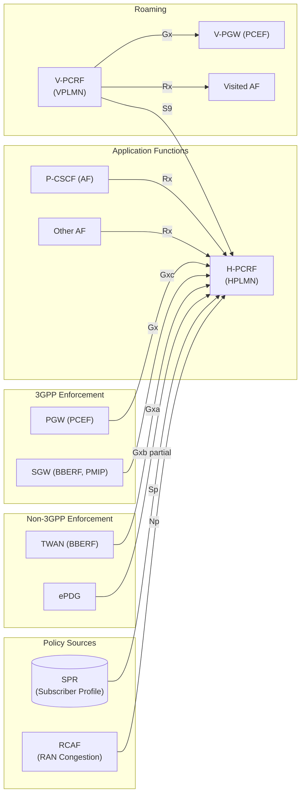
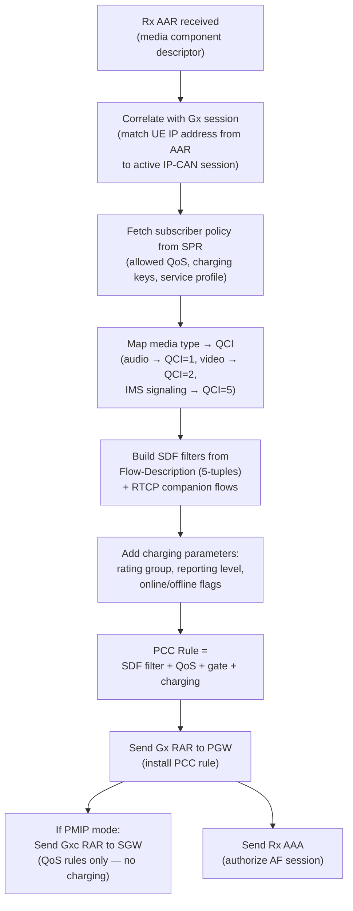
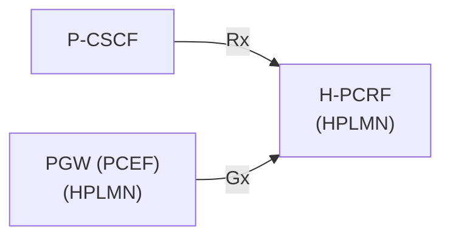
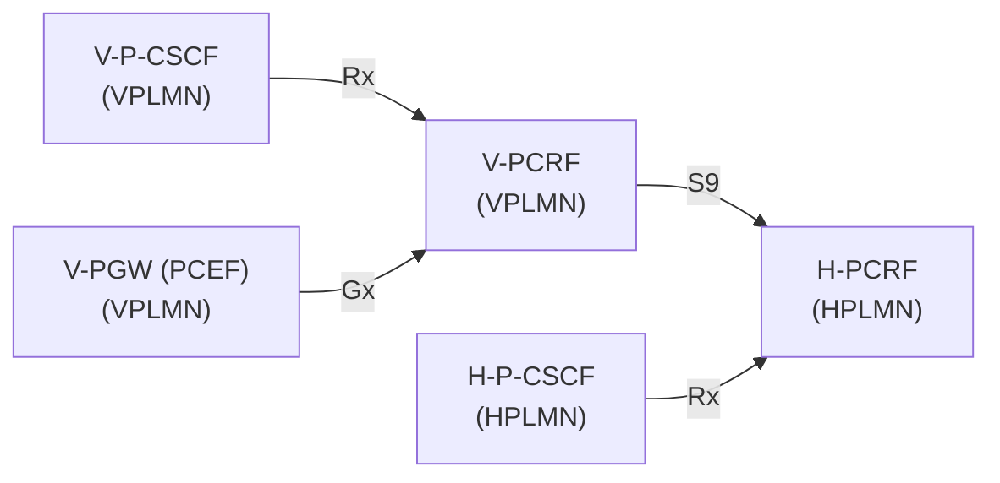
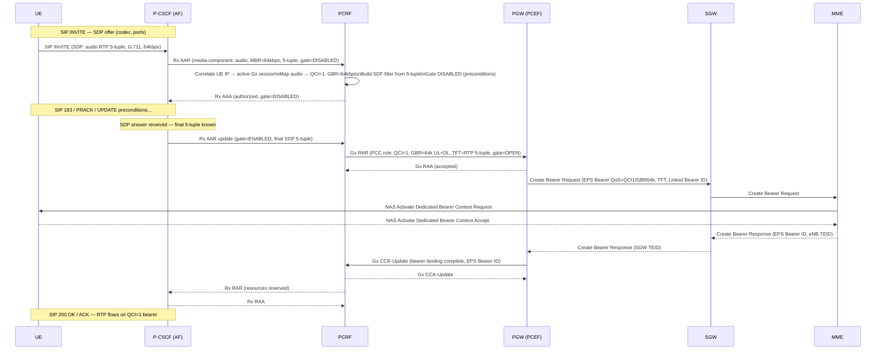
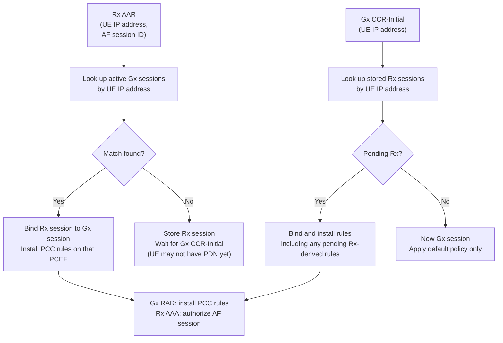
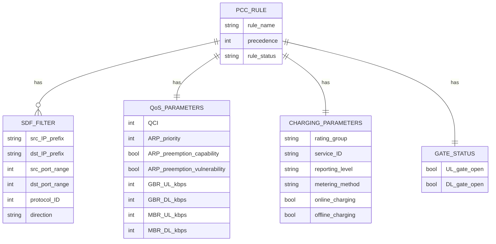
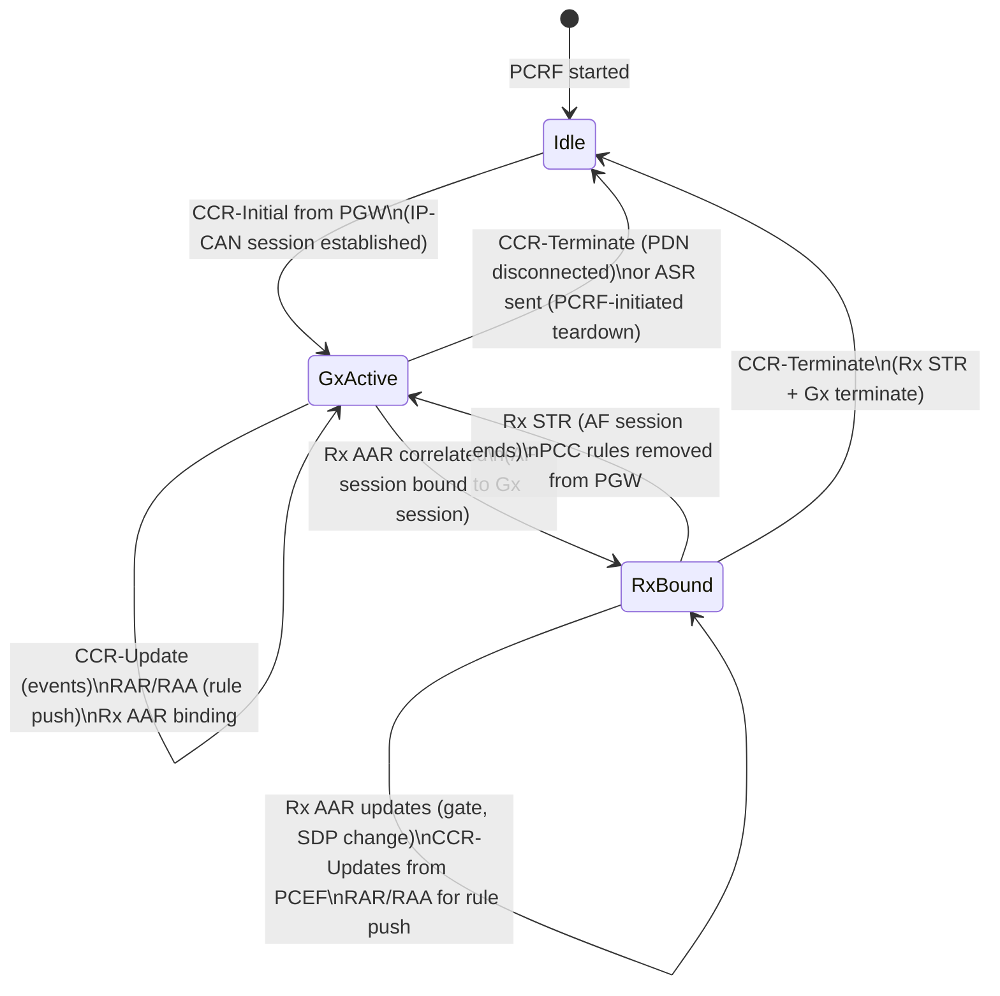
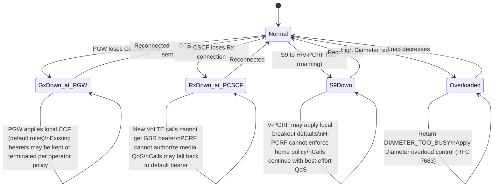

# PCRF Deep-Dive — Policy and Charging Rules Function

**Base entity page:** [PCRF.md](PCRF.md)
**Spec references:** TS 23.203 (primary); TS 23.401 §4.4.7; TS 23.228 §5.4.5; TS 23.402 §4.3/§4.10/§5/§6/§7

---

## Architectural Position

The PCRF is the **policy decision point** of the EPC and IMS. It receives service descriptions from Application Functions (via Rx) and subscriber policy from the SPR, correlates them with active IP-CAN sessions (via Gx), and delivers PCC rules to enforcement points (PGW/PCEF, SGW/BBERF, ePDG/TWAN). In the non-3GPP domain it also terminates Gxa (trusted access) and Gxc (PMIP S5/S8 BBERF). In roaming, two PCRFs coordinate via S9.

---

## Complete Interface Table

| Interface | Peer | Protocol | Direction | Purpose |
|---|---|---|---|---|
| **Gx** | PGW (PCEF) | Diameter (Gx app) | Bidirectional | Push PCC rules to PCEF; receive IP-CAN events, RAT/location, usage |
| **Gxc** | SGW (BBERF) | Diameter (Gxc app) | Bidirectional | PMIP S5/S8: GW Control Session with BBERF; deliver QoS rules |
| **Gxa** | TWAN (trusted non-3GPP BBERF) | Diameter (Gxa app) | Bidirectional | Trusted non-3GPP: GW Control Session with TWAN BBERF |
| **Gxb** | ePDG (untrusted non-3GPP) | Diameter (Gxb app) | Bidirectional | Untrusted non-3GPP: partially specified in Rel-15; PCC to ePDG |
| **Rx** | AF (P-CSCF, AS, other) | Diameter (Rx app) | Bidirectional | Receive media/service descriptions; authorize QoS; gate control |
| **S9** | V-PCRF ↔ H-PCRF | Diameter (S9 app) | Bidirectional | Roaming: H-PCRF ↔ V-PCRF policy coordination (local breakout) |
| **Sp** | SPR (Subscriber Profile Repository) | Internal/vendor | PCRF ← SPR | Fetch subscriber policy data: allowed QoS, charging keys, service profiles |
| **Np** | RCAF (RAN Congestion AF) | Diameter (Np app) | RCAF → PCRF | Receive RAN user-plane congestion information for policy decisions |

---

## Diameter Messages — Gx Interface

### IP-CAN Session Lifecycle

| Message | Direction | Trigger |
|---|---|---|
| CCR-Initial (IP-CAN Session Establishment) | PGW → PCRF | PDN connection created; PCEF registers with PCRF |
| CCA-Initial | PCRF → PGW | Initial PCC rules installed; default bearer QoS, gates, APN-AMBR |
| CCR-Update (IP-CAN Session Modification) | PGW → PCRF | RAT type change, ULI change, bearer binding event, usage threshold crossed, AN-GW change |
| CCA-Update | PCRF → PGW | Updated PCC rules; may add/remove/modify rules in response to event |
| CCR-Terminate (IP-CAN Session Termination) | PGW → PCRF | PDN connection deleted |
| CCA-Terminate | PCRF → PGW | Acknowledges; PCRF removes session state |
| RAR (Re-Auth-Request) — PCC Rules Provision | PCRF → PGW | PCRF-initiated rule push (e.g. Rx-triggered VoLTE bearer, operator policy change) |
| RAA (Re-Auth-Answer) | PGW → PCRF | Acknowledges rule installation; may include result/binding status |
| ASR (Abort-Session-Request) | PCRF → PGW | PCRF terminates IP-CAN session (e.g. subscription revoked) |
| ASA (Abort-Session-Answer) | PGW → PCRF | Confirms session abort |

### Key CCR-Update Event Triggers

| Event | PCRF Response |
|---|---|
| RAT type change (e.g. LTE → WLAN) | Re-evaluate policies; update APN-AMBR, QoS rules |
| UE location change (new cell/TA) | Check location-based policy; update if applicable |
| Bearer binding event (UL/DL gate change) | Update gate status in PCC rule |
| Usage threshold crossed | Trigger online charging refresh or apply throttle rule |
| AN-GW (SGW) change | Update GW Control Session binding; re-provision QoS |

---

## Diameter Messages — Gxc Interface (PMIP / BBERF)

The Gxc interface mirrors Gx but targets the SGW (BBERF) instead of the PGW. It carries **QoS Rules** (not full PCC rules — no charging parameters at the BBERF).

| Message | Direction | Purpose |
|---|---|---|
| CCR-Initial (GW Control Session Establishment) | SGW → PCRF | BBERF registers: IMSI, APN, RAT type, UE location, requested IP-CAN type |
| CCA-Initial | PCRF → SGW | QoS Rules installed at BBERF (event triggers, APN-AMBR, default bearer QoS) |
| CCR-Update (GW Control + QoS Rules Request) | SGW → PCRF | RAT/location change, resource request from UE (§5.5), HO re-establishment |
| CCA-Update | PCRF → SGW | Updated QoS Rules; BBERF generates TFT and drives bearer update to MME |
| CCR-Terminate (GW Control Session Termination) | SGW → PCRF | PDN disconnection or detach |
| CCA-Terminate | PCRF → SGW | Acknowledges |
| RAR (QoS Rules Provision) | PCRF → SGW | Dedicated bearer trigger: PCRF pushes QoS rule to BBERF |
| RAA | SGW → PCRF | Acknowledges; BBERF generates TFT and sends Create Bearer Request to MME |

**Gx vs Gxc distinction:**

| Aspect | Gx (PGW/PCEF) | Gxc (SGW/BBERF) |
|---|---|---|
| Carries PCC rules? | Yes (full: SDF filter + QoS + charging) | No — QoS rules only (no charging params) |
| Charging enforcement? | Yes (PCEF enforces charging) | No (SGW has no charging role in PMIP mode) |
| TFT generation? | PGW generates from PCC rule filters | SGW generates from QoS rule (BBERF role) |
| Session type | IP-CAN Session | GW Control Session |
| PCRF also sends to PGW? | Yes (B.2 PCC Rules Provision after bearer up) | PGW still receives B.2 separately |

---

## Diameter Messages — Gxa Interface (Trusted Non-3GPP)

Gxa is functionally identical to Gxc — it connects the PCRF to the trusted access BBERF (TWAN/WLAN gateway).

| Message | Direction | Purpose |
|---|---|---|
| CCR-Initial (GW Control Session Establishment) | TWAN → PCRF | Trusted non-3GPP attach: BBERF registers with PCRF |
| CCA-Initial | PCRF → TWAN | QoS Rules provision for trusted access |
| CCR-Update | TWAN → PCRF | Location/RAT change, UE resource request (§6.7) |
| CCA-Update | PCRF → TWAN | Updated QoS rules |
| CCR-Terminate | TWAN → PCRF | Trusted non-3GPP detach |
| RAR | PCRF → TWAN | PCRF-initiated rule push |

---

## Diameter Messages — Rx Interface

The Rx interface is how Application Functions (primarily P-CSCF) describe media sessions to the PCRF. This is the IMS ↔ EPC policy bridge.

| Message | Direction | Trigger |
|---|---|---|
| AAR (AA-Request) | AF → PCRF | Session setup or modification: deliver media component descriptor (SDP-derived) |
| AAA (AA-Answer) | PCRF → AF | Authorization result; may include IP flow information (gate status, QoS) |
| RAR (Re-Auth-Request) | PCRF → AF | PCRF notifies AF of bearer change (e.g. access type change, congestion) |
| RAA (Re-Auth-Answer) | AF → PCRF | Acknowledges notification |
| STR (Session-Termination-Request) | AF → PCRF | Session ends; AF instructs PCRF to remove Rx session and associated PCC rules |
| STA (Session-Termination-Answer) | PCRF → AF | Acknowledges; PCRF removes rules from PGW via Gx RAR |
| ASR (Abort-Session-Request) | PCRF → AF | PCRF initiates session teardown (e.g. bearer lost) |
| ASA (Abort-Session-Answer) | AF → PCRF | Acknowledges |

### Rx Media Component Descriptor (AAR Payload)

The P-CSCF derives this from the SDP offer/answer negotiated between endpoints:

| Field | Meaning | Maps to PCC |
|---|---|---|
| Media-Component-Number | Identifies this media stream | SDF rule group |
| Media-Type | audio / video / data | QCI selection |
| Max-Requested-Bandwidth-UL/DL | Codec bandwidth | GBR UL/DL in PCC rule |
| Flow-Description | IP 5-tuple (src/dst IP, port, protocol) | SDF filter in PCC rule |
| Flow-Status | ENABLED / DISABLED / REMOVED | Gate open/close |
| AF-Charging-Identifier | P-CSCF charging ID for this session | Linked to IMS CDR |
| Media-Sub-Component | Per-flow component (RTP + RTCP separately) | Separate TFT entries |

---

## Core PCRF Function: PCC Rule Generation

When the PCRF correlates an Rx session with a Gx session, it synthesizes PCC rules:

### QCI Mapping (Voice/Video/Signaling)

| Media Type | QCI | Characteristic |
|---|---|---|
| VoLTE RTP (voice) | 1 | GBR, conversational, 100ms delay budget |
| Video call RTP | 2 | GBR, conversational, 150ms delay budget |
| IMS signaling (SIP) | 5 | Non-GBR, IMS signaling, default bearer |
| Video streaming | 4 | GBR, real-time video |
| Default internet | 9 | Non-GBR, best-effort |

---

## Roaming Architecture

### Non-Roaming / Home-Routed Roaming

Single PCRF. No S9. P-CSCF and PGW both in HPLMN (or P-CSCF in VPLMN with Rx to H-PCRF).

### Local Breakout Roaming

In local breakout, the V-PCRF is the enforcement coordinator:
- V-PCRF terminates Gx from V-PGW and Rx from visited AF
- V-PCRF requests policy authorization from H-PCRF via S9
- H-PCRF applies home subscriber policy; V-PCRF applies visited network constraints
- H-PCRF can also receive Rx from home AF and push rules toward V-PCRF via S9

### S9 Diameter Messages

| Message | Direction | Purpose |
|---|---|---|
| CCR-Initial (S9 session) | V-PCRF → H-PCRF | Establish S9 session; carry IP-CAN session info |
| CCA-Initial | H-PCRF → V-PCRF | Home policy returned (PCC rules / QoS rules) |
| CCR-Update | V-PCRF → H-PCRF | Notify home of Rx event, bearer change, location change |
| CCA-Update | H-PCRF → V-PCRF | Updated home policy |
| CCR-Terminate | V-PCRF → H-PCRF | Session ends |
| RAR | H-PCRF → V-PCRF | H-PCRF pushes new rules (Rx-triggered from home AF) |
| RAA | V-PCRF → H-PCRF | Acknowledges |

---

## VoLTE Bearer Trigger — End-to-End Flow

The PCRF's most important procedure: translating a SIP call setup into a GBR dedicated bearer.

### Gate Control (Preconditions)

The PCRF implements two-phase gate control for IMS preconditions:

1. **Phase 1 (gate DISABLED):** Rx AAR arrives with gate closed — PCRF creates PCC rule but with gate=CLOSED. Bearer is established but traffic is blocked.
2. **Phase 2 (gate ENABLED):** After SDP answer exchange confirms media path — Rx AAR update with gate=ENABLED. PCRF sends Gx RAR with gate=OPEN. PGW opens gate; RTP flows.

This prevents media from flowing before both endpoints have confirmed their RTP parameters.

---

## PCRF Session Correlation

The PCRF must correlate Rx sessions (from P-CSCF) with Gx sessions (from PGW) to install rules on the correct IP-CAN session.

**Correlation key:** UE's IP address (from Rx AAR Framed-IP-Address and Gx CCR UE-IP-Address AVPs). In IPv6 the prefix is used.

---

## PCC Rule Structure

A PCC rule is the atomic unit of PCRF output. Each rule specifies enforcement for one service data flow:

---

## PCRF Session State Machine

One PCRF session per PDN connection (Gx). Multiple Rx sessions may bind to a single Gx session (e.g. multiple simultaneous VoLTE calls on the same PDN connection).

---

## PCRF in Non-3GPP Access

The PCRF's role expands across all access types. The key difference is **which BBERF** it talks to on Gxa/Gxc:

| Access Type | BBERF Interface | PCC Enforcement Split |
|---|---|---|
| 3GPP LTE (GTP S5/S8) | None — PGW is sole enforcement point | PCRF → Gx → PGW only |
| 3GPP LTE (PMIP S5/S8) | Gxc → SGW (BBERF) | PCRF → Gxc → SGW (QoS rules) + Gx → PGW (PCC rules, B.2 after bearer up) |
| Trusted non-3GPP (S2a) | Gxa → TWAN (BBERF) | PCRF → Gxa → TWAN (QoS rules) + Gx → PGW (PCC rules) |
| Untrusted non-3GPP (S2b) | Gxb → ePDG (partial, Rel-15) | PCRF → Gx → PGW (primary path); Gxb toward ePDG not fully standardized |

**Key constraint:** When a UE has simultaneous 3GPP + non-3GPP connections (MAPCON), the PCRF maintains separate Gx sessions per PDN connection per access. PCC rules are delivered independently to each PCEF.

---

## Failure and Overload Behavior

---

## Configuration Parameters

| Parameter | Description |
|---|---|
| Gx realm / peer list | PGW addresses/realms for Gx sessions |
| Gxc realm | SGW addresses/realms for BBERF sessions (PMIP mode) |
| Gxa realm | TWAN addresses/realms for trusted non-3GPP sessions |
| Rx realm / AF whitelist | Authorized AF identities allowed to send AAR |
| SPR address | Subscriber Profile Repository endpoint (or co-located) |
| S9 peer (H-PCRF or V-PCRF) | Roaming peer address |
| Default PCC rules per APN | Rules applied at IP-CAN session establishment before Rx binding |
| QCI mapping table | Media-type → QCI mapping (configurable per operator) |
| GBR bandwidth allocation | Max GBR per session / per subscriber |
| Preemption policy | ARP preemption capability/vulnerability defaults |
| Gate control mode | Precondition-based (2-phase) vs immediate gate open |
| Rx session idle timeout | How long to wait for matching Gx session before discarding pending Rx |
| Congestion policy (Np) | Actions on RCAF congestion report: throttle / block / deprioritize |

---

## Key Architectural Properties

| Property | Details |
|---|---|
| **Policy decision point only** | PCRF makes decisions but does not enforce — it delegates to PCEF (PGW) and BBERF (SGW/TWAN) |
| **Session correlation is critical** | Rx → Gx binding by UE IP address is the mechanism that connects IMS call setup to EPS bearer modification |
| **Gx session per PDN connection** | Each UE PDN connection has its own Gx session; one UE may have multiple parallel Gx sessions |
| **Rx session per AF dialog** | One Rx session per SIP dialog leg at P-CSCF; one Rx session may add multiple PCC rules |
| **No user-plane involvement** | PCRF is purely Diameter signaling; it never sees RTP packets |
| **Cross-access visibility** | In MAPCON, PCRF correlates multiple Gx sessions for same UE on different access types simultaneously |
| **Home PLMN authority** | H-PCRF always has final authority on subscriber QoS policy; V-PCRF can only further restrict, not expand |

---

## Cross-References

| Topic | Page |
|---|---|
| PCRF base entity | [entities/PCRF.md](PCRF.md) |
| PGW (PCEF, Gx consumer) | [entities/PGW.md](PGW.md) |
| PGW deep-dive | [entities/PGW-deepdive.md](PGW-deepdive.md) |
| SGW (BBERF, Gxc) | [entities/SGW.md](SGW.md) |
| SGW deep-dive | [entities/SGW-deepdive.md](SGW-deepdive.md) |
| P-CSCF (AF, Rx) | [entities/P-CSCF.md](P-CSCF.md) |
| EPS bearer model | [concepts/EPS-bearer.md](../concepts/EPS-bearer.md) |
| Dedicated bearer lifecycle | [procedures/dedicated-bearer.md](../procedures/dedicated-bearer.md) |
| IMS QoS bearer | [procedures/IMS-QoS-bearer.md](../procedures/IMS-QoS-bearer.md) |
| VoLTE MO call | [procedures/VoLTE-MO-call.md](../procedures/VoLTE-MO-call.md) |
| VoLTE MT call | [procedures/VoLTE-MT-call.md](../procedures/VoLTE-MT-call.md) |
| PMIP S5/S8 procedures | [procedures/PMIP-S5S8-procedures.md](../procedures/PMIP-S5S8-procedures.md) |
| Trusted non-3GPP attach | [procedures/trusted-non3GPP-attach.md](../procedures/trusted-non3GPP-attach.md) |
| Non-3GPP architecture | [concepts/non-3GPP-access-architecture.md](../concepts/non-3GPP-access-architecture.md) |
| EPC reference points | [interfaces/reference-points.md](../interfaces/reference-points.md) |
| IMS reference points | [interfaces/IMS-reference-points.md](../interfaces/IMS-reference-points.md) |
