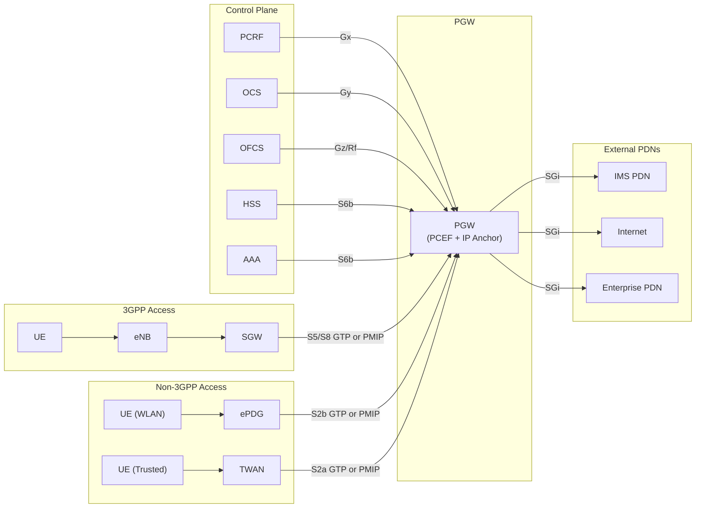
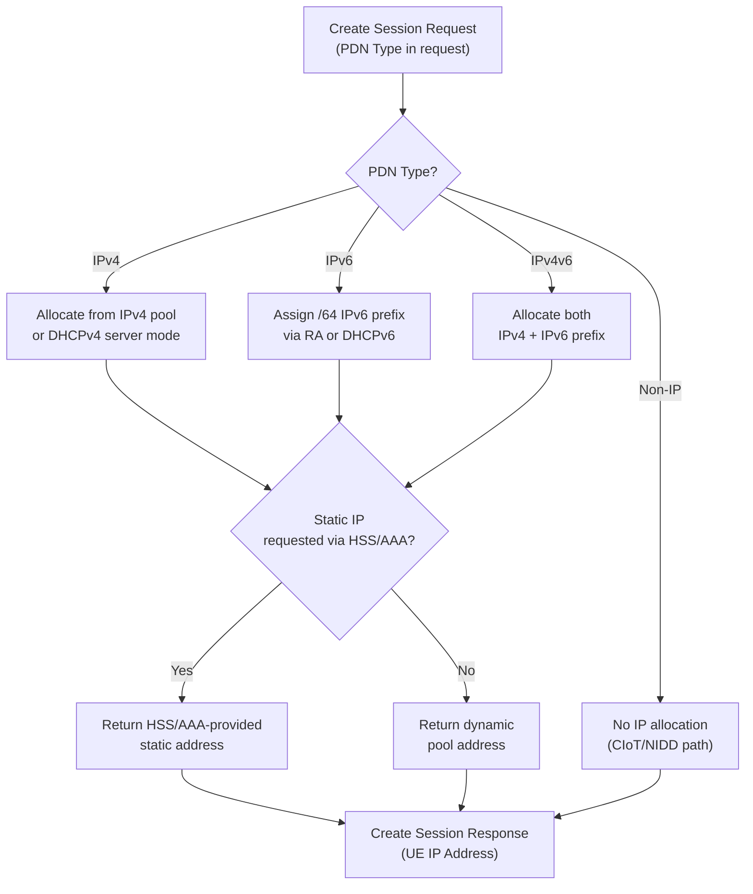
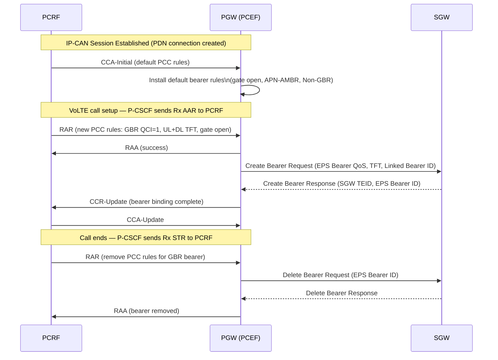
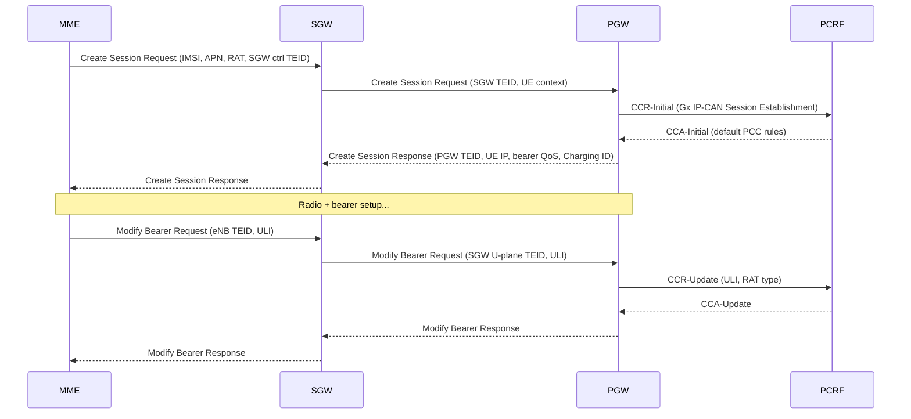
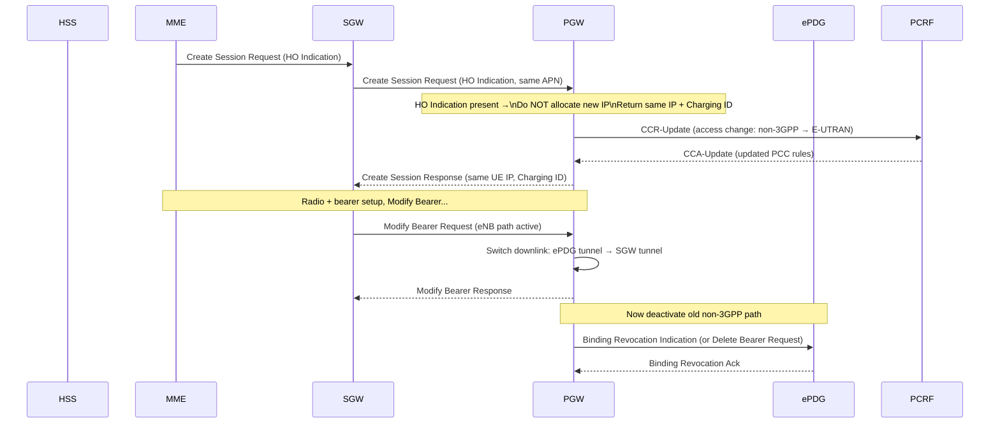
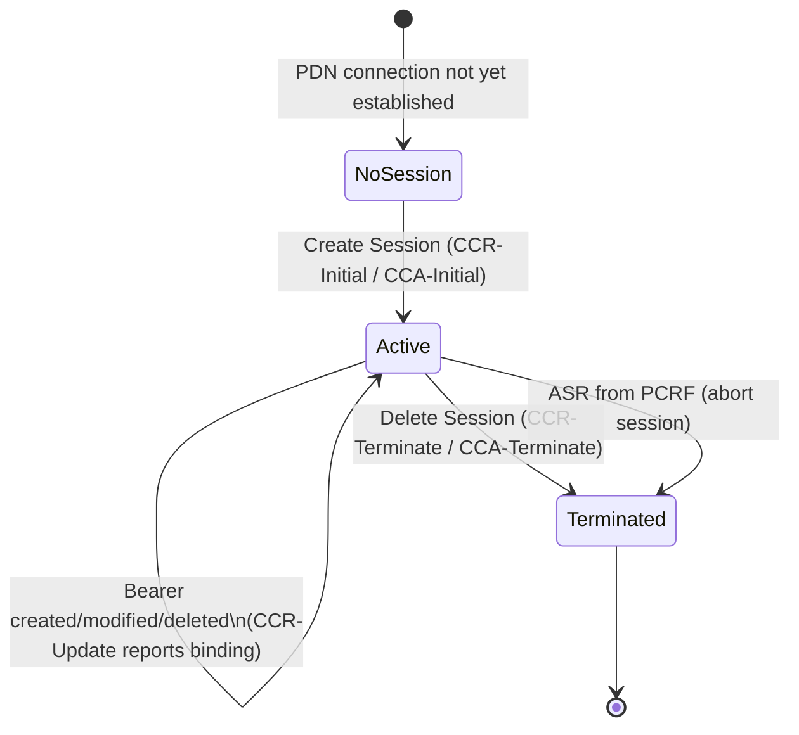
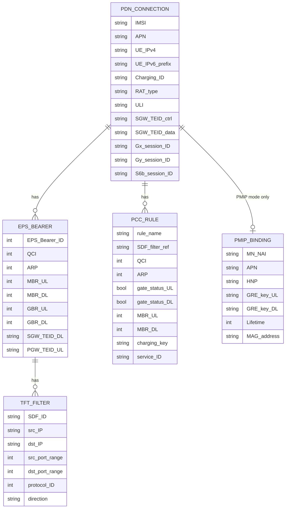
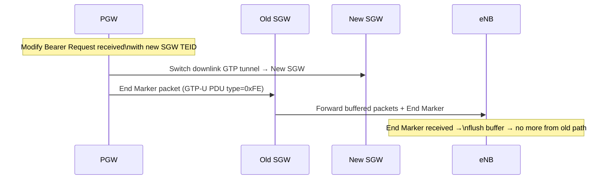
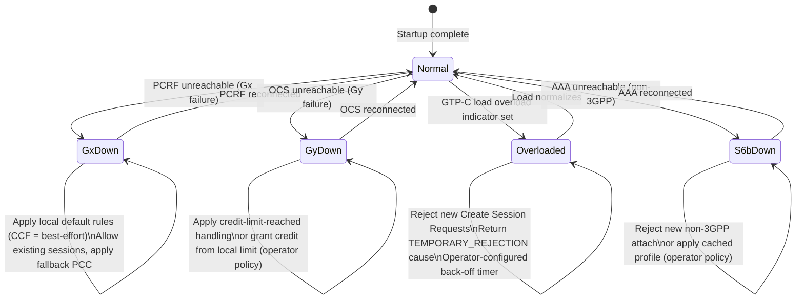

# PGW Deep-Dive — PDN Gateway

**Base entity page:** [PGW.md](PGW.md)
**Spec references:** TS 23.401 §4.4.3.3, §5; TS 23.402 §4–§8; TS 23.228 §4–§5

---

## Architectural Position

The PGW is the EPC's **IP anchor and policy enforcement point**. It sits at the boundary between the EPC and every external PDN, and is the last node that all user-plane traffic passes through in both directions. It hosts the PCEF and is the termination point of the Gx/Gy/Gz Diameter interfaces. In IMS scenarios it is indirectly involved via the PCRF's Rx-to-Gx rule translation.

---

## Complete Interface Table

| Interface | Peer | Protocol | Direction | Purpose |
|---|---|---|---|---|
| **S5** | SGW (same PLMN) | GTPv2-C (ctrl) + GTP-U (data) | Bidirectional | Bearer management + user plane for 3GPP intra-PLMN |
| **S8** | SGW (VPLMN) | GTPv2-C (ctrl) + GTP-U (data) | Bidirectional | Home-routed roaming variant of S5 |
| **S5/S8 (PMIP)** | SGW as BBERF | PMIPv6 (ctrl) + GRE (data) | Bidirectional | PMIP S5/S8 variant — SGW manages bearers (TS 23.402 §5) |
| **S2a** | Trusted non-3GPP (TWAN/FA) | PMIPv6 or GTP or MIPv4 FACoA | Bidirectional | Trusted WLAN access (TS 23.402 §6) |
| **S2b** | ePDG | GTPv2-C + GTP-U or PMIPv6 + GRE | Bidirectional | Untrusted WLAN access via ePDG (TS 23.402 §7) |
| **S2c** | UE (directly) | DSMIPv6 over IKEv2/IPsec | Bidirectional | UE-managed mobility — PGW acts as HA (TS 23.402 §4.3.3) |
| **SGi** | External PDN | IP (any) | Bidirectional | Data path to Internet, IMS, enterprise, or M2M PDNs |
| **Gx** | PCRF | Diameter (Gx app) | Bidirectional | Receive PCC rules; report events and usage |
| **Gy** | OCS | Diameter (Gy app, credit control) | Bidirectional | Online charging: credit reservation and reporting |
| **Gz / Rf** | OFCS | Diameter (Rf) or GTP' (Gz) | PGW → OFCS | Offline charging data records (CDRs) |
| **S6b** | 3GPP AAA Server | Diameter | Bidirectional | Authorization for non-3GPP access; HSS-initiated profile update notification |
| **Gxb** (partial) | ePDG | Diameter (Gxb app) | PGW → ePDG | PCC-related signaling for S2b (partially specified in Rel-15) |

---

## GTPv2-C Messages — S5/S8

These are PGW-perspective messages on S5/S8 (GTP variant). PGW receives requests from SGW and sends responses and requests.

### Session Lifecycle

| Message | Direction | Purpose |
|---|---|---|
| Create Session Request | SGW → PGW | Create PDN connection; carries IMSI, APN, RAT type, UE IP request, default bearer QoS, SGW TEID |
| Create Session Response | PGW → SGW | PDN connection created; carries PGW TEID, UE IP address, default bearer QoS, Charging ID |
| Delete Session Request | SGW → PGW | Tear down PDN connection; carries IMSI, Linked EPS Bearer ID, ULI (for charging) |
| Delete Session Response | PGW → SGW | PDN connection deleted |
| Modify Bearer Request | SGW → PGW | Update downlink path (SGW TEID change on HO), RAT type change, ULI update |
| Modify Bearer Response | PGW → SGW | Confirms path update; may include charging rule update indication |
| Change Notification Request | SGW → PGW | Notify UE location / RAT type change without path change |
| Change Notification Response | PGW → SGW | Acknowledges notification |

### Bearer Lifecycle

| Message | Direction | Purpose |
|---|---|---|
| Create Bearer Request | PGW → SGW | Initiate dedicated bearer creation; carries EPS Bearer QoS, TFT, Linked EPS Bearer ID, PGW TEID |
| Create Bearer Response | SGW → PGW | Dedicated bearer created; carries SGW TEID for new bearer, EPS Bearer ID |
| Update Bearer Request | PGW → SGW | Modify bearer QoS or TFT (PCRF-triggered or HSS-triggered) |
| Update Bearer Response | SGW → PGW | Confirms bearer update |
| Delete Bearer Request | PGW → SGW | Deactivate dedicated bearer (or default bearer = PDN disconnect); carries EPS Bearer IDs |
| Delete Bearer Response | SGW → PGW | Bearer(s) deleted |

### Commands

| Message | Direction | Purpose |
|---|---|---|
| Modify Bearer Command | SGW → PGW | Relay of MME's Modify Bearer Command; triggers PCEF Modification |
| Modify Bearer Failure Indication | PGW → SGW | PCRF rejected the bearer modification |
| Delete Bearer Command | SGW → PGW | Relay of MME's Delete Bearer Command |
| Delete Bearer Failure Indication | PGW → SGW | PGW cannot delete bearer |

---

## PMIPv6 Messages — S5/S8 (PMIP Variant)

When S5/S8 runs PMIP (TS 23.402 §5), the GTPv2-C session messages above are replaced by PMIPv6 messages. PGW acts as **LMA (Local Mobility Anchor)**; SGW acts as **BBERF/MAG**.

| Message | Direction | Purpose |
|---|---|---|
| Proxy Binding Update (PBU) | SGW (MAG) → PGW (LMA) | Register UE binding: MN-NAI, APN, Lifetime, AT-Type, HO-Indicator, GRE key |
| Proxy Binding Acknowledgement (PBA) | PGW (LMA) → SGW (MAG) | Confirm binding: UE address, GRE uplink key, Charging ID, APN-AMBR |
| PBU (lifetime=0) | SGW → PGW | De-register binding (PDN disconnection or detach) |
| Binding Revocation Indication (BRI) | PGW → SGW | PGW-initiated PDN disconnect: revoke PMIP binding (§5.6.2.2) |
| Binding Revocation Ack (BRA) | SGW → PGW | Acknowledge binding revocation |
| BRI (IPv4 only) | PGW → SGW | Partial binding revocation — IPv4 address release only, IPv6 binding retained (§5.11) |

---

## PMIPv6 Messages — S2a / S2b

| Message | Direction | Purpose |
|---|---|---|
| PBU | TWAN/ePDG (MAG) → PGW (LMA) | Initial attach or HO: MN-NAI, APN, GRE key, Handover Indicator |
| PBA | PGW (LMA) → TWAN/ePDG (MAG) | Binding confirmed: UE IP, GRE uplink key, Charging ID |
| PBU (lifetime=0) | TWAN/ePDG → PGW | Detach: de-register binding |
| Binding Revocation Indication | PGW → TWAN/ePDG | PGW-initiated resource deactivation (§7.9 PMIPv6) |

---

## Diameter Messages — Gx Interface

The PGW is the **PCEF** on Gx. It initiates the IP-CAN session and requests/reports to the PCRF.

| Message | Direction | Trigger |
|---|---|---|
| CCR-Initial (IP-CAN Session Establishment) | PGW → PCRF | PDN connection created; establish policy session |
| CCA-Initial | PCRF → PGW | Initial PCC rules installed (default bearer, gates) |
| CCR-Update (IP-CAN Session Modification) | PGW → PCRF | RAT type change, ULI change, bearer binding change, usage threshold crossed |
| CCA-Update | PCRF → PGW | Updated PCC rules in response to event |
| CCR-Terminate (IP-CAN Session Termination) | PGW → PCRF | PDN connection deleted |
| CCA-Terminate | PCRF → PGW | Acknowledges termination |
| RAR (Re-Auth Request) | PCRF → PGW | PCRF pushes new PCC rules (e.g. VoLTE dedicated bearer trigger from Rx) |
| RAA (Re-Auth Answer) | PGW → PCRF | Acknowledges rule installation; may include result code |
| ASR (Abort-Session Request) | PCRF → PGW | PCRF terminates IP-CAN session |
| ASA (Abort-Session Answer) | PGW → PCRF | Confirms session abort |

---

## Diameter Messages — Gy Interface (Online Charging)

| Message | Direction | Purpose |
|---|---|---|
| CCR-Initial | PGW → OCS | Reserve credit at session start |
| CCA-Initial | OCS → PGW | Grant quota / indicate denied access |
| CCR-Update | PGW → OCS | Refresh quota before expiry; report used units |
| CCA-Update | OCS → PGW | Grant additional quota or terminate |
| CCR-Terminate | PGW → OCS | Final report at PDN disconnection |
| CCA-Terminate | OCS → PGW | Acknowledges termination |

---

## Diameter Messages — S6b Interface

| Message | Direction | Purpose |
|---|---|---|
| AAR (AA-Request) | PGW → 3GPP AAA | Authorize non-3GPP access; fetch PDN-level profile |
| AAA (AA-Answer) | 3GPP AAA → PGW | Profile delivered (APN config, static IP, QoS) |
| STR (Session-Terminate-Request) | PGW → 3GPP AAA | Notify session termination |
| STA (Session-Terminate-Answer) | 3GPP AAA → PGW | Acknowledges |
| ASR (Abort-Session-Request) | 3GPP AAA → PGW | HSS/AAA-initiated PDN disconnection |
| ASA (Abort-Session-Answer) | PGW → 3GPP AAA | Acknowledges |
| RAR (Re-Auth-Request) | 3GPP AAA → PGW | Push updated subscriber profile (HSS-initiated QoS modification) |
| RAA (Re-Auth-Answer) | PGW → 3GPP AAA | Confirms profile update received |

---

## IP Address Allocation

The PGW is responsible for allocating (or anchoring) UE IP addresses for each PDN connection.

**Address persistence:** The allocated IP address is tied to the PDN connection (the TEID / PMIP binding). It persists across:
- SGW relocations (Modify Bearer — SGW changes but IP unchanged)
- RAT type changes (3GPP ↔ 3GPP, or 3GPP ↔ non-3GPP handover)
- ECM-IDLE entry/exit (UE context retained at MME/SGW/PGW)

Address is released only on PDN disconnection (Delete Session or PBU lifetime=0).

---

## PCEF — Bearer Binding and Policy Enforcement

### PCC Rule Lifecycle

### Bearer Binding Logic

The PGW maps incoming packets to EPS bearers via the **TFT (Traffic Flow Template)**:

- **Downlink:** PGW inspects destination IP/port of incoming SGi packets against TFTs of all active dedicated bearers for that UE; packets matching a dedicated bearer's TFT are forwarded on that bearer's GTP tunnel; non-matching packets go to the default bearer
- **Uplink:** SGW/eNB enforces UL TFT; PGW performs **UL bearer binding verification** — re-checks that the arriving packet on a given TEID actually matches that bearer's filter (prevents misclassification)
- **APN-AMBR:** Rate-enforced across all Non-GBR SDFs for the APN, independent of bearer assignment
- **GBR enforcement:** Per-bearer rate policing for GBR bearers (QCI 1–4)

---

## Procedure Participation

### 1. EPS Initial Attach (TS 23.401 §5.3.2)

**PGW actions:** allocate UE IP, create Gx session, install default PCC rules, return Charging ID. After Modify Bearer: update ULI/RAT, report location to PCRF.

### 2. Dedicated Bearer Activation — GTP S5/S8 (TS 23.401 §5.4.1)

PGW **initiates** dedicated bearer creation. This is the PGW's most active procedural role:

1. PCRF sends RAR with new PCC rule (GBR QCI, UL/DL TFTs, gate)
2. PGW sends **Create Bearer Request** to SGW (EPS Bearer QoS, TFT, Linked EPS Bearer ID, PGW TEID)
3. SGW relays to MME; MME drives NAS + S1-AP setup
4. MME returns SGW TEID; SGW returns **Create Bearer Response** to PGW (SGW TEID, EPS Bearer ID)
5. PGW sends CCR-Update to PCRF confirming bearer binding

### 3. Dedicated Bearer Activation — PMIP S5/S8 (TS 23.402 §5.4.2)

In PMIP mode, the PGW's role is **reduced**: PCRF sends QoS rules directly to SGW (Gxc). SGW generates TFT and drives Create Bearer to MME. PGW receives B.2 PCC Rules Provision from PCRF only **after** the SGW has already set up the bearer. PGW does **not** send Create Bearer Request.

| Step | GTP S5/S8 | PMIP S5/S8 |
|---|---|---|
| Who drives Create Bearer? | PGW | SGW (BBERF) |
| TFT generated by? | PGW | SGW |
| PCRF → PGW timing? | Before (RAR triggers PGW) | After (B.2 after bearer established) |
| PGW signaling to SGW? | Create Bearer Request | None for bearer setup |

### 4. PDN Disconnection (TS 23.401 §5.4.4.2 / TS 23.402 §5.6.2.2)

- **GTP:** MME sends Delete Session Request (via SGW) → PGW deletes bearer, terminates Gx session, releases IP
- **PMIP (PGW-initiated):** PGW sends Binding Revocation Indication to SGW → SGW tears down all bearers → SGW sends PBU(lifetime=0) → PGW confirms with Binding Revocation Ack

### 5. Intra-LTE Handover — SGW Relocation (TS 23.401 §5.5.1.1)

PGW's role: receive **Modify Bearer Request** with new SGW TEID → update downlink GTP tunnel → send **End Marker** on old tunnel to signal SGW buffer flush → report ULI/RAT to PCRF (CCR-Update). IP address is unchanged.

### 6. Non-3GPP → E-UTRAN Handover (TS 23.402 §8.2.1)

**Critical PGW behavior:** The **Handover Indication** in Create Session Request tells the PGW to reuse the existing IP address rather than allocating a new one. This is the mechanism for IP address continuity across access type change.

### 7. UE-Requested PDN Connectivity (TS 23.401 §5.10.2 / TS 23.402 §5.6.1)

- PGW creates a second (or Nth) PDN connection for the same UE, to a different APN
- New Gx session established with PCRF (independent of existing sessions)
- New Charging ID assigned
- IP address allocated independently per PDN connection

### 8. IMS QoS/VoLTE Bearer Trigger (TS 23.228 §5.4.5)

The PGW is the PCEF that acts on the Gx RAR from the PCRF (which itself received the Rx AAR from P-CSCF):

1. P-CSCF sends Rx AAR to PCRF (media component descriptor from SDP)
2. PCRF translates to PCC rule → sends RAR to PGW (GBR QCI=1, TFT matching RTP 5-tuple)
3. PGW validates gate/QoS → sends Create Bearer Request to SGW
4. After bearer establishment: PGW sends CCR-Update confirming PCEF binding
5. On call end: PCRF sends RAR removing PCC rule → PGW sends Delete Bearer Request

---

## Gx IP-CAN Session State Machine

One Gx session per PDN connection. Multiple parallel Gx sessions possible (one per APN/PDN connection).

---

## Per-Bearer and Per-PDN Data Held by PGW

---

## PCEF Charging Functions

### Offline Charging (Gz/Rf)

- PGW generates **CDRs (Charging Data Records)** per PDN connection and per EPS bearer
- CDRs accumulate data volume (UL + DL octets) per charging key
- Partial CDRs generated on: tariff time change, quota threshold, container closure trigger
- Final CDR generated on PDN disconnection
- Reported to OFCS via Diameter Rf (or GTP' Gz)

### Online Charging (Gy)

- PGW requests credit quota from OCS via CCR-Initial at session start
- PGW replenishes quota via CCR-Update before exhaustion
- On quota exhaustion: PGW gates the bearer (stops forwarding) pending OCS response
- PGW reports final consumption via CCR-Terminate
- Tied to per-SDF rating group / charging key from PCC rule

### Charging ID

- Unique 32-bit ID assigned by PGW at PDN connection creation
- Carried in Create Session Response and PBA
- Preserved across SGW relocation (Modify Bearer does not change it)
- Preserved across access type handover (Handover Indication causes reuse)
- Reused in PMIP PDN re-establishment after 3GPP→non-3GPP handover (§5.6.1)

---

## MIPv4 / DSMIPv6 Roles (Non-3GPP S2a/S2c)

| Protocol | PGW Role | Key Function |
|---|---|---|
| PMIPv6 S2a/S2b | LMA (Local Mobility Anchor) | Maintains PMIP binding cache; GRE anchor for UE traffic |
| MIPv4 FACoA S2a | HA (Home Agent) | Issues Home Address in RRP; routes MIPv4-encapsulated traffic |
| DSMIPv6 S2c | HA (Home Agent) | IKEv2 bootstrapping; issues HNP; accepts Binding Updates from UE |

In all non-3GPP cases, the PGW still terminates Gx toward PCRF and maintains the PCEF role — the policy enforcement model is identical regardless of access type.

---

## End Marker Mechanism

When the SGW changes (during handover), the PGW sends an **End Marker** packet on the **old** GTP-U tunnel to the old SGW:

The End Marker ensures the target eNB knows when to stop expecting packets from the old path, preventing reordering during the handover window.

---

## Failure and Overload Behavior

**GTP-C Overload Control (TS 23.402 §4.5.9):** PGW can signal overload to ePDG/TWAN via GTP-C Overload Control Information IE. ePDG applies back-off timer to rate-limit new S2b attach attempts.

---

## Single Gateway (Collocated SGW+PGW)

Operators may collocate SGW and PGW as a single node (**SAE-GW** or **S-GW/P-GW combo**):
- S5 interface becomes internal (intra-process) — no actual GTPv2-C/GTP-U on the wire
- External interfaces remain unchanged: S11 from MME, Gx to PCRF, SGi to PDN
- Reduces latency on S5 path; simplifies bearer setup
- Common in small-cell and femtocell deployments

---

## Configuration Parameters

| Parameter | Description |
|---|---|
| APN pool configuration | IP address pool per APN (IPv4 ranges, IPv6 prefixes) |
| Default bearer QoS per APN | QCI + ARP for default bearer if no PCRF rule |
| APN-AMBR default | Default aggregate MBR if PCRF unavailable |
| PCRF address (Gx) | PCRF hostname / Diameter destination realm |
| OCS address (Gy) | OCS hostname for online charging |
| OFCS address (Gz/Rf) | OFCS hostname for offline CDRs |
| 3GPP AAA address (S6b) | AAA server for non-3GPP authorization |
| SGi DNS server | DNS resolver for PDN connectivity |
| Overload threshold | GTP-C load threshold to activate overload control |
| Static route per APN | Routing rules for SGi-side traffic |
| DHCPv4/DHCPv6 relay/server | IP address assignment mode (local pool vs. DHCP relay) |
| Gx failure behavior | CCF mode: disconnect sessions, apply defaults, or grant best-effort |
| Gy failure behavior | Credit exhaustion policy: gate, terminate, or grant local limit |
| Secondary RAT reporting | Whether to generate volume/time containers for secondary RAT (NR/WLAN) |

---

## Key Architectural Properties

| Property | Details |
|---|---|
| **IP anchor** | UE IP address allocated and held for lifetime of PDN connection |
| **Multi-access anchor** | Same PGW serves UE over 3GPP, trusted non-3GPP, and untrusted non-3GPP simultaneously (MAPCON/IFOM) |
| **PCEF host** | All PCC enforcement happens at PGW — single enforcement point regardless of access |
| **Charging ID source** | PGW is sole issuer of Charging ID; preserved across all handovers |
| **No state for UE location** | PGW has no knowledge of cell ID / TAI beyond what PCRF requests; ULI received from SGW but not natively tracked |
| **Not involved in NAS** | No NAS signaling; all control comes via GTPv2-C from SGW or PMIPv6 from MAG |
| **GTP-U anchor** | All downlink data arrives at PGW on SGi and is encapsulated into GTP-U toward SGW (or GRE on PMIP S5) |

---

## Cross-References

| Topic | Page |
|---|---|
| PGW base entity | [entities/PGW.md](PGW.md) |
| SGW (S5/S8 peer) | [entities/SGW.md](SGW.md) |
| PCRF (Gx policy source) | [entities/PCRF.md](PCRF.md) |
| HSS (subscription anchor) | [entities/HSS.md](HSS.md) |
| ePDG (S2b peer) | [entities/ePDG.md](ePDG.md) |
| EPS bearer model | [concepts/EPS-bearer.md](../concepts/EPS-bearer.md) |
| EPS Initial Attach | [procedures/EPS-attach.md](../procedures/EPS-attach.md) |
| Dedicated bearer lifecycle | [procedures/dedicated-bearer.md](../procedures/dedicated-bearer.md) |
| X2 handover | [procedures/X2-handover.md](../procedures/X2-handover.md) |
| S1 handover | [procedures/S1-handover.md](../procedures/S1-handover.md) |
| PDN connectivity | [procedures/PDN-connectivity.md](../procedures/PDN-connectivity.md) |
| IMS QoS bearer | [procedures/IMS-QoS-bearer.md](../procedures/IMS-QoS-bearer.md) |
| S2b attach/bearer mgmt | [procedures/S2b-attach.md](../procedures/S2b-attach.md) |
| Trusted non-3GPP attach | [procedures/trusted-non3GPP-attach.md](../procedures/trusted-non3GPP-attach.md) |
| PMIP S5/S8 procedures | [procedures/PMIP-S5S8-procedures.md](../procedures/PMIP-S5S8-procedures.md) |
| Non-3GPP handover | [procedures/non3GPP-handover.md](../procedures/non3GPP-handover.md) |
| Non-3GPP architecture | [concepts/non-3GPP-access-architecture.md](../concepts/non-3GPP-access-architecture.md) |
| EPC reference points | [interfaces/reference-points.md](../interfaces/reference-points.md) |
