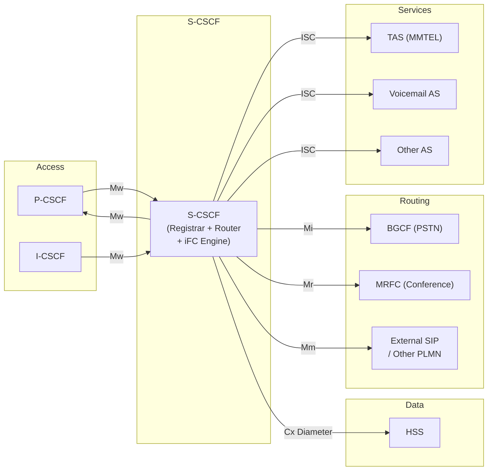
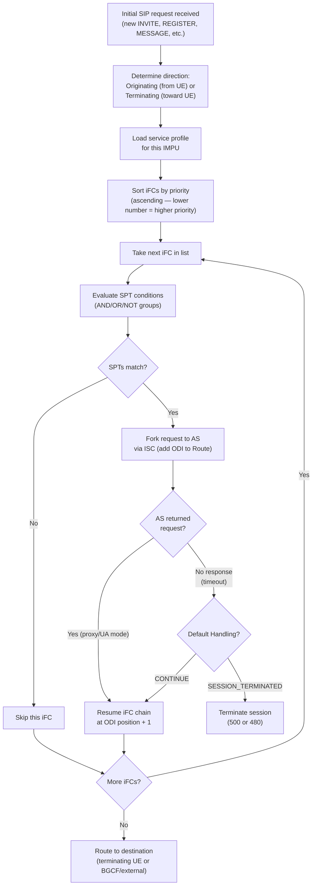
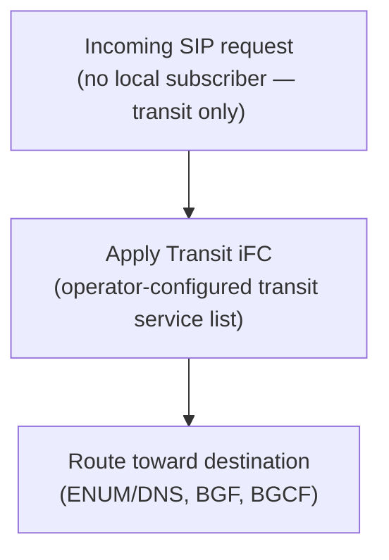
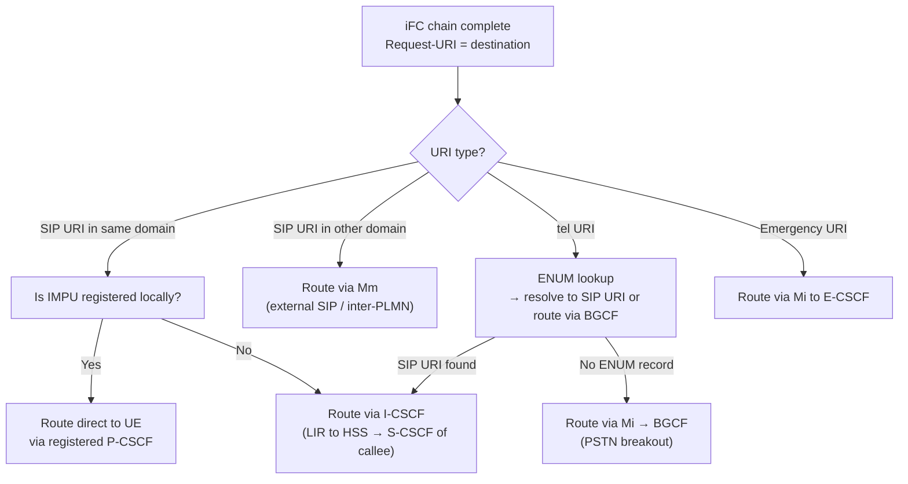
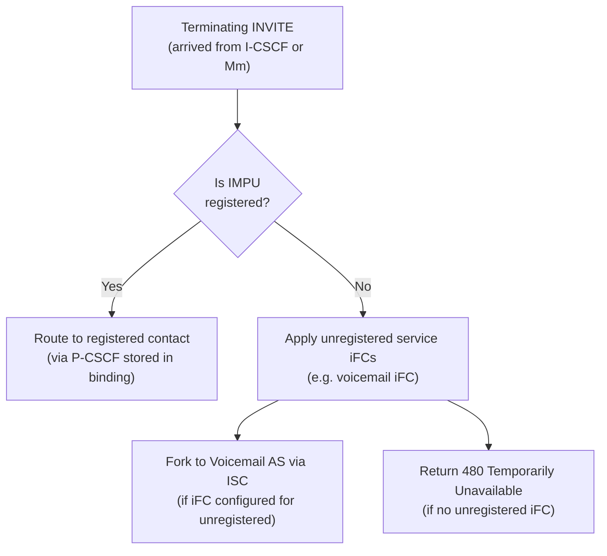
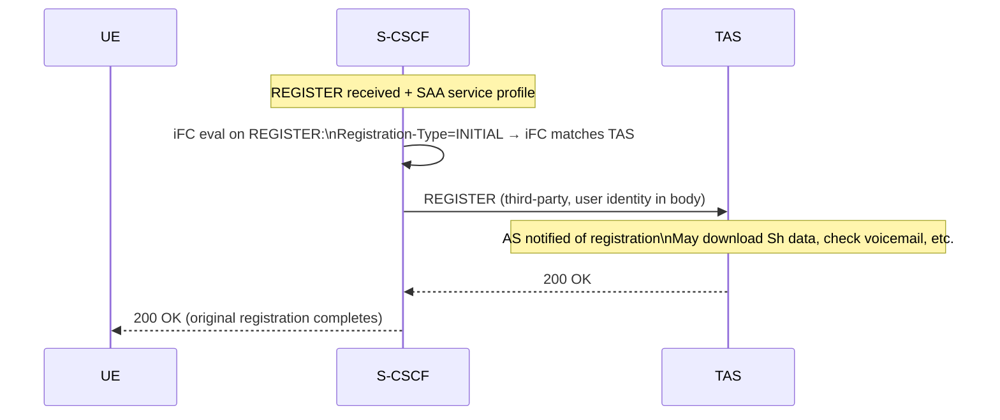
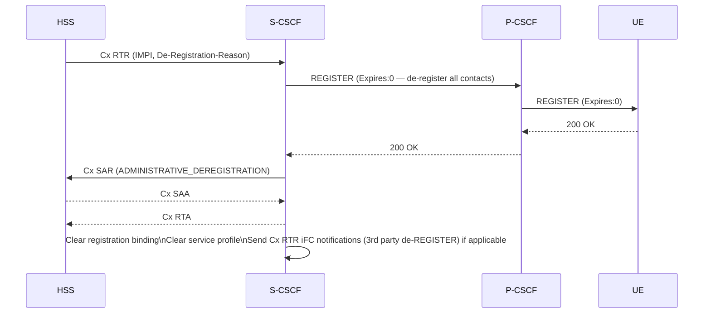
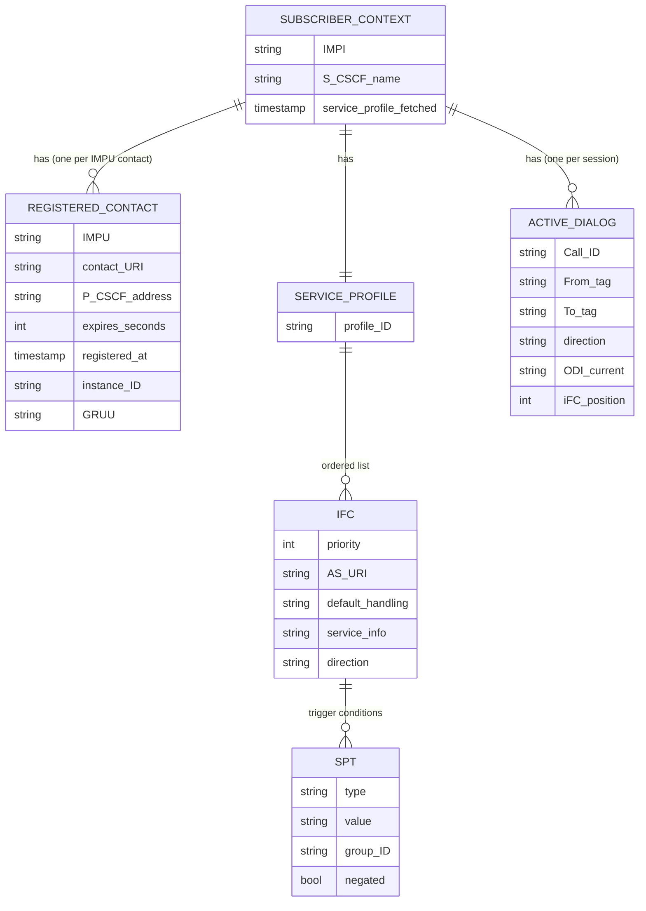
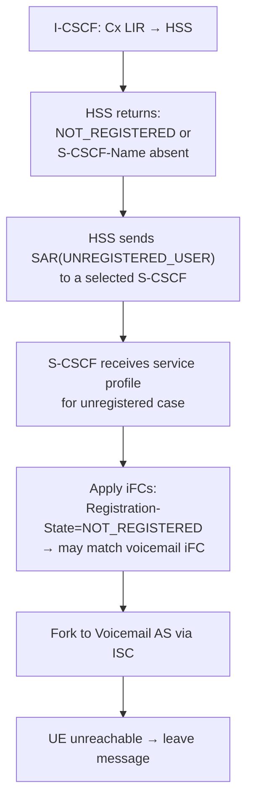
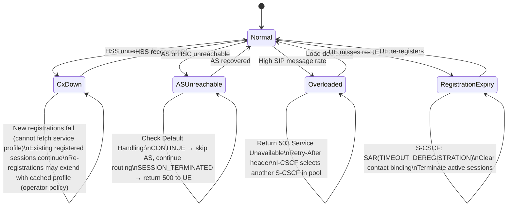

# S-CSCF Deep-Dive — Serving Call Session Control Function

**Base entity page:** [S-CSCF.md](S-CSCF.md)
**Spec references:** TS 23.228 §4.8, §5.1–§5.11; TS 23.218 §4–§9

---

## Architectural Position

The S-CSCF is the **central routing and service orchestration engine of IMS**. It is the only node that owns registration state for a subscriber, holds the full service profile (iFC list), runs the IM Call Model, and makes routing decisions for both originating and terminating sessions. Every IMS session passes through at least one S-CSCF (originating side) and usually two (originating + terminating). It is also the node that forks session requests to Application Servers via ISC — the mechanism through which all IMS services (VoLTE features, voicemail, call forwarding) are invoked.



---

## Complete Interface Table

| Interface | Peer | Protocol | Direction | Purpose |
|---|---|---|---|---|
| **Mw** | P-CSCF, I-CSCF | SIP (TCP/TLS) | Bidirectional | Receive REGISTER, INVITE, and all session messages; return responses |
| **ISC** | Application Servers (TAS, voicemail, BGCF-AS, etc.) | SIP | Bidirectional | iFC-triggered service fork; AS returns request to S-CSCF with ODI |
| **Cx** | HSS | Diameter (Cx app) | Bidirectional | SAR/SAA (profile download), MAR/MAA (auth), RTR/RTA (de-reg), PPR/PPA (profile push) |
| **Mi** | BGCF | SIP | S-CSCF → BGCF | Route sessions toward PSTN breakout gateway |
| **Mr** | MRFC | SIP | Bidirectional | Request conference/announcement/transcoding media resources |
| **Mm** | External IP networks, inter-PLMN | SIP | Bidirectional | Route sessions to external SIP domains or other operators |
| **Mj** | MGCF (via BGCF) | SIP | S-CSCF → MGCF | PSTN interconnect (used when BGCF decides MGCF is in same network) |

---

## Diameter Messages — Cx Interface

| Message | Direction | Trigger |
|---|---|---|
| Multimedia Auth Request (MAR) | S-CSCF → HSS | IMS AKA: fetch auth vectors for challenge/response |
| Multimedia Auth Answer (MAA) | HSS → S-CSCF | Returns {RAND, AUTN, XRES, CK, IK} for IMS AKA |
| Server Assignment Request (SAR) | S-CSCF → HSS | Register as serving S-CSCF; request service profile; various assignment types |
| Server Assignment Answer (SAA) | HSS → S-CSCF | Returns full service profile (all IMPUs + ordered iFCs); stores S-CSCF name in HSS |
| Registration Termination Request (RTR) | HSS → S-CSCF | HSS-initiated de-registration (subscription change, roaming bar, admin) |
| Registration Termination Answer (RTA) | S-CSCF → HSS | Acknowledges; S-CSCF de-registers UE (sends REGISTER Expires:0 toward P-CSCF) |
| Push Profile Request (PPR) | HSS → S-CSCF | Operator updated iFC/service profile — push new profile without re-registration |
| Push Profile Answer (PPA) | S-CSCF → HSS | Acknowledges; S-CSCF installs updated iFCs immediately |

### SAR Assignment Types (S-CSCF perspective)

| Type | When Sent | S-CSCF Gets |
|---|---|---|
| REGISTRATION | Initial registration after AKA | Full service profile |
| RE_REGISTRATION | Periodic re-REGISTER | Updated service profile (may have changed) |
| UNREGISTERED_USER | Terminating session for unregistered IMPU | Unregistered service profile (voicemail iFC etc.) |
| USER_DEREGISTRATION | UE de-REGISTER (Expires:0) | Confirmation only |
| TIMEOUT_DEREGISTRATION | S-CSCF registration timer expired | Confirmation only |
| ADMINISTRATIVE_DEREGISTRATION | RTR-triggered | Confirmation only |
| AUTHENTICATION_FAILURE | AKA failed | No profile |

---

## IM Call Model — iFC Evaluation Engine

The S-CSCF's most critical function. For every **initial request** (new SIP dialog or standalone transaction) the S-CSCF runs the IM Call Model.

### iFC Evaluation Algorithm



### Service Point Trigger (SPT) Types

| SPT Type | Condition | Example |
|---|---|---|
| SIP Method | SIP method match | Method=INVITE |
| SIP Header | Header name + value match | Request-URI contains "+1" |
| Session-Description | SDP content match | media type = audio |
| Request-URI | URI pattern match | Request-URI contains "sos" |
| Direction | Originating or Terminating | Direction=Originating |
| Registration-Type | INITIAL / RE-REGISTRATION / DE-REGISTRATION | Registration-Type=INITIAL |

SPTs within an iFC are combined with AND/OR/NOT logic; groups are separated by the `group` attribute. An iFC fires only if its overall SPT expression evaluates to TRUE.

### ODI (Original Dialog Identifier)

The ODI is a private S-CSCF token inserted into the **Route header** when forking to an AS via ISC. It encodes the current position in the iFC chain so the S-CSCF can resume correctly when the AS returns the request.

```mermaid
sequenceDiagram
    participant SCSCF as S-CSCF
    participant TAS
    participant VoiceMail as Voicemail AS

    Note over SCSCF: Initial INVITE — evaluate iFC chain
    Note over SCSCF: iFC #1 matches (originating INVITE → TAS)
    SCSCF->>TAS: INVITE\nRoute: sip:mmtel.ims.op.com; lr\nRoute: sip:scscf.ims.op.com;lr;orig;ODI=ABC123
    Note over TAS: Apply MMTEL logic (CLIR, call hold etc.)
    TAS->>SCSCF: INVITE (returned via ODI route)
    Note over SCSCF: ODI=ABC123 → resume after iFC #1\niFC #2: no match\niFC #3 matches (originating INVITE → Voicemail for recording?)
    SCSCF->>VoiceMail: INVITE\nRoute: ...; ODI=ABC456
    VoiceMail->>SCSCF: INVITE (returned)
    Note over SCSCF: No more iFCs → route to destination
    SCSCF->>SCSCF: ENUM/DNS lookup → route INVITE
```

### Charging via ICID/IOI

The S-CSCF manages IMS charging correlation:
- **ICID (IMS Charging ID):** Inserted by P-CSCF in `P-Charging-Vector`; S-CSCF propagates it unchanged through the session
- **IOI (Inter-Operator Identifier):** S-CSCF replaces the received IOI with its own when forwarding to an AS (per-hop accounting). The original IOI is not end-to-end preserved.

---

## Transit Function

In addition to the standard originating/terminating roles, the S-CSCF implements a **Transit Function** for routing through the IMS core without local subscriber services:



Transit iFC list is a separate, operator-configured set of iFCs applied to transiting sessions. Used for: lawful interception, transit charging, transcoding insertion for inter-domain calls.

---

## Session Routing Logic

### Originating (Post-iFC)



### Terminating (Post-iFC)



---

## Procedure Participation

### 1. IMS Initial Registration (Full 11-step)

```mermaid
sequenceDiagram
    participant UE
    participant PCSCF as P-CSCF
    participant ICSCF as I-CSCF
    participant SCSCF as S-CSCF
    participant HSS

    UE->>PCSCF: REGISTER
    PCSCF->>ICSCF: REGISTER (P-Visited-Network-ID added)
    ICSCF->>HSS: Cx UAR (IMPI, IMPU, Visited-NW-ID)
    HSS-->>ICSCF: Cx UAA (Server-Capabilities — no S-CSCF assigned yet)
    ICSCF->>SCSCF: REGISTER (selected S-CSCF)
    SCSCF->>HSS: Cx MAR (IMPI, auth-scheme=IMS_AKA)
    HSS-->>SCSCF: Cx MAA (RAND, AUTN, XRES, CK, IK)
    SCSCF-->>ICSCF: 401 Unauthorized (WWW-Authenticate: IMS AKA challenge)
    ICSCF-->>PCSCF: 401
    PCSCF-->>UE: 401 (Security-Server: IPsec params)
    Note over UE,PCSCF: UE computes RES from AUTN; IPsec SA established
    UE->>PCSCF: REGISTER (Authorization: RES)
    PCSCF->>ICSCF: REGISTER
    ICSCF->>HSS: Cx UAR
    HSS-->>ICSCF: Cx UAA (existing S-CSCF name)
    ICSCF->>SCSCF: REGISTER
    SCSCF->>SCSCF: Verify RES == XRES ✓
    SCSCF->>HSS: Cx SAR (REGISTRATION, S-CSCF-Name)
    HSS-->>SCSCF: Cx SAA (Service-Profile: all IMPUs + iFCs)
    SCSCF->>SCSCF: Store service profile\nStore registration binding\nStart registration timer
    SCSCF-->>ICSCF: 200 OK (P-Associated-URI list)
    ICSCF-->>PCSCF: 200 OK
    PCSCF-->>UE: 200 OK
```

### 2. VoLTE MO Call — Originating S-CSCF Role

```mermaid
sequenceDiagram
    participant PCSCF as P-CSCF
    participant SCSCF as S-CSCF (orig)
    participant TAS
    participant ICSCF as I-CSCF (term)

    PCSCF->>SCSCF: INVITE sip:+447700@term-op.com\nP-Charging-Vector: icid=XYZ
    SCSCF->>SCSCF: iFC eval: Method=INVITE, Direction=Orig\n→ iFC #1 matches → fork to TAS
    SCSCF->>TAS: INVITE (ODI=001 in Route)
    TAS-->>SCSCF: INVITE (returned via ODI)
    SCSCF->>SCSCF: Resume iFC chain; no more matches
    SCSCF->>SCSCF: Route: ENUM/DNS on +447700@term-op.com
    SCSCF->>ICSCF: INVITE → term-op.com I-CSCF
```

### 3. VoLTE MT Call — Terminating S-CSCF Role

```mermaid
sequenceDiagram
    participant ICSCF as I-CSCF
    participant SCSCF as S-CSCF (term)
    participant TAS
    participant PCSCF as P-CSCF

    ICSCF->>SCSCF: INVITE sip:+1234@home.ims
    SCSCF->>SCSCF: iFC eval: Method=INVITE, Direction=Term\n→ iFC #1 matches → fork to TAS (MMTEL terminating)
    SCSCF->>TAS: INVITE (ODI=002)
    Note over TAS: Apply terminating MMTEL services (call forwarding check, etc.)
    TAS-->>SCSCF: INVITE (returned — no forward)
    SCSCF->>SCSCF: Resume; no more iFC matches
    SCSCF->>SCSCF: Route to registered contact binding
    SCSCF->>PCSCF: INVITE → P-CSCF → UE
```

### 4. Third-Party REGISTER (AS Notification)

When a REGISTER arrives and an iFC has `Registration-Type=INITIAL` as SPT, the S-CSCF forks a **third-party REGISTER** to the AS:



### 5. Network-Initiated De-registration (RTR)



### 6. Session Release — S-CSCF Role

On BYE, the S-CSCF:
1. Receives BYE from P-CSCF (MO side) or from terminating P-CSCF
2. Evaluates if any iFC has `Method=BYE` SPT → forks to AS if matched _(rare)_
3. Routes BYE to the other dialog leg
4. Generates CDR for this dialog
5. Clears dialog state

### 7. PPR — Service Profile Update Mid-Session

When HSS pushes a PPR (operator changed iFCs):
1. S-CSCF receives PPR with updated service profile
2. Installs new iFCs immediately
3. Active sessions are unaffected (iFC applies to **new** initial requests only)
4. Returns PPA to HSS
5. New sessions from this subscriber use updated iFCs

---

## Registration State Held by S-CSCF



---

## S-CSCF Selection and Capabilities

The I-CSCF selects an S-CSCF based on **capabilities** returned by HSS in the UAA:

| Capability type | Meaning |
|---|---|
| Mandatory capabilities | S-CSCF **must** support these to serve the subscriber |
| Optional capabilities | S-CSCF **should** support these (best-effort match) |

Capability sets are operator-defined integers. Examples:
- Capability 1: supports IMS conferencing
- Capability 2: supports SRTP media security
- Capability 3: can serve premium subscribers (high-capacity S-CSCF)

The I-CSCF queries all available S-CSCFs in the pool, filters by mandatory capabilities, and selects one (e.g. least-loaded) from the matching set.

---

## S-CSCF in Unregistered Termination

When a terminating INVITE arrives for an IMPU that is **not registered**:



This is how voicemail works for unregistered/offline UEs: HSS has an iFC with `Registration-State=NOT_REGISTERED` pointing to the voicemail AS.

---

## AS Interaction Modes (ISC)

The S-CSCF can interact with an AS in five modes via ISC (TS 23.218 §9):

| Mode | AS Behavior | S-CSCF Sees |
|---|---|---|
| SIP proxy | AS forwards request back unchanged | Request returned via ODI route |
| Originating UA | AS originates a new request (different Call-ID) | New dialog — S-CSCF treats as originating |
| Terminating UA | AS terminates the request (200 OK) | Final response — no further routing |
| B2BUA | AS splits dialog into two independent legs | Two separate dialogs; S-CSCF sees each independently |
| Not involved | iFC matched but AS returns immediately with no change | Transparent — next iFC evaluated |

---

## Failure and Overload Behavior



**Default Handling = CONTINUE** is the safety mechanism: if an AS becomes unreachable, calls still complete — they just don't get that particular AS's service applied. Only session-critical ASes (e.g. lawful intercept, fraud control) should use SESSION_TERMINATED.

---

## Configuration Parameters

| Parameter | Description |
|---|---|
| Mw peer list | P-CSCF and I-CSCF addresses/realms for SIP routing |
| ISC peer list | AS addresses (TAS, voicemail AS, BGCF-AS, etc.) |
| Cx HSS realm | Diameter realm/hostname for HSS |
| Capability set | This S-CSCF's mandatory and optional capability integers |
| Registration expiry | Default expiry suggested to UE (Contact: expires=) |
| Minimum expiry | Reject REGISTER with Expires < this value |
| Maximum expiry | Cap on what UE can request |
| ENUM server | DNS/ENUM server for tel URI resolution |
| BGCF address (Mi) | BGCF peer for PSTN routing |
| MRFC address (Mr) | MRFC peer for conference/announcement resources |
| Transit iFC list | iFCs applied to transit sessions (lawful intercept, etc.) |
| Default handling default | CONTINUE or SESSION_TERMINATED for unspecified ASes |
| CDR generation | When to generate CDRs (session start, interim, end) |
| ODI format | Private token format for iFC chain resume |

---

## Key Architectural Properties

| Property | Details |
|---|---|
| **One S-CSCF per subscriber** | Each IMPU is served by exactly one S-CSCF; S-CSCF identity stored in HSS |
| **Stateful registrar** | S-CSCF owns the registration binding (IMPU → contact URI → P-CSCF address) |
| **iFC engine** | The only node that evaluates SPTs and forks to ASes — all IMS services flow through this chain |
| **ODI is private** | The ODI token is opaque to all nodes except the S-CSCF that issued it; ASes must return it unchanged |
| **Service profile cached** | S-CSCF holds a copy of the full service profile in memory; HSS is authoritative source; PPR/re-registration refreshes it |
| **Charging vector propagation** | S-CSCF propagates P-Charging-Vector (ICID) unchanged; replaces IOI with its own per-hop |
| **Both sessions sides** | In a VoLTE call, there are TWO S-CSCFs: one for originating UE, one for terminating UE. Each runs its own iFC chain independently |

---

## Cross-References

| Topic | Page |
|---|---|
| S-CSCF base entity | [entities/S-CSCF.md](S-CSCF.md) |
| P-CSCF (Mw peer, UE access) | [entities/P-CSCF.md](P-CSCF.md) |
| P-CSCF deep-dive | [entities/P-CSCF-deepdive.md](P-CSCF-deepdive.md) |
| I-CSCF (Mw peer, S-CSCF selector) | [entities/I-CSCF.md](I-CSCF.md) |
| TAS (primary ISC peer) | [entities/TAS.md](TAS.md) |
| HSS (Cx data source) | [entities/HSS.md](HSS.md) |
| HSS deep-dive | [entities/HSS-deepdive.md](HSS-deepdive.md) |
| BGCF (PSTN routing via Mi) | [entities/BGCF.md](BGCF.md) |
| MRFC (conference via Mr) | [entities/MRF.md](MRF.md) |
| IMS Identity Model | [concepts/IMS-identity-model.md](../concepts/IMS-identity-model.md) |
| IM Call Model (iFC detail) | [concepts/IM-call-model.md](../concepts/IM-call-model.md) |
| AS interaction modes | [concepts/AS-interaction-modes.md](../concepts/AS-interaction-modes.md) |
| iFC worked examples | [analyses/iFC-worked-examples.md](../analyses/iFC-worked-examples.md) |
| IMS Registration | [procedures/IMS-registration.md](../procedures/IMS-registration.md) |
| VoLTE MO call | [procedures/VoLTE-MO-call.md](../procedures/VoLTE-MO-call.md) |
| VoLTE MT call | [procedures/VoLTE-MT-call.md](../procedures/VoLTE-MT-call.md) |
| Session release | [procedures/session-release.md](../procedures/session-release.md) |
| IMS QoS bearer | [procedures/IMS-QoS-bearer.md](../procedures/IMS-QoS-bearer.md) |
| IMS reference points | [interfaces/IMS-reference-points.md](../interfaces/IMS-reference-points.md) |
