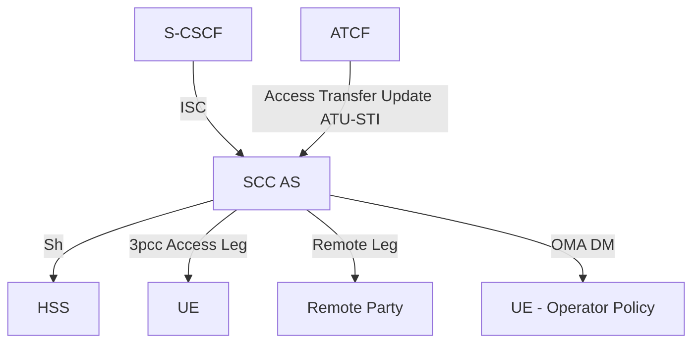

# SCC AS — Service Centralization and Continuity Application Server

The **SCC AS** (Service Centralization and Continuity Application Server) is a SIP Application Server in the **home IMS** that provides IMS-based mechanisms for enabling service continuity of multimedia sessions. It acts as the central control point for both Access Transfer and Inter-UE Transfer.

Reference: **3GPP TS 23.237 §5.3.1**.

The SCC AS is collocated with the ICS functions specified in TS 23.292. Not all functions are always required.

---

## Architecture Position

The SCC AS is triggered via iFC at the S-CSCF over the ISC reference point (like all IMS Application Servers). It uses 3rd-party call control (3pcc) to anchor both the Access Leg toward the UE and the Remote Leg toward the remote party.

---

## Functions

### Access Transfer

| Function | Detail |
|---|---|
| **Session correlation** | Correlates Access Transfer request (incoming INVITE with STI/STN) to anchored session via SDP/SIP |
| **C-MSISDN retrieval** | Retrieves C-MSISDN bound to IMPI from HSS after 3rd-party registration |
| **STN-SR management** | Clears/updates STN-SR in HSS on 3rd-party registration; home-configured STN-SR if none received; updates if new STN-SR received |
| **ATCF coordination** | When ATCF deployed: provides C-MSISDN + ATU-STI to ATCF after successful IMS registration |
| **Access Leg correlation** | Correlates Access Leg created by ATCF Access Transfer Update (ATU-STI) with the Remote Leg |
| **Session State Information** | Provides Session State Information to MSC Server enhanced for ICS/(v)SRVCC (calling/called party, needed STI, session state, conference info) |
| **vSRVCC** | Informs MSC Server whether most recently active bi-directional session is voice or voice+video (for vSRVCC vs SRVCC decision) |
| **CS to PS SRVCC** | Provides MSC Server with ATCF management URI and UE registration status when CS-to-PS SRVCC supported |
| **Operator policy** | Decides whether to update provisioned operator policy; sends OMA DM policy to UE |
| **3pcc** | Implements 3rd-party call control at session establishment; all media steering done here |
| **Access Transfer charging** | Generates Access Transfer-specific charging data |

### Inter-UE Transfer

| Function | Detail |
|---|---|
| **IUT execution** | Executes IMS Inter-UE Transfer related procedures between different UEs under same operator |
| **IUT authorization** | Authorizes requests for IUT Media Control procedures from UEs and Controllee UEs |
| **Cross-subscription IUT** | When UEs from different subscriptions involved: ensures no duplicate Collaborative Sessions for same media; adds indication to IUT request |
| **Hosting SCC AS awareness** | Forwards received IUT requests to the Hosting SCC AS if one already exists for the Collaborative Session |
| **Collaborative Session release** | Releases all Access Legs if Collaborative Session Control is lost for an active session |
| **IUT charging** | Provides IUT-specific charging data |

### Terminating Access Domain Selection (T-ADS)

For a terminating session, SCC AS selects one or more registered contacts for the UE, selecting one or more access network types. It may split the session across multiple access legs. Used for both 3GPP and non-3GPP accesses.

### Media Flow Handling

The SCC AS combines and/or splits media flows over one or more Access Networks as needed for:
- Session Transfers
- Session termination (select specific access network type)
- UE-requested media addition on additional Access Network at session setup
- UE-requested add/delete of media flows over one or more Access Networks on existing sessions

---

## Key Interfaces

| Interface | Peer | Protocol | Purpose |
|---|---|---|---|
| ISC | S-CSCF | SIP | Triggered by iFC; 3pcc anchor |
| Sh | HSS | Diameter | C-MSISDN retrieval, STN-SR update, user profile |
| _(OMA DM)_ | UE | OMA DM | Operator policy provisioning for Access Transfer |
| _(SIP)_ | ATCF | SIP (Mw) | Receive Access Transfer Update (ATU-STI) |
| _(SIP)_ | MSC Server | SIP | Provide Session State Information |

---

## Key Identifiers Managed

| Identifier | Role |
|---|---|
| **STN / STN-SR** | Updated in HSS; routes SRVCC transfer request to SCC AS or ATCF |
| **C-MSISDN** | Retrieved from HSS; correlates Access Legs; provided to ATCF |
| **ATU-STI** | Provided to ATCF; used by ATCF to notify SCC AS of completed Access Transfer |
| **STI** | Dynamic; sent by UE in INVITE to request a specific Session Transfer |
| **IMRN** | IP Multimedia Routing Number; routes calls to SCC AS in home IM CN |

---

## Relation to Other Entities

- [ATCF](ATCF.md) — in serving network; receives C-MSISDN + ATU-STI from SCC AS post-registration
- [ATGW](ATGW.md) — media anchor controlled by ATCF
- [TAS (Telephony AS)](TAS.md) — peer IMS AS handling MMTEL features; distinct from SCC AS
- [HSS](HSS.md) — stores C-MSISDN, STN-SR, user profile
- [S-CSCF](S-CSCF.md) — routes ISC triggers to SCC AS via iFC

---

## Cross-references

- [concepts/IMS-service-continuity.md](../concepts/IMS-service-continuity.md) — full SC concept
- [concepts/SRVCC.md](../concepts/SRVCC.md) — SRVCC concept
- [procedures/SRVCC-from-E-UTRAN.md](../procedures/SRVCC-from-E-UTRAN.md) — SRVCC flows involving SCC AS
