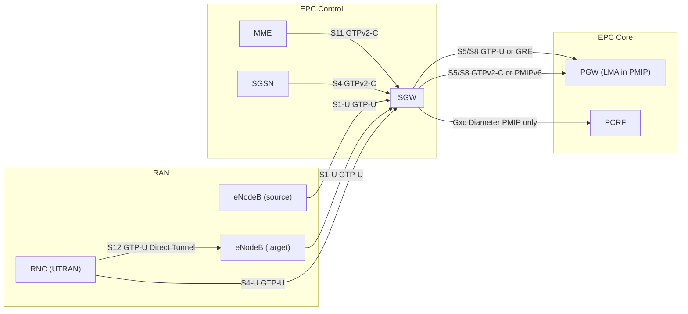
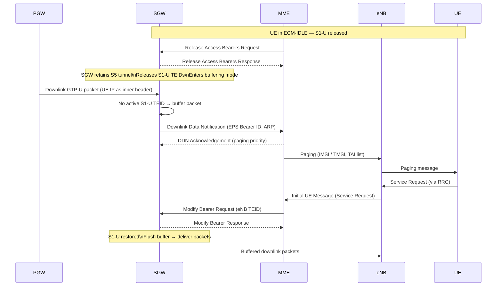
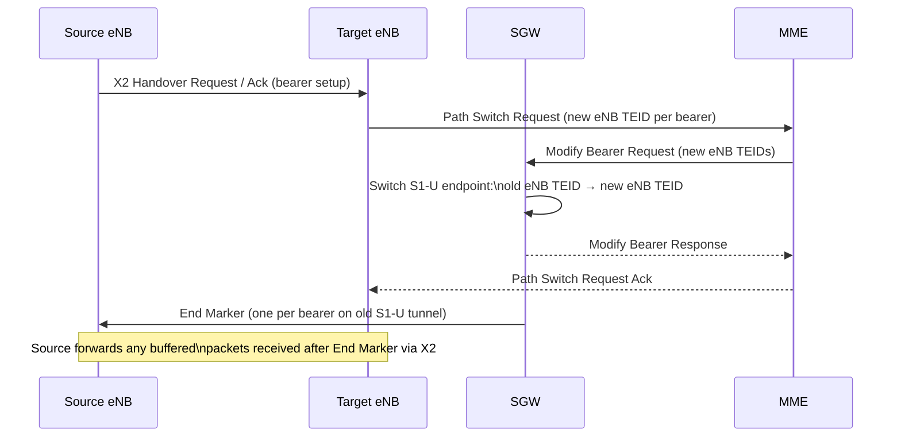
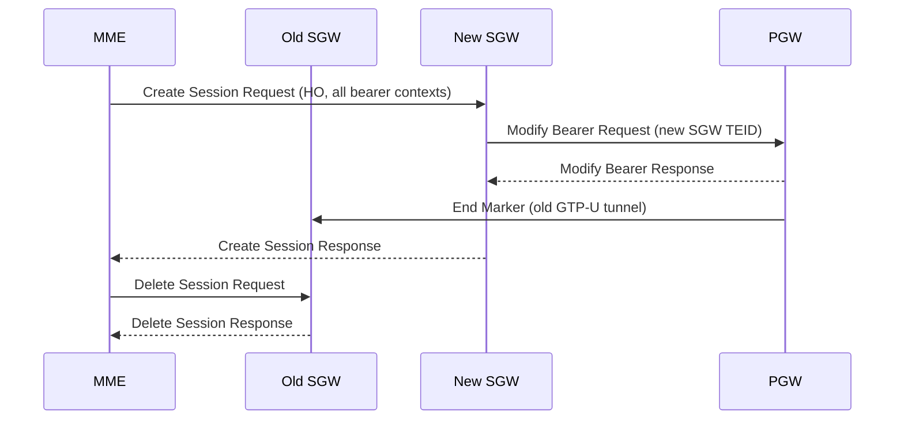
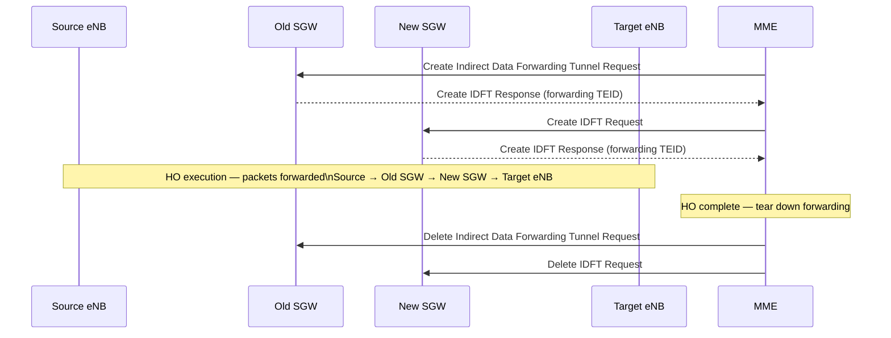
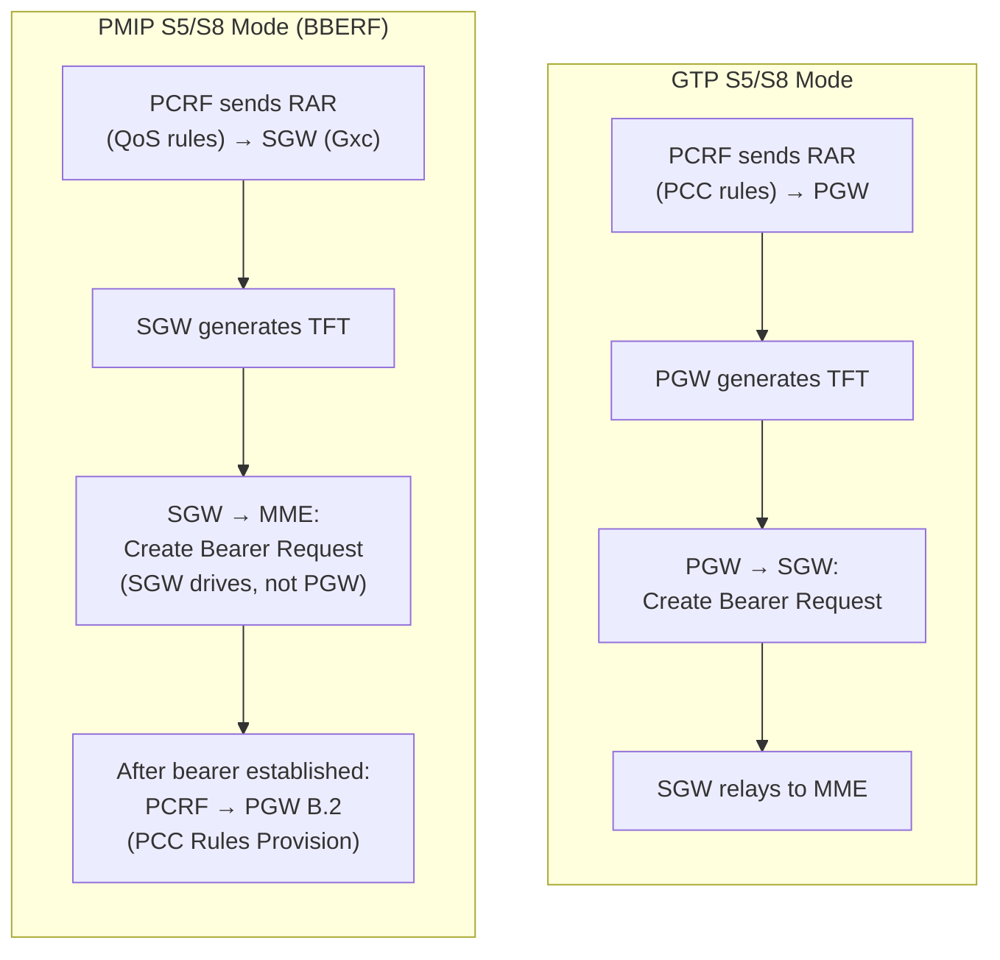
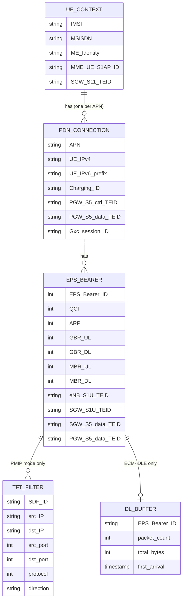
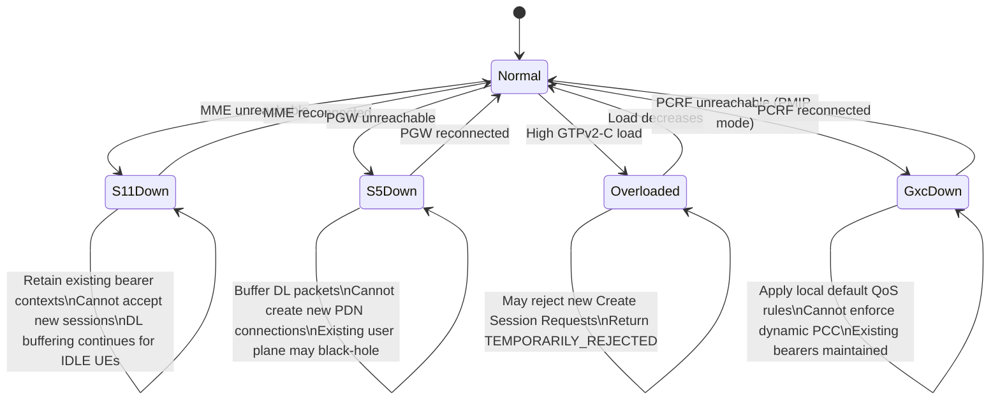

# SGW Deep-Dive — Serving Gateway

**Base entity page:** [SGW.md](SGW.md)
**Spec references:** TS 23.401 §4.4.3.2, §5; TS 23.402 §5

---

## Architectural Position

The SGW sits at the boundary between the RAN and the EPC core. It is the user-plane relay and the **intra-LTE mobility anchor** — every inter-eNB handover resolves at the SGW without PGW involvement. It is also the buffering agent for ECM-IDLE UEs. In PMIP S5/S8 deployments it becomes the **BBERF (Bearer Binding and Event Reporting Function)** and gains significant control-plane responsibility.

---

## Complete Interface Table

| Interface | Peer | Protocol | Direction | Purpose |
|---|---|---|---|---|
| **S1-U** | eNodeB | GTP-U (UDP/IP) | Bidirectional | User plane bearer tunnels between RAN and SGW |
| **S11** | MME | GTPv2-C | Bidirectional | Session/bearer control commands from MME |
| **S5** | PGW (same PLMN) | GTPv2-C (ctrl) + GTP-U (data) | Bidirectional | Bearer management + user plane intra-PLMN |
| **S8** | PGW (HPLMN) | GTPv2-C (ctrl) + GTP-U (data) | Bidirectional | Home-routed roaming variant of S5 |
| **S5/S8 (PMIP)** | PGW (LMA) | PMIPv6 (ctrl) + GRE (data) | SGW=MAG → PGW=LMA | PMIP S5/S8 variant — SGW acts as BBERF/MAG |
| **S4** | SGSN | GTPv2-C (ctrl) + GTP-U (data) | Bidirectional | 2G/3G inter-RAT mobility; SGSN as RAN anchor |
| **S12** | UTRAN RNC | GTP-U | RNC ↔ SGW | Direct tunnel — SGW user plane bypassed; RNC sends GTP-U directly to PGW path (operator option) |
| **Gxc** | PCRF | Diameter (Gxc app) | SGW ↔ PCRF | PMIP mode only: GW Control Session; PCRF delivers QoS rules to BBERF |

---

## GTPv2-C Messages — S11 Interface

The SGW receives commands from the MME on S11 and acts as relay/forwarder toward PGW on S5/S8.

### Session Lifecycle

| Message | Direction | Purpose |
|---|---|---|
| Create Session Request | MME → SGW | Create PDN connection; SGW allocates TEID, forwards to PGW |
| Create Session Response | SGW → MME | PDN connection created; returns SGW ctrl TEID + user-plane TEID |
| Delete Session Request | MME → SGW | Tear down PDN connection; SGW deletes state and forwards to PGW |
| Delete Session Response | SGW → MME | Confirms deletion |
| Modify Bearer Request | MME → SGW | Update S1-U endpoint (eNB TEID change on HO), RAT type, ULI |
| Modify Bearer Response | SGW → MME | Path updated; may include charging rule update indication |
| Change Notification Request | MME → SGW | Location/RAT change without path change; SGW forwards to PGW |
| Change Notification Response | SGW → MME | Acknowledges |

### Bearer Lifecycle

| Message | Direction | Purpose |
|---|---|---|
| Create Bearer Request | SGW → MME | Relay of PGW-initiated dedicated bearer creation (GTP mode) |
| Create Bearer Response | MME → SGW | EPS Bearer ID assigned by MME; includes eNB TEID |
| Update Bearer Request | SGW → MME | Relay of PGW-initiated bearer modification |
| Update Bearer Response | MME → SGW | Acknowledges modification |
| Delete Bearer Request | SGW → MME | Relay of PGW-initiated bearer deactivation |
| Delete Bearer Response | MME → SGW | Acknowledges deletion |

### Commands (SGW relays MME commands to PGW)

| Message | Direction | Purpose |
|---|---|---|
| Modify Bearer Command | MME → SGW | MME-triggered bearer modification request; SGW relays to PGW |
| Modify Bearer Failure Indication | SGW → MME | PGW rejected modification; SGW relays to MME |
| Delete Bearer Command | MME → SGW | MME-triggered bearer deletion request; SGW relays to PGW |
| Delete Bearer Failure Indication | SGW → MME | PGW rejected deletion; SGW relays to MME |

### Paging and Buffering

| Message | Direction | Purpose |
|---|---|---|
| Downlink Data Notification (DDN) | SGW → MME | DL packet arrived for ECM-IDLE UE; request paging |
| Downlink Data Notification Ack | MME → SGW | MME acknowledges; includes paging priority |
| Downlink Data Notification Failure Ind | MME → SGW | MME cannot page (e.g. no UE context); SGW discards buffer |
| Release Access Bearers Request | MME → SGW | UE entered ECM-IDLE; MME instructs SGW to release S1-U bearers |
| Release Access Bearers Response | SGW → MME | S1-U bearers released; SGW now in buffering mode |

### Forwarding (Indirect Data Forwarding — S1 Handover)

| Message | Direction | Purpose |
|---|---|---|
| Create Indirect Data Forwarding Tunnel Request | MME → SGW | Create temporary forwarding tunnel during S1 HO |
| Create Indirect Data Forwarding Tunnel Response | SGW → MME | Forwarding TEID allocated |
| Delete Indirect Data Forwarding Tunnel Request | MME → SGW | Remove forwarding tunnel after HO complete |
| Delete Indirect Data Forwarding Tunnel Response | SGW → MME | Confirms removal |

---

## GTPv2-C Messages — S5/S8 Interface (GTP Mode)

SGW acts as **relay** between MME (S11) and PGW (S5/S8). Most S5 messages mirror the S11 messages above with SGW-allocated TEIDs substituted.

| Message | Direction | Notable SGW Behavior |
|---|---|---|
| Create Session Request | SGW → PGW | SGW inserts its own ctrl + user-plane TEIDs; forwards IMSI, APN, RAT |
| Create Session Response | PGW → SGW | SGW extracts PGW TEID + UE IP; stores in bearer context; relays to MME |
| Modify Bearer Request | SGW → PGW | SGW inserts its own user-plane TEID; relays ULI/RAT from MME |
| Create/Update/Delete Bearer Request | PGW → SGW | SGW stores new TFT/QoS; relays to MME as S11 Create/Update/Delete Bearer Request |
| Create/Update/Delete Bearer Response | SGW → PGW | SGW inserts SGW TEID; relays MME response |

**SGW TEID namespace:** SGW maintains separate TEID spaces for S11 (toward MME) and S5/S8 (toward PGW). Internal mapping table ties them together.

---

## PMIPv6 Messages — S5/S8 (PMIP Variant, TS 23.402 §5)

In PMIP mode the SGW acts as **MAG (Mobile Access Gateway)** and **BBERF**. GTPv2-C session messages are replaced by PMIPv6, but SGW still uses GTPv2-C on S11 toward the MME.

| Message | Direction | Purpose |
|---|---|---|
| Proxy Binding Update (PBU) | SGW (MAG) → PGW (LMA) | Create binding: MN-NAI, APN, GRE key, Lifetime, AT-Type, HO-Indicator |
| Proxy Binding Acknowledgement (PBA) | PGW (LMA) → SGW (MAG) | Binding confirmed: UE address, GRE uplink key, Charging ID, APN-AMBR |
| PBU (lifetime=0) | SGW → PGW | De-register binding (detach or PDN disconnection) |
| Binding Revocation Indication (BRI) | PGW → SGW | PGW-initiated PDN disconnection; SGW tears down bearers then sends PBU(0) |
| Binding Revocation Ack (BRA) | SGW → PGW | Acknowledges revocation |

---

## Diameter Messages — Gxc Interface (PMIP Mode Only)

In PMIP S5/S8, the SGW (BBERF) has a direct **Gxc** interface to the PCRF. This is the critical interface that gives SGW control-plane authority for bearer decisions.

| Message | Direction | Purpose |
|---|---|---|
| CCR-Initial (GW Control Session Establishment) | SGW → PCRF | BBERF opens GW Control Session: IMSI, APN, RAT type, UE location, APN-AMBR |
| CCA-Initial | PCRF → SGW | QoS Rules installed at BBERF (event triggers, APN-AMBR, default bearer QoS) |
| CCR-Update (GW Control + QoS Rules Request) | SGW → PCRF | RAT/location change, resource request from UE (§5.5), or HO re-establishment |
| CCA-Update | PCRF → SGW | Updated QoS Rules; BBERF enforces and may drive bearer update to MME |
| CCR-Terminate (GW Control Session Termination) | SGW → PCRF | PDN disconnection or detach; closes GW Control Session |
| CCA-Terminate | PCRF → SGW | Acknowledges termination |
| RAR (Re-Auth Request) — QoS Rules Provision | PCRF → SGW | PCRF pushes new/updated QoS Rules (dedicated bearer trigger) |
| RAA | SGW → PCRF | Acknowledges rule installation |

**Critical PMIP distinction:** In PMIP mode, the SGW (not the PGW) receives PCC rules and drives bearer creation/modification toward the MME. The SGW generates TFTs from PCRF QoS rules — functionality that in GTP mode belongs exclusively to the PGW.

---

## ECM-IDLE Buffering and DDN

This is the SGW's most operationally unique function — no other EPC node buffers user-plane packets.

**Extended Buffering (TS 23.401 §5.3.4.3):** MME may instruct SGW to buffer for an extended period after DDN Ack — used for MTC/IoT UEs with long paging cycles. SGW sends DDN periodically until MME requests stop or UE responds.

**Paging Policy Differentiation:** SGW may include ARP in DDN to allow MME to prioritize paging for high-priority bearers (e.g. IMS emergency).

---

## Mobility Anchor Behavior

### Intra-eNB (no SGW involvement)

No path change at SGW. eNB manages intra-cell mobility internally.

### Inter-eNB X2 Handover (no SGW relocation)

SGW does **not** change. Only the S1-U TEID mapping is updated. End Marker signals the source eNB to flush its forwarding buffer.

### SGW Relocation (X2 or S1 Handover, TAU)

When the UE moves to a new tracking area that requires a different SGW:

PGW switches downlink path from Old SGW to New SGW at Modify Bearer. Old SGW is cleaned up after.

### S1 Handover with Indirect Data Forwarding

During S1 handover with SGW relocation, a temporary indirect forwarding tunnel routes in-flight packets from the old path to the new one:

---

## PMIP Mode: SGW as BBERF

In PMIP S5/S8, the SGW's control-plane role expands dramatically. Key behavioral differences:

| Capability | GTP Mode | PMIP Mode |
|---|---|---|
| Gxc interface to PCRF | No | Yes |
| TFT generation | PGW | SGW (BBERF) |
| Drives Create Bearer to MME | Relays PGW request | Own initiative (from PCRF QoS rule) |
| PBU/PBA toward PGW | No | Yes (MAG role) |
| GW Control Session | No | Yes (lifecycle per PDN connection) |
| PCRF visibility | Indirect (via PGW Gx) | Direct (own Gxc session) |

---

## Bearer Context Data Model

**Note on TFT storage:** In GTP mode, the SGW does **not** store TFTs — those live at the PGW. The SGW only stores TEID mappings (S1-U ↔ S5/S8). In PMIP mode, the SGW generates and owns the TFTs (BBERF role).

---

## Procedure Participation Summary

| Procedure | SGW Role | Key SGW Action |
|---|---|---|
| EPS Initial Attach | Session creator | Allocate TEIDs; relay Create Session; return UE IP from PGW |
| TAU (no SGW relocation) | Passive | Receive Modify Bearer; update ULI forwarding to PGW |
| TAU (SGW relocation) | New SGW: session owner; Old SGW: deleted | New SGW creates S5 session; PGW Modify Bearer switches path; Old SGW deleted |
| Service Request (UE-triggered) | Bearer restorer | Receive Modify Bearer Request; restore S1-U TEID mapping; flush DL buffer |
| Network-triggered Service Request | DDN issuer | Buffer DL packet; send DDN to MME; restore bearers on paging response |
| S1 Release | Buffer enabler | Release Access Bearers; release S1-U TEIDs; retain S5 context |
| EPS Detach | Session terminator | Delete Session (all PDN connections); release all state |
| Dedicated Bearer Activation (GTP) | Relay | Relay Create Bearer Request from PGW to MME; relay response back |
| Dedicated Bearer Activation (PMIP) | Bearer initiator | Receive QoS rules from PCRF (Gxc); generate TFT; send Create Bearer to MME |
| X2 Handover (no relocation) | Path switcher | Modify Bearer — update S1-U endpoint to target eNB; send End Marker |
| X2 Handover (SGW relocation) | New anchor | Create new S5 session; PGW switches path; old SGW deleted |
| S1 Handover | Forwarding anchor | Create Indirect Data Forwarding Tunnels; relay in-flight packets |
| PDN Connectivity (additional) | Session creator | Allocate new TEID set for new PDN connection; relay Create Session |
| Non-3GPP → E-UTRAN HO | New S5 anchor | Create Session with HO Indication; PGW switches from ePDG to SGW |
| PMIP HO with relocation | MAG re-anchor | New PBU with HO Indicator → PGW preserves IP; old SGW GW Control Term |

---

## Failure and Overload Behavior

---

## Configuration Parameters

| Parameter | Description |
|---|---|
| S1-U IP address / TEID pool | GTP-U endpoint address; TEID allocation range for eNB-facing tunnels |
| S5/S8 IP address / TEID pool | GTP-U and GTPv2-C endpoint addresses toward PGW |
| S11 IP address | GTPv2-C endpoint for MME-facing interface |
| S4 IP address | GTPv2-C endpoint for SGSN-facing interface |
| MME address(es) | List of MME peers (S11) |
| PGW address(es) | List of PGW peers (S5/S8) |
| PCRF address (Gxc) | PMIP mode only — Diameter realm/hostname |
| DL buffer size per UE | Maximum packets/bytes buffered per UE in ECM-IDLE |
| DDN retry interval | How long to wait before re-sending DDN if no paging response |
| Extended buffering timer | Duration to buffer after DDN Ack in MTC/IoT scenarios |
| Paging Policy Differentiation | Whether to include ARP in DDN |
| End Marker behavior | Immediate vs delayed End Marker on path switch |
| Indirect forwarding timeout | How long to maintain IDFT tunnel before cleanup |
| Charging CDR threshold | Volume/time trigger for partial CDR generation |

---

## Key Architectural Properties

| Property | Details |
|---|---|
| **Intra-LTE mobility anchor** | UE can move across eNBs without PGW involvement — only SGW TEID mapping changes |
| **No IP address knowledge** | SGW does not allocate or know the UE's IP address in GTP mode — it only knows TEIDs. UE IP lives at PGW. |
| **GTP-U relay** | All user-plane traffic is GTP-U encapsulated through SGW — SGW does not inspect the inner IP header (except in PMIP mode for TFT matching) |
| **Single SGW per UE** | Only one SGW active per UE at any time; multiple PDN connections share the same SGW |
| **Transparent to application layer** | SGW adds no application-level intelligence — it is a tunneling relay + mobility anchor |
| **BBERF in PMIP** | In PMIP S5/S8 mode, SGW becomes the local policy enforcement point, a major architectural role expansion |
| **DL buffer = paging trigger** | The only node that can trigger paging via DDN — the coupling between user-plane event and control-plane paging lives here |

---

## Cross-References

| Topic | Page |
|---|---|
| SGW base entity | [entities/SGW.md](SGW.md) |
| MME (S11 control) | [entities/MME.md](MME.md) |
| MME deep-dive | [entities/MME-deepdive.md](MME-deepdive.md) |
| PGW (S5/S8 peer) | [entities/PGW.md](PGW.md) |
| PGW deep-dive | [entities/PGW-deepdive.md](PGW-deepdive.md) |
| EPS bearer model | [concepts/EPS-bearer.md](../concepts/EPS-bearer.md) |
| EMM/ECM state machines | [concepts/EMM-ECM-states.md](../concepts/EMM-ECM-states.md) |
| EPS Initial Attach | [procedures/EPS-attach.md](../procedures/EPS-attach.md) |
| TAU procedure | [procedures/TAU.md](../procedures/TAU.md) |
| Service Request / S1 Release | [procedures/service-request.md](../procedures/service-request.md) |
| Dedicated bearer lifecycle | [procedures/dedicated-bearer.md](../procedures/dedicated-bearer.md) |
| X2 handover | [procedures/X2-handover.md](../procedures/X2-handover.md) |
| S1 handover | [procedures/S1-handover.md](../procedures/S1-handover.md) |
| PDN connectivity | [procedures/PDN-connectivity.md](../procedures/PDN-connectivity.md) |
| PMIP S5/S8 procedures | [procedures/PMIP-S5S8-procedures.md](../procedures/PMIP-S5S8-procedures.md) |
| Non-3GPP handover | [procedures/non3GPP-handover.md](../procedures/non3GPP-handover.md) |
| EPC reference points | [interfaces/reference-points.md](../interfaces/reference-points.md) |
