# TAS Deep-Dive — Telephony Application Server

**Base entity page:** [TAS.md](TAS.md)
**Spec references:** TS 23.228 §4.13, §5.5–§5.8; TS 23.218 §9, Annexes B/C; TS 24.173 (MMTEL services)

---

## Architectural Position

The TAS is the **telephony service execution engine** of IMS. It is triggered by the S-CSCF's iFC evaluation and applies MMTEL supplementary services (call forwarding, barring, hold, conference, etc.) before returning control to the S-CSCF for final routing. It is the only node with access to subscriber telephony preferences (via Sh) and the only node that directly controls media resources (via Mr to MRFC). It can operate in all five AS modes depending on the service being applied.

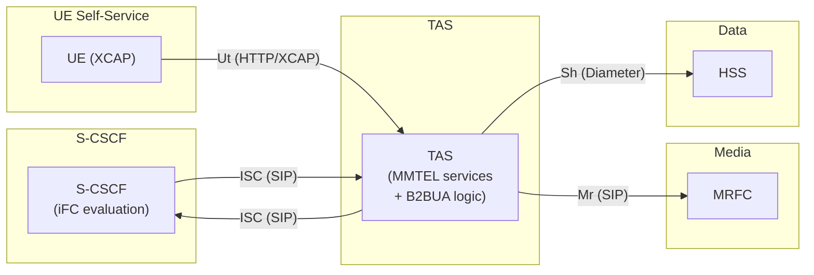

---

## Complete Interface Table

| Interface | Peer | Protocol | Direction | Purpose |
|---|---|---|---|---|
| **ISC** | S-CSCF | SIP (TCP/TLS) | Bidirectional | Receive iFC-triggered requests; return to S-CSCF via ODI; originate new requests (originating UA mode) |
| **Sh** | HSS | Diameter (Sh app) | Bidirectional | Read/write subscriber telephony service data; subscribe to change notifications |
| **Mr** | MRFC | SIP | TAS → MRFC | Request conference, announcement, and transcoding media resources |
| **Mr'** | MRFC | SIP | TAS → MRFC | Direct MRFC access bypassing S-CSCF (used for transcoding, conference in B2BUA mode) |
| **Ut** | UE | HTTP(S) / XCAP | UE → TAS | Subscriber self-service: configure call forwarding targets, barring, preferences |
| **Dh** | SLF | Diameter (Dh app) | TAS → SLF | Multi-HSS: locate correct HSS for Sh queries |
| **Cr** | MRFC | Media control | TAS → MRFC | Control channel for media server operations (per RFC 6230 / MEDIACTRL) |

---

## Sh Interface — Subscriber Data Access

The Sh interface is TAS's primary data source for service decisions. It contains all subscriber telephony preferences.

| Data Element | Read/Write | Purpose |
|---|---|---|
| Call Forwarding Unconditional (CFU) target | R/W | If CFU active: forward all calls to this URI |
| Call Forwarding No Reply (CFNRy) target + timer | R/W | Forward on no answer after N seconds |
| Call Forwarding Busy (CFB) target | R/W | Forward when UE reports busy (486) |
| Call Forwarding Not Reachable (CFNRc) target | R/W | Forward when UE unreachable (480, 408) |
| Call Barring flags | R/W | OIR/BOIC/BAIC/etc. barring status per service |
| CLIR preference (permanent/temporary) | R/W | Default CLIR mode for originating calls |
| Call Waiting status | R/W | Whether call waiting is active |
| Message Waiting Indication flags | R/W | Pending voicemail count (read by MWI service) |
| MSISDN | R | UE's phone number (used in P-Asserted-Identity insertion) |
| IMPU list | R | All registered public identities |

### Sh Message Flow for Service Data Fetch

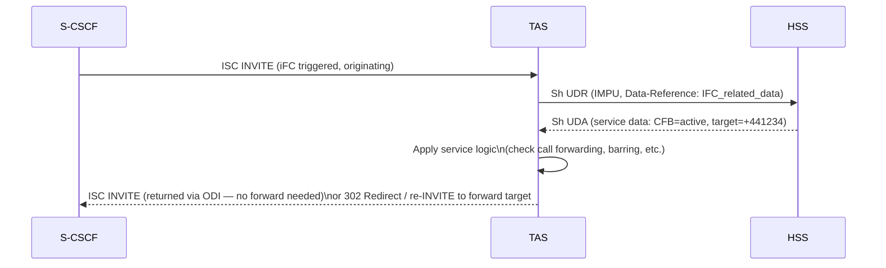

**Caching:** TAS typically caches Sh data per subscriber to avoid Sh round-trip on every call. TAS subscribes to Sh change notifications (SNR) so HSS pushes updates when subscriber modifies preferences via Ut/XCAP.

### Sh Notification Subscription

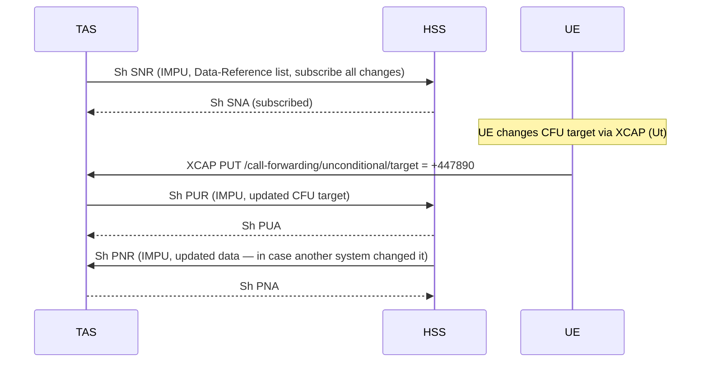

---

## AS Operating Modes — Detailed

### Mode 1: SIP Proxy

TAS is transparent in the signaling path. Used for: CLIR (strip From header), P-Asserted-Identity manipulation, call barring checks.

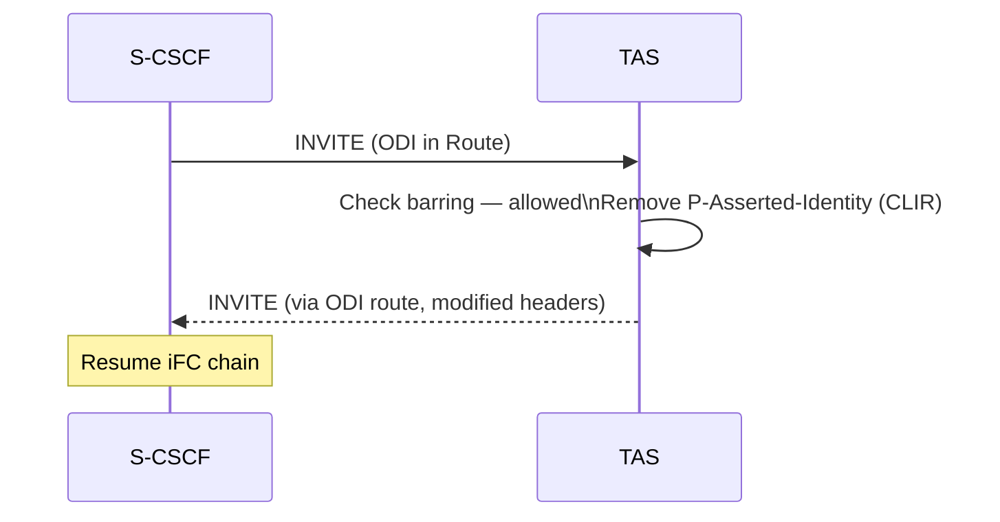

### Mode 2: B2BUA — Call Hold / Conference

TAS creates two independent SIP dialogs: one toward the S-CSCF/UE side, one toward the media resource or second party.

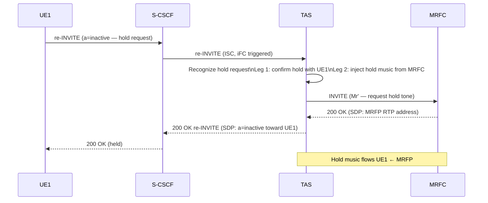

### Mode 3: Redirect (302)

TAS sends 302 Moved Temporarily toward S-CSCF. Used for call forwarding (UA redirect mode).

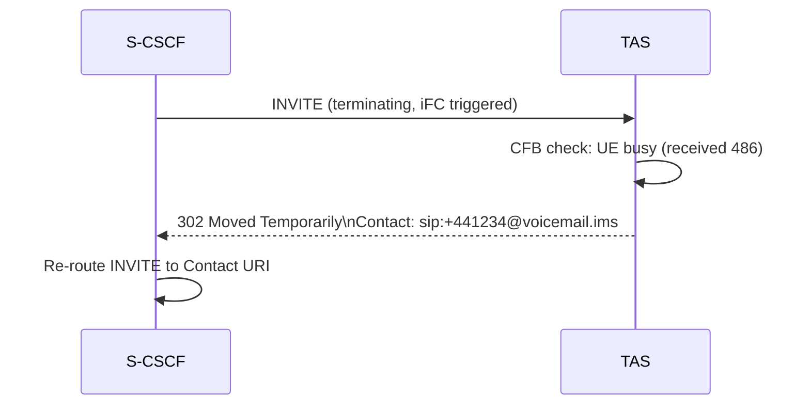

### Mode 4: B2BUA — Conference (Multi-party)

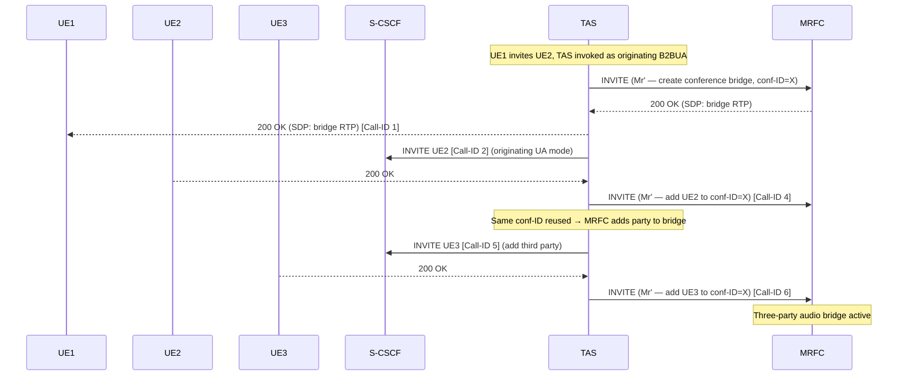

### Mode 5: Originating UA — MWI / Click-to-Dial

TAS generates a new SIP request without being triggered by an incoming dialog:

```mermaid
sequenceDiagram
    participant TAS
    participant SCSCF as S-CSCF
    participant UE

    Note over TAS: Event: new voicemail deposited\n(triggered by voicemail AS notification)
    TAS->>SCSCF: SUBSCRIBE sip:+1234@home.ims\n(originating UA mode — no incoming INVITE)
    SCSCF->>SCSCF: Evaluate originating iFCs\n(SUBSCRIBE, Direction=Orig)
    SCSCF->>UE: SUBSCRIBE (via P-CSCF)
    UE-->>SCSCF: 200 OK
    TAS->>UE: NOTIFY (Message-Waiting: yes; Messages-Waiting: 2)
    UE-->>TAS: 200 OK
    Note over UE: MWI indicator shown on phone
```

---

## MMTEL Service Logic

### Call Forwarding Decision Tree

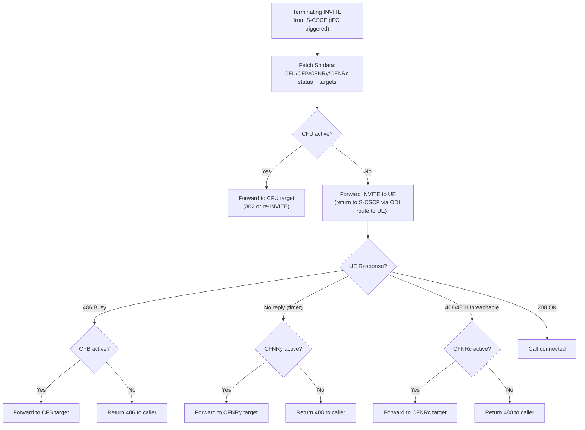

### Call Barring Checks (Originating)

On an originating INVITE:
1. Fetch Sh barring flags: BOIC (Barring Outgoing International Calls), BOIC-exHC (except Home Country), BAIC (Barring All Incoming), OIR (Originating Identification Restriction)
2. Check dialed number against barring rules
3. If barred: return 403 Forbidden toward S-CSCF (which returns it to UE)
4. If allowed: return INVITE to S-CSCF via ODI

### CLIR (Calling Line Identification Restriction)

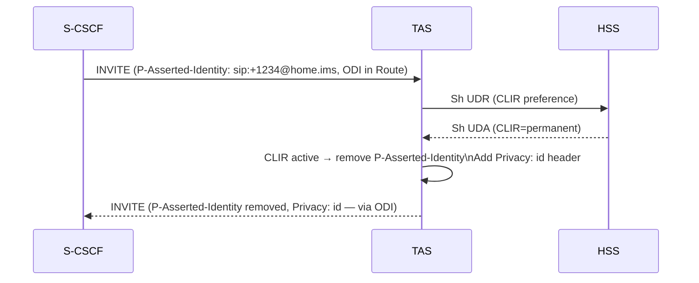

### Call Waiting

When UE is in an active call (has a SIP dialog in `confirmed` state) and a second INVITE arrives:
1. TAS detects: UE has active dialog
2. If CW enabled: forward INVITE to UE (UE rings while first call active)
3. UE sends HOLD on first call, accepts second via re-INVITE

---

## Voicemail Integration

TAS is typically co-located with or tightly coupled to the Voicemail AS. Two key flows:

### Voicemail Deposit (No-Reply Forward)

1. Terminating INVITE arrives at S-CSCF
2. iFC routes to TAS
3. TAS forwards to UE — no answer (CFNRy timer expires)
4. TAS re-routes to Voicemail AS (terminating UA mode)
5. Caller hears greeting → leaves message
6. Voicemail AS notifies TAS of new message

### Voicemail MWI (On-Registration)

Triggered by third-party REGISTER iFC:
1. UE registers → S-CSCF evaluates REGISTER iFCs
2. iFC `Registration-Type=INITIAL` matches → S-CSCF forks third-party REGISTER to TAS
3. TAS fetches subscriber Sh data: checks `Messages-Waiting` count
4. If voicemails waiting: TAS generates NOTIFY (originating UA) toward UE
5. UE displays MWI indicator

---

## Transcoding via MRFC (B2BUA)

When called UA cannot match calling UA's codec:

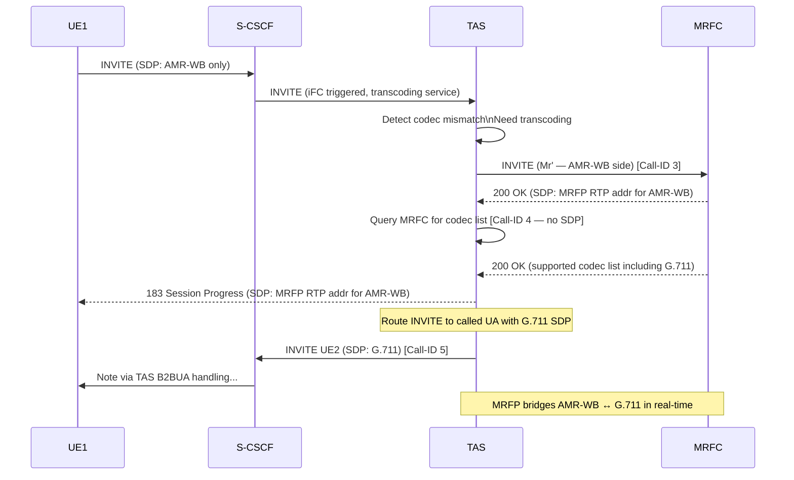

---

## TAS Data Model

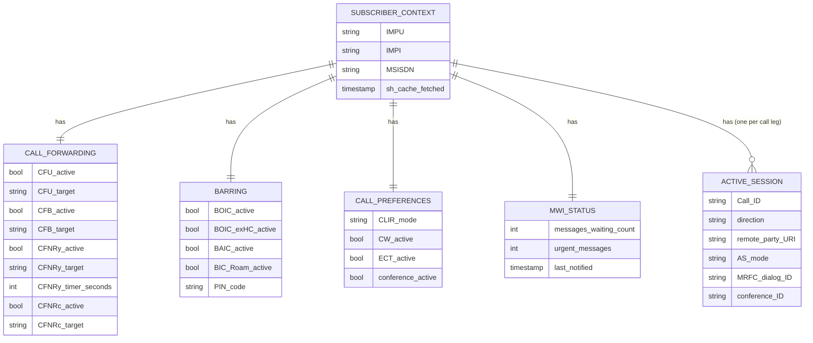

---

## Procedure Participation Summary

| Procedure | TAS Role | Mode | Key Action |
|---|---|---|---|
| VoLTE MO call (originating) | Apply MMTEL originating services | SIP proxy or B2BUA | CLIR, call barring check, CLIP insertion |
| VoLTE MT call (terminating) | Apply MMTEL terminating services | SIP proxy or Redirect | CFU/CFB/CFNRy/CFNRc check; forward or pass through |
| Call hold / resume | Hold music injection | B2BUA | Fork to MRFC for hold tone; control both legs |
| Multi-party conference | Conference anchor | B2BUA | Establish MRFC bridge; add parties one by one via Mr' |
| IMS registration (third-party) | MWI check | Originating UA | Fetch Sh MWI count; send NOTIFY to UE if messages waiting |
| Call transfer (ECT) | Transfer controller | B2BUA | Attended: establish consultation call; transfer target; release consult |
| Network-initiated de-register | Session cleanup | — | Receive notification; tear down active sessions |
| Voicemail deposit | Call terminator | Terminating UA | Accept call, play greeting, record message |
| Voicemail playback | Session originator | Originating UA | INVITE to UE; play messages via MRFC |
| DTMF collection | IVR controller | B2BUA | Receive RFC 2833 / SIP INFO DTMF; interact with MRFP |

---

## Ut Interface — Subscriber Self-Service

The Ut interface lets UEs manage their own service settings via standard HTTP/XCAP:

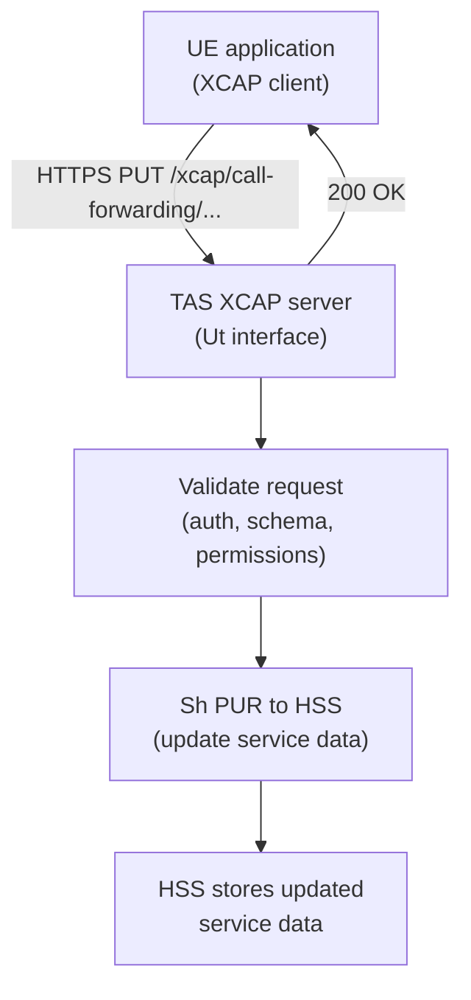

XCAP resource URIs (examples):
- `/xcap/call-forwarding/unconditional/forwarded-to/` — CFU target
- `/xcap/call-barring/outgoing-international/` — BOIC status
- `/xcap/communication-waiting/` — Call Waiting flag

TAS acts as the XCAP server and writes changes through to HSS via Sh PUR.

---

## Failure and Overload Behavior

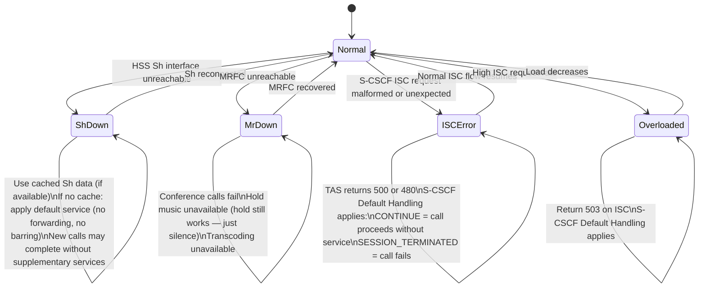

---

## Configuration Parameters

| Parameter | Description |
|---|---|
| ISC listening address | SIP URI for S-CSCF to route ISC requests to this TAS |
| S-CSCF realm | SIP domain/realm of the S-CSCF pool (for originating UA mode routing) |
| HSS Sh realm | Diameter realm/hostname for Sh queries |
| SLF address | SLF hostname (multi-HSS deployments for Dh) |
| MRFC address (Mr') | MRFC SIP URI for direct media resource requests |
| Sh cache TTL | How long to cache subscriber service data before re-fetching |
| Sh subscription mode | Subscribe-all (push) vs on-demand UDR per call |
| CFNRy timer default | Default no-reply timer (seconds) before forwarding |
| XCAP base URI | Base path for Ut XCAP resource tree |
| MWI poll interval | How often to check for new voicemail if no push notification |
| Conference media profile | Default codec / MRFC profile for conference bridges |
| Barring PIN enforcement | Whether PIN is required for barring activation/deactivation |
| Default CLIR | Permanent/temporary CLIR default if Sh data unavailable |

---

## Key Architectural Properties

| Property | Details |
|---|---|
| **Service data owner** | TAS is the runtime consumer of subscriber service data; HSS is the persistent store. The Sh interface bridges them |
| **Closest to subscriber intent** | TAS applies per-subscriber service preferences; all other IMS nodes apply operator-level routing logic |
| **Multi-mode flexibility** | TAS operates in all 5 AS modes within a single call (e.g. proxy for CLIR, then B2BUA for hold, then redirect for forwarding) |
| **Media controller** | TAS is the only node above the MRFC that issues SIP requests to MRFC (via Mr/Mr'). MRFP is controlled exclusively via H.248 from MRFC |
| **XCAP server** | TAS serves as the XCAP server for telephony service settings, translating HTTP XCAP operations into Sh PUR toward HSS |
| **Stateful per-call** | TAS maintains per-call leg state for B2BUA sessions (conference IDs, hold state, transfer state) |

---

## Cross-References

| Topic | Page |
|---|---|
| TAS base entity | [entities/TAS.md](TAS.md) |
| S-CSCF (ISC triggering) | [entities/S-CSCF.md](S-CSCF.md) |
| S-CSCF deep-dive | [entities/S-CSCF-deepdive.md](S-CSCF-deepdive.md) |
| HSS (Sh data source) | [entities/HSS.md](HSS.md) |
| HSS deep-dive | [entities/HSS-deepdive.md](HSS-deepdive.md) |
| MRFC/MRFP (media resources) | [entities/MRF.md](MRF.md) |
| MRB (resource broker) | [entities/MRB.md](MRB.md) |
| IMS Identity Model | [concepts/IMS-identity-model.md](../concepts/IMS-identity-model.md) |
| IM Call Model (iFC/ODI) | [concepts/IM-call-model.md](../concepts/IM-call-model.md) |
| AS interaction modes | [concepts/AS-interaction-modes.md](../concepts/AS-interaction-modes.md) |
| iFC worked examples | [analyses/iFC-worked-examples.md](../analyses/iFC-worked-examples.md) |
| VoLTE MO call | [procedures/VoLTE-MO-call.md](../procedures/VoLTE-MO-call.md) |
| VoLTE MT call | [procedures/VoLTE-MT-call.md](../procedures/VoLTE-MT-call.md) |
| IMS registration | [procedures/IMS-registration.md](../procedures/IMS-registration.md) |
| Session release | [procedures/session-release.md](../procedures/session-release.md) |
| IMS reference points | [interfaces/IMS-reference-points.md](../interfaces/IMS-reference-points.md) |
