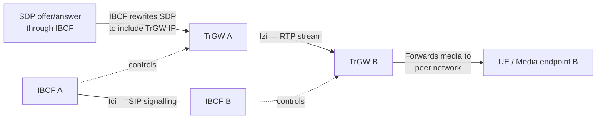
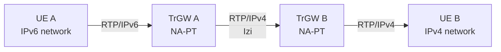

# TrGW — Transition Gateway

**Spec reference:** 3GPP TS 29.165 §5.2.2; 3GPP TS 23.002 (architecture); 3GPP TS 23.228 §4.2

## Role

The TrGW is a media-plane entity located at the network border, **controlled by the [IBCF](IBCF.md)**, that forwards media streams between IM CN subsystem networks over the Izi reference point. Its primary purpose is IPv4/IPv6 address translation and NAT traversal for media flows.

## Interfaces

| Interface | Peer | Protocol | Purpose |
|---|---|---|---|
| **Izi** | TrGW (peer network) or media handling node | RTP/UDP/IP | Cross-network media stream forwarding |
| _(control)_ | [IBCF](IBCF.md) | Proprietary / TS 24.229 §I.2 | IBCF instructs TrGW to open/close media paths, set translation rules |

## Functions

| Function | Description |
|---|---|
| **NA(P)T-PT** | Network Address (Port) Translation — Protocol Translation: binds IPv6 addresses with IPv4 addresses and vice versa. NA(P)T-PT provides transparent routing between two IP domains without requiring end-point changes. Translates TCP and UDP port numbers as needed |
| **IPv4/IPv6 protocol translation** | Converts between IPv4 and IPv6 packet headers transparently |
| **Media forwarding** | Relays RTP streams between peer TrGWs (or other media-handling nodes) at the Izi reference point |

## Relationship to IBCF

The TrGW is always co-located with or tightly coupled to an IBCF:

**Control flow:**
1. IBCF receives SDP offer from originating side
2. IBCF instructs TrGW to allocate a media relay address (IPv4 or IPv6 as needed)
3. IBCF rewrites SDP `c=` and `m=` lines to point to TrGW address
4. TrGW relays media from originating UE to TrGW in peer network
5. On session release, IBCF instructs TrGW to release the allocated media path

## IPv4/IPv6 Interworking Use Case

This is the primary reason TrGW exists: different IMS networks may deploy different IP versions, and the TrGW bridges the media plane transparently without requiring UE changes.

## Comparison with ePDG / SGW

| Node | Plane | Purpose |
|---|---|---|
| **TrGW** | Media (RTP) | Inter-IMS media relay + IPv4/IPv6 translation at II-NNI |
| **[ePDG](ePDG.md)** | User plane (GTP/IPsec) | Untrusted non-3GPP access gateway for EPC |
| **[SGW](SGW.md)** | User plane (GTP) | Intra-EPC mobility anchor |

## Related Pages

- [IBCF](IBCF.md) — controls TrGW for media path setup
- [II-NNI Interface](../interfaces/II-NNI.md) — Izi is the TrGW-to-TrGW reference point
- [IMS Reference Points](../interfaces/IMS-reference-points.md)
