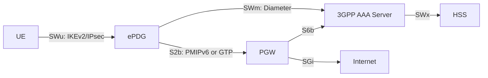
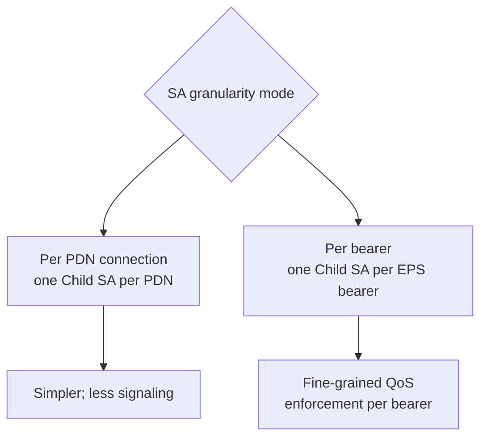
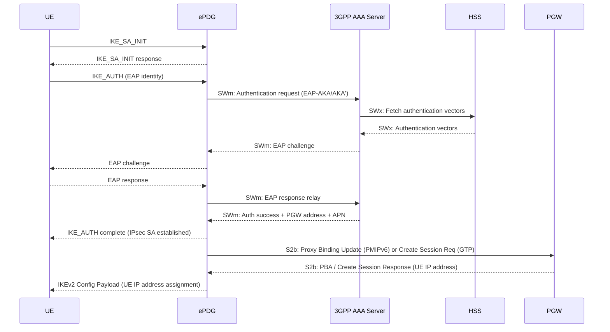
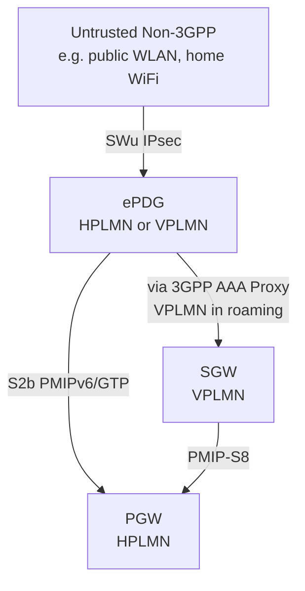

# ePDG — Evolved Packet Data Gateway

**Spec reference:** 3GPP TS 23.402 §4.3.4 (v15.3.0)

Related pages: [Non-3GPP Access Architecture](../concepts/non-3GPP-access-architecture.md) ·
[PGW](PGW.md) · [SGW](SGW.md) · [HSS](HSS.md) ·
[EPC Reference Points](../interfaces/reference-points.md)

---

## Role

The ePDG is the **secure gateway** between an untrusted non-3GPP IP access network
(e.g., public WiFi) and the EPC. It is the functional boundary between the untrusted
external access and the operator's trusted core network.

When a UE attaches via untrusted non-3GPP access (e.g. public WLAN), it must
establish an **IKEv2/IPsec tunnel** to the ePDG. All EPC traffic traverses this tunnel.
Without the ePDG, the UE would not be able to access the EPC at all via untrusted access.

---

## Functions (§4.3.4)

### Core Tunnel Functions

| Function | Description |
|---|---|
| **IKEv2 tunnel termination** | Terminates IKEv2 from UE on SWu interface; performs EAP-based authentication using 3GPP credentials (EAP-AKA/AKA') |
| **IPsec Security Association** | Establishes and maintains IPsec SAs between UE and ePDG; one SA per PDN connection, or optionally one SA per bearer |
| **Uplink packet routing** | Routes uplink packets from UE to correct PDN connection based on Traffic Flow Templates (TFTs) in IPsec SA |
| **Downlink packet routing** | Receives downlink packets from PGW; routes to correct IPsec SA for delivery to UE |

### Mobility and Session Anchor

| Function | Description |
|---|---|
| **MAG (Mobile Access Gateway)** | Acts as MAG for PMIPv6 on S2b; registers UE location with PGW (LMA) using Proxy Binding Update/Ack |
| **GTP support** | Alternative to PMIPv6: supports GTP-based S2b for user plane to PGW |
| **PDN connection binding** | Maintains mapping between SWu IPsec SA and S2b bearer/session toward PGW |

### QoS and Policy

| Function | Description |
|---|---|
| **QoS enforcement** | Enforces QoS received from 3GPP AAA Server (Gxb _(not fully specified this Release)_) or via S2b from PGW |
| **DSCP marking** | Maps EPS bearer QCI to appropriate DSCP on IPsec/IP packets |

### Mobility Protocol Support

| Function | Description |
|---|---|
| **MOBIKE support** | RFC 4555 MOBIKE: supports UE IP address change without full IKEv2 re-establishment (handles NAT traversal, IP address mobility within untrusted access) |
| **Multiple PDN connections** | One ePDG serves all PDN connections for a UE; each has its own IPsec SA and S2b tunnel |

### Operational Functions

| Function | Description |
|---|---|
| **Lawful Interception** | Supports LI requirements per applicable national/3GPP standards |
| **Charging** | Generates CDRs; forwards charging information to AAA/OCS/OFCS |
| **NAT traversal** | Supports UDP encapsulation for IKEv2/IPsec traversal through NAT devices |

---

## Interfaces

| Interface | Peer | Protocol | Direction | Purpose |
|---|---|---|---|---|
| **SWu** | UE | IKEv2 / IPsec (UDP 500/4500) | ↔ | Tunnel establishment, EAP auth, UE-EPC data transport |
| **SWn** | Untrusted Non-3GPP Access | IP | ↔ | Underlying IP transport for SWu |
| **S2b** | PGW | PMIPv6 or GTP | ↔ | User plane + mobility signaling to PGW |
| **SWm** | 3GPP AAA Server | Diameter | ↔ | ePDG authorization, PDN GW selection, QoS policy |

---

## IPsec SA Model

Two modes of SA granularity:

Each Child SA corresponds to one PDN connection (or one EPS bearer in per-bearer
mode). TFTs in the Child SA define which IP flows belong to which PDN connection.

---

## Authentication Flow (SWu + SWm)

---

## S2b Protocol Variants

| Variant | Signaling | UE IP address source |
|---|---|---|
| **PMIPv6** | ePDG sends Proxy Binding Update to PGW (LMA) | PGW allocates; returned in PBA |
| **GTP** | ePDG sends Create Session Request to PGW | PGW allocates; returned in Create Session Response |

Protocol variant selected based on ePDG/PGW capability and operator configuration.
Can be pre-configured or determined via DNS NAPTR records.

---

## ePDG Selection by UE (§4.5.4)

The UE constructs an FQDN and resolves via DNS:

| FQDN Type | Format | Use Case |
|---|---|---|
| Operator Identifier | `epdg.epc.mnc<MNC>.mcc<MCC>.pub.3gppnetwork.org` | Default; globally routable |
| Tracking Area Identity | encodes TAI | Location-based ePDG selection |
| Location Area Identity | encodes LAI | Location-based ePDG selection |

- UE configuration via **H-ANDSF** (Home-ANDSF policy from HPLMN) or **USIM**
- **One ePDG per UE**: all PDN connections from a UE are served by the same ePDG instance
  (UE must not distribute its PDN connections across multiple ePDGs)

---

## Deployment Context

In **roaming scenarios**, the ePDG may be in the VPLMN. Traffic then traverses:
ePDG → SGW (VPLMN) → PGW (HPLMN) via PMIP-S8 chaining, with the SGW acting as
local non-3GPP anchor.
