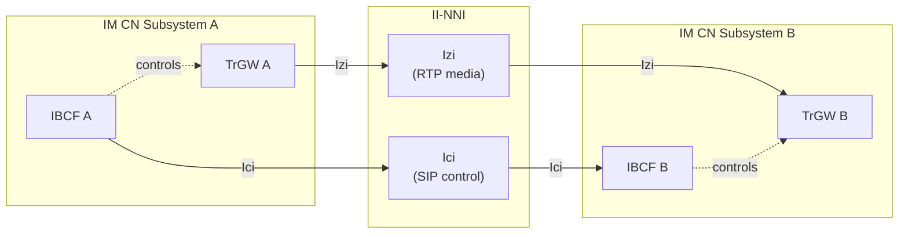
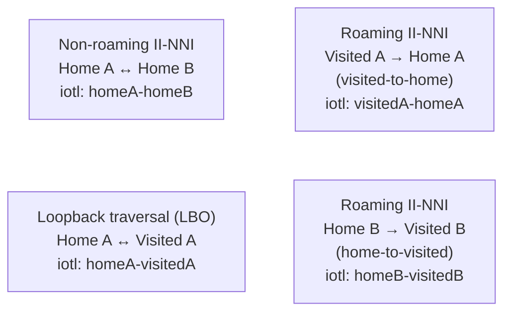
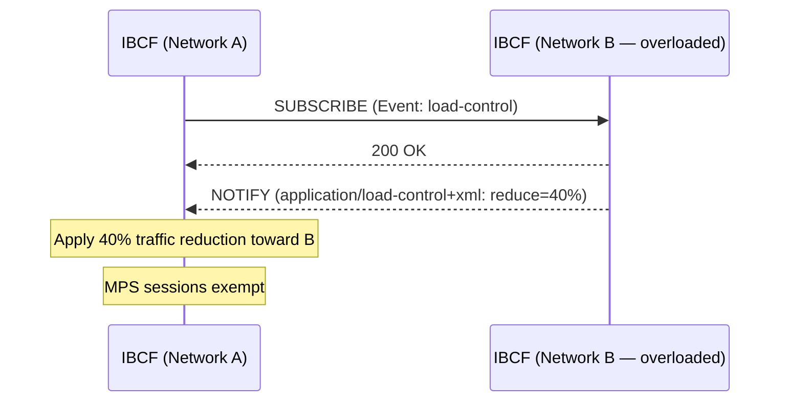

# II-NNI — Inter-IMS Network to Network Interface

**Spec reference:** 3GPP TS 29.165 v16.6.0 (primary); also referenced in 3GPP TS 23.228 §4.2

## Overview

The II-NNI (Inter-IMS Network to Network Interface) is the interconnection boundary between two separate IM CN subsystem networks. It enables end-to-end IMS services across different operators (roaming, inter-domain calling, federation) and consists of two reference points:

| Reference point | Between | Protocol | Plane |
|---|---|---|---|
| **Ici** | [IBCF](../entities/IBCF.md) ↔ [IBCF](../entities/IBCF.md) | SIP | Control (signalling) |
| **Izi** | [TrGW](../entities/TrGW.md) ↔ [TrGW](../entities/TrGW.md) | RTP/UDP | User (media) |



## Traversal Scenarios

TS 29.165 §5.3 defines four II-NNI traversal scenarios, identified by the `iotl` SIP URI parameter (IETF RFC 7549):



| Traversal scenario | `iotl` value | Description |
|---|---|---|
| **Non-roaming II-NNI** | `homeA-homeB` or `visitedA-homeB` | Direct inter-home-network call (home routing). Default when `iotl` absent |
| **Loopback** | `homeA-visitedA` | LBO scenario: INVITE from caller's home routed back to caller's visited network on same call leg |
| **Roaming (visited-to-home)** | `visitedA-homeA` | Request from UE's visited network to its home network |
| **Roaming (home-to-visited)** | `homeB-visitedB` | Request from callee's home network to callee's visited network |

## Control Plane (Ici) — SIP Specification

### Supported SIP Methods (Table 6.1)

| SIP method | II-NNI status |
|---|---|
| ACK, BYE, CANCEL, INVITE, OPTIONS, PRACK, UPDATE | **Mandatory** (m) |
| NOTIFY, SUBSCRIBE | **c1**: mandatory on roaming II-NNI, optional on non-roaming |
| REGISTER | **c2**: mandatory on roaming II-NNI, n/a on non-roaming |
| INFO | Optional (o) |
| REFER | Optional (o) |
| PUBLISH | **c1** (conditional) |
| MESSAGE | Optional (o) |

> **Note:** On non-roaming II-NNI, REGISTER is not applicable (UE registers via home network; no REGISTER traverses the inter-home II-NNI). On roaming II-NNI, REGISTER does traverse the II-NNI since UE's P-CSCF is in visited network and REGISTER must reach home I-CSCF.

### SIP Header Field Behaviour (Table 6.2)

25 SIP header fields/parameters have specified II-NNI behaviour distinguishing trust vs. no-trust scenarios:

| # | Header / Parameter | Trust relationship | No trust relationship |
|---|---|---|---|
| 1 | **P-Asserted-Identity** | Per TS 24.229 §4.4 | Stripped (§4.4 applied) |
| 2 | P-Access-Network-Info | Per TS 24.229 | Per TS 24.229 |
| 3 | Resource-Priority | Per TS 24.229 | Per TS 24.229 |
| 4 | **History-Info** | Per TS 24.229 | Per RFC 7044 §7 + TS 24.229 |
| 5 | P-Asserted-Service | Per TS 24.229 | Per TS 24.229 (NOTE 3) |
| 6 | **P-Charging-Vector** | Per TS 24.229 §5.10 | Per TS 24.229 §5.10 |
| 7 | P-Charging-Function-Addresses | Per TS 24.229 §5.10 | Per TS 24.229 §5.10 |
| 8 | P-Profile-Key | Per TS 24.229 §4.4 | Per TS 24.229 §4.4 |
| 9 | P-Private-Network-Indication | Per TS 24.229 §4.4 | Per TS 24.229 §4.4 |
| 10 | **P-Served-User** (roaming only) | Per TS 24.229 §4.4 | Not applicable at II-NNI |
| 11 | Reason (in response) | Per TS 24.229 | Per TS 24.229 |
| 12 | P-Early-Media | Per TS 24.229 | Per TS 24.229 |
| 13 | Feature-Caps | Per TS 24.229 | Per TS 24.229 |
| 14 | Priority (PSAP callback) | Per TS 24.229 | Per TS 24.229 |
| 15 | `iotl` SIP URI parameter | Per TS 24.229 | Per TS 24.229 |
| 16 | `cpc` tel URI parameter | Per TS 24.229 §7.2A.12 | Per TS 24.229 §7.2A.12 |
| 17 | `oli` tel URI parameter | Per TS 24.229 §7.2A.12 | Per TS 24.229 §7.2A.12 |
| 18 | Restoration-Info | Per TS 24.229 §7.2.11 | Per TS 24.229 §7.2.11 |
| 19 | Relayed-Charge | Per TS 24.229 §7.2.12 | Not applicable at II-NNI |
| 20 | Service-Interact-Info | Per TS 24.229 §7.2.14 | Per TS 24.229 §7.2.14 |
| 21 | Cellular-Network-Info | Per TS 24.229 §7.2.15 | Per TS 24.229 §7.2.15 |
| 22 | Response-Source | Per TS 24.229 §7.2.17 | Per TS 24.229 §7.2.17 |
| 23 | **Attestation-Info** (non-roaming only) | Per TS 24.229 §7.2.18 | Per TS 24.229 §7.2.18 |
| 24 | **Origination-Id** (non-roaming only) | Per TS 24.229 §7.2.19 | Per TS 24.229 §7.2.19 |
| 25 | Additional-Identity | Per TS 24.229 §7.2.20 | Per TS 24.229 §7.2.20 |

**Headers applicable only on roaming II-NNI** (not on non-roaming): Authentication-Info, Authorization, P-Associated-URI, P-Called-Party-ID, P-Preferred-Service, P-Profile-Key, P-Served-User, P-Visited-Network-ID, Path, Priority-Share, Proxy-Authenticate, Proxy-Authorization, Resource-Share, Restoration-Info, Service-Route, WWW-Authenticate.

**Headers applicable only on non-roaming II-NNI**: P-Refused-URI-List, Identity, Attestation-Info, Origination-Id.

### Major Capabilities Profile

127 capability items defined (Table 6.1.3.1). Key notation codes:

| Code | Meaning |
|---|---|
| m | Mandatory at II-NNI |
| o | Optional (by bilateral operator agreement) |
| n/a | Not applicable at II-NNI |
| c1 | Mandatory on roaming II-NNI, else optional |
| c2 | Mandatory on roaming II-NNI, else n/a |
| c3 | Optional on roaming II-NNI, else optional |
| c4 | Mandatory if trust relationship, else n/a |
| c5 | Optional on non-roaming II-NNI and loopback, else n/a |
| c6 | Optional if trust relationship, else n/a |

Selected highlights:

| Capability | Status |
|---|---|
| Initiating a session (INVITE) | m |
| Terminating a session (BYE) | m |
| Privacy (P-Asserted-Identity, Privacy header) | m |
| SIP SUBSCRIBE/NOTIFY | c1 |
| REGISTER | c2 |
| Path header (for registration routing) | c2 |
| P-Asserted-Identity extension (RFC 3325) | c4 |
| SCTP transport (RFC 4168) | o |
| SigComp compression | n/a |
| Session timer (RFC 4028) | m |
| RFC 6442 Location conveyance | m |
| Referred-By mechanism | m |
| Call completion (CCBS/CCNR) | o |
| PSAP callback | o |
| 3GPP PS data off extension | c3 |
| RLOS | c3 |

### SDP Protocol

- Offer/answer model per IETF RFC 3264
- `application/sdp` MIME body per RFC 3261 + RFC 4566
- **SDP body is not encrypted over II-NNI** (IBCF needs to read/modify SDP)
- TCP-based media streams (RFC 4145) may be used

### Control Plane Transport

- Complies with TS 24.229 §4.2A
- TCP is default transport
- SCTP (RFC 4168) is optional but recommended for reliability over Ici

### SIP Timers at II-NNI (Table 6.3.1)

| Timer | Meaning | Recommended value |
|---|---|---|
| T1 | RTT estimate | 500ms default (extendable) |
| T2 | Max retransmit interval (non-INVITE req + INVITE resp) | 4s |
| T4 | Max duration in network | 5s |
| Timer C | Proxy INVITE transaction timeout | >3 min |
| Timer D | Wait for response retransmits | >32s (UDP); 0s (TCP/SCTP) |
| Timers A, E, G | Retransmit intervals | Initially T1 |
| Timers B, F, H, J, N | Transaction/wait timeouts | 64×T1 |

## User Plane (Izi) — Media Specification

### Supported Transport Protocols (Table 7.2.1)

| Protocol | RFC | Status |
|---|---|---|
| RTP | RFC 3550 | Mandatory |
| UDP | RFC 768 | Mandatory |
| RTP profile for A/V (RTP/AVP) | RFC 3551 | Mandatory |
| SDP bandwidth modifiers for RTCP | RFC 3556 | Mandatory |
| RTP/AVPF (feedback) | RFC 4585 | Optional (used by MTSI) |
| TCP | RFC 793 | Optional (used by MSRP) |
| SCTP-DTLS data channel | RFC 8841 | Optional (used by telepresence) |

### Media and Codec Handling

- End-to-end codec negotiation via SDP offer/answer between IM CN subsystems
- **Risk**: codec negotiation may fail if no common codec is supported by UEs (especially for voice)
- **Mitigation**: IBCF or MRFC can **insert additional codecs** into SDP or **remove incompatible codecs**; TrGW (or MRFP) can transcode
- **Best practice**: Transcoding should be minimized — apply as little as possible per inter-operator agreements
- Codecs per TS 26.114 and ETSI TS 181 005

## Supported MIME Bodies (Table 6.1.4.1 — selected)

| MIME type | Usage at II-NNI |
|---|---|
| `application/sdp` | Session descriptions (always) |
| `application/3gpp-ims+xml` | 3GPP IMS extensions |
| `multipart/mixed`, `multipart/related` | Combined bodies (presence §15, messaging §16) |
| `application/pidf+xml` | Presence information (§15) |
| `application/vnd.3gpp.srvcc-ext+xml` | SRVCC (§14.5.1) |
| `application/vnd.3gpp.iut+xml` | Inter-UE Transfer (§18) |
| `application/vnd.3gpp.ussd` | USSD (§12.24) |
| `application/vnd.3gpp.mcptt-info+xml` | Mission Critical PTT (§28) |
| `application/conference-info+xml` | Conference event package (§28.2.4) |
| `application/session-load-control+xml` | Overload control (§21) |
| `application/vnd.etsi.sci+xml` | SIP tariff information (§11.3) |

## Numbering, Naming and Addressing (§8)

### URI formats at II-NNI

| URI type | Non-roaming II-NNI | Roaming II-NNI | Loopback |
|---|---|---|---|
| SIP URI | Mandatory | Mandatory | Mandatory |
| tel URI (E.164 global number) | Per agreement | Mandatory | Mandatory |
| IM URI | Per agreement | Per agreement | Per agreement |
| PRES URI | Per agreement | Per agreement | Per agreement |
| MSRP URI (SDP) | Per agreement | Mandatory | Per agreement |

**tel URI number format:** Global E.164 number format (IETF RFC 3966) in user=phone parameter or in P-Asserted-Identity, except when bilateral agreement allows local/national numbers.

### URI parameters

| Parameter | Format | II-NNI applicability |
|---|---|---|
| `sos` | SIP URI/Contact | Mandatory at roaming II-NNI (emergency call identifier) |
| `oli` / `cpc` | tel URI / SIP URI | Per agreement (carrier-specific origin indicators) |
| `rn` / `npdi` | tel URI / SIP URI | Per agreement (number portability routing) |
| `isub` | tel URI | Per agreement (subscriber subaddress) |
| `premium-rate` | tel URI / SIP URI | Per agreement (premium rate identification, roaming II-NNI) |
| `iotl` | SIP URI | Per TS 24.229 §7.2A.5 (traversal scenario identification) |

Public Service Identities (PSI — SIP URIs without port numbers per TS 23.003 §13.5) may be exchanged per operator agreement.

> The "Unavailable User Identity" as defined in TS 23.003 §35 may be in P-Asserted-Identity at non-roaming II-NNI or loopback traversal, per agreement.

---

## IP Version (§9)

Network elements interconnected at II-NNI may support IPv4 only, IPv6 only, or both — based on operator option and bilateral agreement.

When IPv4 and IPv6 networks are interconnected, IBCFs and TrGWs apply IP version interworking procedures per 3GPP TS 29.162.

---

## Security (§10)

Supported security mechanisms for IP signalling transport over II-NNI are per 3GPP TS 33.210 (NDS/IP — Network Domain Security).

---

## Charging at II-NNI (§11)

### P-Charging-Vector IOI rules (§11.2)

The P-Charging-Vector header carries originating IOI (`orig-ioi`) and terminating IOI (`term-ioi`) entries. The IOI type used depends on the II-NNI scenario:

| II-NNI scenario | P-Charging-Vector in requests | P-Charging-Vector in responses |
|---|---|---|
| **Roaming II-NNI** | Type 1 `orig-ioi` = visited originating network | Type 1 `orig-ioi` + type 1 `term-ioi` (visited + home networks) |
| **Home network II-NNI** (non-roaming, between two home networks) | Type 2 `orig-ioi` = home originating network | Type 2 `orig-ioi` + type 2 `term-ioi` (home originating + home terminating) |
| **LBO (loopback)** — visited to home, home to terminating | Type 2 `orig-ioi` = visited originating | Type 2 `orig-ioi` + type 2 `term-ioi` (visited orig + home term) |
| **Transit scenario** | `transit-ioi` = transit network identity/identities | Same |

> **Note:** Network identifiers for IOI populations (type 1 "orig-ioi", "term-ioi", "transit-ioi") must be exchanged bilaterally in advance.

REGISTER, initial SIP requests, and stand-alone SIP requests carry the IOI. SIP responses (except 100 Trying) carry both `orig-ioi` and `term-ioi`.

### Tariff information transfer (§11.3)

Transfer of IP multimedia service tariff information via `application/vnd.etsi.sci+xml` MIME body (per TS 29.658):
- Supported in INVITE request and 18x responses (`handling=required` or `handling=optional` per agreement)
- Supported in INFO request (per agreement)
- Based on bilateral operator agreement

---

## Supplementary Services at II-NNI (§12)

All supplementary service interworking is based on bilateral operator agreement. The MMTEL communication service is identified by `urn:urn-7:3gpp-service.ims.icsi.mmtel`.

### Service reference table

| Service | §12 clause | Key SIP elements at II-NNI |
|---|---|---|
| **MCID** (Malicious Communication Identification) | §12.2 | P-Asserted-Identity mandatory; INFO + `application/vnd.etsi.mcid+xml` |
| **OIP/OIR** (Originating Identification Presentation/Restriction) | §12.3 | P-Asserted-Identity + Privacy (id/user/none/header/critical); trust determines pass-through; P-Asserted-Identity anonymised by IBCF on no-trust |
| **TIP/TIR** (Terminating Identification Presentation/Restriction) | §12.4 | P-Asserted-Identity + Privacy; `from-change` option tag (RFC 4916) |
| **ACR** (Anonymous Communication Rejection) | §12.5 | P-Asserted-Identity + Privacy; 433 (Anonymity Disallowed) response |
| **CDIV** (Communication DIVersion) | §12.6 | Diversion header; History-Info with `mp` + `cause`; 181 response; MESSAGE for indication; Privacy `history` value |
| **CW** (Communication Waiting) | §12.7 | `application/vnd.3gpp.cw+xml` in INVITE; Alert-Info `urn:alert:service:call-waiting` in 180; 480 with Q.850 cause=19 |
| **HOLD** (Communication Hold) | §12.8 | Per TS 24.610 |
| **MWI** (Message Waiting Indication) | §12.9 | `message-summary` event package in SUBSCRIBE; `application/simple-message-summary` MIME body in NOTIFY (roaming II-NNI) |
| **ICB** (Incoming Communication Barring) | §12.10.1 | 603 Decline + Reason SIP/cause=603 + cause=603 in BYE; optionally IIFC transparency |
| **OCB** (Outgoing Communication Barring) | §12.10.2 | 603 Decline + Reason SIP/cause=603 |
| **CCBS** (Call Completion to Busy Subscriber) | §12.11 | 486 + Call-Info `call-completion` + `m=BS`; 199 (Early Dialog Terminated); REFER recall; SUBSCRIBE/NOTIFY `call-completion` event package |
| **CCNR** (Call Completion on No Reply) | §12.12 | 180 + Call-Info `call-completion` + `m=NR`; 480 (m=NR); 199; REFER; SUBSCRIBE/NOTIFY |
| **ECT** (Explicit Communication Transfer) | §12.13 | REFER + Referred-By + Replaces (§12.13.1); Assured transfer: Expires in Refer-To, `method=CANCEL` in Refer-To header |
| **CAT** (Customized Alerting Tone) | §12.14 | P-Early-Media; 199; `early-session` option tag; `application/sdp` early session; SIP INFO for DTMF |
| **CRS** (Customized Ringing Signal) | §12.15 | Alert-Info `urn:alert:service:crs`; `application/vnd.3gpp.crs+xml` in INVITE; early-session option tag |
| **CUG** (Closed User Group) | §12.16 | `application/vnd.etsi.cug+xml` in INVITE; 403/603/500 responses; if `handling=required` on no-agreement, IBCF rejects with 603 |
| **PNM** (Personal Network Management) | §12.17 | `g.3gpp.iari_ref` with `urn:urn-7:3gpp-application.ims.iari.pnm-controller`; `histinfo` option tag; History-Info header |
| **3PTY** (Three-Party) | §12.18 | Same as CONF (§12.19) + Replaces header field in Refer-To SIP URI |
| **CONF** (Conference) | §12.19 | REFER (mandatory on roaming II-NNI); `isfocus` feature parameter in Contact; `conference` event package (SUBSCRIBE/NOTIFY) with `application/conference-info+xml`; `Allow-Events: conference` in INVITE |
| **FA** (Flexible Alerting) | §12.20 | 486 Busy Here |
| **Announcements** | §12.21 | P-Early-Media (§12.21.2); Alert-Info in 180; Call-Info in re-INVITE (§12.21.3); Error-Info in 3xx/4xx/5xx/6xx; Reason header |
| **AOC** (Advice of Charge) | §12.22 | `application/vnd.etsi.aoc+xml` in INVITE, 18x-200, INFO, BYE; 504 + Reason SIP/Q.850=31 |
| **CCNL** (Call Completion on Not Logged-in) | §12.23 | 480 + Call-Info `call-completion` + `m=NL`; 199; SUBSCRIBE/NOTIFY `call-completion` event |
| **USSD** (Unstructured Supplementary Service Data) | §12.24 | `Recv-Info: g.3gpp.ussd`; `application/vnd.3gpp.ussd` in INVITE/200 OK/INFO/BYE |
| **eCNAM** (Enhanced Calling Name) | §12.25 | Display-name in From + P-Asserted-Identity + Call-Info headers (roaming II-NNI direction home→visited) |
| **MuD** (Multi-Device) | §12.26.1 | No specific SIP requirements |
| **MiD** (Multi-Identity) | §12.26.2 | Additional-Identity header (per TS 24.229 §7.2.20) in INVITE/REFER/MESSAGE |

> **Architecture note:** The IBCF may remove or modify header fields carrying supplementary service information based on local policy (e.g. removing Alert-Info, Call-Info, Error-Info when passing through). Operators should agree on which services are transparently passed vs. intercepted.

---

## ICS over II-NNI (§13)

IMS Centralised Services (ICS) extensions carried over II-NNI:

| Element | Description |
|---|---|
| `g.3gpp.ics` feature tag | In INVITE/REGISTER Contact; indicates ICS-capable UE or network |
| `g.3gpp.accesstype` feature tag | Identifies UE access type (IM CN, CS, etc.) |
| **Target-Dialog** header | Used by ICS AS to target a specific early dialog |
| **P-Early-Media** header | Carried under trust relationship per TS 24.229 |
| REFER `method=BYE` / `method=INVITE` | Used for ICS call transfer and session setup |

```mermaid
sequenceDiagram
    participant IBCF_A as IBCF (Network A)
    participant IBCF_B as IBCF (Network B)
    Note over IBCF_A,IBCF_B: ICS INVITE — g.3gpp.ics in Contact
    IBCF_A->>IBCF_B: INVITE (Contact: g.3gpp.ics; Target-Dialog)
    IBCF_B-->>IBCF_A: 200 OK (P-Early-Media)
    Note over IBCF_A,IBCF_B: ICS Transfer — REFER with method=INVITE
    IBCF_A->>IBCF_B: REFER (Refer-To: sip:target?method=INVITE)
    IBCF_B-->>IBCF_A: 202 Accepted
```

---

## IMS Service Continuity at II-NNI (§14)

Service continuity (SRVCC and DRVCC) signal passes the II-NNI when source or target network differs from the serving network.

### Feature tags

| Feature tag | Purpose |
|---|---|
| `g.3gpp.srvcc` | PS-to-CS SRVCC capability |
| `g.3gpp.cs2ps-srvcc` | CS-to-PS SRVCC capability |
| `g.3gpp.dynamic-stn` | Dynamic STN (Session Transfer Number) allocation |
| `g.3gpp.atcf` | ATCF presence in the path |
| `g.3gpp.atcf-mgmt-uri` | Management URI for ATCF |
| `g.3gpp.atcf-path` | ATCF routing path |

### Access transfer variants at II-NNI

| Clause | Transfer type | Direction | Key SIP elements |
|---|---|---|---|
| §14.2 | PS-to-CS SRVCC (basic) | PS IMS → CS domain | INVITE with `g.3gpp.srvcc` feature tag; STN-SR in Request-URI |
| §14.2 | PS-to-CS SRVCC (alerting) | PS early session → CS | REFER + Target-Dialog; Refer-To `method=INVITE` |
| §14.2 | PS-to-CS SRVCC (pre-alerting) | Before answer | REFER + `method=CANCEL` + `method=INVITE` |
| §14.2 | PS-to-CS SRVCC (ATCF) | Via ATCF anchor | IBCF passes `g.3gpp.atcf-path` header |
| §14.2 | PS-to-CS SRVCC (mid-call) | During established session | REFER (`method=INVITE`) + BYE to old leg |
| §14.5 | CS-to-PS | CS domain → PS IMS | INVITE with `application/vnd.3gpp.srvcc-ext+xml` body |
| §14.6 | PS-to-CS DRVCC | Data session PS → CS | REFER; `g.3gpp.srvcc` applies to data |
| §14.7 | CS-to-PS DRVCC | Data session CS → PS | INVITE with DRVCC body |
| §14.8 | PS-PS access transfer | Between PS accesses | REFER + Replaces; `g.3gpp.iut-controller` for collaborative |

> ATCF (Access Transfer Control Function) acts as anchor during PS-to-CS transfer. The `g.3gpp.atcf` feature tag appears in REGISTER Contact to signal ATCF insertion; `g.3gpp.atcf-path` is passed at II-NNI so the remote network can target the ATCF directly. See [entities/ATCF.md](../entities/ATCF.md).

---

## Presence at II-NNI (§15)

Presence service based on SIP PUBLISH/SUBSCRIBE/NOTIFY (RFC 3903, RFC 3856, RFC 3857, RFC 3858):

| Message | Event package | Body |
|---|---|---|
| PUBLISH | `presence` | `application/pidf+xml` |
| SUBSCRIBE | `presence`, `presence.winfo` (watcher info) | — |
| NOTIFY | `presence` | `application/pidf+xml` |
| NOTIFY | `presence.winfo` | `application/watcherinfo+xml` |
| NOTIFY (diff) | `presence` | `application/pidf-diff+xml` (RFC 5263) |

**OMA Release 1.1 enhancements:**
- Suppress-If-Match for rate-limited NOTIFY
- gzip encoding for large presence documents

**OMA Release 2.0 enhancements:**
- `application/vnd.oma.suppnot+xml` for throttling agreements
- P-Preferred-Service carrying `urn:urn-7:3gpp-service.ims.icsi.oma.cpm.msg` or presence ICSI

**Roaming scenario note:** At roaming II-NNI, SUBSCRIBE/NOTIFY traverse II-NNI between home and visited IBCF pairs.

---

## Messaging at II-NNI (§16)

### Page-mode messaging

- Standalone **MESSAGE** request per TS 24.247
- **Recipient-list**: `application/resource-lists+xml` body for multi-recipient delivery
- **Is-composing**: `application/im-iscomposing+xml` body for typing indicators (RFC 3994)
- MESSAGE body: `text/plain`, `text/html`, `multipart/mixed`, or `message/cpim`

### Session-mode messaging (MSRP)

- Session established via INVITE/2xx with SDP `a=accept-types:message/cpim text/plain`
- MSRP URI mandatory at roaming II-NNI (see §8 URI table)
- Media carried over Izi on TCP

### Conference messaging

- Conferencing is established via REFER + `isfocus` parameter; messaging within conference follows session-mode MSRP

---

## Optimal Media Routeing (OMR) at II-NNI (§17)

OMR allows minimisation of TrGW hops by negotiating direct media paths when IP realms overlap across II-NNI.

### SDP attributes (added by IBCF/P-CSCF)

| SDP attribute | Purpose |
|---|---|
| `a=visited-realm:<name>` | Identifies the visited IP realm of the IBCF |
| `a=secondary-realm:<name>` | Secondary realm when dual-homed |
| `a=omr-codecs:<list>` | Codec list for OMR consideration |
| `a=omr-m-att:<attrs>` | OMR media-level attributes (main path) |
| `a=omr-s-att:<attrs>` | OMR media-level attributes (secondary path) |
| `a=omr-m-bw:<bw>` | Bandwidth for OMR main path |
| `a=omr-s-bw:<bw>` | Bandwidth for OMR secondary path |
| `a=omr-s-cksum:<val>` | Checksum for secondary OMR path verification |
| `a=omr-m-cksum:<val>` | Checksum for main OMR path verification |

> **Constraint:** IP realm names used in OMR attributes must be globally unique across interconnecting networks. Operators must pre-agree on realm name assignments.

---

## Inter-UE Transfer (IUT) at II-NNI (§18)

### Without collaborative session

- Transfer using **REFER + Replaces** (move ongoing session to different UE)
- Transfer using **REFER + Target-Dialog** (target a specific dialog leg)
- IBCF passes REFER transparently; `application/vnd.3gpp.iut+xml` body for IUT control

### With collaborative session

- `g.3gpp.iut-controller` feature tag in Contact identifies the controlling UE
- REFER sent outside any dialog to add/remove UEs from collaborative session
- IBCF must forward REFER targeting collaborative session anchor

### Session and media replication

| Mode | Mechanism |
|---|---|
| Pull mode | Remote UE sends REFER + `application/vnd.3gpp.replication+xml`; source UE's media leg redirected |
| Push mode | Controller UE sends REFER to transfer its own media to remote; `replaces` in Refer-To |

---

## Roaming LBO Architecture (§19)

Local Breakout (LBO) roaming introduces additional II-NNI traversal between home and visited networks.

| Feature tag / parameter | Purpose |
|---|---|
| `g.3gpp.trf` | Identifies Transit and Roaming Function node in path |
| `g.3gpp.loopback` | Identifies loopback traversal scenario |
| `loopback-indication` in P-Charging-Vector | Flags the loopback traversal for charging correlation |

The `iotl=homeA-visitedA` parameter (§5.3 traversal scenarios) identifies the loopback II-NNI. IBCF in visited network inserts `g.3gpp.trf` into Feature-Caps.

---

## Media Resource Broker (MRB) Delivery (§20)

When an AS in one network needs to reserve MRFC resources via a Media Resource Broker (MRB) in the peer network:

- `g.3gpp.mrb` feature-capability indicator in **Feature-Caps** header (INVITE/200 OK)
- MRB address carried in the feature-capability value field
- Sent per bilateral operator agreement; IBCF may suppress if not supported by peer

---

## Overload Control at II-NNI (§21)

Two complementary mechanisms:

### Feedback-based overload control (RFC 7339)
- No additional II-NNI-specific mechanism required beyond RFC 7339
- IBCF propagates overload advisory to upstream entities

### Load filter (load-control event package)

| Element | Detail |
|---|---|
| Trigger | Network sends SUBSCRIBE to `load-control` event |
| Response | Peer sends NOTIFY with `application/load-control+xml` body |
| Effect | Subscribing network applies traffic reduction based on load parameters |
| MPS exemption | Multimedia Priority Service (MPS) sessions are exempt from load filtering |



---

## Additional Features and Extensions (§22–§33)

### §22 — Original Destination Identity Delivery

Delivered via **History-Info** header `mp` parameter in the initial INVITE. Allows the terminating network to determine the original dialled number before any diversion.

### §23 — Telepresence

- `+sip.clue` header in INVITE/UPDATE/200 OK
- Identifies CLUE (Controlling mULtiple streams for TElepresence) capability (RFC 8846)
- SDP carries SCTP-DTLS data channel (`a=dcmap`, `a=sctpmap`) for CLUE protocol channel

### §24 — Barring of Premium Rate Numbers

- `premium-rate` URI parameter in Request-URI tel URI/SIP URI at roaming II-NNI
- Allows visited network to apply barring based on premium-rate indication
- Used per bilateral agreement (see also §8 URI parameters)

### §25 — P-CSCF Restoration at II-NNI

Two restoration mechanisms applicable at home-to-visited II-NNI:

| Mechanism | How it works |
|---|---|
| **PCRF/PCF based** | Home network includes **Restoration-Info** header (with IMSI) in home-to-visited INVITE; visited P-CSCF uses this to restore IMS anchor |
| **HSS/UDM based** | 408 or 504 SIP error responses from visited network carry **Restoration-Info** header back to home; home HSS/UDM triggers P-CSCF restoration |

### §26 — Resource Sharing

**Resource-Share** header conveys resource-sharing constraints across II-NNI:
- Allowed in: ACK, INVITE, PRACK, REGISTER, UPDATE (requests); 18x and 2xx responses
- Only applicable per bilateral agreement; IBCF may suppress on no-agreement

### §27 — Service Access Number Translation

- `cause=380` URI parameter in SIP Redirect (3xx response) signals a service access number
- Allows translation of service numbers (e.g., short codes) across II-NNI

### §28 — Mission Critical Services (MCPTT / MCVideo / MCData)

Key SIP elements at II-NNI for mission critical (§28 is the largest subsection):

| Sub-feature | Key mechanism |
|---|---|
| Session establishment | INVITE with ICSI `urn:urn-7:3gpp-service.ims.icsi.mcptt` (PTT) / mcvideo / mcdata |
| MBMS bearer | `application/vnd.3gpp.mcptt-mbms-usage-info+xml` body |
| Affiliation (mandatory mode) | SUBSCRIBE to `g.3gpp.mcptt-affiliation` event |
| Affiliation (negotiated mode) | `Accept-Contact` with `g.3gpp.mcptt-affiliation-type` |
| Conference event | `application/conference-info+xml` via SUBSCRIBE/NOTIFY |
| MC registration | REGISTER with MC service ICSI in P-Preferred-Service |
| Group regrouping | REFER + `application/vnd.3gpp.mcptt-regroup+xml` |
| Signalling plane data (§28.2.8) | SIP INFO with `application/vnd.3gpp.mcdata-payload` |
| Functional alias (§28.2.9) | SUBSCRIBE to `g.3gpp.functional-alias` event |

### §29 — Calling Number Verification (STIR/SHAKEN)

| Header / parameter | Applicability at II-NNI |
|---|---|
| **Attestation-Info** | Mandatory on non-roaming II-NNI (trust/no-trust); per TS 24.229 §7.2.18 |
| **Origination-Id** | Mandatory on non-roaming II-NNI; per TS 24.229 §7.2.19 |
| **Identity** (RFC 8224) | Optional; per bilateral agreement |
| `verstat` SIP URI parameter | Verification status from STIR verification service |
| 607 Unwanted | Response to flagged spam call |
| `g.3gpp.verstat` feature-capability | Indicates verstat support in Feature-Caps |
| `sip.607` feature-capability | Indicates 607 Unwanted response support |

> **Note:** Attestation-Info and Origination-Id are in the non-roaming-only list of Table A.1 (Annex A). They are not applicable on roaming II-NNI.

### §30 — IMS Emergency over II-NNI

| Element | Detail |
|---|---|
| `sos` URI parameter | Mandatory at roaming II-NNI (identifies emergency call) |
| Emergency URN | `urn:service:sos` or sub-types in Request-URI at non-roaming II-NNI |
| NG-eCall MSD | Main body `application/emergencyCall.MSD` in INVITE/INFO for eCall (NG-eCall) |
| Priority header | `emergency` value for PSAP callback priority |

### §31 — Restricted Local Operator Services (RLOS)

- `+g.3gpp.rlos` Contact parameter in REGISTER identifies RLOS user
- P-Preferred-Service: `urn:ims.icsi.rlos` for RLOS sessions
- Applicable on roaming II-NNI when UE registered for RLOS only (non-authenticated); `c3` status

### §32 — PS Data Off

- `+g.3gpp.ps-data-off` media feature tag in REGISTER Contact
- Signals that the UE has PS Data Off active (only IMS signalling, emergency and specific data exempted)
- Applicable per roaming bilateral agreement (`c3` conditional status in capability profile)

### §33 — MTSI Data Channel

| Element | Detail |
|---|---|
| `+sip.app-subtype=webrtc-datachannel` | Contact/Accept-Contact header parameter |
| `a=dcmap` | SDP attribute mapping data channel streams |
| `a=3GPP-qos-hint` | SDP attribute for QoS hint on data channel |
| Stream IDs at II-NNI | Streams 100 and 110 exposed at II-NNI; streams 0 and 10 are local-only |

---

## SIP Header Fields Summary — Annex A (Table A.1)

Table A.1 catalogues 76 SIP header fields with II-NNI applicability codes. Key notation:

| Code | Meaning |
|---|---|
| m | Mandatory at II-NNI |
| o | Optional (by agreement) |
| n/a | Not applicable at II-NNI |
| a | Applicable (neither mandatory nor optional — just defined) |
| conditional | Applicable only on roaming II-NNI, or only with trust, etc. |

### Mandatory (m) headers — always applicable at II-NNI

Accept, Accept-Contact, Accept-Encoding, Accept-Language, Allow, Call-ID, CSeq, Contact, Content-Disposition, Content-Encoding, Content-Length, Content-Type, Date, Event, From, Max-Forwards, MIME-Version, Min-SE, Organization, RAck, RSeq, Record-Route, Referred-By, Reject-Contact, Require, Route, Session-Expires, Supported, Timestamp, To, Trigger-Consent, Unsupported, User-Agent, Via

### Not applicable (n/a) at II-NNI

P-Charging-Function-Addresses, P-Media-Authorization, P-Preferred-Identity, Security-Client, Security-Server, Security-Verify, Relayed-Charge

### Conditional on roaming II-NNI only

Authentication-Info, Authorization, P-Associated-URI, P-Called-Party-ID, P-Preferred-Service, P-Visited-Network-ID, Path, Proxy-Authenticate, Proxy-Authorization, Service-Route, WWW-Authenticate

### Conditional on trust relationship

P-Asserted-Identity, P-Access-Network-Info, P-Early-Media, Service-Interact-Info

### Conditional on non-roaming II-NNI only

Attestation-Info, Origination-Id, Identity, P-Refused-URI-List

---

## Related Pages

- [IBCF](../entities/IBCF.md) — the Ici signalling endpoint
- [TrGW](../entities/TrGW.md) — the Izi media endpoint
- [IMS Reference Points](IMS-reference-points.md) — intra-IMS reference points
- [IMS Registration](../procedures/IMS-registration.md) — REGISTER traverses roaming II-NNI
- [VoLTE MO Call](../procedures/VoLTE-MO-call.md) — INVITE traverses II-NNI
- [Charging Architecture](../concepts/IMS-charging-architecture.md) — IOI/ICID at II-NNI
