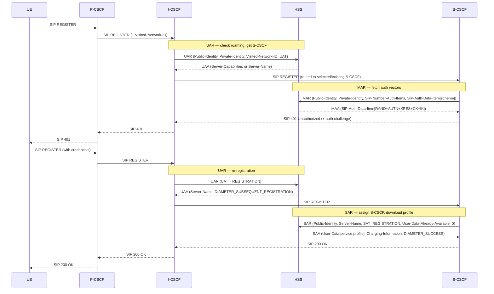
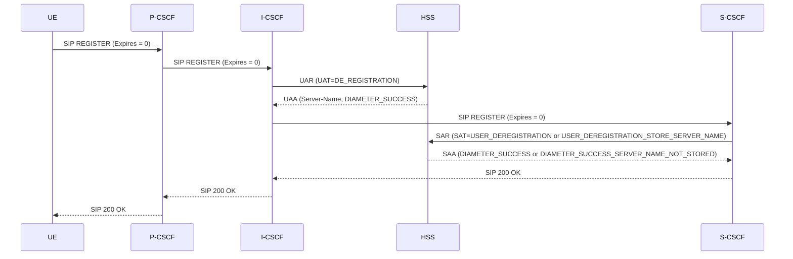
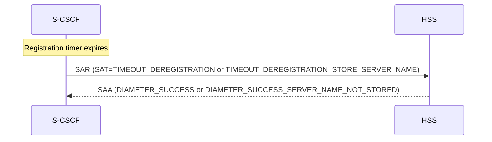
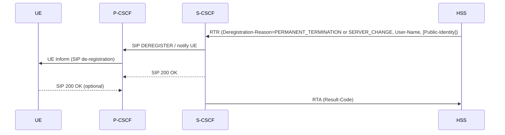
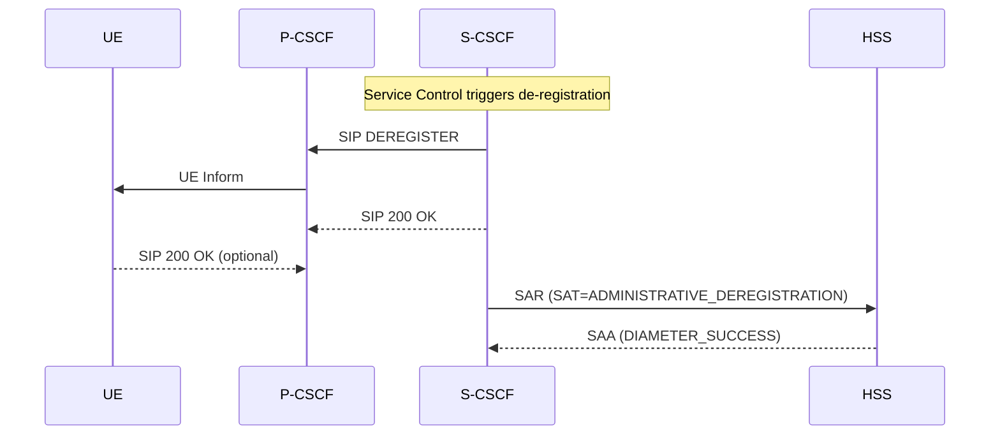
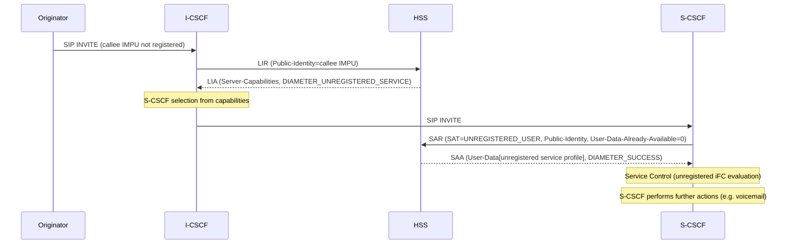
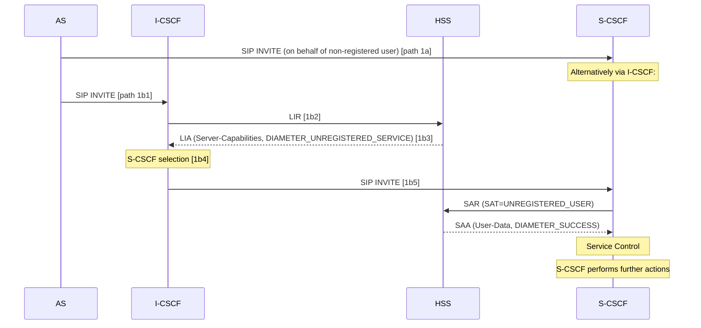
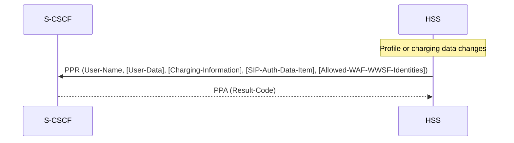

# Cx Interface Signalling Flows and Procedures

This page documents the normative signalling flows and message parameter tables for all Cx interface procedures between the [HSS](../entities/HSS.md), [I-CSCF](../entities/I-CSCF.md), and [S-CSCF](../entities/S-CSCF.md), as specified in 3GPP TS 29.228 v18.0.0. For Diameter command ABNF and AVP definitions see [Cx/Dx Diameter Protocol](../protocols/Cx-Diameter.md) (TS 29.229).

---

## Procedure Classification (§5.1.5)

| Category | Operations | Initiator |
|---|---|---|
| Location management | Registration status query (UAR/UAA), S-CSCF reg/dereg notification (SAR/SAA), Network-initiated deregistration (RTR/RTA), User location query (LIR/LIA) | I-CSCF (UAR/LIR), S-CSCF (SAR), HSS (RTR) |
| User data handling | User Profile download (via SAR/SAA), HSS-initiated User Information update (PPR/PPA) | S-CSCF (SAR), HSS (PPR) |
| Authentication | Authentication request/response (MAR/MAA) | S-CSCF |
| IMS Restoration | S-CSCF restoration info backup/retrieval (via SAR), P-CSCF restoration trigger (via SAR-Flags) | S-CSCF |

**P-CSCF** has no interaction with HSS over Cx (§5.1.1). The Presentity Presence Proxy uses Cx mechanisms via the Px interface (§5.1.6).

---

## §6.1.1 — User Registration Status Query (UAR/UAA)

**Initiator:** [I-CSCF](../entities/I-CSCF.md)  
**Purpose:** Authorize a UE registration; check roaming permission; obtain S-CSCF name or required S-CSCF capabilities  
**Functional operation:** Cx-Query + Cx-Select-Pull (TS 23.228)  
**Diameter commands:** UAR (code 300) → UAA (code 300)

### Table 6.1.1.1 — User Registration Status Request

| Information Element | Diameter AVP | Cat. | Description |
|---|---|---|---|
| Public User Identity | Public-Identity | M | PUI to be registered |
| Visited Network Identifier | Visited-Network-Identifier | M | Identifies the visited network for roaming check |
| Type of Authorization | User-Authorization-Type | C | REGISTRATION (initial/re-reg), DE_REGISTRATION (expires=0 or de-reg), REGISTRATION_AND_CAPABILITIES (force S-CSCF selection). Absent treated as REGISTRATION |
| Private User Identity | User-Name | M | Private User Identity |
| Routing Information | Destination-Host, Destination-Realm | C | Destination-Host present if HSS address known |
| UAR Flags | UAR-Flags | O | IMS Emergency Registration indication (§7.19) |

### Table 6.1.1.2 — User Registration Status Response

| Information Element | Diameter AVP | Cat. | Description |
|---|---|---|---|
| Result | Result-Code / Experimental-Result | M | Operation result |
| S-CSCF Capabilities | Server-Capabilities | O | Required capabilities for S-CSCF selection (absent = any S-CSCF acceptable) |
| S-CSCF Name | Server-Name | C | Name of the already-assigned S-CSCF (SIP URI) |

### HSS Detailed Behaviour (§6.1.1.1)

HSS processing order (stops and returns error at first failure):

1. If WebRTC supported (TS 23.228 U.2.1.4): check if Private and Public Identity managed by a third party — if so, skip to step 4.
2. Check Private User Identity and Public User Identity exist in HSS → else `DIAMETER_ERROR_USER_UNKNOWN`
3. Check PUI matches a distinct Public User Identity → else `DIAMETER_ERROR_USER_UNKNOWN`
4. Check PUI is associated with the Private User Identity → else `DIAMETER_ERROR_IDENTITIES_DONT_MATCH`
5. Check PUI not barred from multimedia sessions:
   - IMS Emergency Registration (UAR-Flags set) → skip barring check, continue to step 5
   - Otherwise: if PUI is barred, check whether there are non-barred PUIs in the implicit registration set — if yes continue; if none → `DIAMETER_AUTHORIZATION_REJECTED`
6. Check User-Authorization-Type:
   - REGISTRATION or absent → check roaming permission → if not allowed: `DIAMETER_ERROR_ROAMING_NOT_ALLOWED`; if allowed: `DIAMETER_AUTHORIZATION_REJECTED`; emergency registration bypasses roaming check
   - REGISTRATION_AND_CAPABILITIES → same roaming check, then always return Server-Capabilities (enables I-CSCF to select new S-CSCF even if one already assigned, sets S-CSCF reassignment pending flag in HSS)
   - DE_REGISTRATION → no roaming check
7. Check registration state of PUI:
   - **Registered** → return stored S-CSCF name; result `DIAMETER_SUBSEQUENT_REGISTRATION` (REGISTRATION) or `DIAMETER_SUCCESS` (DE_REGISTRATION)
   - **Unregistered** (has S-CSCF keeping profile) → return stored S-CSCF name; `DIAMETER_SUCCESS`; on REGISTRATION → `DIAMETER_SUBSEQUENT_REGISTRATION`
   - **Not registered** → check subscription for existing S-CSCF assignment:
     - If another PUI in same subscription is registered → return that S-CSCF name, `DIAMETER_SUBSEQUENT_REGISTRATION`, no Server-Capabilities
     - If another PUI is unregistered (S-CSCF keeping profile) → same
     - If S-CSCF assigned but identity not registered and authentication pending flag set → `DIAMETER_SUBSEQUENT_REGISTRATION`
     - If no S-CSCF in subscription → may return Server-Capabilities, result `DIAMETER_FIRST_REGISTRATION`

---

## §6.1.2 — S-CSCF Registration/Deregistration Notification (SAR/SAA)

**Initiator:** [S-CSCF](../entities/S-CSCF.md)  
**Purpose:** Assign S-CSCF to Public Identity; download user information; trigger P-CSCF Restoration  
**Functional operation:** Cx-Put + Cx-Pull (TS 23.228)  
**Diameter commands:** SAR (code 301) → SAA (code 301)

### Table 6.1.2.1 — SAR Request

| Information Element | Diameter AVP | Cat. | Description |
|---|---|---|---|
| Public User Identity / Public Service Identity | Public-Identity | C | One PUI/PSI only if SAT is non-deregistration type; list for deregistration SATs; at least one PUI required if SAT implies deregistration and Private Identity is absent |
| S-CSCF Name | Server-Name | M | Name of the requesting S-CSCF |
| Private User Identity / Private Service Identity | User-Name | C | Absent for UNREGISTERED_USER SAT; for deregistration SATs absent if no Public-Identity AVPs |
| Server Assignment Type | Server-Assignment-Type | M | Type of assignment (REGISTRATION, RE_REGISTRATION, USER_DEREGISTRATION, TIMEOUT_DEREGISTRATION, DEREGISTRATION_TOO_MUCH_DATA, etc.) |
| User Data Already Available | User-Data-Already-Available | M | USER_DATA_NOT_AVAILABLE (0) or USER_DATA_ALREADY_AVAILABLE (1) — controls whether HSS sends User-Data |
| Routing Information | Destination-Host | C | Present if S-CSCF knows HSS name |
| Wildcarded Public Identity | Wildcarded-Public-Identity | O | Present when request concerns a Wildcarded PSI or Wildcarded PUI for certain SAT values |
| S-CSCF Restoration Information | SCSCF-Restoration-Info | C | Sent on REGISTRATION or RE_REGISTRATION if IMS Restoration Procedures supported and S-CSCF has restoration info changed vs previous |
| Multiple Registration Indication | Multiple-Registration-Indication | C | When IMS Restoration Procedures supported, SAT=REGISTRATION, and PUI is not stored as registered with Private User Identity |
| Session-Priority | Session-Priority | O | Session priority level for HSS processing order |
| SAR Flags | SAR-Flags | O | P-CSCF Restoration Indication (§7.28) |
| Failed P-CSCF | Failed-PCSCF | O | Address of failed P-CSCF; only when SAR-Flags includes P-CSCF Restoration Indication |

### Table 6.1.2.2 — SAA Response

| Information Element | Diameter AVP | Cat. | Description |
|---|---|---|---|
| Private User Identity | User-Name | C | Absent when SAT=UNREGISTERED_USER and PUI not known to HSS |
| Registration result | Result-Code / Experimental-Result | M | Result |
| User Profile | User-Data | C | Present when SAT≠NO_ASSIGNMENT, REGISTRATION, RE_REGISTRATION, or UNREGISTERED_USER per §6.6 |
| Charging Information | Charging-Information | C | Present with User-Data per §6.6.1; includes Charging-Collection-Function-Name and/or Primary-Event-Charging-Function-Name if available |
| Associated Private Identities | Associated-Identities | O | All Private Identities in same IMS subscription (absent if subscription has only one IMPI) |
| Loose-Route Indication | Loose-Route-Indication | C | LOOSE_ROUTE_REQUIRED or LOOSE_ROUTE_NOT_REQUIRED |
| S-CSCF Restoration Information | SCSCF-Restoration-Info | C | Present if stored and SAT=UNREGISTERED_USER or NO_ASSIGNMENT; also if SAT=REGISTRATION or RE_REGISTRATION and multiple Private Identities share the subscription |
| Associated Registered Private Identities | Associated-Registered-Identities | C | All Private Identities registered with the PUI at REGISTRATION time (if IMS Restoration supported and multiple IMPIs) |
| S-CSCF Name | Server-Name | C | Name of assigned S-CSCF; present if requesting S-CSCF name differs from previously stored |
| Wildcarded Public Identity | Wildcarded-Public-Identity | C | Present if request concerns a wildcarded public identity |
| Priviledged-Sender Indication | Priviledged-Sender-Indication | O | Indicates Private User Identity shall be treated as a privileged sender |
| Allowed WAF and/or WWSF Identities | Allowed-WAF-WWSF-Identities | C | WebRTC WAF/WWSF addresses; present when applicable to subscription and User-Data is present |

### HSS Detailed Behaviour (§6.1.2.1)

Key processing steps:

1. Check PUI and Private Identity exist in HSS → `DIAMETER_ERROR_USER_UNKNOWN`
2. If multiple Public-Identity AVPs present and SAT applies to only one identity → `DIAMETER_AVP_OCCURS_TOO_MANY_TIMES`
3. Check Public Identity type:
   - Distinct PUI: proceed to step 5
   - Public Service Identity: check PSI Activation State → `DIAMETER_ERROR_USER_UNKNOWN` if inactive
4. Check SAT value:
   - REGISTRATION, RE_REGISTRATION, USER_DEREGISTRATION, etc. for distinct PUI → continue
   - PSI + REGISTRATION-type SATs → `DIAMETER_ERROR_IN_ASSIGNMENT_TYPE`
5. Check S-CSCF assignment and SAT:
   - **SAT = REGISTRATION or RE_REGISTRATION**:
     - If S-CSCF already assigned and different from requesting → without restoration: `DIAMETER_ERROR_IDENTITY_ALREADY_REGISTERED`; with restoration and reassignment pending flag → overwrite, reset flag
     - If no S-CSCF or same S-CSCF → store S-CSCF name, set PUI registered, download user data per §6.6, result `DIAMETER_SUCCESS`
     - If multiple registration indication and PUI not stored as registered with IMPI and IMS Restoration supported → store but don't overwrite restoration info for that IMPI, return `DIAMETER_ERROR_IN_ASSIGNMENT_TYPE`
   - **SAT = UNREGISTERED_USER**:
     - If P-CSCF-Restoration-Indication in SAR-Flags: HSS notifies serving nodes (SGSN/MME via S6a/S6d IDR/IDA; SMF via Nudm_UECM_P-CSCF-RestNotification) → result `DIAMETER_SUCCESS`; PUI set to Unregistered; S-CSCF Restoration Info cleared
     - Without P-CSCF Restoration: check whether PUI is for S-CSCF requesting data (for unregistered-state service). Store S-CSCF name; download user info per §6.6; result `DIAMETER_SUCCESS`
   - **SAT = TIMEOUT_DEREGISTRATION, USER_DEREGISTRATION, ADMINISTRATIVE_DEREGISTRATION**:
     - Check if emergency registration exists for each PUI in request (via S-CSCF response's Identities-with-Emergency-Registration IE)
     - TIMEOUT/USER_DEREGISTRATION: if HSS decides to keep S-CSCF name → `DIAMETER_SUCCESS`; if not → `DIAMETER_SUCCESS_SERVER_NAME_NOT_STORED`
     - ADMINISTRATIVE_DEREGISTRATION with P-CSCF-Restoration-Indication: check serving node support; notify nodes
   - **SAT = AUTHENTICATION_FAILURE or AUTHENTICATION_TIMEOUT**: clear S-CSCF name only if PUI is Not Registered
   - **SAT = NO_ASSIGNMENT**: check S-CSCF identity; download S-CSCF Restoration Information if stored; result `DIAMETER_SUCCESS`

**Wildcarded Public Identity handling**: If S-CSCF receives a Wildcarded-Public-Identity in UAA from I-CSCF, it SHALL use it in SAR to fetch the profile. If S-CSCF does NOT receive a Wildcarded-Public-Identity, it SHALL NOT perform wildcarded matching; it uses the public identity directly for SAR.

**User data overflow**: If HSS returns more data than S-CSCF can accept, S-CSCF returns `DIAMETER_ERROR_TOO_MUCH_DATA`. HSS then initiates network de-registration with SERVER_CHANGE, triggering I-CSCF to select a new S-CSCF.

---

## §6.1.3 — Network Initiated De-registration by HSS (RTR/RTA)

**Initiator:** [HSS](../entities/HSS.md)  
**Purpose:** HSS de-registers Public Identities and notifies S-CSCF  
**Functional operation:** Cx-Deregister (TS 23.228)  
**Diameter commands:** RTR (code 304) → RTA (code 304)

### Table 6.1.3.1 — RTR Request

| Information Element | Diameter AVP | Cat. | Description |
|---|---|---|---|
| Public User Identity / Public Service Identity | Public-Identity | C | List of PUIs/PSIs to de-register; present if reason is NEW_SERVER_ASSIGNED; may be present with others |
| Private User Identity / Private Service Identity | User-Name | M | HSS always sends a Private Identity known to S-CSCF from a prior SAR/SAA |
| Reason for de-registration | Deregistration-Reason | M | Textual message + reason code (see below) |
| Routing Information | Destination-Host | M | S-CSCF address from prior SAR Origin-Host |
| Associated Private Identities | Associated-Identities | O | Other Private Identities in same IMS subscription to de-register together |
| RTR Flags | RTR-Flags | O | Reference Location Information change indication (§7.30) |

### RTR Reason Codes

| Reason Code | Meaning |
|---|---|
| PERMANENT_TERMINATION | S-CSCF will no longer be assigned; no other S-CSCF can be assigned (e.g. subscription cancellation, IP-address secure binding change when GIBA used) |
| NEW_SERVER_ASSIGNED | A new S-CSCF has been assigned due to prior S-CSCF unavailability |
| SERVER_CHANGE | S-CSCF capabilities changed in HSS or S-CSCF indicates insufficient memory; HSS forces all registrations to re-register |
| REMOVE_S-CSCF | S-CSCF no longer assigned for an unregistered PUI |

### Table 6.1.3.2 — RTA Response

| Information Element | Diameter AVP | Cat. | Description |
|---|---|---|---|
| Result | Result-Code / Experimental-Result | M | Result |
| Associated Private Identities | Associated-Identities | C | All Private Identities de-registered with the request (if more than one) |
| Identities with Emergency Registration | Identity-with-Emergency-Registration | C | Private/Public Identity pairs NOT de-registered due to emergency registration |

### HSS Detailed Behaviour (§6.1.3.1)

De-registration options:
- One PUI or list of PUIs (applicable to all reason codes) — HSS may include all PUIs associated with User-Name
- One or more Private Identities with all associated PUIs (applicable to PERMANENT_TERMINATION, SERVER_CHANGE, REMOVE_S-CSCF only — no Public-Identity AVPs)
- All PSIs matching a Wildcarded PSI
- A Wildcarded PUI (HSS sends a distinct PUI from the same implicit registration set + the associated Private Service Identity)

**Emergency registration protection**: Public Identities emergency-registered in S-CSCF are NOT de-registered when RTR carries PERMANENT_TERMINATION or REMOVE_S-CSCF:
- If ALL identities to de-register are emergency registered → `DIAMETER_UNABLE_TO_COMPLY` + list of protected pairs
- If a PROPER SUBSET are emergency registered → `DIAMETER_LIMITED_SUCCESS` + list of protected pairs; remaining identities are de-registered

For each non-emergency PUI:
- Registered with only one IMPI: set to Not Registered, clear S-CSCF name
- Registered with multiple IMPIs: keep Registered state and S-CSCF name
- Unregistered: set to Not Registered, clear S-CSCF name (unless emergency registered)

---

## §6.1.4 — User Location Query (LIR/LIA)

**Initiator:** [I-CSCF](../entities/I-CSCF.md)  
**Purpose:** Obtain S-CSCF name assigned to a Public Identity, or AS name for PSI direct routing  
**Functional operation:** Cx-Location-Query (TS 23.228)  
**Diameter commands:** LIR (code 302) → LIA (code 302)

### Table 6.1.4.1 — LIR Request

| Information Element | Diameter AVP | Cat. | Description |
|---|---|---|---|
| Public User / Service Identity | Public-Identity | M | Identity to locate |
| Routing Information | Destination-Host, Destination-Realm | C | Destination-Host present if HSS known |
| Originating Request | Originating-Request | O | Indicates request is related to an originating SIP message |
| Type of Authorization | User-Authorization-Type | C | Set to REGISTRATION_AND_CAPABILITIES if IMS Restoration supported and current S-CSCF cannot be contacted |
| Session Priority | Session-Priority | O | Priority level |

### Table 6.1.4.2 — LIA Response

| Information Element | Diameter AVP | Cat. | Description |
|---|---|---|---|
| Result | Result-Code / Experimental-Result | M | Result |
| S-CSCF Name / AS Name | Server-Name | C | SIP URI of serving S-CSCF, or AS name for PSI direct routing |
| S-CSCF Capabilities | Server-Capabilities | O | Capabilities to help I-CSCF select S-CSCF |
| Wildcarded Public Identity | Wildcarded-Public-Identity | O | If request matches a Wildcarded PSI or Wildcarded PUI — distinct match takes precedence over wildcarded |
| LIA Flags | LIA-Flags | O | PSI Direct Routing Indication (§7.27) |

### HSS Detailed Behaviour (§6.1.4.1)

1. Check PUI is known → `DIAMETER_ERROR_USER_UNKNOWN`
2. Check identity type:
   - **PSI**: Check PSI Activation State → `DIAMETER_ERROR_USER_UNKNOWN` if inactive. If AS name stored and request doesn't contain Originating-Request AVP → return AS name (DIAMETER_SUCCESS). If IMS Restoration supported and UAT=REGISTRATION_AND_CAPABILITIES → may reject
   - **PUI**: proceed to step 2a
3. If IMS Restoration supported and UAT=REGISTRATION_AND_CAPABILITIES → may return Server-Capabilities, set S-CSCF reassignment pending flag
4. Check PUI registration state:
   - **Registered** → return stored S-CSCF name, `DIAMETER_SUCCESS`
   - **Unregistered** (S-CSCF keeping profile) → return stored S-CSCF name, `DIAMETER_SUCCESS`
   - **Not registered but has terminating unregistered services** or request contains Originating-Request → return S-CSCF name (if one exists in subscription), `DIAMETER_SUCCESS`. If no S-CSCF → may return Server-Capabilities, `DIAMETER_UNREGISTERED_SERVICE`
   - **Not registered, no terminating services, no Originating-Request** → `DIAMETER_ERROR_IDENTITY_NOT_REGISTERED`

---

## §6.2 — User Data Handling Procedures

### §6.2.1 — User Profile Download

User profile download occurs as part of the SAR/SAA exchange (§6.1.2). The S-CSCF obtains user data and service-related information via the Cx-Put Resp operation.

### §6.2.2 — HSS Initiated Update of User Information (PPR/PPA)

**Initiator:** [HSS](../entities/HSS.md)  
**Purpose:** Push updated user profile, charging information, allowed WAF/WWSF identities, or SIP Digest auth data to S-CSCF  
**Note:** SHALL NOT be used to add, delete, or update IMSI value  
**Diameter commands:** PPR (code 305) → PPA (code 305)

### Table 6.2.2.1 — PPR Request

| Information Element | Diameter AVP | Cat. | Description |
|---|---|---|---|
| Private User Identity | User-Name | M | Known to S-CSCF from earlier SAR/SAA |
| User Profile | User-Data | C | Updated user profile per §7.7 and §6.6. Present if user profile changed. Absent if only charging info or WAF/WWSF changed |
| Authentication Data | SIP-Auth-Data-Item | C | SIP Digest authentication info; present if SIP Digest scheme is used and password changed |
| Charging Information | Charging-Information | C | Charging addresses; present if charging info changed. Absent if SIP-Auth-Data-Item or User-Data absent |
| Routing Information | Destination-Host | M | Name of S-CSCF (from Origin-Host of prior SAR) |
| Allowed WAF and/or WWSF Identities | Allowed-WAF-WWSF-Identities | C | Present if WAF/WWSF identities changed |

### Table 6.2.2.2 — PPA Response

| Information Element | Diameter AVP | Cat. | Description |
|---|---|---|---|
| Result | Result-Code / Experimental-Result | M | Result (see Table 6.2.2.1.1 for valid codes) |

### Valid PPA Result Codes (Table 6.2.2.1.1)

| Result Code | Condition |
|---|---|
| DIAMETER_SUCCESS | Request succeeded |
| DIAMETER_ERROR_NOT_SUPPORTED_USER_DATA | S-CSCF received data it cannot recognise or support |
| DIAMETER_ERROR_USER_UNKNOWN | Private Identity not found in S-CSCF |
| DIAMETER_ERROR_TOO_MUCH_DATA | S-CSCF cannot accept the volume of data |
| DIAMETER_UNABLE_TO_COMPLY | General failure |

### HSS Detailed Behaviour (§6.2.2.1)

- If multiple registered IMPIs associated with the PUI: HSS sends one request and arbitrarily selects one IMPI for User-Name. For Wildcarded PUI updates: HSS sends one request with the Wildcarded-Public-Identity.
- S-CSCF **overwrites** existing data for the indicated PUI with the received User-Data (except in error cases per Table 6.2.2.1.1).
- If S-CSCF returns `DIAMETER_ERROR_USER_UNKNOWN` → HSS re-sends to another arbitrarily selected IMPI. If no restoration procedures: sets unknown IMPI's registration status to "not registered".
- If S-CSCF returns `DIAMETER_ERROR_TOO_MUCH_DATA` → HSS initiates RTR with SERVER_CHANGE → I-CSCF selects new S-CSCF.

---

## §6.3 — Authentication Procedures (MAR/MAA)

**Initiator:** [S-CSCF](../entities/S-CSCF.md)  
**Purpose:** Retrieve authentication vectors from HSS; resolve AKA sequence number synchronization failures; promote NASS-level auth; retrieve GIBA IP-address secure binding  
**Functional operation:** Cx-AV-Req + Cx-AV-Req-Resp (TS 33.203)  
**Diameter commands:** MAR (code 303) → MAA (code 303)

### Table 6.3.1 — MAR Request

| Information Element | Diameter AVP | Cat. | Description |
|---|---|---|---|
| Public User Identity | Public-Identity | M | Distinct PUI of the user |
| Private User Identity | User-Name | M | Private User Identity |
| Number Authentication Items | SIP-Number-Auth-Items | M | Number of AVs requested (SIP Digest, NASS Bundled, GIBA support at most 1) |
| Authentication Data | SIP-Auth-Data-Item | M | See Table 6.3.2 |
| S-CSCF Name | Server-Name | M | Name of S-CSCF (SIP URL) |
| Routing Information | Destination-Host | C | Present if S-CSCF knows HSS name |

### Table 6.3.2 — Authentication Data in MAR Request

| Information Element | Diameter AVP | Cat. | Description |
|---|---|---|---|
| Authentication Scheme | SIP-Authentication-Scheme | M | Authentication scheme to use |
| Authentication Context | SIP-Authentication-Context | C | Present for auth schemes requiring context; absent for IMS-AKA |
| Authorization Information | SIP-Authorization | C | Present only for IMS-AKA synchronization failures; only IMS-AKA schemes allowed |

### Table 6.3.4 — MAA Response

| Information Element | Diameter AVP | Cat. | Description |
|---|---|---|---|
| User Identity | Public-Identity | C | Present when result is DIAMETER_SUCCESS |
| Private User Identity | User-Name | C | Present when result is DIAMETER_SUCCESS |
| Number Authentication Items | SIP-Number-Auth-Items | C | Number of AVs in response; for SIP Digest, NASS Bundled, GIBA → value 1 |
| Authentication Data | SIP-Auth-Data-Item | C | Absent if SIP-Number-Auth-Items = 0 or absent; see Table 6.3.5 |
| Result | Result-Code / Experimental-Result | M | Result |

### Table 6.3.5 — Authentication Data in MAA Response

| Information Element | Diameter AVP | Cat. | Description |
|---|---|---|---|
| Item Number | SIP-Item-Number | C | IMS-AKA only; ordering for multiple AVs (lower number processed first) |
| Authentication Scheme | SIP-Authentication-Scheme | M | Authentication scheme |
| Authentication Information | SIP-Authenticate | C | IMS-AKA only: RAND + AUTN |
| Authorization Information | SIP-Authorization | C | IMS-AKA only: XRES |
| Confidentiality Key | Confidentiality-Key | C | IMS-AKA only: CK |
| Integrity Key | Integrity-Key | C | IMS-AKA only: IK |
| Digest Authenticate | SIP-Digest-Authenticate | C | SIP Digest only (Table 6.3.7): Digest-Realm, Digest-QoP, Digest-HA1 |
| Line Identifier | Line-Identifier | C | NASS Bundled authentication only |
| Framed IP Address | Framed-IP-Address | C | GIBA only (UE IPv4 address) |
| Framed IPv6 Prefix | Framed-IPv6-Prefix | C | GIBA only (UE IPv6 address) |
| Framed Interface Id | Framed-Interface-Id | C | GIBA only (if IPv6 prefix alone not unique) |

### Table 6.3.7 — SIP Digest Authenticate (grouped AVP content)

| Information Element | Diameter AVP | Cat. | Description |
|---|---|---|---|
| Digest Realm | Digest-Realm | M | Realm parameter per IETF RFC 3261 |
| Digest Algorithm | Digest-Algorithm | O | If present → algorithm; if absent → MD5 assumed. Backward compat: MD5 only in Digest-Algorithm |
| Digest QoP | Digest-QoP | M | Quality of Protection; set to "auth" by HSS |
| Digest HA1 | Digest-HA1 | M | H(A1) for MD5 algorithm per RFC 7616 |
| Alternate Digest Algorithm | Alternate-Digest-Algorithm | O | NOTE 2: if present, Digest HA1 must also be present and contains MD5 hash |
| Alternate Digest HA1 | Alternate-Digest-HA1 | O | H(A1) for the Alternate Digest Algorithm |

### HSS Detailed Behaviour (§6.3.1)

1. Check Private and Public User Identity exist → `DIAMETER_ERROR_USER_UNKNOWN`
2. PUI matches distinct PUI → `DIAMETER_ERROR_USER_UNKNOWN`
3. PUI and Private Identity associated → `DIAMETER_ERROR_IDENTITIES_DONT_MATCH`
4. Check authentication scheme:
   - "Unknown" → check stored scheme; if neither NASS-Bundled nor SIP Digest → `DIAMETER_ERROR_AUTH_SCHEME_NOT_SUPPORTED`
   - Explicit scheme unsupported → `DIAMETER_ERROR_AUTH_SCHEME_NOT_SUPPORTED`
   - IMS-AKA sync failure: compare S-CSCF name in MAR to stored → if different and IMS Restoration not supported → HSS overwrites; if IMS Restoration supported and reassignment pending → reset flag, keep restoration info; download SIP-Auth-Data-Item
5. Check registration status:
   - **Registered**: compare S-CSCF names; if different and no restoration → overwrite. Download SIP-Auth-Data-Items up to SIP-Number-Auth-Items count; result `DIAMETER_SUCCESS`
   - **Unregistered** or **Not registered**: compare S-CSCF names; store S-CSCF name if different or absent; download SIP-Auth-Data-Items; if NASS-Bundled or GIBA → do NOT set authentication pending flag; else → set auth pending flag specific to IMPI; result `DIAMETER_SUCCESS`

---

## §6.4 — User Identity to HSS Resolution (SLF/Dx)

In multi-HSS deployments, I-CSCF and S-CSCF must discover the HSS identity for a given Public Identity. Resolution uses either:

1. **Subscription Locator Function (SLF)** acting as a Diameter redirect agent: SLF returns HSS address(es) in a redirect notification; I-CSCF/S-CSCF sends Cx request to first HSS in ordered list, then next if no successful response. Multiple HSS identities possible per RFC 6733.
2. **Diameter Proxy Agent**: Determines HSS identity based on user identity and - optionally - Load AVP values from candidate HSS nodes (RFC 8583 load balancing). Forwards Cx request directly to HSS.

**S-CSCF state rule**: The S-CSCF **stores the HSS identity/name/Realm** (obtained from the Cx response Origin-Host/Realm) and uses it in all subsequent Cx requests for the same IMS Public Identity. The I-CSCF is stateless (does not store HSS identity across requests).

Networks using SLF/DPA shall configure each I-CSCF and S-CSCF with the SLF or DPA address/name.

---

## §6.5 — Implicit Registration

Implicit registration allows simultaneous registration of multiple PUIs when any one PUI of an Implicit Registration Set is registered/de-registered. The HSS knows the full set.

### §6.5.1 — S-CSCF Initiated

- **Registration (§6.5.1.1)**: A REGISTER for one PUI implies registration of all PUIs in the Implicit Registration Set. User data downloaded in SAA includes PUIs of all implicitly registered identities with associated service profiles. S-CSCF takes the first non-barred distinct PUI from the set as the Default Public User Identity.
- **De-registration (§6.5.1.2)**: S-CSCF sends ONE PUI to deregister the entire Implicit Registration Set, in both HSS and S-CSCF.
- **Authentication (§6.5.1.3)**: Setting authentication pending flag for one PUI sets it for all PUIs in the same Implicit Registration Set.
- **Profile download (§6.5.1.4)**: User profile in SAA response contains all PUIs of the Implicit Registration Set with their service profiles.
- **Session to non-registered user (§6.5.1.5)**: PUI state change from Not Registered to Unregistered (or back) affects all PUIs in the same Implicit Registration Set.

### §6.5.2 — HSS Initiated

- **Update of User Profile (§6.5.2.1)**: PPR includes only PUIs of the implicitly registered set to be affected. HSS uses this to add newly provisioned or Not Registered PUIs to a Registered/Unregistered set, or to remove identities from the set. HSS SHALL NOT use PPR to change the Default Public User Identity if the set is in Registered state (use RTR instead).
- **De-registration (§6.5.2.2)**: RTR de-registering any identity in an implicit set affects all PUIs in that set, in both HSS and S-CSCF.
- **Charging information update (§6.5.2.3)**: PPR includes the IMPI; sent when PUI is registered or unregistered and charging info changes.
- **SIP Digest Authentication Data update (§6.5.2.4)**: PPR with IMPI if auth data changes; sent immediately if auth pending flag is set or if PUI is registered/unregistered.
- **WAF and/or WWSF Identities update (§6.5.2.5)**: PPR with IMPI; sent immediately if corresponding PUI is registered and WAF/WWSF identities change.

---

## §6.6 — User Profile and Charging Information Download Rules

Download of the relevant user profile and charging information from HSS to S-CSCF:

- If **SiFC feature** (TS 29.229 §7.1.1) supported by both HSS and S-CSCF: HSS downloads shared iFC **identifiers** only (not full XML); S-CSCF fetches full XML separately
- If SiFC not supported by either: HSS downloads **complete iFCs**
- **User-Data-Already-Available = USER_DATA_NOT_AVAILABLE (0)**: HSS SHALL download user profile, charging info, WAF/WWSF identities (if applicable)
- **User-Data-Already-Available = USER_DATA_ALREADY_AVAILABLE (1)**: HSS SHOULD NOT return User-Data or charging info; MAY override if operator policy requires re-push
- If PUI is in an Implicit Registration Set: HSS includes service profiles for ALL PUIs in that set

### §6.6.1 — HSS Initiated Profile Update

- PPR includes only PUIs of the implicitly registered set with associated service profiles
- If PUI is registered/unregistered (or S-CSCF keeping profile) and user profile changes → HSS SHALL push complete user profile immediately

### §6.6.2 — S-CSCF Profile Retention

S-CSCF SHALL retain user information (via SAR with SAT = USER_DEREGISTRATION_STORE_SERVER_NAME or TIMEOUT_DEREGISTRATION_STORE_SERVER_NAME) if HSS responds with DIAMETER_SUCCESS; otherwise SHALL discard.

---

## §6.7 — S-CSCF Assignment (Capabilities)

The I-CSCF uses the capability list received from HSS to select an appropriate S-CSCF. Selection algorithm:
1. Prefer S-CSCF with all mandatory AND optional capabilities
2. If none found: apply 'best-fit' (maximum mandatory + optional coverage)
3. Alternatively, operator may steer by including S-CSCF names in Server-Capabilities (I-CSCF discards capability AVPs in this case)

### Table 6.7 — S-CSCF Capabilities Reference

| Capability | M/O | Purpose |
|---|---|---|
| Wildcarded PSI | M | Handle Wildcarded PSIs |
| OrigUnreg SPT | M | Process iFCs with "Originating_Unregistered" session case |
| OrigCDIV SPT | M | Process iFCs with "Session_Case_CDIV" |
| Shared iFC sets | O | SiFC feature (TS 29.229) |
| Display Name | O | Handle Display Name in user profile |
| Alias | O | AliasInd feature (TS 29.229) |
| SIP Digest Authentication | M | Support SIP Digest |
| NASS Bundled Authentication | M | Support NASS Bundled |
| Wildcarded IMPUs | M | Handle Wildcarded Public User Identities |
| Loose-Route | M | Support loose-route mechanism |
| Service Level Trace | M | Support Service Level Trace mechanism |
| Priority Service | M | Support Priority Namespaces and Priority Levels (RFC 4412) |
| Extended Priority | M | Support Priority Namespaces and associated Priority Levels (RFC 4412; backward compatible with Priority Service) |
| Early IMS Security | M | Support GIBA |
| Reference Location | M | Handle reference location (TS 23.167) |
| Priviledged-Sender | M | Support privileged sender |
| IMSI | M | Handle IMSI |
| Maximum Number of allowed simultaneous registrations | M | Support maximum allowed simultaneous registrations per user |

---

## §8 — Error Handling

### §8.1 — Registration Error Cases

When the new and previously assigned S-CSCF names in a MAR are different:
- If the MAR does NOT contain AUTS parameter (no sync failure indication) → HSS SHALL overwrite the S-CSCF name
- If the MAR contains non-matching S-CSCF name in a non-MAR command → HSS SHALL NOT overwrite; returns error to S-CSCF

#### §8.1.1 — Old S-CSCF Cancellation

When a new S-CSCF is selected (e.g. old S-CSCF did not respond to REGISTER during re-registration), the old S-CSCF may still have active registrations:
1. New S-CSCF sends SAR (SAT = REGISTRATION) → HSS detects a different S-CSCF than currently stored
2. HSS checks Diameter addresses: if old and new S-CSCF Diameter addresses differ → initiate RTR to old S-CSCF
3. If IMS Restoration Procedures supported → HSS sends RTR with SAT = NEW_SERVER_ASSIGNED to all PUIs (with associated IMPIs)
4. If IMS Restoration NOT supported → HSS sends RTRs in order:
   - RTR (NEW_SERVER_ASSIGNED) for PUI registered in new S-CSCF
   - RTR (SERVER_CHANGE) for remaining PUIs registered in old S-CSCF (not yet in new S-CSCF)

#### §8.1.2 — Error in S-CSCF Name

If S-CSCF name in MAR/SAR differs from stored HSS value and reassignment pending flag is not set → HSS returns `DIAMETER_ERROR_IDENTITY_ALREADY_REGISTERED`.

#### §8.1.3 — Error in S-CSCF Assignment Type

HSS returns `DIAMETER_ERROR_IN_ASSIGNMENT_TYPE` when SAT value is incompatible with the current registration state or Public Identity type.

---

## Sequence Flow — Full IMS Registration via Cx



---

## Annex A.4 — Cx Message Flow Scenarios (TS 29.228)

The following diagrams show the normative Cx Diameter message sequences for each scenario described in TS 23.228. These are the stage-3 Diameter views of the stage-2 Cx operations.

### A.4.2 — Re-registration (User Already Registered)

Key difference from first registration: **no MAR** — the S-CSCF already has auth state; only UAR+SAR needed.

```mermaid
sequenceDiagram
    participant UE
    participant P-CSCF
    participant I-CSCF
    participant HSS
    participant S-CSCF

    UE->>P-CSCF: SIP REGISTER (re-registration, Expires > 0)
    P-CSCF->>I-CSCF: SIP REGISTER

    I-CSCF->>HSS: UAR (UAT=REGISTRATION or absent)
    HSS-->>I-CSCF: UAA (Server-Name, DIAMETER_SUBSEQUENT_REGISTRATION)

    I-CSCF->>S-CSCF: SIP REGISTER

    S-CSCF->>HSS: SAR (SAT=RE_REGISTRATION, User-Data-Already-Available=1)
    HSS-->>S-CSCF: SAA (DIAMETER_SUCCESS; no User-Data if already available)

    S-CSCF-->>I-CSCF: SIP 200 OK
    I-CSCF-->>P-CSCF: SIP 200 OK
    P-CSCF-->>UE: SIP 200 OK
```

### A.4.3 — UE-Initiated De-registration



### A.4.4.1 — Registration Timeout (Network-Initiated, S-CSCF timer)

No SIP signalling needed — S-CSCF directly notifies HSS via SAR.



### A.4.4.2 — Administrative De-registration (HSS-initiated RTR)



### A.4.4.3 — De-registration Initiated by Service Platform (AS-triggered)

S-CSCF performs the RTR on behalf of the AS; then notifies HSS via SAR.



### A.4.5 — UE Terminating SIP Session (MT call routing)

I-CSCF uses LIR to locate the serving S-CSCF.

```mermaid
sequenceDiagram
    participant Originator
    participant I-CSCF
    participant HSS
    participant S-CSCF

    Originator->>I-CSCF: SIP INVITE (Request-URI = callee IMPU)
    I-CSCF->>HSS: LIR (Public-Identity=callee IMPU)
    HSS-->>I-CSCF: LIA (Server-Name=callee's S-CSCF, DIAMETER_SUCCESS)
    I-CSCF->>S-CSCF: SIP INVITE (routed to serving S-CSCF)
    Note over S-CSCF: S-CSCF applies iFC; routes to UE
```

### A.4.6 — Session to Non-registered User (Terminating Unregistered)

LIA returns DIAMETER_UNREGISTERED_SERVICE → I-CSCF selects S-CSCF → S-CSCF fetches profile via SAR(UNREGISTERED_USER).



### A.4.6a — AS Originating Session for Non-registered User

AS sends INVITE via ISC → S-CSCF acts as I-CSCF to locate terminating S-CSCF → then fetches unregistered profile.



### A.4.7 — User Profile Update (HSS-initiated PPR)



---

## Emergency Registration (Annex G, normative)

Source: TS 29.228 Annex G. These rules govern S-CSCF and HSS behaviour when an emergency registration is active for an IMS subscription.

### G.1 — Emergency Registration State in HSS

When an IMS Public User Identity is registered **solely** as an emergency registration (not also a normal registration), the HSS shall store the user's state as **REGISTERED** for the IMPI/IMPU pair — _not_ NOT_REGISTERED. The emergency registration keeps the S-CSCF assignment alive in the HSS.

> **Key distinction:** A normal S-CSCF assignment that has expired returns to NOT_REGISTERED; an active emergency registration keeps the state REGISTERED with the same S-CSCF name stored.

### G.2 — Protection Against De-registration Commands

When the HSS sends an RTR with `Deregistration-Reason` = **PERMANENT_TERMINATION** or **REMOVE_S-CSCF**, the S-CSCF shall **not** de-register the IMPI/IMPU pair if that pair has an active emergency registration.

- S-CSCF returns `DIAMETER_LIMITED_SUCCESS` (2002) listing the protected identity pairs in the response
- S-CSCF returns `DIAMETER_UNABLE_TO_COMPLY` (5012) if it cannot process the RTR at all
- The emergency session continues unaffected; the S-CSCF keeps the registration binding

### G.3 — IMS Restoration Does Not Apply

IMS Restoration procedures (P-CSCF failure detection, S-CSCF reassignment) **shall not be triggered** for emergency sessions. Emergency sessions must continue on the existing S-CSCF even if P-CSCF restoration conditions arise.

### G.4 — Post-Emergency Cleanup

After the emergency session ends and the emergency registration expires:
- S-CSCF sends SAR with `Server-Assignment-Type = TIMEOUT_DEREGISTRATION` (or `USER_DEREGISTRATION`) as normal
- HSS transitions state back to NOT_REGISTERED and clears the S-CSCF name
- Normal subsequent registrations proceed as usual

```mermaid
sequenceDiagram
    participant UE
    participant S-CSCF
    participant HSS

    Note over UE,S-CSCF: Emergency REGISTER arrives
    S-CSCF->>HSS: SAR (SAT=REGISTRATION, Public-Identity=emergency IMPU)
    HSS-->>S-CSCF: SAA (DIAMETER_SUCCESS, state=REGISTERED)
    Note over HSS: Stores state=REGISTERED\n(emergency assignment)

    Note over HSS: HSS initiates RTR (PERMANENT_TERMINATION)
    HSS->>S-CSCF: RTR (Deregistration-Reason=PERMANENT_TERMINATION)
    Note over S-CSCF: Emergency registration active\n— cannot de-register
    S-CSCF-->>HSS: RTA (DIAMETER_LIMITED_SUCCESS, lists protected IMPI/IMPU)

    Note over UE,S-CSCF: Emergency session ends; timer expires
    S-CSCF->>HSS: SAR (SAT=TIMEOUT_DEREGISTRATION)
    HSS-->>S-CSCF: SAA (DIAMETER_SUCCESS, state→NOT_REGISTERED)
```

---

## Notable Findings

- **S-CSCF name mismatch in MAR is a restoration trigger**: When an MAR arrives with a different S-CSCF name than stored and IMS Restoration is supported + reassignment pending flag is set, the HSS resets the flag and delivers auth vectors to the new S-CSCF — this is the primary mechanism for seamless S-CSCF failover.
- **Wildcarded PUI matching asymmetry**: If the I-CSCF returns a Wildcarded-Public-Identity in UAA, the S-CSCF MUST use it in SAR. If absent, the S-CSCF MUST NOT perform wildcarded matching — preventing wrong service profile selection.
- **DIAMETER_SUCCESS_SERVER_NAME_NOT_STORED** (from §6.1.2): HSS returns this when SAT = TIMEOUT/USER_DEREGISTRATION_STORE_SERVER_NAME and HSS decides NOT to retain the S-CSCF name. S-CSCF must discard user data when this code is received.
- **Emergency registration blocking de-registration**: Identities emergency-registered in S-CSCF are immune to PERMANENT_TERMINATION and REMOVE_S-CSCF RTR commands — HSS receives DIAMETER_UNABLE_TO_COMPLY or DIAMETER_LIMITED_SUCCESS with the protected identity pairs listed.
- **P-CSCF Restoration via SAR-Flags**: When SAR-Flags carries P-CSCF-Restoration-Indication, the HSS directly notifies SGSN/MME (via S6a/S6d IDR/IDA) and SMF/AMF (via Nudm_UECM_P-CSCF-RestNotification) — the S-CSCF triggers the EPC/5GC reaction without a separate TS 23.380 message flow.
- **SIP Digest MD5 backward compat**: Digest-Algorithm "MD5" only allowed in the Digest-Algorithm sub-AVP for backward compatibility. If the alternate algorithm is present, Digest-HA1 must also be present and SHALL contain the MD5 hash — two hashes coexist in the same AVP group.
