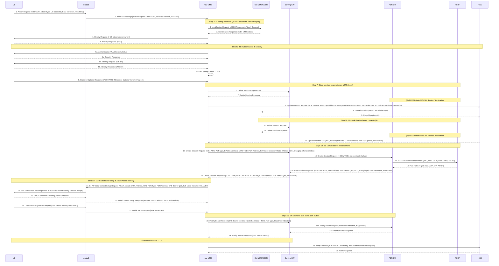

# EPS Attach Procedure (E-UTRAN Initial Attach)

**Spec:** 3GPP TS 23.401 §5.3.2.1  
**Purpose:** Establishes UE registration in the EPC, authenticates the subscriber, creates the default EPS bearer, and assigns a PDN address. Transitions UE from EMM-DEREGISTERED to EMM-REGISTERED and from ECM-IDLE to ECM-CONNECTED.

---

## Participants

| Node | Role |
|---|---|
| [UE](../entities/../concepts/EMM-ECM-states.md) | Initiates attach; carries IMSI/GUTI, capabilities, ESM container |
| [eNodeB](../interfaces/reference-points.md) | RRC anchor; forwards NAS to MME via S1-MME |
| [new MME](../entities/MME.md) | Procedure controller: authenticates, selects GWs, manages bearers |
| old MME / SGSN | Previous serving node; provides MM context and bearer cleanup |
| [SGW](../entities/SGW.md) | Creates EPS bearer table entry; mobility anchor |
| [PGW](../entities/PGW.md) | IP address allocator; PCEF; interfaces PCRF |
| [PCRF](../entities/PCRF.md) | Provides PCC rules and QoS (IP-CAN Session Establishment) |
| [HSS](../entities/HSS.md) | Subscription database; location update; cancel location at old node |
| EIR | Equipment identity register; ME Identity check |

---

## Message Flow

---

## Step-by-Step Detail

### Steps 1–2 — Attach Request

The UE camps on an E-UTRAN cell, reads System Information Broadcast, then sends an **Attach Request** containing:

| Field | Notes |
|---|---|
| IMSI or old GUTI | Old GUTI preferred if available; old GUTI type indicates native or mapped from P-TMSI/RAI |
| Old GUTI type | Native GUTI vs GUTI mapped from P-TMSI+RAI |
| Last visited TAI | Helps MME build TAI list |
| UE Core Network Capability | Supported NAS / AS security algorithms |
| UE Specific DRX / Extended idle DRX | Power-saving parameters |
| Attach Type | EPS attach, combined EPS/IMSI attach, Emergency Attach |
| ESM message container | Request Type (Initial/Handover), PDN Type (IPv4/IPv6/IPv4v6), APN (optional), PCO |
| Ciphered Options Transfer Flag | If set, APN/PCO sent separately after ciphering is established |
| Header Compression Configuration | For Control Plane CIoT EPS Optimisation |
| KSIASME + NAS sequence number + NAS-MAC | If UE has valid security context |
| Voice domain preference | CS/IMS preference |
| MS Network Capability | For GERAN/UTRAN interworking |
| P-TMSI signature | If GUTI is mapped from P-TMSI+RAI |

The eNodeB wraps the Attach Request in an **Initial UE Message** (S1-AP) adding: Selected Network, CSG access mode, CSG ID, L-GW address, TAI+ECGI.

> The eNodeB derives the target MME from the old GUMMEI in the RRC parameters. If no match, it selects an MME per §4.3.8.3.

### Steps 3–4 — Identity Resolution

- **Step 3:** If UE used GUTI and MME has changed, the new MME sends an **Identification Request** (old GUTI, complete Attach Request) to the old MME/SGSN.
  - Old MME: validates NAS-MAC, responds with IMSI + MM Context.
  - Old SGSN: validates P-TMSI signature, responds with MM Context.
- **Step 4:** If UE is unknown everywhere, the new MME sends an **Identity Request** directly to the UE for IMSI.

> Additional GUTI in the Attach Request allows the new MME to find pre-existing UE context when old GUTI was mapped from P-TMSI+RAI.

### Step 5a — Authentication and NAS Security Setup

Mandatory if:
- No UE context exists in the network, **or**
- The Attach Request was not integrity-protected, **or**
- Integrity check failed.

Otherwise optional. Defined in §5.3.10. After step 5a, all NAS messages are integrity-protected and ciphered (unless emergency-attached and unauthenticated).

For **Emergency Attach** with unauthenticated IMSI: MME may skip authentication and continue.

### Step 5b — ME Identity Check

The MME retrieves IMEISV from the UE (encrypted, unless emergency attach without authentication). The MME may send a **ME Identity Check Request** (IMEISV, IMSI) to the EIR; the EIR responds with a result determining whether to continue or reject.

### Step 6 — Ciphered Options

If the UE set the Ciphered Options Transfer Flag in step 1, the PCO (containing user credentials e.g. PAP/CHAP) and/or APN are now retrieved from the UE under NAS ciphering.

### Step 7 — Stale Bearer Cleanup (new MME)

If the new MME already holds bearer contexts for this UE (UE re-attaches to same MME without prior detach), those stale contexts are deleted via **Delete Session Request (LBI)** to the involved GWs. If PCRF is deployed, the PDN GW triggers IP-CAN Session Termination (box A in Figure 5.3.2.1-1).

> Detail: see §5.3.8.3 (step E) and §5.3.8.4 (step F).

### Step 8 — Update Location

The new MME sends **Update Location Request** to the HSS:

| Field | Purpose |
|---|---|
| MME Identity + IMSI | Identifies new serving MME |
| IMEISV | ME identity |
| MME Capabilities | SRVCC, etc. |
| ULR-Flags = "Initial-Attach-Indicator" | Tells HSS this is a fresh attach |
| Homogeneous Support of IMS Voice over PS Sessions | Set after MME evaluates §4.3.5.8 |
| Equivalent PLMN list | For inter-PLMN CSG roaming |

> MME may send Notify Request to HSS if only UE SRVCC capability has changed.

### Steps 9–10 — Cancel Location at Old Node

- **Step 9:** HSS sends **Cancel Location (IMSI, Cancellation Type)** to the old MME. The old MME removes the MM and bearer contexts, responds with Cancel Location Ack.
  - If ULR-Flags indicated "Initial-Attach-Indicator" and HSS has SGSN registration, HSS also sends Cancel Location to the old SGSN. The Cancellation Type tells the old node to release the Serving GW resource.
- **Step 10:** Old MME/SGSN deletes remaining bearer contexts → **Delete Session Request (LBI)** to GWs → **Delete Session Response**. If PCRF deployed, IP-CAN Session Termination (box B).

### Step 11 — Update Location Ack

HSS responds with **Update Location Ack (IMSI, Subscription Data)**:
- One or more PDN Subscription Contexts, each containing: EPS subscribed QoS profile, subscribed APN-AMBR, WLAN offloadability indication.
- Service Gap Time parameter (if present, MME stores in MM context and passes to UE in Attach Accept).
- CSG subscription data.
- Enhanced Coverage Restricted parameter.

The new MME validates the UE's presence in the (new) TA. If regional/access restrictions apply, it rejects the Attach Request. If the UE-provided APN is not permitted, the MME may substitute with a network-supported APN.

> If Update Location is rejected by HSS, the new MME rejects the Attach Request.

### Step 12 — Create Session Request (MME → SGW)

If ESM container was included in step 1 (skip if absent, or if Attach without PDN Connectivity indicated):

MME selects a [SGW](../entities/SGW.md) per §4.3.8.2, allocates an **EPS Bearer Identity** for the Default Bearer, then sends **Create Session Request** to the SGW:

| Key Parameter | Notes |
|---|---|
| IMSI, MSISDN | Subscriber identities |
| MME TEID (control plane) | S11 control plane tunnel ID |
| PDN GW address | From HSS subscription or MME PDN GW selection (§4.3.8.1) |
| APN | From UE or network default |
| RAT type | WB-E-UTRAN, NB-IoT, LTE-M |
| Default EPS Bearer QoS | From subscription |
| PDN Type | IPv4 / IPv6 / IPv4v6 / Non-IP |
| APN-AMBR | Subscribed per APN |
| EPS Bearer Identity | Allocated by MME |
| PCO | Transparently forwarded |
| Handover Indication | If Request Type = "Handover" |
| Selection Mode | Subscribed APN vs. UE-provided |
| Charging Characteristics | Bearer charging type |
| Maximum APN Restriction | Most restrictive value across active bearers |
| Dual Address Bearer Flag | If PDN type IPv4v6 and all SGSNs ≥ Rel-8 |
| Protocol Type over S5/S8 | GTP or PMIP |

> For PDN type "non-IP" with Control Plane CIoT EPS Optimisation: MME connects to SCEF instead; steps 12–16 and 23–26 are not executed.

### Step 13 — Create Session Request (SGW → PGW)

The [SGW](../entities/SGW.md) creates an EPS bearer table entry and forwards **Create Session Request** to the [PGW](../entities/PGW.md), adding:
- Serving GW address + TEID for user plane (S5/S8 uplink)
- Serving GW address + TEID for control plane
- Serving GW TEID of control plane

After this step, the SGW **buffers any downlink packets** it receives from the PDN GW until step 23 (Modify Bearer Request).

### Step 14 — IP-CAN Session Establishment (PGW ↔ PCRF)

If dynamic PCC is deployed and Handover Indication is absent, the [PGW](../entities/PGW.md) performs an **IP-CAN Session Establishment** procedure with the [PCRF](../entities/PCRF.md) (as defined in TS 23.203):

- PGW sends: IMSI, APN, UE IP address, User Location, UE Time Zone, Serving Network, RAT type, APN-AMBR, Default EPS Bearer QoS, ETFTU (extended TFT filter format indicator).
- PCRF responds: PCC rules (QCI, ARP, MBR/GBR if GBR bearer), APN-AMBR modification if needed.

> If Handover Indication **is** present, PGW performs IP-CAN Session Modification instead.

> NOTE: PCRF interaction is required even if predefined PCC rules are configured, at minimum to provide the UE IP address to the PCRF.

### Step 15 — Create Session Response (PGW → SGW)

[PGW](../entities/PGW.md) creates an EPS bearer context entry, generates a **Charging Id**, and returns **Create Session Response** containing:

- PDN GW address for user plane (S5/S8) + TEID (GTP) or GRE key (PMIP)
- PDN GW TEID for control plane
- PDN Type (may differ from requested if PDN GW modified it)
- **PDN Address**: IPv4 address and/or IPv6 prefix + Interface Identifier; or 0.0.0.0 if IPv4 address to be allocated via DHCPv4
- EPS Bearer Identity + EPS Bearer QoS
- PCO (transparently returned to UE)
- Charging Id, APN Restriction, Cause
- MS Info Change Reporting Action (Start) — if PGW requests UE location reporting
- CSG Information Reporting Action (Start)
- Presence Reporting Area Action
- PDN Charging Pause Enabled indication
- APN-AMBR (may be modified by PCRF)
- Delay Tolerant Connection indication

> PGW selects PDN Type based on received PDN Type, Dual Address Bearer Flag, and operator policy. If a different PDN type is chosen, PGW includes a reason cause.

> If PDN Address = 0.0.0.0 → UE negotiates IPv4 address via DHCPv4 after default bearer activation.

### Step 16 — Create Session Response (SGW → MME)

[SGW](../entities/SGW.md) returns **Create Session Response** to [MME](../entities/MME.md):

- PDN Type, PDN Address
- SGW address for user plane + SGW TEID (user plane, for S1-U uplink)
- SGW TEID (control plane, for S11)
- PDN GW address(es) and TEIDs (GTP-based S5/S8) or GRE keys (PMIP-based S5/S8)
- EPS Bearer Identity, EPS Bearer QoS
- PCO, APN Restriction, Cause
- MS Info Change Reporting Action, CSG Information Reporting Action, Presence Reporting Area Action
- APN-AMBR, Delay Tolerant Connection

### Step 17 — Attach Accept (MME → eNodeB)

The MME sends the **Attach Accept** embedded in one of:
- **S1-AP Initial Context Setup Request** (standard path)
- **S1-AP Downlink NAS Transport** (if Control Plane CIoT EPS Optimisation; or if ESM container not in step 1)

**Attach Accept** NAS message contents:

| Field | Notes |
|---|---|
| GUTI | New GUTI allocated if needed |
| TAI List | List of TAs where UE need not re-register |
| Session Management Request (ESM) | APN, PDN Type, PDN Address, EPS Bearer Identity, EPS Bearer QoS, PCO, Header Compression Config, Control Plane Only Indicator |
| NAS sequence number + NAS-MAC | Security |
| IMS Voice over PS session supported Indication | §4.3.5.8 |
| Emergency Service Support indicator | |
| LCS Support Indication | §4.3.5.11 / TS 23.271 |
| Supported Network Behaviour | CIoT EPS Optimisation capabilities |
| Service Gap Time | If present in subscription and UE indicated Service Gap Control Capability |
| Enhanced Coverage Restricted | |
| Indication for 15 EPS bearers per UE support | §4.12 |

**S1-AP Initial Context Setup Request** additionally carries:
- AS security context (for eNodeB RRC)
- Handover Restriction List
- EPS Bearer QoS and UE-AMBR (for RAN enforcement)
- SGW address + TEID for user plane (eNodeB sets up S1-U uplink tunnel)

> UE-AMBR = min(subscribed UE-AMBR, APN-AMBR of default APN) — see §4.7.3.

### Steps 18–20 — RRC Bearer Setup

- **Step 18:** eNodeB sends **RRC Connection Reconfiguration** (EPS Radio Bearer Identity + Attach Accept) to UE, or **RRC Direct Transfer** (if Downlink NAS Transport was used).
- **Step 19:** UE sends **RRC Connection Reconfiguration Complete** to eNodeB.
- **Step 20:** eNodeB sends **Initial Context Setup Response** to MME: eNodeB address + TEID for downlink traffic on S1_U reference point.

> MME must be prepared to receive steps 20 and 22 in either order.

### Steps 21–22 — Attach Complete

- **Step 21:** UE sends **Direct Transfer** → **Attach Complete** (EPS Bearer Identity, NAS sequence number, NAS-MAC) to eNodeB.
- **Step 22:** eNodeB forwards **Attach Complete** in **Uplink NAS Transport** to new MME.

After step 22, the UE can send uplink packets; the eNodeB tunnels them to the SGW → PDN GW.

### Steps 23–24 — Downlink User-Plane Path Switch

Upon receiving both the Initial Context Setup Response (step 20) and the Attach Complete (step 22), the MME sends **Modify Bearer Request** to the SGW:

| Field | Notes |
|---|---|
| EPS Bearer Identity | |
| eNodeB address + TEID | S1-U downlink endpoint |
| Handover Indication | If Request Type = "Handover" |
| Presence Reporting Area Information | If MME requested PRA change reporting |
| RAT type | LTE-M type included if applicable |

- **Step 23a** (handover case): SGW sends **Modify Bearer Request** (Handover Indication) to PDN GW → triggers switch from non-3GPP IP path to SGW path. PDN GW starts routing packets to SGW for default and all dedicated EPS bearers.
- **Step 23b:** PDN GW → **Modify Bearer Response** to SGW.
- **Step 24:** SGW → **Modify Bearer Response (EPS Bearer Identity)** to MME. SGW now releases buffered downlink packets toward eNodeB → **First Downlink Data** reaches UE.

> Box D (23a/23b) executes only on handover from non-3GPP access, or if Presence Reporting Area Information is received from MME.

### Steps 25–26 — PDN GW Registration with HSS

- **Step 25:** After Modify Bearer Response, if Request Type ≠ "Handover" and the selected PDN GW differs from the HSS-stored one, the MME sends **Notify Request (APN, PDN GW identity)** to the HSS. MME also sends Notify Request (Homogeneous Support of IMS Voice over PS Sessions) per §4.3.5.8/§4.3.5.8A.
- **Step 26:** HSS stores the APN + PDN GW identity pair (or "PDN GW currently in use for emergency services"). HSS sends **Notify Response** to MME.

---

## Key Decision Points

### MME Selection
- eNodeB derives target MME from old GUMMEI in RRC parameters.
- If not found/available → MME selection per §4.3.8.3 (load balancing pool).

### SGW Selection (§4.3.8.2)
- MME selects a SGW that can serve the UE's current location (TA).
- Colocation with PDN GW preferred for non-3GPP scenarios.

### PDN GW Selection (§4.3.8.1)
- Request Type = "Initial request": MME uses PDN GW from HSS subscription context, or selects per 3GPP access selection (§4.3.8.1) if not present.
- Request Type = "Handover": MME uses the PDN GW/HA indicated by the UE.

### APN Selection
- If UE provides no APN → MME uses default PDN GW for default APN.
- If UE provides APN not permitted by subscription → MME may substitute a network-supported APN.
- Maximum APN Restriction enforces coexistence rules across active bearers.

### PDN Type Negotiation
- PDN GW selects final PDN type based on: received PDN Type, Dual Address Bearer Flag, operator policy.
- If PDN GW selects different type → reason cause returned to UE.
- IPv4 address = 0.0.0.0 → DHCPv4 negotiation after bearer activation.

### IMS Voice over PS Session Support (§4.3.5.8)
- MME evaluates support and sets the "IMS Voice over PS session supported Indication" in Attach Accept.
- MME may also send Notify Request to HSS to update "Homogeneous Support of IMS Voice over PS Sessions".

---

## Conditional Paths

| Condition | Effect |
|---|---|
| No ESM container in Attach Request | Steps 6, 12–16, 23–26 skipped; Attach Accept via Downlink NAS Transport |
| Attach without PDN Connectivity (subscribed or UE-indicated) | PDN connection not established; steps 12–16, 23–26 skipped |
| Control Plane CIoT EPS Optimisation | Steps 17–22 replaced by S1-AP NAS Transport + RRC Direct Transfer |
| PDN type "non-IP" with SCEF | MME connects to SCEF; steps 12–16, 23–26 not executed |
| PMIP-based S5/S8 | Steps A, B, C defined in TS 23.402; steps 7, 10, 13, 14, 15, 23a/23b concern GTP-based only |
| Handover from non-3GPP | Box D (23a/23b) executed; Handover Indication in step 12 |
| Emergency Attach (IMSI unauthenticated) | Step 8 (Update Location) skipped; PCRF uses emergency ARP; no Notify to HSS |

---

## Post-Attach State

| Item | Result |
|---|---|
| EMM state | EMM-REGISTERED |
| ECM state | ECM-CONNECTED |
| UE identity stored at MME | GUTI (new), IMSI, IMEISV |
| Default EPS bearer | Established UE ↔ PGW; QCI/ARP from PCRF (dynamic PCC) or subscription |
| UE IP address | IPv4, IPv6 prefix, or both; or 0.0.0.0 if DHCPv4 pending |
| UE-AMBR | min(subscribed UE-AMBR, APN-AMBR of default APN) |
| S1-U tunnel | eNodeB ↔ SGW established (step 20 + step 23) |
| S5/S8 tunnel | SGW ↔ PGW established (steps 13–15) |
| PGW registration | APN + PDN GW identity stored at HSS (step 26) |

---

## Cross-References

- [MME](../entities/MME.md) — controls the entire attach; owns NAS, selects GWs
- [SGW](../entities/SGW.md) — creates bearer entry, buffers downlink, switches user-plane path at step 23
- [PGW](../entities/PGW.md) — allocates IP, interacts with PCRF, enforces PCC rules
- [PCRF](../entities/PCRF.md) — IP-CAN Session Establishment (step 14); sets QCI/ARP/APN-AMBR
- [HSS](../entities/HSS.md) — Update Location (step 8), Cancel Location (step 9), subscription data (step 11)
- [EPS bearer model](../concepts/EPS-bearer.md) — default/dedicated bearer, QCI, GBR/Non-GBR, TFT
- [EMM/ECM states](../concepts/EMM-ECM-states.md) — state transitions driven by this procedure
- [EPC reference points](../interfaces/reference-points.md) — S1-MME, S11, S5/S8, S6a, Gx, SGi interfaces used here
- [Dedicated bearer establishment](dedicated-bearer.md) — may follow immediately after attach (§5.4.1)
- [PDN Connectivity procedure](PDN-connectivity.md) — standalone PDN connection (§5.10)
