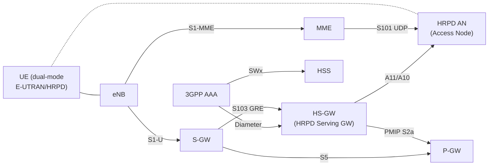

# HRPD Optimized Handover (E-UTRAN ↔ CDMA2000)

**Spec reference:** 3GPP TS 23.402 v15.3.0 §9

Related pages:
[Non-3GPP Access Architecture](../concepts/non-3GPP-access-architecture.md) ·
[ePDG](../entities/ePDG.md) ·
[MME](../entities/MME.md) ·
[SGW](../entities/SGW.md) ·
[PGW](../entities/PGW.md)

---

## Overview

Section 9 defines **optimized** handover procedures between E-UTRAN (LTE) and
CDMA2000 HRPD (High Rate Packet Data, also called EV-DO Rev. A). "Optimized" means
that signalling is minimized and data forwarding is pre-configured before the UE
physically moves, unlike the generic non-3GPP handover in §8 which has no such
preparation.

Two dedicated reference points support this:

| Reference Point | Between | Protocol | Purpose |
|---|---|---|---|
| **S101** | MME ↔ HRPD AN | S101-AP over UDP/IP | Transparent tunnel for 3GPP2 pre-registration and HO signalling |
| **S103** | S-GW ↔ HS-GW (HRPD Serving Gateway) | GRE (RFC 2784/2890) | Downlink data forwarding during active handover |

The **HS-GW** (HRPD Serving Gateway) is the CDMA2000 equivalent of the EPC PGW for
HRPD data services. It uses PMIP (Proxy Mobile IP) Binding Updates toward the PGW
to maintain session continuity.

---

## Architecture (§9.1)



Key relationships:
- **S101** carries 3GPP2 signalling messages transparently; MME is an S101 termination point but does not interpret 3GPP2 protocol content
- **S103** pre-establishes GRE forwarding tunnels before HO completes so DL packets continue flowing
- HS-GW uses **all-zero CoA** (0.0.0.0) in Proxy Binding Update to PGW to signal "session continuation" without changing PGW binding _(no PGW context change required)_
- The **S101 Session ID** identifies each UE's S101 tunnel; allocated at pre-registration and preserved across TAU/MME change

---

## HRPD Pre-Registration (§9.3.1)

Pre-registration allows the UE to register to HRPD while **still attached to E-UTRAN**,
so that if a handover happens later the HRPD network is already prepared.

**Trigger:** UE receives HRPD pilot signals from a neighboring HRPD AN (idle or measurement-based).

**Flow (9 steps):**

```mermaid
sequenceDiagram
    participant UE
    participant eNB
    participant HRPD_AN as HRPD AN
    participant MME
    participant HSGW as HS-GW
    participant AAA as 3GPP AAA / HSS

    UE->>eNB: UE reports HRPD pilot strength (measurement)
    eNB->>MME: S1 signalling (UE triggers pre-registration via NAS)
    MME->>HRPD_AN: S101 — Route HRPD Air Link Msg (pre-registration request)
    Note over MME,HRPD_AN: S101 tunnel transparently carries 3GPP2 access signalling
    HRPD_AN->>HSGW: A11 Registration Request (UE identity, PDN context info)
    HSGW->>AAA: Diameter EAP-Request (UE authentication)
    AAA->>HSGW: Diameter EAP-Response / Auth OK (subscription data)
    HSGW->>HRPD_AN: A11 Registration Reply (Session ID assigned)
    HRPD_AN->>MME: S101 — Route HRPD Air Link Msg (pre-registration response)
    MME->>UE: NAS (pre-registration complete; S101 Session ID stored at MME)
    Note over HSGW: Gateway Control Session established (BBERF-like role)
```

**Key outcomes after pre-registration:**
- HRPD AN has a registered UE context (A10/A11 session)
- HS-GW has authenticated the UE and obtained PDN subscription from AAA/HSS
- MME stores the **S101 Session ID** in UE context (used later for tunnel redirection)
- UE can immediately perform active HO without repeating authentication

---

## HRPD Active Handover (§9.3.2)

An active handover moves a live data session from E-UTRAN to HRPD. The 19-step
procedure includes S103 data forwarding so no packets are lost.

**Pre-condition:** UE has performed HRPD pre-registration (§9.3.1).

**Flow (19 steps):**

```mermaid
sequenceDiagram
    participant UE
    participant eNB
    participant HRPD_AN as HRPD AN
    participant MME
    participant SGW as S-GW
    participant HSGW as HS-GW
    participant PGW as P-GW

    Note over UE,eNB: 1. UE measurement: HRPD signal strong enough for HO
    UE->>MME: 2. NAS: Handover Required (HRPD target, measurements)
    MME->>HSGW: 3. S101 — Handover Request (PDN GW address per APN, UE context)
    Note over HSGW: 4. HS-GW allocates GRE keys for each PDN (per bearer)
    HSGW->>SGW: 5. S103 — GRE key allocation / Forwarding Address notification
    Note over SGW: 6. S-GW programs S103 DL forwarding: copy DL packets to HS-GW
    SGW-->>HSGW: 7. S103 forwarding tunnel activated (DL data begins forwarding)
    HSGW->>MME: 8. Handover Request Ack (S103 GRE keys confirmed)
    MME->>eNB: 9. Handover Command
    eNB->>UE: 10. RRC Connection Release (with redirect to HRPD)
    Note over UE,HRPD_AN: 11. UE performs HRPD physical layer acquisition
    UE->>HRPD_AN: 12. A10 Connection Request (uses pre-registered context)
    HRPD_AN->>HSGW: 13. A11 Registration Request (HO indication)
    HSGW->>PGW: 14. PMIP Proxy Binding Update (all-zero CoA = HO session continuation)
    Note over PGW: 15. P-GW redirects UL/DL to HS-GW (no IP change for UE)
    PGW-->>HSGW: 15b. Proxy Binding Ack
    HSGW->>HRPD_AN: 16. A11 Registration Reply (Session ID)
    HRPD_AN->>UE: 17. A10 Connection Grant / HRPD data path active
    HSGW->>MME: 18. Handover Complete Notification (via S101)
    MME->>SGW: 19. Modify Bearer Request (stop S103 forwarding)
    Note over SGW: Stop forwarding; release S1 bearers; UE context at eNB released
```

**Key mechanisms:**
- **S103 GRE forwarding** (steps 5–7): S-GW copies DL packets to HS-GW during HO transition; prevents packet loss
- **All-zero CoA** (step 14): HS-GW sends PBU with CoA=0.0.0.0 to PGW, signaling session continuity; PGW updates its downlink routing to HS-GW without changing UE IP address or PDN context
- **A11 signalling** (step 13): 3GPP2 mobility protocol between HRPD AN and HS-GW; carries PDN context for PMIP session setup
- **Stop forwarding** (step 19): After HO Complete, MME tells S-GW to stop S103 forwarding; E-UTRAN resources released

---

## HRPD Idle-Mode Mobility (§9.4)

When a UE is in **ECM-IDLE** in E-UTRAN, it may reselect to HRPD coverage without
network-initiated preparation. The HS-GW must fetch the PGW identity from the AAA
server to re-establish session continuity.

**Flow (8 steps):**

```mermaid
sequenceDiagram
    participant UE
    participant HRPD_AN as HRPD AN
    participant HSGW as HS-GW
    participant AAA as 3GPP AAA
    participant PGW as P-GW
    participant PCRF
    participant MME

    Note over UE: ECM-IDLE in E-UTRAN; reselects to HRPD cell
    UE->>HRPD_AN: 1. A10 Registration Request (UE identity = NAI)
    HRPD_AN->>HSGW: 2. A11 Registration Request (UE NAI)
    HSGW->>AAA: 3. Authentication + Retrieve PGW Identity (Diameter)
    Note over AAA: AAA fetches PGW identity from HSS (SWx)
    AAA-->>HSGW: 4. Auth OK + PDN GW Address per APN
    HSGW->>PGW: 5. PMIP Proxy Binding Update (HO Indicator, APN, HS-GW address)
    Note over PGW: 6. PCEF IP-CAN Session Modification (access type: HRPD)
    PGW->>PCRF: 6a. IP-CAN Modification (RAT = CDMA2000 HRPD)
    PCRF-->>PGW: 6b. PCC Rules provision
    PGW-->>HSGW: 7. Proxy Binding Ack (UE IP address preserved)
    HSGW->>HRPD_AN: 8. A11 Registration Reply
    Note over MME: E-UTRAN resources deactivated (Deactivate Bearer per TS 23.401 §5.3.4.3)
```

**Key points:**
- No pre-registration involved — UE was idle and the MME had no HRPD context
- HS-GW fetches PGW identity from AAA (which gets it from HSS via SWx)
- PGW sends **IP-CAN Modification** to PCRF when access type changes (E-UTRAN → HRPD)
- E-UTRAN radio and S1 resources are released **after** HRPD path is established

---

## S101 Tunnel Redirection (§9.7)

When a UE performs a **Tracking Area Update with MME change**, the S101 tunnel — which
identifies the pre-registration state in the HRPD AN — must be transferred to the new MME.

**Mechanism:**

```mermaid
sequenceDiagram
    participant UE
    participant OldMME as Old MME
    participant NewMME as New MME
    participant HRPD_AN as HRPD AN

    UE->>NewMME: TAU Request (GUTI from old MME)
    NewMME->>OldMME: Context Request (retrieves UE context including S101 Session ID)
    OldMME-->>NewMME: Context Response (S101 Session ID + HRPD AN address)
    NewMME->>HRPD_AN: S101 — Notification Request (Redirection: new MME address, S101 Session ID)
    HRPD_AN-->>NewMME: S101 — Notification Response (Ack)
    Note over HRPD_AN: HRPD AN updates S101 peer to new MME; pre-registration state preserved
    NewMME->>UE: TAU Accept
```

**Key outcome:** The HRPD AN now associates the UE's pre-registration state with the
**new MME**. Any subsequent S101 signalling from HRPD AN is routed to the new MME.
The S101 Session ID (originally allocated at pre-registration) is preserved unchanged
— the HRPD AN does not need to re-authenticate or re-register the UE.

---

## Emergency Handover Support (§9.5–§9.6)

- **E-UTRAN → HRPD emergency HO (§9.5)**: UE with active emergency call may hand over to HRPD; HS-GW routes emergency PDN to equivalent HRPD emergency services; requires pre-registration to include emergency PDN context
- **HRPD → E-UTRAN emergency HO (§9.6)**: UE with active HRPD emergency session connects to E-UTRAN; follows §8 unoptimized handover pattern for emergency PDN; MME marks session as emergency (no subscription check)

---

## WiMAX Handover Optimization (§10)

Section 10 defines **Mobile WiMAX ↔ 3GPP** handover optimization, driven by
**ANDSF** policies. Key points:

- WiMAX interworking follows the same trusted non-3GPP model as WLAN (S2a reference point)
- Optimized handover relies on the UE being **dual-radio** (simultaneous WiMAX + LTE radio)
- ANDSF provides inter-system mobility policy (ISMP) and routing policy (ISRP) to steer the UE
- S2a/S2c procedures (§6/§8) apply — no WiMAX-specific procedure flows defined beyond §10.1 principles
- No A11/S101 equivalent: WiMAX uses standard PMIPv6 S2a Proxy Binding Update for session continuity

---

## Cross-References

| Related Procedure | Link |
|---|---|
| Non-optimized non-3GPP → E-UTRAN HO (§8) | [non3GPP-handover.md](non3GPP-handover.md) |
| Trusted non-3GPP (TWAN S2a) attach (§6) | [trusted-non3GPP-attach.md](trusted-non3GPP-attach.md) |
| Untrusted non-3GPP (ePDG S2b) attach (§7) | [S2b-attach.md](S2b-attach.md) |
| Non-3GPP access architecture concepts | [non-3GPP-access-architecture.md](../concepts/non-3GPP-access-architecture.md) |
| MME entity (includes HRPD pre-registration function) | [MME.md](../entities/MME.md) |
| SGW entity (S103 forwarding role) | [SGW.md](../entities/SGW.md) |
