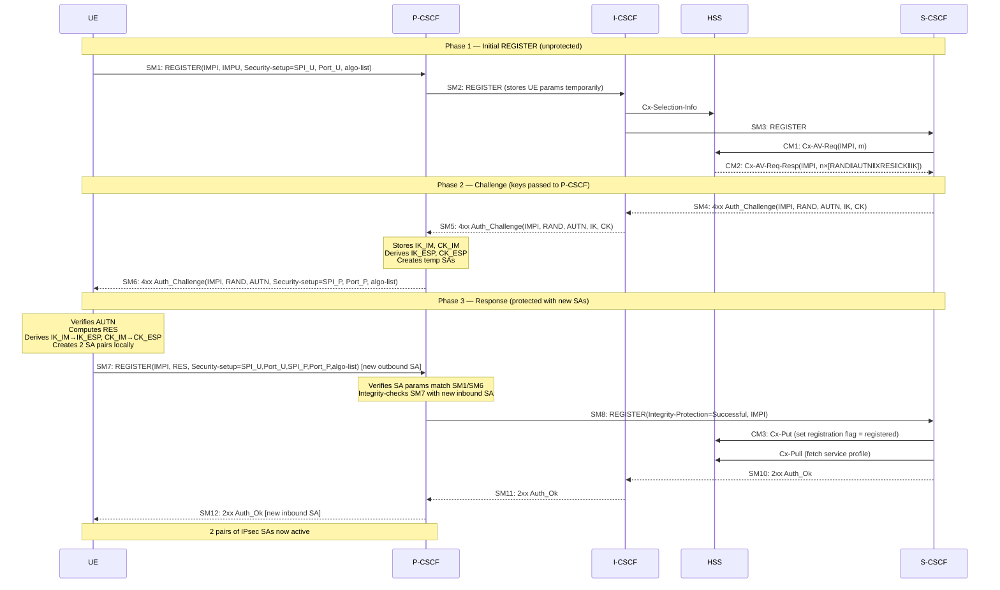
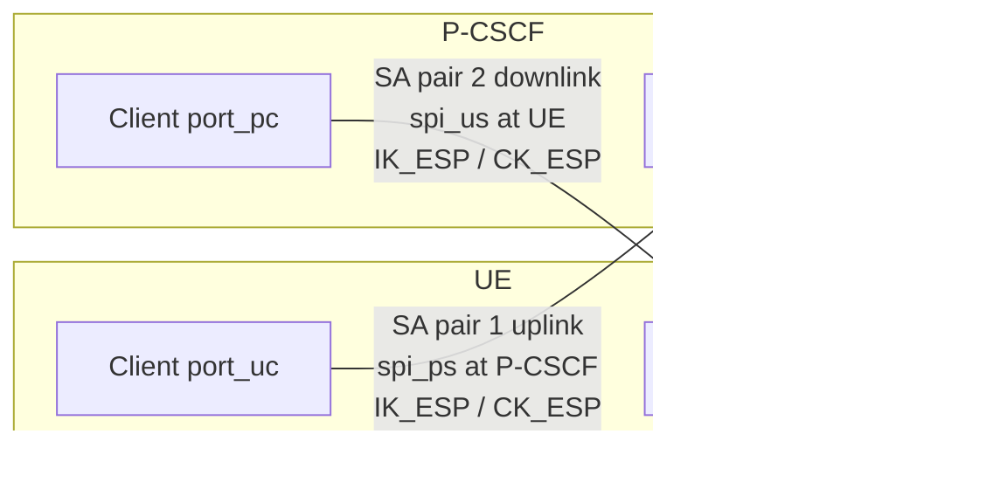

# IMS AKA Security Mode Setup

The procedure by which a UE authenticates to the IMS Home Network and establishes IPsec Security Associations (SAs) with its [P-CSCF](../entities/P-CSCF.md) during [IMS registration](IMS-registration.md). Defined in 3GPP TS 33.203 §6.1 + §7. The authentication mechanism is IMS AKA (reuse of UMTS/EPS AKA concept over SIP per RFC 3310).

---

## Overview



---

## Step-by-Step Description

### Phase 1: Initial REGISTER (Unprotected)

**SM1 — UE → P-CSCF:**
```
REGISTER(IMPI, IMPU)
Security-setup: SPI_U = (spi_uc, spi_us), Port_U = (port_uc, port_us)
               integrity_algorithms_list, encryption_algorithms_list
```
- UE proposes two SPIs and two ports for its inbound SAs
- `spi_uc`: SPI for inbound SA at UE's client port (receives downlink traffic)
- `spi_us`: SPI for inbound SA at UE's server port (receives downlink traffic)
- `port_uc`: UE's protected client port (sends requests to P-CSCF server)
- `port_us`: UE's protected server port (receives requests from P-CSCF client)
- Algorithm lists ordered by UE preference (highest priority first)

**SM2 — P-CSCF:** Forwards to I-CSCF. Temporarily stores: UE IP address, IMPI, IMPU, SPI_U, Port_U.

**I-CSCF → HSS:** Cx-Selection-Info to assign/confirm S-CSCF.

**SM3 — I-CSCF → S-CSCF:** Forwards REGISTER.

**CM1 — S-CSCF → HSS:** `Cx-AV-Req(IMPI, m)` — requests m authentication vectors (m ≥ 1). S-CSCF also sets registration flag in HSS to "initial registration pending" (via Cx-Put) to allow MT call routing during in-progress registration.

**CM2 — HSS → S-CSCF:**
```
Cx-AV-Req-Resp(IMPI, n,
  RAND₁‖AUTN₁‖XRES₁‖CK₁‖IK₁,
  …,
  RANDₙ‖AUTNₙ‖XRESₙ‖CKₙ‖IKₙ)
```
AVs ordered by SQN. Each AV: RAND (random challenge), AUTN (auth token with MAC + SQN), XRES (expected response), CK (cipher key), IK (integrity key). S-CSCF stores AVs; uses FIFO order.

### Phase 2: Authentication Challenge

**SM4 — S-CSCF → I-CSCF:**
```
4xx Auth_Challenge(IMPI, RAND, AUTN, IK, CK)
```
S-CSCF selects next AV; includes all 5 components (RAND, AUTN, XRES for its own record, IK and CK for P-CSCF).

**SM5 — I-CSCF → P-CSCF:** Forwards challenge (still contains IK, CK).

**P-CSCF stores IK_IM and CK_IM** from SM5. Derives:
- `IK_ESP = key_expansion(IK_IM, integrity_algorithm)` — per Annex I
- `CK_ESP = key_expansion(CK_IM, encryption_algorithm)` — per Annex I

P-CSCF creates temporary SAs associated with this registration procedure.

P-CSCF selects the algorithm combination: first integrity+encryption pair from its own priority list that is also present in UE's list from SM1. If UE did not offer any encryption algorithm, P-CSCF either applies NULL or aborts (per policy). P-CSCF **removes IK, CK** from the message before forwarding to UE.

**SM6 — P-CSCF → UE:**
```
4xx Auth_Challenge(IMPI, RAND, AUTN)
Security-setup: SPI_P = (spi_pc, spi_ps), Port_P = (port_pc, port_ps)
               integrity_algorithms_list, encryption_algorithms_list [P-CSCF's selection]
```
- `spi_pc`: SPI for inbound SA at P-CSCF's client port
- `spi_ps`: SPI for inbound SA at P-CSCF's server port
- `port_pc`: P-CSCF's protected client port (sends requests to UE server)
- `port_ps`: P-CSCF's protected server port (receives requests from UE client)
- Algorithm list: P-CSCF proposes only what it supports (may include encryption algorithms even if UE didn't offer them — to prevent bidding-down attacks)

### Phase 3: Authentication Response (Protected)

**UE processing of SM6:**
1. Verify AUTN: check MAC = expected MAC using shared key K; check SQN within valid range (per TS 33.102)
2. Compute RES (Authentication Response) using RAND + K
3. Determine algorithm: select first integrity+encryption combination from SM6 list that UE supports
4. Derive `IK_IM` and `CK_IM` from RAND + K (same computation as TS 33.102); then derive `IK_ESP`, `CK_ESP`
5. Establish 2 pairs of unidirectional SAs in local SAD (Security Association Database)

**SM7 — UE → P-CSCF (protected with new outbound SA):**
```
REGISTER(IMPI, Authorization: RES)
Security-setup: SPI_U, Port_U, SPI_P, Port_P
               integrity_algorithm, encryption_algorithm [selected by UE]
```
- Protected with new outbound SA (UE client port_uc → P-CSCF server port_ps)
- Includes echo of SPI_P and Port_P received in SM6, plus SPI_U and Port_U from SM1

**P-CSCF processing of SM7:**
1. Verify that algorithm list, SPI_P, Port_P in SM7 match those sent in SM6 → if mismatch, abort (§7.3.2.3)
2. Verify SPI_U, Port_U in SM7 match those received in SM1
3. Integrity-check SM7 using new inbound SA → if fails, SM7 discarded (time-out → delete temp SA params)
4. Mark REGISTER as "Integrity-Protection = Successful" in SM8

**SM8 — P-CSCF → S-CSCF:**
```
REGISTER(Integrity-Protection = Successful, IMPI)
```

**S-CSCF:**
- Verifies RES == XRES
- Sends Cx-Put to HSS (set registration flag = registered)
- Sends Cx-Pull to HSS (fetch subscriber profile / service data)
- Sends SM10: 2xx Auth_Ok

**SM11/SM12 — I-CSCF/P-CSCF → UE:**
- SM12 (P-CSCF → UE): 2xx Auth_Ok, protected with new outbound SA
- SM12 does **not** contain a Security-setup line; its successful receipt by UE signals that security mode setup is complete

**After SM12:** UE sets new SA lifetime = max(latest lifetime of old SAs, registration timer in SM12). New SAs used for all subsequent outbound SIP messages.

---

## Resulting SA Structure

After successful authentication, **4 unidirectional IPsec SAs** exist between UE and P-CSCF:



- **SA pair 1** (uplink): UE sends requests/responses from port_uc; P-CSCF receives on port_ps using spi_ps
- **SA pair 2** (downlink): P-CSCF sends from port_pc; UE receives on port_us using spi_us
- All 4 SAs share the same IK_ESP (integrity) and CK_ESP (confidentiality) — derived from a single AKA run
- SAs apply to both TCP and UDP transport; port_us/port_ps are "protected server ports"; port_uc/port_pc are "protected client ports"

---

## Error Cases (§7.3)

### IMS AKA Failures

| Error | Trigger | Outcome |
|---|---|---|
| User auth failure | Wrong IK_IM → SM7 fails ESP integrity at P-CSCF | SM7 discarded; P-CSCF times out → deletes temp SA params |
| User auth failure (IK_IM ok, RES wrong) | SM7 passes integrity but S-CSCF sees RES ≠ XRES | S-CSCF sends 4xx Auth_Failure (may pass through existing SA) |
| Network auth failure | MAC check fails at UE | UE sends REGISTER(Failure=AuthenticationFailure); P-CSCF deletes new SAs; S-CSCF clears S-CSCF name in HSS if IMPU unregistered |
| Sync failure | SQN out of range at UE | UE sends REGISTER(Failure=SyncFailure, AUTS, RAND); S-CSCF sends Cx-AV-Req(IMPI, RAND, AUTS) to HSS; HSS re-syncs SQN, sends fresh AV batch; flow continues from SM10 |
| Incomplete auth | New REGISTER before challenge answered | P-CSCF/S-CSCF discards previous auth state; treats new REGISTER as fresh initial registration |

### Security Setup Failures

| Error | Trigger | Outcome |
|---|---|---|
| Proposal unacceptable to P-CSCF | No overlap in algorithm lists (SM1) | P-CSCF rejects SM1 immediately with error response |
| Proposal unacceptable to UE | P-CSCF's algorithm list in SM6 unacceptable to UE | UE abandons registration; does not send SM7 |
| Consistency check failure at P-CSCF | SM7 algorithm list / SPI_P / Port_P differ from SM6 | P-CSCF aborts registration (§7.3.2.3) |

---

## Authenticated Re-registration (§7.4)

Every authentication produces new SAs. SA transition during re-registration:

**At UE (§7.4.1a):**
- UE may have old SAs active when starting re-registration
- SM1 may be protected with old outbound SA (if available)
- SM6 (challenge) protected with old inbound SA (if SM1 was protected)
- New SAs created when SM6 received; SM7 protected with **new** outbound SA
- Old SAs used for all non-authentication messages during the flow; SIP transactions pending on old SA may still complete
- SM12 (2xx Auth_Ok) received → UE sets new SA lifetime; old SAs deleted when: (a) lifetime expires or (b) all pending SIP transactions complete
- UE monitors registration expiry and extends SA lifetime to avoid gap

**At P-CSCF (§7.4.2a):**
- P-CSCF associates IMPI and all registered IMPUs with new SAs
- Old SAs: kept during authentication flow; deleted once new SAs active and no pending transactions remain
- Rule: If SM1 was unprotected → treat as auth failure in cleanup path → remove old SAs after SM12
- Max 6 SAs per direction per IMPI at any time; error if exceeded → registration aborted

---

## IP Address Change (§7.5)

When UE changes IP address (e.g. handover, IPv6 SLAAC privacy extension per RFC 3041):
- UE deletes all existing SAs
- Initiates new unprotected REGISTER using new IP address as source IP
- Full IMS AKA + SA setup re-runs from SM1

---

## Key Notes

1. **P-CSCF strips CK/IK:** The UE never receives CK or IK in the clear over Gm — the P-CSCF removes them from SM6 before delivery. The UE recomputes them locally from RAND and its ISIM key.

2. **SPI uniqueness enforced at both sides:** UE selects SPI_U to be unique from all existing SAs it holds. P-CSCF selects SPI_P to be unique from all existing SAs and different from SPI_U. Rule ensures no SA collision for inbound traffic.

3. **Re-registration does not reset existing sessions:** Old SAs protect in-flight SIP transactions (e.g. ongoing INVITE dialogs). SA replacement is transparent to the SIP session layer.

4. **P-CSCF protected server port_ps is per-UE (not per-IMPU):** port_ps stays fixed for a given UE across all IMPUs from the same IMPI until all IMPUs are de-registered. port_pc may differ per P-CSCF.

5. **Bidding-down protection:** P-CSCF may include encryption algorithms in SM6 even if UE didn't offer them in SM1 — this forces UE to explicitly choose. If P-CSCF policy requires confidentiality, UEs without encryption support are denied IMS access.

---

## Cross-References

- [concepts/IMS-access-security.md](../concepts/IMS-access-security.md) — full security architecture and mechanisms
- [procedures/IMS-registration.md](IMS-registration.md) — TS 23.228 view of registration (11-step, functional layer)
- [entities/P-CSCF.md](../entities/P-CSCF.md) — P-CSCF IPsec SA management role
- [entities/S-CSCF.md](../entities/S-CSCF.md) — S-CSCF AV consumption, challenge issuance
- [entities/HSS.md](../entities/HSS.md) — AV generation: Cx-AV-Req/Resp, registration flag
- [concepts/IMS-identity-model.md](../concepts/IMS-identity-model.md) — IMPI, IMPU identities
