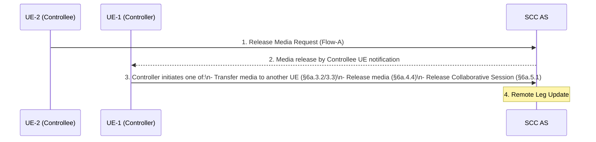
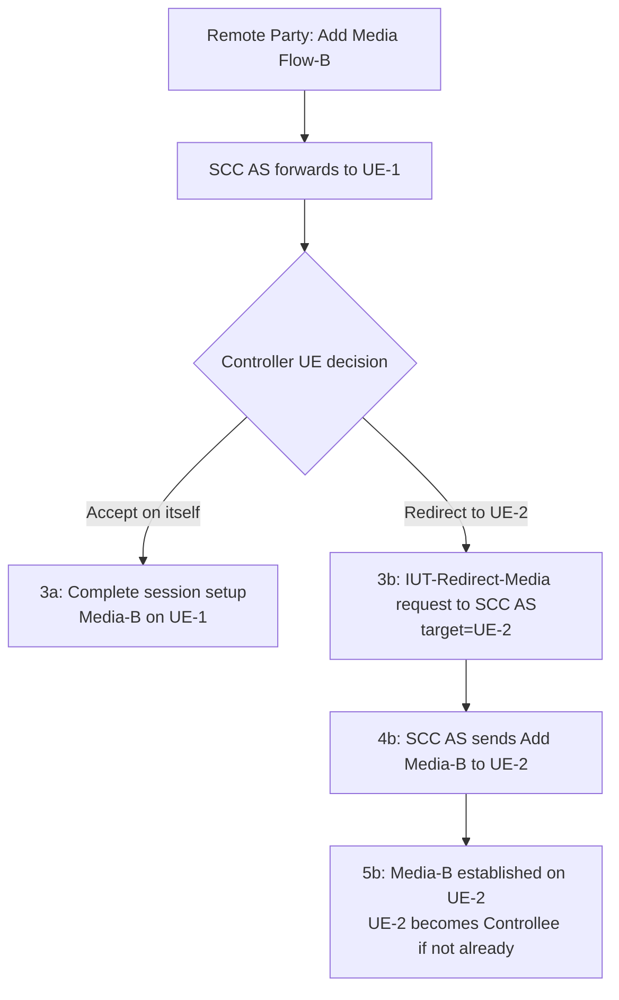
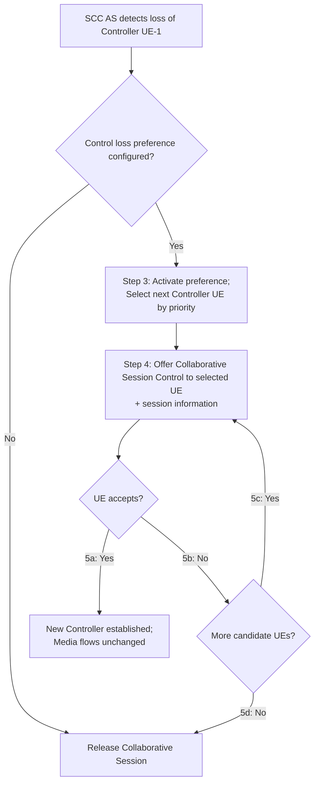
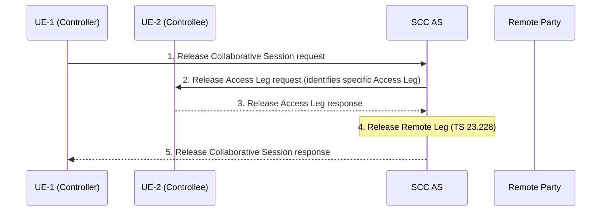
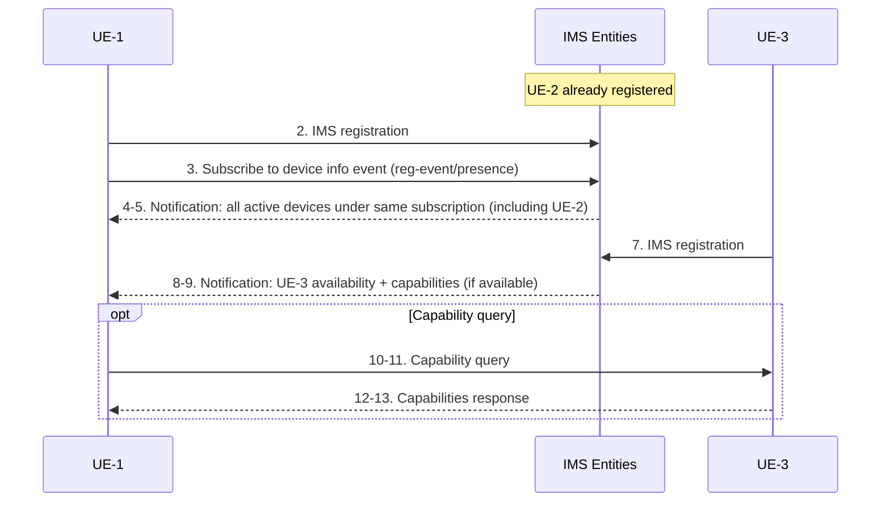
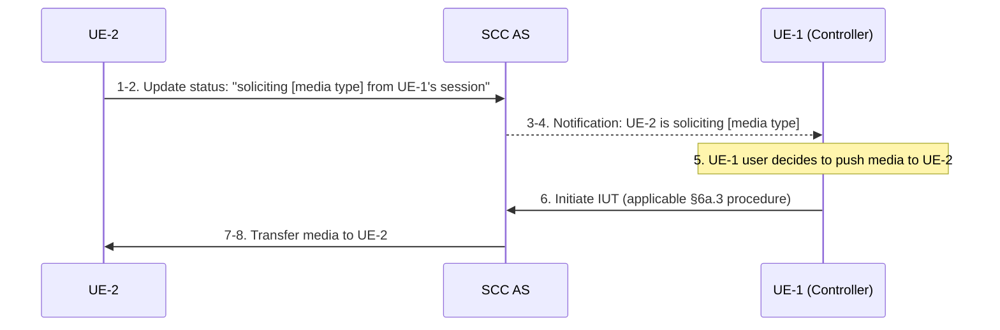
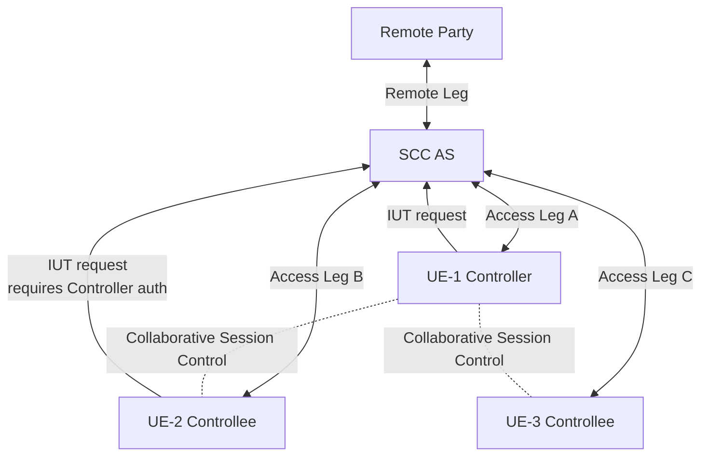

# IMS Inter-UE Transfer (IUT) — Collaborative Session Procedures

Inter-UE Transfer (IUT) allows media flows and/or session control to be distributed across multiple UEs within the same (or different) IMS subscription, under the coordination of the [SCC AS](../entities/SCC-AS.md). The UE that controls the session is the **Controller UE**; UEs hosting media flows on behalf of the Controller are **Controllee UEs**.

Reference: **3GPP TS 23.237 §6a**

---

## Key IUT Concepts

| Concept | Description |
|---|---|
| **Controller UE** | Holds Collaborative Session Control; initiates and authorizes all IUT operations |
| **Controllee UE** | Hosts one or more media flows; unaware of its role; subject to Controller's decisions |
| **Collaborative Session** | ≥2 Access Legs (≥1 Controller + ≥1 Controllee) + one Remote Leg at SCC AS |
| **IUT without Collaborative Session** | Entire session transferred from source UE to target UE; no Controller/Controllee distinction |
| **SCC AS** | Authorizes all IUT requests (§6a.12); anchors Remote Leg; executes media moves |
| **Controller UE service profile** | Governs AS chain and supplementary services for the entire Collaborative Session |

> Controllee UEs may have a different service profile from the Controller UE. The Controller's service profile is authoritative for the Remote Leg.

---

## §6a.2 Collaborative Session Establishment

### §6a.2.1 Establish by Transferring Media (UE-1 → UE-2)

Pre-condition: Ongoing session between UE-1 and Remote Party, anchored at SCC AS.

```mermaid
sequenceDiagram
    participant UE1 as UE-1 (becomes Controller)
    participant UE2 as UE-2 (becomes Controllee)
    participant SCC as SCC AS
    participant RP as Remote Party

    Note over UE1,RP: Media Flow-A between UE-1 and Remote Party
    UE1->>SCC: 1. IUT media transfer request\n[flow=Media-A, target=UE-2, keep control in UE-1]
    Note over SCC: 2. Authorization (§6a.12);\nEstablish Access Leg at UE-2;\nRemove Media-A from UE-1;\nRemote Leg Update (§6a.1.2)
    SCC-->>UE1: 3. IUT media transfer response
    Note over UE1,UE2: Collaborative Session control (dashed)
    Note over UE2,RP: Media Flow-A between Controllee UE-2 and Remote Party
```

- UE-1 becomes Controller UE; UE-2 becomes Controllee UE
- Other media flows on UE-1 (if any) are unaffected
- UE-1 can repeat steps 1–3 to transfer additional media flows

---

### §6a.2.2 Establish with New Media (UE-1 adds media on UE-2)

UE-1 adds a new Media Flow-B on UE-2 while keeping Media Flow-A on itself.

1. UE-1 sends IUT add media request [flow=Media-B, target=UE-2, keep control in UE-1]
2. SCC AS authorizes, sets up Media-B on UE-2, updates Remote Leg
3. IUT add media response to UE-1

Result: Controller UE-1 has Media-A; Controllee UE-2 has Media-B.

---

### §6a.2.3 Establish at Originating IMS Session Setup

UE-1 originates a Collaborative Session from the start, with Media-A on UE-1 and Media-B on UE-2.

```mermaid
sequenceDiagram
    participant UE1 as UE-1 (Controller)
    participant UE2 as UE-2 (Controllee)
    participant SCC as SCC AS
    participant RP as Remote Party

    UE1->>SCC: 1. Collaborative session setup request\n[Media-A in UE-1, Media-B in UE-2, target=Remote Party]
    Note over SCC: 2. Authorization; Establish Access Leg at UE-2 FIRST\n(to obtain full SDP for Media-B before engaging remote party)
    SCC->>RP: 3. Session setup request (Media-A + Media-B SDP offer)
    RP-->>SCC: 4. Response (SDP answer for Media-A and Media-B)
    SCC-->>UE1: 5. Response (SDP answer of Media-A)
    SCC-->>UE2: 6. Response (SDP answer of Media-B)
```

> **Key rule (§6a.2.3 NOTE)**: SCC AS establishes Access Leg at UE-2 **before** engaging the remote party. This is required to obtain the full SDP offer for Media-B — without UE-2's SDP, the SCC AS cannot send a complete offer to the remote party.

---

### §6a.2.4 Establish at Terminating IMS Session Setup

Remote Party sends a session request; UE-1 decides to route Media-B to UE-2.

1. Remote Party → SCC AS → UE-1: session setup request (Media-A + Media-B)
2. UE-1 → SCC AS: Collaborative Session request [Media-B to UE-2, keep control in UE-1]
3. SCC AS authorizes; establishes Access Leg at UE-2
4. SCC AS responds to Remote Party with combined SDP (Media-A in UE-1, Media-B in UE-2)

---

## §6a.3 Media Transfer within Collaborative Session

### §6a.3.1 Controller UE Initiated — Controller → Controllee

**§6a.3.1.1 Same subscription (3 steps):**

```mermaid
sequenceDiagram
    participant UE1 as UE-1 (Controller)
    participant UE2 as UE-2 (Controllee)
    participant SCC as SCC AS
    participant RP as Remote Party

    Note over UE1,RP: Media Flow-A between UE-1 and Remote Party
    UE1->>SCC: 1. IUT media transfer request\n[flow=Media-A, source=UE-1, target=UE-2, keep control in UE-1]
    Note over SCC: 2. Authorization;\nSetup Access Leg at UE-2;\nRemove Media-A from UE-1;\nRemote Leg Update
    SCC-->>UE1: 3. IUT media transfer response
    Note over UE2,RP: Media Flow-A between Controllee UE-2 and Remote Party
```

> If no more media flows remain on UE-2's Access Leg after removal, that Access Leg is released.

**§6a.3.1.2 Different subscriptions (11 steps):**

Two SCC ASes are involved (SCC AS-1 for User-1/Controller, SCC AS-2 for User-2/Controllee).

1. UE-1 → SCC AS-1: Collaborative Session request [transfer Media-B to UE-2]
2. SCC AS-1 → S-CSCF-1 → SCC AS-1: route
3. SCC AS-1 authorizes (§6a.12)
4–4a. SCC AS-1 → S-CSCF-2 → (SCC AS-2 if UE-2 is IUT subscriber) → UE-2: Session request to setup Media-B
5. If UE-2 is IUT subscriber: SCC AS-2 notes the Collaborative Session (routes future UE-2 requests to SCC AS-1); forwards session request to UE-2
6–7. UE-2 responds → SCC AS-1
8–9. If UE-2 is IUT subscriber: response travels via SCC AS-2
10. S-CSCF-1 forwards to SCC AS-1
11. SCC AS-1: removes Media-B from UE-1, updates Remote Leg, finalizes Access Leg at UE-2

---

### §6a.3.2 Controller → Controllee → Controller (Pull Back)

UE-1 pulls Media-A back from UE-2 to itself.

1. UE-1 → SCC AS: IUT transfer [flow=Media-A, source=UE-2, target=UE-1]
2. SCC AS: setup Media-A at UE-1; remove from UE-2; Remote Leg Update
3. Response to UE-1

> If no more media remains on UE-2, UE-2's Access Leg is released and UE-2 leaves the Collaborative Session.

---

### §6a.3.3 Controller → Controllee → Another Controllee

**§6a.3.3.1 Same subscription:**
UE-1 transfers Media-A from UE-2 to UE-3 (3 steps — same pattern as §6a.3.1.1 but source=UE-2, target=UE-3).

**§6a.3.3.2 Different subscriptions (8 steps):**
SCC AS-1 authorizes, sends session request to UE-3 via S-CSCF-3, updates Remote Leg, establishes Access Leg at UE-3, removes Media-B from UE-2.

**§6a.3.3a Controllee-Initiated Transfer (UE-2 → UE-3, different subscriptions):**

UE-2 initiates transfer without Controller UE-1 explicitly requesting it:
1. UE-2 → SCC AS-2: Collaborative session request [transfer Media-B to UE-3]
2. SCC AS-2 → SCC AS-1 (routes to Controller's SCC AS)
3–3c. SCC AS-1 → UE-1 for authorization (or SCC AS-1 may authorize on UE-1's behalf if pre-configured)
4–6. SCC AS-1 → UE-3: session setup (Media-B); UE-3 responds
7. SCC AS-1: Remote Leg Update
8. SCC AS-1: updates local leg at UE-2 and UE-3

> This is the mechanism for a Controllee UE with IUT capabilities to transfer media without direct Controller involvement — but Controller authorization is still required (step 3).

---

## §6a.4 Media Adding/Deleting/Modifying within Collaborative Session

### Adding Media

| Sub-section | Initiator | Target | Subscription | Steps |
|---|---|---|---|---|
| §6a.4.1 | Controller UE | Controller UE itself | N/A | 3 |
| §6a.4.2.1 | Controller UE | Controllee UE | Same | 3 |
| §6a.4.2.2 | Controller UE | Controllee UE | Different | 11 (two SCC ASes) |

All "add media" flows follow the same pattern: IUT add media request → SCC AS authorization → Access Leg setup at target UE → Remote Leg Update → response.

### Releasing Media

| Sub-section | Initiator | Target | Subscription | Key Notes |
|---|---|---|---|---|
| §6a.4.3 | Controller UE | Controller UE | N/A | 3 steps; Collaborative Session continues |
| §6a.4.4.1 | Controller UE | Controllee UE | Same | 5 steps; steps 2+4 may be parallel; if last Controllee: session becomes normal IMS session |
| §6a.4.4.2 | Controller UE | Controllee UE | Different | 10 steps; via two SCC ASes |
| §6a.4.5 | **Controllee UE** | Itself | Any | 4 steps; SCC AS notifies Controller; Controller decides next action |

**§6a.4.5 Controllee-initiated release (important):**


### Modifying Media

| Sub-section | Initiator | Target | Subscription | Steps |
|---|---|---|---|---|
| §6a.4.4a.1 | Controller UE | Controllee UE | Same | 3 |
| §6a.4.4a.2 | Controller UE | Controllee UE | Different | 10 (via two SCC ASes) |
| §6a.4.6.1 | **Controllee UE** | Itself | Same | 3; SCC AS updates Remote Leg |
| §6a.4.6.2 | **Controllee UE** | Itself | Different | 5; SCC AS-2→SCC AS-1 authorization |

**§6a.4.6a: Controllee adds media on another Controllee (different subscriptions):**
UE-2 → SCC AS-2 → SCC AS-1 → Controller UE-1 authorization → SCC AS-1 → UE-3 session setup → Remote Leg Update (12 steps).

### Remote Party Initiated Media Changes

**§6a.4.7 Remote party adds media:**



**§6a.4.8 Remote party removes media:**
- If media on Controller UE: removal completed directly (2a path)
- If media on Controllee UE: SCC AS removes Access Leg from Controllee (2b), notifies Controller UE (3b)

**§6a.4.9 Remote party modifies media:**
- If media on Controller UE: modification completed directly (2a path)
- If media on Controllee UE: SCC AS completes modification (2b), notifies Controller if hold/resume (3b)

---

## §6a.4a Transfer of Collaborative Session Control

### §6a.4a.1 Controller → Controllee (without media transfer)

```mermaid
sequenceDiagram
    participant UE1 as UE-1 (current Controller)
    participant UE2 as UE-2 (new Controller)
    participant SCC as SCC AS

    Note over UE1,UE2: Collaborative Session established (media unaffected)
    UE1->>SCC: 2. Collaborative Session Control transfer request\n[target=UE-2, includes registered IMPU or public GRUU of UE-2]
    Note over SCC: 3. Retrieve Public User Identities sharing service profile with UE-1\n(skipped if same IMPU, different GRUU)
    Note over SCC: 4. Authorization (§6a.12): ensure UE-2 can act as Controller;\nPublic User Identity of UE-2 shares service profile with UE-1
    SCC->>UE2: 4. Session Control transfer request + session information
    UE2-->>SCC: 5. Accept
    SCC-->>UE1: 6. Acknowledgement: UE-2 is new Controller
    Note over UE2: 7. UE-2 = Controller; UE-1 = Controllee
```

### §6a.4a.2 Controller → Controllee (with media transfer)

Same as §6a.4a.1 but UE-1 additionally relinquishes its media flow (Media-A) to UE-2:
- UE-2 accepts both Controller role and Media-A
- SCC AS removes Media-A from UE-1, updates Remote Leg
- If no media remains on UE-1, UE-1 is released from the Collaborative Session

### §6a.4a.3 Loss of Controller UE (SCC AS-triggered)



Control loss preference is sent by the Controller UE to SCC AS at any time before or during the session. It includes:
- Public User Identity/GRUU of candidate Controller UEs in priority order, OR
- Criteria for selecting the successor Controller UE

**§6a.4a.4 Loss of Controller UE with media flows:**
The new Controller UE may accept:
- **Both** Collaborative Session Control and media transfer from UE-1 (→ SCC AS does Remote Leg Update)
- **Only** Collaborative Session Control (→ new Controller then initiates media transfer/release)

### §6a.4a.5 Transfer Initiated by Target UE (Controllee pull)

UE-2 requests to become Controller (pull):
1. UE-2 discovers session info (§6a.8.3.2)
2. UE-2 → SCC AS: request for Collaborative Session Control from UE-1
3. SCC AS retrieves Public User Identities info
4. SCC AS retrieves authorization from UE-1 (or acts on UE-1's behalf if pre-configured)
5. SCC AS transfers control; UE-2 becomes Controller, UE-1 becomes Controllee

---

## §6a.5 Collaborative Session Release

### §6a.5.1 Controller-Initiated Release



UE-1 removes its own media flow (Media-A) at step 1. SCC AS releases Controllee leg (step 2) and Remote Leg (step 4).

### §6a.5.2 Remote Party-Initiated Release

1. Remote Party → SCC AS: Session Release Request
2. SCC AS releases Access Leg(s) toward Controller UE
3. SCC AS releases Access Leg(s) toward all Controllee UEs (parallel with step 2)
4. When all Access Legs released: SCC AS responds to Remote Party

---

## §6a.6 IUT without Collaborative Session

Entire session (all media + service control) transferred atomically from source UE to target UE. Controller/Controllee roles do not apply. Target UE does NOT need IUT capabilities (for §6a.6.1).

### §6a.6.1 Source UE Initiated

```mermaid
sequenceDiagram
    participant UE1 as UE-1 (source)
    participant UE2 as UE-2 (target)
    participant SCC as SCC AS
    participant RP as Remote Party

    Note over UE1,RP: Media-A between UE-1 and Remote Party (IMS session control)
    UE1->>SCC: 1. IUT media and service control transfer request\n[session=X, target=UE-2, access leg of UE-1 to be transferred]
    Note over SCC: 2. Retrieve IMPU sharing service profile (if needed);\nAuthorization (§6a.12);\n3. Setup session at UE-2, remove UE-1, update Remote Party
    SCC-->>UE1: 4. IUT media transfer response (UE-1 released)
    Note over UE2,RP: Media-A between UE-2 and Remote Party; UE-2 has IMS session control
```

### §6a.6.2 Target UE Initiated

1. UE-2 discovers existing session on UE-1 (§6a.8.3)
2. UE-2 → SCC AS: IUT transfer request [session on UE-1, transfer to UE-2]
3. SCC AS retrieves Public User Identities info
4. SCC AS authorizes (requests UE-1 authorization or acts on UE-1's behalf); proceeds as §6a.6.1 step 2 onward

---

## §6a.7 Supplementary Services for IUT

**General principle**: The Controller UE's service profile governs the overall session. Identification information to the remote party is always the Controller UE's identity.

| Service | Impact | Rule |
|---|---|---|
| OIP / OIR / TIP / TIR | Not impacted | — |
| CDIV | Not impacted | — |
| **HOLD** | **Impacted** | Controller invokes on all affected media; Controllee must get Controller authorization first |
| CB / MWI / CUG / FA / CW | Not impacted | — |
| **CONF / 3PTY** | **Impacted** | Only Controller UE can invoke; SCC AS rejects Controllee requests; Controller establishes new Collaborative Session to conference AS |
| **ECT** | **Impacted** | Only Controller UE can invoke; SCC AS rejects Controllee requests; terminates CS of all Controllee UEs on success |
| **AOC** | **Impacted** | SCC AS delivers charging info to Controller UE |
| CCBS/CCNR / MCID / RC / PNM | Not impacted | — |
| **CAT** | **Impacted** | CAT provided to remote party = CAT associated with Controller UE |
| **CRS** | **Impacted** | CRS in terminating setup = CRS of remote party; in originating setup = CRS of Controller UE |

**HOLD in detail (§6a.7.7):**
- Controller invokes: SCC AS holds all Controllee UEs with affected media; updates Remote Leg
- Controllee invokes: must be authorized by Controller UE (or network on behalf of Controller); then follows standard HOLD (TS 24.610)

---

## §6a.8 IUT Target Discovery

### §6a.8.1 General

UE may discover:
1. Other UEs under the same IMS subscription (Implicit Registration Set)
2. Availability of target UEs (online/offline)
3. Capabilities of target UEs (audio/video formats, Controller UE capability)

Discovery is based on:
- **Static list**: manually maintained list of eligible UEs
- **IMS registration**: UE subscribes to reg-event/presence; gets notified when other UEs register

### §6a.8.2 Target Availability and Capabilities Discovery



### §6a.8.3 Session Discovery

A UE may discover ongoing sessions on other UEs to enable IUT targeting.

**Discoverable information (§6a.8.3.1):**
- Session identifier
- Source UE identifier (GRUU or IMPU)
- Remote end identifier
- Identity of Controller UE for the Collaborative Session
- Media flow info: type (voice/video), status (held/active), media flow identifier
- Service Identifier for the session

SCC AS applies **filtering** based on user service configuration and operator policy before providing session discovery responses.

**§6a.8.3.2 Discovery for same IMS subscription (3 steps):**

1. UE-1 → SCC AS: Session Discovery request [indicate what info is requested]
2. SCC AS: retrieves session info for all ongoing sessions of UEs under same subscription; applies filtering
3. SCC AS → UE-1: Session Discovery response (filtered session info for UE-2, UE-3, etc.)

**§6a.8.3.3 Discovery for different IMS subscription (6 steps):**

1. UE-2 → SCC AS-2: Session Discovery request for sessions belonging to a UE on a different subscription
2. SCC AS-2 routes request toward SCC AS-1 (via S-CSCF-2)
3. SCC AS-1: retrieves session info, applies filtering per user preferences and operator policy
4. SCC AS-1 → SCC AS-2: filtered session info
5. SCC AS-2: may apply additional filtering
6. SCC AS-2 → UE-2: Session Discovery response

---

## §6a.9 IUT Initiated by Target UE

### §6a.9.1 Same Subscription

#### §6a.9.1.1 Non-participating UE pulls session from Controller (4 steps)

Pre-condition: UE-1 is Controller with an active session. UE-2 is registered but not part of the session.

1. UE-2 → SCC AS: IUT request (session identifier from Session Discovery)
2. SCC AS: authorizes with Controller UE-1 or on its behalf per configured preferences
3. SCC AS: transfers session/media to UE-2 using applicable §6a.3 procedure
4. SCC AS → UE-2: Access Leg established with requested media

#### §6a.9.1.2 Controllee pulls media from Controller in ongoing Collaborative Session (4 steps)

Pre-condition: UE-2 is already a Controllee in the Collaborative Session.

1. UE-2 → SCC AS: IUT pull request (pull specific media from UE-1 to UE-2)
2. SCC AS: validates authorization (§6a.12); contacts Controller UE-1 or acts on its behalf
3. SCC AS: relocates media to UE-2 per §6a.3.2 procedures
4. SCC AS → UE-1, UE-2: Access Legs updated

#### §6a.9.1.3 Solicit IUT — UE-2 advertises intent to receive media (8 steps)

"Solicit IUT" allows a UE to advertise that it wants to receive specific media from another UE's session without initiating the transfer itself. UE-1 retains full control over whether the transfer proceeds.



### §6a.9.2 Different Subscription

#### §6a.9.2.1 Non-participating UE, different subscription (6 steps)

1. UE-2 → SCC AS-2: Session Discovery to find UE-1's session (§6a.8.3.3)
2. UE-2 → SCC AS-2: IUT pull request with discovered session identifier
3. SCC AS-2 → SCC AS-1: IUT authorization request (SCC AS-1 anchors the session)
4. SCC AS-1: authorizes with Controller UE-1 or on its behalf
5. SCC AS-1: executes media/session transfer
6. SCC AS-2: establishes Access Leg for UE-2; confirmation returned

#### §6a.9.2.2 Media on Controllee UE, different subscription (10 steps)

When the media to be pulled currently resides on a Controllee UE of a different subscription, SCC AS-2 routes all authorization and execution to SCC AS-1 which anchors the Collaborative Session:

1. UE-2 → SCC AS-2: IUT pull request
2. SCC AS-2 → SCC AS-1: relay IUT request (SCC AS-2 knows from prior Session Discovery that session is anchored at SCC AS-1)
3. SCC AS-1: authorizes with Controller UE-1 or on its behalf
4–7. SCC AS-1 executes media relocation (updates existing Controllee Access Leg; removes media from source Controllee if applicable)
8–10. SCC AS-2 establishes new Access Leg for UE-2; confirmation returned through SCC AS chain

---

## §6a.10 Media Flow Replication

Media Flow Replication uses a **Media Resource Function (MRF)** to deliver a copy of a media flow to an additional UE. The **source UE retains the original media stream**. This is distinct from media transfer, which moves the flow away from the source.

> Key distinction: Replication does NOT remove media from the source UE. The MRF copies the stream; both UEs receive/send concurrently.

### §6a.10.1 Push Replication — Same Subscription (7 steps)

Controller UE-1 pushes media replication to Controllee UE-2:

```mermaid
sequenceDiagram
    participant UE1 as UE-1 (Controller)
    participant SCC as SCC AS
    participant MRF as MRF
    participant UE2 as UE-2 (Controllee)
    participant RP as Remote Party

    UE1->>SCC: 1. Replication request (push media copy to UE-2)
    SCC->>MRF: 2. Allocate MRF resource; establish media path
    SCC->>UE2: 3. INVITE — establish Controllee Access Leg (UE-2 receives copy)
    SCC->>UE1: 4. Re-INVITE — update UE-1 Access Leg to route through MRF
    SCC->>RP: 5. Remote Leg Update — route through MRF
    Note over MRF: 6. MRF copies media flow to both UE-1 and UE-2
    SCC-->>UE1: 7. Confirmation
```

### §6a.10.2 Push Replication — Different Subscription (12 steps)

When Controller UE-1 (subscription A) replicates media to UE-2 (subscription B):
- SCC AS-1 allocates MRF, updates UE-1's Access Leg, and updates the Remote Leg
- SCC AS-1 → SCC AS-2: establishes the Controllee Access Leg for UE-2
- SCC AS-2 notes that the Collaborative Session is anchored at SCC AS-1 and routes future requests for this session back to SCC AS-1

### §6a.10.3 Pull Replication — Same Subscription (8 steps)

Controllee UE-2 requests that media be replicated to itself:

1. UE-2 → SCC AS: Replication pull request (want to receive copy of UE-1's media)
2. SCC AS: authorizes with Controller UE-1 or on its behalf
3–7. Same as §6a.10.1 steps 2–6: MRF allocated; Controllee Access Leg for UE-2 established; Controller Access Leg updated; Remote Leg updated; MRF copies media
8. Confirmation to UE-2

### §6a.10.4 Pull Replication — Different Subscription (7 steps)

1. UE-2 → SCC AS-2: Replication pull request
2. SCC AS-2 → SCC AS-1: forward request (SCC AS-1 serves the Collaborative Session)
3. SCC AS-1: authorizes with Controller UE-1 or on its behalf
4–7. SCC AS-1 allocates MRF and updates legs; SCC AS-2 establishes Access Leg for UE-2

---

## §6a.11 Session Replication by Remote Party

**Session Replication** creates an entirely **new, independent IMS session** between the remote party and a target UE, replicating the media state of the original session. Unlike Media Flow Replication (§6a.10), no MRF is involved and no Collaborative Session is created — the source session is not modified.

| Aspect | Media Flow Replication (§6a.10) | Session Replication (§6a.11) |
|---|---|---|
| Mechanism | MRF copies media stream | New independent SIP session established |
| Collaborative Session | Source remains Controller | Not created |
| Source session modified | Yes (re-routed through MRF) | No |
| Target UE IUT capabilities | Required | Not required |
| Replication data conveyance | In-session media copy | Mechanism not specified in this spec |

### §6a.11.1 Target UE Initiated, Same Subscription (5 steps)

1. UE-2 discovers UE-1's session via Session Discovery (§6a.8.3.2)
2. UE-2 → SCC AS: Pull Mode Session Replication Request (with session info from discovery)
3. SCC AS: authorizes UE-2 (user preferences, operator policy per §6a.12)
4. If authorized: SCC AS provides UE-2 with session replication data
5. UE-2 establishes a new independent session with the remote party, replicating the media state

### §6a.11.2 Source UE Initiated, Same Subscription (6 steps)

1. UE-1 → SCC AS: Session Replication request (push to UE-2)
2. SCC AS → UE-2: Session Replication request (including session data)
3. UE-2: accepts or rejects (user interaction or policy)
4. If accepted: SCC AS provides UE-2 with session replication data
5. UE-2 establishes a new independent session with the remote party
6. Confirmation returned to UE-1

### §6a.11.3 Source UE Initiated, Different Subscription (6 steps)

1. UE-1 → SCC AS-1: Session Replication request (target UE-2 is under a different subscription)
2. SCC AS-1 → S-CSCF-2 → SCC AS-2: Session Replication request routed to UE-2's SCC AS
3. SCC AS-2 → UE-2: authorization request (user interaction or device configuration)
4. If accepted: SCC AS-2 provides UE-2 with session replication data
5. UE-2 establishes new independent session with remote party
6. Confirmation: UE-2 → SCC AS-2 → SCC AS-1 → UE-1

### §6a.11.4 Target UE Initiated, Different Subscription (5 steps)

1. UE-2 discovers UE-1's session via cross-subscription Session Discovery (§6a.8.3.3)
2. UE-2 → SCC AS-2: Pull Mode Session Replication Request
3. SCC AS-2 → SCC AS-1: authorization request (UE-2 wants to replicate UE-1's session)
4. SCC AS-1: authorizes per §6a.12; provides session replication data via SCC AS-2
5. UE-2 establishes new independent session with remote party

---

## §6a.12 User Authorization and Preferences

### SCC AS Authorization

The SCC AS applies three levels of authorization for all IUT actions:

| Authorization Layer | Rule |
|---|---|
| **Subscription check** | Only UEs registered under the same subscription (or cross-subscription with agreement) may participate |
| **User preference enforcement** | SCC AS enforces configured list of authorized UEs for IUT Media Control; blocks unauthorized UEs |
| **Remote party network restrictions** | Remote party's network may restrict specific IUT actions via service agreements; SCC AS enforces these restrictions |

### UE-based Authorization

Controllee-initiated and target-initiated IUT actions may require additional end-user authorization at the Controller UE:

| Method | Trigger |
|---|---|
| **End-user interaction** | User explicitly accepts (UI confirmation) before transfer is executed |
| **Automatic** | Device configured with policy (e.g. "accept all replication requests from same subscription") |

### Configurable via Ut Interface

Users configure IUT authorization via the **Ut interface** (OMA XCAP / XML Configuration Access Protocol):

| Parameter | Description |
|---|---|
| Authorized UE list | UE identities authorized to perform IUT Media Control on this subscription's sessions |
| Incoming session routing criteria | Calling party identity, called party identity, Service Identifier, media types — criteria for routing incoming sessions to Controller-capable UEs |

### Operator Policy + User Preferences Combination

SCC AS combines **operator policy** (from provisioning/OMA DM) and **user preferences** (from Ut interface) to determine:
- Whether a UE can perform **Controller UE functions** for this subscription
- Whether to **preferentially route** incoming IMS sessions to Controller-capable UEs (so IUT features are available from session establishment)

Operator policy takes precedence over user preferences where they conflict.

---

## IUT Architecture Summary



Key SCC AS responsibilities in IUT:
- Authorize all IUT operations (§6a.12)
- Manage Access Leg lifecycle for Controllee UEs
- Execute Remote Leg Update on every media change
- Retain service state across all Access Legs
- Handle Control loss preference and transfer
- Filter Session Discovery responses

---

## Cross-references

- [entities/SCC-AS.md](../entities/SCC-AS.md) — SCC AS: 3pcc anchor, IUT authorization, service state retention
- [concepts/IMS-service-continuity.md](../concepts/IMS-service-continuity.md) — IUT concept, Collaborative Session model, identifiers
- [procedures/IMS-SC-registration.md](IMS-SC-registration.md) — registration prerequisite for SC/IUT
- [procedures/PS-CS-access-transfer.md](PS-CS-access-transfer.md) — Access Transfer (intra-UE) procedures
- [procedures/IMS-SC-media-and-services.md](IMS-SC-media-and-services.md) — Media adding/deleting for split sessions
