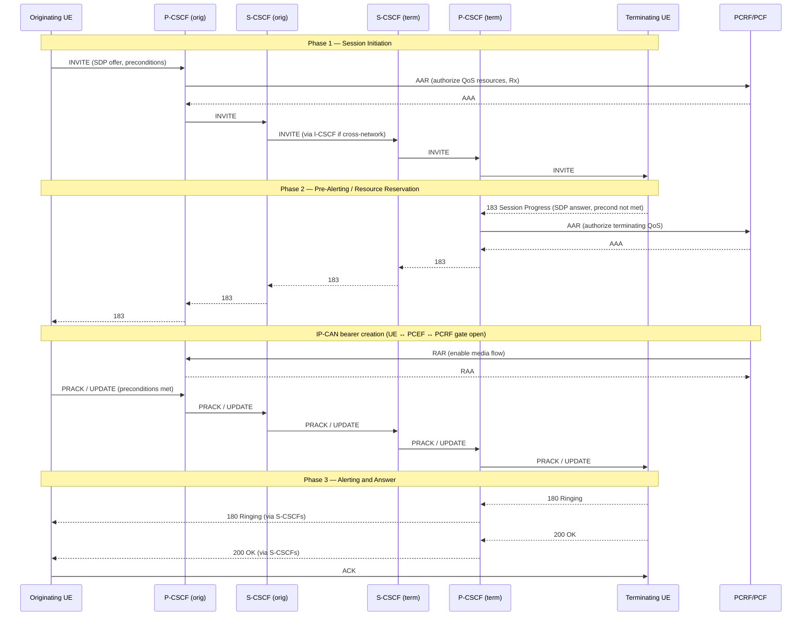
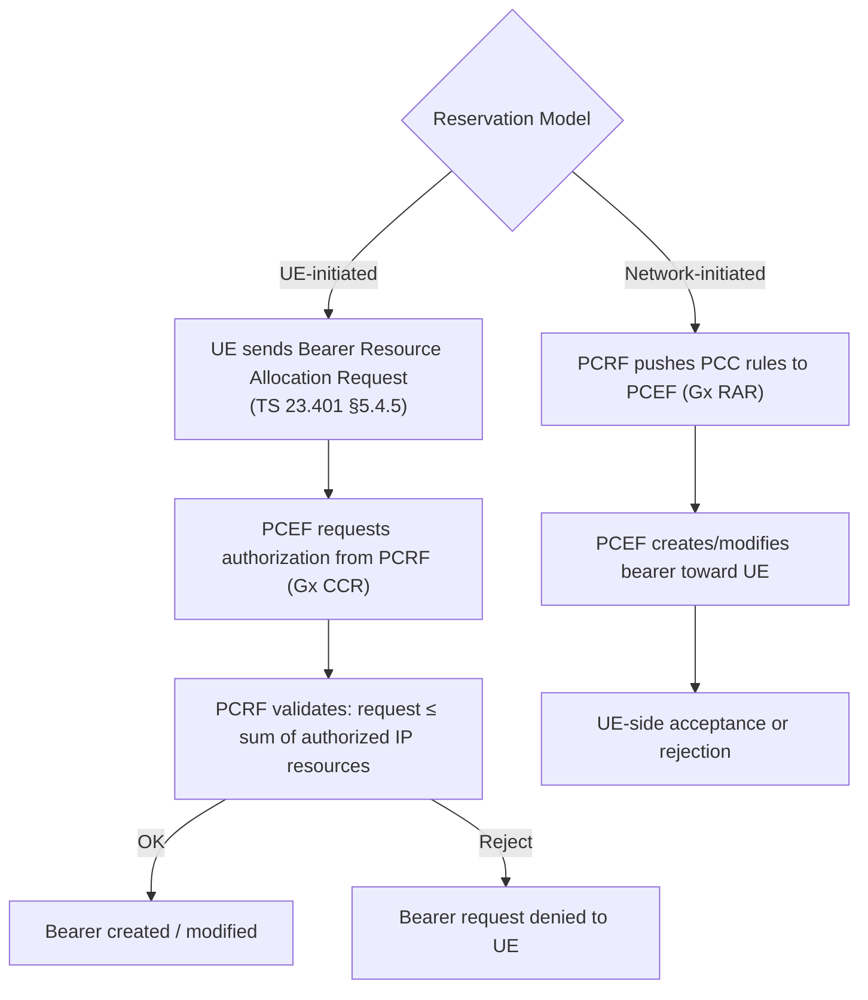
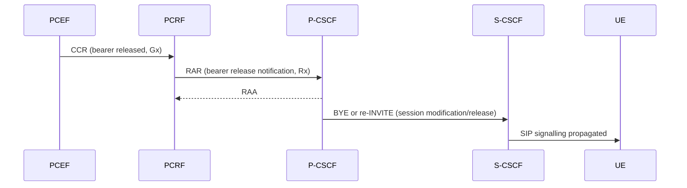
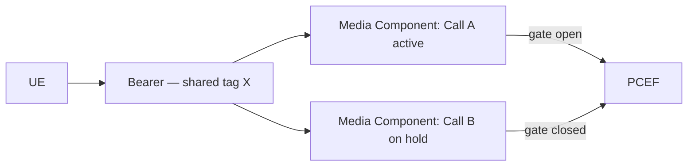
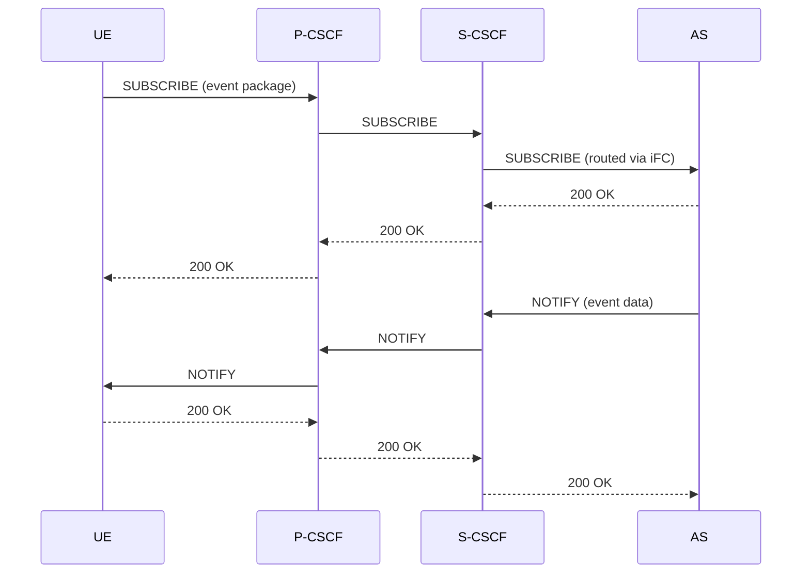
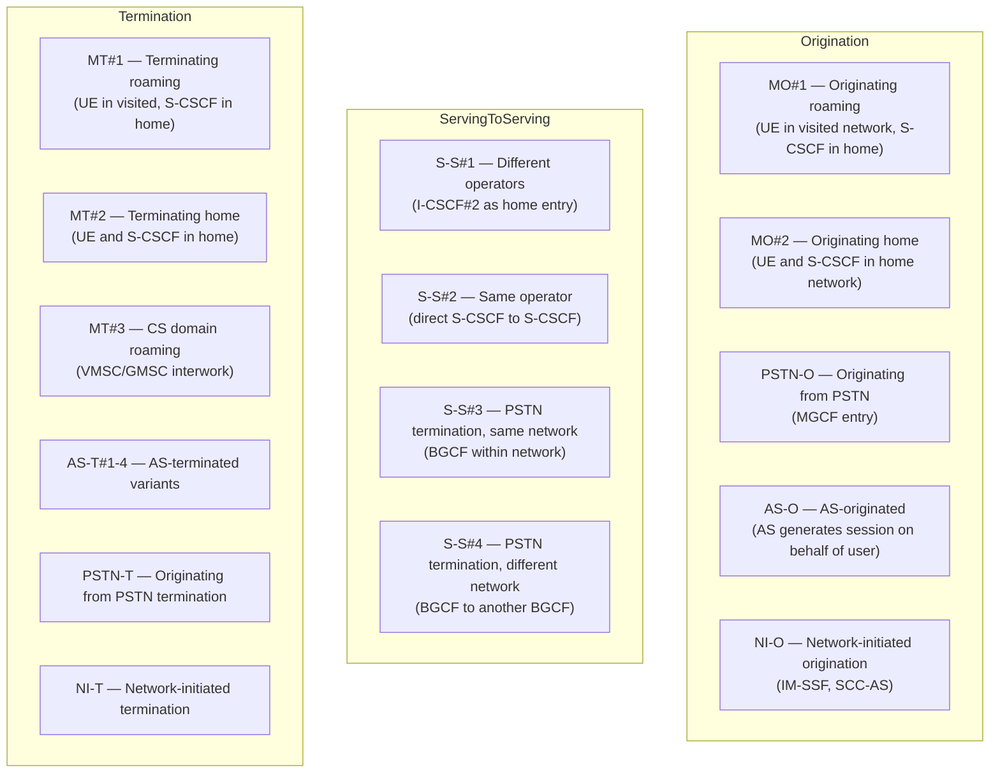
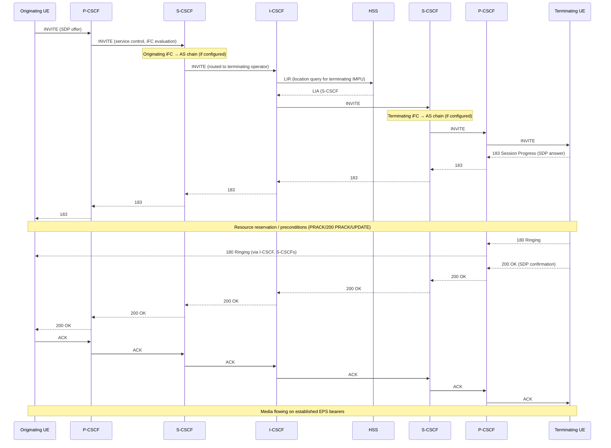

# IMS QoS and Bearer Interaction

Covers TS 23.228 §5.4.5–5.4.9 and §5.4.12: the mechanisms by which IMS sessions interact with
the underlying IP-CAN (4G EPS bearer layer) through PCC (Policy and Charging Control) to authorize,
reserve, enable, and release QoS resources for media streams.

Related pages: [P-CSCF](../entities/P-CSCF.md) · [PCRF](../entities/PCRF.md) ·
[EPS Bearer Model](../concepts/EPS-bearer.md) · [IMS Registration](IMS-registration.md) ·
[IMS Reference Points](../interfaces/IMS-reference-points.md)

---

## 1. Bearer Establishment with Pre-Alerting (§5.4.6.3)

When QoS-assured preconditions are used (§5.4.8), bearer establishment occurs *before* alerting
the called party. The flow (Figure 5.7) has three main phases:

Key property: the IP-CAN bearer is established and the gate is opened **before** the called UE
starts ringing, ensuring media can flow immediately at answer.

---

## 2. PCC Interactions Overview (§5.4.7.0)

Eight defined interactions between IMS signalling plane and the IP-CAN bearer plane:

| # | Interaction | Direction | Trigger |
|---|---|---|---|
| 1 | **Authorize QoS Resources** | P-CSCF → PCRF (Rx AAR) | SDP in SIP INVITE/200 OK/UPDATE |
| 2 | **Resource Reservation** | UE-initiated or network-initiated | UE bearer request or PCRF push |
| 3 | **Enable Media Flows** | PCRF → PCEF (gate open) | Both endpoints confirmed media OK |
| 4 | **Disable Media Flows** | PCRF → PCEF (gate close) | Session hold, call waiting, etc. |
| 5 | **Revoke Authorization** | PCRF → PCEF | IMS session release |
| 6 | **IP-CAN Bearer Release Indication** | PCEF → PCRF → P-CSCF | Bearer dropped in network |
| 7 | **Authorization of Bearer Modification** | PCEF ↔ PCRF | UE QoS change request |
| 8 | **Indication of Bearer Modification** | PCEF → PCRF → P-CSCF | MBR drops to 0 kbit/s |

**PCEF gate function:** The PCEF maintains a logical gate per media flow. Gate open = media
passes; gate closed = media blocked. The PCRF controls gates via Gx; the P-CSCF drives PCRF via Rx (4G) or N5 (5G).

**SDP-to-authorization derivation:** The [P-CSCF](../entities/P-CSCF.md) inspects SDP bodies
in SIP messages and derives IP flow descriptors (5-tuple: src/dst IP, src/dst port, protocol)
plus bandwidth parameters (b=AS, b=RS, b=RR lines) to construct the `AAR` to the PCRF.

---

## 3. Authorize QoS Resources (§5.4.7.1)

The [P-CSCF](../entities/P-CSCF.md) sends an `AAR` (AA-Request) on the **Rx** interface to the
[PCRF](../entities/PCRF.md) each time SDP is negotiated or re-negotiated:

- Triggered by: INVITE (offer), 200 OK (answer), UPDATE, re-INVITE
- Content: media component descriptors derived from SDP (codec, bandwidth, IP addresses, ports)
- PCC authorizes **each SIP session independently** — including parallel sessions from Call Waiting

**Authorization expression:**
- Maximum IP resource limits (bandwidth caps per flow direction)
- IP destination address and port restrictions (the authorized 5-tuple envelope)

The PCRF responds with `AAA` (AA-Answer) containing the PCC rules (QCI, ARP, GBR/MBR values)
that will be installed on the corresponding EPS dedicated bearer.

> A single SIP session may result in multiple media components (audio + video + BFCP), each
> mapped to a separate IP flow and potentially a separate EPS bearer.

---

## 4. Resource Reservation with PCC (§5.4.7.1a)

Two reservation models:

**Validation rule:** The QoS requested by the UE for the bearer must not exceed the *sum* of
authorized IP resources for all media components mapped to that bearer.

---

## 5. Enabling Media Flows (§5.4.7.2)

The PCRF opens the gate for a media flow when:
- Both endpoints have confirmed the media path (preconditions met, or no preconditions used)
- The IMS session progresses to the ringing or answer phase

**Forked sessions:** When a SIP request is forked to multiple terminating UEs simultaneously,
the gate-open decision uses a logical OR — if *any* of the forked legs is active, the gate is open.

---

## 6. Disabling Media Flows (§5.4.7.3)

Gate is closed (media blocked) when:
- Session is placed on hold (`a=inactive` or `a=sendonly` in re-INVITE)
- Call Waiting: active session gates are managed to prevent media leakage to held sessions
- Network-policy-driven temporary disablement

The P-CSCF detects the hold condition from the SDP change and sends an updated `AAR` or
`STR`/session update to the PCRF, which then issues `RAR` to PCEF to close the gate.

---

## 7. Revoke Authorization (§5.4.7.4)

At IMS session release (SIP BYE), the P-CSCF sends `STR` (Session-Termination-Request) on Rx.
The PCRF then:
1. Revokes all PCC rules associated with the session
2. Instructs PCEF to remove the corresponding dedicated EPS bearer(s) (via Gx RAR)
3. Gates are closed; authorized resources are freed

---

## 8. IP-CAN Bearer Release Indication (§5.4.7.5)

When a bearer is released by the **network** (not triggered by IMS signalling):

The P-CSCF maps the lost bearer back to the IMS session(s) it was serving. Depending on
whether the bearer was the *only* bearer or a redundant one, the P-CSCF may:
- Trigger IMS session release (§5.10.3.1) via BYE
- Trigger session modification via re-INVITE (downgrade codec/bandwidth)

---

## 9. Authorization of IP-CAN Bearer Modification (§5.4.7.6)

When the UE requests a bearer modification (e.g. bandwidth change):

1. PCEF checks if new QoS is within already-authorized limits
2. If yes: bearer modification proceeds without PCRF consultation
3. If no (or insufficient info): PCEF requests updated authorization from PCRF (`CCR`)
4. PCRF may need to consult P-CSCF if the modification implies a session change

When the **IMS session** is modified (re-INVITE / UPDATE with new SDP):
- P-CSCF sends updated `AAR` to PCRF with new media component descriptors
- PCRF updates PCC rules; PCEF may modify or create/delete bearers accordingly

---

## 10. Indication of IP-CAN Bearer Modification (§5.4.7.7)

Special case: if a bearer's **MBR (Maximum Bit Rate) drops to 0 kbit/s**:

- PCEF reports to PCRF via `CCR` with modified QoS
- PCRF forwards indication to P-CSCF via `RAR`
- P-CSCF evaluates whether the IMS session can continue
- If the session cannot tolerate zero bandwidth: P-CSCF initiates session release (BYE)

This handles network congestion or resource withdrawal scenarios where the bearer still
exists structurally but can no longer carry the media.

---

## 11. Resource Sharing for Concurrent Sessions (§5.4.7.8)

When a UE has multiple simultaneous IMS sessions (e.g. active call + call on hold):

**Uplink/downlink tagging:** The P-CSCF assigns *resource sharing tags* to media components.
Components with the **same tag** are allowed to share the same IP-CAN bearer resources.

Rules:
- Emergency sessions: **never** participate in resource sharing
- Gate management: when resource sharing is active, all but one session's gates are closed
  (prevents double-counting of bandwidth)
- The active session's gate is open; the held session's gate is closed

---

## 12. Priority Sharing for Concurrent Sessions (§5.4.7.9)

The P-CSCF can send a **priority sharing indicator** to the PCRF on Rx, allowing the PCRF
to assign the *same bearer priority* (ARP) across multiple concurrent sessions.

Use case: Mission Critical Push-To-Talk (MCPTT) and similar services where multiple parallel
sessions must compete equally for radio resources rather than one pre-empting another.

---

## 13. QoS-Assured Preconditions (§5.4.8)

QoS preconditions ensure an IMS session is **not completed** (no ringing, no answer) until
the required IP-CAN bearer is established and has sufficient resources.

Three cases:

| Case | Description |
|---|---|
| **a** | Both endpoints require precondition confirmation before alerting. Bearer must be established at both ends before 180 Ringing is generated. |
| **b** | Both endpoints indicate preconditions met in the *initial* exchange (fast path — bearer already exists, e.g. second call). Alerting may proceed immediately. |
| **c** | No preconditions used. Session proceeds without waiting for bearer confirmation (best-effort). |

**Segmented resource reservation:** Each endpoint independently confirms its own local
resources are reserved. The originating side confirms when its UL bearer is up; the
terminating side confirms when its DL bearer is up. Both confirmations are required for Case a.

SIP signalling for preconditions uses the `Supported: precondition` and `Require: precondition`
headers, with `P-Early-Media` and `183 Session Progress` carrying interim SDP.

---

## 14. Event and Information Distribution (§5.4.9)

The S-CSCF or AS can push service information to UE endpoints via SIP event notifications:

Event packages used in IMS: `reg` (registration state), `dialog` (dialog state for call
waiting/hold), `presence`, `message-summary` (voicemail MWI), `conference`.

---

## 15. Public Service Identity (PSI) Routing (§5.4.12)

A **Public Service Identity (PSI)** is an IMPU that identifies a service rather than an
individual subscriber (e.g. a conference bridge, voicemail deposit, or emergency number).

### PSI Types

| Type | Example | Notes |
|---|---|---|
| Distinct PSI | `sip:conf-123@operator.com` | Exact match in HSS |
| Wildcarded PSI | `sip:conf-.*@operator.com` | Regex in HSS; matches range of identities |
| Subdomain-based PSI | `sip:conf.operator.com` | Routed by DNS subdomain rules |

### PSI Routing — Originating Side

1. S-CSCF evaluates iFC for the originating user
2. If a Filter Criterion matches the destination PSI: session routed to the AS that owns the PSI
3. AS handles the service

### PSI Routing — Terminating Side

Two sub-cases:
- **HSS routing:** HSS stores the AS address for the PSI. I-CSCF queries HSS (`LIR`); HSS
  returns direct AS address (no S-CSCF assignment needed)
- **S-CSCF routing:** PSI assigned to an S-CSCF; normal terminating iFC evaluation applies

### PSI Configuration in HSS

The HSS stores PSIs as IMPUs in service profiles. For wildcarded PSIs, the HSS applies
regex matching against the incoming identity to determine which AS handles the request.

---

## 16. Session Flow Taxonomy (§5.4a / Table 5.2)

TS 23.228 defines a structured taxonomy of session flows to enable precise specification of
which path a SIP session takes:

### S-S#1 Flow: Different Network Operators (§5.5.1)

The most complete serving-to-serving case (Figure 5.10, ~40 steps):

Key characteristics of S-S#1:
- I-CSCF#2 is the topological hiding boundary between operators
- The I-CSCF performs an `LIR` to HSS#2 to find the assigned S-CSCF#2
- Both S-CSCFs evaluate their respective terminating/originating iFC chains independently
- SDP offer/answer follows the INVITE/183/UPDATE/200-OK exchange (may be deferred)

---

## Cross-References

| Topic | Page |
|---|---|
| P-CSCF as Rx AF | [P-CSCF](../entities/P-CSCF.md) |
| PCRF Gx/Rx policy engine | [PCRF](../entities/PCRF.md) |
| EPS dedicated bearer creation | [EPS Bearer Model](../concepts/EPS-bearer.md) |
| IMS Registration (P-CSCF discovery, S-CSCF assignment) | [IMS Registration](IMS-registration.md) |
| VoLTE MO Call full flow | [VoLTE MO Call](VoLTE-MO-call.md) |
| VoLTE MT Call full flow | [VoLTE MT Call](VoLTE-MT-call.md) |
| IMS reference points (Gm, Mw, Rx, ISC) | [IMS Reference Points](../interfaces/IMS-reference-points.md) |
