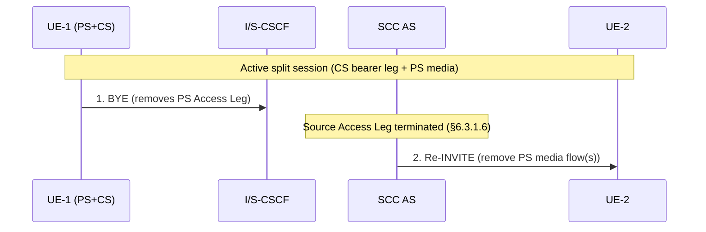
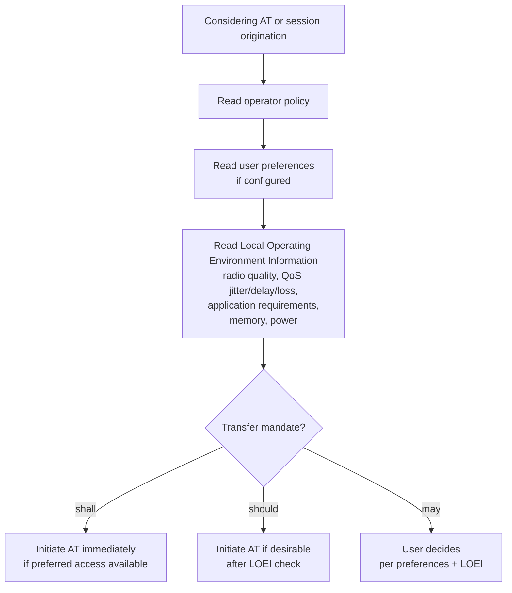

# IMS Service Continuity — Media Adding/Deleting, Operator Policy, and Supplementary Services

This page covers §6.3.3 (Media Adding/Deleting during Service Continuity), §6.3.5 (ICS UE mid-call fallback), §6.4 (Operator Policy and User Preferences), and §6.5 (Supplementary Services with multiple Access Legs).

Reference: **3GPP TS 23.237 §6.3.3–§6.5**

---

## §6.3.3 Media Adding/Deleting

After AT establishes split CS+PS legs, media flows may be added or removed by either end. The SCC AS mediates all changes via Remote Leg Update (§6.3.1.5) or Source Access Leg Release (§6.3.1.6).

All flows assume an established session: UE-1 (with PS and CS legs) ↔ SCC AS ↔ Remote Party (UE-2).

---

### Local End Initiation (UE-1 initiates)

#### §6.3.3.1 Adding new PS media to existing CS session

Pre-condition: UE-1 has a CS-only session (no Gm). UE-1 wants to add PS media (e.g. video).

```mermaid
sequenceDiagram
    participant UE1 as UE-1 (PS+CS)
    participant SCSCF as S-CSCF
    participant SCC as SCC AS
    participant UE2 as UE-2

    Note over UE1,UE2: 1. Active CS session (CS media only)
    UE1->>SCSCF: 2. INVITE (SDP PS — new media description)
    SCSCF->>SCSCF: 3. Service Logic
    SCSCF->>SCC: 4. INVITE (SDP PS)
    Note over SCC: 5. Correlate INVITE with existing session;\nadd new PS media flow
    Note over SCC: 6. Remote Leg Update (§6.3.1.5)
    SCC->>UE2: Re-INVITE / UPDATE
    Note over UE1,UE2: 7. Complete session setup
```

> If SCC AS cannot correlate the INVITE with an existing session, it treats it as a new session per §6.2.1.3.

---

#### §6.3.3.2 Incorporating existing CS media in new IMS Session and Gm Service Control

Pre-condition: UE-1 has CS-only session (no Gm). UE-1 wants to add PS media **and** establish Gm service control for the CS media.

- UE-1 sends INVITE(SDP PS, SDP CS) — includes description of new PS media and indication that CS media control moves to IMS
- SCC AS adds PS media + establishes Gm signalling path for CS media
- Result: session is now ICS-controlled via Gm

Flow is identical to §6.3.3.1 (7 steps), with the INVITE including both PS and CS SDP descriptions. Post-setup, UE-1 controls CS media via the Gm reference point.

---

#### §6.3.3.3 Adding PS media to IMS session with CS media (ICS UE)

Pre-condition: UE-1 already has IMS session with CS media via Gm. UE-1 adds PS media.

- UE-1 sends **Re-INVITE**(SDP PS, SDP CS) to existing IMS session
- S-CSCF forwards Re-INVITE to SCC AS
- SCC AS performs Remote Leg Update
- Result: session extended with PS media flow (6 steps total, no CS intermediate nodes in SDP negotiation path)

---

### Remote End Initiation (UE-2 initiates)

#### §6.3.3.4 Adding new PS media to existing CS session (remote UE-2 adds)

Pre-condition: UE-1 has CS-only session (no Gm). UE-2 wants to add a PS media flow.

```mermaid
sequenceDiagram
    participant UE2 as UE-2
    participant SCSCF as S-CSCF
    participant SCC as SCC AS
    participant UE1 as UE-1 (PS+CS)

    Note over UE1,UE2: 1. Active CS session
    UE2->>SCSCF: 2. Re-INVITE (add media)
    SCSCF->>SCC: 3. Re-INVITE (add media)
    Note over SCC: 4. T-ADS: deliver new PS media to UE-1 via PS access;\nuses C-MSISDN for correlation;\nsession split — new media only to UE-1
    SCC->>UE1: 5-6. INVITE (SDP PS) via PS access
    Note over UE1: 7. Accept — complete session setup via PS access
    Note over SCC: 8. Complete Remote Leg toward UE-2
```

Key: **T-ADS** in SCC AS decides the new media is delivered over PS. The split session is delivered only to UE-1 (not broadcast to other UEs of the same subscriber). C-MSISDN used for correlation.

---

#### §6.3.3.5 Incorporating existing CS media in new IMS Session and Gm Service Control (remote end)

Same as §6.3.3.4, but T-ADS additionally establishes Gm Service Control signalling together with the new PS media. SCC AS uses ICS capability (TS 23.292) to set up the Gm path. Post-completion: UE-1 controls CS media via Gm. 8 steps total.

---

#### §6.3.3.6 Adding PS media to IMS session with CS media (remote end, ICS UE)

Pre-condition: UE-1 already controls session via Gm. UE-2 adds PS media.

- UE-2 Re-INVITE → S-CSCF → SCC AS
- T-ADS decides to add PS media to existing Gm Service Control Signalling Path
- SCC AS sends Re-INVITE toward UE-1 via existing Gm path
- 8 steps; session extended with PS media flow

---

### Local End Initiation — Removing media

#### §6.3.3.7 Removing media from split CS and PS sessions



UE-1 uses standard IMS procedures (TS 23.228) to remove PS media flows. SCC AS updates Remote Leg to remove those flows from UE-2's view.

---

#### §6.3.3.11 Removing media from split PS sessions

Same as §6.3.3.7 except both legs are PS (no CS intermediate nodes). UE-1 removes PS session over one IP-CAN; continues IMS session over the other IP-CAN.

---

### Remote End Initiation — Removing media

#### §6.3.3.8 Removing media from split CS and PS sessions (remote end)

```mermaid
sequenceDiagram
    participant UE2 as UE-2
    participant ISCSCF as I/S-CSCF
    participant SCC as SCC AS
    participant UE1 as UE-1 (PS+CS)

    Note over UE1,UE2: Active split session
    UE2->>ISCSCF: 1. Re-INVITE (remove PS media)
    ISCSCF->>SCC: Re-INVITE
    Note over SCC: Identify Access Leg associated with PS media;\nTerminate that Access Leg
    SCC->>UE1: 2. BYE (PS Access Leg)
```

SCC AS identifies which Access Leg carries the PS media flows being removed and terminates it.

---

#### §6.3.3.12 Removing media from split PS sessions (remote end)

Same as §6.3.3.8 except all media is on PS accesses. PS session over one IP-CAN is terminated; session continues over the other IP-CAN.

---

### PS-only Adding/Removing (§6.3.3.9, §6.3.3.10)

| Sub-section | Scenario | Difference from CS+PS variant |
|---|---|---|
| §6.3.3.9 | Local end: adding PS media to existing PS session | Same as §6.3.3.3; no CS intermediate nodes; T-ADS selects delivery via IP-CAN2 |
| §6.3.3.10 | Remote end: adding PS media to existing PS session | Same as §6.3.3.4; T-ADS selects IP-CAN2; S-CSCF establishes new session via selected access network type |

---

### Media Adding/Deleting Summary

| Scenario | Initiator | Key SCC AS Action |
|---|---|---|
| Add PS media to CS-only session | Local (UE-1) | Correlate INVITE with existing session; Remote Leg Update |
| Add PS+Gm to CS-only session | Local (UE-1) | Same + establish Gm path for CS media control |
| Add PS media to existing ICS session | Local (UE-1) | Re-INVITE through existing Gm path; Remote Leg Update |
| Add PS media to CS-only session | Remote (UE-2) | T-ADS: split session; use C-MSISDN; INVITE(PS) toward UE-1 |
| Add PS+Gm to CS-only session | Remote (UE-2) | T-ADS: split + establish Gm signalling; ICS capability |
| Add PS media to existing ICS session | Remote (UE-2) | T-ADS: add to existing Gm path |
| Remove PS from split CS+PS | Local (UE-1) | BYE PS Access Leg; Re-INVITE remote to remove flows |
| Remove PS from split CS+PS | Remote (UE-2) | Re-INVITE → SCC AS BYEs PS Access Leg toward UE-1 |

---

## §6.3.5 Service Continuity for ICS UE — MSC Server Assisted Mid-Call Fallback

If the SCC AS detects that an ICS UE is **not reachable over the Service Control Signalling Path** (Gm/IMS path), and both of the following conditions are true:
- The UE and network support the MSC Server assisted mid-call feature
- The CS Bearer Control Signalling Path was established using an MSC Server enhanced for ICS

Then the SCC AS performs **§6.3.2.1.4a steps 4–6** (the SRVCC mid-call path using the MSC Server). After completion, the UE uses **TS 24.008** procedures for service control (CS-domain signalling), not SIP.

> This is a fallback mechanism: IMS service control fails → MSC Server takes over service control for the CS leg.

---

## §6.4 Operator Policy and User Preferences

Operator policy is provisioned via **OMA Device Management** (TS 23.237 §4) and communicated to the UE during initial provisioning or whenever policy is updated.

### Operator Policy Contents

For each supported media type or media group, operator policy defines:

| Policy Parameter | Description |
|---|---|
| Restricted access networks | List of access networks that must NOT be used for origination or AT |
| Preferred access networks | Priority-ordered list of preferred access networks for sessions and AT |
| Transfer mandate level | `shall` / `should` / `may` — how forcefully the UE must initiate AT |
| Partial AT media retention | Whether to keep or drop non-transferable media flows during partial AT |

### Transfer Mandate Semantics

| Keyword | Meaning |
|---|---|
| `shall` | Operator mandates AT as soon as preferred access becomes available |
| `should` | Operator recommends AT after UE takes Local Operating Environment Information into account |
| `may` | UE free to decide per user preferences and Local Operating Environment Information |

> NOTE: Operator policy for AT must be consistent with operator policy for T-ADS.

### User Preferences

Users may additionally specify:
- Preferred access/domain (CS preferred or IMS preferred)
- Preferred IP-CAN within IMS

### UE Decision Logic



> NOTE: If "IMS voice over PS Session Supported Indication" (TS 23.060/23.401) is not set for a specific IP-CAN and there is no ongoing IMS voice session, that IP-CAN cannot be used for voice — even if set to preferred by user preferences.

---

## §6.5 Execution of Supplementary Services with Multiple Access Legs

When a UE has multiple Access Legs (split CS+PS session), supplementary service requests are handled as follows.

**General principle (§6.5.1):**
- The Remote Leg is presented to the remote party as **one session with all media** — the split is invisible to the remote end
- For Access Legs carrying CS media: the service interaction is handled via PS Access Leg; CS media operations follow TS 23.292
- If service invocation fails on one Access Leg, the UE and SCC AS may retry on another Access Leg

### Impact Summary

| Service | §6.5.x | Impact |
|---|---|---|
| OIP (Originating ID Presentation) | 6.5.2 | Not impacted |
| OIR (Originating ID Restriction) | 6.5.3 | Not impacted |
| TIP (Terminating ID Presentation) | 6.5.4 | Not impacted |
| TIR (Terminating ID Restriction) | 6.5.5 | Not impacted |
| CDIV (Communication Diversion) | 6.5.6 | **Impacted** |
| HOLD (Communication Hold) | 6.5.7 | **Impacted** |
| CB (Communication Barring) | 6.5.8 | Not impacted |
| MWI (Message Waiting Indication) | 6.5.9 | Not impacted |
| CONF (Conference) | 6.5.10 | **Impacted** |
| ECT (Explicit Communication Transfer) | 6.5.11 | **Impacted** |
| AOC (Advice of Charge) | 6.5.12 | **Impacted** |
| CUG (Closed User Groups) | 6.5.13 | Not impacted |
| 3PTY (Three-Party) | 6.5.14 | Special case of CONF |
| FA (Flexible Alerting) | 6.5.15 | Not impacted |
| CW (Communication Waiting) | 6.5.16 | **Impacted** |
| CCBS/CCNR | 6.5.17 | Not impacted |
| CAT (Customized Alerting Tones) | 6.5.18 | Not impacted |
| MCID (Malicious Communication Identification) | 6.5.19 | **Impacted** |
| Reverse Charging | 6.5.20 | Not specified |
| PNM (Personal Network Management) | 6.5.21 | Not specified |
| CRS (Customized Ringing Signal) | 6.5.22 | Not specified |

### Impacted Services — Detailed Rules

#### CDIV (§6.5.6)

- UE may invoke CDIV on **any** Access Leg (TS 24.604)
- When SCC AS receives CDIV request on any Access Leg: terminates the **other** Access Legs, then invokes CDIV service

#### HOLD (§6.5.7)

- UE invokes HOLD procedures (TS 24.610) **on all Access Legs** that contain the affected media component(s)
- SCC AS updates the remote Access Leg using TS 24.610 procedures
- If remote end invokes HOLD: SCC AS forwards the HOLD request on **all** Access Legs containing the affected media

#### CONF / 3PTY (§6.5.10, §6.5.14)

- UE may send CONF-related requests (subscribe, refer to conference) on **any** Access Leg
- If remote end requests CONF to replace an existing session within the same dialog: SCC AS may deliver on any Access Leg
- If remote end requests CONF to replace an existing session **outside** the dialog: UE follows TS 24.605 to establish new session to conference focus
- 3PTY is treated as a special case of CONF

#### ECT (§6.5.11)

- Transferor UE: may send ECT request (TS 24.629) on any Access Leg
- SCC AS may deliver ECT request to the transferee UE on any Access Leg
- UE receiving ECT request: follows TS 24.629 to establish new session to Transfer Target

#### AOC (§6.5.12)

- SCC AS may deliver charging information (TS 24.647) to the UE over **any** Access Leg

#### CW (§6.5.16)

- UE may invoke CW (TS 24.615) on any Access Leg
- SCC AS receiving CW request on any Access Leg: invokes CW service following TS 24.615

#### MCID (§6.5.19)

- When invoking MCID in temporary subscription mode with multiple active Access Legs: UE may send Re-INVITE for MCID (TS 24.616) on **any** Access Leg

---

## Cross-references

- [entities/SCC-AS.md](../entities/SCC-AS.md) — T-ADS, Remote Leg Update, C-MSISDN, session correlation
- [entities/ATCF.md](../entities/ATCF.md) — ATGW control; mid-call feature fallback (§6.3.5)
- [procedures/PS-CS-access-transfer.md](PS-CS-access-transfer.md) — AT flows (prerequisite for split sessions)
- [procedures/IMS-SC-origination-termination.md](IMS-SC-origination-termination.md) — session anchoring, ATCF inclusion
- [concepts/IMS-service-continuity.md](../concepts/IMS-service-continuity.md) — full SC concept, operator policy overview
