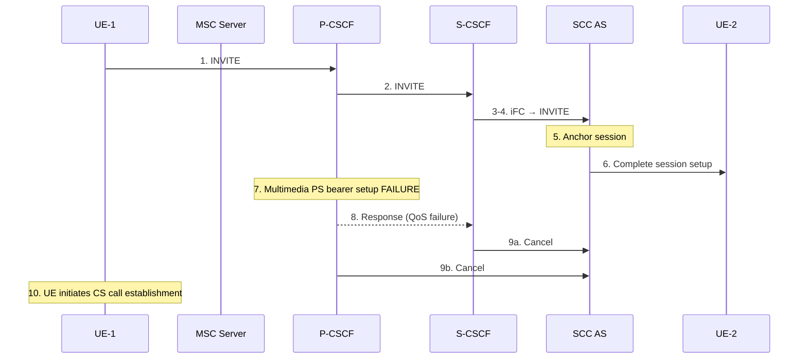
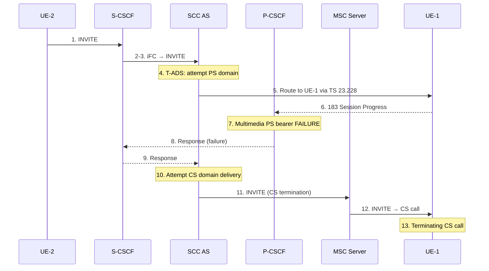

# IMS Service Continuity — Origination and Termination

Session origination and termination for SC subscribers establish the 3pcc anchor at the SCC AS that makes subsequent Access Transfer possible. The ATCF (when deployed) additionally anchors media in the ATGW during session setup.

Reference: **3GPP TS 23.237 §6.2**

---

## §6.2.1 Origination

### §6.2.1.1 General Origination Principle

- **SCC AS must be the FIRST Application Server** in the iFC chain that needs to remain in the call path after session origination
- The SCC AS uses 3pcc (per TS 23.228) to anchor both legs
- A **dynamic STI** is assigned by the SCC AS for each anchored session

### Origination Variants

| Variant | Media | Procedure |
|---|---|---|
| CS media | CS bearer for voice/video | TS 23.292 §7.3.2 (ICS origination); SCC AS anchors; STI assigned |
| PS-only media | IP-CAN bearer | Standard MO per TS 23.228; SCC AS anchors via iFC; STI assigned |
| PS-only + ATCF | IP-CAN bearer, ATCF in path | INVITE traverses ATCF → I/S-CSCF → SCC AS; ATCF may anchor ATGW |
| PS-only, fallback to CS | PS bearer fails in pre-alerting | PS bearer setup fails → Cancel → UE initiates CS call |
| CS-to-PS Single Radio | CS origination via MSC Server | MSC Server sends INVITE via ATCF (using ATCF management URI) |

---

### §6.2.1.3 PS-Only Media Origination (baseline)

```mermaid
sequenceDiagram
    participant UE1 as UE-1
    participant SCSCF as S-CSCF
    participant SCC as SCC AS
    participant UE2 as UE-2

    UE1->>SCSCF: 1. INVITE
    SCSCF->>SCC: 2-3. Service logic (iFC) → INVITE
    Note over SCC: 4. Anchor session; assign STI
    SCC->>UE2: 5. Complete session setup (per TS 23.228)
    SCC-->>UE1: 5. Response (may include updated STN for Dual Radio)
```

Steps:
1. UE-1 initiates IMS multimedia session to UE-2 with PS media flow(s)
2-3. iFC causes request to be forwarded to SCC AS for anchoring
4. SCC AS anchors session; assigns a dynamic STI for the session
5. SCC AS completes session setup to UE-2; sends response to UE-1. For Dual Radio, SCC AS may provide an update STN to the UE in the response.

---

### §6.2.1.3a PS-Only Media — Fallback to CS in Pre-Alerting Phase

Used when SRVCC in pre-alerting/alerting state is not supported.



The response uniquely identifies a QoS Resources Authorization failure so the UE knows to fall back to CS.

---

### §6.2.1.4 PS-Only Media with ATCF Enhancements

```mermaid
sequenceDiagram
    participant UE1 as UE-1
    participant ATCF
    participant ATGW
    participant ISCSCF as I/S-CSCF
    participant SCC as SCC AS
    participant UE2 as UE-2

    UE1->>ATCF: 1. INVITE
    Note over ATCF: Decide to anchor;<br/>allocate ATGW resources
    ATCF->>ISCSCF: 2. INVITE
    ISCSCF->>SCC: 3. INVITE
    SCC->>ISCSCF: 4. INVITE (3pcc)
    ISCSCF->>UE2: 5. INVITE
    Note over ATCF,ATGW: 6. Session completion + optional ATGW anchor decision
    Note over ATCF: ATCF does NOT modify dynamic STI
    Note over SCC: Access Leg: UE-1 ↔ SCC AS established
```

Key rules:
- ATCF traversal is triggered because ATCF was included in SIP signalling path during registration
- ATCF decides on ATGW media anchoring based on: service/media capabilities, remote party network, access type, UE SRVCC capability
- If ATGW anchoring not decided at INVITE, ATCF may anchor later at completion (step 6) using another offer/answer exchange
- **ATCF MUST NOT modify the dynamic STI** exchanged between UE and SCC AS

---

### §6.2.1.5 CS-to-PS Single Radio Origination via ATCF

CS origination follows TS 23.292 §7.3 with the addition that the call is routed through the ATCF.

```mermaid
sequenceDiagram
    participant UE1 as UE-1
    participant MME as MME/SGSN
    participant MSC as MSC Server
    participant CSMGW as CS-MGW
    participant ATCF
    participant ATGW
    participant SCC as SCC AS / S-CSCF
    participant UE2 as UE-2

    UE1->>MME: 1. CS SETUP
    MSC->>ATCF: 2. INVITE (includes C-MSISDN, uses ATCF mgmt URI)
    Note over ATCF,ATGW: 3. Decide to anchor; allocate ATGW
    ATCF->>SCC: 4. INVITE
    SCC->>UE2: 5. INVITE
    Note over UE1,UE2: 6. Session setup complete
```

MSC Server includes **C-MSISDN** in the INVITE to the ATCF for correlation. Once established, ATCF acts as the access transfer function.

---

## §6.2.2 Termination

### §6.2.2.1 General Termination Principle

- **SCC AS must be the LAST Application Server** in the iFC chain that needs to remain in the call path after session termination
- The SCC AS uses 3pcc (per TS 23.228) to anchor both legs
- A **dynamic STI** is assigned for the anchored session
- T-ADS (Terminating Access Domain Selection) determines how the session is delivered to the UE

### Termination Variants

| Variant | Media | Procedure |
|---|---|---|
| CS media | CS bearer | TS 23.292 §7.4.2; SCC AS anchors; T-ADS; STI assigned; C-MSISDN for correlation |
| PS-only media | IP-CAN bearer | Standard MT per TS 23.228; SCC AS anchors; STI assigned |
| PS-only + ATCF | ATCF in path | INVITE routed via SCC AS T-ADS → ATCF; ATCF may anchor ATGW |
| PS-only, fallback to CS | PS bearer fails in pre-alerting | P-CSCF signals failure → SCC AS attempts CS domain delivery |
| Speech rejected over Gm | UE rejects speech | SCC AS splits media; re-attempts on CS domain |
| CS-to-PS Single Radio | CS termination via MSC Server | MSC Server routes INVITE via ATCF (using ATCF management URI) |

---

### §6.2.2.2 CS Media Termination

```mermaid
sequenceDiagram
    participant UE2 as UE-2 (caller)
    participant SCSCF as S-CSCF
    participant SCC as SCC AS
    participant UE1 as UE-1 (SC subscriber)

    UE2->>SCSCF: 1. INVITE
    SCSCF->>SCC: 2-3. iFC → INVITE
    Note over SCC: 4. Anchor session; assign STI
    SCC->>UE1: 5. Route to UE-1 per TS 23.292<br/>CS bearer + media split if needed<br/>STI communicated to UE; C-MSISDN for correlation
```

If the SCC AS splits non-speech and speech media for a UE, T-ADS delivers only that split to the particular UE. The session may include both CS and PS media flows.

---

### §6.2.2.3a PS-Only Media Termination — Fallback to CS in Pre-Alerting

Used when SRVCC in alerting phase for terminating sessions is not supported.



---

### §6.2.2.4 Termination — Speech Rejected over Gm

If the SCC AS includes only bi-directional speech (and the UE rejects it), or if the SCC AS includes non-speech media (and the UE accepts only non-speech):
- SCC AS **splits non-speech from bi-directional speech or CS media** for this UE
- T-ADS re-attempts termination on CS domain if possible
- SCC AS uses C-MSISDN for correlation

---

### §6.2.2.5 PS-Only Media Termination with ATCF Enhancements

```mermaid
sequenceDiagram
    participant UE2 as UE-2
    participant ISCSCF as I/S-CSCF
    participant SCC as SCC AS
    participant ATCF
    participant ATGW
    participant UE1 as UE-1

    UE2->>ISCSCF: 1. INVITE
    ISCSCF->>SCC: 2. INVITE
    Note over SCC: 3. T-ADS; route toward UE-1
    SCC->>ISCSCF: 3. INVITE
    ISCSCF->>ATCF: 4. INVITE (ATCF in signalling path)
    Note over ATCF,ATGW: Decide to anchor; allocate ATGW
    ATCF->>UE1: 5. INVITE (via P-CSCF, not shown)
    Note over ATCF: 6. Session completion + optional anchor decision
    Note over ATCF: ATCF does NOT modify dynamic STI
    Note over SCC: Access Leg: UE-1 ↔ SCC AS established
```

If UE-1 rejects bi-directional speech (per §6.2.2.4), ATCF releases ATGW resources and removes itself from the session path.

---

### §6.2.2.6 CS-to-PS Single Radio Termination via ATCF

CS termination follows TS 23.292 §7.4 with the call routed through the ATCF.

```mermaid
sequenceDiagram
    participant UE2 as UE-2
    participant SCC as SCC AS / S-CSCF
    participant MSC as MSC Server
    participant CSMGW as CS-MGW
    participant ATCF
    participant ATGW
    participant UE1 as UE-1

    UE2->>SCC: 1. INVITE
    SCC->>MSC: 2. INVITE (route to CS per TS 23.292 §7.4)
    MSC->>ATCF: 3. INVITE (via ATCF mgmt URI; includes C-MSISDN)
    Note over ATCF,ATGW: 4. Decide to anchor; allocate ATGW
    ATCF->>MSC: 5. INVITE
    MSC->>UE1: 6. CS SETUP
    Note over UE1,UE2: 7. Session setup complete
```

MSC Server uses the ATCF management URI (received from SCC AS per §6.1.3.2). ATCF acts as the access transfer function after session setup.

---

## Origination/Termination Summary

| Aspect | Origination | Termination |
|---|---|---|
| SCC AS position in AS chain | **First** AS remaining in path | **Last** AS remaining in path |
| 3pcc role | SCC AS establishes Remote Leg to UE-2 | SCC AS establishes Access Leg to UE-1 |
| STI assignment | Dynamic STI assigned per session | Dynamic STI assigned per session |
| ATCF role | Traverses INVITE; optionally anchors ATGW | Receives INVITE from home via T-ADS; optionally anchors ATGW |
| CS media path | TS 23.292 procedures | TS 23.292 procedures + T-ADS |
| Fallback | PS bearer failure → CS call initiation | PS bearer failure → CS domain re-attempt |
| C-MSISDN use | CS origination correlation | CS termination + media split correlation |

---

## Cross-references

- [entities/SCC-AS.md](../entities/SCC-AS.md) — 3pcc anchor, T-ADS
- [entities/ATCF.md](../entities/ATCF.md) — ATGW anchoring decision at session setup
- [concepts/IMS-service-continuity.md](../concepts/IMS-service-continuity.md) — full SC concept
- [procedures/IMS-SC-registration.md](IMS-SC-registration.md) — registration prerequisite
- [procedures/VoLTE-MO-call.md](VoLTE-MO-call.md) — base MO call (TS 23.228)
- [procedures/VoLTE-MT-call.md](VoLTE-MT-call.md) — base MT call (TS 23.228)
