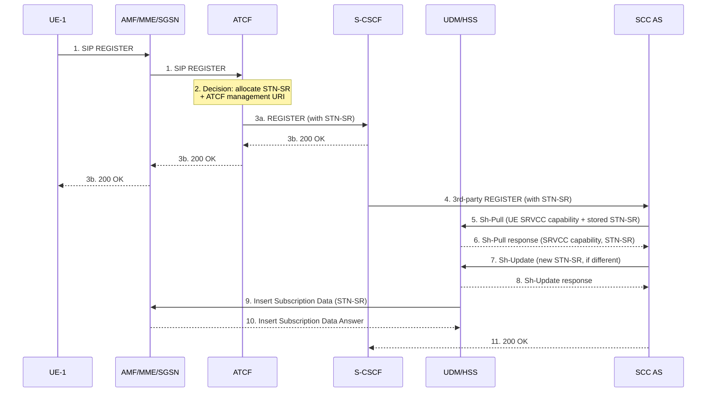
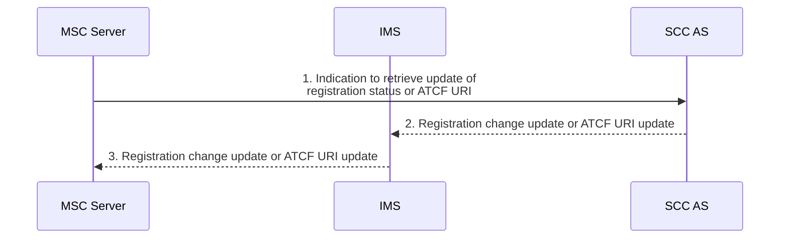
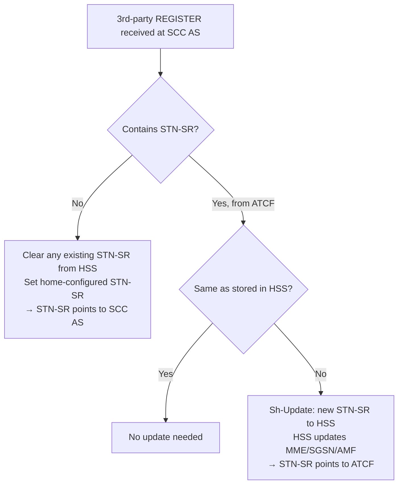

# IMS Service Continuity Registration

IMS Service Continuity registration extends the standard IMS registration (TS 23.228 §5.1) to:
1. Bind the SC subscriber's IMS identity to the SCC AS (via 3rd-party registration)
2. Distribute the STN-SR to the serving node (MME/SGSN/AMF) so SRVCC requests are routed correctly
3. Provide the ATCF management URI to the MSC Server for CS-leg anchoring

Reference: **3GPP TS 23.237 §6.1**

---

## §6.1.1 General — 3rd-Party Registration to SCC AS

When the UE acquires IP connectivity via an IP-CAN, it registers in IMS per TS 23.228. The S-CSCF then performs **3rd-party registration** to the SCC AS per TS 23.218.

On receiving the 3rd-party REGISTER, the SCC AS:
- Obtains the **C-MSISDN** from the HSS (bound to the UE's IMPI)
- Binds all unique identities from the SIP registration (GRUUs, contact address) with the session identifier of any ongoing session
- If received without an STN-SR pointing to an ATCF, and this registration is for a contact supporting SRVCC:
  - Clears any existing STN-SR from the UDM/HSS
  - Sets a home-network-configured STN-SR (pointing to SCC AS, not ATCF)

---

## §6.1.2 Registration using ATCF Enhancements

When the ATCF is deployed in the serving network, it inserts itself into the SIP registration path to provide a routable STN-SR pointing to itself. This ensures the MSC Server selects the correct ATCF during SRVCC.

### Flow (Figure 6.1.2-1)

### Step-by-step Detail

| Step | Action |
|---|---|
| 1 | UE sends SIP REGISTER via AMF/MME to ATCF (P-CSCF and I-CSCF not shown) |
| 2 | ATCF decides (per operator policy, roaming agreement, UE capabilities) to allocate STN-SR and include itself; also allocates ATCF management URI |
| 3a | ATCF includes STN-SR in forwarded REGISTER to S-CSCF |
| 3b | 200 OK returns to UE |
| 4 | S-CSCF performs 3rd-party REGISTER to SCC AS (carrying STN-SR) |
| 5 | SCC AS performs Sh-Pull to UDM/HSS to check UE SRVCC capability and existing STN-SR |
| 6 | UDM/HSS responds with SRVCC capability + stored STN-SR |
| 7 | If received STN-SR ≠ stored STN-SR: SCC AS performs Sh-Update to replace STN-SR in HSS |
| 8 | Sh-Update response |
| 9 | UDM/HSS sends Insert Subscription Data (updated STN-SR) to MME/SGSN |
| 10 | MME/SGSN acknowledges |
| 11 | SCC AS returns 200 OK to S-CSCF |

> NOTE: If no ATCF is deployed, or ATCF did not include itself, SCC AS allocates a home-configured STN-SR pointing to the SCC AS itself, replacing any previously stored STN-SR.

### Post-registration: SCC AS ↔ ATCF coordination

After successful registration:
- SCC AS communicates **UE SRVCC capability** to ATCF (using ATCF management URI)
- ATCF uses this to decide whether to anchor IMS sessions at ATGW
- SCC AS can poll UDM/HSS for updated UE SRVCC capability at any time

### Multi-access note

If the UE registers from multiple accesses simultaneously, the SCC AS only receives and uses one STN-SR (from one ATCF). Additional registrations from the same UE on the same ATCF reuse the existing STN-SR without updating HSS if unchanged.

---

## §6.1.3 Registration: CS to PS — Single Radio

Applies when the UE supports CS-to-PS reverse SRVCC. This requires the UE to be both PS-registered (IMS) and CS-attached.

### §6.1.3.1 IMS Registration by UE

The UE shall:
- Include a **pre-defined port and codec** for the voice media channel to receive downlink media during CS-to-PS Access Transfer
- Include its **CS-to-PS SRVCC capability** in the registration request

Additionally, the **ATCF provides a dynamic STI-rSR** to the UE during (or in conjunction with) the IMS registration. The STI-rSR is unique per ATCF instance and is used by the UE when requesting CS-to-PS access transfer.

### §6.1.3.2 UE IMS Registration Change Update

As a prerequisite for CS-to-PS SRVCC, the UE shall also be attached to an **MSC Server enhanced for ICS** and IMS-registered via that MSC Server using the I2 reference point (per TS 23.292 §7.2.1).

The MSC Server may subscribe to the SCC AS for:
- Updates to the UE's IMS registration status
- Changes to the ATCF management URI

When IMS registration status or ATCF management URI changes, the SCC AS notifies the MSC Server. The UE CS-to-PS SRVCC capability is also included and not updated further.

---

## STN-SR Routing Logic Summary

---

## Cross-references

- [entities/SCC-AS.md](../entities/SCC-AS.md) — SCC AS entity
- [entities/ATCF.md](../entities/ATCF.md) — ATCF: STN-SR allocation, ATGW anchoring decision
- [concepts/IMS-service-continuity.md](../concepts/IMS-service-continuity.md) — full SC concept
- [procedures/IMS-registration.md](IMS-registration.md) — base IMS registration (TS 23.228)
- [procedures/IMS-SC-origination-termination.md](IMS-SC-origination-termination.md) — SC origination/termination
