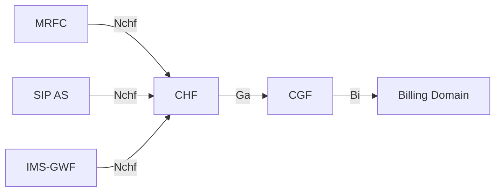

# IMS Converged Charging Flows

IMS converged charging uses the **Nchf** interface (5G SBI, HTTP/JSON) from IMS nodes to the **CHF** (Charging Function). This page documents §5.4 of TS 32.260, covering the converged charging trigger framework, CHF CDR generation, and the Charging Data Request/Response message structures (§6.1.1–§6.1.2).

See [IMS charging architecture](../concepts/IMS-charging-architecture.md) for architecture overview and [IMS offline charging flows](IMS-offline-charging-flows.md) / [IMS online charging flows](IMS-online-charging-flows.md) for the Rf/Ro counterparts.

---

## §5.4 Converged Charging Architecture

### IMS Nodes as Converged CTFs

The following IMS nodes generate converged charging data to the CHF:

- **MRFC** and **SIP AS** are the primary converged CTFs
- **IMS-GWF** can also use Nchf (same nodes that use Ro for online charging)
- The CHF acts as a combined OCF + CDF: it manages quota grants (online) and CDR generation (offline) in a single SBI interface
- CHF-generated CDRs flow to CGF via Ga (TS 32.295), then to Billing Domain via Bi (TS 32.297)

### Charging Methods

Converged charging supports four charging methods:

| Method | Full Name | Description |
|---|---|---|
| **SCUR** | Session Charging with Unit Reservation | Session-based quota management (INVITE through BYE) |
| **ECUR** | Event Charging with Unit Reservation | Event-based reserve-then-debit |
| **IEC** | Immediate Event Charging | Immediate debit on event |
| **PEC** | Partial Event Charging | New in converged charging — used for unsuccessful procedure events (4xx/5xx/6xx) |

PEC appears only in the converged model (§5.4), not in Rf offline or Ro online.

---

## §5.4.3 Trigger Conditions

### §5.4.3.1 Default Trigger Conditions (Table 5.4.3.1)

The trigger table for converged charging has five columns: the triggering event, trigger level, default category (all **Immediate**), CHF-allowed-to-change-category flag, CHF-allowed-to-enable/disable flag, and the message sent when in "immediate reporting" mode.

**Group 1 — Initial session-setup SIP methods:**

| Trigger | Default | CHF change cat? | CHF enable/disable? | Message (immediate reporting) |
|---|---|---|---|---|
| SIP INVITE | Immediate | Not Applicable | Not Applicable | SCUR: Charging Data Request [Initial] |
| SIP NOTIFY | Immediate | Not Applicable | Not Applicable | ECUR: CDR[Initial] or IEC: CDR[Event] |
| SIP MESSAGE | Immediate | Not Applicable | Not Applicable | ECUR: CDR[Initial] or IEC: CDR[Event] |
| SIP REGISTER | Immediate | Not Applicable | Not Applicable | ECUR: CDR[Initial] or IEC: CDR[Event] |
| SIP SUBSCRIBE | Immediate | Not Applicable | Not Applicable | IEC: CDR[Event] |
| SIP REFER | Immediate | Not Applicable | Not Applicable | — |
| SIP PUBLISH | Immediate | Not Applicable | Not Applicable | — |

**Group 2 — Change of charging conditions (mid-session):**

| Trigger | Default | CHF change cat? | CHF enable/disable? | Message (immediate reporting) |
|---|---|---|---|---|
| SIP RE-INVITE or UPDATE (media change, identity change) | Immediate | No | No | — |
| SIP 2xx ack INVITE/RE-INVITE/UPDATE (media change) | Immediate | No | No | SCUR: CDR[Update] |
| SIP 1xx provisional, mid-dialog requests/responses, SIP INFO RTTI | Immediate | No | No | SCUR: CDR[Update] |
| SIP 4xx/5xx/6xx (unsuccessful RE-INVITE or UPDATE) | Immediate | No | No | SCUR: CDR[Update] |
| Any other SIP message during session (allows session to continue) | Immediate | Yes | No | SCUR: CDR[Update] |

**Group 3 — CHF-managed limits:**

| Trigger | Default | CHF enable/disable? | Message |
|---|---|---|---|
| Expiry of time limit | Immediate | Yes | SCUR: CDR[Update] |
| Expiry of limit of number of charging condition changes | Immediate | Yes | SCUR: CDR[Update] |

**Group 4 — Quota management (all CHF-enable/disable = Yes):**

| Trigger |
|---|
| Time threshold reached |
| Time quota exhausted |
| Unit quota exhausted |
| Expiry of quota validity time |
| Expiry of quota holding time |
| Re-authorization request by CHF |

All quota management triggers → SCUR: CDR[Update] with close-the-counts and restart-with-timestamps.

**Group 5 — Session termination:**

| Trigger | Default | CHF change cat? | CHF enable/disable? | Message |
|---|---|---|---|---|
| Management intervention | Immediate | No | No | SCUR: CDR[Update] |
| SIP BYE (normal and abnormal termination) | Immediate | Not Applicable | Not Applicable | SCUR: CDR[Termination] |
| SIP 2xx ack BYE (if last user location required) | Immediate | Not Applicable | Not Applicable | SCUR: CDR[Termination] |
| SIP 2xx ack non-session-related SIP | Immediate | Not Applicable | Not Applicable | ECUR: CDR[Termination] |
| Aborting session setup (internal trigger or SIP CANCEL) | Immediate | Not Applicable | Not Applicable | SCUR: CDR[Termination] + ECUR: CDR[Termination] |
| Deregistration | Immediate | Not Applicable | Not Applicable | SCUR: CDR[Termination] + ECUR: CDR[Termination] |
| SIP 3xx final or redirection response | Immediate | Not Applicable | Not Applicable | SCUR: CDR[Termination] + ECUR: CDR[Termination] |
| SIP 4xx/5xx/6xx final response (unsuccessful procedure) | Immediate | Not Applicable | Not Applicable | SCUR: CDR[Termination] + ECUR: CDR[Termination] + IEC: CDR[Event] + **PEC: CDR[Event]** |

### §5.4.3.2 Chargeable Events and IMS Node Actions (Table 5.4.3.2)

Table 5.4.3.2 maps each chargeable event to the exact Charging Data Request the IMS node sends:

| Chargeable Event | Conditions | IMS Node Action |
|---|---|---|
| SIP INVITE | — | SCUR: CDR[Initial] with possible request quota |
| SIP NOTIFY | — | ECUR: CDR[Initial] with possible quota **or** IEC: CDR[Event] |
| SIP MESSAGE | — | ECUR: CDR[Initial] with possible quota **or** IEC: CDR[Event] |
| SIP REGISTER | — | ECUR: CDR[Initial] with possible quota **or** IEC: CDR[Event] |
| SIP SUBSCRIBE | — | ECUR: CDR[Initial] with possible quota **or** IEC: CDR[Event] |
| SIP REFER | — | ECUR: CDR[Initial] with possible quota **or** IEC: CDR[Event] |
| SIP PUBLISH | — | ECUR: CDR[Initial] with possible quota **or** IEC: CDR[Event] |
| SIP RE-INVITE or UPDATE | — | SCUR: CDR[Update] with possible quota |
| SIP 2xx ack INVITE/RE-INVITE/UPDATE | — | SCUR: CDR[Update] with possible quota |
| SIP 1xx provisional / INFO RTTI | — | SCUR: CDR[Update] with possible quota |
| SIP 4xx/5xx/6xx (unsuccessful RE-INVITE/UPDATE) | — | SCUR: CDR[Update] with possible quota |
| Any other SIP session message | Trigger enabled + immediate reporting category | Start new counts with time stamps; SCUR: CDR[Update] with possible quota |
| Expiry of time limit | Trigger enabled | SCUR: CDR[Update] — close counts, restart with timestamps |
| Expiry of limit of charging condition changes | Trigger enabled | SCUR: CDR[Update] — close counts, restart |
| Time threshold / quota exhausted / validity / holding / re-auth | Trigger enabled | SCUR: CDR[Update] — close counts, restart |
| Management intervention | — | SCUR: CDR[Update] — close counts, restart |
| SIP BYE | — | SCUR: CDR[Termination] — close counts with timestamps |
| SIP 2xx ack BYE | Last user location required | SCUR: CDR[Termination] — close counts |
| SIP 2xx ack non-session-related SIP | — | ECUR: CDR[Termination] — close counts |
| Abort (CANCEL) | — | SCUR: CDR[Termination] + ECUR: CDR[Termination] — close counts |
| Deregistration | — | SCUR: CDR[Termination] + ECUR: CDR[Termination] — close counts |
| SIP 3xx final / redirection | — | SCUR: CDR[Termination] + ECUR: CDR[Termination] — close counts |
| SIP 4xx/5xx/6xx (unsuccessful procedure) | — | SCUR: CDR[Termination] + ECUR: CDR[Termination] + IEC: CDR[Event] + **PEC: CDR[Event]** — close counts |

---

## §5.4.4 CHF CDR Generation

The CHF generates CDRs internally from received Charging Data Requests:

| Charging Data Request Type | CHF CDR Action |
|---|---|
| CDR[Event] | Generate a CHF CDR (one-off) |
| CDR[Initial] | Open a CHF CDR |
| CDR[Update] | Update the open CHF CDR |
| CDR[Termination] | Close the open CHF CDR |

CDR content is collected by the CHF and subsequently transferred to the CGF (§5.4.5 Ga, per TS 32.295) and then to the Billing Domain (§5.4.6 Bi, per TS 32.297). The CHF CDR field definitions are specified in §6.4 of TS 32.260.

---

## §6.1.1 Rf Charging Data Message Structure (IMS Offline)

### Charging Data Request (Table 6.1.1.1.1)

IMS CTF nodes (S-CSCF, I-CSCF, P-CSCF, MRFC, MGCF, BGCF, IBCF, SIP AS, E-CSCF, TF, TRF, ATCF) send Charging Data Request to the CDF. The IMS-specific IEs on top of the TS 32.299 base:

| Information Element | Category | Description |
|---|---|---|
| Session Identifier | M | Session identification |
| Originator Host | M | Source node |
| Originator Domain | M | Source realm |
| Destination Domain | M | CDF realm |
| Operation Type | M | Event / Start / Interim / Stop |
| Operation Number | M | Sequence number |
| Operation Identifier | OM | Unique operation ID |
| User Name | OC | Private User Identity (TS 23.003) |
| Destination Host | OC | CDF host |
| Operation Interval | OC | Interval between CDR operations |
| Origination State | OC | TBD |
| Origination Timestamp | OC | Time of operation request |
| Proxy Information | OC | Proxy parameters |
| Route Information | OC | Route parameters |
| **Operation Token** | **OM** | Identifies domain/subsystem/service/release |
| **Service Information** | **OM** | IMS charging parameters (§6.3) |

### Charging Data Response (Table 6.1.1.2.1)

| Information Element | Category | Description |
|---|---|---|
| Session Identifier | M | — |
| Operation Result | M | Result of the operation |
| Originator Host | M | Source identification + realm |
| Originator Domain | M | Realm |
| Operation Type | M | Transfer type (event, start, interim, stop) |
| Operation Number | M | Sequence number |
| Operation Identifier | OM | Unique operation ID |
| User Name | OC | Private User Identity |
| Operation Interval | OC | Interval between CDR operations |
| Origination State | OC | TBD |
| Origination Timestamp | OC | Time of operation |
| Proxy Information | OC | Proxy parameters |

---

## §6.1.1a Nchf Offline-Only Charging Message Structure

### Context

Section 6.1.1a covers the Charging Data Request/Response as carried over the Nchf interface for IMS offline-only charging (MRFC and SIP AS → CHF). This is distinct from the Rf Charging Data Transfer: it uses the 5G SBI JSON encoding defined in TS 32.290.

**Message routing:** MRFC / SIP AS → CHF (Charging Data Request); CHF → MRFC / SIP AS (Charging Data Response).

### Charging Data Request (Table 6.1.1a.2.1.1)

| Information Element | Category | Description |
|---|---|---|
| Session Identifier | OC | — |
| Subscriber Identifier | M | — |
| NF Consumer Identification | M | NF Functionality, NF Name, NF Address, NF PLMN ID |
| Invocation Timestamp | M | — |
| Invocation Sequence Number | M | — |
| Retransmission Indicator | OC | — |
| One-time Event | OC | — |
| One-time Event Type | OC | — |
| Service Specification Information | OC | — |
| Supported Features | — | — |
| Notify URI | — | — |
| Triggers | OC | IMS-specific triggers per §5.4.3 |
| Multiple Unit Usage | — | Rating Group, Requested Unit, Used Unit Container (with Triggers) |
| **IMS Charging Information** | **OM** | IMS-specific information per §6.4 |

> **Note:** As of Release 17, the Editor's Note states: *"The full structure of the charging data request is FFS."*

### Charging Data Response (Table 6.1.1a.2.2.1)

| Information Element | Category | Description |
|---|---|---|
| Session Identifier | OC | — |
| Invocation Timestamp | M | — |
| Invocation Result | M | Result code (M), Failed parameter (OC), Failure Handling (OC) |
| Invocation Sequence Number | M | — |
| Session Failover | OC | — |
| Triggers | OC | — |
| Multiple Unit Information | — | Result Code, Rating Group, Granted Unit, Validity Time, Announcement Information |
| **IMS Charging Information** | **OM** | IMS-specific information per §6.x |

---

## §6.1.2 GTP' Message Contents

**Not applicable for IMS charging.** GTP' (GPRS Tunnelling Protocol prime) is a transport mechanism used in the EPC charging domain. For IMS, CDR transport uses the Ga interface (GTP') from CDF to CGF — see §5.2.4 and §5.2.5 of TS 32.260. No IMS-node-specific GTP' content is defined here.

---

## Offline vs Online vs Converged Comparison

| Aspect | Offline (Rf) | Online (Ro) | Converged (Nchf) |
|---|---|---|---|
| Interface | Rf → CDF | Ro → OCS | Nchf → CHF |
| Protocol | Diameter (ACR/ACA) | Diameter (CCR/CCA) | HTTP/JSON (SBI) |
| CHF role | CDF only (passive) | OCS only (grants quota) | Combined OCF + CDF |
| Charging methods | CDR[Start/Interim/Stop/Event] | IEC / ECUR / SCUR | SCUR / ECUR / IEC / **PEC** |
| Dynamic trigger control | No | No (fixed per spec) | Yes — CHF can enable/disable quota triggers |
| Service control | No | Yes (OCS can terminate) | Yes (CHF can terminate) |
| CDR generation | CDF generates CDR at Bi | No CDR (quota/balance) | CHF generates CDR internally |
| Release | Pre-5G standard | Pre-5G standard | Release 15+ (5G SBI) |
| IMS nodes | All IMS NEs | IMS-GWF, SIP AS, MRFC | MRFC, SIP AS, IMS-GWF |

---

## Cross-References

- [IMS charging architecture](../concepts/IMS-charging-architecture.md) — ICID, IOI, Nchf/CHF overview, §4.4 converged architecture
- [IMS offline charging flows](IMS-offline-charging-flows.md) — Rf/ACR flows, CDR triggers per node
- [IMS online charging flows](IMS-online-charging-flows.md) — Ro/SCUR/ECUR/IEC flows
- [charging architecture](../concepts/charging-architecture.md) — general 3GPP CTF/CDF/OCF/CHF model
- [Rf offline charging protocol](../protocols/Rf-offline-charging.md) — ACR/ACA Diameter message formats (TS 32.299)
- [Ro online charging protocol](../protocols/Ro-online-charging.md) — CCR/CCA Diameter message formats (TS 32.299)
- [charging AVPs](../protocols/charging-AVPs.md) — Diameter AVP reference
- [MRF](../entities/MRF.md) — MRFC as converged CTF
- [TAS](../entities/TAS.md) — SIP AS as converged CTF
