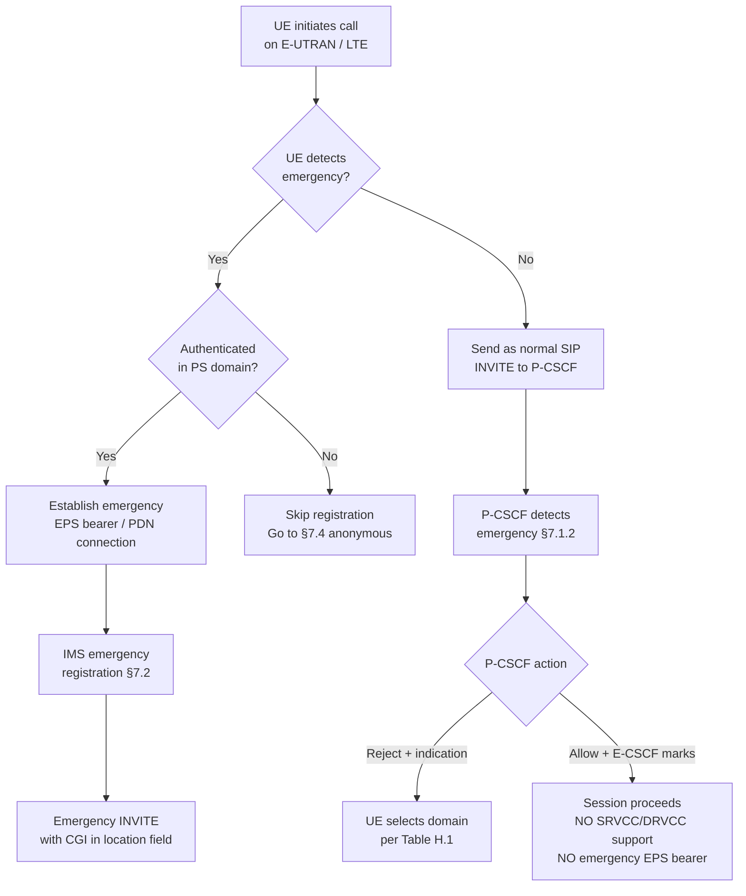
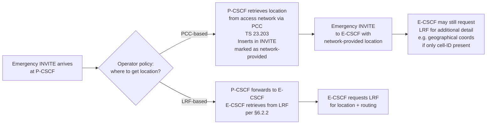
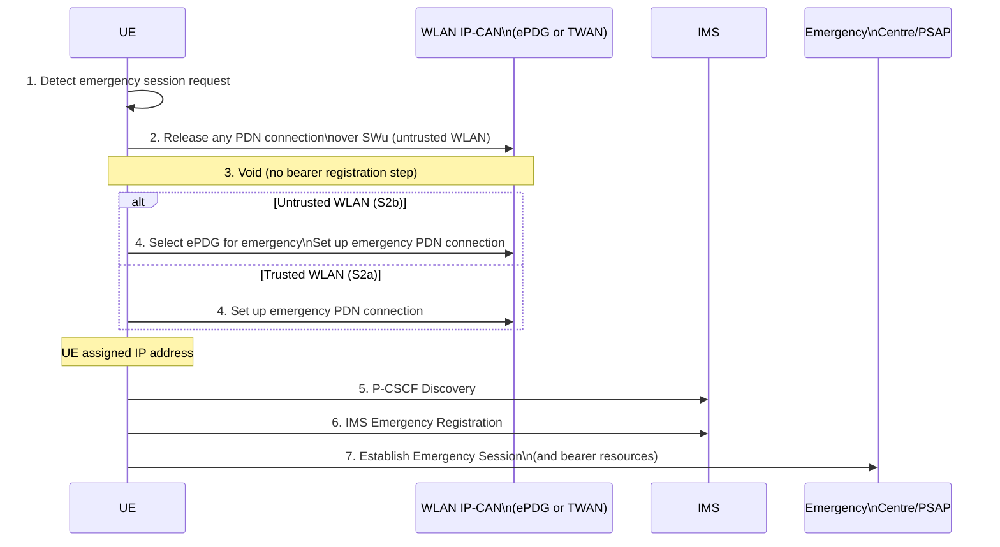
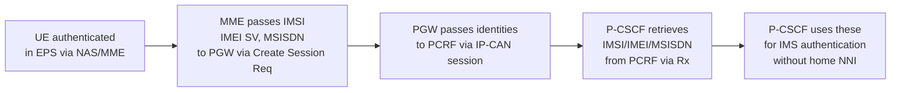
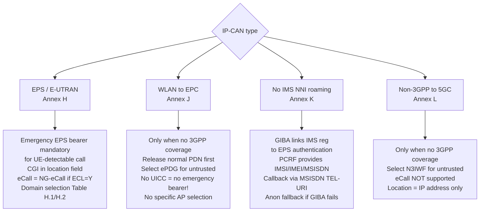

# IMS Emergency: Access-Specific Procedures

Access-type variations on the core IMS emergency procedures ([IMS Emergency Session](IMS-emergency-session.md)). Covers: IP-CAN capability matrix, E-UTRAN/LTE specifics (Annex H — the primary 4G annex), WLAN-to-EPC (Annex J), roaming without IMS-level interfaces (Annex K / GIBA), and non-3GPP-to-5GC (Annex L). Source: 3GPP TS 23.167 Annexes E, H, J, K, L.

---

## Annex E — IP-CAN Emergency Support Matrix (informative)

| IP-CAN | Normal Access | Emergency Support | Insufficient-Credential UE |
|---|---|---|---|
| GPRS (UTRAN) | ✓ | ✓ | ✓ |
| Fixed Broadband | ✓ | ✓ | ✓ |
| cdma2000 HRPD/PDS | ✓ | ✓ | ✓ |
| cdma2000 HRPD/EPC | ✓ | ✓ | ✓ |
| **EPS (UTRAN + E-UTRAN)** | **✓** | **✓** | **✓** |
| WLAN access to EPS | ✓ _(NOTE 1)_ | ✓ | **—** |
| 5GS (NG-RAN) | ✓ | ✓ | ✓ |
| Non-3GPP access to 5GC | ✓ _(NOTE 1)_ | ✓ | **—** |

> **NOTE 1**: For WLAN-to-EPS and non-3GPP-to-5GC, "normal access" only applies to non-UE-detectable emergency sessions served by the IMS network without the IP-CAN being informed.
>
> **Key constraint**: WLAN-to-EPS and non-3GPP-to-5GC do **not** support UEs with insufficient security credentials (no UICC / cannot authenticate). A UE without a SIM/USIM cannot obtain an emergency bearer over WLAN or non-3GPP access — it must use 3GPP cellular access.

---

## Annex H — E-UTRAN / UTRAN / NG-RAN (normative)

### H.1 General Constraints

- Emergency numbers beyond TS 22.101 are provided to UE via mobility management (TS 24.301 for E-UTRAN, TS 24.008 for UTRAN, TS 24.501 for NG-RAN)
- **eCall is only supported for PLMNs** — not for SNPNs (Standalone Non-Public Networks); eCall Only Mode UEs can receive PSAP callbacks for a limited duration
- P-CSCF shall reject any non-emergency IMS registration received via an **emergency PDN connection or emergency PDU session**

### H.2 UE Behaviour (E-UTRAN / LTE)

For **UE-detectable** emergency (§7.1.1 path):
- UE **must** establish an **emergency EPS bearer** (emergency PDN connection) AND perform IMS emergency registration before initiating the session
- Bearer resource for EPS = EPS Bearer; for 5GS = QoS Flow; for GPRS = PDP context

For **non-UE-detectable** emergency (§7.1.2 path):
- UE shall **not** establish an emergency PDN connection (it doesn't know it's an emergency yet)
- Upon P-CSCF rejection with "this is emergency", UE selects domain per H.5



Additional UE requirements for E-UTRAN:
- Include **CGI (Cell Global Identification)** in IMS emergency request (best available location)
- Use **IMEI** as equipment identifier if required
- Use media codec per TS 26.114
- Perform eCall over IMS **only** when "eCall supported" indication received (from TS 23.401 broadcast indicators)
- If "eCall supported" not received and no CS access available → establish **regular IMS emergency call** (not NG-eCall)

For E-UTRA cells connected to **both EPC and 5GC**:
- If only one core network indicates EMS=Y → register to that one
- If both indicate EMS=Y → either EPC or 5GC per UE implementation
- UE in 5GS shall not initiate IMS emergency over non-3GPP access unless 3GPP access unavailable

### H.3 High-Level Procedures for E-UTRAN

For non-UE-detectable sessions: two network options upon receiving the INVITE at P-CSCF:

| Option | P-CSCF action | Consequences |
|---|---|---|
| **Reject** | Send indication "this is emergency session" | UE selects domain per H.5; UE must re-attempt properly |
| **Allow + mark** | Insert emergency indication, forward to E-CSCF | E-CSCF informs UE; session uses NO emergency PDN connection and will NOT have SRVCC or DRVCC support |

For **anonymous sessions without registration** (§7.4): P-CSCF retrieves additional subscriber identifier(s) from IP-CAN via **PCC** (TS 23.203) when PS domain with E-UTRAN access is used.

### H.4 Location Handling for E-UTRAN

Two operator-policy-driven approaches:



> **Alignment requirement**: Operator policies in P-CSCF and E-CSCF must be aligned. If P-CSCF already included network-provided location, E-CSCF should not attempt another LRF query for the same location type — but may request additional/different information (e.g., geographical coordinates if only Location Identifier was in request).

Location solutions for E-UTRAN: TS 23.271 (control plane), SUPL 2.0 / OMA TS ULP (user plane).

### H.5 Domain Priority and Selection Table (Table H.1)

For **voice-capable emergency calls** (non-eCall), based on UE attachment state and network support indicators. **Not applicable for NG-eCall** (see H.6).

| Row | CS Att. | PS Att. | VoIMS | EMS | First EMC Attempt | Second EMC Attempt |
|---|---|---|---|---|---|---|
| **A** | N | Y | Y | Y | **PS** (IMS) | CS if available |
| **B** | N | Y | N | Y | PS or CS (if voice) | PS if first CS, CS if first PS |
| **C** | N | Y | Y or N | N | PS if ESFB=Y; else CS/PS on other RAT | CS if first PS, PS if first CS |
| **D** | Y | N | Y or N | Y or N | CS if voice; PS if non-voice + EMS=Y | PS if avail + EMS=Y |
| **E** | Y | Y | Y | Y | Same domain as non-EMC (NOTE 2) | Swap domain |
| **F** | Y | Y | Y or N | N | PS if ESFB=Y; else other 3GPP RAT or CS | CS if first PS; PS on other RAT if first CS |
| **G** | Y | Y | Y | Y | CS if voice; PS if non-voice | PS |

**Column definitions:**
- **VoIMS**: Voice over IMS over PS sessions supported (per TS 23.401/23.060/23.502 indication)
- **EMS**: IMS Emergency Services supported (per TS 23.401/23.060/23.501 Emergency Service Support indicator)
- **ESFB**: Emergency Services Fallback for 5GS (per TS 23.501/23.502)
- **NOTE 2**: Using same domain as non-EMC is restricted to UTRAN/E-UTRAN/NG-RAN access (explicitly excludes WLAN)
- **NOTE 3** (dual registration, both EPC and 5GC): UE uses whichever core network indicates EMS=Y; if both EMS=Y → either per UE implementation; UE shall not use emergency services fallback and ignore ESFB when attached to both

**Implementation options (NOTE 7/8):**
- NOTE 7: If first attempt uses PS and fails (non-IMS reason), second attempt may use PS on different 3GPP RAT; third attempt can then use CS
- NOTE 8: If first P-CSCF is unavailable, alternative P-CSCFs may be tried per TS 23.228 §E.1.1.1 and TS 23.502 §4.3.2.2.1 before CS attempt

### H.6 eCall over IMS Domain Selection (Table H.2)

For UE attempting **NG-eCall** (eCall over IMS) on E-UTRAN or NG-RAN:

| Row | PS Avail. | VoIMS | EMS | ECL | First eCall Attempt | Second eCall Attempt |
|---|---|---|---|---|---|---|
| **A** | Y | Y | Y | Y | **PS** (NG-eCall over IMS) | PS on another RAT (EMS+ECL=Y) or CS |
| **B** | Y | Y | Y | N | CS if available | PS (establishes IMS emergency session, not NG-eCall) |
| **C** | Y | Y or N | N | N | CS if available | PS another RAT (EMS=Y or unknown) |
| **D** | Y | N | Y | Y | PS or CS if available | CS if first=PS; PS if first=CS |
| **E** | Y | N | Y | N | CS if available | PS (IMS emergency session) |
| **F** | N | — | — | — | CS if available | — |

**Column definitions:**
- **ECL**: eCall over IMS support indicator (TS 23.401/TS 23.501 eCall support indicator)
- NOTE: If E-UTRAN and NG-RAN cells have different ECL/PS settings, UE uses whichever cell is indicated per TS 23.401/TS 23.501; if multiple cells, UE may select any cell

> **Key pattern**: If ECL=N (cell/network doesn't support NG-eCall), UE first tries CS (traditional eCall via GSM/UMTS), then falls back to PS IMS emergency session (without MSD). If ECL=Y, UE goes directly to PS NG-eCall over IMS.

---

## Annex J — WLAN Access to EPC (normative)

### J.1 Applicability

- Applies to both **trusted WLAN (S2a)** and **untrusted WLAN (S2b)** to EPC
- UE shall use WLAN emergency **only when 3GPP access for emergency call is not possible or available** (no 3GPP coverage)
- Detailed WLAN-to-EPC procedures: TS 23.402

### J.2 Emergency Number Detection over WLAN

The UE uses a combination of sources:

| Source | How obtained | Notes |
|---|---|---|
| Stored from 3GPP mobility management | Received during LTE/UTRAN attach via TS 24.301/24.008 | Primary source |
| ANQP from WLAN AP | IEEE 802.11 ANQP query after authentication with trusted WLAN | Only for trusted access |
| DNS query | If DNS is in same country and is internal to 3GPP network; DNS address acquired via ePDG | Only when ePDG known |
| IKEv2 from ePDG | During IKEv2 setup for untrusted access | |

> Emergency numbers list must be **deleted at country change** or on successful registration with a different PLMN.

### J.3 Emergency Session Flow (WLAN to EPC)



**Key WLAN constraints:**
- P-CSCF rejects any **non-emergency IMS registration** received via an emergency PDN connection
- No specific WLAN AP selection is made to support emergency services
- UE shall **not** establish emergency PDN over WLAN if it initiated a normal session and is subsequently informed the session is being accepted as emergency (prevents non-emergency traffic hijacking emergency bearer)
- If UE is not in home country → Home IMS network local policies determine whether to handle the emergency session

### J.4 Location Handling (WLAN to EPC)

- UE provides location information per TS 23.228
- P-CSCF may retrieve network-provided location from access network via PCC (TS 23.203), if operator requires it

---

## Annex K — Roaming without IMS-Level Roaming Interfaces (normative)

### K.1 Problem Statement

Standard IMS roaming requires a **direct NNI (Network-to-Network Interface)** between the P-CSCF in the VPLMN and the S-CSCF in the HPLMN. This annex handles cases where:
- No IMS NNI exists between VPLMN and HPLMN
- User is an SNPN subscriber
- User has no IMS credentials

Applies only to **UTRAN, E-UTRAN, NG-RAN** access networks.

### K.2 GIBA Authentication

**GIBA (GPRS-IMS Bundled Authentication)** links IMS registration to the EPS/5GS authentication already performed. The IMS authentication "rides" on the existing PS authentication:



**Entity requirements for GIBA:**

| Entity | Requirement |
|---|---|
| P-CSCF | Retrieve IMSI, IMEI, MSISDN from PCRF/PCF via Rx; support GIBA over Gm; verify IMSI/IMEI provided in SIP REGISTER |
| PCRF/PCF | Provide IMSI, IMEISV, MSISDN over Rx to P-CSCF |
| PGW/SMF/UPF | Prevent IP address spoofing on emergency PDN connections when GIBA is used |
| HSS | EPS subscription must contain exactly one MSISDN (same as in IMS profile) |

### K.3 Emergency Registration and Session (16-step flow)

```mermaid
sequenceDiagram
    participant UE
    participant MME as MME/SGSN\n[AMF]
    participant PGW as SGW/PGW\n[SMF]
    participant PCRF as PCRF\n[PCF]
    participant PCSCF as P-CSCF
    participant HSS as HSS\n[UDM]

    UE->>MME: 1. Attach Req [Em] or PDN Connectivity Req [Em]
    MME->>MME: 2. Retrieve IMSI/SUPI, IMEI/PEI, MSISDN/GPSI
    MME->>PGW: 3. Create Session Req [IMSI, IMEI(SV), MSISDN]
    PGW->>PCRF: 4. IP-CAN session establishment\n[IMSI, IMEI(SV), MSISDN → to P-CSCF]
    Note over UE,PCSCF: 5. Attach/PDN Connectivity completes
    UE->>PCSCF: 6. SIP REGISTER [UserID-1 = IMPI]
    PCSCF->>PCRF: 7a. Retrieve IMSI, IMEI(SV), MSISDN via Rx
    Note over PCSCF: P-CSCF detects no IMS NNI\nto home HPLMN
    alt Network supports GIBA
        PCSCF-->>UE: 8. 420 [unsupported-header; sec-agree]
        UE->>PCSCF: 9. SIP REGISTER [UserID-2, IMEI; no Auth header]
        PCSCF-->>UE: 10. 200 OK [TEL-URI from MSISDN]
        UE->>PCSCF: 11. SIP INVITE [UserID-3 = MSISDN as TEL-URI]
        PCSCF->>PCSCF: 12. Verify UserID-3 matches TEL-URI
        PCSCF->>PCSCF: Forward to PSAP with CallBackPar [TEL-URI]
    else Network rejects, UE tries anonymous
        PCSCF-->>UE: 8. 403 Forbidden [may indicate anon support]
        UE->>PCSCF: 13. SIP INVITE [anonymous user]
        PCSCF->>PCRF: 14. Retrieve EPS-level identities
        PCSCF->>PCSCF: 15. Forward to PSAP [UserID-4 from EPS identity,\nCallBackPar from MSISDN]
    else UE falls back to CS
        Note over UE: 16. Emergency call in CS domain
    end
```

### K.4 Non-UE-Detectable Emergency (Annex K context)

- Recommend that local emergency numbers be provided to UE per TS 24.501/24.301/24.008 or Annex J.2 — reduces incidence of non-detectable emergencies in PLMNs where only a subset of local numbers is downloadable
- P-CSCF may retrieve VPLMN-ID/SNPN-ID and query a local database of all emergency numbers for that PLMN to detect non-UE-detectable calls; the database interface is not standardised by 3GPP

---

## Annex L — Non-3GPP Access to 5GC (normative)

### L.1 Applicability

- Applies when IP-CAN = trusted or untrusted non-3GPP access to 5GC (e.g., WLAN via N3IWF or TNGF)
- UE issues emergency session over non-3GPP to 5GC **only when 3GPP access is not possible/available**
- Detailed procedures: TS 23.502

### L.2 Key Differences vs. WLAN-to-EPC (Annex J)

| Aspect | WLAN to EPC (Annex J) | Non-3GPP to 5GC (Annex L) |
|---|---|---|
| Bearer resource | Emergency PDN connection | Emergency PDU session |
| eCall support | Supported | **NOT supported via untrusted access** |
| P-CSCF rejects non-emergency reg? | Yes | Yes |
| UE location capability (untrusted) | UE-provided + PCC-based | Only UE IP address seen by N3IWF (significant constraint) |
| Home network policy intervention | May determine whether to handle | May determine whether to handle |

### L.3 Emergency Session Flow (non-3GPP to 5GC)

Same 7-step structure as Annex J but with 5GC adaptation:
1. Detect emergency session request
2. Release any PDU session over non-3GPP access (if congested)
3. (Void — no "bearer registration" step)
4. For untrusted: select N3IWF → set up emergency PDU session; for trusted: set up emergency PDU session
5–7. P-CSCF Discovery → IMS Registration → Emergency Session (same as §7.1.1 steps 5–7, except eCall not supported via untrusted)

### L.4 Location Constraint

> **Critical limitation for untrusted non-3GPP to 5GC**: The only location information available is the **UE's IP address as seen by the N3IWF**. No cell-level, civic, or geographic location can be derived. This means the LRF may not be able to determine the correct PSAP and must rely on the IP address for a coarse routing estimate or use the default PSAP/LRO.

---

## Summary: Access-Specific Emergency Behaviour



---

## Cross-references

- [IMS Emergency Session](IMS-emergency-session.md) — core procedures (§7.2–§7.7)
- [IMS Emergency Architecture](../concepts/IMS-emergency-architecture.md) — overall framework and principles
- [E-CSCF](../entities/E-CSCF.md) — Emergency-CSCF entity
- [LRF](../entities/LRF.md) — Location Retrieval Function
- [S2b Attach](S2b-attach.md) — untrusted WLAN to EPC attach (TS 23.402 §7), relevant background for Annex J
- [Trusted Non-3GPP Attach](trusted-non3GPP-attach.md) — trusted WLAN to EPC (TS 23.402 §6), relevant background for Annex J
- [EPS Attach](EPS-attach.md) — standard E-UTRAN attach establishing the EPS bearer context for Annex H
- [PCRF deep-dive](../entities/PCRF-deepdive.md) — Rx interface used in Annex K GIBA for P-CSCF to retrieve IMSI/MSISDN
