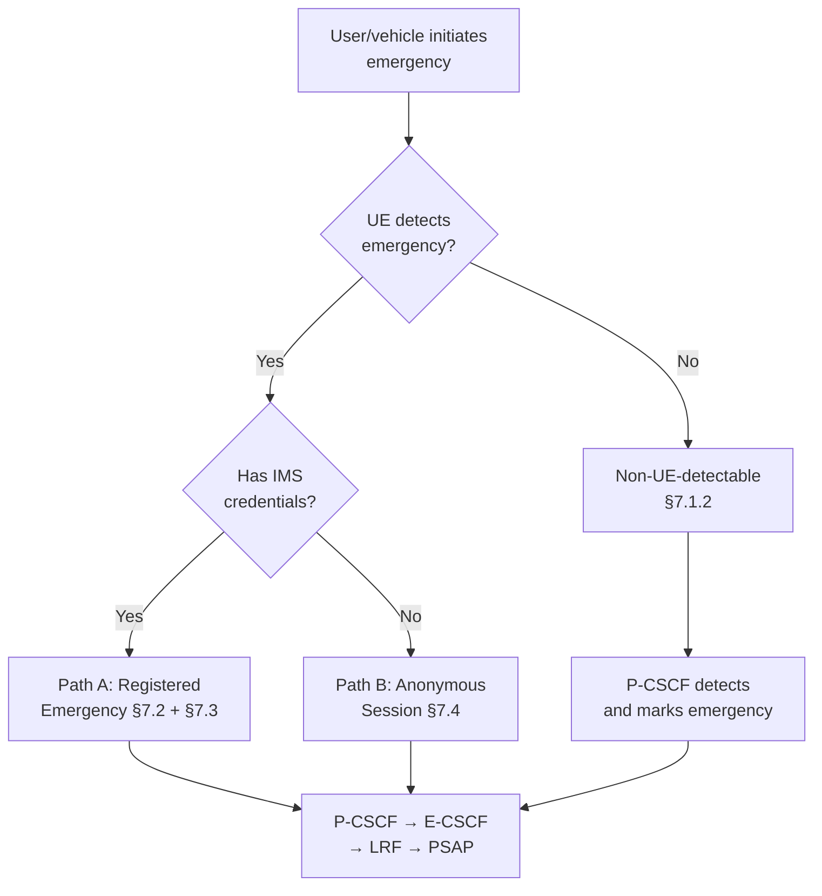
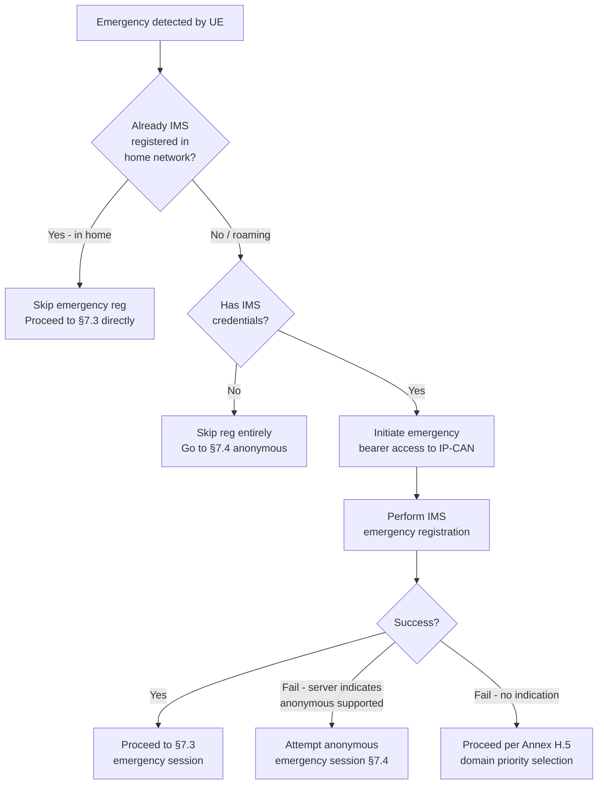
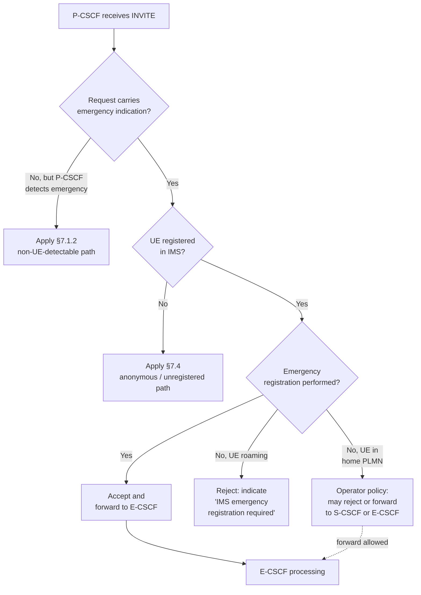
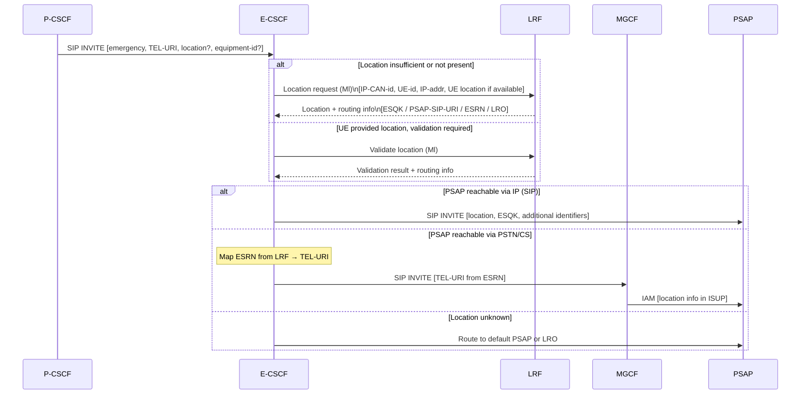
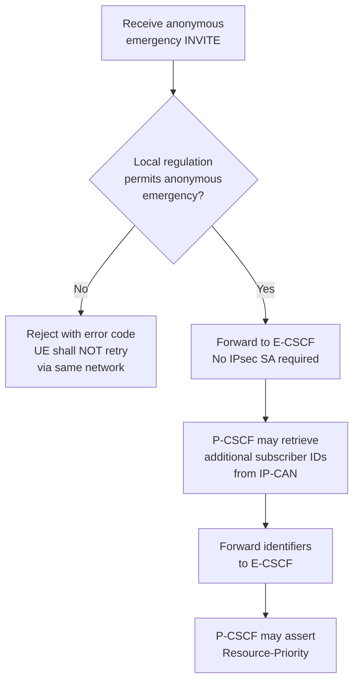
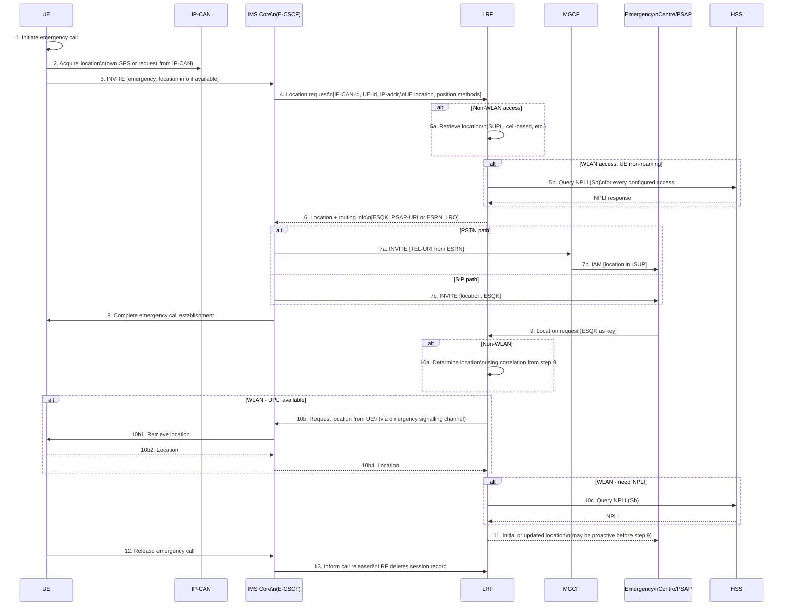
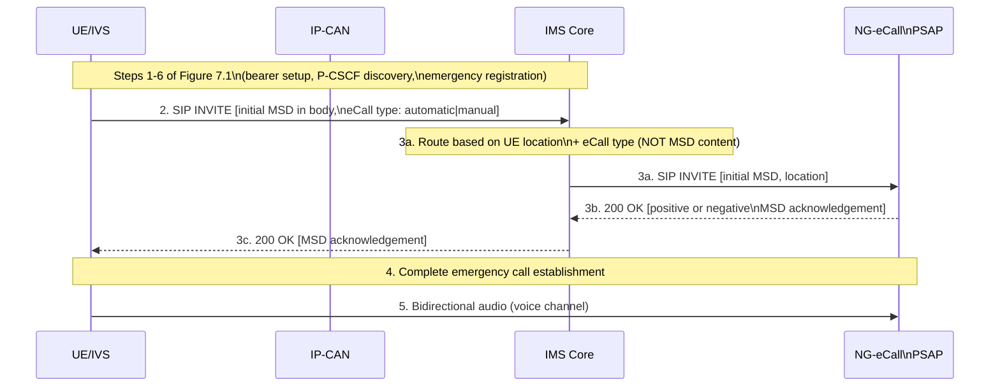
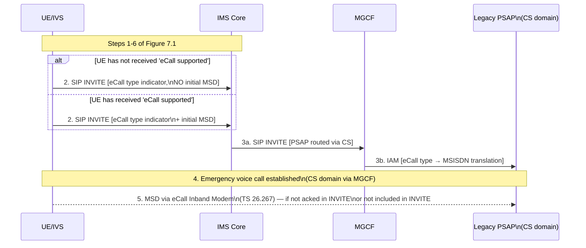
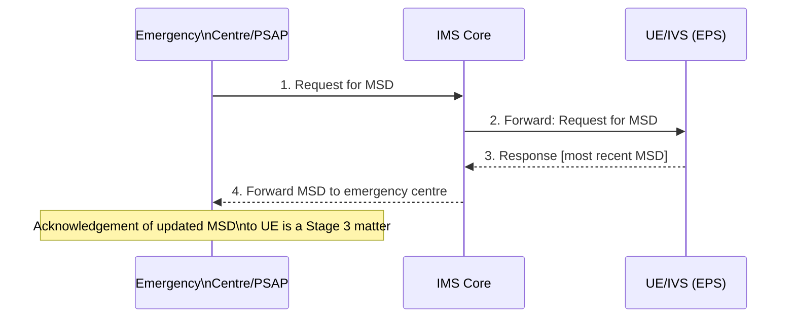

# IMS Emergency Session Procedures

Defines the full set of IMS emergency session procedures from 3GPP TS 23.167 §7: emergency registration, session establishment (three paths), PSAP interworking, location retrieval, and NG-eCall MSD transfer.

See [IMS Emergency Architecture](../concepts/IMS-emergency-architecture.md) for entity roles and reference architecture.

---

## Procedure Overview

Three mutually exclusive paths to emergency PSAP connection:

| Path | Registration | Credentials | Key clauses |
|---|---|---|---|
| **A** — UE detectable, credentialed | Performs IMS emergency registration first | Yes | §7.1.1, §7.2, §7.3 |
| **B** — UE detectable, anonymous | Skips registration | No | §7.1.1, §7.4 |
| **C** — Non-UE detectable | Normal IMS registration already present | Yes (already registered) | §7.1.2, §7.3 |

---

## §7.2 IMS Emergency Registration

Emergency registration follows normal IMS registration (TS 23.228 §5.2.2.3) with the following modifications.

### Trigger conditions

The UE initiates IMS emergency registration when **all three** conditions are met:
1. UE is **not already IMS registered**, OR is registered but **roaming outside its home network**
2. UE has **sufficient credentials** to authenticate with the IMS
3. UE is **able to detect** the emergency session request

Also triggered when UE receives an **"IMS emergency registration required"** response from the network as a result of an emergency session attempt.

### IP-CAN interaction before registration

- Before initiating IMS emergency registration, the UE shall first **initiate emergency access to the IP-CAN** (if emergency access has been defined for that IP-CAN type — e.g., establishment of an EPS emergency bearer per TS 23.401)
- This ensures the session attempt is handled in the **serving VPLMN** with priority treatment and access to appropriate network elements (e.g., a PDG/UPF or emergency-capable P-CSCF in the VPLMN)

### Anti-looping rule

If the UE had already performed emergency IP-CAN access and then receives a second "IMS emergency registration required" response, it shall attempt emergency registration using a **different VPLMN or SNPN** if available, to prevent looping.

### Registration request content

- Shall include **emergency indication** (informs home network that roaming restrictions may not apply)
- Home network should **ignore roaming restrictions** for emergency registration requests
- S-CSCF may modify the registration expiration time per local regulation or operator policy
- HSS: does not apply barring or roaming restrictions to the emergency registration IMPU (§6.2.9)

---

## §7.3 Emergency Session Establishment in Serving IMS

### UE-side requirements

- UE marks the session request with an **emergency service indication**
- For NG-eCall: additionally includes the **eCall type** (automatic or manual)
- UE follows TS 22.101 domain priority rules: attempt on **PS domain first**; if PS fails or is insufficient → fall back to CS domain
- If UE knows it lacks credentials → bypass this clause, go directly to §7.4

### P-CSCF actions on receiving emergency INVITE

Additional P-CSCF actions before forwarding to E-CSCF:
- Check TEL-URI validity (if UE provided TEL-URI in the request); if valid or known from emergency registration, include it in INVITE to E-CSCF
- Query IP-CAN for **location identifier** (cell-ID, line-ID, etc.)
- Assert **Resource-Priority** header information (operator policy)
- Identify emergency IP flows to **PCRF via Rx** so PCRF can prioritise emergency data flows over non-emergency flows in the IP-CAN (TS 23.203)
- For attestation/signing networks: may insert attestation information for asserted calling identity (STIR)

> For private network traffic: if operator policy allows, do NOT apply emergency session detection; forward as normal. Otherwise route to PSAP via E-CSCF.

### E-CSCF actions on receiving emergency INVITE

- If **PSAP/emergency centre has IP presence** in the IMS: forward INVITE directly to PSAP including any additional subscriber-related identifier(s) received from P-CSCF
- If **PSAP is PSTN/ISDN/CS domain**: E-CSCF uses TEL-URI from LRF (derived from ESRN), forwards to appropriate BGCF/MGCF; MGCF routes in GSTN; MGCF **may insert any available location info** in PSTN/ISUP signalling

> **ESRN→TEL-URI mapping**: If an ESRN is received from the LRF, the E-CSCF maps it to a TEL-URI before forwarding the request to MGCF. The TEL-URI has the same NANP format as used for CS emergency calls.

---

## §7.4 IMS Emergency Session without Registration (Anonymous)

Used when the UE lacks IMS credentials and cannot perform emergency registration.

### Session request requirements

- UE includes **both** "anonymous user" AND "emergency service" indications in the INVITE to P-CSCF
- No security association between UE and P-CSCF exists

### P-CSCF handling

### E-CSCF handling

- Follows **same rules as §7.3** (location retrieval, PSAP routing, PSTN/SIP paths)
- Where required by local regulation: E-CSCF **derives a non-dialable callback number** to include as the UE's identity in the session establishment and location/routing requests
- No subscriber data from HSS is available; UE is identified only by equipment ID and/or callback number

---

## §7.5 PSAP Interworking Variants

| PSAP connectivity type | Procedure |
|---|---|
| **§7.5.1 GSTN/PSTN** | Uses MSISDN (E.164) for callback; no special IMS procedure; emergency call and callback per TS 22.101 |
| **§7.5.2 IP/SIP** | Uses any public user identity received from UE for callback; no special IMS procedure |
| **§7.5.3 Via ECS** | Routing determination done by ECS (not IMS core); IMS core does not need to obtain location; see Annex D for NENA I2 details |
| **§7.5.4 NG-eCall capable PSAP** | PSAP is capable of receiving and verifying initial MSD within the SIP INVITE body |

---

## §7.6 Location Information Retrieval (13-step procedure)

### Step-by-step notes

| Step | Key detail |
|---|---|
| 2 | UE uses GPS, IP-CAN query, or SUPL (OMA AD SUPL, TS ULP) to acquire location |
| 3 | INVITE includes location if known; may include position method hints |
| 4 | IMS core sends location request to LRF when: (a) location not in INVITE, (b) validation needed, (c) location identifier must be mapped to geographical location, (d) ESQK or routing info required |
| 5a | LRF uses SUPL or similar per access type; WLAN-specific notes: LRF may query BSSID-based database (ATIS-0700028, North America only) |
| 5b | LRF queries HSS via Sh for NPLI (non-roaming WLAN UEs) for every access it is configured for; if NPLI unavailable, invokes procedure 5a |
| 6 | LRF returns: ESQK (North America), PSAP SIP-URI/TEL-URI, ESRN (for PSTN routing), location number (EU), LRO (fallback) |
| 9 | PSAP queries LRF using ESQK as key (Le/E2 interface); may also request updated location proactively before receiving step 9 |
| 10b | For WLAN: LRF requests location from UE via IMS emergency signalling channel (UE User Plane Location Information); if UPLI unavailable at step 9 receipt, UPLI may be provided after call establishment (step 10b3) |
| 11 | LRF may send **initial location proactively** before PSAP query (step 9) to reduce PSAP wait time |
| 13 | IMS core MUST inform LRF of call release so LRF can release ESQK and delete session record |

---

## §7.7 NG-eCall: MSD Transfer

### Minimum Set of Data (MSD)

The MSD is a structured data record transmitted from the vehicle (IVS/UE) to the PSAP during an eCall. It contains: vehicle identification (VIN), crash location (GPS), time, passenger count, propulsion type, crash direction, etc. (defined in TS 26.267, based on EU Regulation 2015/758).

### §7.7.1 MSD Transfer — NG-eCall capable PSAP

Occurs when the UE detects that the IP-CAN supports NG-eCall.

> **Routing note**: IMS core routes based on **UE location** and **eCall type indicator** (automatic/manual), not on MSD content. However, PSAP may use location data contained within the MSD as supplementary input.

### §7.7.2 MSD Transfer — Non-NG-eCall PSAP (inband fallback)

Occurs when IP-CAN supports NG-eCall but PSAP does not, OR when PS access is available but UE has not received "eCall supported" indication.

### §7.7.3 Updated MSD Transfer

After the initial emergency session is established, the PSAP may request a more recent MSD.

---

## Annex C: Fixed Broadband Access Emergency (Normative)

### Additional P-CSCF interface

For fixed broadband access (IP-CAN with TISPAN NASS/CLF per ETSI ES 282 004):
- P-CSCF may have an **Mq interface to LRF** (LRF may contain a CLF)
- This allows P-CSCF to query the LRF for location when UE cannot self-report

### Location behaviour on fixed broadband

| UE capability | Location handling |
|---|---|
| UE knows own location | Insert in SIP INVITE (geographical coordinates or street address) |
| UE cannot determine own location | Request from access network (e.g., access point location) |
| Access network knows AP location | UE requests; AP responds with network-based location |
| UE completely unable to obtain location | INVITE indicates location is unknown |
| P-CSCF needs location / validation | Requests from LRF per §7.6 |
| S-CSCF uses reference location from HSS | Line identification (= physical line location) inserted in INVITE; applies to non-nomadic fixed services |

### Location retrieval by UE from access network (fixed broadband)

- DHCP option (IETF RFC 3825): coordinate-based geographic location
- DHCP option (IETF RFC 4676): civic address (city, street)
- These DHCP options are **not applicable** for 3GPP RAT IP-CANs (cellular only)

---

## Domain Priority and Selection (Emergency)

When the UE attempts to make an emergency call (TS 22.101 §10.4):

1. **Primary attempt**: PS domain (IMS emergency session per this specification)
2. **CS domain fallback**: if UE is capable, not disallowed by domain selection rules, and PS attempt:
   - Fails and the UE is capable of CS emergency call, OR
   - Is insufficient for the service type (e.g., voice only on PS fails, UE can do CS voice)
3. If initial attempt is in **PS domain and fails** → attempt CS domain (if capable and appropriate for service)
4. If initial attempt is in **CS domain and fails** → attempt PS domain (if appropriate service, e.g., voice)

> **Note (Annex H.5 / pre-Rel-14 UEs)**: Pre-Rel-14 UEs may not recognise the "IMS emergency registration required" indication in a registration failure response, and may either attempt anonymous IMS emergency session or CS fallback. See Annex H for E-UTRAN-specific domain priority.

---

## Cross-references

- [IMS Emergency Architecture](../concepts/IMS-emergency-architecture.md) — entity roles, architectural principles
- [E-CSCF](../entities/E-CSCF.md) — Emergency-CSCF entity: PSAP routing, LRF queries
- [LRF](../entities/LRF.md) — Location Retrieval Function: ESQK, ESRN, location retrieval
- [IMS Registration](IMS-registration.md) — baseline IMS registration procedure
- [VoLTE MO Call](VoLTE-MO-call.md) — normal IMS session establishment
- [IMS Emergency Location](IMS-emergency-location.md) _(Annex H/J/K/L — chunk 5a-3)_
- [S-CSCF deep-dive](../entities/S-CSCF-deepdive.md) — S-CSCF emergency registration state handling
- [P-CSCF deep-dive](../entities/P-CSCF-deepdive.md) — P-CSCF emergency detection and Rx signalling
