# IMS Offline Charging Flows

IMS offline charging uses the **Rf** Diameter interface (ACR/ACA) from each IMS network element (CTF) to the **CDF**. This page documents the charging message flows for §5.2 of TS 32.260, covering session establishment, mid-session, session release, PSTN-interworking, multi-party, and AS-related scenarios.

See [IMS charging architecture](../concepts/IMS-charging-architecture.md) for ICID, IOI, SDP handling, and charging method selection principles.

---

## §5.2.1 Basic Principles

### §5.2.1.1 Trigger Table — Rf Interface (non-MRFC, non-AS nodes)

**Table 5.2.1.1-1** defines the SIP/ISUP triggers for CDR generation on all IMS nodes (P-CSCF, I-CSCF, S-CSCF, IBCF, MGCF, BGCF, E-CSCF, TRF, ATCF, IBCF) via Rf:

| CDR Type | Triggering SIP method / ISUP message |
|---|---|
| **CDR[Start]** | SIP 2xx acknowledging an initial SIP INVITE |
| | SIP ACK acknowledging an initial SIP INVITE |
| | ISUP: ANM (Answer Message — for MGCF) |
| **CDR[Interim]** | SIP 2xx acknowledging a RE-INVITE or SIP UPDATE (media change, terminating identity) |
| | SIP ACK acknowledging an initial RE-INVITE or SIP UPDATE |
| | SIP 1xx provisional response, mid-dialog requests/responses, SIP INFO embedding RTTI XML body |
| | ISUP charging ASE (for MGCF) |
| | SIP 4/5/6xx on unsuccessful RE-INVITE or SIP UPDATE |
| **CDR[Stop]** | SIP BYE message (normal and abnormal session termination) |
| | SIP 2xx acknowledging a SIP BYE (only when last user location required for legal purpose) |
| | SIP Final Response 4/5/6xx (unsuccessful session setup) |
| | ISUP: REL (for MGCF) |
| | Aborting a SIP session setup (internal trigger or SIP CANCEL) |
| **CDR[Event]** | SIP 2xx acknowledging initial SIP INVITE (**BGCF and I-CSCF only**) |
| | SIP Final/Redirection Response 3xx |
| | SIP NOTIFY, MESSAGE, REGISTER, SUBSCRIBE, PUBLISH, REFER |
| | SIP Final Response 4/5/6xx (unsuccessful session setup) |
| | SIP Final Response 4/5/6xx (unsuccessful session-unrelated procedure) |
| | Deregistration |
| | SIP CANCEL (aborting session setup) |

**Key design rule:** The I-CSCF and BGCF **never** use session-based charging (Start/Stop). They always produce a single CDR[Event] per INVITE transaction. This reflects that these nodes are involved only in the setup leg of a session, not its full duration.

### §5.2.1.2 Trigger Table — MRFC

**Table 5.2.1.1-2** — MRFC (conferencing resource) uses a different trigger set because it manages an evolving multi-party session:

| CDR Type | Triggering SIP method |
|---|---|
| **CDR[Start]** | SIP 2xx ack INVITE initiating multimedia ad hoc conference (when no session exists) |
| **CDR[Interim]** | SIP ACK ack INVITE to connect a UE to the conferencing session |
| | SIP RE-INVITE/UPDATE (media change in conference) |
| | SIP BYE when a participant **leaves** (NOTE 1: does not terminate conference) |
| | Expiration of Interim Interval |
| **CDR[Stop]** | SIP BYE that causes conference to **terminate** (NOTE 2) |
| | SIP CANCEL |
| | SIP Final Response 4/5/6xx (termination of ongoing session) |

### §5.2.1.3 Converged Charging (Nchf) Trigger Overview

For converged charging (CHF via Nchf), all trigger conditions have:
- **Offline only charging default category:** Immediate (no deferred/batched reporting)
- **CHF allowed to change category / enable/disable:** Not Applicable for IMS nodes

Converged messages per Table 5.2.1.2-1 map to:
- SCUR CDR[Initial] ← SIP 2xx/ACK/ANM (session start)
- SCUR CDR[Update] ← RE-INVITE/UPDATE/1xx/RTTI (mid-session)
- SCUR CDR[Termination] ← BYE/CANCEL/REL/4xx (session end)
- PEC CDR[Event] ← NOTIFY/MESSAGE/REGISTER/SUBSCRIBE/REFER/PUBLISH/3xx/unsuccessful-unrelated

---

## §5.2.2.1 Successful Case Message Flows

All flows shown in LBO roaming context (P-CSCF + visited CDF in VPLMN; S-CSCF + home CDF in HPLMN). Same flows apply for home-routed traffic (P-CSCF in HPLMN uses HPLMN CDF).

---

### §5.2.2.1.1 Session Establishment — Mobile Origination (MO)

Three scenarios based on when SDP negotiation completes:

#### Scenario 1: SDP answer in SIP 200 OK (standard case)

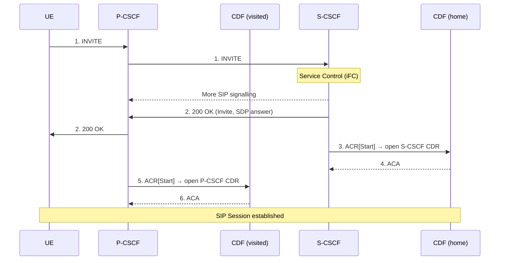

- ACR[Start] triggered at **SIP 200 OK** (which contains SDP answer)
- S-CSCF and P-CSCF each open their own CDR independently and concurrently

#### Scenario 2: SDP offer in 200 OK, SDP answer in ACK — CDR[Start] at 200 OK then CDR[Interim] at ACK

- S-CSCF: ACR[Start] at SIP 200 OK (SDP offer); then ACR[Interim] at SIP ACK (SDP answer) → CDR updated
- P-CSCF: same pattern

#### Scenario 3: SDP offer in 200 OK, SDP answer in ACK — CDR[Start] deferred to ACK

- If final response contains SDP offer only, CSCF **waits for SIP ACK** (containing SDP answer)
- ACR[Start] triggered at **SIP ACK** (SDP answer confirmed)
- This is operator-configurable per §5.1.4

---

### §5.2.2.1.2 Session Establishment — Mobile Termination (MT)

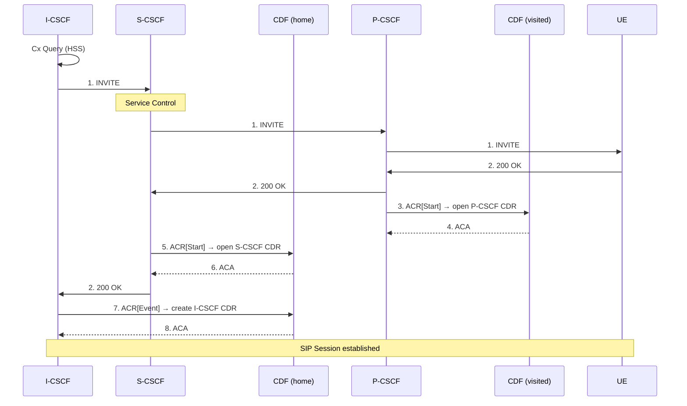

**Key MT distinction:**
- **I-CSCF**: ACR[**Event**] only (not Start/Stop) — event-based, single CDR at 200 OK
- **S-CSCF + P-CSCF**: ACR[Start] — session-based CDR opened

Three SDP timing scenarios (same as MO §5.2.2.1.1) apply to S-CSCF and P-CSCF CDR[Start] triggers.

---

### §5.2.2.1.3 Mid-Session Procedures

Triggered when UE sends SIP RE-INVITE or SIP UPDATE (media modification, hold/resume).

#### Scenario 1: SDP answer in 200 OK (immediate ACR[Interim])

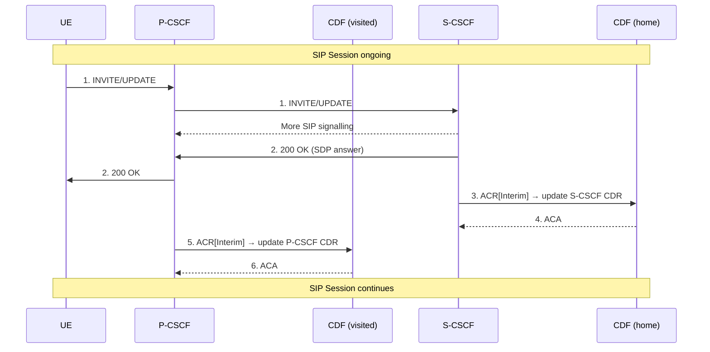

#### Scenario 2: SDP offer in 200 OK → ACR[Interim] deferred to ACK

- 200 OK (SDP offer only) → CSCF waits for ACK → ACR[Interim] at SIP ACK (SDP answer)

---

### §5.2.2.1.4 Session Release — Mobile Initiated

#### Scenario 1: SIP BYE triggers ACR[Stop]

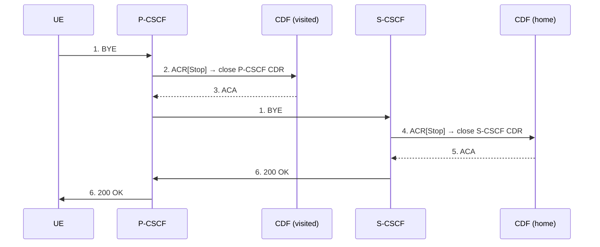

#### Scenario 2: SIP 200 OK triggers ACR[Stop] (when Rx session termination or user location needed)

- BYE received → CSCF delays ACR[Stop]
- 200 OK received (with Rx session termination or final user location) → ACR[Stop] triggered at 200 OK
- **Important:** The charging information timestamp in the CDR **must reflect the BYE reception time**, not the 200 OK time (TS 29.214 Annex A.10.5)

---

### §5.2.2.1.5 Session-Unrelated Procedures

Applies to: SUBSCRIBE, NOTIFY, MESSAGE, PUBLISH, REFER and other non-session SIP methods.

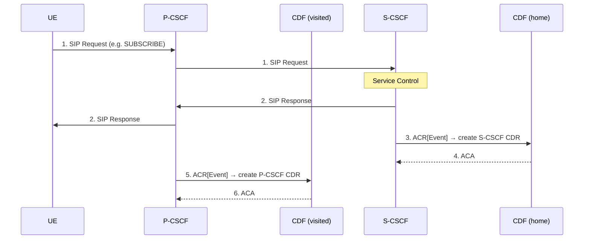

ACR[Event] is sent **after completion of the SIP transaction** (after SIP response received). A single CDR is created per transaction.

---

### §5.2.2.1.6 Session Establishment — PSTN Initiated

MGCF acts as gateway; charging triggered by ISUP ANM (answer):

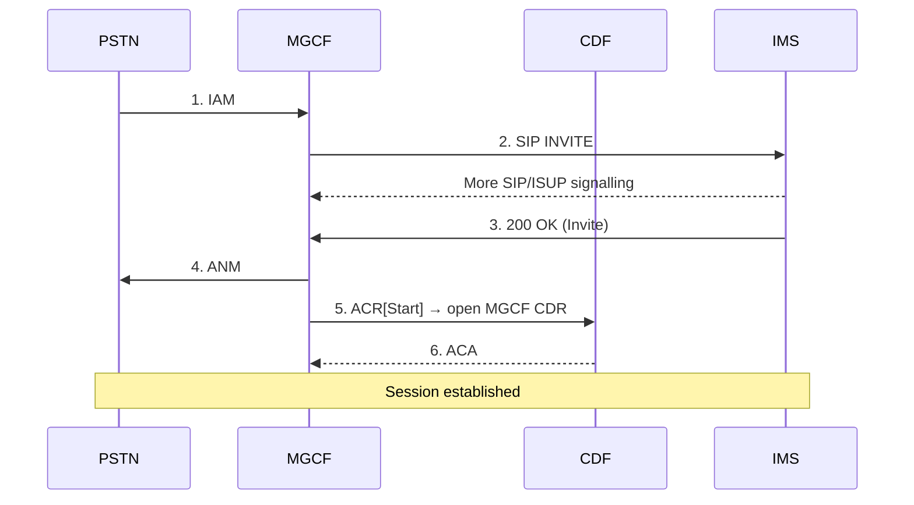

- ACR[Start] triggered at **ISUP ANM** (answer from IMS side reaches PSTN)

---

### §5.2.2.1.7 Session Establishment — IMS Initiated (PSTN breakout)

BGCF routes session out to PSTN via MGCF:

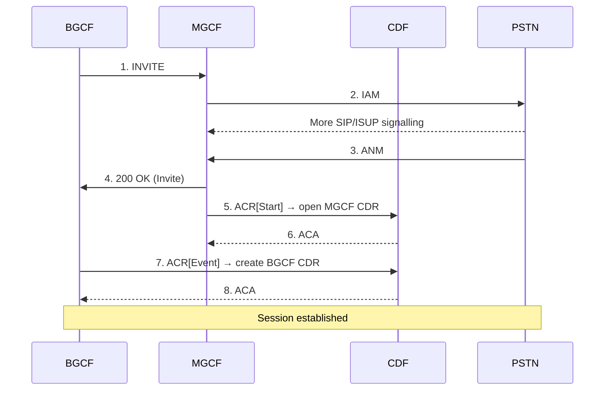

- MGCF: ACR[Start] at ANM (ISUP answer)
- BGCF: ACR[**Event**] at SIP 200 OK (event-only; BGCF does not generate session-based CDRs)

---

### §5.2.2.1.8 Session Release — PSTN Initiated

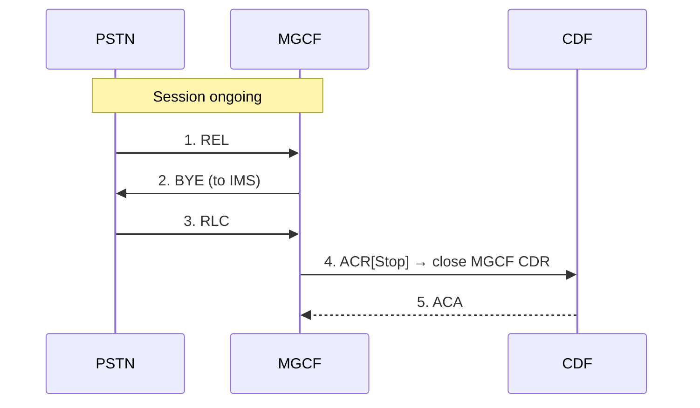

- ACR[Stop] triggered at **ISUP REL/RLC** receipt

---

### §5.2.2.1.9 Session Release — IMS Initiated

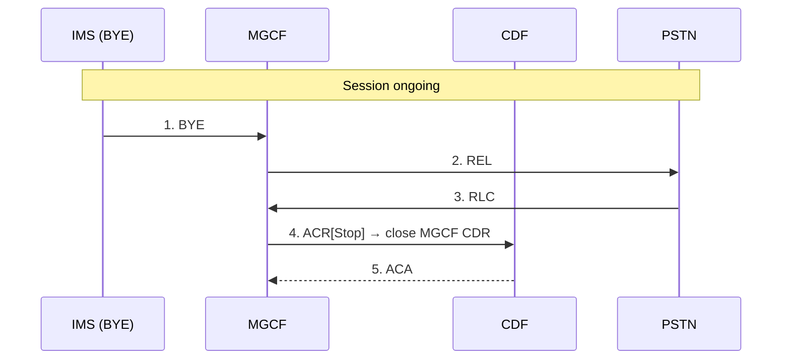

- ACR[Stop] triggered at **SIP BYE** reception (before ISUP REL completes)

---

### §5.2.2.1.10 Multi-Party Call (MRFC Conference)

An AS (acting as B2BUA) controls an ad hoc conference via MRFC. The S-CSCF is in the signalling path. MRFC assigns a **conference-ID** used across all subsequent INVITE messages.

Key CDR behaviors:
- MRFC: ACR[Start] at first SIP 2xx (conference initiated with AS)
- MRFC: ACR[Interim] each time a UE joins (at SIP ACK acknowledging their INVITE)
- AS (OneChargingSession): same ICID reused across access leg and remote leg

MRFC CDR fields populated across the 28-step flow:
| Field | When set | Content |
|---|---|---|
| Service ID | CDR open | Conference-ID |
| Calling Party Address | CDR open | UE-1 address |
| Service Request Time Stamp | CDR open | Time of MRFC CDR creation |
| Application Provided Called Parties | CDR[Interim] per UE | UE-2, UE-3 as they join |
| Service Delivery Start Time Stamp | CDR[Interim] at UE-1 join (step 25-26) | When UE-1 is connected to conference |

**OneChargingSession option in SCC AS:** When `OneChargingSession` is used, the SCC AS preserves the ICID across both the access leg (Call-ID #1) and remote leg (Call-ID #2), generating a single AS CDR for both legs instead of two separate CDRs.

---

### §5.2.2.1.11 AS Related — AS Acting as Redirect Server (Event Charging)

Call forwarding scenario: UE-1 calls UE-2; AS returns 302 Moved Temporarily → call redirected to UE-3.

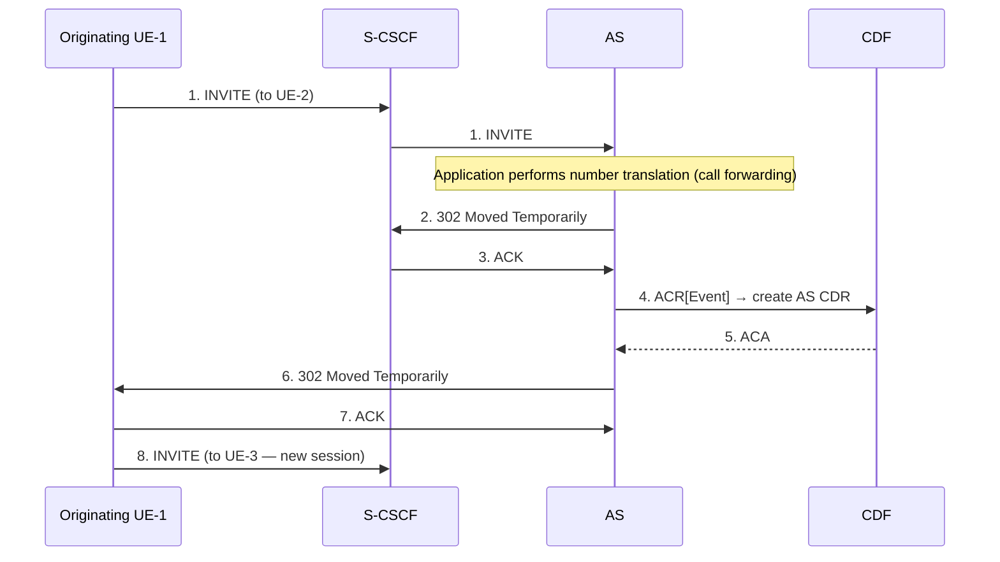

- AS uses **Event charging** (ACR[Event]) — a single CDR for the redirect service execution
- AS CDR is created after successful service execution (after 302 response)
- The redirected call (INVITE to UE-3) is a separate session with its own CDRs

---

### §5.2.2.1.12 AS Related — AS Acting as Voice Mail Server (Session Charging)

S-CSCF invokes AS (Voice Mail) via iFC; AS terminates the session as voicemail service:

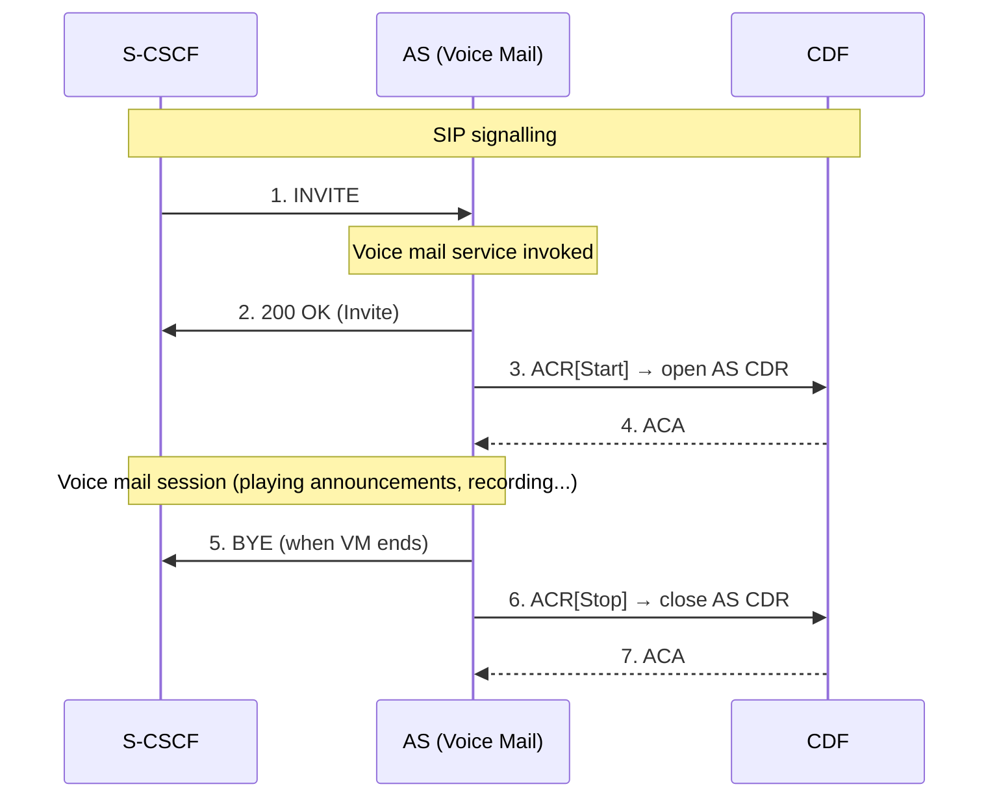

- AS uses **Session charging** (ACR[Start/Stop]) — CDR spans the voice mail session duration
- Contrast with redirect server (§5.2.2.1.11): same AS, different charging mode depending on service type

---

## Summary: CDR Type by Node and Scenario

| Node | Session CDRs (Start/Interim/Stop) | Event CDRs only |
|---|---|---|
| P-CSCF | All session scenarios | Session-unrelated methods |
| S-CSCF | All session scenarios | Session-unrelated methods |
| I-CSCF | — | Always event-only |
| BGCF | — | Always event-only |
| MGCF | All session scenarios (ISUP trigger) | — |
| MRFC | Conference sessions | — |
| SIP AS | Session services (voicemail) | Redirect/stateless services |
| IBCF, E-CSCF, TRF, ATCF | Session scenarios (context-dependent) | Session-unrelated |

---

## §5.2.2.1.13 AS Related — AS Acting as SCC AS (Service Continuity)

SCC (Service Centralisation and Continuity) AS acts as a B2BUA that anchors calls across PS and CS access legs. Each call has an **access leg** (UE-side) and a **remote leg** (far-end UE). The SCC AS opens separate CDRs per leg — unless **OneChargingSession** is configured, in which case a single CDR covers both legs.

### §5.2.2.1.13.1 UE Originating Call (PS Only or CS Only)

- SCC session initiated → INVITE (Call-ID #1) → S-CSCF → SCC AS (iFC)
- SCC AS anchors and generates **Invite (Call-ID #2)** toward remote end
- On 200 OK: S-CSCF opens S-CSCF CDR for remote leg (Call-ID #2) → ACR[Start]
- SCC AS opens **AS CDR for remote leg** (Call-ID #2) → ACR[Start]
- SCC AS opens **AS CDR for access leg** (Call-ID #1) → ACR[Start] _(skipped in OneChargingSession)_
- S-CSCF opens S-CSCF CDR for access leg (Call-ID #1) → ACR[Start]
- **OneChargingSession alternative:** SCC AS sends a single ACR[Start] with ICID covering both Call-ID #1 and #2; steps 17-19 (access-leg AS CDR) are skipped

### §5.2.2.1.13.2 UE Originating Call (PS and CS Combined — ICS)

Applies when UE initiates session with both PS (non-speech) and CS (speech via STN) simultaneously:
- S-CSCF receives INVITE (non-speech, Call-ID #1) → SCC AS identifies CS access will follow (STI in SIP INVITE)
- CS call setup via ICS/Interworking nodes → INVITE (speech, Call-ID #1') → SCC AS combines and anchors
- SCC AS generates single INVITE toward remote end (Call-ID #2)
- CDR pattern: S-CSCF CDR + SCC AS CDR per leg (PS access #1, CS access #1', remote #2), or OneChargingSession covers all via single CDR

### §5.2.2.1.13.3–4 UE Terminating Calls (PS Only / PS+CS Combined)

Mirror of originating flows in §13.1–13.2 but from the terminating S-CSCF perspective:
- INVITE arrives (Call-ID #2) → S-CSCF → SCC AS anchors → splits toward access leg
- CDR structure identical: S-CSCF CDR per leg, AS CDR per leg (or OneChargingSession)

### §5.2.2.1.13.5 Session Transfer from PS to CS

When UE-1 moves an active PS session to CS domain:

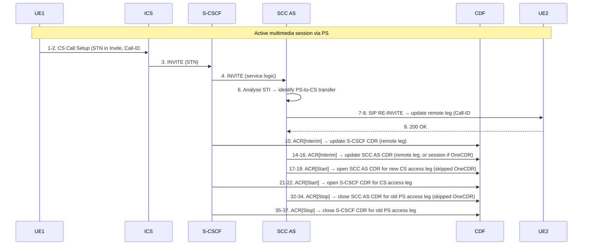

**Key:** The old PS access leg CDRs are closed with **special handling** (zero-rated IMS resource usage for access leg establishment); this can be done via ICID correlation with the SCC AS CDR.

### §5.2.2.1.13.6 Session Transfer from CS to PS

Reverse of §13.5: UE-1 moves session from CS to PS:
- INVITE (STD in INVITE) via P-CSCF → S-CSCF → SCC AS
- SCC AS RE-INVITEs remote leg to update media (Call-ID #2)
- New S-CSCF CDR + SCC AS CDR opened for new PS access leg
- Old CS access leg CDRs closed (same special handling / zero-rating pattern)

### §5.2.2.1.13.7 Session Transfer from PS to (CS+PS)

UE-1 splits an existing PS2 session into PS1+CS legs:
- INVITE (STL, Call-ID #1') → S-CSCF → SCC AS correlates with CS INVITE (STN, Call-ID #1")
- SCC AS combines the two access legs and RE-INVITEs the remote leg
- 57-step flow; new S-CSCF + AS CDRs for both PS1 (#1') and CS (#1") access legs
- Old PS2 access leg CDR closed (CDR[Stop])

### §5.2.2.1.13.8 Session Transfer from (CS+PS) to PS

UE-1 consolidates PS+CS back to PS only:
- SCC AS simultaneously releases CS access leg and PS2 access leg; retains new PS1 leg
- CDR[Start] for new PS1 access leg; CDR[Stop] for old PS2 and CS access legs (or OneCDR updates)

### §5.2.2.1.13.9 IMS Emergency Session Transfer from PS to CS

Nodes: **I-CSCF, EATF** (Emergency Access Transfer Function, acts as B2BUA), **E-CSCF**:
- ICS/interworking nodes → I-CSCF → EATF → E-CSCF
- EATF RE-INVITEs remote leg via E-CSCF (Call-ID #2 update)
- E-CSCF: ACR[Interim] to update E-CSCF CDR for remote leg
- EATF: ACR[Start] for new CS access leg (Call-ID #1') — or ACR[Interim] if OneChargingSession
- I-CSCF: ACR[Event] for new access leg
- Old CS access leg released: EATF ACR[Stop] for old Call-ID #1 (skipped if OneChargingSession); E-CSCF ACR[Stop] for old access leg

### §5.2.2.1.13.10 Inter-UE Transfer Triggered by Target UE

40-step flow; active session transferred from UE-1 to UE-2 without collaborative session establishment:
- SCC AS receives INVITE with STN from UE-2 (either PS or CS)
- SCC AS RE-INVITEs remote UE-3 to switch access to UE-2
- New S-CSCF + AS CDRs for UE-2 access leg; old UE-1 access leg CDRs closed (ACR[Stop])

---

## §5.2.2.1.14 Initiating Alternate Charged Party Call

An AS determines (via subscriber data or policy) that a call should be charged to a third party rather than the calling subscriber:

```mermaid
sequenceDiagram
    participant Caller
    participant AS
    participant CDF

    Caller->>AS: 1. INVITE
    Note over AS: Determine alternate charged party (Subscription-ID lookup + security assessment)
    AS->>Caller: 2. INVITE (with Alternate Party Identity)
    Caller-->>AS: 3. 200 OK
    AS->>CDF: 5. ACR[Start, Subscription-ID=AlternateParty] → open AS CDR
    CDF-->>AS: 6. ACA (CDR opened with alternate party identity)
    Note over Caller,CDF: Session established; billed to alternate party
```

- AS CDR records the **alternate party's Subscription-ID** rather than the originating UE's identity
- The CDF opens a CDR under the alternate party's account
- Security assessment is mandatory before allowing alternate-party charging

---

## §5.2.2.1.15 Session Establishment via IBCF (IMS-Initiated, Inter-Network)

Both Home IMS A and Home IMS B have an IBCF and an S-CSCF. The session traverses Home IMS A → IBCF → IBCF → Home IMS B:

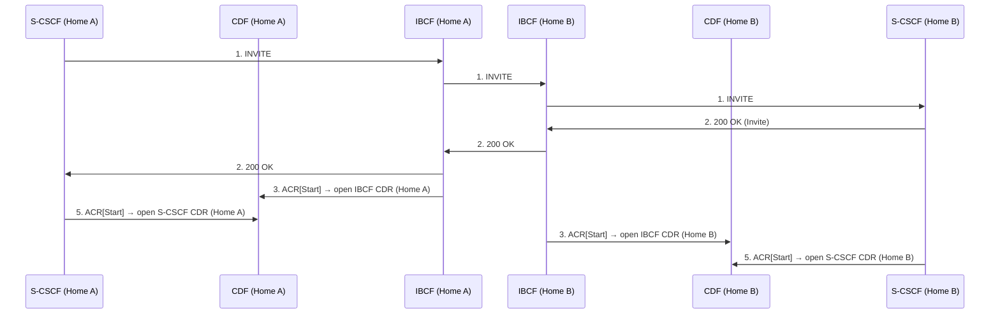

- Both network nodes (IBCF + S-CSCF) in **each IMS** independently record CDRs
- ICID propagated through IBCFs ensures cross-network correlation

---

## §5.2.2.1.16 AS Acting as MMTel AS

For details on charging when AS provides MMTEL services (CDIV, CONF, TIP/TIR), see **TS 32.275** [35].
This section is out of scope for TS 32.260 but the same CDR structure (Start/Stop or Event based on service) applies.

---

## §5.2.2.1.17 Session via IBCF to Third Party AS with RTTI (at Session Establishment)

A third-party AS in Home IMS B provides real-time tariff information (RTTI) in the SIP 200 OK response:
- The RTTI is embedded in the 200 OK body flowing back toward the originating S-CSCF
- Both IBCFs and both S-CSCFs open CDRs; the RTTI XML is captured in CDR[Start] via TS 32.280 mapping
- This applies to charging interconnect scenarios (TS 29.658)

---

## §5.2.2.1.18 Third Party AS Providing RTTI During Session (Mid-Session)

When RTTI is updated during an ongoing session (tariff change):

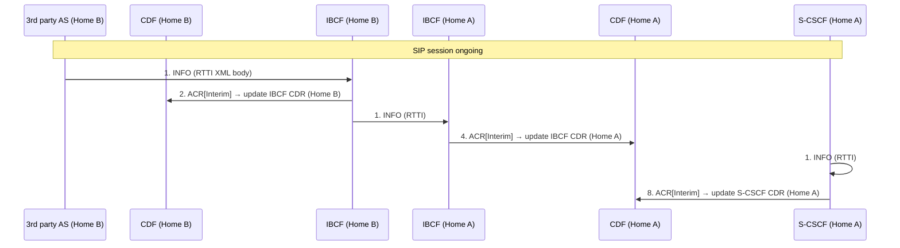

- Each IMS node receiving the SIP INFO with RTTI body sends an ACR[Interim]
- The RTTI XML is mapped to CDR fields per TS 32.280

---

## §5.2.2.1.19 Support of Optimal Media Routing (OMR)

**OMR** (TS 23.228 Annex Q) allows IMS-ALG nodes (P-CSCF/IMS-AGW, IBCF/TrGW) to remove unnecessary media gateways from the media path. The CDR records the outcome using two indicators:

| Indicator | Meaning |
|---|---|
| **Local GW Not Inserted** | GW was de-allocated; media bypasses the GW |
| **Local GW Inserted** | A local GW is retained in the media path |
| **IP realm Not Default** | A non-default IP realm is used for media |
| **Transcoder Inserted** | A transcoder was selected and inserted |
| **Transcoder Not Inserted** | Transcoder was offered but not selected |

### §5.2.2.1.19.1 IMS-ALG Bypasses Local GW (Session Establishment)

- IMS-ALG receives INVITE (SDP offer in realm R1) → interacts with GW → sends INVITE toward destination (realm R2)
- Destination answers with R1 realm address → local GW can be de-allocated
- IMS-ALG: ACR[Start] with **"Local GW Not Inserted" + "IP realm Not Default"**
- Media path: direct in realm R1 without GW

### §5.2.2.1.19.2 Alternate IP Realm Selected

- Destination answers with realm R3 (alternate) instead of R2 → GW2 retained
- IMS-ALG: ACR[Start] with **"Local GW Inserted" + "IP realm Not Default"**
- Two user-plane connections: R1 → GW2, and R3 ← GW2

### §5.2.2.1.19.3 OMR Mid-Session

- RE-INVITE or UPDATE triggers OMR re-evaluation
- IMS-ALG: ACR[Interim] with updated GW insertion/bypass status for new media path

### §5.2.2.1.19.4 OMR Transcoding (IBCF/TrGW Only)

- §19.4.1 — Transcoder offered and selected: ACR[Start] with **"Transcoder Inserted"**
- §19.4.2 — Transcoder offered but destination picks original codec: ACR[Start] with **"Transcoder Not Inserted"**; TrGW de-allocated

---

## §5.2.2.1.20 AS Acting as B2BUA — Single Charging Session (OneChargingSession)

When an AS acts as B2BUA it handles two dialog legs (Call-ID#inc = incoming, Call-ID#out = outgoing). The **OneChargingSession** option creates a single AS CDR for both legs:

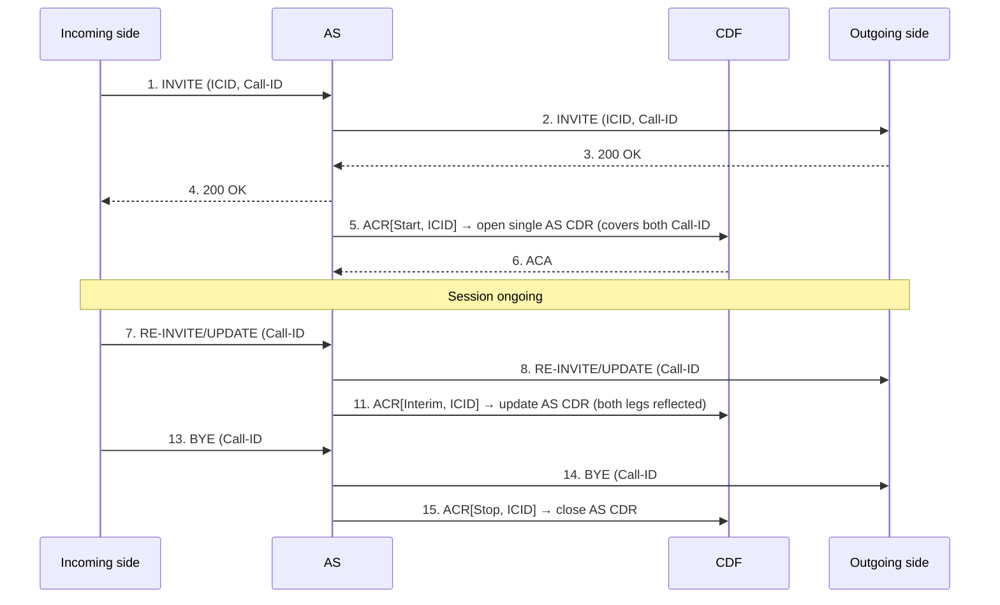

**Critical design:** The AS propagates the **same ICID** on both outgoing and incoming legs. This is what makes the OneChargingSession possible — the single ICID is the session identifier in the CDR, covering both Call-IDs.

---

## §5.2.2.1.21 Roaming Architecture — Voice over IMS with Local Breakout (LBO)

A complex VoLTE roaming scenario where the P-CSCF is in the visited network and media breakout is local. Multiple IBCFs and a **TRF** (Transit Routing Function) are involved in a loopback path:

**Participants (Visited Network A):** P-CSCF, TRF, IBCFs  
**Participants (Home Network A):** IBCFs, S-CSCF

**CDR structure:**
| Node | CDR content | NNI type |
|---|---|---|
| IBCF (Visited, toward terminating) | CDR[Start]: NNI(5) "non-roaming", "Loc GW Inserted" | NNI 5 |
| TRF (Visited) | CDR[Start]: NNI(4) "roaming loopback" | NNI 4 |
| IBCF (Visited, loopback toward Home) | CDR[Start]: NNI(4) "roaming loopback", "Loc GW Not Inserted" | NNI 4 |
| IBCF (Home, loopback from Visited) | CDR[Start]: NNI(3) "roaming loopback", "Loc GW Not Inserted" | NNI 3 |
| S-CSCF (Home) | CDR[Start]: NNI(3) "roaming loopback" | NNI 3 |
| IBCF (Home, non-loopback path) | CDR[Start]: NNI(2) "non-loopback", "Loc GW Not Inserted" | NNI 2 |
| IBCF (Visited, non-loopback path) | CDR[Start]: NNI(1) "non-loopback", "Loc GW Not Inserted" | NNI 1 |
| P-CSCF (Visited) | CDR[Start] | — |

**Key:** NNI identifiers distinguish loopback vs non-loopback media paths, enabling the billing domain to reconstruct the roaming topology from CDRs alone.

---

## §5.2.2.1.22 Service Continuity Using ATCF

The **ATCF** (Access Transfer Control Function) anchors media for access transfer in the visited network. It acts like the SCC AS for access layer continuity, using the same OneChargingSession concept.

### §5.2.2.1.22.1 UE Originating (CS Only) Through ATCF

- CS Call Setup → ATCF/ATGW (visited network) → IMS SCC AS (home network)
- ATCF sends ACR[Start] at 200 OK for **home leg** (Call-ID #2)
- ATCF sends ACR[Start] for **serving leg** (Call-ID #1) _(skipped if OneChargingSession)_
- OneChargingSession: single ATCF CDR covers both serving and home legs

### §5.2.2.1.22.1A UE Originating (PS Only) Through ATCF

- SIP INVITE → P-CSCF → ATCF/ATGW → SCC AS (home)
- ATCF sends single ACR[Start] → opens one ATCF CDR (PS-only, no splitting)

### §5.2.2.1.22.2 UE Terminating (CS Only) Through ATCF

- INVITE from SCC AS → ATCF → CS/PS intermediate nodes → UE
- ATCF: ACR[Start] for serving leg (Call-ID #1) at 200 OK
- OneChargingSession: ATCF CDR covers both serving and home legs

### §5.2.2.1.22.2A UE Terminating (PS Only) Through ATCF

- INVITE from SCC AS → ATCF → P-CSCF → UE
- Single ATCF CDR at 200 OK (no leg splitting needed)

### §5.2.2.1.22.3 UE Session Transfer PS to CS Using ATCF

40-step flow; UE moves from PS to CS while media is anchored in ATGW:
- ATCF configures ATGW for new CS resource → sends ACR[Start] for new serving CS leg
- OneChargingSession: ATCF sends ACR[Interim] updating session CDR with new CS serving leg
- ATCF sends ACR[Start] for new home CS leg
- Old PS access leg: ATCF ACR[Stop] for both serving and home PS legs _(skipped if OneChargingSession)_

### §5.2.2.1.22.4 UE Session Transfer CS to PS Using ATCF

- UE sends INVITE toward ATCF to move to PS
- ATCF: ACR[Start] for new PS serving leg + ACR[Start] for new PS home leg (or ACR[Interim] if OneChargingSession)
- Old CS access legs closed: ACR[Stop] for serving and home CS legs _(skipped if OneChargingSession)_

---

## §5.2.2.2 Error Cases

### §5.2.2.2.1 Session-Related SIP Error — Reception of SIP Error Messages

A SIP BYE with an error reason terminates the session abnormally:
- ACR[Stop] is sent with an **appropriate error indication** in the Charging Data Request
- All nodes in the session path close their CDRs with the error indication

### §5.2.2.2.2 Session-Related SIP Failure — SIP Session Failure

When a node detects a timeout or invalid SIP message that prevents session maintenance:
- The node sends SIP BYE toward both ends of the session
- **The node that sent the BYE** identifies the cause in its ACR[Stop]
- **Other nodes** that receive the BYE are unaware of the error; they treat it as normal session release

### §5.2.2.2.3 Session-Unrelated SIP Failure

If a session-unrelated procedure fails (SIP error response):
- The ACR[Event] includes an **appropriate error indication** in the Charging Data Request

### §5.2.2.2.4–7 Charging Data Transfer Errors

Error handling is delegated to the Rf protocol mechanisms in TS 32.299:
- **§5.2.2.2.4 CDF connection failure** → TS 32.299 §6.1.3.1 (failover to secondary CDF)
- **§5.2.2.2.5 No reply from CDF** → TS 32.299 §6.1.3.2 (retransmission with T-flag)
- **§5.2.2.2.6 Duplicate detection** → TS 32.299 §6.1.3.3 (Session-Id + CC-Request-Number check)
- **§5.2.2.2.7 CDF detected failure** → TS 32.299 §6.1.3.4

### §5.2.3 CDR Generation / §5.2.4 GTP' / §5.2.5 Bi

- **CDR generation** for Nchf converged charging: same as §5.4.4. For Rf offline CDR generation: FFS (Editor's Note)
- **GTP'**: Not used for IMS offline charging because CDF and CGF are combined into CCF (§4.2). Vendors may optionally separate them; if so, TS 32.295 applies
- **Bi CDR file transfer**: CGF consolidates CDRs from multiple ASes per SIP dialog before forwarding to Billing Domain; may elect to send or not send certain redundant CDRs

---

## Summary: CDR Type by Node and Scenario

| Node | Session CDRs (Start/Interim/Stop) | Event CDRs only |
|---|---|---|
| P-CSCF | All session scenarios | Session-unrelated methods |
| S-CSCF | All session scenarios | Session-unrelated methods |
| I-CSCF | — | Always event-only |
| BGCF | — | Always event-only |
| MGCF | All session scenarios (ISUP trigger) | — |
| MRFC | Conference sessions | — |
| SIP AS | Session services (voicemail, SCC) | Redirect/stateless services |
| IBCF, E-CSCF, TRF, ATCF | Session scenarios (context-dependent) | Session-unrelated |
| EATF | Session scenarios (emergency continuity) | — |

## Cross-References

- [IMS charging architecture](../concepts/IMS-charging-architecture.md) — ICID, IOI, SDP handling, charging method selection
- [IMS offline Rf protocol](../protocols/Rf-offline-charging.md) — ACR/ACA message formats, CDF stateless model
- [IMS online charging flows](IMS-online-charging-flows.md) — Ro/SCUR/ECUR/IEC flows (§5.3)
- [S-CSCF](../entities/S-CSCF.md) — S-CSCF CDR generation and iFC role
- [P-CSCF](../entities/P-CSCF.md) — P-CSCF CDR generation (Gm-side trigger)
- [MRFC/MRF](../entities/MRF.md) — Conference resource charging
- [TAS](../entities/TAS.md) — Application Server session and event charging
- [VoLTE MO call](VoLTE-MO-call.md) — SIP session flow (§5.5 of TS 23.228)
- [SRVCC from E-UTRAN](SRVCC-from-E-UTRAN.md) — Access transfer reference (TS 23.216)
